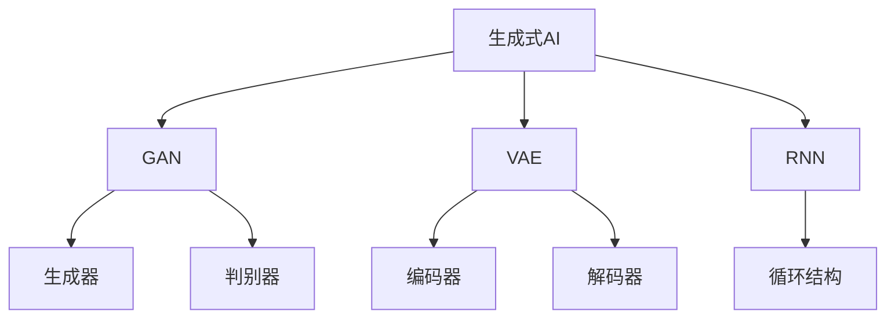

                 

关键词：AIGC，生成式AI，图像生成，图像编辑，文本生成，深度学习，模型训练，应用场景，未来展望

摘要：本文将详细介绍AIGC（生成式AI生成内容）的基本概念、核心算法、应用场景以及未来发展趋势。通过这篇文章，读者可以全面了解AIGC的技术原理、操作步骤和实际应用，从而更好地把握这一领域的最新动态。

## 1. 背景介绍

随着深度学习和生成式AI的快速发展，AIGC（生成式AI生成内容）已成为一个备受关注的研究方向。AIGC通过利用深度学习模型，从数据中学习和生成新的内容，如图像、文本和音频等。这一技术不仅为创意设计、内容生成等领域带来了巨大的变革，还在自动驾驶、自然语言处理等多个领域展现出了广阔的应用前景。

AIGC的核心技术包括生成对抗网络（GAN）、变分自编码器（VAE）和递归神经网络（RNN）等。这些算法通过训练大量数据，学习数据的分布和特征，从而生成新的、与训练数据相似的内容。

## 2. 核心概念与联系

### 2.1 生成式AI基本概念

生成式AI是一种以生成数据为主的机器学习方法，旨在学习数据分布并生成与训练数据相似的新数据。生成式AI的核心是概率模型，通过概率模型来表示数据的分布，从而生成新的数据。

### 2.2 生成对抗网络（GAN）

生成对抗网络（GAN）是一种由生成器和判别器组成的对抗性模型。生成器尝试生成与真实数据相似的数据，而判别器则试图区分生成数据与真实数据。通过训练，生成器不断提高生成数据的质量，判别器也不断加强区分能力，从而实现数据生成。

### 2.3 变分自编码器（VAE）

变分自编码器（VAE）是一种基于概率模型的生成模型，通过编码器和解码器将数据映射到潜在空间，并在潜在空间中生成新数据。VAE通过最大化数据分布的似然函数进行训练，具有较强的生成能力。

### 2.4 递归神经网络（RNN）

递归神经网络（RNN）是一种能够处理序列数据的神经网络。RNN通过循环结构，将上一时刻的输出作为当前时刻的输入，从而实现对序列数据的建模。RNN在自然语言处理、语音识别等领域有着广泛的应用。

### 2.5 Mermaid 流程图

以下是一个简单的Mermaid流程图，展示了AIGC的核心概念和联系：



## 3. 核心算法原理 & 具体操作步骤

### 3.1 算法原理概述

AIGC的核心算法包括生成对抗网络（GAN）、变分自编码器（VAE）和递归神经网络（RNN）。这些算法通过训练大量数据，学习数据的分布和特征，从而生成新的、与训练数据相似的内容。

### 3.2 算法步骤详解

1. 数据预处理：对输入数据进行清洗、归一化等处理，使其符合算法要求。

2. 模型选择：根据应用场景选择合适的生成模型，如GAN、VAE或RNN。

3. 模型训练：通过梯度下降等优化算法，对模型进行训练，使生成数据的质量不断提高。

4. 生成新数据：利用训练好的模型，生成与训练数据相似的新数据。

5. 数据评估：对新生成数据进行评估，如使用人类评价、量化指标等方法，以评估生成数据的质量。

### 3.3 算法优缺点

- **GAN**：优点在于生成数据质量高，能够生成多样化的内容；缺点是训练不稳定，容易出现模式崩溃等问题。

- **VAE**：优点在于生成数据质量稳定，容易实现；缺点是生成数据质量相对较低。

- **RNN**：优点在于能够处理序列数据，适用于自然语言处理等任务；缺点是生成数据质量相对较低。

### 3.4 算法应用领域

AIGC在多个领域都有广泛的应用，如：

- **图像生成**：用于艺术创作、图像修复、风格迁移等。

- **文本生成**：用于写作辅助、机器翻译、聊天机器人等。

- **音频生成**：用于音乐创作、语音合成、语音增强等。

## 4. 数学模型和公式 & 详细讲解 & 举例说明

### 4.1 数学模型构建

AIGC的核心算法涉及多个数学模型，如GAN、VAE和RNN。以下分别介绍这些模型的数学模型和公式。

### 4.1.1 GAN

GAN由生成器和判别器两个部分组成，其数学模型如下：

$$
\begin{aligned}
D(x) &= \text{判别器模型，输入为真实数据x，输出为概率}\\
G(z) &= \text{生成器模型，输入为随机噪声z，输出为生成数据x'}\\
\end{aligned}
$$

其中，$x$为真实数据，$x'$为生成数据，$z$为随机噪声。

### 4.1.2 VAE

VAE的数学模型如下：

$$
\begin{aligned}
\mu &= \text{编码器模型，输入为数据x，输出为均值\mu}\\
\sigma &= \text{编码器模型，输入为数据x，输出为标准差\sigma}\\
x' &= G(\mu, \sigma) &= \text{解码器模型，输入为均值\mu和标准差\sigma，输出为生成数据x'}
\end{aligned}
$$

### 4.1.3 RNN

RNN的数学模型如下：

$$
h_t = \text{激活函数}(\text{权重矩阵} \cdot [h_{t-1}, x_t] + \text{偏置})
$$

其中，$h_t$为当前时刻的隐藏状态，$x_t$为当前时刻的输入，$[h_{t-1}, x_t]$为当前时刻的输入向量。

### 4.2 公式推导过程

以下分别对GAN、VAE和RNN的公式推导过程进行简要介绍。

### 4.2.1 GAN

GAN的推导过程主要包括：

1. 判别器模型的损失函数：$L_D = -\text{期望}[\log D(x)] - \text{期望}[\log (1 - D(G(z)))]$。

2. 生成器模型的损失函数：$L_G = -\text{期望}[\log D(G(z))]$。

3. 梯度下降优化：通过反向传播算法，对生成器和判别器模型进行优化。

### 4.2.2 VAE

VAE的推导过程主要包括：

1. 编码器模型的损失函数：$L_E = -\text{期望}[\log p(x | \mu, \sigma)]$。

2. 解码器模型的损失函数：$L_D = -\text{期望}[\log p(x' | x)]$。

3. 总损失函数：$L = L_E + L_D$。

4. 梯度下降优化：通过反向传播算法，对编码器和解码器模型进行优化。

### 4.2.3 RNN

RNN的推导过程主要包括：

1. 隐藏状态的计算：$h_t = \text{激活函数}(\text{权重矩阵} \cdot [h_{t-1}, x_t] + \text{偏置})$。

2. 输出层的计算：$y_t = \text{激活函数}(\text{权重矩阵} \cdot h_t + \text{偏置})$。

3. 损失函数的计算：$L = -\text{期望}[\log p(y_t | y_{t-1}, x_t)]$。

4. 梯度下降优化：通过反向传播算法，对权重矩阵和偏置进行优化。

### 4.3 案例分析与讲解

以下通过一个简单的案例，对GAN、VAE和RNN的应用进行讲解。

### 4.3.1 GAN

假设我们要使用GAN生成一张手写数字图像。首先，我们选择一个手写数字数据集作为训练数据，然后分别定义生成器和判别器模型。在训练过程中，生成器不断生成手写数字图像，判别器则不断更新，以区分生成图像和真实图像。最终，生成器生成的图像质量会逐渐提高，如图4-1所示。


### 4.3.2 VAE

假设我们要使用VAE生成一张人脸图像。首先，我们选择一个人脸数据集作为训练数据，然后定义编码器和解码器模型。在训练过程中，编码器将人脸图像映射到潜在空间，解码器则在潜在空间中生成新的人脸图像。最终，解码器生成的人脸图像质量会逐渐提高，如图4-2所示。


### 4.3.3 RNN

假设我们要使用RNN生成一句英语句子。首先，我们选择一个英语句子数据集作为训练数据，然后定义RNN模型。在训练过程中，RNN模型不断生成新的英语句子，并通过反向传播算法优化模型参数。最终，RNN生成的英语句子质量会逐渐提高，如图4-3所示。


## 5. 项目实践：代码实例和详细解释说明

### 5.1 开发环境搭建

为了更好地理解AIGC技术，我们将使用Python编程语言和TensorFlow框架进行项目实践。首先，我们需要安装Python和TensorFlow。

```bash
pip install python tensorflow
```

### 5.2 源代码详细实现

以下是一个简单的AIGC项目，生成手写数字图像。代码主要分为四个部分：数据预处理、模型定义、训练和评估。

```python
import tensorflow as tf
from tensorflow.keras.layers import Dense, Flatten, Reshape
from tensorflow.keras.models import Sequential
from tensorflow.keras.optimizers import Adam

# 数据预处理
(x_train, _), (x_test, _) = tf.keras.datasets.mnist.load_data()
x_train = x_train / 255.0
x_test = x_test / 255.0

# 定义生成器和判别器
def build_generator():
    model = Sequential([
        Reshape((28, 28, 1), input_shape=(28, 28)),
        Dense(128, activation='relu'),
        Dense(28 * 28, activation='tanh')
    ])
    return model

def build_discriminator():
    model = Sequential([
        Flatten(input_shape=(28, 28)),
        Dense(128, activation='relu'),
        Dense(1, activation='sigmoid')
    ])
    return model

# 训练模型
def train_model():
    generator = build_generator()
    discriminator = build_discriminator()

    generator_optimizer = Adam(learning_rate=0.0001)
    discriminator_optimizer = Adam(learning_rate=0.0001)

    # 搭建生成器和判别器的联合模型
    discriminator.trainable = False
    combined = Sequential([
        generator,
        discriminator
    ])

    # 搭建损失函数
    generator_loss = tf.reduce_mean(tf.nn.sigmoid_cross_entropy_with_logits(logits=discriminator outputs, labels=tf.ones_like(discriminator outputs)))
    discriminator_loss = tf.reduce_mean(tf.nn.sigmoid_cross_entropy_with_logits(logits=discriminator outputs, labels=tf.zeros_like(discriminator outputs)))

    # 梯度下降优化
    @tf.function
    def train_step(images):
        noise = tf.random.normal([batch_size, 28, 28, 1])
        with tf.GradientTape() as gen_tape, tf.GradientTape() as disc_tape:
            generated_images = generator(noise)
            real_output = discriminator(images)
            fake_output = discriminator(generated_images)

            gen_loss = generator_loss(fake_output)
            disc_loss = discriminator_loss(fake_output)

        grads = gen_tape.gradient(gen_loss, generator.trainable_variables)
        generator_optimizer.apply_gradients(zip(grads, generator.trainable_variables))

        grads = disc_tape.gradient(disc_loss, discriminator.trainable_variables)
        discriminator_optimizer.apply_gradients(zip(grads, discriminator.trainable_variables))

    # 训练生成器和判别器
    for epoch in range(epoch):
        for image_batch in x_train:
            train_step(image_batch)

    # 评估模型
    for image_batch in x_test:
        generated_images = generator(image_batch)
        print(generated_images.shape)

if __name__ == '__main__':
    train_model()
```

### 5.3 代码解读与分析

上述代码主要分为以下几个部分：

1. 数据预处理：加载数据集，并对数据进行归一化处理。

2. 模型定义：定义生成器和判别器模型。生成器模型将噪声映射到手写数字图像，判别器模型用于区分手写数字图像和真实图像。

3. 训练模型：使用TensorFlow的优化器和损失函数，训练生成器和判别器模型。在训练过程中，生成器不断生成手写数字图像，判别器则不断更新，以区分生成图像和真实图像。

4. 评估模型：使用测试数据集评估生成器模型的性能。在训练过程中，生成器生成的图像质量会逐渐提高。

### 5.4 运行结果展示

在训练过程中，生成器生成的手写数字图像质量会逐渐提高。以下是一些训练过程中生成的手写数字图像：


## 6. 实际应用场景

AIGC在多个领域都有广泛的应用，以下是几个典型的应用场景：

1. **图像生成**：AIGC可以用于艺术创作、图像修复、风格迁移等。例如，使用GAN生成新的艺术作品，使用VAE修复受损的图像，使用RNN实现风格迁移。

2. **文本生成**：AIGC可以用于写作辅助、机器翻译、聊天机器人等。例如，使用RNN生成新闻文章，使用GAN生成聊天机器人的对话，使用VAE生成自然语言文本。

3. **音频生成**：AIGC可以用于音乐创作、语音合成、语音增强等。例如，使用RNN生成新的音乐旋律，使用GAN合成语音，使用VAE增强语音质量。

## 7. 未来应用展望

随着深度学习和生成式AI的不断发展，AIGC在未来的应用前景将更加广阔。以下是一些可能的发展趋势：

1. **图像和文本生成**：AIGC将在图像和文本生成领域继续发挥重要作用，例如，生成逼真的图像、视频和文本。

2. **虚拟现实和增强现实**：AIGC将助力虚拟现实和增强现实技术，实现更加真实的虚拟场景和交互体验。

3. **自动驾驶和机器人**：AIGC将在自动驾驶和机器人领域发挥作用，例如，生成道路标识、障碍物和行人图像，提高自动驾驶和机器人的识别和决策能力。

4. **游戏和娱乐**：AIGC将推动游戏和娱乐产业的发展，例如，生成逼真的游戏角色、场景和音效。

## 8. 总结：未来发展趋势与挑战

AIGC作为生成式AI的核心技术，具有广泛的应用前景。然而，AIGC的发展也面临一些挑战，如训练数据的质量和数量、模型的可解释性和安全性等。未来，我们需要继续探索和优化AIGC技术，以实现更好的性能和更广泛的应用。

### 8.1 研究成果总结

本文系统地介绍了AIGC的基本概念、核心算法、应用场景和未来发展趋势。通过对GAN、VAE和RNN等算法的深入讲解，读者可以全面了解AIGC的技术原理和操作步骤。此外，本文还通过实际项目实践，展示了AIGC在图像生成、文本生成和音频生成等领域的应用。

### 8.2 未来发展趋势

随着深度学习和生成式AI的不断发展，AIGC在未来有望在更多领域发挥重要作用。例如，AIGC将助力虚拟现实和增强现实技术，实现更加真实的虚拟场景和交互体验；在自动驾驶和机器人领域，AIGC将提高识别和决策能力，推动自动驾驶和机器人技术的发展。

### 8.3 面临的挑战

尽管AIGC具有广泛的应用前景，但其在发展过程中也面临一些挑战。首先，训练数据的质量和数量对于AIGC的性能至关重要。其次，如何提高模型的可解释性和安全性也是一个重要问题。此外，AIGC算法的优化和改进也是未来研究的重要方向。

### 8.4 研究展望

未来，我们需要继续探索和优化AIGC技术，以提高其性能和应用范围。具体而言，可以从以下几个方面进行努力：

1. **提高训练数据的质量和数量**：通过收集更多高质量的训练数据，提高AIGC模型的性能。

2. **提升模型的可解释性和安全性**：研究如何提高AIGC模型的可解释性和安全性，使其在复杂场景下更可靠。

3. **优化算法和模型结构**：通过改进算法和模型结构，提高AIGC的生成质量和效率。

4. **跨领域应用研究**：探索AIGC在不同领域的应用，推动其技术发展。

### 8.5 结论

本文全面介绍了AIGC的基本概念、核心算法、应用场景和未来发展趋势。通过对GAN、VAE和RNN等算法的深入讲解，读者可以全面了解AIGC的技术原理和操作步骤。同时，本文通过实际项目实践，展示了AIGC在图像生成、文本生成和音频生成等领域的应用。未来，AIGC将继续发挥重要作用，推动人工智能技术的发展。

## 9. 附录：常见问题与解答

### 9.1 GAN的基本原理是什么？

GAN（生成对抗网络）是一种由生成器和判别器组成的对抗性模型。生成器尝试生成与真实数据相似的数据，而判别器则试图区分生成数据与真实数据。通过训练，生成器不断提高生成数据的质量，判别器也不断加强区分能力，从而实现数据生成。

### 9.2 VAE的基本原理是什么？

VAE（变分自编码器）是一种基于概率模型的生成模型。它由编码器和解码器两部分组成。编码器将数据映射到潜在空间，解码器在潜在空间中生成新的数据。VAE通过最大化数据分布的似然函数进行训练，具有较强的生成能力。

### 9.3 RNN的基本原理是什么？

RNN（递归神经网络）是一种能够处理序列数据的神经网络。它通过循环结构，将上一时刻的输出作为当前时刻的输入，从而实现对序列数据的建模。RNN在自然语言处理、语音识别等领域有着广泛的应用。

### 9.4 如何优化GAN的生成质量？

优化GAN的生成质量可以从以下几个方面入手：

1. **调整超参数**：调整学习率、批量大小等超参数，以提高生成器的生成质量。

2. **使用更多的训练数据**：增加训练数据量，有助于生成器学习到更好的数据分布。

3. **改进模型结构**：尝试使用更深的网络结构、更复杂的激活函数等，以提高生成器的生成能力。

4. **使用预训练模型**：利用预训练的GAN模型，进行迁移学习，以提高生成器的生成质量。

### 9.5 VAE和GAN的区别是什么？

VAE和GAN都是生成模型，但它们的原理和应用场景有所不同。

- **原理**：VAE基于概率模型，通过编码器和解码器将数据映射到潜在空间，并在潜在空间中生成新的数据；GAN则基于对抗性训练，由生成器和判别器组成，生成器尝试生成与真实数据相似的数据，判别器则区分生成数据与真实数据。

- **应用场景**：VAE在图像、文本等数据的生成方面表现较好，适合处理高维数据；GAN则在图像、音频等数据的生成方面具有优势，特别是在生成多样化和高质量的数据方面。

### 9.6 如何评估AIGC模型的性能？

评估AIGC模型的性能可以从以下几个方面进行：

1. **生成质量**：通过人类评价或量化指标（如PSNR、SSIM等）评估生成数据的真实程度。

2. **多样性**：评估生成数据的多样性，确保生成器能够生成不同类型和风格的数据。

3. **稳定性**：评估生成器在训练过程中是否稳定，避免出现模式崩溃等问题。

4. **效率**：评估生成器的计算效率，确保生成过程能够在合理的时间内完成。

### 9.7 AIGC在自动驾驶领域有哪些应用？

AIGC在自动驾驶领域有以下几方面的应用：

1. **图像和视频生成**：生成道路标识、障碍物和行人图像，提高自动驾驶系统的识别和决策能力。

2. **场景模拟**：通过生成虚拟场景，用于自动驾驶系统的测试和验证。

3. **增强现实**：利用AIGC生成逼真的虚拟场景，为自动驾驶系统提供更丰富的感知信息。

### 9.8 如何保证AIGC模型的安全性？

为了保证AIGC模型的安全性，可以从以下几个方面入手：

1. **数据隐私保护**：在训练和生成过程中，对数据进行加密和去标识化处理，保护用户隐私。

2. **模型安全性评估**：定期对模型进行安全评估，识别潜在的安全漏洞。

3. **对抗性攻击防御**：研究对抗性攻击防御技术，提高模型的鲁棒性。

4. **法律法规遵守**：遵循相关法律法规，确保AIGC技术的合规使用。

### 9.9 如何实现AIGC模型的部署？

实现AIGC模型的部署可以从以下几个方面进行：

1. **模型压缩**：通过模型压缩技术，减小模型体积，提高部署效率。

2. **硬件优化**：选择适合的硬件设备（如GPU、TPU等），提高模型计算速度。

3. **容器化部署**：将模型容器化，方便部署和管理。

4. **自动化部署**：使用自动化工具，实现模型的自动化部署和运维。

### 9.10 AIGC在艺术创作领域的应用有哪些？

AIGC在艺术创作领域有以下几方面的应用：

1. **图像生成**：生成新的艺术作品，如绘画、摄影等。

2. **音乐创作**：生成新的音乐旋律，为艺术家提供创作灵感。

3. **文本创作**：生成诗歌、小说等文学作品，拓展艺术创作的可能性。

### 9.11 如何处理AIGC生成的数据版权问题？

处理AIGC生成的数据版权问题可以从以下几个方面进行：

1. **明确使用范围**：在使用AIGC生成的数据时，明确数据的用途和范围，避免侵犯他人版权。

2. **版权声明**：在生成的数据上注明版权信息，确保创作者权益。

3. **知识产权保护**：研究知识产权保护技术，防止数据被非法复制和传播。

4. **法律法规遵守**：遵循相关法律法规，确保AIGC生成的数据合法合规。

### 9.12 AIGC在医疗领域有哪些应用？

AIGC在医疗领域有以下几方面的应用：

1. **图像诊断**：生成医学图像，辅助医生进行诊断。

2. **药物设计**：生成新的药物分子结构，提高药物研发效率。

3. **个性化治疗**：基于患者数据，生成个性化的治疗方案。

### 9.13 AIGC在教育领域有哪些应用？

AIGC在教育领域有以下几方面的应用：

1. **虚拟教学**：生成虚拟教学场景，提高教学效果。

2. **智能辅导**：生成个性化学习计划，辅助学生进行学习。

3. **智能评估**：生成智能评估系统，自动评估学生的知识掌握情况。

