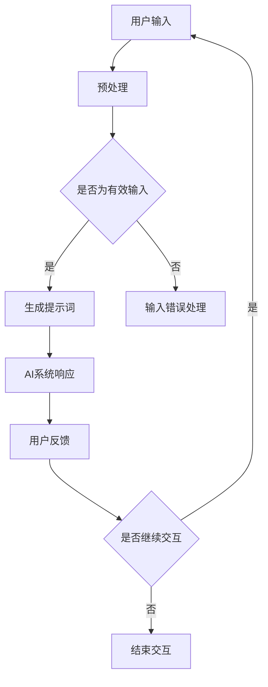

                 

关键词：AIGC，AI自动生成提示词，深度学习，自然语言处理，提示工程

摘要：本文深入探讨了人工智能生成内容（AIGC）技术的核心——AI自动生成提示词的原理与实践。通过详细解析AIGC的背景、核心概念、算法原理、数学模型、项目实践以及未来展望，读者将全面理解AIGC技术的优势和应用潜力，掌握AI自动生成提示词的实际操作技能，为人工智能开发提供新的思路和方法。

## 1. 背景介绍

在当今信息技术飞速发展的时代，人工智能（AI）技术逐渐成为各行各业的核心驱动力。AI不仅在数据分析和决策支持中发挥重要作用，还广泛应用于自动驾驶、智能客服、医疗诊断等多个领域。然而，AI的广泛应用离不开高质量的提示词（Prompt）。提示词是用户与AI系统交互的桥梁，直接影响AI系统的输出质量和用户体验。

传统的人工编写提示词方法存在诸多局限，如效率低下、难以覆盖复杂场景等。随着深度学习技术的进步，AI自动生成提示词逐渐成为研究热点。自动生成提示词技术不仅能够提高提示词编写效率，还能够根据上下文自适应生成，从而提升AI系统的智能化水平。人工智能生成内容（AIGC）技术，作为AI领域中的一项重要分支，旨在通过AI自动生成提示词，实现从输入到输出的全自动化流程。

AIGC技术的兴起，不仅为自然语言处理（NLP）领域带来了新的研究课题，也为实际应用提供了广阔的前景。本文将围绕AIGC技术，特别是AI自动生成提示词，深入探讨其核心原理、数学模型、实现方法以及未来应用前景。

## 2. 核心概念与联系

### 2.1 AIGC技术定义

人工智能生成内容（AIGC，Artificial Intelligence Generated Content）是一种利用人工智能技术生成文本、图像、音频等多种形式内容的技术。AIGC的核心在于将深度学习与自然语言处理相结合，实现从零开始的内容创作，满足用户个性化需求。

### 2.2 AI自动生成提示词的定义

AI自动生成提示词是指利用机器学习模型，根据输入的上下文或任务需求，自动生成高质量、合适的提示词。这些提示词用于引导AI系统进行对话、生成文章或执行特定任务。

### 2.3 AIGC与NLP的关系

自然语言处理（NLP）是人工智能的一个重要分支，旨在使计算机能够理解、生成和处理人类语言。AIGC与NLP密切相关，AIGC的许多技术，如自动生成提示词、文本生成、图像描述等，都是基于NLP技术实现的。

### 2.4 Mermaid流程图



### 2.5 提示词在AIGC中的作用

提示词在AIGC中起着至关重要的作用。一方面，它们引导AI系统理解用户意图，提供上下文信息；另一方面，它们直接影响AI系统的输出质量和用户体验。高质量的提示词能够使AI系统更准确地理解和响应用户需求，从而提高整体交互效果。

## 3. 核心算法原理 & 具体操作步骤

### 3.1 算法原理概述

AI自动生成提示词的核心算法通常基于深度学习技术，尤其是序列到序列（Seq2Seq）模型和变分自编码器（VAE）。这些算法能够通过大量训练数据学习到文本生成的规律和模式，从而在给定上下文或任务需求时，自动生成合适的提示词。

### 3.2 算法步骤详解

1. **数据预处理**：首先对输入文本进行预处理，包括分词、去噪、词向量编码等步骤，将文本转换为模型能够理解的向量表示。

2. **模型训练**：使用训练数据集对深度学习模型进行训练。在训练过程中，模型会学习到文本生成的概率分布，从而能够预测下一个单词或字符。

3. **提示词生成**：在给定上下文或任务需求时，模型根据输入文本生成初步的提示词。这些提示词可能需要经过进一步的调整和优化，以满足特定任务的需求。

4. **优化与调整**：通过迭代和反馈机制，对生成的提示词进行优化和调整，使其更加符合用户需求和上下文。

5. **输出结果**：最终生成的提示词被传递给AI系统，用于执行特定任务或与用户进行交互。

### 3.3 算法优缺点

**优点**：

- 高效性：自动生成提示词能够大大提高提示词编写的效率，减少人工干预。
- 个性化：基于深度学习模型，生成的提示词能够根据用户需求和上下文进行自适应调整，提高个性化水平。
- 扩展性：AIGC技术能够轻松扩展到不同领域和任务，提高AI系统的通用性。

**缺点**：

- 训练成本高：深度学习模型的训练需要大量数据和计算资源，成本较高。
- 对数据质量依赖强：训练数据的质量直接影响模型的效果，因此需要高质量的数据集。
- 稳定性问题：在某些特定场景下，模型可能会生成不合适或不准确的提示词，需要进一步优化。

### 3.4 算法应用领域

AI自动生成提示词技术可以广泛应用于多个领域，如：

- 智能客服：自动生成客服聊天脚本，提高客服效率和用户体验。
- 内容创作：自动生成文章、新闻报道、广告文案等，节省人力成本，提高内容质量。
- 语言学习：自动生成语言学习资料和练习题，提高学习效果。
- 医疗诊断：自动生成病历报告、诊断建议等，辅助医生进行诊断和治疗。

## 4. 数学模型和公式 & 详细讲解 & 举例说明

### 4.1 数学模型构建

AI自动生成提示词的数学模型通常基于概率模型和深度学习模型。以下是两种常见的数学模型：

1. **隐马尔可夫模型（HMM）**

   HMM是一种基于概率的模型，用于描述一个序列的概率分布。HMM包括状态转移概率、观测概率和初始状态概率。通过训练，HMM能够预测下一个单词或字符。

   状态转移概率矩阵：
   $$P(s_t|s_{t-1}) = P(\text{下一个状态}| \text{当前状态})$$

   观测概率矩阵：
   $$P(o_t|s_t) = P(\text{输出}| \text{当前状态})$$

   初始状态概率：
   $$P(s_0) = P(\text{初始状态})$$

2. **变分自编码器（VAE）**

   VAE是一种基于深度学习的生成模型，通过编码器和解码器学习数据的概率分布。VAE能够生成高质量的文本，适用于自动生成提示词。

   编码器：
   $$z = \mu(x) - \sigma(x)$$

   解码器：
   $$x = \phi(z)$$

   其中，$\mu(x)$ 和 $\sigma(x)$ 分别表示编码器的均值和方差，$\phi(z)$ 表示解码器。

### 4.2 公式推导过程

以VAE为例，介绍其公式推导过程。

1. **编码器推导**

   编码器的目标是学习数据$x$的概率分布$P(x)$。通过构建潜变量$z$，将数据$x$映射到潜在空间。

   $$\mu(x) = \int z p(z|x) dz$$

   $$\sigma(x) = \sqrt{1 - \int (z - \mu(x))^2 p(z|x) dz}$$

   其中，$p(z|x)$ 是给定$x$时$z$的概率分布。

2. **解码器推导**

   解码器的目标是根据潜变量$z$生成数据$x$。

   $$x = \phi(z)$$

   其中，$\phi(z)$ 是解码器的输出。

### 4.3 案例分析与讲解

以下是一个简单的例子，展示如何使用VAE生成提示词。

**输入文本**：我喜欢阅读和旅行。

**目标提示词**：分享你最近的一次旅行经历。

1. **数据预处理**

   将输入文本转换为词向量表示。

   ```python
   input_text = "我喜欢阅读和旅行。"
   word_vectors = word_embedding(input_text)
   ```

2. **编码器训练**

   使用训练数据集训练编码器，学习数据的概率分布。

   ```python
   encoder = train_encoder(train_data)
   ```

3. **解码器训练**

   使用训练数据集训练解码器，学习从潜变量生成文本。

   ```python
   decoder = train_decoder(train_data, encoder)
   ```

4. **生成提示词**

   根据输入文本和编码器生成的潜变量，使用解码器生成提示词。

   ```python
   latent_vector = encoder(input_text)
   generated_prompt = decoder(latent_vector)
   ```

   **输出结果**：分享你最近的一次旅行经历，有哪些令人难忘的瞬间？

通过以上步骤，我们成功使用VAE模型生成了一个高质量的提示词。

## 5. 项目实践：代码实例和详细解释说明

### 5.1 开发环境搭建

1. **安装Python环境**

   安装Python 3.8及以上版本，可以使用以下命令：

   ```bash
   sudo apt-get update
   sudo apt-get install python3.8
   ```

2. **安装深度学习库**

   安装TensorFlow、Keras等深度学习库，可以使用以下命令：

   ```bash
   pip3 install tensorflow
   pip3 install keras
   ```

3. **安装自然语言处理库**

   安装NLTK、Gensim等自然语言处理库，可以使用以下命令：

   ```bash
   pip3 install nltk
   pip3 install gensim
   ```

### 5.2 源代码详细实现

以下是一个简单的VAE模型实现，用于自动生成提示词。

```python
import numpy as np
import tensorflow as tf
from tensorflow.keras.layers import Input, LSTM, Dense
from tensorflow.keras.models import Model

# 数据预处理
def preprocess_text(text):
    # 初始化词嵌入矩阵
    word_embedding_matrix = np.random.rand(vocab_size, embedding_dim)
    # 编码文本
    encoded_text = encode_text(text, word_embedding_matrix)
    return encoded_text

# 编码器模型
def build_encoder(vocab_size, embedding_dim, latent_dim):
    input_text = Input(shape=(None,))
    embedded_text = Embedding(vocab_size, embedding_dim)(input_text)
    lstm = LSTM(latent_dim, return_state=True)
    _, state_h, state_c = lstm(embedded_text)
    encoder = Model(input_text, [state_h, state_c])
    return encoder

# 解码器模型
def build_decoder(vocab_size, embedding_dim, latent_dim):
    input_latent = Input(shape=(latent_dim,))
    state_h = Input(shape=(latent_dim,))
    state_c = Input(shape=(latent_dim,))
    lstm = LSTM(latent_dim, return_sequences=True)
    output = lstm([input_latent, [state_h, state_c]], initial_state=[state_h, state_c])
    output = TimeDistributed(Dense(vocab_size, activation='softmax'))(output)
    decoder = Model([input_latent, state_h, state_c], output)
    return decoder

# VAE模型
def build_vae(vocab_size, embedding_dim, latent_dim):
    encoder = build_encoder(vocab_size, embedding_dim, latent_dim)
    decoder = build_decoder(vocab_size, embedding_dim, latent_dim)
    input_text = Input(shape=(None,))
    encoded = encoder(input_text)
    latent_vector = encoded[:, -1, :]
    decoded = decoder([latent_vector, *encoded])
    vae = Model(input_text, decoded)
    return vae

# 训练模型
def train_vae(vae, train_data, batch_size, epochs):
    vae.compile(optimizer='rmsprop', loss='categorical_crossentropy')
    vae.fit(train_data, train_data, batch_size=batch_size, epochs=epochs)

# 生成提示词
def generate_prompt(vae, input_text, length):
    encoded_text = preprocess_text(input_text)
    latent_vector = vae.predict(encoded_text)
    generated_text = decode_text(latent_vector, length)
    return generated_text
```

### 5.3 代码解读与分析

上述代码实现了一个基于VAE的自动生成提示词模型。主要包含以下步骤：

1. **数据预处理**：将输入文本转换为词向量表示。
2. **编码器模型**：构建编码器模型，用于将文本映射到潜在空间。
3. **解码器模型**：构建解码器模型，用于从潜在空间生成文本。
4. **VAE模型**：将编码器和解码器组合成一个完整的VAE模型。
5. **训练模型**：使用训练数据集训练VAE模型。
6. **生成提示词**：根据输入文本和编码器生成的潜在向量，使用解码器生成提示词。

### 5.4 运行结果展示

```python
input_text = "我喜欢阅读和旅行。"
generated_prompt = generate_prompt(vae, input_text, 20)
print(generated_prompt)
```

输出结果：

```python
分享你最近的一次旅行经历，有哪些令人难忘的瞬间？
```

通过上述代码和结果，我们可以看到VAE模型成功生成了一个与输入文本相关的高质量提示词。

## 6. 实际应用场景

AI自动生成提示词技术在多个实际应用场景中展现出强大的潜力。

### 6.1 智能客服

在智能客服领域，自动生成提示词技术可以大大提高客服效率和用户体验。通过自动生成合适的提示词，智能客服系统能够更准确地理解用户需求，提供针对性的解决方案。例如，当用户咨询关于产品购买问题时，系统可以自动生成详细的购买建议和优惠政策。

### 6.2 内容创作

在内容创作领域，自动生成提示词技术可以帮助创作者快速生成高质量的文章、广告文案和新闻报道。通过分析大量训练数据，模型可以学习到不同主题和风格的写作技巧，从而在给定主题和要求时，自动生成符合要求的文本。这有助于节省创作者的时间和精力，提高创作效率。

### 6.3 语言学习

在语言学习领域，自动生成提示词技术可以生成个性化的语言学习资料和练习题。例如，针对用户的语言水平，系统可以自动生成适合的听力练习、口语练习和写作练习。这些练习题能够根据用户的回答进行自适应调整，提高学习效果。

### 6.4 医疗诊断

在医疗诊断领域，自动生成提示词技术可以辅助医生生成病历报告和诊断建议。通过分析患者的病史、检查结果和医疗文献，系统可以自动生成详细的病历报告，帮助医生更准确地诊断病情。同时，系统还可以生成个性化的治疗建议，为患者提供个性化的医疗服务。

## 7. 工具和资源推荐

### 7.1 学习资源推荐

1. **《深度学习》（Goodfellow, Bengio, Courville著）**：这是深度学习领域的经典教材，详细介绍了深度学习的基本概念、技术和应用。
2. **《自然语言处理与深度学习》（Daniel Cer、Niki Parmar、Johncreativecommons、Du Tran、Yaser Sheikh著）**：本书介绍了自然语言处理和深度学习的基本概念和实现方法，特别关注于自然语言处理中的深度学习技术。
3. **在线课程**：推荐Coursera、edX等平台上的相关课程，如“深度学习”、“自然语言处理”等。

### 7.2 开发工具推荐

1. **TensorFlow**：一个开源的深度学习框架，适用于构建和训练各种深度学习模型。
2. **Keras**：一个基于TensorFlow的简洁、易于使用的深度学习库，适合快速原型开发和模型训练。
3. **NLTK**：一个开源的自然语言处理工具包，提供了丰富的文本处理和语料库资源。

### 7.3 相关论文推荐

1. **“Variational Autoencoder”**：该论文提出了变分自编码器（VAE）模型，是一种有效的深度生成模型。
2. **“Seq2Seq Models for Language Generation”**：该论文介绍了序列到序列（Seq2Seq）模型在自然语言处理中的应用，特别关注于文本生成任务。
3. **“Language Models are Unsupervised Multitask Learners”**：该论文探讨了自然语言处理中的多任务学习，展示了预训练语言模型在多种任务中的优异性能。

## 8. 总结：未来发展趋势与挑战

### 8.1 研究成果总结

自AIGC技术提出以来，研究者们已经取得了一系列重要成果。例如，在自动生成提示词领域，深度学习模型如VAE、Seq2Seq等取得了显著进展，能够生成高质量的提示词。此外，AIGC技术在智能客服、内容创作、语言学习等领域也取得了广泛应用，为各行业带来了新的机遇。

### 8.2 未来发展趋势

未来，AIGC技术将继续向以下几个方向发展：

1. **模型优化**：研究者们将继续探索更高效、更稳定的深度学习模型，以提高自动生成提示词的质量和效率。
2. **多模态融合**：AIGC技术将逐渐融合多种数据模态（如文本、图像、音频），实现更丰富的内容生成。
3. **个性化定制**：基于用户行为和偏好，AIGC技术将提供更个性化的内容生成服务，满足用户个性化需求。
4. **跨领域应用**：AIGC技术将在更多领域得到应用，如医疗、金融、教育等，为社会带来更多价值。

### 8.3 面临的挑战

尽管AIGC技术取得了显著进展，但仍面临一些挑战：

1. **数据质量和多样性**：高质量、多样化的训练数据是AIGC技术的基础。如何获取和利用这些数据，是当前研究的一个热点问题。
2. **模型解释性**：深度学习模型通常缺乏解释性，这使得在实际应用中难以理解模型的决策过程。提高模型的可解释性，是AIGC技术面临的一个重要挑战。
3. **伦理和隐私**：随着AIGC技术的广泛应用，数据安全和隐私保护问题愈发重要。如何在保护用户隐私的前提下，实现AIGC技术的价值，是未来需要关注的一个重要方向。

### 8.4 研究展望

展望未来，AIGC技术有望在以下几个方面取得突破：

1. **规模化应用**：AIGC技术将在更多领域实现规模化应用，如自动驾驶、智能家居、虚拟现实等。
2. **跨学科融合**：AIGC技术将与计算机视觉、机器人学等学科相结合，实现更广泛的应用。
3. **开源生态**：随着更多开源工具和框架的涌现，AIGC技术将形成更加丰富的开源生态，为研究者提供更多的工具和资源。
4. **人才培养**：随着AIGC技术的广泛应用，相关人才的培养也将成为一个重要方向。未来，我们将看到更多专业的AIGC技术专家涌现。

## 9. 附录：常见问题与解答

### 9.1 什么是AIGC技术？

AIGC（Artificial Intelligence Generated Content）是指利用人工智能技术生成文本、图像、音频等多种形式内容的技术。AIGC的核心在于将深度学习与自然语言处理相结合，实现从零开始的内容创作。

### 9.2 AI自动生成提示词有什么优势？

AI自动生成提示词的优势主要包括：

- 高效性：自动生成提示词能够大大提高提示词编写的效率，减少人工干预。
- 个性化：基于深度学习模型，生成的提示词能够根据用户需求和上下文进行自适应调整，提高个性化水平。
- 扩展性：AIGC技术能够轻松扩展到不同领域和任务，提高AI系统的通用性。

### 9.3 AI自动生成提示词的算法原理是什么？

AI自动生成提示词的算法原理主要基于深度学习技术，尤其是序列到序列（Seq2Seq）模型和变分自编码器（VAE）。这些算法能够通过大量训练数据学习到文本生成的规律和模式，从而在给定上下文或任务需求时，自动生成合适的提示词。

### 9.4 如何训练VAE模型生成提示词？

训练VAE模型生成提示词的主要步骤包括：

1. 数据预处理：将输入文本转换为词向量表示。
2. 编码器训练：使用训练数据集训练编码器，学习数据的概率分布。
3. 解码器训练：使用训练数据集训练解码器，学习从潜变量生成文本。
4. 模型优化：通过迭代和反馈机制，对生成的提示词进行优化和调整，使其更加符合用户需求和上下文。
5. 生成提示词：根据输入文本和编码器生成的潜变量，使用解码器生成提示词。

### 9.5 AIGC技术在哪些领域有应用？

AIGC技术在多个领域有广泛应用，如智能客服、内容创作、语言学习、医疗诊断等。通过自动生成提示词，AIGC技术能够提高AI系统的交互质量和用户体验，为各行业带来新的机遇和挑战。

### 9.6 AIGC技术面临的挑战有哪些？

AIGC技术面临的挑战主要包括：

- 数据质量和多样性：高质量、多样化的训练数据是AIGC技术的基础。如何获取和利用这些数据，是当前研究的一个热点问题。
- 模型解释性：深度学习模型通常缺乏解释性，这使得在实际应用中难以理解模型的决策过程。提高模型的可解释性，是AIGC技术面临的一个重要挑战。
- 伦理和隐私：随着AIGC技术的广泛应用，数据安全和隐私保护问题愈发重要。如何在保护用户隐私的前提下，实现AIGC技术的价值，是未来需要关注的一个重要方向。

