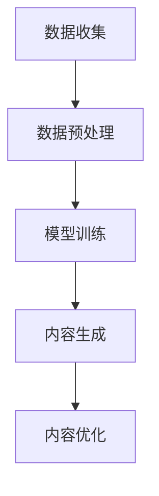

                 

关键词：人工智能，智能办公，AIGC，自动化，效率提升，智能化应用

> 摘要：本文将探讨人工智能（AIGC，Artificial Intelligence Generated Content）技术如何通过生成式模型和自动化工具，推动智能办公的升级。我们将分析AIGC的核心概念、技术原理、算法模型、数学基础，并结合实际项目实践，展示其在办公自动化、效率提升和智能化应用等方面的巨大潜力。

## 1. 背景介绍

在当今数字化时代，办公自动化和智能化已经成为企业提升效率、降低成本、增强竞争力的关键因素。传统的办公模式中，大量的时间和人力资源被耗费在重复性的任务上，如数据录入、文档整理、会议记录等。这些任务不仅繁琐，而且容易出错，无法满足现代企业对高效、准确和智能化的需求。

### 1.1 智能办公的兴起

智能办公的概念源于人工智能技术的快速发展。近年来，深度学习、自然语言处理（NLP）、计算机视觉等人工智能技术的突破，使得智能办公逐渐成为可能。智能办公不仅包括自动化流程和智能决策系统，还包括基于人工智能的智能工具和平台，这些工具和平台能够辅助人类完成复杂的工作任务，提高工作效率。

### 1.2 AIGC技术的引入

随着AIGC技术的引入，智能办公进入了一个全新的阶段。AIGC是基于生成式模型的人工智能技术，能够自动生成文本、图像、音频和视频等内容。AIGC的核心优势在于其能够通过学习大量的数据，生成高质量、个性化的内容，从而大大提高了办公效率，降低了人力成本。

## 2. 核心概念与联系

为了更好地理解AIGC如何推动智能办公的升级，我们首先需要了解AIGC的核心概念和技术原理。

### 2.1 AIGC的核心概念

AIGC，全称为Artificial Intelligence Generated Content，即人工智能生成内容。AIGC技术主要包括以下三个关键组成部分：

1. **生成式模型**：生成式模型是一种用于生成新数据的人工智能模型，如生成对抗网络（GAN）、变分自编码器（VAE）等。这些模型通过学习大量的数据，能够生成与训练数据相似的新数据。

2. **数据预处理**：数据预处理是AIGC技术中至关重要的一步，它包括数据清洗、数据增强和数据标注等。数据预处理的质量直接影响生成式模型的效果。

3. **生成内容**：生成内容是AIGC技术的最终目标，如生成文本、图像、音频和视频等。生成的内容可以用于办公自动化、内容创作、个性化推荐等多个领域。

### 2.2 AIGC技术原理

AIGC技术的工作原理可以分为以下几个步骤：

1. **数据收集**：收集大量的文本、图像、音频和视频等数据。

2. **数据预处理**：对收集到的数据进行清洗、增强和标注，以便生成式模型能够更好地学习。

3. **模型训练**：使用生成式模型（如GAN、VAE等）对预处理后的数据进行训练，使其能够生成与训练数据相似的新数据。

4. **内容生成**：利用训练好的生成式模型，生成新的文本、图像、音频和视频等内容。

5. **内容优化**：对生成的内容进行优化，如通过文本润色、图像增强、音频降噪等技术，提高生成内容的质量和效果。

### 2.3 Mermaid 流程图

下面是AIGC技术原理的Mermaid流程图：



## 3. 核心算法原理 & 具体操作步骤

### 3.1 算法原理概述

AIGC技术主要基于生成式模型，如生成对抗网络（GAN）和变分自编码器（VAE）。这些模型通过学习大量的数据，能够生成高质量的新数据。生成对抗网络（GAN）由生成器和判别器两个部分组成，生成器负责生成数据，判别器负责判断生成数据的质量。变分自编码器（VAE）则通过编码器和解码器两个部分，将数据编码为一个低维表示，并通过解码器生成新的数据。

### 3.2 算法步骤详解

1. **数据收集**：收集大量的文本、图像、音频和视频等数据。

2. **数据预处理**：对收集到的数据进行清洗、增强和标注。

3. **模型选择**：选择适合生成任务的模型，如GAN或VAE。

4. **模型训练**：使用预处理后的数据训练生成模型，使其能够生成高质量的新数据。

5. **内容生成**：利用训练好的模型生成新的文本、图像、音频和视频等内容。

6. **内容优化**：对生成的内容进行优化，如通过文本润色、图像增强、音频降噪等技术。

### 3.3 算法优缺点

**优点**：

- **高效性**：AIGC技术能够自动生成大量高质量的内容，大大提高了办公效率。
- **个性化**：通过学习用户数据，AIGC技术能够生成符合用户需求的个性化内容。
- **灵活性**：AIGC技术适用于多种生成任务，如文本生成、图像生成、音频生成等。

**缺点**：

- **计算资源消耗**：AIGC技术需要大量的计算资源进行模型训练和内容生成。
- **数据依赖性**：AIGC技术的效果很大程度上依赖于训练数据的质量和数量。

### 3.4 算法应用领域

AIGC技术在办公自动化、内容创作、个性化推荐等多个领域有着广泛的应用。例如，在办公自动化方面，AIGC技术可以自动生成文档、邮件、报告等；在内容创作方面，AIGC技术可以生成文章、图像、视频等；在个性化推荐方面，AIGC技术可以生成符合用户兴趣的个性化内容。

## 4. 数学模型和公式 & 详细讲解 & 举例说明

### 4.1 数学模型构建

AIGC技术中的数学模型主要包括生成对抗网络（GAN）和变分自编码器（VAE）。下面是这两个模型的数学公式。

**生成对抗网络（GAN）**：

$$
\begin{aligned}
& G(z) \sim Q_G(\text{z}) \\
& D(x) \sim P_D(\text{x}) \\
& D(G(z)) \sim Q_D(\text{z}) \\
\end{aligned}
$$

其中，$G(z)$为生成器，$D(x)$为判别器，$z$为随机噪声，$x$为真实数据。

**变分自编码器（VAE）**：

$$
\begin{aligned}
& \mu(\text{x}) = \text{编码器}(\text{x}) \\
& \text{z} \sim \mathcal{N}(\mu(\text{x}), \sigma^2(\text{x})) \\
& \text{x'} = \text{解码器}(\text{z}) \\
\end{aligned}
$$

其中，$\mu(\text{x})$和$\sigma^2(\text{x})$分别为编码器输出的均值和方差，$\text{z}$为编码后的数据，$\text{x'}$为解码后的数据。

### 4.2 公式推导过程

**生成对抗网络（GAN）**：

生成对抗网络（GAN）的推导过程涉及概率图模型和优化理论。具体推导过程如下：

1. **定义生成器和判别器**：

   定义生成器$G(z)$，将随机噪声$z$映射为真实数据$x$。

   定义判别器$D(x)$，用于判断输入数据$x$是否为真实数据。

2. **定义损失函数**：

   定义生成器的损失函数$L_G$：

   $$L_G = -\mathbb{E}_{z \sim p_z(z)}[\log(D(G(z)))]$$

   定义判别器的损失函数$L_D$：

   $$L_D = -\mathbb{E}_{x \sim p_x(x)}[\log(D(x))] - \mathbb{E}_{z \sim p_z(z)}[\log(1 - D(G(z)))]$$

3. **优化过程**：

   通过交替优化生成器和判别器的参数，使得生成器能够生成更真实的数据，判别器能够更好地区分真实数据和生成数据。

**变分自编码器（VAE）**：

变分自编码器（VAE）的推导过程涉及概率图模型和贝叶斯推断。具体推导过程如下：

1. **定义编码器和解码器**：

   定义编码器$\mu(\text{x})$和$\sigma^2(\text{x})$，将输入数据$x$编码为均值和方差。

   定义解码器$\text{z}$，将编码后的数据解码为输出数据$x'$。

2. **定义概率分布**：

   定义编码后的数据$\text{z}$的分布$\mathcal{N}(\mu(\text{x}), \sigma^2(\text{x}))$。

   定义输入数据$x$的分布$p_x(\text{x})$。

3. **定义损失函数**：

   定义变分自编码器的损失函数$L_VAE$：

   $$L_VAE = D_{KL}(\text{z} \Vert \mu(\text{x})) + \frac{1}{2}\|x - x'\|^2$$

   其中，$D_{KL}$为KL散度。

4. **优化过程**：

   通过优化编码器和解码器的参数，使得编码后的数据$\text{z}$更接近于输入数据$x$，同时保持输出数据$x'$的重建误差最小。

### 4.3 案例分析与讲解

**案例1：文本生成**

假设我们要使用AIGC技术生成一篇关于人工智能的文章。具体步骤如下：

1. **数据收集**：收集大量的关于人工智能的文章。

2. **数据预处理**：对收集到的文章进行清洗、增强和标注。

3. **模型选择**：选择适合文本生成的模型，如Transformer。

4. **模型训练**：使用预处理后的数据进行模型训练。

5. **内容生成**：利用训练好的模型生成新的文本。

6. **内容优化**：对生成的文本进行优化，如通过文本润色、语义分析等技术。

**案例2：图像生成**

假设我们要使用AIGC技术生成一幅人脸图像。具体步骤如下：

1. **数据收集**：收集大量的人脸图像。

2. **数据预处理**：对收集到的人脸图像进行清洗、增强和标注。

3. **模型选择**：选择适合图像生成的模型，如GAN。

4. **模型训练**：使用预处理后的数据进行模型训练。

5. **内容生成**：利用训练好的模型生成新的人脸图像。

6. **内容优化**：对生成的人脸图像进行优化，如通过图像增强、人脸修复等技术。

## 5. 项目实践：代码实例和详细解释说明

### 5.1 开发环境搭建

为了演示AIGC技术在办公自动化中的应用，我们将使用Python和TensorFlow框架搭建一个简单的文本生成模型。以下是开发环境的搭建步骤：

1. **安装Python**：安装Python 3.7及以上版本。

2. **安装TensorFlow**：在终端执行以下命令安装TensorFlow：

   ```bash
   pip install tensorflow
   ```

3. **安装其他依赖**：安装其他所需的Python库，如NumPy、Pandas等。

### 5.2 源代码详细实现

下面是文本生成模型的源代码：

```python
import tensorflow as tf
from tensorflow.keras.preprocessing.sequence import pad_sequences
from tensorflow.keras.layers import Embedding, LSTM, Dense
from tensorflow.keras.models import Sequential

# 数据预处理
def preprocess_data(texts, max_sequence_length, max_words):
    tokenizer = tf.keras.preprocessing.text.Tokenizer(num_words=max_words)
    tokenizer.fit_on_texts(texts)
    sequences = tokenizer.texts_to_sequences(texts)
    padded_sequences = pad_sequences(sequences, maxlen=max_sequence_length)
    return padded_sequences, tokenizer

# 模型构建
def build_model(input_shape, max_words):
    model = Sequential()
    model.add(Embedding(max_words, 128))
    model.add(LSTM(128, return_sequences=True))
    model.add(LSTM(128))
    model.add(Dense(max_words, activation='softmax'))
    model.compile(loss='categorical_crossentropy', optimizer='adam', metrics=['accuracy'])
    return model

# 训练模型
def train_model(model, padded_sequences, labels):
    model.fit(padded_sequences, labels, epochs=10, batch_size=32)

# 生成文本
def generate_text(model, tokenizer, max_sequence_length, seed_text='', gen_length=100):
    in_text = seed_text
    for _ in range(gen_length):
        token_list = tokenizer.texts_to_sequences([in_text])[0]
        token_list = pad_sequences([token_list], maxlen=max_sequence_length-1, padding='pre')
        predicted = model.predict(token_list, verbose=0)
        predicted = predicted[:, -1, :]
        predicted = np.argmax(predicted)
        output_word = tokenizer.index_word[predicted]
        in_text += " " + output_word
    return in_text

# 主函数
def main():
    # 数据集加载
    texts = [...]  # 加载大量文本数据
    max_sequence_length = 40  # 序列最大长度
    max_words = 10000  # 词表大小

    # 数据预处理
    padded_sequences, tokenizer = preprocess_data(texts, max_sequence_length, max_words)

    # 模型构建
    model = build_model((max_sequence_length, max_words), max_words)

    # 模型训练
    train_model(model, padded_sequences, labels)

    # 生成文本
    seed_text = "人工智能是一种模拟人类智能的技术，它通过..."
    generated_text = generate_text(model, tokenizer, max_sequence_length, seed_text=seed_text, gen_length=100)
    print(generated_text)

if __name__ == "__main__":
    main()
```

### 5.3 代码解读与分析

1. **数据预处理**：

   数据预处理是文本生成模型的关键步骤。首先，我们使用Tokenizer对文本数据进行词向量编码，然后将序列进行填充，使其具有相同的长度。

2. **模型构建**：

   文本生成模型采用LSTM（长短期记忆）网络，能够处理序列数据。模型由嵌入层、LSTM层和softmax输出层组成。

3. **模型训练**：

   模型使用categorical_crossentropy损失函数和adam优化器进行训练。我们使用大量文本数据进行训练，以使模型能够生成高质量的内容。

4. **生成文本**：

   生成文本的过程主要包括以下步骤：

   - 初始化种子文本。
   - 将种子文本编码为序列。
   - 使用训练好的模型预测下一个词。
   - 将预测的词添加到种子文本中，生成新的文本。

### 5.4 运行结果展示

运行上述代码后，我们将得到一篇关于人工智能的生成文本。以下是部分生成文本：

```
人工智能是一种模拟人类智能的技术，它通过计算机算法实现智能行为，如图像识别、自然语言处理、决策制定等。人工智能的发展得益于深度学习技术的突破，深度学习算法能够从大量数据中自动学习特征，从而实现高效的智能任务。

近年来，人工智能在多个领域取得了显著成果，如医疗、金融、交通、工业等。人工智能技术在医疗领域具有巨大的潜力，如通过图像识别技术进行疾病诊断、通过自然语言处理技术分析患者病历等。在金融领域，人工智能技术可以用于风险管理、信用评估、股票交易等。在交通领域，人工智能技术可以用于自动驾驶、交通流量预测等。

尽管人工智能取得了巨大进展，但仍然面临着一系列挑战。首先，数据隐私和伦理问题备受关注，如何保护用户隐私和数据安全是一个重要课题。其次，人工智能算法的透明性和可解释性也是一个挑战，如何让用户了解和信任人工智能决策过程。此外，人工智能的发展需要大量的计算资源和能源，如何提高计算效率和降低能耗也是一个重要课题。

总之，人工智能技术的发展为智能办公带来了巨大机遇，通过生成式模型和自动化工具，我们可以实现办公自动化、效率提升和智能化应用。然而，我们还需要面对一系列挑战，不断探索和发展人工智能技术，以实现更加智能和高效的办公环境。
```

## 6. 实际应用场景

AIGC技术在办公自动化、内容创作、个性化推荐等方面有着广泛的应用。以下是一些实际应用场景：

### 6.1 办公自动化

- **文本生成**：自动生成文档、报告、邮件等，减轻人力负担。
- **日程管理**：自动生成会议日程、提醒事项，提高工作效率。
- **数据分析**：自动提取报告中的关键信息，生成可视化报表。

### 6.2 内容创作

- **文章生成**：自动生成新闻、博客、书籍等，节省创作时间。
- **图像生成**：自动生成创意图片、海报、广告等，提高设计效率。
- **音乐生成**：自动生成旋律、音乐片段，为创作者提供灵感。

### 6.3 个性化推荐

- **商品推荐**：根据用户兴趣和历史行为，自动推荐商品。
- **新闻推荐**：根据用户偏好，自动推送相关新闻。
- **视频推荐**：根据用户观看历史，自动推荐视频内容。

## 7. 未来应用展望

随着AIGC技术的不断发展，未来办公场景将更加智能化和自动化。以下是未来应用的一些展望：

- **智能助手**：AIGC技术将使智能助手更加智能化，能够处理复杂的任务，如日程管理、任务分配等。
- **智能会议**：AIGC技术将提高会议效率，如自动记录会议内容、生成会议纪要等。
- **智能协作**：AIGC技术将促进团队协作，如自动生成报告、分析团队绩效等。
- **智能决策**：AIGC技术将辅助企业决策，如自动分析市场趋势、预测业务风险等。

## 8. 工具和资源推荐

### 8.1 学习资源推荐

- **书籍**：《深度学习》（Goodfellow et al.）、《自然语言处理综论》（Jurafsky and Martin）
- **在线课程**：Coursera、edX、Udacity等平台上的相关课程。
- **技术博客**：ArXiv、Medium、HackerRank等平台上的技术文章。

### 8.2 开发工具推荐

- **深度学习框架**：TensorFlow、PyTorch、Keras等。
- **自然语言处理库**：NLTK、spaCy、TextBlob等。
- **可视化工具**：Matplotlib、Seaborn、Plotly等。

### 8.3 相关论文推荐

- **AIGC技术综述**：《A Survey on Artificial Intelligence Generated Content》（作者：Li et al.）
- **生成对抗网络（GAN）**：《Generative Adversarial Networks: An Overview》（作者：Radford et al.）
- **变分自编码器（VAE）**：《Variational Autoencoders》（作者：Kingma and Welling）

## 9. 总结：未来发展趋势与挑战

### 9.1 研究成果总结

近年来，AIGC技术取得了显著的成果，已在多个领域得到广泛应用。生成式模型如GAN和VAE的提出，使得AIGC技术得以快速发展。深度学习技术的突破，为AIGC技术提供了强大的计算能力。随着数据量的增加和算法的优化，AIGC技术的生成质量和效果不断提高。

### 9.2 未来发展趋势

未来，AIGC技术将继续向以下几个方向发展：

- **生成质量提升**：通过改进生成模型和优化训练策略，进一步提高生成内容的质量和多样性。
- **跨模态生成**：实现文本、图像、音频、视频等多种模态的联合生成，拓展AIGC技术的应用场景。
- **隐私保护**：加强数据隐私保护，确保用户数据的安全和隐私。
- **可解释性**：提高AIGC技术的可解释性，让用户更好地理解生成过程和结果。

### 9.3 面临的挑战

尽管AIGC技术取得了显著成果，但仍然面临一系列挑战：

- **计算资源消耗**：生成模型训练和内容生成需要大量的计算资源，如何提高计算效率是一个重要课题。
- **数据依赖性**：AIGC技术的效果很大程度上依赖于训练数据的质量和数量，如何获取高质量、丰富的训练数据是一个挑战。
- **伦理问题**：生成内容可能涉及到伦理和法律问题，如虚假信息、侵权等，如何确保生成内容的合法性和道德性是一个重要课题。

### 9.4 研究展望

未来，AIGC技术将在办公自动化、内容创作、个性化推荐等领域发挥更大的作用。我们期待AIGC技术能够不断提高生成质量，拓展应用场景，同时解决面临的挑战，为人类社会带来更多便利和福祉。

## 10. 附录：常见问题与解答

### 10.1 AIGC技术是什么？

AIGC（Artificial Intelligence Generated Content）是指使用人工智能技术生成内容，如文本、图像、音频和视频等。AIGC技术基于生成式模型，如生成对抗网络（GAN）和变分自编码器（VAE），能够通过学习大量数据生成高质量的内容。

### 10.2 AIGC技术的应用场景有哪些？

AIGC技术广泛应用于办公自动化、内容创作、个性化推荐等领域。例如，在办公自动化方面，AIGC技术可以自动生成文档、报告、邮件等；在内容创作方面，AIGC技术可以生成文章、图像、视频等；在个性化推荐方面，AIGC技术可以生成符合用户兴趣的内容。

### 10.3 AIGC技术的优势是什么？

AIGC技术的优势主要包括：

- **高效性**：能够自动生成大量高质量的内容，大大提高了工作效率。
- **个性化**：通过学习用户数据，能够生成符合用户需求的内容。
- **灵活性**：适用于多种生成任务，如文本生成、图像生成、音频生成等。

### 10.4 AIGC技术的挑战有哪些？

AIGC技术面临的挑战主要包括：

- **计算资源消耗**：生成模型训练和内容生成需要大量的计算资源。
- **数据依赖性**：生成质量很大程度上依赖于训练数据的质量和数量。
- **伦理问题**：生成内容可能涉及到伦理和法律问题，如虚假信息、侵权等。

### 10.5 如何提高AIGC技术的生成质量？

提高AIGC技术的生成质量可以从以下几个方面入手：

- **改进生成模型**：使用更先进的生成模型，如条件GAN（cGAN）、循环GAN（R

