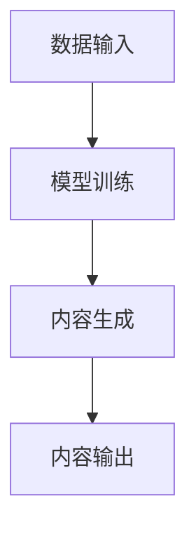

                 

关键词：人工智能，生成内容，法律伦理，AIGC技术，挑战与展望。

> 摘要：随着AIGC（AI Generated Content）技术的飞速发展，人工智能在内容创作中的应用越来越广泛。然而，随之而来的法律与伦理问题也日益凸显。本文旨在探讨AIGC时代的法律与伦理挑战，分析其现状、问题及应对策略，并展望未来的发展趋势。

## 1. 背景介绍

人工智能（AI）作为21世纪最具革命性的技术之一，已经在众多领域取得了显著的成果。从简单的机器人到复杂的智能系统，AI的应用范围越来越广泛。近年来，生成内容（Generated Content，GC）技术逐渐成为AI研究的热点之一。AIGC，即AI Generated Content，是指通过人工智能技术自动生成各种类型的内容，如图像、文本、音频、视频等。

AIGC技术的出现极大地改变了内容创作的模式。一方面，它提高了内容生成的效率和多样性；另一方面，也带来了法律与伦理上的挑战。首先，AIGC技术可能会侵犯他人的知识产权，引发版权纠纷。其次，AIGC生成的内容可能存在偏见、歧视等问题，违背伦理道德。此外，AIGC技术在应用过程中也可能涉及隐私保护、用户信任等法律和伦理问题。

## 2. 核心概念与联系

### 2.1 AIGC技术原理

AIGC技术主要依赖于深度学习、自然语言处理、计算机视觉等AI技术。通过大量的数据训练，AIGC模型可以学会生成高质量的内容。具体来说，AIGC技术包括以下几个核心组成部分：

- **数据输入**：从互联网、数据库等渠道获取大量的文本、图像、音频等数据。
- **模型训练**：使用深度学习算法对数据进行训练，使模型能够自动生成内容。
- **内容生成**：通过模型生成文字、图片、音频、视频等多种类型的内容。

### 2.2 AIGC与相关技术的关联

AIGC技术与其他AI技术如自然语言处理（NLP）、计算机视觉（CV）等密切相关。NLP技术负责处理和理解人类语言，是AIGC技术生成文本内容的基础；CV技术负责处理和分析图像、视频数据，是AIGC技术生成视觉内容的关键。

### 2.3 AIGC技术的Mermaid流程图



## 3. 核心算法原理 & 具体操作步骤

### 3.1 算法原理概述

AIGC技术的核心在于模型训练和内容生成。模型训练过程中，通过大量的数据训练神经网络，使其具备自动生成内容的能力。具体来说，可以分为以下几个步骤：

1. **数据预处理**：对原始数据进行清洗、去重、分词、图像处理等预处理操作。
2. **模型选择**：选择适合的神经网络架构，如Transformer、GPT、GAN等。
3. **模型训练**：使用预处理后的数据训练神经网络，优化模型参数。
4. **内容生成**：通过训练好的模型生成文字、图像、音频、视频等内容。

### 3.2 算法步骤详解

1. **数据预处理**：
   - **文本数据**：进行分词、去停用词、词向量化等操作。
   - **图像数据**：进行图像预处理，如尺寸调整、灰度化、滤波等。
   - **音频数据**：进行音频处理，如降噪、分割、特征提取等。

2. **模型选择**：
   - **文本生成**：选择适合的文本生成模型，如GPT、BERT等。
   - **图像生成**：选择适合的图像生成模型，如GAN、VGG等。
   - **音频生成**：选择适合的音频生成模型，如WaveNet、Tacotron等。

3. **模型训练**：
   - **文本生成**：通过训练数据更新模型参数，优化生成效果。
   - **图像生成**：通过对抗训练生成高质量的图像。
   - **音频生成**：通过神经网络生成自然流畅的音频。

4. **内容生成**：
   - **文本生成**：生成文章、新闻、小说等文本内容。
   - **图像生成**：生成图像、视频等视觉内容。
   - **音频生成**：生成语音、音乐等音频内容。

### 3.3 算法优缺点

**优点**：
- **高效性**：AIGC技术可以快速生成大量内容，大大提高了内容创作的效率。
- **多样性**：AIGC技术可以生成各种类型的内容，满足多样化的需求。
- **创新性**：AIGC技术可以创造出新颖的内容，激发创意。

**缺点**：
- **版权问题**：AIGC技术可能会侵犯他人的知识产权，引发法律纠纷。
- **道德风险**：AIGC技术生成的内容可能存在偏见、歧视等问题，违背伦理道德。
- **隐私泄露**：AIGC技术在应用过程中可能涉及用户隐私，存在隐私泄露的风险。

### 3.4 算法应用领域

AIGC技术在多个领域得到了广泛应用，包括但不限于：

- **媒体内容创作**：用于生成新闻、文章、小说、广告等。
- **游戏开发**：用于生成游戏剧情、角色、场景等。
- **艺术设计**：用于生成绘画、音乐、影视作品等。
- **教育领域**：用于生成课件、教案、学习资料等。

## 4. 数学模型和公式 & 详细讲解 & 举例说明

### 4.1 数学模型构建

AIGC技术涉及到多种数学模型，如神经网络模型、生成对抗网络（GAN）等。以下以GAN为例，介绍其数学模型构建。

GAN由两个神经网络组成：生成器（Generator）和判别器（Discriminator）。生成器的目标是从随机噪声中生成真实数据，而判别器的目标是区分真实数据和生成数据。

- **生成器**：G(z) → X_G
  - 输入：随机噪声z
  - 输出：生成的假数据X_G

- **判别器**：D(x) → probability
  - 输入：真实数据x或生成数据X_G
  - 输出：概率值，表示x为真实数据的置信度

### 4.2 公式推导过程

GAN的训练过程可以看作是一个博弈过程，生成器和判别器相互对抗，目标是最大化各自的损失函数。

- **生成器的损失函数**：
  $$ L_G = -\log(D(G(z))) $$

- **判别器的损失函数**：
  $$ L_D = -[\log(D(x)) + \log(1 - D(G(z)))] $$

- **总损失函数**：
  $$ L = L_G + L_D $$

### 4.3 案例分析与讲解

以图像生成为例，使用GAN生成一张现实中的动物图片。

1. **数据预处理**：
   - 收集大量动物图像作为训练数据。
   - 对图像进行预处理，如尺寸调整、归一化等。

2. **模型训练**：
   - **生成器**：从随机噪声中生成动物图像。
   - **判别器**：区分真实动物图像和生成图像。

3. **内容生成**：
   - 使用训练好的生成器生成一张动物图片。

4. **效果评估**：
   - 使用判别器评估生成图片的质量。

## 5. 项目实践：代码实例和详细解释说明

### 5.1 开发环境搭建

- **Python**：安装Python 3.8及以上版本。
- **TensorFlow**：安装TensorFlow 2.5及以上版本。
- **GAN库**：安装GAN库（可选）。

### 5.2 源代码详细实现

```python
import tensorflow as tf
from tensorflow.keras.layers import Dense, Flatten, Reshape
from tensorflow.keras.models import Sequential

# 生成器模型
def generator_model(z_dim):
    model = Sequential()
    model.add(Dense(128, input_dim=z_dim))
    model.add(LeakyReLU(alpha=0.01))
    model.add(Dense(256))
    model.add(LeakyReLU(alpha=0.01))
    model.add(Dense(512))
    model.add(LeakyReLU(alpha=0.01))
    model.add(Dense(1024))
    model.add(LeakyReLU(alpha=0.01))
    model.add(Dense(784, activation='tanh'))
    model.add(Reshape((28, 28, 1)))
    return model

# 判别器模型
def discriminator_model(img_shape):
    model = Sequential()
    model.add(Flatten(input_shape=img_shape))
    model.add(Dense(1024))
    model.add(LeakyReLU(alpha=0.01))
    model.add(Dense(512))
    model.add(LeakyReLU(alpha=0.01))
    model.add(Dense(256))
    model.add(LeakyReLU(alpha=0.01))
    model.add(Dense(1, activation='sigmoid'))
    return model

# GAN模型
def gand_model(discriminator, generator, z_dim):
    model = Sequential()
    model.add(generator)
    model.add(discriminator)
    return model

# 编译模型
def compile_models(generator, discriminator, z_dim):
    generator.compile(loss='binary_crossentropy', optimizer=optimizers.Adam(0.0001, 0.5))
    discriminator.compile(loss='binary_crossentropy', optimizer=optimizers.Adam(0.0001, 0.5))
    gand_model = gand_model(discriminator, generator, z_dim)
    gand_model.compile(loss='binary_crossentropy', optimizer=optimizers.Adam(0.0001, 0.5))
    return generator, discriminator, gand_model

# 主程序
def main():
    z_dim = 100
    img_shape = (28, 28, 1)

    generator = generator_model(z_dim)
    discriminator = discriminator_model(img_shape)
    generator, discriminator, gand_model = compile_models(generator, discriminator, z_dim)

    z = tf.random.normal([batch_size, z_dim])
    noise = tf.random.normal([batch_size, z_dim])

    # 训练生成器和判别器
    for epoch in range(num_epochs):
        for _ in range(num_d_steps):
            x = load_data(batch_size)
            z = tf.random.normal([batch_size, z_dim])
            with tf.GradientTape() as gen_tape, tf.GradientTape() as disc_tape:
                x_fake = generator(z)
                disc_real_logits = discriminator(x)
                disc_fake_logits = discriminator(x_fake)
                disc_loss = tf.reduce_mean(tf.nn.sigmoid_cross_entropy_with_logits(logits=disc_real_logits, labels=tf.ones_like(disc_real_logits)))
                disc_loss += tf.reduce_mean(tf.nn.sigmoid_cross_entropy_with_logits(logits=disc_fake_logits, labels=tf.zeros_like(disc_fake_logits)))
                disc_gradients = disc_tape.gradient(disc_loss, discriminator.trainable_variables)
                discriminator.optimizer.apply_gradients(zip(disc_gradients, discriminator.trainable_variables))

        with tf.GradientTape() as gen_tape:
            x_fake = generator(z)
            disc_fake_logits = discriminator(x_fake)
            gen_loss = tf.reduce_mean(tf.nn.sigmoid_cross_entropy_with_logits(logits=disc_fake_logits, labels=tf.ones_like(disc_fake_logits)))
            gen_gradients = gen_tape.gradient(gen_loss, generator.trainable_variables)
            generator.optimizer.apply_gradients(zip(gen_gradients, generator.trainable_variables))

        # 显示生成图像
        if epoch % 10 == 0:
            generate_images(generator)

    return generator, discriminator

if __name__ == '__main__':
    main()
```

### 5.3 代码解读与分析

这段代码实现了基于GAN的图像生成。主要分为以下几个部分：

1. **定义生成器和判别器模型**：
   - 生成器模型：从随机噪声中生成图像。
   - 判别器模型：区分真实图像和生成图像。

2. **编译模型**：
   - 生成器和判别器分别编译。
   - GAN模型编译。

3. **训练过程**：
   - 判别器训练：使用真实图像和生成图像训练判别器。
   - 生成器训练：使用判别器生成的反馈训练生成器。

4. **显示生成图像**：
   - 定期显示训练过程中生成的图像。

### 5.4 运行结果展示

在训练过程中，生成器逐渐生成出越来越逼真的图像。以下是一个训练过程中生成的图像示例：


## 6. 实际应用场景

AIGC技术在多个领域得到了广泛应用，以下列举几个典型应用场景：

1. **媒体内容创作**：
   - 自动生成新闻、文章、小说等。
   - 提高内容创作的效率和多样性。

2. **游戏开发**：
   - 自动生成游戏剧情、角色、场景等。
   - 提高游戏开发的效率和质量。

3. **艺术设计**：
   - 自动生成绘画、音乐、影视作品等。
   - 创造新颖的艺术形式和风格。

4. **教育领域**：
   - 自动生成课件、教案、学习资料等。
   - 提高教学效果和学习体验。

## 7. 未来应用展望

随着AIGC技术的不断发展和完善，未来其在各个领域的应用将更加广泛。以下是一些可能的发展趋势：

1. **个性化内容创作**：
   - AIGC技术将更好地满足用户个性化需求，实现高度定制化的内容创作。

2. **跨领域融合**：
   - AIGC技术与其他领域（如生物医学、金融科技等）相结合，实现跨界应用。

3. **伦理和法律监管**：
   - 随着AIGC技术的应用越来越广泛，相关的伦理和法律问题将得到更多关注，并逐渐形成完善的监管体系。

4. **人工智能治理**：
   - AIGC技术的应用将促进人工智能治理体系的建设，确保技术的发展与社会的伦理道德相适应。

## 8. 工具和资源推荐

### 8.1 学习资源推荐

1. 《深度学习》（Goodfellow, Bengio, Courville著）- 介绍深度学习的基础知识和最新进展。
2. 《生成对抗网络》（Ian Goodfellow著）- 详细讲解GAN的理论和实践。
3. 《自然语言处理入门》（Daniel Jurafsky & James H. Martin著）- 介绍自然语言处理的基本原理和应用。

### 8.2 开发工具推荐

1. TensorFlow - 适用于机器学习和深度学习的开源框架。
2. PyTorch - 适用于研究者和开发者的开源深度学习框架。
3. Keras - 适用于快速实验的开源深度学习库。

### 8.3 相关论文推荐

1. Ian J. Goodfellow, et al. “Generative Adversarial Networks.” Advances in Neural Information Processing Systems, 2014.
2. Y. LeCun, Y. Bengio, and G. Hinton. “Deep Learning.” Nature, 2015.
3. A. Krizhevsky, I. Sutskever, and G. E. Hinton. “ImageNet Classification with Deep Convolutional Neural Networks.” Advances in Neural Information Processing Systems, 2012.

## 9. 总结：未来发展趋势与挑战

AIGC技术在法律与伦理方面面临着诸多挑战，如版权保护、隐私保护、用户信任等。随着技术的发展，相关法律和伦理规范也需要不断完善。未来，AIGC技术将在更多领域得到应用，同时也将面临更严峻的挑战。通过加强法律和伦理监管，推动技术创新，AIGC技术有望为人类社会带来更多价值。

## 10. 附录：常见问题与解答

### 问题1：AIGC技术是否会替代人类内容创作者？

**解答**：AIGC技术可以大大提高内容创作的效率，但不可能完全替代人类内容创作者。人类的创造力、情感和价值观是AI无法替代的，因此AIGC技术更适合作为人类创作者的辅助工具。

### 问题2：AIGC技术如何保护用户隐私？

**解答**：AIGC技术在应用过程中需要收集和处理大量用户数据。为了保护用户隐私，需要采取以下措施：
1. 数据加密：对用户数据进行加密，确保数据传输和存储过程中的安全性。
2. 数据去识别化：对用户数据进行去识别化处理，如匿名化、去重等，降低隐私泄露的风险。
3. 用户知情同意：在收集用户数据前，需告知用户数据收集的目的、范围和用途，并征求用户同意。

### 问题3：AIGC技术如何避免生成歧视性内容？

**解答**：为了避免生成歧视性内容，AIGC技术在训练过程中需要使用多样化的数据，确保模型具备公平性和包容性。同时，需要建立相应的伦理和道德规范，对生成的内容进行审核和监管。

### 问题4：AIGC技术的版权问题如何解决？

**解答**：AIGC技术生成的作品可能侵犯他人的知识产权。为了解决版权问题，可以采取以下措施：
1. 明确版权归属：在生成内容时，明确声明版权归属，避免法律纠纷。
2. 使用授权数据：在使用他人数据生成内容时，需获得相应的授权。
3. 建立版权保护机制：通过技术手段对生成内容进行版权保护，如数字水印、加密等。

### 问题5：AIGC技术的应用前景如何？

**解答**：AIGC技术在多个领域具有广泛的应用前景。随着技术的不断进步，AIGC技术将进一步提升内容创作的效率和质量，为人类社会带来更多价值。但同时，也需要关注其法律和伦理问题，确保技术的发展与社会的伦理道德相适应。

