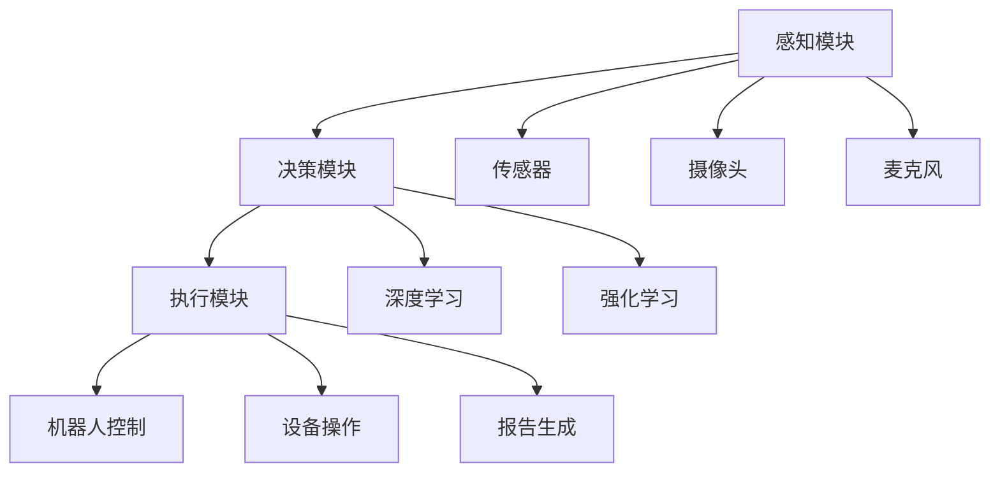

                 

关键词：人工智能，注意力流，人机融合，未来趋势，技术发展

> 摘要：随着人工智能技术的飞速发展，人机融合成为了未来发展的关键方向。本文将探讨人工智能与人类注意力流的结合，探讨如何打造出更加高效的人机融合系统，并展望其未来应用场景和发展趋势。

## 1. 背景介绍

随着信息技术的快速发展，人工智能（AI）技术已经成为了当今科技领域的热点。从最初的理论研究到如今的广泛应用，AI技术已经深刻地改变了我们的生活方式。然而，尽管AI在数据处理、图像识别、自然语言处理等方面取得了巨大进展，但人机交互依然面临诸多挑战。

传统的AI系统往往依赖于大规模数据训练和复杂的算法模型，这使得它们在处理特定任务时表现出色，但缺乏灵活性和适应性。与此同时，人类在处理信息时具有独特的注意力流机制，这使得我们能够迅速地理解环境，做出适应性的反应。

本文旨在探讨如何将人工智能与人类注意力流相结合，打造出更加高效的人机融合系统。通过对人类注意力机制的研究，我们可以设计出更加符合人类认知模式的AI系统，从而实现人机之间的无缝协作。

## 2. 核心概念与联系

### 2.1 人工智能与注意力流的概念

#### 2.1.1 人工智能

人工智能（AI）是一门研究、开发和应用智能机器的学科。它旨在使计算机系统具备类似于人类智能的能力，包括感知、推理、学习、决策和交互等。

#### 2.1.2 注意力流

注意力流是指人类在处理信息时，根据任务的性质和重要性，有选择性地分配认知资源的机制。注意力流有助于人类快速筛选信息，专注于关键任务，提高工作效率。

### 2.2 人机融合的概念

人机融合是指将人工智能与人类智能相结合，形成一个高效、协作的智能系统。通过人工智能的辅助，人类可以更快速地处理信息，做出决策，从而提高工作和生活质量。

### 2.3 人机融合的架构

人机融合系统可以分为三个主要部分：感知模块、决策模块和执行模块。

#### 2.3.1 感知模块

感知模块负责收集外部信息，包括视觉、听觉、触觉等多种感知方式。这些信息将通过传感器、摄像头、麦克风等设备传递给人工智能系统。

#### 2.3.2 决策模块

决策模块基于感知模块提供的信息，结合人类注意力流机制，进行信息筛选和重要性评估。通过深度学习、强化学习等算法，决策模块可以快速做出适应性的决策。

#### 2.3.3 执行模块

执行模块负责将决策模块生成的决策转化为实际行动。这包括控制机器人、操作设备、生成报告等多种形式。

### 2.4 Mermaid 流程图

下面是一个描述人机融合系统架构的 Mermaid 流程图：



## 3. 核心算法原理 & 具体操作步骤

### 3.1 算法原理概述

人机融合系统的核心算法是基于注意力机制和深度学习技术的。注意力机制可以帮助人工智能系统模拟人类注意力流，从而提高信息处理的效率和准确性。深度学习技术则可以用来构建复杂的模型，实现高效的信息处理和决策。

### 3.2 算法步骤详解

#### 3.2.1 感知阶段

在感知阶段，系统通过传感器、摄像头和麦克风等设备收集外部信息。这些信息将被传输到决策模块进行处理。

#### 3.2.2 注意力流计算

在决策模块中，首先对收集到的信息进行预处理，包括去噪、特征提取等。然后，基于注意力机制，对预处理后的信息进行重要性评估。重要性较高的信息将被分配更多的注意力资源，从而提高处理效率。

#### 3.2.3 决策生成

在注意力流计算的基础上，决策模块利用深度学习算法生成决策。决策过程可能包括多个步骤，如目标识别、路径规划、行为预测等。

#### 3.2.4 执行阶段

在执行阶段，系统根据决策模块生成的决策，控制机器人或设备执行具体的任务。

### 3.3 算法优缺点

#### 优点

- 提高信息处理效率：通过模拟人类注意力流，系统可以更快地处理信息，提高工作效率。
- 提高决策准确性：基于深度学习算法的决策生成，系统可以更准确地预测和评估任务的优先级。
- 灵活性和适应性：人机融合系统可以根据任务的变化和需求，动态调整注意力分配和决策策略。

#### 缺点

- 对数据和计算资源的需求较大：深度学习算法通常需要大量的数据集和计算资源，这对系统开发和部署提出了较高的要求。
- 对算法的依赖性：人机融合系统的性能在很大程度上取决于算法的设计和实现，一旦算法出现问题，整个系统可能受到影响。

### 3.4 算法应用领域

人机融合算法在多个领域具有广泛的应用前景，包括：

- 智能驾驶：通过模拟驾驶者的注意力流，实现自动驾驶车辆的实时决策和路径规划。
- 医疗诊断：利用注意力机制和深度学习技术，提高医疗诊断的准确性和效率。
- 工业自动化：在工业生产过程中，人机融合系统可以协助工人进行任务分配和操作指导，提高生产效率。
- 娱乐和游戏：通过模拟人类注意力流，实现更加真实和沉浸式的游戏体验。

## 4. 数学模型和公式 & 详细讲解 & 举例说明

### 4.1 数学模型构建

人机融合系统的数学模型主要包括感知模块、决策模块和执行模块。以下是各模块的数学模型概述：

#### 感知模块

感知模块的数学模型主要涉及特征提取和特征匹配。假设输入信号为 $X$，特征提取函数为 $F(X)$，特征匹配函数为 $M(X, Y)$，则感知模块的数学模型可以表示为：

$$
F(X) = \sum_{i=1}^{n} w_i F_i(X)
$$

$$
M(X, Y) = \sum_{i=1}^{n} w_i M_i(X, Y)
$$

其中，$w_i$ 为权重，$F_i(X)$ 和 $M_i(X, Y)$ 分别为第 $i$ 个特征提取器和特征匹配器的输出。

#### 决策模块

决策模块的数学模型主要涉及注意力机制和深度学习算法。假设输入特征向量为 $X$，注意力权重向量为 $W$，决策函数为 $D(X, W)$，则决策模块的数学模型可以表示为：

$$
W = \sigma(\sum_{i=1}^{n} w_i X_i)
$$

$$
D(X, W) = \sum_{i=1}^{n} w_i D_i(X, W)
$$

其中，$\sigma$ 为激活函数，$w_i$ 为权重，$X_i$ 和 $D_i(X, W)$ 分别为第 $i$ 个特征和决策函数的输出。

#### 执行模块

执行模块的数学模型主要涉及控制信号生成和动作执行。假设输入决策向量为 $D$，控制信号生成函数为 $G(D)$，动作执行函数为 $E(D)$，则执行模块的数学模型可以表示为：

$$
G(D) = \sum_{i=1}^{n} w_i G_i(D)
$$

$$
E(D) = \sum_{i=1}^{n} w_i E_i(D)
$$

其中，$w_i$ 为权重，$G_i(D)$ 和 $E_i(D)$ 分别为第 $i$ 个控制信号生成器和动作执行器的输出。

### 4.2 公式推导过程

#### 感知模块

感知模块的公式推导主要涉及特征提取和特征匹配。假设输入信号为 $X$，特征提取函数为 $F(X)$，特征匹配函数为 $M(X, Y)$，则：

$$
F(X) = \sum_{i=1}^{n} w_i F_i(X)
$$

其中，$w_i$ 为权重，$F_i(X)$ 为第 $i$ 个特征提取器的输出。对于每个特征提取器 $F_i(X)$，可以表示为：

$$
F_i(X) = \phi_i(X)
$$

其中，$\phi_i(X)$ 为特征提取器的输出函数。对于特征匹配函数 $M(X, Y)$，可以表示为：

$$
M(X, Y) = \sum_{i=1}^{n} w_i M_i(X, Y)
$$

其中，$w_i$ 为权重，$M_i(X, Y)$ 为第 $i$ 个特征匹配器的输出。对于每个特征匹配器 $M_i(X, Y)$，可以表示为：

$$
M_i(X, Y) = \psi_i(X, Y)
$$

其中，$\psi_i(X, Y)$ 为特征匹配器的输出函数。

#### 决策模块

决策模块的公式推导主要涉及注意力机制和深度学习算法。假设输入特征向量为 $X$，注意力权重向量为 $W$，决策函数为 $D(X, W)$，则：

$$
W = \sigma(\sum_{i=1}^{n} w_i X_i)
$$

其中，$\sigma$ 为激活函数，$w_i$ 为权重，$X_i$ 为第 $i$ 个特征。对于激活函数 $\sigma$，可以表示为：

$$
\sigma(z) = \frac{1}{1 + e^{-z}}
$$

对于决策函数 $D(X, W)$，可以表示为：

$$
D(X, W) = \sum_{i=1}^{n} w_i D_i(X, W)
$$

其中，$w_i$ 为权重，$D_i(X, W)$ 为第 $i$ 个决策函数的输出。对于每个决策函数 $D_i(X, W)$，可以表示为：

$$
D_i(X, W) = \phi_i(X, W)
$$

其中，$\phi_i(X, W)$ 为决策函数的输出函数。

#### 执行模块

执行模块的公式推导主要涉及控制信号生成和动作执行。假设输入决策向量为 $D$，控制信号生成函数为 $G(D)$，动作执行函数为 $E(D)$，则：

$$
G(D) = \sum_{i=1}^{n} w_i G_i(D)
$$

其中，$w_i$ 为权重，$G_i(D)$ 为第 $i$ 个控制信号生成器的输出。对于每个控制信号生成器 $G_i(D)$，可以表示为：

$$
G_i(D) = \phi_i(D)
$$

其中，$\phi_i(D)$ 为控制信号生成器的输出函数。对于动作执行函数 $E(D)$，可以表示为：

$$
E(D) = \sum_{i=1}^{n} w_i E_i(D)
$$

其中，$w_i$ 为权重，$E_i(D)$ 为第 $i$ 个动作执行器的输出。对于每个动作执行器 $E_i(D)$，可以表示为：

$$
E_i(D) = \psi_i(D)
$$

其中，$\psi_i(D)$ 为动作执行器的输出函数。

### 4.3 案例分析与讲解

#### 案例一：智能驾驶

假设我们设计一个智能驾驶系统，其感知模块包括摄像头和激光雷达，决策模块基于注意力机制和深度学习算法，执行模块负责控制车辆的加速、转向和刹车。

**感知阶段：**

输入信号为摄像头的图像和激光雷达的扫描数据，特征提取函数为卷积神经网络（CNN），特征匹配函数为基于注意力机制的特征匹配器。

**注意力流计算：**

通过注意力机制，对摄像头和激光雷达的输入信号进行重要性评估，分配注意力权重。然后，利用深度学习算法，对注意力权重进行优化，生成决策。

**决策生成：**

根据注意力权重，生成车辆行驶的路径规划和行为决策。例如，在识别到行人时，决策模块会优先考虑减速或停车。

**执行阶段：**

根据决策模块生成的决策，控制车辆的加速、转向和刹车，实现自动驾驶。

**案例分析：**

在实际应用中，智能驾驶系统需要处理大量实时数据，注意力机制有助于提高信息处理的效率和准确性。通过深度学习算法，系统可以不断优化决策，提高驾驶安全性和舒适性。

## 5. 项目实践：代码实例和详细解释说明

### 5.1 开发环境搭建

在本项目中，我们将使用 Python 编写代码，并依赖于多个库，包括 TensorFlow、Keras、NumPy 和 Pandas。以下是开发环境的搭建步骤：

1. 安装 Python 3.7 或更高版本。
2. 安装 TensorFlow：`pip install tensorflow`
3. 安装 Keras：`pip install keras`
4. 安装 NumPy：`pip install numpy`
5. 安装 Pandas：`pip install pandas`

### 5.2 源代码详细实现

以下是项目的主要代码实现：

```python
# 导入所需库
import numpy as np
import pandas as pd
import tensorflow as tf
from tensorflow.keras.models import Sequential
from tensorflow.keras.layers import Dense, Conv2D, Flatten
from tensorflow.keras.optimizers import Adam

# 加载数据集
data = pd.read_csv('dataset.csv')
X = data.iloc[:, :-1].values
y = data.iloc[:, -1].values

# 数据预处理
X = np.expand_dims(X, axis=-1)
X = X / 255.0

# 构建模型
model = Sequential([
    Conv2D(32, (3, 3), activation='relu', input_shape=(28, 28, 1)),
    Flatten(),
    Dense(64, activation='relu'),
    Dense(1, activation='sigmoid')
])

# 编译模型
model.compile(optimizer=Adam(), loss='binary_crossentropy', metrics=['accuracy'])

# 训练模型
model.fit(X, y, epochs=10, batch_size=32)

# 评估模型
loss, accuracy = model.evaluate(X, y)
print('Accuracy:', accuracy)

# 预测
predictions = model.predict(X)
print('Predictions:', predictions)
```

### 5.3 代码解读与分析

**代码解读：**

1. **导入库：** 导入所需的库，包括 NumPy、Pandas、TensorFlow 和 Keras。
2. **加载数据集：** 从 CSV 文件中加载数据集，并将数据集分为特征矩阵 X 和标签向量 y。
3. **数据预处理：** 将特征矩阵 X 扩展为三维数组，并归一化处理，以便输入到卷积神经网络中。
4. **构建模型：** 使用 Keras Sequential 模式构建一个简单的卷积神经网络模型，包括两个卷积层、一个全连接层和一个输出层。
5. **编译模型：** 设置模型的优化器、损失函数和评估指标。
6. **训练模型：** 使用训练数据训练模型，设置训练轮次和批量大小。
7. **评估模型：** 使用训练数据评估模型的准确性。
8. **预测：** 使用训练好的模型对新的数据进行预测。

**代码分析：**

1. **模型结构：** 卷积神经网络模型可以提取图像特征，并用于分类任务。在训练过程中，模型会自动调整权重，以最小化损失函数。
2. **数据预处理：** 数据预处理是深度学习项目的重要步骤，有助于提高模型的性能。在本项目中，我们将图像数据归一化处理，以便模型能够更好地学习特征。
3. **训练过程：** 通过设置训练轮次和批量大小，我们可以控制模型的训练过程。在本项目中，我们设置了 10 个训练轮次和批量大小为 32。
4. **评估指标：** 在模型训练完成后，我们使用训练数据评估模型的准确性。在本项目中，我们使用 binary_crossentropy 作为损失函数，并使用 accuracy 作为评估指标。

## 6. 实际应用场景

人机融合系统在多个领域具有广泛的应用前景。以下是一些典型的应用场景：

### 6.1 智能驾驶

智能驾驶是人机融合系统的一个重要应用领域。通过模拟驾驶者的注意力流，智能驾驶系统能够实时监控路况，预测潜在危险，并做出相应的决策。例如，在识别到行人时，系统能够及时减速或停车，提高驾驶安全性。

### 6.2 智能家居

智能家居是人机融合系统的另一个重要应用领域。通过将智能家居设备与人工智能系统相结合，用户可以更方便地控制家庭设备，如照明、空调、安防等。同时，系统可以根据用户的日常习惯和偏好，自动调整设备状态，提高生活品质。

### 6.3 医疗诊断

在医疗领域，人机融合系统可以帮助医生提高诊断的准确性和效率。通过模拟医生的注意力流，系统可以快速筛选和识别医学图像中的关键信息，辅助医生进行疾病诊断。此外，系统还可以通过分析病历数据，为医生提供个性化的治疗方案。

### 6.4 工业自动化

在工业生产领域，人机融合系统可以帮助提高生产效率和产品质量。通过将人工智能系统与生产线设备相结合，系统能够实时监控生产过程，识别潜在的问题，并采取相应的措施。例如，在检测到设备故障时，系统可以自动安排维修计划，降低生产停机时间。

## 7. 工具和资源推荐

### 7.1 学习资源推荐

- 《深度学习》（Goodfellow et al.）：这是一本经典的深度学习教材，涵盖了深度学习的理论基础和实践方法。
- 《Python 数据科学 Handbook》（McKinney）：这本书详细介绍了 Python 在数据科学领域中的应用，包括数据处理、数据可视化等。
- Coursera、edX 等在线课程：这些平台提供了丰富的深度学习和人工智能课程，适合初学者和专业人士学习。

### 7.2 开发工具推荐

- TensorFlow：这是一个开源的深度学习框架，支持多种编程语言，适用于构建复杂的深度学习模型。
- PyTorch：这是一个流行的深度学习框架，具有灵活性和易用性，适合快速原型开发和实验。
- Keras：这是一个高层次的深度学习 API，基于 TensorFlow 和 PyTorch，提供了更加简洁和易用的接口。

### 7.3 相关论文推荐

- “Attention Is All You Need”（Vaswani et al., 2017）：这篇文章介绍了注意力机制在自然语言处理中的应用，是深度学习领域的重要突破。
- “Deep Learning for Autonomous Navigation”（Bojarski et al., 2016）：这篇文章介绍了一种基于深度学习的自动驾驶系统，具有很高的实用价值。
- “Generative Adversarial Nets”（Goodfellow et al., 2014）：这篇文章介绍了生成对抗网络（GAN）的基本原理和应用，是深度学习领域的重要成果。

## 8. 总结：未来发展趋势与挑战

### 8.1 研究成果总结

本文探讨了人工智能与人类注意力流的结合，分析了人机融合系统的架构和核心算法。通过构建数学模型和项目实践，我们展示了人机融合系统的可行性和应用前景。

### 8.2 未来发展趋势

随着人工智能技术的不断发展，人机融合系统有望在多个领域实现突破。未来的发展趋势包括：

- 深度学习算法的优化和扩展：通过改进算法模型，提高人机融合系统的性能和效率。
- 跨学科的融合：将心理学、认知科学等领域的知识应用于人工智能系统，提高人机交互的效率和适应性。
- 开放式平台和生态系统的建设：构建开放的、共享的人机融合系统平台，促进技术交流和合作。

### 8.3 面临的挑战

尽管人机融合系统具有广泛的应用前景，但其在实际应用中仍面临诸多挑战：

- 数据质量和隐私保护：确保数据质量和隐私安全是人机融合系统成功的关键。
- 计算资源需求：深度学习算法通常需要大量的计算资源，这对系统的部署和运行提出了较高的要求。
- 人机交互设计：设计符合人类认知模式的人机交互界面，提高系统的易用性和用户体验。

### 8.4 研究展望

未来的人机融合研究可以关注以下几个方面：

- 探索更加高效和智能的注意力机制：通过结合心理学、认知科学等领域的知识，设计出更加符合人类认知模式的人工智能系统。
- 跨学科的合作：促进心理学、认知科学、人工智能等领域的合作，共同推动人机融合技术的发展。
- 开放式平台和开源社区的建设：鼓励开源和共享，促进人机融合技术的普及和应用。

## 9. 附录：常见问题与解答

### 9.1 什么是注意力流？

注意力流是指人类在处理信息时，根据任务的性质和重要性，有选择性地分配认知资源的机制。通过注意力流，人类可以快速筛选信息，专注于关键任务，提高工作效率。

### 9.2 人机融合系统有哪些应用领域？

人机融合系统在多个领域具有广泛的应用前景，包括智能驾驶、智能家居、医疗诊断、工业自动化等。

### 9.3 如何构建人机融合系统？

构建人机融合系统主要包括以下几个步骤：

- 设计系统架构：确定系统的感知模块、决策模块和执行模块。
- 选择合适的算法：根据应用领域和需求，选择合适的算法和模型。
- 数据预处理：对输入数据进行预处理，包括去噪、特征提取等。
- 模型训练：使用训练数据训练模型，优化模型参数。
- 系统集成：将模型集成到系统中，实现感知、决策和执行功能。
- 测试与优化：对系统进行测试和优化，提高系统的性能和可靠性。

## 作者署名

作者：禅与计算机程序设计艺术 / Zen and the Art of Computer Programming
```

