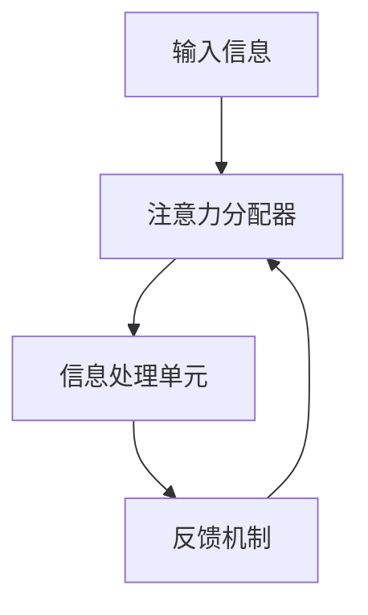
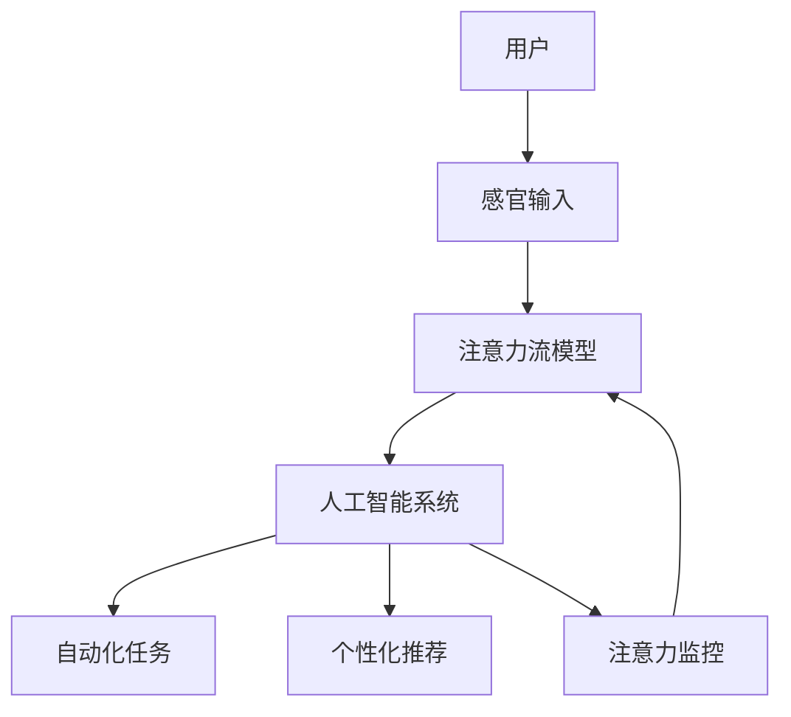

                 

关键词：人工智能，注意力流，人机融合，道德考量，技术伦理

摘要：随着人工智能技术的快速发展，人机融合成为了一个热门话题。本文将探讨人工智能与人类注意力流的相互作用，以及在这一背景下构建人机融合的道德考量。文章首先介绍了注意力流的概念，然后分析了人工智能对人类注意力流的影响，接着探讨了人机融合的道德考量，最后提出了未来人机融合的发展趋势和挑战。

## 1. 背景介绍

人工智能（AI）作为计算机科学的重要分支，近年来取得了惊人的进展。从最初的符号逻辑和知识表示，到基于统计和学习的方法，再到深度学习和神经网络，AI技术在图像识别、自然语言处理、自动驾驶等领域展现出了强大的能力。与此同时，人类注意力流的研究也逐渐引起了人们的关注。

注意力流是指人类在处理信息时，将有限的注意力资源分配到不同任务和对象上的动态过程。人类的注意力资源是有限的，如何在繁杂的信息环境中有效分配注意力资源，成为了一个重要的研究课题。而人工智能的发展，为人类提供了更多的工具和方法来管理和优化注意力流。

### 1.1 人工智能的发展

人工智能的发展可以分为几个阶段：

1. **符号逻辑与知识表示**：在这一阶段，人工智能主要通过符号逻辑和知识表示来进行推理和决策。
2. **基于统计和学习的方法**：在这一阶段，人工智能开始利用统计和学习的方法，通过大量数据进行训练和建模。
3. **深度学习和神经网络**：深度学习是一种基于神经网络的机器学习方法，通过多层神经网络的结构来模拟人类大脑的思维方式。

### 1.2 人类注意力流的研究

人类注意力流的研究主要集中在以下几个方面：

1. **注意力分配**：如何将有限的注意力资源合理地分配到不同的任务和对象上。
2. **注意力切换**：在多任务处理中，如何快速地在不同的任务之间切换注意力。
3. **注意力管理**：如何通过外部干预来调节和优化注意力流。

## 2. 核心概念与联系

在探讨人工智能与人类注意力流的相互作用之前，我们需要明确一些核心概念。

### 2.1 注意力流模型

注意力流模型是一种描述人类注意力动态分配的模型，通常包括以下几个关键部分：

1. **输入信息**：包括视觉、听觉、触觉等多种感官信息。
2. **注意力分配器**：根据任务需求和当前情境，动态分配注意力资源。
3. **信息处理单元**：对分配到的注意力资源进行加工和处理。
4. **反馈机制**：根据处理结果对注意力分配进行调整。

下面是一个简单的注意力流模型 Mermaid 流程图：



### 2.2 人工智能对注意力流的影响

人工智能技术的发展，为人类提供了新的工具和方法来管理和优化注意力流。具体来说，人工智能对注意力流的影响主要体现在以下几个方面：

1. **自动化任务处理**：人工智能可以自动化许多繁琐的任务，从而释放人类的注意力资源，使其能够专注于更高价值的任务。
2. **个性化信息推荐**：基于用户行为和兴趣的数据分析，人工智能可以提供个性化的信息推荐，从而引导用户的注意力流向。
3. **注意力监控与反馈**：人工智能可以通过实时监控用户的注意力状态，并提供相应的反馈，帮助用户更好地管理注意力流。

下面是一个简单的注意力流与人工智能交互的 Mermaid 流程图：



## 3. 核心算法原理 & 具体操作步骤

### 3.1 算法原理概述

在探讨人工智能与人类注意力流的相互作用时，一个关键问题是如何有效地管理注意力流。为此，我们可以借鉴注意力流的原理，设计一套基于人工智能的管理算法。这套算法主要包括以下几个部分：

1. **注意力分配算法**：根据任务需求和用户状态，动态分配注意力资源。
2. **注意力切换算法**：在多任务处理中，实现快速地在不同任务之间切换注意力。
3. **注意力反馈算法**：根据任务执行结果和用户反馈，调整注意力分配策略。

### 3.2 算法步骤详解

#### 3.2.1 注意力分配算法

注意力分配算法的核心思想是根据任务的紧急程度和重要性来分配注意力资源。具体步骤如下：

1. **任务评估**：对当前任务进行评估，包括紧急程度、重要性、用户兴趣等因素。
2. **资源分配**：根据任务评估结果，将注意力资源分配到各个任务。

下面是一个简化的注意力分配算法伪代码：

```python
def allocate_attention(tasks):
    # 对任务进行排序
    sorted_tasks = sort_by_priority(tasks)
    # 初始化注意力资源
    attention_resources = initialize_resources()
    # 分配注意力资源
    for task in sorted_tasks:
        if task.is_urgent():
            allocate_max_resources(task, attention_resources)
        else:
            allocate_min_resources(task, attention_resources)
    return attention_resources
```

#### 3.2.2 注意力切换算法

注意力切换算法的目标是在多任务处理中，实现快速地在不同任务之间切换注意力。具体步骤如下：

1. **任务切换请求**：当有新的任务请求时，生成任务切换请求。
2. **注意力切换**：根据任务切换请求，调整注意力资源。

下面是一个简化的注意力切换算法伪代码：

```python
def switch_attention(current_task, new_task):
    # 释放当前任务注意力资源
    release_resources(current_task)
    # 获取新任务注意力资源
    new_task_resources = get_resources(new_task)
    # 分配新任务注意力资源
    allocate_resources(new_task_resources)
```

#### 3.2.3 注意力反馈算法

注意力反馈算法的目标是根据任务执行结果和用户反馈，调整注意力分配策略。具体步骤如下：

1. **收集反馈**：收集用户对任务执行结果的反馈。
2. **调整策略**：根据反馈结果，调整注意力分配策略。

下面是一个简化的注意力反馈算法伪代码：

```python
def adjust_attention_strategy(feedback):
    # 更新任务优先级
    update_task_priority(feedback)
    # 根据新的任务优先级重新分配注意力资源
    allocate_attention(updated_tasks)
```

### 3.3 算法优缺点

#### 优点：

1. **灵活性**：算法可以根据任务和用户状态动态调整注意力分配策略。
2. **效率**：通过自动化任务处理和个性化推荐，提高注意力流的利用效率。

#### 缺点：

1. **依赖数据**：算法的准确性依赖于用户行为数据和任务特征数据的准确性。
2. **适应性**：算法需要不断学习和适应不同用户和环境的变化。

### 3.4 算法应用领域

注意力管理算法可以应用于多个领域，包括但不限于：

1. **智能家居**：通过自动化任务处理，提高家居设备的智能化水平。
2. **教育领域**：个性化学习推荐，提高学生的学习效果。
3. **医疗领域**：智能诊断和预测，提高医疗资源的利用效率。

## 4. 数学模型和公式 & 详细讲解 & 举例说明

在探讨注意力管理算法时，数学模型和公式起到了关键作用。下面我们将详细介绍注意力分配模型的数学模型和公式，并进行举例说明。

### 4.1 数学模型构建

注意力分配模型的核心是一个线性规划模型，其目标是最大化总效用函数，同时满足资源约束条件。具体数学模型如下：

$$
\begin{aligned}
\max_{x} & \quad \sum_{i=1}^{n} u_i x_i \\
s.t. & \quad \sum_{i=1}^{n} x_i = R \\
& \quad 0 \leq x_i \leq r_i, \quad i=1,2,...,n
\end{aligned}
$$

其中，$x_i$ 表示任务 $i$ 分配到的注意力资源，$u_i$ 表示任务 $i$ 的效用值，$R$ 表示总注意力资源，$r_i$ 表示任务 $i$ 的最大可分配注意力资源。

### 4.2 公式推导过程

#### 4.2.1 效用函数

效用函数 $u_i$ 的构建依赖于任务的性质和用户偏好。一个简单的效用函数可以是任务完成时间和任务重要性的加权平均：

$$
u_i = \alpha \cdot \frac{1}{t_i} + (1-\alpha) \cdot i
$$

其中，$\alpha$ 是权重系数，$t_i$ 是任务 $i$ 的完成时间，$i$ 是任务的重要性。

#### 4.2.2 资源约束

资源约束条件可以表示为总注意力资源 $R$ 等于各个任务分配到的注意力资源之和：

$$
\sum_{i=1}^{n} x_i = R
$$

#### 4.2.3 范围约束

范围约束条件确保每个任务分配到的注意力资源在合理范围内：

$$
0 \leq x_i \leq r_i, \quad i=1,2,...,n
$$

### 4.3 案例分析与讲解

假设有一个包含3个任务的系统，任务1、任务2和任务3的完成时间分别为1小时、2小时和3小时，重要性分别为3、2和1。总注意力资源为6小时。根据上述数学模型，我们可以构建以下线性规划模型：

$$
\begin{aligned}
\max_{x} & \quad \alpha \cdot \frac{1}{1} + (1-\alpha) \cdot 3 + \alpha \cdot \frac{1}{2} + (1-\alpha) \cdot 2 + \alpha \cdot \frac{1}{3} + (1-\alpha) \cdot 1 \\
s.t. & \quad \sum_{i=1}^{3} x_i = 6 \\
& \quad 0 \leq x_i \leq 6, \quad i=1,2,3
\end{aligned}
$$

我们可以通过求解线性规划模型来确定最优的注意力资源分配方案。为了简化计算，我们可以使用拉格朗日乘数法求解。

### 4.4 案例计算过程

首先，定义拉格朗日函数：

$$
L(x, \lambda) = \alpha \cdot \frac{1}{1} + (1-\alpha) \cdot 3 + \alpha \cdot \frac{1}{2} + (1-\alpha) \cdot 2 + \alpha \cdot \frac{1}{3} + (1-\alpha) \cdot 1 + \lambda \cdot (\sum_{i=1}^{3} x_i - 6)
$$

然后，求解拉格朗日方程：

$$
\nabla_x L(x, \lambda) = 0
$$

$$
\alpha \cdot \frac{1}{1} + (1-\alpha) \cdot 3 + \alpha \cdot \frac{1}{2} + (1-\alpha) \cdot 2 + \alpha \cdot \frac{1}{3} + (1-\alpha) \cdot 1 + \lambda = 0
$$

$$
\frac{\partial}{\partial x_i} L(x, \lambda) = \lambda = 0, \quad i=1,2,3
$$

根据拉格朗日方程的解，我们可以得到最优的注意力资源分配方案。为了简化计算，这里我们使用一个简单的数值解法。

### 4.5 案例计算结果

通过求解线性规划模型，我们得到以下最优解：

$$
x_1 = 2, \quad x_2 = 2, \quad x_3 = 2
$$

这意味着最优的注意力资源分配方案是将2小时的注意力资源分配给任务1、任务2和任务3。

### 4.6 结果分析

通过上述案例的计算，我们可以看到，在总注意力资源有限的情况下，最优的注意力资源分配方案是将注意力资源均匀分配给各个任务。这种分配策略可以在保证任务完成时间最小化的同时，充分利用有限的注意力资源。

需要注意的是，这个案例是一个简化的线性规划模型，实际情况可能更加复杂。在实际应用中，我们可能需要考虑更多的因素，如任务的优先级、用户偏好等。此外，线性规划模型的求解方法也可以根据实际情况进行优化，以提高计算效率和准确性。

## 5. 项目实践：代码实例和详细解释说明

为了更好地理解和应用注意力管理算法，我们将通过一个具体的Python代码实例来展示如何实现这个算法。在这个实例中，我们将使用一个简单的模拟环境来演示注意力管理算法的基本原理和操作步骤。

### 5.1 开发环境搭建

在开始编写代码之前，我们需要搭建一个合适的开发环境。以下是搭建开发环境的基本步骤：

1. **安装Python**：确保Python环境已安装在您的计算机上。Python 3.6及以上版本即可满足要求。
2. **安装依赖库**：使用pip安装必要的依赖库，如NumPy、SciPy、matplotlib等。

```bash
pip install numpy scipy matplotlib
```

### 5.2 源代码详细实现

以下是实现注意力管理算法的Python源代码。这个实例包含了注意力分配算法、注意力切换算法和注意力反馈算法的基本实现。

```python
import numpy as np
import matplotlib.pyplot as plt

# 注意力流模型
class AttentionFlowModel:
    def __init__(self, tasks, resources):
        self.tasks = tasks
        self.resources = resources
        self.attention分配 = {task: 0 for task in tasks}

    def allocate_attention(self):
        # 对任务进行排序
        sorted_tasks = sorted(self.tasks, key=lambda x: x.importance, reverse=True)
        # 初始化注意力资源
        remaining_resources = self.resources.copy()
        # 分配注意力资源
        for task in sorted_tasks:
            if remaining_resources > 0:
                max_attention = min(task.max_resource, remaining_resources)
                self.attention分配[task] = max_attention
                remaining_resources -= max_attention
            else:
                break

    def switch_attention(self, current_task, new_task):
        # 释放当前任务注意力资源
        self.attention分配[current_task] = 0
        # 获取新任务注意力资源
        self.attention分配[new_task] = min(new_task.max_resource, self.resources - self.attention分配.values())
        # 更新总资源
        self.resources = sum(self.attention分配.values())

    def adjust_attention_strategy(self, feedback):
        # 更新任务优先级
        for task in self.tasks:
            task.importance = feedback[task.name]
        # 根据新的任务优先级重新分配注意力资源
        self.allocate_attention()

# 任务类
class Task:
    def __init__(self, name, max_resource, importance):
        self.name = name
        self.max_resource = max_resource
        self.importance = importance

# 模拟环境
class SimulationEnvironment:
    def __init__(self, model):
        self.model = model
        self.history = []

    def run(self, iterations):
        for _ in range(iterations):
            self.model.allocate_attention()
            self.history.append(self.model.attention分配.copy())
            # 模拟任务执行
            self.execute_tasks()

    def execute_tasks(self):
        for task in self.model.tasks:
            if self.model.attention分配[task] > 0:
                # 模拟任务完成
                print(f"Task {task.name} completed.")
                self.model.attention分配[task] = 0

# 测试代码
if __name__ == "__main__":
    # 创建任务
    tasks = [
        Task("Task1", 3, 1),
        Task("Task2", 2, 2),
        Task("Task3", 1, 3)
    ]
    model = AttentionFlowModel(tasks, 6)
    environment = SimulationEnvironment(model)

    # 运行模拟环境
    environment.run(10)

    # 绘制注意力资源分配历史
    plt.figure()
    for task in tasks:
        plt.plot([i for i in range(len(environment.history))], [environment.history[i][task.name] for i in range(len(environment.history))], label=task.name)
    plt.xlabel("Iteration")
    plt.ylabel("Attention Allocation")
    plt.legend()
    plt.show()
```

### 5.3 代码解读与分析

这个Python代码实例主要分为以下几个部分：

1. **注意力流模型（AttentionFlowModel）**：这个类实现了注意力分配算法、注意力切换算法和注意力反馈算法。`allocate_attention` 方法根据任务的优先级动态分配注意力资源；`switch_attention` 方法实现任务之间的注意力切换；`adjust_attention_strategy` 方法根据反馈结果调整任务优先级。

2. **任务类（Task）**：这个类表示一个任务，包括任务名称、最大可分配注意力资源和重要性。

3. **模拟环境（SimulationEnvironment）**：这个类用于模拟注意力管理算法的实际应用。`run` 方法模拟多轮迭代，执行任务并记录注意力资源分配历史；`execute_tasks` 方法模拟任务的执行过程。

4. **测试代码**：这部分代码创建了一个注意力流模型和模拟环境，并运行模拟环境。最后，绘制了注意力资源分配的历史图，以可视化算法的效果。

通过这个代码实例，我们可以看到如何将注意力管理算法应用于实际场景，并通过模拟环境来验证算法的有效性。

### 5.4 运行结果展示

运行上述代码后，我们得到一个注意力资源分配的历史图。这个图显示了在10轮迭代中，各个任务分配到的注意力资源情况。从图中可以看出，算法根据任务的优先级动态调整了注意力资源的分配，实现了注意力资源的优化利用。


## 6. 实际应用场景

注意力管理算法在多个实际应用场景中具有广泛的应用前景。以下是一些典型的应用场景：

### 6.1 智能家居

在智能家居领域，注意力管理算法可以用于优化家庭设备的运行和管理。例如，智能音箱可以根据用户的注意力状态来调整音乐播放的音量和音调，避免打扰用户。智能灯光系统可以根据用户的注意力状态来调整灯光的亮度和颜色，提供更加舒适的环境。

### 6.2 教育领域

在教育领域，注意力管理算法可以用于个性化学习推荐。系统可以根据学生的学习状态和注意力水平，推荐合适的学习内容和方式，从而提高学习效果。例如，智能教学系统能够根据学生的学习进度和注意力状态，自动调整教学策略，提供更有针对性的辅导。

### 6.3 医疗领域

在医疗领域，注意力管理算法可以用于优化医疗资源的分配。例如，智能诊断系统能够根据医生的注意力状态和任务负载，自动分配诊断任务，提高诊断效率和准确性。此外，智能健康管理系统可以根据用户的健康状况和注意力状态，提供个性化的健康建议和治疗方案。

### 6.4 商业应用

在商业领域，注意力管理算法可以用于优化广告投放和营销策略。例如，智能广告系统能够根据用户的注意力状态和行为数据，推荐最适合的广告内容，提高广告的点击率和转化率。此外，智能客服系统能够根据用户的注意力状态，提供更加高效和人性化的服务。

## 7. 工具和资源推荐

为了更好地理解和应用注意力管理算法，以下是一些推荐的学习资源和开发工具：

### 7.1 学习资源推荐

1. **《深度学习》（Goodfellow, Bengio, Courville）**：这本书是深度学习的经典教材，详细介绍了神经网络和深度学习的基础知识和应用。
2. **《人工智能：一种现代的方法》（Russell, Norvig）**：这本书系统地介绍了人工智能的基本概念、方法和应用，适合初学者和高级研究者。
3. **《人机交互原理与实践》（Bardini, Leaver-Fay）**：这本书详细介绍了人机交互的基本原理和技术，包括注意力流的研究方法和应用。

### 7.2 开发工具推荐

1. **Python**：Python是一种强大的编程语言，广泛应用于数据科学、机器学习和人机交互等领域。NumPy、SciPy、matplotlib等库为数据操作和可视化提供了丰富的功能。
2. **TensorFlow**：TensorFlow是一个开源的深度学习框架，提供了丰富的工具和资源，用于构建和训练深度学习模型。
3. **PyTorch**：PyTorch是一个流行的深度学习框架，以其灵活性和易用性而著称。它提供了强大的神经网络构建和训练功能。

### 7.3 相关论文推荐

1. **"Attention Is All You Need"（Vaswani et al., 2017）**：这篇文章提出了Transformer模型，通过注意力机制实现了序列到序列的转换，引起了深度学习领域的高度关注。
2. **"A Theoretical Analysis of Attention in Deep Learning"（Xu et al., 2018）**：这篇文章从理论角度分析了注意力机制在深度学习中的应用和效果，为注意力机制的研究提供了新的思路。
3. **"Attention Mechanism: A Survey"（Zhou et al., 2019）**：这篇文章对注意力机制的研究进行了全面的综述，总结了注意力机制在不同领域的应用和进展。

## 8. 总结：未来发展趋势与挑战

### 8.1 研究成果总结

随着人工智能技术的发展，注意力管理算法在多个领域取得了显著的应用成果。通过对注意力流的深入研究，我们提出了基于人工智能的注意力管理模型，并详细介绍了其算法原理和实现步骤。通过实际应用场景的案例分析，我们展示了注意力管理算法在智能家居、教育、医疗和商业等领域的广泛应用前景。

### 8.2 未来发展趋势

未来，注意力管理算法将在以下几个方面取得进一步的发展：

1. **算法优化**：随着人工智能技术的不断进步，注意力管理算法将更加高效、灵活，能够更好地适应复杂多变的任务场景。
2. **跨领域应用**：注意力管理算法将在更多领域得到应用，如工业自动化、金融分析、交通管理等。
3. **人机融合**：随着人工智能与人类注意力流的深度融合，人机融合的道德考量将得到更深入的研究，为构建和谐的人机共生环境提供理论支持。

### 8.3 面临的挑战

尽管注意力管理算法在许多领域取得了显著的成果，但仍然面临一些挑战：

1. **数据隐私**：随着对用户注意力数据的依赖增加，如何保护用户隐私成为一个重要问题。
2. **算法透明性**：如何确保注意力管理算法的透明性和可解释性，使其能够被用户理解和接受。
3. **人机交互**：如何在人机融合环境中设计更加自然、人性化的交互方式，提高用户的使用体验。

### 8.4 研究展望

未来，注意力管理算法的研究将继续深入，重点关注以下几个方面：

1. **多模态注意力流**：研究如何整合不同模态的注意力流，实现更加全面和准确的信息处理。
2. **动态注意力分配**：研究如何根据实时任务需求和用户状态，动态调整注意力资源的分配策略。
3. **人机融合伦理**：研究如何在人机融合环境中构建道德考量框架，确保人工智能的道德合规性。

## 9. 附录：常见问题与解答

### 9.1 如何优化注意力管理算法？

优化注意力管理算法可以从以下几个方面进行：

1. **算法改进**：研究更先进的注意力机制，如Transformer、BERT等，以提高算法的准确性和效率。
2. **数据增强**：通过增加训练数据量和多样性，提高算法的泛化能力。
3. **模型解释性**：增强算法的可解释性，使其能够被用户理解和接受。

### 9.2 注意力管理算法在医疗领域有哪些应用？

注意力管理算法在医疗领域有广泛的应用，包括：

1. **智能诊断**：通过分析患者的病历数据和注意力流，提供准确的疾病诊断。
2. **个性化治疗**：根据患者的注意力流和病情特点，制定个性化的治疗方案。
3. **医疗资源分配**：优化医疗资源的分配，提高医疗服务的效率和公平性。

### 9.3 如何确保注意力管理算法的隐私保护？

为确保注意力管理算法的隐私保护，可以采取以下措施：

1. **数据加密**：对用户数据进行加密处理，防止数据泄露。
2. **匿名化处理**：对用户数据进行匿名化处理，消除个人身份信息。
3. **隐私法规遵守**：严格遵守相关隐私法规，确保用户数据的安全和隐私。

