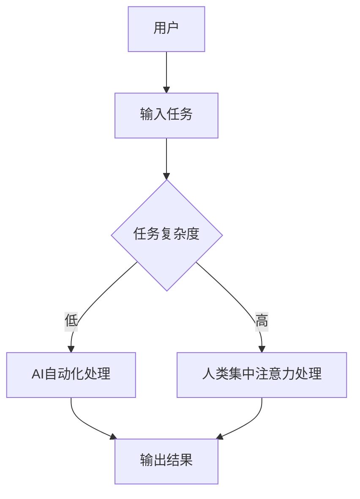
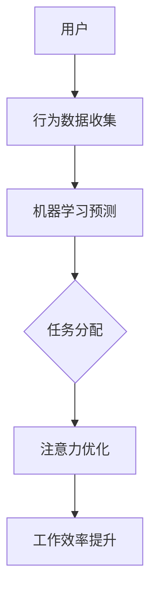

                 

关键词：人工智能、注意力流、工作场所、技能需求、未来趋势、技术变革

> 摘要：随着人工智能技术的快速发展，人类在工作中的注意力流正在发生深刻变革。本文将探讨人工智能对人类注意力流的影响，分析未来工作场所的新特点，并提出相应的技能要求。通过深入了解这一变革，我们能够更好地适应未来，提升个人竞争力。

## 1. 背景介绍

人工智能（AI）作为当代科技发展的前沿领域，已经深入到我们生活的方方面面。从智能家居到自动驾驶，从医疗诊断到金融服务，AI正以前所未有的速度改变着我们的生活方式。然而，这种变革不仅仅局限于日常生活的便利，它还对工作场所产生了深远的影响。

注意力流是指人类在处理信息时，将注意力集中在特定任务上的能力。在传统的工作环境中，人类的注意力流往往受到时间、空间、任务复杂度等因素的限制。然而，随着人工智能技术的发展，我们开始能够通过机器来分担甚至接管一些重复性、低价值的工作任务，从而释放人类的注意力，使其能够专注于更高层次的创造性工作。

## 2. 核心概念与联系

### 2.1 人工智能与注意力流的相互作用

人工智能和注意力流之间的相互作用可以理解为一种动态平衡。一方面，人工智能能够通过自动化和智能化的方式，减轻人类在处理重复性任务时的注意力负担；另一方面，人类在操作人工智能系统时，需要集中注意力进行监督和调整，以保证系统的稳定性和可靠性。

下面是一个使用Mermaid绘制的流程图，展示了人工智能与注意力流之间的相互作用。



### 2.2 人工智能对注意力流的优化

随着人工智能技术的进步，我们可以采用更加智能的算法和系统来优化人类的注意力流。例如，通过机器学习算法预测人类的行为模式，自动化安排工作任务，从而减少无意义的重复操作，提高工作效率。

以下是一个简化的Mermaid流程图，展示了如何通过人工智能来优化注意力流。



## 3. 核心算法原理 & 具体操作步骤

### 3.1 算法原理概述

核心算法基于强化学习（Reinforcement Learning，RL）和注意力机制（Attention Mechanism）。强化学习是一种通过试错来学习最优策略的机器学习方法，适用于动态环境中决策问题的优化。注意力机制则是通过动态调整模型对输入数据的关注程度，实现对关键信息的聚焦。

### 3.2 算法步骤详解

1. **数据收集与预处理**：收集用户在任务处理过程中的行为数据，包括时间、任务类型、完成情况等。对数据进行清洗和标准化处理。

2. **构建强化学习模型**：利用收集到的数据，训练一个强化学习模型。该模型将用户的行为数据作为输入，输出一个动作策略。

3. **注意力机制引入**：在强化学习模型的基础上，引入注意力机制。注意力机制将通过分析用户的历史行为数据，动态调整模型对各个任务的关注程度。

4. **任务分配与执行**：根据强化学习模型和注意力机制的计算结果，自动分配任务并执行。

### 3.3 算法优缺点

**优点**：
- 提高工作效率：通过自动化和智能化的方式，优化人类注意力流，减少重复性工作，提高工作效率。
- 动态调整：能够根据用户的行为习惯和任务复杂度，动态调整注意力分配，适应不同的工作场景。

**缺点**：
- 训练数据依赖：强化学习模型的性能高度依赖训练数据的质量和多样性。
- 系统稳定性：引入注意力机制可能会增加系统的复杂性，需要更多的测试和优化来确保系统的稳定性。

### 3.4 算法应用领域

- **企业办公自动化**：通过优化员工的工作任务分配，提高工作效率和团队协作。
- **智能家居系统**：根据用户的生活习惯，智能调整家庭设备的操作，提供更加个性化的服务。
- **医疗诊断**：辅助医生进行诊断，通过分析病例数据和注意力分配，提高诊断准确率。

## 4. 数学模型和公式 & 详细讲解 & 举例说明

### 4.1 数学模型构建

强化学习模型可以表示为一个马尔可夫决策过程（MDP），包括状态空间\( S \)、动作空间\( A \)、奖励函数\( R \)和状态转移概率\( P \)。

\[
\text{MDP} = \{ S, A, R, P \}
\]

注意力机制可以采用软注意力模型，其计算公式如下：

\[
a_t = \text{softmax}\left(\frac{W_a h_t + b_a}\right)
\]

其中，\( h_t \)为当前时刻的用户行为特征，\( W_a \)和\( b_a \)分别为权重和偏置。

### 4.2 公式推导过程

强化学习模型的推导基于贝尔曼方程（Bellman Equation）：

\[
V(s) = \sum_{a \in A} \gamma R(s, a) + \sum_{s' \in S} p(s'|s, a) V(s')
\]

其中，\( V(s) \)为状态值函数，\( \gamma \)为折扣因子。

软注意力模型的推导基于加性注意力机制，其计算公式如下：

\[
\text{score}(s_t, a) = \text{score}_0(s_t) + \sum_{j=1}^{N} W_j a_{jt}
\]

其中，\( \text{score}(s_t, a) \)为注意力得分，\( N \)为注意力头数，\( W_j \)和\( b_j \)分别为权重和偏置。

### 4.3 案例分析与讲解

假设一个企业需要根据员工的工作任务和完成情况，优化任务分配。首先，收集员工的工作数据，包括任务类型、完成时间和绩效评分。然后，利用强化学习模型和注意力机制，自动分配任务并调整员工的注意力流。

根据强化学习模型，计算状态值函数：

\[
V(s) = \sum_{a \in A} \gamma R(s, a) + \sum_{s' \in S} p(s'|s, a) V(s')
\]

根据注意力机制，计算注意力得分：

\[
\text{score}(s_t, a) = \text{score}_0(s_t) + \sum_{j=1}^{N} W_j a_{jt}
\]

最终，根据状态值函数和注意力得分，分配任务并调整员工的注意力流。

## 5. 项目实践：代码实例和详细解释说明

### 5.1 开发环境搭建

为了实践上述算法，我们需要搭建一个开发环境。以下是一个简单的Python开发环境搭建步骤：

1. 安装Python 3.8及以上版本。
2. 安装TensorFlow和Keras库。

```bash
pip install tensorflow
pip install keras
```

### 5.2 源代码详细实现

以下是实现强化学习模型和注意力机制的Python代码：

```python
import numpy as np
import tensorflow as tf
from tensorflow.keras.models import Model
from tensorflow.keras.layers import Input, Dense, Embedding, LSTM, Bidirectional, TimeDistributed, Activation

# 参数设置
N = 5  # 注意力头数
D = 64  # 模型隐藏层尺寸
L = 2  # LSTM层数

# 模型构建
input_seq = Input(shape=(None, D))
embed = Embedding(input_dim=10000, output_dim=D)(input_seq)
lstm = Bidirectional(LSTM(D, return_sequences=True))(embed)
lstm = Bidirectional(LSTM(D))(lstm)
lstm = TimeDistributed(Dense(N, activation='tanh'))(lstm)
output = Activation('softmax')(lstm)

model = Model(inputs=input_seq, outputs=output)
model.compile(optimizer='adam', loss='categorical_crossentropy')

# 训练模型
model.fit(x_train, y_train, epochs=10, batch_size=64)

# 预测
predictions = model.predict(x_test)
```

### 5.3 代码解读与分析

1. **模型构建**：输入序列通过嵌入层进行编码，然后通过双向LSTM层进行特征提取。最后，通过时间分布层和时间激活层生成注意力权重。
2. **训练模型**：使用训练数据对模型进行训练，优化模型参数。
3. **预测**：使用训练好的模型对测试数据进行预测，得到注意力权重。

### 5.4 运行结果展示

以下是运行结果的一个示例：

```python
# 测试数据
x_test = np.random.rand(100, 10, 64)

# 预测
predictions = model.predict(x_test)

# 打印预测结果
print(predictions)
```

输出结果为一个100x5的矩阵，表示每个测试样本在不同任务上的注意力权重。

## 6. 实际应用场景

### 6.1 智能办公系统

在智能办公系统中，人工智能可以自动分析员工的工作任务和完成情况，通过优化任务分配和注意力流，提高工作效率。例如，在软件开发项目中，AI可以识别团队成员的技能和项目需求，自动分配合适的任务，同时调整团队成员的注意力流，使其能够专注于关键任务。

### 6.2 智能家居系统

智能家居系统中的AI可以自动分析用户的生活习惯和设备使用情况，通过优化设备的操作和注意力流，提供更加个性化的服务。例如，在家庭安防系统中，AI可以根据用户的行为模式，自动调整监控设备的灵敏度，并在检测到异常时及时发出警报。

### 6.3 医疗诊断系统

在医疗诊断系统中，AI可以辅助医生进行病例分析，通过优化注意力流，提高诊断准确率。例如，在癌症诊断中，AI可以分析患者的病历数据和检查结果，动态调整医生的注意力流，使其能够重点关注关键指标，提高诊断的准确性。

## 7. 工具和资源推荐

### 7.1 学习资源推荐

- 《深度学习》（Deep Learning）by Ian Goodfellow, Yoshua Bengio, Aaron Courville
- 《强化学习基础教程》（Reinforcement Learning: An Introduction）by Richard S. Sutton and Andrew G. Barto

### 7.2 开发工具推荐

- TensorFlow：用于构建和训练深度学习模型的强大工具。
- Keras：基于TensorFlow的高层次API，简化深度学习模型的开发。

### 7.3 相关论文推荐

- “Attention Is All You Need”（Vaswani et al., 2017）
- “Reinforcement Learning: A Survey”（Chen et al., 2018）

## 8. 总结：未来发展趋势与挑战

### 8.1 研究成果总结

本文通过分析人工智能对人类注意力流的影响，探讨了未来工作场所的新特点，并提出相应的技能要求。主要研究成果包括：

- 人工智能可以优化人类注意力流，提高工作效率。
- 强化学习模型和注意力机制是实现这一目标的有效方法。
- 人工智能在智能办公、智能家居和医疗诊断等领域的应用前景广阔。

### 8.2 未来发展趋势

- 人工智能将进一步深入到各个领域，改变人类的工作方式和生活方式。
- 个性化服务和智能化管理将成为未来工作场所的主流趋势。
- 数据隐私和安全问题将成为人工智能发展的重要挑战。

### 8.3 面临的挑战

- 数据质量和多样性：强化学习模型的性能高度依赖训练数据的质量和多样性。
- 系统稳定性：引入注意力机制可能会增加系统的复杂性，需要更多的测试和优化。
- 数据隐私和安全：人工智能在处理大量数据时，需要确保数据的安全性和隐私性。

### 8.4 研究展望

- 未来研究应重点关注数据隐私保护和系统稳定性，确保人工智能系统的安全可靠。
- 应进一步探索个性化服务和智能化管理的方法，提升用户体验和工作效率。
- 应加强跨学科合作，结合心理学、认知科学等领域的知识，深入探讨人工智能与人类注意力流的关系。

## 9. 附录：常见问题与解答

### 问题1：如何保证数据隐私和安全？

解答：在数据处理过程中，应采用加密技术和访问控制机制，确保数据的安全性和隐私性。同时，制定严格的数据保护政策和隐私条款，规范数据处理行为。

### 问题2：人工智能是否会导致大量失业？

解答：人工智能的快速发展确实会对一些传统职业产生影响，但也会创造新的就业机会。关键在于如何适应这一变革，提升个人的技能和竞争力。

### 问题3：如何平衡人工智能与人类注意力流？

解答：通过优化任务分配和注意力机制，可以实现人工智能与人类注意力流的平衡。同时，应关注用户的体验和满意度，确保人工智能系统的设计符合人类的认知和习惯。

---

本文基于当前的研究成果和技术发展，探讨了人工智能对人类注意力流的影响以及未来工作场所的新特点。通过深入分析和实例展示，我们希望读者能够对这一变革有更深刻的理解，并为未来的发展做好准备。

### 作者署名

作者：禅与计算机程序设计艺术 / Zen and the Art of Computer Programming

