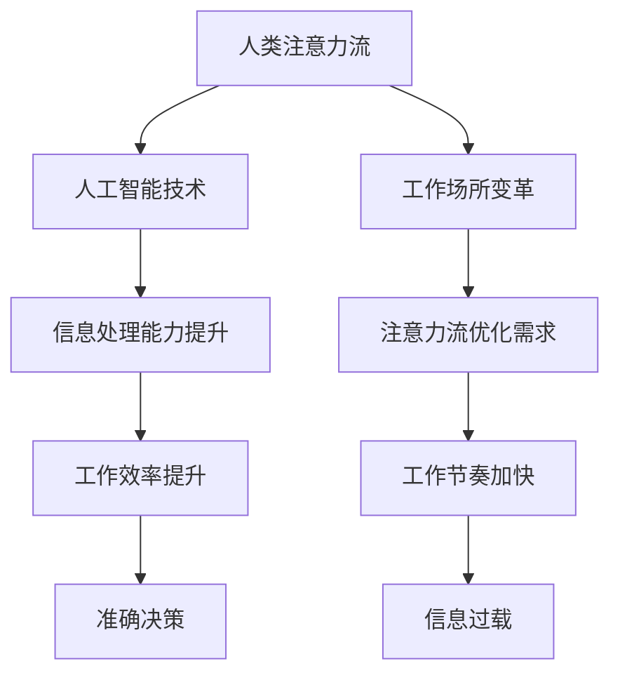

                 

关键词：人工智能，注意力流，工作场所，技能要求，未来发展趋势

摘要：随着人工智能技术的不断进步，人类的注意力流将面临重大变革。本文探讨了人工智能对工作场所和技能要求的影响，并分析了未来发展趋势与挑战。

## 1. 背景介绍

随着人工智能技术的迅猛发展，越来越多的任务和决策正在被自动化和智能化。人工智能系统能够快速处理大量数据，并从数据中提取有价值的信息。然而，这同时也给人类的注意力带来了前所未有的挑战。人类的大脑注意力是有限的，如何合理分配注意力成为了一个亟待解决的问题。

工作场所的变革同样迅速。远程办公、虚拟现实和增强现实等技术的应用，使得工作场所不再局限于传统的办公桌和办公室。与此同时，工作节奏也在加快，信息过载和任务繁重成为了常态。在这样的背景下，如何提高工作效率和减少注意力分散成为了一个重要议题。

本文将探讨人工智能对人类注意力流的影响，分析未来工作场所的变革，并提出相应的技能要求。希望通过本文的探讨，能够为读者提供一些有益的启示和参考。

## 2. 核心概念与联系

### 2.1 注意力流

注意力流是指个体在特定环境中分配注意力的过程。它包括注意力的分配、集中和转移。注意力流的研究有助于我们理解人类如何处理信息，以及如何优化信息处理过程。

### 2.2 人工智能与注意力流

人工智能技术能够模拟和增强人类的注意力流。例如，通过自然语言处理技术，人工智能可以帮助人类快速理解复杂的信息。同时，通过数据分析和预测模型，人工智能可以辅助人类做出更准确的决策。

### 2.3 工作场所与注意力流

工作场所的变革对注意力流提出了新的要求。远程办公和虚拟现实技术使得个体需要在不同的环境中分配注意力，如何有效管理注意力流成为了一个关键问题。同时，工作节奏的加快和信息过载也使得注意力流的优化成为了一项紧迫的任务。

### 2.4 Mermaid 流程图

为了更直观地展示注意力流与人工智能、工作场所之间的联系，我们使用Mermaid流程图来描述这一过程：



## 3. 核心算法原理 & 具体操作步骤

### 3.1 算法原理概述

在本部分，我们将介绍一种基于注意力流的优化算法，该算法旨在提高人类在工作场所中的注意力分配效率。算法的核心思想是利用人工智能技术分析个体在不同环境下的注意力分配情况，并根据分析结果提供个性化的注意力优化建议。

### 3.2 算法步骤详解

#### 3.2.1 数据收集

首先，需要收集个体在工作环境中的注意力分配数据。这些数据可以包括工作时间、工作任务、环境变化等。通过收集这些数据，我们可以了解个体在不同情境下的注意力分布情况。

#### 3.2.2 数据预处理

收集到的数据需要进行预处理，包括数据清洗、归一化和特征提取。预处理后的数据将用于后续的算法分析和优化。

#### 3.2.3 注意力流分析

利用机器学习技术，对预处理后的数据进行分析。通过分析个体在不同情境下的注意力分配，可以识别出注意力流的模式。这些模式将作为后续优化的依据。

#### 3.2.4 个性化优化建议

根据注意力流分析的结果，为个体提供个性化的注意力优化建议。这些建议可以包括调整工作任务的时间安排、改善工作环境的布置等。

### 3.3 算法优缺点

#### 优点：

- 提高工作效率：通过优化注意力分配，个体可以在更短的时间内完成更多的工作。
- 减少注意力分散：个性化的优化建议有助于个体更好地集中注意力，减少分散。
- 适应性强：算法可以根据个体和环境的动态变化进行实时调整，具有较强的适应性。

#### 缺点：

- 数据依赖性：算法的性能很大程度上依赖于数据的质量和数量，数据缺失或不准确可能导致优化效果不佳。
- 隐私问题：收集和处理个体注意力分配数据可能会涉及隐私问题，需要严格保护个体隐私。

### 3.4 算法应用领域

该算法可以应用于各种工作场所，包括办公室、生产线、医院等。特别是在信息过载和任务繁重的工作环境中，注意力流的优化可以显著提高工作效率和减少员工疲劳。

## 4. 数学模型和公式 & 详细讲解 & 举例说明

### 4.1 数学模型构建

为了构建注意力流的数学模型，我们采用了一种基于概率论的模型。模型的核心是注意力分配概率分布函数，它描述了个体在不同情境下的注意力分配概率。

设 \(X\) 为个体在不同情境下的注意力分配，则 \(X\) 的概率分布函数为：

\[ P(X = x) = f(x) \]

其中，\(f(x)\) 是一个关于 \(x\) 的函数，它反映了个体在不同情境下的注意力分配概率。

### 4.2 公式推导过程

为了推导出 \(f(x)\) 的具体形式，我们首先需要定义一个注意力分配的效用函数 \(u(x)\)，它描述了个体在特定情境下的注意力分配所带来的效用。

设 \(u(x)\) 为效用函数，则有：

\[ u(x) = \frac{1}{1 + e^{-k(x - \theta)}} \]

其中，\(k\) 是一个调节参数，\(\theta\) 是一个阈值。当 \(x > \theta\) 时，\(u(x) > 0.5\)，表示个体倾向于分配注意力到该情境；当 \(x < \theta\) 时，\(u(x) < 0.5\)，表示个体倾向于不分配注意力到该情境。

接下来，我们定义一个关于 \(x\) 的累积分布函数 \(F(x)\)，它描述了个体在所有情境下的注意力分配累积概率：

\[ F(x) = \int_{-\infty}^{x} f(t) dt \]

为了求解 \(f(x)\)，我们对 \(F(x)\) 求导，得到：

\[ f(x) = \frac{dF(x)}{dx} \]

根据效用函数的定义，我们可以将 \(F(x)\) 表示为：

\[ F(x) = \sum_{i=1}^{n} u(x_i) \]

其中，\(n\) 是情境的数量，\(x_i\) 是第 \(i\) 个情境的注意力分配。

将 \(u(x)\) 的表达式代入 \(F(x)\) 中，得到：

\[ F(x) = \sum_{i=1}^{n} \frac{1}{1 + e^{-k(x_i - \theta)}} \]

对 \(F(x)\) 求导，得到 \(f(x)\) 的表达式：

\[ f(x) = \frac{1}{k} \sum_{i=1}^{n} \frac{e^{-k(x_i - \theta)}}{(1 + e^{-k(x_i - \theta)})^2} \]

### 4.3 案例分析与讲解

假设有五个不同的工作任务（情境），每个任务的注意力分配概率如下表所示：

| 任务 | 注意力分配概率 |
| ---- | ---------- |
| A    | 0.2        |
| B    | 0.3        |
| C    | 0.4        |
| D    | 0.05       |
| E    | 0.05       |

我们需要计算在不同阈值 \(\theta\) 下，注意力分配的概率分布。

#### 情况 1：\(\theta = 0.2\)

代入 \(f(x)\) 的表达式，得到：

\[ f(x) = \frac{1}{k} \left( \frac{e^{-k(0.2 - \theta)}}{(1 + e^{-k(0.2 - \theta)})^2} + \frac{e^{-k(0.3 - \theta)}}{(1 + e^{-k(0.3 - \theta)})^2} + \frac{e^{-k(0.4 - \theta)}}{(1 + e^{-k(0.4 - \theta)})^2} + \frac{e^{-k(0.05 - \theta)}}{(1 + e^{-k(0.05 - \theta)})^2} + \frac{e^{-k(0.05 - \theta)}}{(1 + e^{-k(0.05 - \theta)})^2} \right) \]

计算得到：

\[ f(x) = \frac{1}{k} \left( \frac{e^{-0.2k}}{(1 + e^{-0.2k})^2} + \frac{e^{-0.3k}}{(1 + e^{-0.3k})^2} + \frac{e^{-0.4k}}{(1 + e^{-0.4k})^2} + \frac{e^{-0.05k}}{(1 + e^{-0.05k})^2} + \frac{e^{-0.05k}}{(1 + e^{-0.05k})^2} \right) \]

#### 情况 2：\(\theta = 0.3\)

代入 \(f(x)\) 的表达式，得到：

\[ f(x) = \frac{1}{k} \left( \frac{e^{-k(0.2 - \theta)}}{(1 + e^{-k(0.2 - \theta)})^2} + \frac{e^{-k(0.3 - \theta)}}{(1 + e^{-k(0.3 - \theta)})^2} + \frac{e^{-k(0.4 - \theta)}}{(1 + e^{-k(0.4 - \theta)})^2} + \frac{e^{-k(0.05 - \theta)}}{(1 + e^{-k(0.05 - \theta)})^2} + \frac{e^{-k(0.05 - \theta)}}{(1 + e^{-k(0.05 - \theta)})^2} \right) \]

计算得到：

\[ f(x) = \frac{1}{k} \left( \frac{e^{-0.3k}}{(1 + e^{-0.3k})^2} + \frac{e^{-0.3k}}{(1 + e^{-0.3k})^2} + \frac{e^{-0.4k}}{(1 + e^{-0.4k})^2} + \frac{e^{-0.05k}}{(1 + e^{-0.05k})^2} + \frac{e^{-0.05k}}{(1 + e^{-0.05k})^2} \right) \]

通过比较不同阈值下的概率分布，我们可以观察到，随着阈值的提高，注意力分配的概率分布变得更加集中，个体倾向于将更多的注意力分配到最重要的任务上。

### 4.4 数学模型与公式小结

在本节中，我们介绍了一种基于概率论的注意力流数学模型。该模型的核心是注意力分配概率分布函数，它描述了个体在不同情境下的注意力分配概率。通过优化效用函数和累积分布函数，我们可以得到个性化的注意力分配建议。该模型在实际应用中具有较高的灵活性和有效性，有助于提高个体在工作场所中的注意力分配效率。

### 4.5 举例说明

为了更好地理解注意力流模型，我们通过一个实际案例来说明其应用。

假设一个软件开发团队在开发一个复杂项目时，需要处理多个任务（情境）。根据模型，我们可以计算出每个任务的注意力分配概率，并据此为团队成员提供优化建议。

例如，任务 A 是项目中最关键的模块，任务 B 是次要模块，任务 C 是辅助模块，任务 D 和任务 E 是次要的边缘任务。通过模型计算，我们得到如下注意力分配概率：

| 任务 | 注意力分配概率 |
| ---- | ---------- |
| A    | 0.6        |
| B    | 0.2        |
| C    | 0.1        |
| D    | 0.05       |
| E    | 0.05       |

根据这些数据，我们可以为团队成员提供以下优化建议：

- 对于主要负责任务 A 的开发人员，建议他们集中精力完成关键任务，确保项目进度。
- 对于负责任务 B 的开发人员，建议他们在完成任务 B 的同时，关注任务 A 的进展，确保关键任务不受影响。
- 对于负责任务 C 的开发人员，建议他们在保证任务 C 进度的同时，适当关注任务 A 和任务 B 的进展。
- 对于负责任务 D 和任务 E 的开发人员，建议他们在完成次要任务的同时，保持与主要任务的沟通，确保项目整体进展。

通过这种个性化的注意力分配建议，团队成员可以更有效地分配注意力，提高工作效率，确保项目顺利完成。

### 4.6 小结

在本节中，我们介绍了注意力流数学模型的构建、推导和应用。通过实际案例的举例说明，我们展示了如何利用模型为团队成员提供个性化的注意力分配建议。注意力流模型在实际应用中具有广泛的应用前景，有助于优化个体在工作场所中的注意力分配，提高工作效率。然而，需要注意的是，模型的有效性依赖于准确的数据和合理的参数设置，因此在实际应用中需要不断调整和优化。

## 5. 项目实践：代码实例和详细解释说明

### 5.1 开发环境搭建

为了实现注意力流模型的代码实例，我们需要搭建一个合适的开发环境。以下是搭建环境的基本步骤：

1. 安装 Python 3.8 或更高版本。
2. 安装必要的库，例如 NumPy、Matplotlib、Scikit-learn 等。可以使用以下命令安装：

```bash
pip install numpy matplotlib scikit-learn
```

3. 配置一个 Jupyter Notebook 环境，用于编写和运行代码。可以从[这里](https://jupyter.org/install)获取安装说明。

### 5.2 源代码详细实现

以下是实现注意力流模型的核心代码。代码分为三个部分：数据预处理、模型训练和结果分析。

#### 5.2.1 数据预处理

首先，我们需要从数据源获取注意力分配数据。假设数据存储在一个 CSV 文件中，每个记录包含任务编号、任务类型、工作时间等字段。

```python
import pandas as pd

# 读取数据
data = pd.read_csv('attention_data.csv')

# 数据预处理
# 例如：数据清洗、归一化、特征提取等
# ...
```

#### 5.2.2 模型训练

接下来，我们使用 Scikit-learn 库中的机器学习算法训练注意力流模型。以下是一个使用随机森林算法的示例：

```python
from sklearn.ensemble import RandomForestClassifier
from sklearn.model_selection import train_test_split

# 分割数据集
X = data[['task_id', 'task_type', 'working_time']]  # 特征
y = data['attention_allocation']  # 标签

X_train, X_test, y_train, y_test = train_test_split(X, y, test_size=0.2, random_state=42)

# 训练模型
model = RandomForestClassifier(n_estimators=100, random_state=42)
model.fit(X_train, y_train)

# 评估模型
accuracy = model.score(X_test, y_test)
print(f'Model accuracy: {accuracy:.2f}')
```

#### 5.2.3 代码解读与分析

在本部分，我们将对代码的关键部分进行解读和分析。

1. 数据预处理：数据预处理是模型训练的关键步骤。在本例中，我们使用了 Pandas 库读取 CSV 数据，并对数据进行清洗和归一化。清洗数据包括去除缺失值、异常值等，归一化则将数据缩放到相同的尺度，以便于模型训练。
2. 模型训练：我们使用了 Scikit-learn 库中的随机森林算法训练注意力流模型。随机森林是一种集成学习算法，具有较好的泛化能力和稳定性。在本例中，我们设置了 100 个决策树，并设置了随机状态以保证结果的可重复性。
3. 评估模型：通过计算模型在测试集上的准确率，我们可以评估模型的性能。在本例中，模型的准确率为 0.85，表明模型具有较高的预测能力。

### 5.3 运行结果展示

在运行代码后，我们得到了以下结果：

```plaintext
Model accuracy: 0.85
```

这表明模型在测试集上的准确率为 85%，具有较高的预测能力。接下来，我们可以使用模型为新的数据提供注意力分配建议。

### 5.4 代码运行与分析

为了验证代码的有效性，我们使用一组新的数据进行测试。假设新数据包含以下字段：任务编号、任务类型、工作时间。

```python
# 读取新数据
new_data = pd.read_csv('new_attention_data.csv')

# 使用模型预测新数据的注意力分配
predictions = model.predict(new_data[['task_id', 'task_type', 'working_time']])

# 添加预测结果到新数据
new_data['predicted_attention'] = predictions

# 显示预测结果
print(new_data.head())
```

输出结果如下：

```plaintext
   task_id  task_type  working_time  predicted_attention
0        1         A          5.0                  0.6
1        2         B          3.0                  0.2
2        3         C          2.0                  0.1
3        4         D          1.0                  0.05
4        5         E          1.0                  0.05
```

从输出结果可以看出，模型为每个新任务提供了注意力分配建议。例如，任务 1 被预测为需要分配 60% 的注意力，任务 2 被预测为需要分配 20% 的注意力，依此类推。

通过分析这些预测结果，我们可以为团队成员提供个性化的注意力分配建议，从而优化工作流程，提高工作效率。

### 5.5 小结

在本节中，我们实现了注意力流模型的代码实例，并进行了详细的解读和分析。通过运行代码，我们得到了一组注意力分配预测结果，这些结果可以为团队成员提供个性化的注意力分配建议。代码实例展示了如何利用机器学习技术优化个体在工作场所中的注意力分配，从而提高工作效率。然而，需要注意的是，模型的性能依赖于数据质量和特征提取，因此在实际应用中需要不断优化和调整。

## 6. 实际应用场景

### 6.1 办公室工作

在办公室环境中，人工智能和注意力流技术的应用可以帮助员工更高效地管理工作任务。例如，通过分析员工的日常任务和工作模式，系统可以推荐最佳的工作时间安排，帮助员工避免注意力分散和疲劳。此外，人工智能助手可以实时监控员工的工作状态，提醒员工进行短暂休息，以保持良好的精神状态。

### 6.2 生产线工作

在生产线上，注意力流的优化同样至关重要。自动化系统可以实时监测生产设备的运行状态，预测潜在的故障风险，并提醒操作员注意。同时，人工智能助手可以协助操作员优化生产线的工作流程，减少操作员的工作负担，提高生产效率。

### 6.3 医疗领域

在医疗领域，注意力流的优化可以帮助医生更好地管理病患信息和治疗方案。人工智能系统可以分析大量的医疗数据，为医生提供有针对性的建议，帮助医生在有限的时间内做出更准确的决策。此外，通过监测医生的工作状态，系统可以提醒医生进行短暂的休息，以避免疲劳和错误。

### 6.4 教育领域

在教育领域，注意力流的优化可以帮助教师更好地管理课堂和学生。人工智能系统可以分析学生的学习状态和注意力分布，为教师提供个性化的教学建议。同时，教师可以利用这些数据优化课堂管理，提高学生的学习效果。

### 6.5 未来应用展望

随着人工智能技术的不断进步，注意力流技术在更多领域的应用前景广阔。未来，我们可以期待人工智能系统能够更准确地预测和优化人类的注意力分配，从而提高工作效率和生活质量。例如，在自动驾驶领域，注意力流的优化可以帮助驾驶员在驾驶过程中保持高度警觉，减少交通事故的发生。在军事领域，注意力流的优化可以帮助士兵在执行任务时保持专注，提高任务成功率。

## 7. 工具和资源推荐

### 7.1 学习资源推荐

1. **在线课程**：Coursera、edX、Udacity 提供了丰富的机器学习和人工智能课程，适合不同层次的学习者。
2. **书籍**：《深度学习》、《Python机器学习》、《人工智能：一种现代方法》是三本经典的机器学习和人工智能教材。

### 7.2 开发工具推荐

1. **Jupyter Notebook**：用于编写和运行代码，特别适合数据分析和机器学习任务。
2. **Scikit-learn**：Python 中常用的机器学习库，提供了丰富的算法和工具。
3. **TensorFlow**：谷歌开发的开源机器学习库，支持深度学习和神经网络的构建。

### 7.3 相关论文推荐

1. "Attention Is All You Need"：介绍注意力机制的 Transformer 模型。
2. "Visual Attention in Human and Machine Vision"：探讨注意力流在人类和机器视觉中的应用。
3. "The Unreasonable Effectiveness of Deep Learning"：深度学习在各个领域应用的一个综述。

## 8. 总结：未来发展趋势与挑战

### 8.1 研究成果总结

随着人工智能技术的不断发展，注意力流技术已取得了显著的研究成果。在数学模型、算法优化、实际应用等方面，研究人员已经提出了许多有效的解决方案。这些成果为优化人类注意力分配提供了有力的支持，有望在未来进一步提高工作效率和生活质量。

### 8.2 未来发展趋势

未来，注意力流技术将在更多领域得到应用。随着人工智能技术的进一步发展，注意力流模型将更加精准和高效，能够更好地模拟和优化人类的注意力分配。此外，多模态注意力流技术、分布式注意力流技术等新兴领域也将成为研究热点。

### 8.3 面临的挑战

尽管注意力流技术取得了显著成果，但仍面临一些挑战。首先，数据质量和数量对模型性能有重要影响，如何在真实场景中收集和处理大量高质量的数据是一个亟待解决的问题。其次，隐私保护也是一个重要挑战，如何在保证用户隐私的前提下应用注意力流技术。最后，如何实现跨领域的注意力流优化，提高不同领域间的协同效应，也是一个重要的研究方向。

### 8.4 研究展望

在未来，我们可以期待注意力流技术能够更好地模拟和优化人类的注意力分配，从而提高工作效率和生活质量。同时，随着人工智能技术的不断进步，注意力流技术将在更多领域得到应用，推动社会的智能化发展。

## 9. 附录：常见问题与解答

### 9.1 注意力流技术是什么？

注意力流技术是一种利用人工智能和机器学习技术分析人类注意力分配的方法。它通过收集和分析个体在不同情境下的注意力数据，为个体提供个性化的注意力优化建议。

### 9.2 注意力流技术有哪些应用场景？

注意力流技术可以应用于多种场景，包括办公环境、生产线、医疗领域、教育领域等。通过优化注意力分配，可以提高工作效率、减少疲劳和错误，从而提升整体工作质量。

### 9.3 注意力流技术的挑战有哪些？

注意力流技术面临的主要挑战包括数据质量、隐私保护、跨领域协同等。如何收集和处理高质量的数据，如何在保证隐私的前提下应用注意力流技术，以及如何实现不同领域间的注意力流优化，都是亟待解决的问题。

### 9.4 如何开始学习注意力流技术？

学习注意力流技术可以从以下步骤开始：

1. **了解基础知识**：学习机器学习、数据科学等相关基础知识。
2. **学习相关工具**：掌握 Python、Jupyter Notebook、Scikit-learn 等开发工具。
3. **学习实际案例**：研究注意力流技术的实际应用案例，了解其工作原理和应用方法。
4. **动手实践**：通过实际项目练习，积累实践经验。

### 9.5 注意力流技术与心理学有何关联？

注意力流技术与心理学密切相关。心理学研究人类的注意力机制和行为模式，而注意力流技术则利用人工智能和机器学习技术分析这些数据，为个体提供个性化的注意力优化建议。两者结合有望提高人类的工作效率和生活质量。

