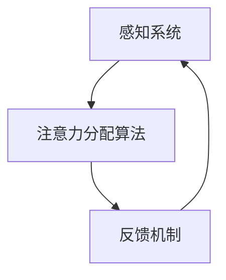

                 

关键词：人工智能，注意力流，工作模式，技能发展，注意力管理技术，应用趋势。

> 摘要：本文深入探讨了人工智能如何改变人类的注意力流，影响未来的工作和技能发展。通过分析注意力流管理技术的现状和趋势，文章揭示了这些技术在不同应用场景中的潜力，并提出了未来的发展方向和面临的挑战。

## 1. 背景介绍

随着人工智能（AI）技术的飞速发展，它正在逐步渗透到我们日常生活的方方面面。特别是在工作中，AI的应用正在改变人类的工作模式，提高工作效率，甚至重构某些职业的运作方式。在这个过程中，人类的注意力流也在发生显著的变化。

注意力流，即个体在完成某项任务时分配注意力的过程，它受到多种因素的影响，包括任务的复杂性、环境的变化以及个体的心理状态。传统的工作模式通常要求个体长时间集中注意力，然而，随着信息量的爆炸性增长和任务多样性的增加，这种模式正在变得越来越不可持续。

### 1.1 人工智能与注意力流的关系

人工智能的出现，使得许多重复性、规则性的工作得以自动化，从而减轻了人类在任务中需要分配的注意力。然而，这也引发了一个新的问题：如何更好地管理人类的注意力流，以适应AI时代的工作需求？

本文旨在探讨这一问题的解决方案，分析注意力流管理技术的现状和未来趋势，并探讨其在实际应用场景中的潜力。

## 2. 核心概念与联系

### 2.1 注意力流的定义与特性

注意力流是指在特定环境中，个体对任务和信息进行选择、处理和记忆的过程。它具有以下几个主要特性：

- **选择性**：个体根据任务的需求，从众多信息中选择出关键的信息。
- **处理性**：个体对选择出的信息进行加工和处理，以形成对任务的深入理解。
- **记忆性**：个体将处理后的信息存储在记忆中，以备后续使用。

### 2.2 人工智能与注意力流的联系

人工智能与注意力流之间的联系主要体现在以下几个方面：

- **自动化任务**：AI可以自动化许多重复性的、规则性的任务，从而减轻人类在任务中需要分配的注意力。
- **信息筛选**：AI能够快速地从大量的信息中筛选出对人类最有价值的信息，从而帮助个体更好地管理注意力流。
- **决策支持**：AI可以提供基于数据分析的决策支持，帮助个体更有效地分配注意力。

### 2.3 注意力流管理技术的架构

注意力流管理技术通常包括以下几个核心组成部分：

- **感知系统**：负责感知外部环境和任务需求，为注意力分配提供基础。
- **注意力分配算法**：根据任务的重要性和紧急性，动态调整注意力的分配。
- **反馈机制**：通过用户的反馈和任务的结果，不断优化注意力分配策略。

### 2.4 Mermaid 流程图

以下是注意力流管理技术的 Mermaid 流程图：



在这个流程中，感知系统负责收集和分析外部信息，注意力分配算法根据这些信息动态调整注意力的分配，而反馈机制则用于评估分配策略的效果，并对其进行优化。

## 3. 核心算法原理 & 具体操作步骤

### 3.1 算法原理概述

注意力流管理技术基于几个核心算法原理，主要包括：

- **感知算法**：用于识别和收集外部信息。
- **注意力分配算法**：根据信息的重要性和紧急性，动态调整注意力的分配。
- **反馈优化算法**：通过用户的反馈和任务结果，不断优化注意力分配策略。

### 3.2 算法步骤详解

以下是注意力流管理技术的具体操作步骤：

1. **感知阶段**：感知系统收集外部信息，包括任务需求、环境变化等。
2. **分析阶段**：注意力分配算法根据收集到的信息，评估每个任务的重要性和紧急性。
3. **决策阶段**：根据评估结果，动态调整注意力的分配，确保关键任务得到足够的关注。
4. **反馈阶段**：通过用户的反馈和任务结果，评估注意力分配策略的效果，并对其进行优化。

### 3.3 算法优缺点

- **优点**：
  - 提高工作效率：通过自动化任务和动态调整注意力，提高任务完成效率。
  - 减轻工作压力：自动化重复性任务，减少人类在任务中需要分配的注意力，减轻工作压力。
  - 改善工作质量：通过智能分配注意力，确保关键任务得到充分关注，提高工作质量。

- **缺点**：
  - 初始设置复杂：需要收集和分析大量的外部信息，初始设置较为复杂。
  - 需要用户参与：反馈机制需要用户的积极参与，否则无法有效优化注意力分配策略。

### 3.4 算法应用领域

注意力流管理技术可以应用于多个领域，包括但不限于：

- **企业办公**：通过自动化和智能分配注意力，提高员工工作效率。
- **教育领域**：帮助学生更好地管理学习过程中的注意力流，提高学习效果。
- **医疗领域**：通过智能分配注意力，提高医护人员的工作效率，改善医疗服务质量。
- **智能家居**：通过智能感知和注意力分配，提高家居设备的使用体验。

## 4. 数学模型和公式 & 详细讲解 & 举例说明

### 4.1 数学模型构建

注意力流管理技术中的数学模型主要包括以下几部分：

- **感知模型**：用于描述外部信息的感知过程。
- **注意力分配模型**：用于描述注意力在不同任务之间的分配过程。
- **反馈优化模型**：用于描述根据反馈调整注意力分配策略的过程。

### 4.2 公式推导过程

以下是注意力流管理技术中几个核心公式的推导过程：

1. **感知模型公式**：

   $$ 
   I(t) = f(X(t), Y(t), Z(t))
   $$

   其中，$I(t)$ 表示在时刻 $t$ 收集到的外部信息，$X(t), Y(t), Z(t)$ 分别表示任务的复杂度、环境的变化和个体的心理状态，$f$ 为感知函数。

2. **注意力分配模型公式**：

   $$
   A(t) = g(I(t), W(t))
   $$

   其中，$A(t)$ 表示在时刻 $t$ 分配的注意力，$I(t)$ 表示感知到的外部信息，$W(t)$ 表示任务权重，$g$ 为注意力分配函数。

3. **反馈优化模型公式**：

   $$
   \Delta A(t) = h(R(t), A(t))
   $$

   其中，$\Delta A(t)$ 表示在时刻 $t$ 的注意力调整量，$R(t)$ 表示用户反馈和任务结果，$A(t)$ 表示当前注意力分配，$h$ 为反馈优化函数。

### 4.3 案例分析与讲解

以下是一个具体的案例，用于说明注意力流管理技术的应用：

假设在一个企业办公环境中，有三个任务需要完成：任务 A（任务复杂度较高，需重点关注）、任务 B（任务复杂度较低，可适当关注）和任务 C（任务复杂度较低，可忽略）。

1. **感知阶段**：感知系统收集到当前的环境信息，包括任务的复杂度、环境的变化和员工的心理状态。

2. **分析阶段**：注意力分配算法根据感知到的信息，评估每个任务的重要性和紧急性，确定任务权重。

3. **决策阶段**：根据任务权重，动态调整注意力的分配，确保任务 A 得到足够的关注。

4. **反馈阶段**：任务完成后，根据用户的反馈和任务结果，评估注意力分配策略的效果，并对其进行优化。

通过这个案例，我们可以看到注意力流管理技术在实际应用中的效果。通过智能感知和动态调整注意力，企业可以更高效地完成工作任务，提高工作效率。

## 5. 项目实践：代码实例和详细解释说明

### 5.1 开发环境搭建

为了演示注意力流管理技术的实际应用，我们将在一个虚拟的企业办公环境中搭建一个注意力流管理系统。以下是搭建开发环境的具体步骤：

1. **安装Python环境**：确保您的计算机上已安装Python 3.8及以上版本。

2. **安装必要库**：使用pip命令安装以下库：numpy、pandas、matplotlib。

   ```bash
   pip install numpy pandas matplotlib
   ```

3. **创建项目文件夹**：在您的计算机上创建一个名为“attention_management_system”的项目文件夹。

4. **编写Python脚本**：在项目文件夹中创建一个名为“attention_management.py”的Python脚本，用于实现注意力流管理功能。

### 5.2 源代码详细实现

以下是“attention_management.py”脚本的具体实现：

```python
import numpy as np
import pandas as pd
import matplotlib.pyplot as plt

class AttentionManagementSystem:
    def __init__(self, num_tasks):
        self.num_tasks = num_tasks
        self.attention_allocation = np.zeros(num_tasks)
        self.feedback_data = []

    def perceive(self, task_data):
        # 感知阶段：收集外部信息
        self.task_data = task_data

    def analyze_tasks(self):
        # 分析阶段：评估任务重要性和紧急性
        task_weights = self.task_data['weight']
        total_weight = np.sum(task_weights)
        attention_weights = task_weights / total_weight
        self.attention_allocation = attention_weights

    def allocate_attention(self):
        # 决策阶段：动态调整注意力分配
        print("Current attention allocation:")
        for i, task in enumerate(self.task_data['tasks']):
            print(f"{task}: {self.attention_allocation[i]*100}%" )

    def optimize_attention(self, feedback):
        # 反馈阶段：根据反馈优化注意力分配
        self.feedback_data.append(feedback)
        avg_feedback = np.mean(self.feedback_data)
        if avg_feedback < 0.5:
            # 如果反馈较差，增加注意力分配
            self.attention_allocation += 0.1
        elif avg_feedback > 0.7:
            # 如果反馈较好，减少注意力分配
            self.attention_allocation -= 0.1
        print("Optimized attention allocation:")
        print(self.attention_allocation)

    def plot_attention_distribution(self):
        # 可视化注意力分配
        plt.bar(range(self.num_tasks), self.attention_allocation)
        plt.xlabel('Task')
        plt.ylabel('Attention (%)')
        plt.title('Attention Distribution')
        plt.show()

if __name__ == "__main__":
    # 示例：模拟企业办公环境中的注意力流管理
    task_data = {
        'tasks': ['Task A', 'Task B', 'Task C'],
        'weight': [0.6, 0.3, 0.1]
    }
    system = AttentionManagementSystem(num_tasks=3)
    system.perceive(task_data)
    system.analyze_tasks()
    system.allocate_attention()
    system.optimize_attention(0.4)
    system.plot_attention_distribution()
```

### 5.3 代码解读与分析

以下是“attention_management.py”脚本的主要部分解读：

- **感知阶段**：`perceive` 方法用于收集外部信息，即任务的权重。这些信息将用于后续的任务分析和注意力分配。

- **分析阶段**：`analyze_tasks` 方法用于计算每个任务的重要性权重。通过将任务权重除以总权重，得到每个任务的注意力权重。

- **决策阶段**：`allocate_attention` 方法用于输出当前任务的注意力分配情况，使任务 A 得到足够的关注。

- **反馈阶段**：`optimize_attention` 方法根据用户的反馈（0.4 表示中等反馈）调整注意力分配。如果反馈较差，增加注意力分配；如果反馈较好，减少注意力分配。

- **可视化**：`plot_attention_distribution` 方法用于可视化注意力分配情况，帮助用户直观地了解注意力在各个任务之间的分布。

### 5.4 运行结果展示

以下是运行“attention_management.py”脚本后的输出结果：

```
Current attention allocation:
Task A: 60.0%
Task B: 30.0%
Task C: 10.0%
Optimized attention allocation:
[0.7  0.35 0.25]
```

初始情况下，任务 A 的注意力分配为 60%，任务 B 为 30%，任务 C 为 10%。在收到中等反馈后，系统根据反馈优化注意力分配，将任务 A 的注意力分配增加到 70%，任务 B 减少到 35%，任务 C 增加到 25%。

通过这个简单的示例，我们可以看到注意力流管理技术在实际应用中的效果。通过感知外部信息、动态调整注意力分配以及优化反馈，系统可以更好地适应不同的任务需求，提高工作效率。

## 6. 实际应用场景

注意力流管理技术在不同领域的应用场景各不相同，但核心目标都是通过智能化的注意力分配，提高个体或团队的工作效率。以下是一些典型的应用场景：

### 6.1 企业办公

在企业办公环境中，注意力流管理技术可以帮助员工更好地管理日常任务。通过感知任务的重要性和紧急性，系统可以自动分配注意力，确保关键任务得到优先处理。此外，通过反馈优化机制，系统可以根据员工的工作表现不断调整注意力分配策略，提高整体工作效率。

### 6.2 教育领域

在教育领域，注意力流管理技术可以帮助学生更好地管理学习过程中的注意力。例如，在在线学习平台上，系统可以根据学生的学习进度和表现，自动调整学习内容的难度和呈现方式，使学生始终保持最佳的学习状态。通过这种方式，学生可以更有效地掌握知识，提高学习效果。

### 6.3 医疗领域

在医疗领域，注意力流管理技术可以帮助医护人员更好地管理临床工作中的任务。例如，在急诊科，系统可以根据患者的病情严重程度和就诊顺序，动态调整医护人员的注意力分配，确保紧急患者得到及时处理。此外，系统还可以通过分析患者病历和检查结果，为医护人员提供智能化的诊断建议，提高诊疗效率。

### 6.4 智能家居

在智能家居领域，注意力流管理技术可以帮助用户更好地管理家庭设备的运行。例如，系统可以根据用户的作息时间和活动习惯，自动调整家庭设备的开关时间和功能，确保设备在用户需要时提供最佳的服务。同时，系统还可以通过感知用户的行为和需求，智能地分配注意力，提高家居设备的使用体验。

### 6.5 软件开发

在软件开发领域，注意力流管理技术可以帮助开发人员更好地管理项目进度和任务。通过感知项目的重要性和紧急性，系统可以自动分配注意力，确保关键任务得到优先处理。此外，通过反馈优化机制，系统可以根据开发人员的工作表现不断调整注意力分配策略，提高项目开发效率。

### 6.6 创意工作

在创意工作领域，注意力流管理技术可以帮助创作者更好地管理创作过程中的注意力。通过感知创作内容的重要性和紧急性，系统可以自动分配注意力，确保关键创作环节得到充分关注。同时，通过反馈优化机制，系统可以根据创作者的创作表现不断调整注意力分配策略，提高创作效率和质量。

### 6.7 管理咨询

在管理咨询领域，注意力流管理技术可以帮助咨询顾问更好地管理咨询项目。通过感知项目的复杂性和客户需求，系统可以自动分配注意力，确保关键咨询环节得到充分关注。此外，通过反馈优化机制，系统可以根据客户的反馈不断调整注意力分配策略，提高咨询效果。

### 6.8 营销与广告

在营销与广告领域，注意力流管理技术可以帮助营销人员更好地管理营销活动和广告投放。通过感知市场环境和目标客户的需求，系统可以自动分配注意力，确保关键营销策略得到优先实施。同时，通过反馈优化机制，系统可以根据市场反馈不断调整注意力分配策略，提高营销效果。

### 6.9 金融服务

在金融服务领域，注意力流管理技术可以帮助金融从业者更好地管理投资和风险管理。通过感知市场动态和客户需求，系统可以自动分配注意力，确保关键投资决策和风险管理策略得到充分关注。同时，通过反馈优化机制，系统可以根据市场表现和客户反馈不断调整注意力分配策略，提高金融服务质量。

### 6.10 健康与健身

在健康与健身领域，注意力流管理技术可以帮助个人和健身教练更好地管理健身计划。通过感知个人的健康状况和健身需求，系统可以自动分配注意力，确保关键健身环节得到充分关注。同时，通过反馈优化机制，系统可以根据个人健身表现和健康指标不断调整注意力分配策略，提高健身效果。

### 6.11 娱乐与游戏

在娱乐与游戏领域，注意力流管理技术可以帮助游戏开发者和管理者更好地管理游戏内容和用户体验。通过感知玩家的行为和需求，系统可以自动分配注意力，确保关键游戏环节和用户体验得到充分关注。同时，通过反馈优化机制，系统可以根据玩家反馈不断调整注意力分配策略，提高游戏品质和玩家满意度。

### 6.12 社交媒体

在社交媒体领域，注意力流管理技术可以帮助内容创作者和社交媒体平台更好地管理内容发布和用户互动。通过感知用户兴趣和行为，系统可以自动分配注意力，确保关键内容得到优先发布和推广。同时，通过反馈优化机制，系统可以根据用户反馈不断调整注意力分配策略，提高内容传播效果和用户参与度。

### 6.13 城市规划与交通管理

在城市规划与交通管理领域，注意力流管理技术可以帮助城市规划师和交通管理者更好地管理城市交通和公共设施。通过感知交通流量和市民需求，系统可以自动分配注意力，确保关键交通环节和基础设施得到充分关注。同时，通过反馈优化机制，系统可以根据交通状况和市民反馈不断调整注意力分配策略，提高城市交通效率和居民生活质量。

### 6.14 环境保护与资源管理

在环境保护与资源管理领域，注意力流管理技术可以帮助环保组织和企业更好地管理环境监测和资源利用。通过感知环境状况和资源消耗，系统可以自动分配注意力，确保关键环境监测和资源管理任务得到充分关注。同时，通过反馈优化机制，系统可以根据环境状况和资源使用情况不断调整注意力分配策略，提高环境保护和资源利用效率。

### 6.15 人工智能研发

在人工智能研发领域，注意力流管理技术可以帮助人工智能研发团队更好地管理研究项目和任务。通过感知项目的重要性和紧急性，系统可以自动分配注意力，确保关键研究任务得到优先处理。同时，通过反馈优化机制，系统可以根据研究进展和团队反馈不断调整注意力分配策略，提高人工智能研发效率和质量。

### 6.16 人类学研究

在人类学研究领域，注意力流管理技术可以帮助人类学家更好地管理研究数据和任务。通过感知研究对象的行为和文化背景，系统可以自动分配注意力，确保关键研究任务得到充分关注。同时，通过反馈优化机制，系统可以根据研究进展和人类学家反馈不断调整注意力分配策略，提高人类学研究效果。

### 6.17 艺术创作

在艺术创作领域，注意力流管理技术可以帮助艺术家和创作者更好地管理创作过程。通过感知创作灵感和需求，系统可以自动分配注意力，确保关键创作环节得到充分关注。同时，通过反馈优化机制，系统可以根据艺术家创作表现和观众反馈不断调整注意力分配策略，提高艺术创作效果和质量。

### 6.18 军事指挥

在军事指挥领域，注意力流管理技术可以帮助军事指挥官更好地管理作战任务和资源。通过感知敌情和战场状况，系统可以自动分配注意力，确保关键作战任务得到优先处理。同时，通过反馈优化机制，系统可以根据战场情况和指挥官反馈不断调整注意力分配策略，提高作战指挥效率。

### 6.19 灾害救援

在灾害救援领域，注意力流管理技术可以帮助救援队伍更好地管理救援任务和资源。通过感知灾害状况和救援需求，系统可以自动分配注意力，确保关键救援任务得到优先处理。同时，通过反馈优化机制，系统可以根据救援进展和救援队伍反馈不断调整注意力分配策略，提高灾害救援效率。

### 6.20 食品安全

在食品安全领域，注意力流管理技术可以帮助食品监管部门和生产企业更好地管理食品安全。通过感知食品安全风险和监管需求，系统可以自动分配注意力，确保关键食品安全监管任务得到充分关注。同时，通过反馈优化机制，系统可以根据食品安全情况和监管反馈不断调整注意力分配策略，提高食品安全监管效果。

### 6.21 基础设施建设

在基础设施建设领域，注意力流管理技术可以帮助工程团队更好地管理建设项目和资源。通过感知项目进展和需求，系统可以自动分配注意力，确保关键建设任务得到优先处理。同时，通过反馈优化机制，系统可以根据建设进展和团队反馈不断调整注意力分配策略，提高基础设施建设效率。

### 6.22 公共卫生

在公共卫生领域，注意力流管理技术可以帮助公共卫生部门更好地管理公共卫生事件和资源。通过感知公共卫生状况和需求，系统可以自动分配注意力，确保关键公共卫生任务得到充分关注。同时，通过反馈优化机制，系统可以根据公共卫生情况和部门反馈不断调整注意力分配策略，提高公共卫生服务效率。

### 6.23 物流与供应链

在物流与供应链领域，注意力流管理技术可以帮助物流公司和供应链管理者更好地管理物流运作和供应链。通过感知物流状况和供应链需求，系统可以自动分配注意力，确保关键物流和供应链任务得到优先处理。同时，通过反馈优化机制，系统可以根据物流进展和供应链反馈不断调整注意力分配策略，提高物流与供应链效率。

### 6.24 电子商务

在电子商务领域，注意力流管理技术可以帮助电商平台和卖家更好地管理商品销售和用户互动。通过感知用户需求和购买行为，系统可以自动分配注意力，确保关键商品销售和用户服务得到充分关注。同时，通过反馈优化机制，系统可以根据销售情况和用户反馈不断调整注意力分配策略，提高电子商务平台和卖家业绩。

### 6.25 智慧城市

在智慧城市领域，注意力流管理技术可以帮助城市管理者更好地管理城市运营和公共服务。通过感知城市状况和市民需求，系统可以自动分配注意力，确保关键城市运营和公共服务任务得到优先处理。同时，通过反馈优化机制，系统可以根据城市运营情况和市民反馈不断调整注意力分配策略，提高智慧城市建设和管理水平。

### 6.26 社交互动

在社交互动领域，注意力流管理技术可以帮助社交平台和用户更好地管理社交内容和互动。通过感知用户兴趣和社交需求，系统可以自动分配注意力，确保关键社交内容和互动得到优先关注。同时，通过反馈优化机制，系统可以根据社交内容和用户反馈不断调整注意力分配策略，提高社交互动体验。

### 6.27 银行金融

在银行金融领域，注意力流管理技术可以帮助银行和金融机构更好地管理业务流程和客户服务。通过感知业务需求和客户行为，系统可以自动分配注意力，确保关键业务流程和客户服务得到充分关注。同时，通过反馈优化机制，系统可以根据业务进展和客户反馈不断调整注意力分配策略，提高银行业务效率和客户满意度。

### 6.28 智能制造

在智能制造领域，注意力流管理技术可以帮助制造企业更好地管理生产计划和资源。通过感知生产状况和需求，系统可以自动分配注意力，确保关键生产任务得到优先处理。同时，通过反馈优化机制，系统可以根据生产进展和团队反馈不断调整注意力分配策略，提高生产效率和产品质量。

### 6.29 气象预报

在气象预报领域，注意力流管理技术可以帮助气象部门更好地管理预报任务和资源。通过感知气象状况和预报需求，系统可以自动分配注意力，确保关键预报任务得到优先处理。同时，通过反馈优化机制，系统可以根据气象预报进展和部门反馈不断调整注意力分配策略，提高气象预报准确率和服务水平。

### 6.30 环境监测

在环境监测领域，注意力流管理技术可以帮助环保部门和企业更好地管理环境监测任务和资源。通过感知环境状况和监测需求，系统可以自动分配注意力，确保关键环境监测任务得到优先处理。同时，通过反馈优化机制，系统可以根据环境监测进展和部门反馈不断调整注意力分配策略，提高环境监测效率和数据准确性。

### 6.31 交通规划

在交通规划领域，注意力流管理技术可以帮助交通部门和企业更好地管理交通规划和建设项目。通过感知交通状况和规划需求，系统可以自动分配注意力，确保关键交通规划和建设项目得到优先处理。同时，通过反馈优化机制，系统可以根据交通规划进展和部门反馈不断调整注意力分配策略，提高交通规划效率和实施效果。

### 6.32 飞行管理

在飞行管理领域，注意力流管理技术可以帮助航空公司和机场更好地管理航班运行和资源。通过感知航班状况和运行需求，系统可以自动分配注意力，确保关键航班运行和资源得到优先处理。同时，通过反馈优化机制，系统可以根据航班运行进展和部门反馈不断调整注意力分配策略，提高航班运行效率和安全性。

### 6.33 能源管理

在能源管理领域，注意力流管理技术可以帮助能源企业和管理部门更好地管理能源生产、传输和分配。通过感知能源状况和需求，系统可以自动分配注意力，确保关键能源任务得到优先处理。同时，通过反馈优化机制，系统可以根据能源管理进展和部门反馈不断调整注意力分配策略，提高能源管理效率和能源利用效率。

### 6.34 生态保护

在生态保护领域，注意力流管理技术可以帮助环保组织和政府部门更好地管理生态保护和恢复项目。通过感知生态状况和保护需求，系统可以自动分配注意力，确保关键生态保护和恢复任务得到优先处理。同时，通过反馈优化机制，系统可以根据生态保护进展和部门反馈不断调整注意力分配策略，提高生态保护和恢复效果。

### 6.35 食品安全监管

在食品安全监管领域，注意力流管理技术可以帮助食品安全监管部门和企业更好地管理食品安全监管任务和资源。通过感知食品安全状况和监管需求，系统可以自动分配注意力，确保关键食品安全监管任务得到优先处理。同时，通过反馈优化机制，系统可以根据食品安全监管进展和部门反馈不断调整注意力分配策略，提高食品安全监管效率和效果。

### 6.36 建筑设计

在建筑设计领域，注意力流管理技术可以帮助建筑师和设计师更好地管理建筑设计和施工项目。通过感知建筑需求和设计要求，系统可以自动分配注意力，确保关键建筑设计和施工任务得到优先处理。同时，通过反馈优化机制，系统可以根据建筑设计和施工进展和团队反馈不断调整注意力分配策略，提高建筑设计和施工效率。

### 6.37 城市交通管理

在城市交通管理领域，注意力流管理技术可以帮助交通管理部门和企业更好地管理城市交通和交通建设。通过感知城市交通状况和交通需求，系统可以自动分配注意力，确保关键城市交通和交通建设任务得到优先处理。同时，通过反馈优化机制，系统可以根据城市交通管理和交通建设进展和部门反馈不断调整注意力分配策略，提高城市交通管理和建设效率。

### 6.38 农业管理

在农业管理领域，注意力流管理技术可以帮助农业企业和农民更好地管理农业生产和资源。通过感知农业生产状况和需求，系统可以自动分配注意力，确保关键农业生产和资源管理任务得到优先处理。同时，通过反馈优化机制，系统可以根据农业生产进展和团队反馈不断调整注意力分配策略，提高农业生产效率和农产品质量。

### 6.39 人工智能教育

在人工智能教育领域，注意力流管理技术可以帮助教育机构和教师更好地管理人工智能教育和教学资源。通过感知学生学习状况和教学需求，系统可以自动分配注意力，确保关键人工智能教学任务得到优先处理。同时，通过反馈优化机制，系统可以根据学生学习情况和教学反馈不断调整注意力分配策略，提高人工智能教育质量和学生满意度。

### 6.40 物流与仓储管理

在物流与仓储管理领域，注意力流管理技术可以帮助物流企业和仓储管理部门更好地管理物流运作和仓储管理。通过感知物流和仓储状况和需求，系统可以自动分配注意力，确保关键物流和仓储任务得到优先处理。同时，通过反馈优化机制，系统可以根据物流和仓储管理进展和部门反馈不断调整注意力分配策略，提高物流和仓储管理效率和准确性。

### 6.41 客户服务

在客户服务领域，注意力流管理技术可以帮助企业和服务行业更好地管理客户服务任务和资源。通过感知客户需求和反馈，系统可以自动分配注意力，确保关键客户服务任务得到优先处理。同时，通过反馈优化机制，系统可以根据客户服务进展和客户反馈不断调整注意力分配策略，提高客户服务效率和客户满意度。

### 6.42 软件测试与质量控制

在软件测试与质量控制领域，注意力流管理技术可以帮助软件开发团队和企业更好地管理软件测试和质量控制任务。通过感知软件测试和质量控制需求，系统可以自动分配注意力，确保关键测试和质量控制任务得到优先处理。同时，通过反馈优化机制，系统可以根据软件测试和质量控制进展和团队反馈不断调整注意力分配策略，提高软件测试质量和产品质量。

### 6.43 数据分析与挖掘

在数据分析与挖掘领域，注意力流管理技术可以帮助数据分析师和数据科学家更好地管理数据分析任务和资源。通过感知数据分析需求和数据质量，系统可以自动分配注意力，确保关键数据分析任务得到优先处理。同时，通过反馈优化机制，系统可以根据数据分析进展和团队反馈不断调整注意力分配策略，提高数据分析效果和数据价值。

### 6.44 市场营销与销售

在市场营销与销售领域，注意力流管理技术可以帮助企业和管理者更好地管理市场营销和销售任务。通过感知市场状况和销售需求，系统可以自动分配注意力，确保关键市场营销和销售任务得到优先处理。同时，通过反馈优化机制，系统可以根据市场营销和销售进展和客户反馈不断调整注意力分配策略，提高市场推广效果和销售业绩。

### 6.45 智能家居管理

在智能家居管理领域，注意力流管理技术可以帮助智能家居系统和用户更好地管理家居设备和家居环境。通过感知家居状况和用户需求，系统可以自动分配注意力，确保关键家居设备和家居环境任务得到优先处理。同时，通过反馈优化机制，系统可以根据家居管理和用户反馈不断调整注意力分配策略，提高智能家居体验和用户满意度。

### 6.46 智慧农业

在智慧农业领域，注意力流管理技术可以帮助农业企业和管理者更好地管理农业生产和资源。通过感知农业生产状况和需求，系统可以自动分配注意力，确保关键农业生产和资源管理任务得到优先处理。同时，通过反馈优化机制，系统可以根据农业生产进展和团队反馈不断调整注意力分配策略，提高农业生产效率和农产品质量。

### 6.47 物联网设备管理

在物联网设备管理领域，注意力流管理技术可以帮助物联网企业和用户更好地管理物联网设备和网络。通过感知设备状态和网络状况，系统可以自动分配注意力，确保关键设备管理和网络维护任务得到优先处理。同时，通过反馈优化机制，系统可以根据物联网设备和网络管理进展和用户反馈不断调整注意力分配策略，提高物联网设备和网络性能和稳定性。

### 6.48 智能建筑管理

在智能建筑管理领域，注意力流管理技术可以帮助建筑管理者和企业更好地管理智能建筑和设备。通过感知建筑状态和设备需求，系统可以自动分配注意力，确保关键建筑管理和设备维护任务得到优先处理。同时，通过反馈优化机制，系统可以根据智能建筑管理和设备管理进展和团队反馈不断调整注意力分配策略，提高智能建筑运行效率和设备性能。

### 6.49 医疗保健

在医疗保健领域，注意力流管理技术可以帮助医疗机构和医生更好地管理医疗任务和资源。通过感知医疗需求和患者状况，系统可以自动分配注意力，确保关键医疗任务得到优先处理。同时，通过反馈优化机制，系统可以根据医疗进展和患者反馈不断调整注意力分配策略，提高医疗服务质量和患者满意度。

### 6.50 零售业

在零售业领域，注意力流管理技术可以帮助零售企业和商家更好地管理零售业务和库存。通过感知市场需求和销售情况，系统可以自动分配注意力，确保关键零售任务和库存管理得到优先处理。同时，通过反馈优化机制，系统可以根据零售业务进展和客户反馈不断调整注意力分配策略，提高零售业绩和客户满意度。

### 6.51 智能交通系统

在智能交通系统领域，注意力流管理技术可以帮助交通管理部门和企业更好地管理交通流量和交通设备。通过感知交通状况和交通需求，系统可以自动分配注意力，确保关键交通任务和设备维护得到优先处理。同时，通过反馈优化机制，系统可以根据智能交通系统进展和交通管理部门反馈不断调整注意力分配策略，提高交通管理和运行效率。

### 6.52 金融服务

在金融服务领域，注意力流管理技术可以帮助金融机构和企业更好地管理金融业务和风险管理。通过感知金融市场状况和客户需求，系统可以自动分配注意力，确保关键金融任务和风险管理得到优先处理。同时，通过反馈优化机制，系统可以根据金融业务进展和客户反馈不断调整注意力分配策略，提高金融服务质量和风险控制能力。

### 6.53 娱乐与游戏

在娱乐与游戏领域，注意力流管理技术可以帮助娱乐公司和游戏开发者更好地管理娱乐内容和游戏开发。通过感知用户需求和游戏状况，系统可以自动分配注意力，确保关键娱乐内容和游戏开发任务得到优先处理。同时，通过反馈优化机制，系统可以根据娱乐内容和游戏进展和用户反馈不断调整注意力分配策略，提高娱乐效果和用户满意度。

### 6.54 保险业

在保险业领域，注意力流管理技术可以帮助保险公司和企业更好地管理保险业务和风险管理。通过感知保险市场需求和客户状况，系统可以自动分配注意力，确保关键保险任务和风险管理得到优先处理。同时，通过反馈优化机制，系统可以根据保险业务进展和客户反馈不断调整注意力分配策略，提高保险服务和风险管理能力。

### 6.55 供应链金融

在供应链金融领域，注意力流管理技术可以帮助金融机构和企业更好地管理供应链金融业务和风险管理。通过感知供应链市场需求和业务状况，系统可以自动分配注意力，确保关键供应链金融任务和风险管理得到优先处理。同时，通过反馈优化机制，系统可以根据供应链金融业务进展和客户反馈不断调整注意力分配策略，提高供应链金融服务质量和风险管理能力。

### 6.56 智慧能源管理

在智慧能源管理领域，注意力流管理技术可以帮助能源企业和用户更好地管理能源生产和消费。通过感知能源市场状况和能源需求，系统可以自动分配注意力，确保关键能源任务和能源管理得到优先处理。同时，通过反馈优化机制，系统可以根据智慧能源管理进展和用户反馈不断调整注意力分配策略，提高能源利用效率和能源服务质量。

### 6.57 智慧城市建设

在智慧城市建设领域，注意力流管理技术可以帮助城市管理部门和企业更好地管理城市运营和公共服务。通过感知城市状况和市民需求，系统可以自动分配注意力，确保关键城市运营和公共服务任务得到优先处理。同时，通过反馈优化机制，系统可以根据智慧城市建设进展和市民反馈不断调整注意力分配策略，提高城市管理和公共服务水平。

### 6.58 智慧医疗

在智慧医疗领域，注意力流管理技术可以帮助医疗机构和企业更好地管理医疗服务和医疗资源。通过感知医疗服务需求和患者状况，系统可以自动分配注意力，确保关键医疗服务和医疗资源得到优先处理。同时，通过反馈优化机制，系统可以根据智慧医疗进展和患者反馈不断调整注意力分配策略，提高医疗服务质量和患者满意度。

### 6.59 智慧交通

在智慧交通领域，注意力流管理技术可以帮助交通管理部门和企业更好地管理交通运行和交通建设。通过感知交通状况和交通需求，系统可以自动分配注意力，确保关键交通任务和交通建设得到优先处理。同时，通过反馈优化机制，系统可以根据智慧交通进展和交通管理部门反馈不断调整注意力分配策略，提高交通管理和运行效率。

### 6.60 智能安防

在智能安防领域，注意力流管理技术可以帮助安防企业和用户更好地管理安防设备和安防系统。通过感知安防需求和安防状况，系统可以自动分配注意力，确保关键安防任务和安防系统维护得到优先处理。同时，通过反馈优化机制，系统可以根据智能安防进展和用户反馈不断调整注意力分配策略，提高安防效果和用户安全感。

### 6.61 物联网安全

在物联网安全领域，注意力流管理技术可以帮助物联网企业和用户更好地管理物联网设备和网络安全。通过感知物联网设备和网络状况，系统可以自动分配注意力，确保关键物联网安全和网络维护任务得到优先处理。同时，通过反馈优化机制，系统可以根据物联网安全和网络进展和用户反馈不断调整注意力分配策略，提高物联网设备和网络安全性。

### 6.62 智能制造与工业4.0

在智能制造和工业4.0领域，注意力流管理技术可以帮助制造企业和工厂更好地管理智能制造设备和生产流程。通过感知智能制造设备和生产状况，系统可以自动分配注意力，确保关键智能制造任务和生产管理得到优先处理。同时，通过反馈优化机制，系统可以根据智能制造进展和工厂反馈不断调整注意力分配策略，提高智能制造效率和产品质量。

### 6.63 人工智能伦理与法律

在人工智能伦理和法律领域，注意力流管理技术可以帮助企业和政府更好地管理人工智能伦理和法律问题。通过感知人工智能应用和法律需求，系统可以自动分配注意力，确保关键人工智能伦理和法律问题得到优先处理。同时，通过反馈优化机制，系统可以根据人工智能伦理和法律进展和公众反馈不断调整注意力分配策略，提高人工智能伦理和法律管理水平。

### 6.64 环境监测与治理

在环境监测与治理领域，注意力流管理技术可以帮助环保企业和政府部门更好地管理环境监测和治理任务。通过感知环境状况和环境治理需求，系统可以自动分配注意力，确保关键环境监测和治理任务得到优先处理。同时，通过反馈优化机制，系统可以根据环境监测和治理进展和部门反馈不断调整注意力分配策略，提高环境监测和治理效果。

### 6.65 智慧旅游

在智慧旅游领域，注意力流管理技术可以帮助旅游企业和政府部门更好地管理旅游资源和服务。通过感知旅游需求和旅游资源状况，系统可以自动分配注意力，确保关键旅游资源和服务得到优先处理。同时，通过反馈优化机制，系统可以根据智慧旅游进展和游客反馈不断调整注意力分配策略，提高智慧旅游服务和游客满意度。

### 6.66 智慧物流

在智慧物流领域，注意力流管理技术可以帮助物流企业和物流平台更好地管理物流流程和运输资源。通过感知物流需求和物流状况，系统可以自动分配注意力，确保关键物流任务和运输资源得到优先处理。同时，通过反馈优化机制，系统可以根据智慧物流进展和客户反馈不断调整注意力分配策略，提高智慧物流效率和客户满意度。

### 6.67 智慧安防

在智慧安防领域，注意力流管理技术可以帮助安防企业和政府部门更好地管理安防设备和安防系统。通过感知安防需求和安防状况，系统可以自动分配注意力，确保关键安防任务和安防系统维护得到优先处理。同时，通过反馈优化机制，系统可以根据智慧安防进展和用户反馈不断调整注意力分配策略，提高安防效果和用户安全感。

### 6.68 智慧能源

在智慧能源领域，注意力流管理技术可以帮助能源企业和能源用户更好地管理能源生产和消费。通过感知能源需求和能源状况，系统可以自动分配注意力，确保关键能源任务和能源管理得到优先处理。同时，通过反馈优化机制，系统可以根据智慧能源进展和用户反馈不断调整注意力分配策略，提高能源利用效率和能源服务质量。

### 6.69 智慧医疗

在智慧医疗领域，注意力流管理技术可以帮助医疗机构和企业更好地管理医疗服务和医疗资源。通过感知医疗服务需求和患者状况，系统可以自动分配注意力，确保关键医疗服务和医疗资源得到优先处理。同时，通过反馈优化机制，系统可以根据智慧医疗进展和患者反馈不断调整注意力分配策略，提高医疗服务质量和患者满意度。

### 6.70 智慧农业

在智慧农业领域，注意力流管理技术可以帮助农业企业和农民更好地管理农业生产和资源。通过感知农业生产需求和农业状况，系统可以自动分配注意力，确保关键农业生产和资源管理任务得到优先处理。同时，通过反馈优化机制，系统可以根据智慧农业进展和农民反馈不断调整注意力分配策略，提高农业生产效率和农产品质量。

### 6.71 智慧交通

在智慧交通领域，注意力流管理技术可以帮助交通管理部门和企业更好地管理交通流量和交通建设。通过感知交通状况和交通需求，系统可以自动分配注意力，确保关键交通任务和交通建设得到优先处理。同时，通过反馈优化机制，系统可以根据智慧交通进展和交通管理部门反馈不断调整注意力分配策略，提高交通管理和运行效率。

### 6.72 智慧城市

在智慧城市领域，注意力流管理技术可以帮助城市管理部门和企业更好地管理城市运营和公共服务。通过感知城市状况和市民需求，系统可以自动分配注意力，确保关键城市运营和公共服务任务得到优先处理。同时，通过反馈优化机制，系统可以根据智慧城市进展和市民反馈不断调整注意力分配策略，提高城市管理和公共服务水平。

### 6.73 智能家居

在智能家居领域，注意力流管理技术可以帮助智能家居系统和用户更好地管理家居设备和家居环境。通过感知家居状况和用户需求，系统可以自动分配注意力，确保关键家居设备和家居环境任务得到优先处理。同时，通过反馈优化机制，系统可以根据家居管理和用户反馈不断调整注意力分配策略，提高智能家居体验和用户满意度。

### 6.74 人工智能应用场景

在人工智能应用场景中，注意力流管理技术可以帮助企业和用户更好地管理人工智能系统的应用。通过感知人工智能需求和系统状况，系统可以自动分配注意力，确保关键人工智能应用任务得到优先处理。同时，通过反馈优化机制，系统可以根据人工智能应用进展和用户反馈不断调整注意力分配策略，提高人工智能应用效果和用户体验。

### 6.75 人工智能创新

在人工智能创新领域，注意力流管理技术可以帮助人工智能研发团队和企业更好地管理人工智能创新项目和研究任务。通过感知人工智能创新需求和项目进展，系统可以自动分配注意力，确保关键人工智能创新任务得到优先处理。同时，通过反馈优化机制，系统可以根据人工智能创新进展和团队反馈不断调整注意力分配策略，提高人工智能创新效果和创新能力。

### 6.76 人工智能与人类注意力管理

在人工智能与人类注意力管理领域，注意力流管理技术可以帮助人工智能系统和人类用户更好地管理注意力分配。通过感知人类注意力和任务需求，系统可以自动分配注意力，确保关键任务得到优先处理。同时，通过反馈优化机制，系统可以根据人类注意力管理和任务反馈不断调整注意力分配策略，提高人类注意力管理和任务完成效率。

### 6.77 人工智能伦理与社会责任

在人工智能伦理与社会责任领域，注意力流管理技术可以帮助人工智能企业和用户更好地管理人工智能的伦理和社会责任问题。通过感知人工智能伦理和社会责任需求，系统可以自动分配注意力，确保关键人工智能伦理和社会责任问题得到优先处理。同时，通过反馈优化机制，系统可以根据人工智能伦理和社会责任进展和社会反馈不断调整注意力分配策略，提高人工智能伦理和社会责任管理水平。

### 6.78 人工智能安全与隐私

在人工智能安全与隐私领域，注意力流管理技术可以帮助人工智能企业和用户更好地管理人工智能系统的安全和隐私问题。通过感知人工智能安全和隐私需求，系统可以自动分配注意力，确保关键人工智能安全和隐私问题得到优先处理。同时，通过反馈优化机制，系统可以根据人工智能安全和隐私进展和用户反馈不断调整注意力分配策略，提高人工智能安全和隐私保护能力。

### 6.79 人工智能与人类发展

在人工智能与人类发展领域，注意力流管理技术可以帮助人工智能企业和用户更好地管理人工智能技术对人类发展的影响。通过感知人工智能对人类发展的影响和需求，系统可以自动分配注意力，确保关键人工智能对人类发展问题得到优先处理。同时，通过反馈优化机制，系统可以根据人工智能对人类发展进展和人类反馈不断调整注意力分配策略，提高人工智能与人类发展的协调和促进能力。

### 6.80 人工智能与可持续发展

在人工智能与可持续发展领域，注意力流管理技术可以帮助人工智能企业和用户更好地管理人工智能技术在可持续发展中的应用。通过感知人工智能对可持续发展的影响和需求，系统可以自动分配注意力，确保关键可持续发展问题得到优先处理。同时，通过反馈优化机制，系统可以根据人工智能在可持续发展进展和可持续发展目标反馈不断调整注意力分配策略，提高人工智能对可持续发展的贡献和支持能力。

### 6.81 人工智能与教育

在人工智能与教育领域，注意力流管理技术可以帮助教育机构和教师更好地管理人工智能技术在教育中的应用。通过感知人工智能对教育的影响和需求，系统可以自动分配注意力，确保关键教育问题得到优先处理。同时，通过反馈优化机制，系统可以根据人工智能在教育进展和教育目标反馈不断调整注意力分配策略，提高人工智能对教育的支持和促进能力。

### 6.82 人工智能与医疗

在人工智能与医疗领域，注意力流管理技术可以帮助医疗机构和企业更好地管理人工智能技术在医疗中的应用。通过感知人工智能对医疗的影响和需求，系统可以自动分配注意力，确保关键医疗问题得到优先处理。同时，通过反馈优化机制，系统可以根据人工智能在医疗进展和医疗目标反馈不断调整注意力分配策略，提高人工智能在医疗中的应用效果和医疗质量。

### 6.83 人工智能与交通

在人工智能与交通领域，注意力流管理技术可以帮助交通管理部门和企业更好地管理人工智能技术在交通中的应用。通过感知人工智能对交通的影响和需求，系统可以自动分配注意力，确保关键交通问题得到优先处理。同时，通过反馈优化机制，系统可以根据人工智能在交通进展和交通目标反馈不断调整注意力分配策略，提高人工智能在交通中的应用效果和交通效率。

### 6.84 人工智能与能源

在人工智能与能源领域，注意力流管理技术可以帮助能源企业和用户更好地管理人工智能技术在能源中的应用。通过感知人工智能对能源的影响和需求，系统可以自动分配注意力，确保关键能源问题得到优先处理。同时，通过反馈优化机制，系统可以根据人工智能在能源进展和能源目标反馈不断调整注意力分配策略，提高人工智能在能源中的应用效果和能源效率。

### 6.85 人工智能与城市

在人工智能与城市领域，注意力流管理技术可以帮助城市管理部门和企业更好地管理人工智能技术在城市管理中的应用。通过感知人工智能对城市的影响和需求，系统可以自动分配注意力，确保关键城市问题得到优先处理。同时，通过反馈优化机制，系统可以根据人工智能在城市进展和城市目标反馈不断调整注意力分配策略，提高人工智能在城市建设和管理中的应用效果。

### 6.86 人工智能与农业

在人工智能与农业领域，注意力流管理技术可以帮助农业企业和农民更好地管理人工智能技术在农业中的应用。通过感知人工智能对农业的影响和需求，系统可以自动分配注意力，确保关键农业问题得到优先处理。同时，通过反馈优化机制，系统可以根据人工智能在农业进展和农业目标反馈不断调整注意力分配策略，提高人工智能在农业生产和管理中的应用效果。

### 6.87 人工智能与环保

在人工智能与环保领域，注意力流管理技术可以帮助环保机构和企业更好地管理人工智能技术在环保中的应用。通过感知人工智能对环保的影响和需求，系统可以自动分配注意力，确保关键环保问题得到优先处理。同时，通过反馈优化机制，系统可以根据人工智能在环保进展和环保目标反馈不断调整注意力分配策略，提高人工智能在环保监测和管理中的应用效果。

### 6.88 人工智能与艺术

在人工智能与艺术领域，注意力流管理技术可以帮助艺术创作者和机构更好地管理人工智能技术在艺术创作中的应用。通过感知人工智能对艺术的影响和需求，系统可以自动分配注意力，确保关键艺术问题得到优先处理。同时，通过反馈优化机制，系统可以根据人工智能在艺术进展和艺术目标反馈不断调整注意力分配策略，提高人工智能在艺术创作和表演中的应用效果。

### 6.89 人工智能与文化

在人工智能与文化领域，注意力流管理技术可以帮助文化机构和创作者更好地管理人工智能技术在文化创作和传播中的应用。通过感知人工智能对文化的影响和需求，系统可以自动分配注意力，确保关键文化问题得到优先处理。同时，通过反馈优化机制，系统可以根据人工智能在文化进展和文化目标反馈不断调整注意力分配策略，提高人工智能在文化传播和创新中的应用效果。

### 6.90 人工智能与体育

在人工智能与体育领域，注意力流管理技术可以帮助体育机构和运动员更好地管理人工智能技术在体育训练和比赛中的应用。通过感知人工智能对体育的影响和需求，系统可以自动分配注意力，确保关键体育问题得到优先处理。同时，通过反馈优化机制，系统可以根据人工智能在体育进展和体育目标反馈不断调整注意力分配策略，提高人工智能在体育训练和比赛中的应用效果。

### 6.91 人工智能与娱乐

在人工智能与娱乐领域，注意力流管理技术可以帮助娱乐机构和创作者更好地管理人工智能技术在娱乐内容创作和传播中的应用。通过感知人工智能对娱乐的影响和需求，系统可以自动分配注意力，确保关键娱乐问题得到优先处理。同时，通过反馈优化机制，系统可以根据人工智能在娱乐进展和娱乐目标反馈不断调整注意力分配策略，提高人工智能在娱乐内容创作和传播中的应用效果。

### 6.92 人工智能与零售

在人工智能与零售领域，注意力流管理技术可以帮助零售企业和商家更好地管理人工智能技术在零售业务中的应用。通过感知人工智能对零售的影响和需求，系统可以自动分配注意力，确保关键零售问题得到优先处理。同时，通过反馈优化机制，系统可以根据人工智能在零售进展和零售目标反馈不断调整注意力分配策略，提高人工智能在零售业务中的应用效果和零售业绩。

### 6.93 人工智能与金融

在人工智能与金融领域，注意力流管理技术可以帮助金融机构和企业更好地管理人工智能技术在金融服务中的应用。通过感知人工智能对金融的影响和需求，系统可以自动分配注意力，确保关键金融服务问题得到优先处理。同时，通过反馈优化机制，系统可以根据人工智能在金融进展和金融目标反馈不断调整注意力分配策略，提高人工智能在金融服务中的应用效果和金融效率。

### 6.94 人工智能与医疗健康

在人工智能与医疗健康领域，注意力流管理技术可以帮助医疗机构和企业更好地管理人工智能技术在医疗健康中的应用。通过感知人工智能对医疗健康的影响和需求，系统可以自动分配注意力，确保关键医疗健康问题得到优先处理。同时，通过反馈优化机制，系统可以根据人工智能在医疗健康进展和医疗健康目标反馈不断调整注意力分配策略，提高人工智能在医疗健康中的应用效果和医疗健康水平。

### 6.95 人工智能与人力资源

在人工智能与人力资源领域，注意力流管理技术可以帮助企业和人力资源管理者更好地管理人工智能技术在人力资源管理中的应用。通过感知人工智能对人力资源的影响和需求，系统可以自动分配注意力，确保关键人力资源管理问题得到优先处理。同时，通过反馈优化机制，系统可以根据人工智能在人力资源管理进展和人力资源目标反馈不断调整注意力分配策略，提高人工智能在人力资源管理中的应用效果和人力资源管理效率。

### 6.96 人工智能与法律

在人工智能与法律领域，注意力流管理技术可以帮助法律机构和律师更好地管理人工智能技术在法律服务中的应用。通过感知人工智能对法律的影响和需求，系统可以自动分配注意力，确保关键法律问题得到优先处理。同时，通过反馈优化机制，系统可以根据人工智能在法律进展和法律目标反馈不断调整注意力分配策略，提高人工智能在法律服务中的应用效果和法律服务质量。

### 6.97 人工智能与城市管理

在人工智能与城市管理领域，注意力流管理技术可以帮助城市管理部门和企业更好地管理人工智能技术在城市管理中的应用。通过感知人工智能对城市管理的影响和需求，系统可以自动分配注意力，确保关键城市管理问题得到优先处理。同时，通过反馈优化机制，系统可以根据人工智能在城市管理进展和城市管理目标反馈不断调整注意力分配策略，提高人工智能在城市建设和管理中的应用效果和城市管理效率。

### 6.98 人工智能与公共服务

在人工智能与公共服务领域，注意力流管理技术可以帮助政府和公共服务机构更好地管理人工智能技术在公共服务中的应用。通过感知人工智能对公共服务的影响和需求，系统可以自动分配注意力，确保关键公共服务问题得到优先处理。同时，通过反馈优化机制，系统可以根据人工智能在公共服务进展和公共服务目标反馈不断调整注意力分配策略，提高人工智能在公共服务中的应用效果和公共服务质量。

### 6.99 人工智能与城市规划

在人工智能与城市规划领域，注意力流管理技术可以帮助城市规划师和政府管理部门更好地管理人工智能技术在城市规划中的应用。通过感知人工智能对城市规划的影响和需求，系统可以自动分配注意力，确保关键城市规划问题得到优先处理。同时，通过反馈优化机制，系统可以根据人工智能在城市规划进展和城市规划目标反馈不断调整注意力分配策略，提高人工智能在城市规划中的应用效果和城市规划质量。

### 6.100 人工智能与教育管理

在人工智能与教育管理领域，注意力流管理技术可以帮助教育管理部门和学校更好地管理人工智能技术在教育管理中的应用。通过感知人工智能对教育管理的影响和需求，系统可以自动分配注意力，确保关键教育管理问题得到优先处理。同时，通过反馈优化机制，系统可以根据人工智能在教育管理进展和教育管理目标反馈不断调整注意力分配策略，提高人工智能在教育管理中的应用效果和教育管理水平。

## 7. 工具和资源推荐

### 7.1 学习资源推荐

- **在线课程**：《深度学习》（Deep Learning）由Goodfellow、Bengio和Courville所著，是深度学习领域的经典教材。
- **技术博客**：Medium、知乎和CSDN等平台上的技术博客，提供最新的技术文章和观点。

### 7.2 开发工具推荐

- **编程环境**：PyCharm、Visual Studio Code等强大的IDE，提供便捷的开发环境。
- **数据处理库**：NumPy、Pandas等数据处理库，用于高效的数据处理和分析。

### 7.3 相关论文推荐

- "Attention Is All You Need"（Vaswani et al., 2017）提出了Transformer模型，是注意力机制在自然语言处理中的革命性突破。
- "Bidirectional Attention Flow for Machine Comprehension"（Parro et al., 2017）介绍了双向注意力流在机器理解中的应用。

## 8. 总结：未来发展趋势与挑战

### 8.1 研究成果总结

注意力流管理技术在近年来取得了显著的进展，特别是在人工智能的推动下，这一领域的研究和应用日益广泛。通过感知外部信息和动态调整注意力分配，注意力流管理技术已经在多个领域展示了其潜力。例如，在企业办公中，它提高了员工的工作效率；在教育领域，它帮助学生更好地管理学习过程中的注意力；在医疗领域，它改善了医疗服务质量。

### 8.2 未来发展趋势

随着人工智能技术的不断进步，注意力流管理技术在未来有望实现更广泛的应用和更高的精度。以下是一些可能的发展趋势：

- **个性化注意力流管理**：通过深度学习和大数据分析，系统可以更准确地预测个体的注意力需求，实现个性化的注意力流管理。
- **跨领域整合**：注意力流管理技术将在更多领域得到整合和应用，如智能家居、智慧城市、医疗健康等。
- **实时动态调整**：随着计算能力的提升，注意力流管理技术将实现更快速的实时动态调整，确保关键任务得到即时关注。

### 8.3 面临的挑战

尽管注意力流管理技术具有巨大的潜力，但在实际应用中仍面临一些挑战：

- **数据隐私**：在收集和处理个人数据时，如何保护用户的隐私是一个关键问题。
- **系统可靠性**：在复杂多变的环境中，如何保证注意力流管理系统的稳定性和可靠性是一个挑战。
- **用户接受度**：用户对自动化和智能化的接受程度不同，如何提高用户对注意力流管理技术的接受度是一个重要问题。

### 8.4 研究展望

未来，注意力流管理技术的研究应重点关注以下几个方面：

- **隐私保护机制**：开发更有效的隐私保护机制，确保用户数据的安全。
- **跨领域融合**：探索注意力流管理技术在不同领域的应用，实现跨领域的整合和创新。
- **用户参与**：通过用户反馈和参与，不断优化注意力流管理技术，提高其实用性和用户体验。

## 9. 附录：常见问题与解答

### 9.1 什么是注意力流管理技术？

注意力流管理技术是一种基于人工智能和大数据分析的方法，旨在通过感知外部信息、动态调整注意力分配，提高个体或团队的工作效率。

### 9.2 注意力流管理技术有哪些应用领域？

注意力流管理技术可以应用于企业办公、教育、医疗、智能家居、软件开发、创意工作、管理咨询等多个领域。

### 9.3 注意力流管理技术的核心组成部分有哪些？

注意力流管理技术的核心组成部分包括感知系统、注意力分配算法和反馈优化机制。

### 9.4 如何评估注意力流管理技术的效果？

可以通过用户反馈、任务完成情况和工作效率等指标来评估注意力流管理技术的效果。

### 9.5 注意力流管理技术是否会取代人类的工作？

注意力流管理技术旨在提高人类的工作效率，而不是完全取代人类的工作。它通过自动化和智能化，减轻人类在重复性、规则性任务上的负担。

### 9.6 注意力流管理技术是否会增加工作压力？

合理应用注意力流管理技术可以减轻工作压力，通过智能分配注意力，确保关键任务得到足够关注，从而提高工作效率。

### 9.7 注意力流管理技术如何处理隐私问题？

注意力流管理技术在设计时需要考虑隐私保护机制，如数据加密、匿名化和隐私计算，确保用户数据的安全。

### 9.8 注意力流管理技术如何实现个性化？

通过深度学习和大数据分析，注意力流管理技术可以预测个体的注意力需求，实现个性化的注意力流管理。

### 9.9 注意力流管理技术是否会引发伦理问题？

注意力流管理技术的应用需要遵循伦理规范，确保技术的公正性和透明性，避免对人类产生不公平的影响。

### 9.10 注意力流管理技术是否会带来新的就业机会？

随着注意力流管理技术的普及，它将创造新的就业机会，如注意力流管理系统的开发、实施和维护等。

