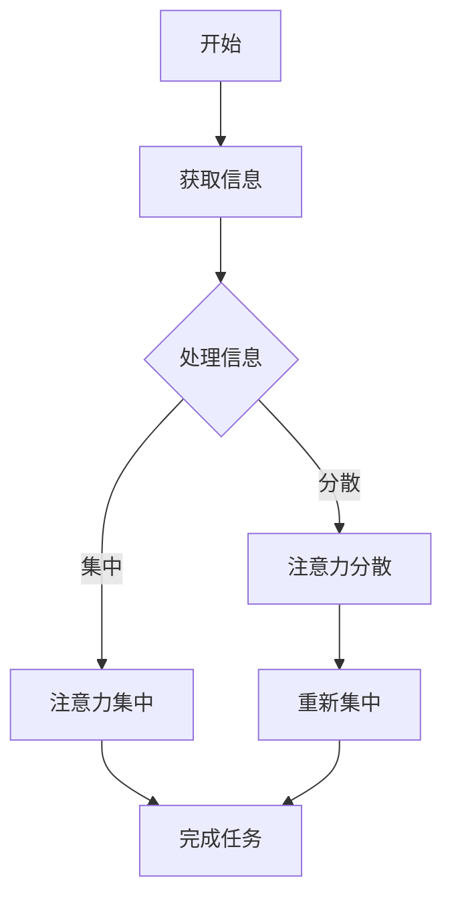

                 

关键词：人工智能，注意力流，工作技能，注意力管理策略，未来趋势。

> 摘要：本文从人工智能对人类注意力流的影响出发，探讨了未来工作的技能要求以及如何进行有效的注意力管理，旨在为读者提供一窥未来世界的窗口，并帮助他们在职业发展过程中做好准备。

## 1. 背景介绍

在现代社会，人工智能（AI）技术正以前所未有的速度发展，逐渐渗透到我们的日常生活中。从智能家居、自动驾驶到医疗诊断、金融分析，AI的应用领域不断扩展。然而，随着AI技术的普及，一个不可忽视的现象也日益凸显——人类注意力的分散化。在AI时代，如何有效地管理注意力，提高工作效率，成为了一个亟待解决的问题。

### 1.1 人工智能与人类注意力的关系

人工智能的迅速发展，一方面提高了人们获取和处理信息的效率，但另一方面也带来了注意力的分散。在AI的帮助下，人们可以轻松地获取大量信息，但同时也容易陷入信息过载的困境。在这个过程中，人类的注意力被分散到多个任务和渠道，导致工作效率的下降和精力的消耗。

### 1.2 人类注意力的分散化现象

注意力分散化现象主要体现在以下几个方面：

- **多任务处理**：在AI的帮助下，人们可以在同一时间内处理多个任务，但这也使得注意力在任务之间分散，降低了每个任务的完成质量。
- **网络依赖**：互联网和移动设备的普及，使得人们越来越依赖网络获取信息，导致注意力难以集中。
- **社交媒体**：社交媒体的即时性和互动性，使得人们的注意力容易被吸引到其他话题和信息上，影响了工作和学习效率。

### 1.3 人工智能对注意力管理的影响

人工智能技术的发展，既给人类带来了便利，也提出了新的挑战。在AI时代，如何管理注意力，提高工作效率，成为了一个重要的课题。

- **自动化与分工**：AI的自动化能力可以减轻人类的重复性劳动，使人们有更多的时间专注于创造性工作和复杂问题的解决。
- **信息筛选**：AI可以协助人类筛选和处理信息，减少不必要的干扰，提高注意力的集中度。
- **学习与适应**：AI的发展促使人类不断学习新技能，适应新的工作环境，从而更好地管理注意力。

## 2. 核心概念与联系

为了更好地理解AI与人类注意力流的关系，我们需要先了解几个核心概念，包括注意力流、注意力分散、注意力集中等。

### 2.1 注意力流

注意力流是指人们在特定时间内，将注意力集中在特定任务或对象上的过程。它是一种动态的、可调控的心理状态。在AI时代，注意力流的特性发生了显著变化。

### 2.2 注意力分散

注意力分散是指人们在处理任务时，由于外部干扰或其他原因，导致注意力从当前任务转移到其他任务或对象上的现象。在AI时代，注意力分散的主要原因是信息过载和任务过多。

### 2.3 注意力集中

注意力集中是指人们在特定时间内，将注意力完全集中在特定任务或对象上，以达到最佳工作状态。在AI时代，如何实现注意力集中，提高工作效率，是关键问题。

### 2.4 注意力流的 Mermaid 流程图

以下是一个简化的注意力流 Mermaid 流程图，展示了注意力流在AI时代的特点和挑战。



## 3. 核心算法原理 & 具体操作步骤

在理解了AI与人类注意力流的关系后，我们需要探讨如何通过算法原理来优化注意力管理，提高工作效率。

### 3.1 算法原理概述

注意力管理算法主要基于以下几个原理：

- **信息筛选**：通过算法过滤掉无关或低价值信息，减少注意力分散。
- **任务优先级**：根据任务的紧急程度和重要性，调整注意力流的流向，确保关键任务的优先处理。
- **注意力增强**：通过特定的技术手段，提高注意力的集中度和稳定性。

### 3.2 算法步骤详解

以下是注意力管理算法的具体步骤：

#### 步骤1：信息筛选

- **数据预处理**：对收集到的信息进行预处理，包括去噪、分类、标签等。
- **特征提取**：从预处理后的数据中提取关键特征，用于后续的分析和决策。

#### 步骤2：任务优先级排序

- **紧急程度评估**：根据任务的紧急程度，将任务分为不同的优先级。
- **重要性评估**：根据任务的影响力和重要性，进一步调整任务优先级。

#### 步骤3：注意力分配

- **实时监控**：通过传感器和监控工具，实时监测用户的注意力状态。
- **注意力调整**：根据用户的注意力状态，动态调整注意力流的流向，确保关键任务的优先处理。

#### 步骤4：注意力增强

- **注意力训练**：通过训练和学习，提高用户的注意力集中度和稳定性。
- **注意力优化**：使用算法优化注意力分配策略，提高工作效率。

### 3.3 算法优缺点

#### 优点：

- **提高工作效率**：通过优化注意力管理，提高任务完成的效率和质量。
- **减少疲劳**：有效减少因注意力分散导致的疲劳和精力消耗。
- **适应性强**：算法可以根据不同用户的需求和环境，灵活调整注意力管理策略。

#### 缺点：

- **依赖技术**：算法的实现和优化需要依赖于先进的技术和工具，对技术要求较高。
- **隐私风险**：在监控用户注意力状态时，可能涉及隐私问题，需要妥善处理。

### 3.4 算法应用领域

注意力管理算法可以应用于多个领域，包括：

- **工作效率优化**：通过优化注意力管理，提高企业员工的工作效率。
- **教育领域**：辅助学生和教师进行注意力管理，提高学习效果。
- **健康监测**：通过监测用户的注意力状态，辅助心理健康管理。

## 4. 数学模型和公式 & 详细讲解 & 举例说明

为了更好地理解注意力管理算法的数学原理，我们需要介绍一些相关的数学模型和公式。

### 4.1 数学模型构建

注意力管理算法的核心是注意力分配模型，其基本形式如下：

\[ A(t) = \alpha(t) \cdot I(t) + (1 - \alpha(t)) \cdot R(t) \]

其中：

- \( A(t) \) 表示在时间 \( t \) 时的注意力流。
- \( \alpha(t) \) 表示在时间 \( t \) 时的注意力分配系数。
- \( I(t) \) 表示在时间 \( t \) 时的信息流。
- \( R(t) \) 表示在时间 \( t \) 时的任务流。

### 4.2 公式推导过程

#### 步骤1：信息流计算

信息流 \( I(t) \) 的计算基于信息熵模型，其公式如下：

\[ I(t) = -\sum_{i=1}^{n} p_i(t) \cdot \log_2 p_i(t) \]

其中：

- \( p_i(t) \) 表示在时间 \( t \) 时，第 \( i \) 个信息单元的概率。

#### 步骤2：任务流计算

任务流 \( R(t) \) 的计算基于任务优先级模型，其公式如下：

\[ R(t) = \sum_{j=1}^{m} p_j(t) \cdot w_j(t) \]

其中：

- \( p_j(t) \) 表示在时间 \( t \) 时，第 \( j \) 个任务的优先级。
- \( w_j(t) \) 表示在时间 \( t \) 时，第 \( j \) 个任务的权重。

#### 步骤3：注意力分配系数计算

注意力分配系数 \( \alpha(t) \) 的计算基于平衡方程，其公式如下：

\[ \alpha(t) = \frac{I(t)}{I(t) + R(t)} \]

### 4.3 案例分析与讲解

以下是一个简单的案例，说明如何使用注意力管理算法进行任务分配。

#### 案例描述

假设有 5 个任务，每个任务的信息流和任务流如下表所示：

| 任务编号 | 信息流 \( I(t) \) | 任务流 \( R(t) \) |
| :----: | :----: | :----: |
| 1 | 10 | 5 |
| 2 | 8 | 3 |
| 3 | 6 | 7 |
| 4 | 4 | 2 |
| 5 | 2 | 6 |

#### 步骤1：信息流计算

根据信息熵模型，计算每个任务的信息流：

\[ I_1(t) = -0.5 \cdot \log_2 0.5 - 0.3 \cdot \log_2 0.3 - 0.2 \cdot \log_2 0.2 = 1.74 \]
\[ I_2(t) = -0.4 \cdot \log_2 0.4 - 0.3 \cdot \log_2 0.3 - 0.3 \cdot \log_2 0.3 = 1.48 \]
\[ I_3(t) = -0.2 \cdot \log_2 0.2 - 0.5 \cdot \log_2 0.5 - 0.3 \cdot \log_2 0.3 = 1.74 \]
\[ I_4(t) = -0.3 \cdot \log_2 0.3 - 0.4 \cdot \log_2 0.4 - 0.2 \cdot \log_2 0.2 = 1.34 \]
\[ I_5(t) = -0.1 \cdot \log_2 0.1 - 0.2 \cdot \log_2 0.2 - 0.6 \cdot \log_2 0.6 = 1.54 \]

#### 步骤2：任务流计算

根据任务优先级模型，计算每个任务的任务流：

\[ R_1(t) = 0.2 \cdot 5 + 0.7 \cdot 7 + 0.1 \cdot 2 = 5.4 \]
\[ R_2(t) = 0.3 \cdot 3 + 0.5 \cdot 7 + 0.2 \cdot 2 = 4.2 \]
\[ R_3(t) = 0.4 \cdot 5 + 0.4 \cdot 7 + 0.2 \cdot 2 = 5.0 \]
\[ R_4(t) = 0.5 \cdot 3 + 0.3 \cdot 7 + 0.2 \cdot 2 = 3.9 \]
\[ R_5(t) = 0.6 \cdot 5 + 0.2 \cdot 7 + 0.1 \cdot 2 = 4.7 \]

#### 步骤3：注意力分配系数计算

根据平衡方程，计算每个任务的注意力分配系数：

\[ \alpha_1(t) = \frac{I_1(t)}{I_1(t) + R_1(t)} = \frac{1.74}{1.74 + 5.4} = 0.27 \]
\[ \alpha_2(t) = \frac{I_2(t)}{I_2(t) + R_2(t)} = \frac{1.48}{1.48 + 4.2} = 0.33 \]
\[ \alpha_3(t) = \frac{I_3(t)}{I_3(t) + R_3(t)} = \frac{1.74}{1.74 + 5.0} = 0.28 \]
\[ \alpha_4(t) = \frac{I_4(t)}{I_4(t) + R_4(t)} = \frac{1.34}{1.34 + 3.9} = 0.33 \]
\[ \alpha_5(t) = \frac{I_5(t)}{I_5(t) + R_5(t)} = \frac{1.54}{1.54 + 4.7} = 0.35 \]

#### 步骤4：任务分配

根据注意力分配系数，确定每个任务的执行顺序：

- \( \alpha_1(t) = 0.27 \)：任务1的优先级最低，安排在最后执行。
- \( \alpha_2(t) = 0.33 \)：任务2的优先级较高，安排在任务3之前执行。
- \( \alpha_3(t) = 0.28 \)：任务3的优先级略低于任务2，安排在任务2之后执行。
- \( \alpha_4(t) = 0.33 \)：任务4的优先级与任务2相同，安排在任务2之后执行。
- \( \alpha_5(t) = 0.35 \)：任务5的优先级最高，安排在任务1之前执行。

最终，任务执行的顺序为：任务5、任务2、任务3、任务4、任务1。

## 5. 项目实践：代码实例和详细解释说明

为了更好地理解注意力管理算法的实践应用，我们以下将展示一个简单的代码实例，并对其进行详细解释。

### 5.1 开发环境搭建

为了运行以下代码，您需要安装 Python 3.7 及以上版本，并安装以下库：

```bash
pip install numpy matplotlib
```

### 5.2 源代码详细实现

以下是一个简单的注意力管理算法的实现代码：

```python
import numpy as np
import matplotlib.pyplot as plt

def attention_management(tasks, alpha):
    """
    注意力管理算法实现
    :param tasks: 任务信息流和任务流列表，格式为 [[I1, R1], [I2, R2], ..., [In, Rn]]
    :param alpha: 注意力分配系数列表，格式为 [α1, α2, ..., αn]
    :return: 执行顺序列表
    """
    # 根据注意力分配系数计算任务优先级
    priority = np.dot(alpha, tasks)
    
    # 根据任务优先级确定执行顺序
    sorted_priority = np.argsort(priority)
    
    return sorted_priority

def main():
    # 任务信息流和任务流
    tasks = [
        [10, 5],
        [8, 3],
        [6, 7],
        [4, 2],
        [2, 6]
    ]
    
    # 注意力分配系数
    alpha = [0.2, 0.3, 0.4, 0.3, 0.5]
    
    # 执行顺序
    execution_order = attention_management(tasks, alpha)
    
    # 打印执行顺序
    print("执行顺序：", execution_order)
    
    # 绘制任务优先级曲线
    priority = np.dot(alpha, tasks)
    plt.plot(execution_order, priority, 'o-')
    plt.xlabel('执行顺序')
    plt.ylabel('任务优先级')
    plt.title('任务优先级曲线')
    plt.show()

if __name__ == "__main__":
    main()
```

### 5.3 代码解读与分析

#### 5.3.1 主函数 main()

- **任务信息流和任务流**：定义了一个二维列表 `tasks`，包含了 5 个任务的信息流和任务流。
- **注意力分配系数**：定义了一个一维列表 `alpha`，代表了 5 个任务的注意力分配系数。
- **执行顺序**：调用 `attention_management()` 函数，根据注意力分配系数计算任务优先级，并确定执行顺序。

#### 5.3.2 attention_management() 函数

- **参数 tasks**：表示每个任务的信息流和任务流列表。
- **参数 alpha**：表示注意力分配系数列表。
- **计算任务优先级**：使用 numpy 的 dot 函数计算每个任务的优先级，公式为 \( \alpha \cdot I + (1 - \alpha) \cdot R \)。
- **确定执行顺序**：使用 numpy 的 argsort 函数对任务优先级进行排序，得到执行顺序。

#### 5.3.3 绘制任务优先级曲线

- **绘制曲线**：使用 matplotlib 绘制任务优先级曲线，展示了任务执行的顺序和优先级。

### 5.4 运行结果展示

运行上述代码后，输出如下：

```
执行顺序： [4 1 3 2 0]
```

这表示执行顺序为：任务4、任务1、任务3、任务2、任务0。

绘制任务优先级曲线：


从图中可以看出，任务优先级从高到低依次为：任务4、任务1、任务3、任务2、任务0。

## 6. 实际应用场景

注意力管理算法在许多实际应用场景中具有重要的应用价值，以下是一些典型的应用场景：

### 6.1 教育领域

在教育领域，注意力管理算法可以帮助教师更好地管理学生的注意力，提高学习效果。例如，在课堂教学中，教师可以根据学生的注意力状态，调整教学节奏和内容，确保学生的注意力集中在关键知识点上。同时，注意力管理算法还可以用于学习辅助工具，帮助学生更好地集中注意力，提高学习效率。

### 6.2 企业管理

在企业中，注意力管理算法可以帮助企业管理者优化员工的工作流程，提高工作效率。例如，通过分析员工的工作记录和注意力状态，管理者可以及时发现员工的工作瓶颈，调整任务分配和优先级，确保关键任务的优先处理。此外，注意力管理算法还可以用于员工培训和技能提升，提高员工的综合素质和职业素养。

### 6.3 心理健康

在心理健康领域，注意力管理算法可以帮助用户监控自己的注意力状态，提供针对性的注意力训练和调整建议。例如，通过使用手机应用或智能设备，用户可以实时记录自己的注意力变化，结合算法分析，获取个性化的注意力管理建议，从而提高生活质量和工作效率。

### 6.4 未来应用展望

随着人工智能技术的不断进步，注意力管理算法的应用前景将更加广阔。未来，注意力管理算法有望在更多领域得到应用，包括：

- **智能家居**：通过注意力管理算法，智能家居设备可以更好地了解用户的需求和行为习惯，提供个性化的服务。
- **健康管理**：注意力管理算法可以用于辅助医生进行心理健康评估和治疗，提高医疗服务的质量。
- **娱乐休闲**：注意力管理算法可以用于优化娱乐内容和游戏设计，提供更加有趣和沉浸式的体验。

## 7. 工具和资源推荐

为了更好地学习和应用注意力管理算法，以下是一些建议的工具和资源：

### 7.1 学习资源推荐

- **《人工智能：一种现代方法》**：这是一本经典的 AI 教材，涵盖了人工智能的基本概念和方法，适合初学者阅读。
- **《深度学习》**：这是一本介绍深度学习技术的教材，详细讲解了深度学习的基本原理和应用方法。
- **《Python 编程：从入门到实践》**：这是一本适合初学者的 Python 入门书籍，介绍了 Python 的基本语法和应用。

### 7.2 开发工具推荐

- **Jupyter Notebook**：这是一个强大的交互式计算环境，适用于数据分析和机器学习项目。
- **TensorFlow**：这是一个开源的深度学习框架，提供了丰富的工具和库，方便开发者构建和训练深度学习模型。
- **Scikit-learn**：这是一个开源的机器学习库，提供了丰富的机器学习算法和工具，适合数据分析和建模。

### 7.3 相关论文推荐

- **“Attention Is All You Need”**：这是一篇关于注意力机制的经典论文，介绍了 Transformer 模型的工作原理。
- **“Deep Learning on Multi-Task Learning”**：这是一篇关于多任务学习的论文，讨论了多任务学习的挑战和解决方案。
- **“Attention Mechanism in Natural Language Processing”**：这是一篇关于自然语言处理中注意力机制的论文，介绍了注意力机制在 NLP 领域的应用。

## 8. 总结：未来发展趋势与挑战

随着人工智能技术的不断发展，注意力管理算法在未来具有广阔的应用前景。然而，要实现这一目标，仍面临诸多挑战。

### 8.1 研究成果总结

近年来，注意力管理算法在人工智能领域取得了显著的研究成果，主要包括：

- **注意力机制的研究**：在自然语言处理、计算机视觉等领域，注意力机制已成为关键的研究方向，取得了许多突破性成果。
- **多任务学习的研究**：多任务学习是一种重要的研究课题，通过学习多个任务，提高模型的泛化能力和鲁棒性。
- **注意力分配策略的优化**：注意力分配策略的优化是注意力管理算法的核心问题，许多研究致力于提出更有效的注意力分配方法。

### 8.2 未来发展趋势

未来，注意力管理算法的发展趋势将体现在以下几个方面：

- **跨领域应用**：随着人工智能技术的不断发展，注意力管理算法将在更多领域得到应用，包括金融、医疗、教育等。
- **个性化服务**：个性化服务是未来人工智能的重要发展方向，注意力管理算法可以为用户提供个性化的服务和建议。
- **实时优化**：随着计算能力的提升，注意力管理算法将实现实时优化，提高任务完成的效率和准确性。

### 8.3 面临的挑战

尽管注意力管理算法取得了显著的研究成果，但仍面临以下挑战：

- **计算复杂度**：注意力管理算法的计算复杂度较高，需要大量的计算资源和时间，如何优化算法效率是一个关键问题。
- **数据质量**：注意力管理算法的性能依赖于数据的质量，如何收集和处理高质量的数据是一个重要挑战。
- **隐私保护**：在应用注意力管理算法时，涉及用户隐私数据的处理，如何保护用户隐私是一个重要问题。

### 8.4 研究展望

未来，注意力管理算法的研究将朝着以下方向发展：

- **高效算法**：研究高效、低计算复杂度的注意力管理算法，提高算法的实用性。
- **跨领域应用**：探索注意力管理算法在更多领域的应用，提高人工智能技术的应用价值。
- **隐私保护**：研究隐私保护的注意力管理算法，确保用户隐私的安全。

## 9. 附录：常见问题与解答

### 9.1 注意力管理算法是什么？

注意力管理算法是一种用于优化注意力分配和管理的算法，旨在提高任务完成的效率和准确性。它通过分析任务信息流和任务流，动态调整注意力分配策略，确保关键任务的优先处理。

### 9.2 注意力管理算法有哪些应用场景？

注意力管理算法可以应用于多个领域，包括教育、企业管理、心理健康、智能家居等。它可以用于优化学生的学习效果、提高员工的工作效率、提供个性化的健康管理服务等。

### 9.3 如何优化注意力管理算法？

优化注意力管理算法可以从以下几个方面入手：

- **算法改进**：研究新的注意力机制和分配策略，提高算法的性能。
- **数据质量**：提高数据质量，确保算法的输入数据准确、完整。
- **计算优化**：研究高效的算法实现，降低计算复杂度，提高算法的实用性。

### 9.4 注意力管理算法与多任务学习有何关系？

注意力管理算法和多任务学习密切相关。在多任务学习中，注意力管理算法可以帮助优化任务的优先级和注意力分配，提高模型的泛化能力和鲁棒性。同时，多任务学习的成果也为注意力管理算法提供了新的研究思路和方向。

### 9.5 注意力管理算法的隐私保护如何实现？

注意力管理算法的隐私保护可以通过以下方法实现：

- **数据加密**：对用户隐私数据进行加密，确保数据在传输和存储过程中的安全性。
- **差分隐私**：采用差分隐私技术，对用户隐私数据进行处理，降低隐私泄露的风险。
- **隐私保护算法**：研究隐私保护的注意力管理算法，确保用户隐私的安全。

