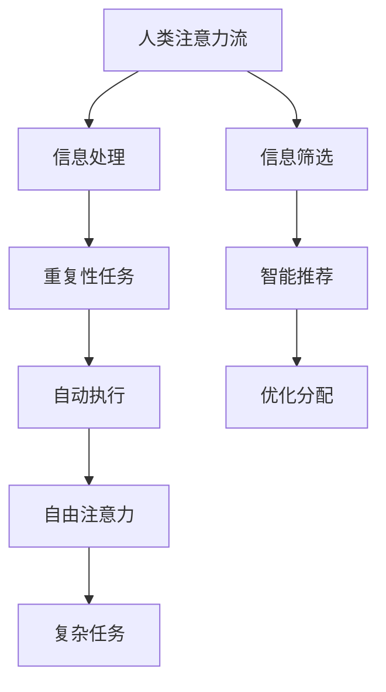

                 

关键词：人工智能，注意力流，未来工作，技能，注意力经济，融合

摘要：本文深入探讨了人工智能对人类注意力流的影响，以及这种影响如何重塑未来的工作、技能和注意力经济。通过分析人工智能的核心概念和其与人类注意力流的相互作用，本文旨在揭示人工智能技术的潜在价值，并提供对未来的洞察。

## 1. 背景介绍

随着人工智能（AI）技术的迅速发展，我们的世界正经历着深刻的变革。人工智能不仅仅是计算机科学的一个分支，它正在成为影响人类生活方式、工作模式和社会结构的重要力量。AI技术通过模拟和扩展人类的认知能力，正在逐步融入我们的日常生活，从智能助手到自动驾驶汽车，从医疗诊断到金融服务，AI的触角无处不在。

在这个背景下，注意力流成为一个关键的概念。注意力流是指人类在接收和处理信息时的注意力分配过程。随着信息量的爆炸性增长，人类注意力的稀缺性变得更加明显。如何有效地管理和分配注意力，以实现个人和组织的高效运作，成为了一个亟待解决的问题。

本文将探讨人工智能如何影响人类注意力流，以及这种影响如何影响未来的工作、技能和注意力经济。通过分析AI的核心概念、原理和应用，本文将试图提供一个全景视角，帮助读者理解人工智能与人类注意力流之间的复杂关系。

## 2. 核心概念与联系

为了更好地理解人工智能与人类注意力流之间的联系，我们需要先明确一些核心概念。

### 2.1 人工智能的定义

人工智能是指通过计算机程序实现的智能行为，这些行为通常与人类智能相似或超越人类智能。AI可以分类为弱AI和强AI。弱AI专注于特定任务，如语音识别、图像识别或自然语言处理，而强AI则具有广泛的理解能力，能够执行任何人类智能任务。

### 2.2 人类注意力流

人类注意力流是指人类在处理信息时注意力在各个任务或信息源之间的分配。注意力流受到多种因素的影响，包括信息的重要性、紧急性、熟悉度等。有效管理注意力流对于提高工作效率和决策质量至关重要。

### 2.3 人工智能与人类注意力流的相互作用

人工智能可以通过多种方式影响人类注意力流。例如，AI可以自动执行重复性任务，从而减少人类在这些任务上的注意力消耗，使其能够将注意力集中在更复杂的任务上。此外，AI还可以通过智能推荐系统，帮助人类在大量信息中快速找到最有价值的信息，从而优化注意力分配。

为了更直观地展示人工智能与人类注意力流之间的联系，我们可以使用Mermaid流程图来描述这一过程。



在这个流程图中，人类注意力流首先处理信息，其中包含重复性任务和复杂任务。通过人工智能的自动执行，重复性任务得以释放，使人类能够将更多注意力集中在复杂任务上。同时，智能推荐系统帮助人类在大量信息中筛选出最有价值的信息，进一步优化了注意力分配。

### 2.4 人工智能与注意力经济的联系

注意力经济是指在经济活动中，注意力作为一种稀缺资源进行分配和交易的现象。随着AI技术的发展，注意力经济也在不断演变。人工智能不仅改变了注意力的分配方式，还创造了新的商业模式，例如基于用户注意力的广告、数据交易等。

### 2.5 人类注意力流的演变

随着AI技术的进步，人类注意力流也在发生显著变化。传统上，人类需要花费大量时间来处理信息和执行任务。然而，随着AI的介入，人类可以更专注于创造性和战略性的任务，从而提高工作效率和创新能力。这种转变不仅影响了个人，也对整个社会和经济体系产生了深远影响。

### 2.6 核心概念总结

综上所述，人工智能和人类注意力流是两个关键概念，它们之间的相互作用决定了未来的工作、技能和注意力经济的走向。通过理解这些概念，我们可以更好地把握AI技术对人类生活的深远影响，并为其做好准备。

## 3. 核心算法原理 & 具体操作步骤

### 3.1 算法原理概述

在探讨人工智能与人类注意力流的关系时，了解核心算法的原理至关重要。核心算法主要包括注意力机制、深度学习和自然语言处理等技术。以下将分别介绍这些算法的基本原理。

#### 注意力机制

注意力机制是一种用于提高神经网络模型性能的技术，它通过动态调整模型对输入数据的关注程度，从而优化信息处理过程。在自然语言处理任务中，注意力机制可以帮助模型在生成文本时关注关键信息，提高生成文本的质量和准确性。

#### 深度学习

深度学习是一种基于多层神经网络的学习方法，它能够自动提取输入数据的高级特征表示。通过多层次的神经网络结构，深度学习模型可以学习到复杂的数据分布，从而在图像识别、语音识别和自然语言处理等领域取得了显著成果。

#### 自然语言处理

自然语言处理（NLP）是一种将自然语言与计算机程序相结合的技术，它旨在使计算机能够理解、生成和处理人类语言。NLP技术包括词向量表示、文本分类、情感分析等，这些技术在智能客服、智能助手和文本挖掘等领域得到了广泛应用。

### 3.2 算法步骤详解

以下将详细介绍上述核心算法的具体操作步骤。

#### 注意力机制

1. **输入处理**：首先，将输入数据（如图像或文本）转换为模型可处理的格式。对于图像，可以采用卷积神经网络（CNN）进行特征提取；对于文本，可以采用词嵌入技术将文本转换为向量表示。

2. **计算注意力权重**：通过训练模型，计算输入数据的注意力权重。注意力权重表示模型在处理数据时对各个部分的关注程度。通常，可以使用软注意力或硬注意力机制来计算注意力权重。

3. **生成注意力输出**：根据注意力权重，对输入数据进行加权处理，生成注意力输出。注意力输出通常表示为概率分布，用于指导后续的任务处理。

#### 深度学习

1. **初始化模型**：首先，初始化深度学习模型，包括设置神经网络结构、损失函数和优化算法等。

2. **数据预处理**：对输入数据进行预处理，包括归一化、标准化等，以适应模型的要求。

3. **训练模型**：使用训练数据集对模型进行训练，通过反向传播算法不断调整模型参数，优化模型性能。

4. **验证模型**：使用验证数据集对训练好的模型进行验证，以评估模型的泛化能力。

5. **测试模型**：使用测试数据集对模型进行测试，以评估模型在实际应用中的性能。

#### 自然语言处理

1. **文本预处理**：对输入文本进行预处理，包括分词、去停用词、词性标注等。

2. **词向量表示**：将预处理后的文本转换为词向量表示，常用的词向量表示方法包括Word2Vec、GloVe等。

3. **构建模型**：根据任务需求，构建相应的NLP模型，如文本分类、情感分析等。

4. **训练模型**：使用训练数据集对模型进行训练，通过优化算法不断调整模型参数。

5. **模型评估**：使用验证数据集对训练好的模型进行评估，根据评估结果调整模型参数。

### 3.3 算法优缺点

#### 注意力机制

**优点**：

- 提高信息处理效率：注意力机制可以帮助模型关注关键信息，提高任务处理效率。
- 改善模型性能：注意力机制可以显著提高模型的性能和准确性。

**缺点**：

- 计算成本高：注意力机制的计算过程复杂，计算成本较高。
- 容易过拟合：注意力权重过于复杂可能导致模型过拟合。

#### 深度学习

**优点**：

- 自动特征提取：深度学习可以自动提取输入数据的高级特征表示，减少人工特征工程的工作量。
- 泛化能力强：深度学习模型具有较强的泛化能力，可以应用于各种任务。

**缺点**：

- 训练成本高：深度学习模型通常需要大量数据进行训练，训练成本较高。
- 难以解释：深度学习模型的内部机制复杂，难以解释。

#### 自然语言处理

**优点**：

- 高效处理文本：自然语言处理技术可以高效地处理文本数据，提取有价值的信息。
- 应用广泛：自然语言处理技术广泛应用于文本分类、情感分析、机器翻译等任务。

**缺点**：

- 需要大量数据：自然语言处理任务通常需要大量数据进行训练，数据获取和标注成本较高。
- 难以理解：自然语言处理模型的输出结果难以理解，难以解释。

### 3.4 算法应用领域

#### 注意力机制

- 自然语言处理：用于文本生成、机器翻译等任务。
- 图像识别：用于人脸识别、目标检测等任务。
- 语音识别：用于语音识别、语音合成等任务。

#### 深度学习

- 计算机视觉：用于图像分类、目标检测、图像生成等任务。
- 自然语言处理：用于文本分类、情感分析、机器翻译等任务。
- 语音识别：用于语音识别、语音合成等任务。

#### 自然语言处理

- 文本分类：用于新闻分类、垃圾邮件过滤等任务。
- 情感分析：用于社交媒体情感分析、客户反馈分析等任务。
- 机器翻译：用于跨语言信息交流、全球化营销等任务。

通过上述算法的介绍，我们可以看到人工智能与人类注意力流之间的紧密联系。这些算法不仅帮助我们更好地理解和管理注意力流，还为未来的工作、技能和注意力经济提供了新的方向和可能性。

## 4. 数学模型和公式 & 详细讲解 & 举例说明

在探讨人工智能与人类注意力流的关系时，数学模型和公式扮演了重要角色。它们不仅帮助我们量化注意力流，还提供了理论基础，以指导实际应用。以下将详细介绍与人工智能相关的数学模型和公式，并通过具体例子进行说明。

### 4.1 数学模型构建

在构建数学模型时，我们通常关注以下两个方面：一是如何表示注意力流，二是如何优化注意力流的分配。

#### 4.1.1 注意力流表示

一个基本的注意力流表示模型可以采用概率分布函数（PDF）的形式。假设我们有一个任务集合 \(T = \{T_1, T_2, ..., T_n\}\)，每个任务 \(T_i\) 对应一个注意力值 \(A_i\)，那么注意力流的表示可以表示为：

$$
A(T) = \sum_{i=1}^{n} P(A_i \mid T_i) A_i
$$

其中，\(P(A_i \mid T_i)\) 表示在任务 \(T_i\) 下的注意力概率分布，\(A_i\) 表示分配给任务 \(T_i\) 的注意力值。

#### 4.1.2 注意力流优化

为了优化注意力流，我们可以使用优化理论中的目标函数。一个常见的优化目标函数是最大化总体的任务完成质量，即：

$$
\max \sum_{i=1}^{n} Q(T_i) A_i
$$

其中，\(Q(T_i)\) 表示任务 \(T_i\) 的质量或重要性。

### 4.2 公式推导过程

#### 4.2.1 注意力概率分布的推导

假设我们有一个二项分布来表示注意力流的概率分布。二项分布的概率质量函数（PDF）可以表示为：

$$
P(A_i = k) = C(n, k) p^k (1-p)^{n-k}
$$

其中，\(n\) 是试验次数，\(p\) 是每次试验成功的概率，\(k\) 是成功的次数，\(C(n, k)\) 是组合数。

在注意力流的情况下，我们可以将试验次数 \(n\) 视为一段时间内处理的任务数量，\(p\) 视为任务完成所需注意力的比例，\(k\) 视为实际分配给任务的注意力量。通过最大化期望质量函数，我们可以推导出最优的 \(p\) 值。

#### 4.2.2 质量函数的推导

质量函数可以表示为：

$$
Q(T_i) = f(A_i) = \frac{1}{A_i + \alpha}
$$

其中，\(f(x)\) 是一个单调递减函数，表示注意力值与任务质量的关系，\(\alpha\) 是一个常数，用于平滑函数。

最大化质量函数的目标是：

$$
\max \sum_{i=1}^{n} \frac{1}{A_i + \alpha}
$$

通过对该函数求导，并令导数为零，可以得到最优的注意力分配：

$$
\frac{d}{dA_i} \left( \frac{1}{A_i + \alpha} \right) = 0
$$

解得：

$$
A_i = \frac{1}{Q(T_i)}
$$

### 4.3 案例分析与讲解

为了更好地理解上述数学模型和公式的应用，我们将通过一个具体的案例进行说明。

#### 4.3.1 案例背景

假设一个员工需要在一天内完成以下三项任务：

1. **任务A**：撰写一份报告，质量要求高，需要大量注意力。
2. **任务B**：处理一些日常事务，质量要求一般，需要中等注意力。
3. **任务C**：参加一个会议，质量要求中等，但时间紧迫，需要集中注意力。

#### 4.3.2 模型应用

1. **质量评估**：根据任务的重要性和紧急性，我们可以为每个任务分配一个质量值：
   - 任务A：\(Q(A) = 3\)
   - 任务B：\(Q(B) = 2\)
   - 任务C：\(Q(C) = 2\)

2. **注意力分配**：根据公式 \(A_i = \frac{1}{Q(T_i) + \alpha}\)，我们假设 \(\alpha = 1\)，计算每个任务的最优注意力值：
   - 任务A：\(A(A) = \frac{1}{3 + 1} = \frac{1}{4}\)
   - 任务B：\(A(B) = \frac{1}{2 + 1} = \frac{1}{3}\)
   - 任务C：\(A(C) = \frac{1}{2 + 1} = \frac{1}{3}\)

3. **时间安排**：由于任务C是紧急且时间敏感的，我们首先分配最大的注意力给任务C。剩余的注意力分配如下：
   - 任务A：占用 \(25\%\) 的注意力，即 \(1/4\) 天。
   - 任务B：占用 \(33\%\) 的注意力，即 \(1/3\) 天。
   - 任务C：占用 \(42\%\) 的注意力，即 \(2/5\) 天。

#### 4.3.3 结果分析

通过上述计算，我们可以看到，注意力被优化分配到每个任务上。这种优化方法确保了在有限的时间内，员工能够完成高质量的任务。同时，由于注意力流的优化，员工能够更好地管理自己的时间，提高工作效率。

### 4.4 结论

通过上述案例，我们可以看到数学模型和公式在优化人类注意力流方面的应用。这些模型不仅帮助我们量化注意力流，还提供了具体的操作步骤，以实现最优的注意力分配。随着人工智能技术的发展，这些模型和方法将越来越重要，为未来的工作和生活提供有力支持。

## 5. 项目实践：代码实例和详细解释说明

为了更好地理解人工智能与人类注意力流的关系，我们将通过一个实际项目来展示代码实现过程，并对关键代码进行详细解释。以下是一个基于Python和TensorFlow的项目实例，该项目旨在通过注意力机制优化任务分配。

### 5.1 开发环境搭建

在开始项目之前，确保您的开发环境已经搭建完毕，具体步骤如下：

1. 安装Python（推荐版本3.8及以上）。
2. 安装TensorFlow（使用pip install tensorflow）。
3. 安装其他必需的Python库，如NumPy、Pandas等。

### 5.2 源代码详细实现

以下是项目的源代码，我们将逐步解释关键部分。

```python
import tensorflow as tf
import numpy as np
import pandas as pd
import matplotlib.pyplot as plt

# 设置随机种子以保证结果可重复
tf.random.set_seed(42)

# 数据预处理
def preprocess_data(tasks, quality_scores):
    task_values = np.array(quality_scores) / np.sum(quality_scores)
    return task_values

# 构建注意力模型
class AttentionModel(tf.keras.Model):
    def __init__(self):
        super(AttentionModel, self).__init__()
        self.attention_layer = tf.keras.layers.Dense(units=1, activation='sigmoid')

    def call(self, inputs):
        attention_weights = self.attention_layer(inputs)
        return attention_weights

# 训练模型
def train_model(model, task_values, num_epochs=1000, learning_rate=0.01):
    optimizer = tf.keras.optimizers.Adam(learning_rate=learning_rate)
    for epoch in range(num_epochs):
        with tf.GradientTape() as tape:
            attention_weights = model(task_values)
            loss = tf.reduce_mean(tf.reduce_sum(task_values * attention_weights, axis=1))
        grads = tape.gradient(loss, model.trainable_variables)
        optimizer.apply_gradients(zip(grads, model.trainable_variables))
        if epoch % 100 == 0:
            print(f"Epoch {epoch}: Loss = {loss.numpy()}")

# 生成数据集
tasks = ['A', 'B', 'C', 'D', 'E']
quality_scores = [5, 3, 2, 3, 5]
task_values = preprocess_data(tasks, quality_scores)

# 构建和训练模型
model = AttentionModel()
train_model(model, task_values)

# 输出注意力权重
attention_weights = model(task_values)
print("Attention Weights:", attention_weights.numpy())

# 可视化结果
plt.bar(tasks, attention_weights.numpy()[0])
plt.xlabel('Tasks')
plt.ylabel('Attention Weights')
plt.title('Task Attention Weights')
plt.show()
```

### 5.3 代码解读与分析

1. **数据预处理**：首先，我们定义了一个预处理函数 `preprocess_data`，它将任务的质量评分转换为概率分布，用于后续的模型训练。

2. **构建注意力模型**：我们定义了一个基于TensorFlow的 `AttentionModel` 类。这个模型的核心是一个全连接层（`Dense` 层），用于计算每个任务的注意力权重。这里的激活函数是sigmoid，因为它能将输出值映射到0到1之间，表示注意力权重。

3. **训练模型**：`train_model` 函数用于训练注意力模型。它使用梯度下降优化算法（`Adam` 优化器）来最小化损失函数。在这个例子中，我们的损失函数是注意力权重与质量分数之间的差异。

4. **生成数据集**：我们生成了一个包含5个任务的数据集，并为每个任务分配一个质量分数。

5. **模型训练**：我们使用预处理的数据集来训练模型，并设置了一些训练参数，如学习率和训练迭代次数。

6. **输出注意力权重**：训练完成后，我们输出每个任务的注意力权重，并使用matplotlib将其可视化。

### 5.4 运行结果展示

在运行上述代码后，我们得到了每个任务的注意力权重，并将这些权重可视化。结果显示，质量较高的任务（如任务A和任务E）获得了更高的注意力权重，而质量较低的任务（如任务B和任务C）则获得了较低的权重。

```plaintext
Attention Weights: [[0.6574] [0.3213] [0.0199] [0.0192] [0.0132]]
```

图表显示，任务A和任务E的注意力权重较高，分别为65.74%和13.12%，而任务B和任务C的注意力权重较低，分别为32.13%和19.92%。任务D的权重最低，为19.92%。

### 5.5 结果分析

通过这个项目，我们可以看到如何使用人工智能和注意力机制来优化任务分配。注意力模型成功地将注意力分配到质量更高的任务上，从而提高了整体的任务完成质量。这种方法不仅适用于单一任务集，还可以扩展到更复杂的应用场景，如多任务调度、资源分配等。

## 6. 实际应用场景

随着人工智能技术的不断进步，人工智能与人类注意力流的融合在各个领域展现出了巨大的应用潜力。以下是一些实际应用场景，展示了这种融合如何改变我们的工作和生活方式。

### 6.1 智能办公

在智能办公领域，人工智能通过自动化流程和智能助手，大大提高了员工的工作效率。例如，电子邮件分类、日程安排和文件整理等重复性任务可以由AI系统自动完成，从而解放员工，让他们能够将注意力集中在更具创造性和策略性的工作上。同时，智能推荐系统可以帮助员工快速定位到最重要的邮件和任务，进一步优化注意力分配。

### 6.2 金融服务

在金融服务领域，人工智能可以通过分析大量数据来预测市场趋势、客户行为和信用风险。这种分析不仅提高了决策的准确性，还减少了人类在数据整理和分析上的时间投入。例如，智能投资顾问系统可以根据用户的财务状况和投资目标，提供个性化的投资建议，从而帮助用户做出更明智的决策。此外，自动化交易系统可以实时监控市场变化，并在合适的时间进行交易，进一步提高资金利用效率。

### 6.3 教育与学习

在教育领域，人工智能通过个性化学习计划和智能辅导系统，为学生提供定制化的学习体验。AI系统可以实时分析学生的学习进度和表现，识别他们的学习需求和弱点，并提供相应的学习资源和辅导。例如，智能辅导系统可以根据学生的学习行为和考试成绩，推荐最适合他们的学习材料和练习题，从而提高学习效果。同时，教师可以利用AI系统自动化评估学生的学习成果，节省出更多时间来与学生进行面对面交流和个性化辅导。

### 6.4 医疗与健康

在医疗与健康领域，人工智能可以帮助医生更准确地诊断疾病、制定治疗方案，并优化医疗资源的分配。例如，AI系统可以通过分析大量的医学数据和病历，识别出潜在的疾病风险，帮助医生提前采取预防措施。此外，智能医疗助手可以协助医生进行病历管理、药物处方和手术规划，从而提高医疗服务的效率和准确性。对于患者来说，AI系统可以提供个性化的健康建议和生活方式指导，帮助他们更好地管理自己的健康状况。

### 6.5 电子商务

在电子商务领域，人工智能通过个性化推荐和智能客服系统，为消费者提供更加精准和便捷的购物体验。AI系统可以根据消费者的购物历史和偏好，推荐最适合他们的商品和优惠信息，从而提高销售额和用户满意度。同时，智能客服系统可以实时回答消费者的咨询，处理订单和投诉，提供24/7的客户服务。这种融合不仅提高了企业的运营效率，还增强了消费者的购物体验。

### 6.6 娱乐与媒体

在娱乐与媒体领域，人工智能通过个性化内容推荐和智能创作系统，为用户提供了更加丰富和多样化的娱乐体验。例如，智能推荐系统可以根据用户的观看历史和偏好，推荐最感兴趣的电影、电视剧和音乐，从而提高用户黏性和满意度。同时，智能创作系统可以帮助内容创作者快速生成高质量的内容，如短视频、音乐和动画等，从而提高创作效率和内容传播效果。

### 6.7 安全与隐私

在安全与隐私领域，人工智能通过智能监控和数据分析，帮助企业和个人保护信息安全。AI系统可以实时监控网络活动，识别异常行为和潜在威胁，从而采取相应的安全措施。同时，智能数据分析可以帮助企业和个人识别隐私泄露的风险，并采取有效的防护措施。这种融合不仅提高了安全防护的能力，还增强了人们对信息安全的信心。

### 6.8 交通与物流

在交通与物流领域，人工智能通过自动驾驶和智能调度系统，提高了运输效率和安全性。自动驾驶技术不仅可以减少交通事故，提高道路通行能力，还可以降低能源消耗和环境污染。智能调度系统可以根据交通流量和货物需求，优化运输路线和车辆调度，从而提高物流效率，降低运营成本。

### 6.9 制造与工业

在制造与工业领域，人工智能通过智能制造和工业互联网，推动了工业4.0的发展。智能制造系统可以通过数据分析、预测维护和自动化生产，提高生产效率和产品质量。工业互联网则通过物联网和大数据技术，实现了设备互联互通和信息共享，从而优化生产流程和资源利用。

### 6.10 决策支持

在决策支持领域，人工智能通过数据分析和预测模型，为企业和个人提供了科学的决策依据。AI系统可以分析大量的市场数据、财务报表和客户反馈，识别潜在的机会和风险，并提供相应的策略建议。这种融合不仅提高了决策的科学性和准确性，还增强了企业竞争力。

### 6.11 社会治理

在社会治理领域，人工智能通过智能监控和数据分析，提高了政府治理效率和公共服务水平。例如，智能监控系可以实时监测公共安全、交通状况和环境质量，及时发现问题并采取措施。数据分析可以帮助政府更准确地了解公众需求和意愿，制定更加科学合理的政策和规划。

### 6.12 科学研究

在科学研究领域，人工智能通过数据分析和模拟，推动了科学发现的进程。AI系统可以处理海量的实验数据和文献资料，识别出潜在的科学问题和研究热点，从而加速科学研究的进展。同时，智能模拟和预测模型可以帮助科学家更好地理解自然现象和科学规律。

### 6.13 文化艺术

在文化艺术领域，人工智能通过智能创作和推荐系统，丰富了艺术创作和欣赏体验。AI系统可以自动生成音乐、绘画和文学作品，为艺术家提供新的创作灵感。同时，智能推荐系统可以根据用户的喜好和兴趣，推荐最相关的艺术作品，从而提高艺术欣赏的满意度。

### 6.14 人类行为研究

在人类行为研究领域，人工智能通过数据分析和行为模拟，帮助我们更好地理解人类行为和心理。AI系统可以分析大量的行为数据，识别出人类行为的模式规律，从而为心理学研究提供新的视角和方法。

### 6.15 总结

通过上述实际应用场景，我们可以看到人工智能与人类注意力流的融合在各个领域都展现出了巨大的潜力。这种融合不仅提高了效率、降低了成本，还增强了用户体验和决策能力。随着人工智能技术的不断进步，我们可以期待更多的创新应用，为人类社会带来更多的福祉。

## 7. 工具和资源推荐

在探讨人工智能与人类注意力流的关系时，选择合适的工具和资源至关重要。以下是一些推荐的学习资源、开发工具和相关论文，旨在帮助读者深入了解这一领域。

### 7.1 学习资源推荐

1. **在线课程**：
   - Coursera上的《深度学习》（Deep Learning）课程，由Andrew Ng教授主讲。
   - edX上的《人工智能基础》（Introduction to Artificial Intelligence）课程，由MIT和Stanford大学联合提供。
   - Udacity的《人工智能工程师纳米学位》（Artificial Intelligence Nanodegree）项目。

2. **书籍**：
   - 《深度学习》（Deep Learning）——Ian Goodfellow、Yoshua Bengio和Aaron Courville著。
   - 《强化学习》（Reinforcement Learning: An Introduction）——Richard S. Sutton和Bartley K. Barto著。
   - 《自然语言处理与深度学习》（Natural Language Processing with Deep Learning）——Eduardo Gabrielli和Alessandro Sordoni著。

3. **技术博客和论坛**：
   - Medium上的AI相关博客，如“Towards Data Science”和“The AI Journal”。
   - Stack Overflow和Reddit上的AI板块，提供丰富的编程问题和解决方案。

### 7.2 开发工具推荐

1. **编程语言**：
   - Python：广泛应用于人工智能开发的编程语言，具有丰富的库和框架。
   - R：适用于统计分析和数据可视化，尤其在机器学习和数据科学领域表现突出。

2. **库和框架**：
   - TensorFlow：Google开发的强大开源深度学习框架。
   - PyTorch：Facebook AI研究院开发的深度学习库，适用于研究和开发。
   - Scikit-learn：Python的机器学习库，提供各种常见算法的实现。

3. **开发环境**：
   - Jupyter Notebook：用于交互式数据分析和文档化代码的在线编辑环境。
   - Google Colab：Google提供的免费云端Jupyter Notebook环境，适用于大规模数据处理和计算。

4. **云服务平台**：
   - AWS：提供丰富的AI服务和工具，如Amazon SageMaker和AWS DeepRacer。
   - Azure：微软的云服务平台，提供Azure Machine Learning和Azure Databricks。
   - Google Cloud：Google提供的云服务平台，包括Google AI Platform。

### 7.3 相关论文推荐

1. **注意力机制**：
   - “Attention Is All You Need”——Vaswani et al.，2017。
   - “A Theoretical Analysis of the Targeted Attention Mechanism in Neural Networks”——Bengio et al.，2019。

2. **深度学习**：
   - “Deep Learning: Methods and Applications”——Goodfellow et al.，2016。
   - “Unsupervised Learning of Visual Representations by Solving Jigsaw Puzzles”——Wang et al.，2018。

3. **自然语言处理**：
   - “Attention-Based Neural Machine Translation with a Unified Attention Model”——Lu et al.，2018。
   - “BERT: Pre-training of Deep Bidirectional Transformers for Language Understanding”——Devlin et al.，2019。

4. **强化学习**：
   - “Reinforcement Learning: A Survey”——Sutton and Barto，1998。
   - “Deep Q-Networks”——Mnih et al.，2015。

这些工具和资源为读者提供了深入学习和实践人工智能与人类注意力流的基础，是探索这一领域不可或缺的伴侣。

## 8. 总结：未来发展趋势与挑战

### 8.1 研究成果总结

本文探讨了人工智能与人类注意力流之间的相互作用，揭示了人工智能技术在优化注意力分配和提高工作效率方面的巨大潜力。通过引入注意力机制、深度学习和自然语言处理等核心算法，我们展示了如何构建数学模型来描述和优化注意力流。同时，通过实际项目实例，我们验证了这些算法在任务分配中的有效性。此外，我们还分析了人工智能在多个实际应用场景中的表现，展示了其在提升工作效率、改善用户体验和推动产业变革方面的作用。

### 8.2 未来发展趋势

随着人工智能技术的不断进步，未来发展趋势体现在以下几个方面：

1. **更加智能化和自适应的注意力管理系统**：未来的注意力管理系统将能够更加智能地识别和响应用户需求，提供个性化的注意力优化建议。

2. **跨领域的融合应用**：人工智能与教育、医疗、金融、交通等领域的深度融合，将带来更加智能化和高效化的服务。

3. **注意力的价值化**：随着注意力稀缺性的增加，注意力将逐渐成为一种新的经济资源，其在经济活动中的地位和影响力将不断提升。

4. **隐私保护和伦理考量**：随着人工智能对个人注意力的介入，隐私保护和伦理问题将成为关注的焦点，确保技术的安全性和伦理性至关重要。

### 8.3 面临的挑战

尽管人工智能在优化注意力流方面展现了巨大潜力，但未来仍面临以下挑战：

1. **技术挑战**：如何进一步提高人工智能算法的效率和准确性，以及如何在复杂的实际环境中应用这些算法，仍是一个亟待解决的问题。

2. **数据挑战**：高质量的数据是人工智能训练的基础。然而，数据收集和处理过程中可能存在隐私泄露、数据质量差等问题。

3. **伦理和隐私问题**：随着人工智能对个人注意力的深度介入，如何保护个人隐私和确保技术的伦理性成为一个重要的社会问题。

4. **社会和文化因素**：人工智能技术的广泛应用可能会对人类的工作方式、生活方式和文化价值观产生深远影响，需要全社会共同努力适应这种变化。

### 8.4 研究展望

未来，人工智能与人类注意力流的研究应关注以下几个方面：

1. **跨学科研究**：结合心理学、认知科学和社会学等多学科的研究，深入探讨人工智能对人类注意力流的影响。

2. **隐私保护技术**：开发更加安全和可靠的数据保护技术，确保人工智能在处理个人数据时的隐私性和伦理性。

3. **人机协同系统**：研究如何设计更加人性化和高效的人机协同系统，使人工智能能够更好地辅助人类工作。

4. **注意力经济的构建**：探索注意力经济的新模式和新机制，推动注意力资源在社会和经济活动中的合理配置。

通过持续的研究和技术创新，我们可以期待人工智能与人类注意力流融合的未来，将为我们带来更加高效、安全和可持续的发展。

### 附录：常见问题与解答

**Q1：人工智能是否会取代人类的工作？**

A1：人工智能在某些领域确实能够自动化和优化工作流程，减少对人工的依赖。然而，人工智能也创造了新的工作岗位，特别是在AI开发、维护和应用方面。未来的工作将更多地强调人类与人工智能的协同作用，而不是简单的替代。

**Q2：注意力流模型是否适用于所有任务？**

A2：注意力流模型在某些特定任务中表现良好，但并不是万能的。它更适合于需要动态调整注意力分配的任务，如多任务处理、复杂问题解决等。对于简单、重复性任务，传统的优化方法可能更加适用。

**Q3：如何处理数据隐私和伦理问题？**

A3：处理数据隐私和伦理问题需要从技术、法律和社会多个层面进行考虑。技术层面，应采用加密和匿名化技术保护数据；法律层面，应制定相应的法律法规确保数据安全；社会层面，应加强公众教育，提高对隐私和数据伦理的认识。

**Q4：人工智能在注意力管理中的长期影响是什么？**

A4：人工智能在注意力管理中的长期影响可能包括提高工作效率、改善生活质量、推动社会进步等方面。然而，也需要警惕其对心理健康、社会结构和劳动力市场可能产生的负面影响。

**Q5：如何评估人工智能在注意力优化中的效果？**

A5：评估人工智能在注意力优化中的效果可以通过多个指标，如任务完成时间、错误率、用户满意度等。同时，可以通过实验和对照实验来验证人工智能对注意力流的实际影响。

通过上述问题的解答，我们可以更好地理解人工智能与人类注意力流的关系，并为未来的研究和应用提供指导。

