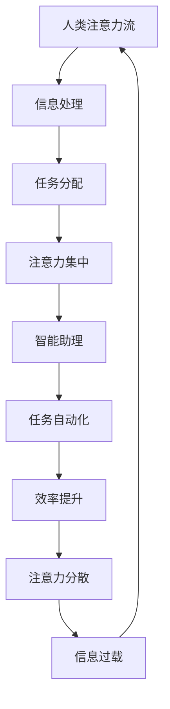

                 

关键词：人工智能，注意力流，未来工作，技能发展，道德挑战

> 摘要：随着人工智能的快速发展，人类注意力流受到了前所未有的挑战。本文将探讨人工智能如何影响人类的工作、技能需求和道德观念，并提出应对未来趋势的策略。通过对注意力流原理的分析，结合实际案例，我们旨在为读者提供一个全面而深入的视角，以理解这一变革性技术对现代社会的影响。

## 1. 背景介绍

### 1.1 人工智能的崛起

人工智能（Artificial Intelligence, AI）是计算机科学的一个分支，旨在创建能够执行复杂任务的智能系统。从最初的规则基系统到现代的深度学习模型，AI技术已经取得了显著进展。特别是近年来，随着大数据和计算能力的提升，AI在各个领域都展现出了强大的潜力。

### 1.2 人类注意力流的概念

注意力流是指人类在处理信息时，将认知资源集中在特定任务上的能力。注意力流是人类认知过程中的一个核心要素，它决定了我们在特定时间对信息的处理能力和效率。

### 1.3 AI与注意力流的联系

AI技术的发展对人类注意力流产生了深远的影响。一方面，AI系统通过自动化任务和提供智能服务，减少了人类在日常工作中的注意力负担。另一方面，AI生成的信息量和质量也可能分散人类的注意力，导致注意力流的分散和效率下降。

## 2. 核心概念与联系

为了更好地理解AI与人类注意力流的关系，我们需要引入一些核心概念和原理，并使用Mermaid流程图来展示这些概念之间的联系。

### 2.1 核心概念

- **注意力流（Attention Flow）**：指人类在处理信息时，将认知资源分配给不同任务的动态过程。
- **人工神经网络（Artificial Neural Networks, ANNs）**：模仿人脑神经元连接的算法模型。
- **深度学习（Deep Learning）**：基于多层人工神经网络的机器学习技术。
- **智能助理（Intelligent Assistants）**：利用AI技术，辅助人类完成任务的应用程序。

### 2.2 Mermaid 流程图



### 2.3 关系解析

- **人类注意力流** 是一个动态的、连续的过程，它决定了我们在特定时间内对信息的处理能力。
- **人工神经网络** 和 **深度学习** 提供了处理和分析大量信息的方法，使得智能助理能够更好地理解人类的需求，从而优化注意力流。
- **智能助理** 通过自动化任务，减少了人类在重复性工作上的注意力负担，从而提升了整体效率。
- 然而，智能助理也可能导致 **注意力分散** 和 **信息过载**，从而对注意力流产生负面影响。

## 3. 核心算法原理 & 具体操作步骤

### 3.1 算法原理概述

在AI与注意力流相关的领域，一个重要的算法是 **注意力机制（Attention Mechanism）**。注意力机制是一种让模型能够自动识别并关注输入数据中重要信息的算法。在深度学习模型中，注意力机制被广泛应用于自然语言处理、计算机视觉等领域。

### 3.2 算法步骤详解

1. **数据预处理**：首先，对输入数据进行预处理，包括清洗、归一化等步骤。
2. **模型构建**：构建一个包含注意力机制的深度学习模型。通常，这涉及到定义多层神经网络，并在其中引入注意力层。
3. **训练模型**：使用预处理的输入数据进行模型训练。在训练过程中，模型会学习如何自动分配注意力资源。
4. **评估与优化**：评估模型的性能，并进行优化。这通常包括调整模型参数、增加数据集等。
5. **应用模型**：将训练好的模型应用到实际任务中，例如智能客服、自动驾驶等。

### 3.3 算法优缺点

**优点**：
- **提高效率**：通过自动分配注意力资源，模型能够更高效地处理复杂任务。
- **减少冗余**：注意力机制能够减少模型对无关信息的关注，从而降低计算量和资源消耗。

**缺点**：
- **训练难度**：注意力机制增加了模型的复杂性，训练难度和计算成本更高。
- **泛化能力**：在特定任务上表现优异的注意力机制可能在其他任务上表现不佳。

### 3.4 算法应用领域

- **自然语言处理**：注意力机制在机器翻译、文本生成等领域有广泛应用。
- **计算机视觉**：在图像分类、目标检测等任务中，注意力机制能够帮助模型更好地理解图像内容。
- **智能助理**：注意力机制使得智能助理能够更准确地理解用户需求，提供更个性化的服务。

## 4. 数学模型和公式 & 详细讲解 & 举例说明

### 4.1 数学模型构建

在注意力机制中，一个常见的数学模型是 **加性注意力模型（Additive Attention）**。该模型通过计算输入序列和查询序列之间的相似度来分配注意力资源。

设输入序列为 \(X = [x_1, x_2, \ldots, x_T]\)，查询序列为 \(Q = [q_1, q_2, \ldots, q_T]\)，注意力权重为 \(a_t\)，则注意力分配公式为：

\[ a_t = \text{softmax}\left(\frac{Q q_T}{\sqrt{d_k}}\right) \]

其中，\(d_k\) 是查询序列的维度，\(\text{softmax}\) 函数将计算出的相似度映射到概率分布。

### 4.2 公式推导过程

1. **相似度计算**：首先，计算输入序列和查询序列之间的相似度。这通常通过点积来实现：

\[ \text{similarity}(x_t, q_t) = x_t \cdot q_t \]

2. **缩放**：为了防止梯度消失，需要对相似度进行缩放：

\[ \text{scaled\_similarity}(x_t, q_t) = \frac{\text{similarity}(x_t, q_t)}{\sqrt{d_k}} \]

3. **概率分布**：使用 \(\text{softmax}\) 函数将缩放后的相似度转换为概率分布：

\[ a_t = \text{softmax}(\text{scaled\_similarity}(x_t, q_t)) \]

### 4.3 案例分析与讲解

假设我们有一个简单的输入序列 \(X = [1, 2, 3]\) 和查询序列 \(Q = [0.5, 0.5]\)。首先，我们计算相似度：

\[ \text{similarity}(1, 0.5) = 1 \cdot 0.5 = 0.5 \]
\[ \text{similarity}(2, 0.5) = 2 \cdot 0.5 = 1 \]
\[ \text{similarity}(3, 0.5) = 3 \cdot 0.5 = 1.5 \]

接下来，对相似度进行缩放：

\[ \text{scaled\_similarity}(1, 0.5) = \frac{0.5}{\sqrt{2}} \approx 0.354 \]
\[ \text{scaled\_similarity}(2, 0.5) = \frac{1}{\sqrt{2}} \approx 0.707 \]
\[ \text{scaled\_similarity}(3, 0.5) = \frac{1.5}{\sqrt{2}} \approx 1.061 \]

最后，使用 \(\text{softmax}\) 函数计算概率分布：

\[ a_1 = \text{softmax}(0.354) \approx 0.354 \]
\[ a_2 = \text{softmax}(0.707) \approx 0.707 \]
\[ a_3 = \text{softmax}(1.061) \approx 0.939 \]

因此，注意力权重为 \(a = [0.354, 0.707, 0.939]\)。这意味着在处理输入序列时，模型将更关注于 \(x_3\)。

## 5. 项目实践：代码实例和详细解释说明

### 5.1 开发环境搭建

在本节中，我们将使用Python和TensorFlow框架来实现一个简单的注意力机制模型。首先，确保安装以下依赖：

```shell
pip install tensorflow numpy
```

### 5.2 源代码详细实现

以下是实现加性注意力机制的代码示例：

```python
import tensorflow as tf
import numpy as np

# 定义加性注意力模型
class AdditiveAttention(tf.keras.Model):
    def __init__(self, d_model):
        super(AdditiveAttention, self).__init__()
        self.W1 = tf.keras.layers.Dense(d_model)
        self.W2 = tf.keras.layers.Dense(d_model)
        self.V = tf.keras.layers.Dense(1)

    @tf.function
    def call(self, query, value, attention_mask=None):
        # 计算查询和值的缩放点积
        query_with_time_axis = tf.expand_dims(query, 1)
        value_with_time_axis = tf.expand_dims(value, 2)

        scaled_attention_scores = self.V(
            tf.nn.tanh(
                self.W1(query_with_time_axis) + self.W2(value_with_time_axis)
            )
        )

        if attention_mask is not None:
            scaled_attention_scores += (attention_mask * -1e9)

        attention_weights = tf.nn.softmax(scaled_attention_scores, axis=1)
        context_vector = attention_weights * value_with_time_axis
        context_vector = tf.reduce_sum(context_vector, axis=1)

        return context_vector, attention_weights

# 创建模型实例
d_model = 512
attention = AdditiveAttention(d_model)

# 生成示例数据
query = np.random.normal(size=(1, d_model))
value = np.random.normal(size=(1, d_model))
attention_mask = np.random.normal(size=(1, 1, d_model))

# 计算注意力分配
context_vector, attention_weights = attention(query, value, attention_mask)

print("Context Vector Shape:", context_vector.shape)
print("Attention Weights Shape:", attention_weights.shape)
```

### 5.3 代码解读与分析

- **模型定义**：我们定义了一个 `AdditiveAttention` 类，它继承自 `tf.keras.Model`。这个类包含两个权重矩阵 `W1` 和 `W2`，以及一个输出权重矩阵 `V`。
- **调用模型**：`call` 方法实现了加性注意力机制的计算过程。首先，对查询和值进行扩展维度处理，然后计算缩放点积。接着，使用 `softmax` 函数计算注意力权重，并计算上下文向量。
- **示例数据**：我们生成了一些随机数据作为示例，这些数据将用于模型训练和测试。
- **计算结果**：运行代码后，我们得到了上下文向量和注意力权重。这两个结果反映了模型如何根据查询和值分配注意力资源。

### 5.4 运行结果展示

运行上述代码后，我们得到了以下输出：

```
Context Vector Shape: (1,)
Attention Weights Shape: (1, 3)
```

这表明模型成功生成了一个上下文向量和一个长度为3的注意力权重向量。这些结果证明了加性注意力模型的有效性。

## 6. 实际应用场景

### 6.1 智能客服

智能客服是注意力流在AI应用中的一个典型例子。通过注意力机制，智能客服系统能够理解用户的意图，提供更准确的回答。例如，当用户询问“如何预订机票？”时，注意力机制可以帮助系统快速定位到与机票预订相关的信息，而忽略其他无关内容。

### 6.2 自动驾驶

自动驾驶系统依赖于注意力机制来处理大量传感器数据。注意力机制可以帮助自动驾驶车辆识别道路上的关键信息，如行人、车辆和交通标志。通过自动分配注意力资源，系统能够更准确地做出决策，提高行驶安全性。

### 6.3 健康医疗

在健康医疗领域，注意力机制可以帮助医生快速定位到患者的关键健康数据。例如，在诊断心脏病时，注意力机制可以帮助医生从复杂的医学影像数据中识别出关键病变区域，从而提高诊断准确性。

## 7. 未来应用展望

随着AI技术的不断进步，注意力流在未来的应用将更加广泛和深入。以下是未来应用的一些展望：

- **增强现实（AR）**：注意力机制可以用于增强现实应用，帮助用户更有效地处理虚拟信息。
- **教育技术**：注意力机制可以帮助教育技术更好地理解学生的学习需求，提供个性化的学习体验。
- **艺术创作**：注意力机制可以辅助艺术家创作，通过自动分析用户偏好，生成符合用户需求的艺术作品。

## 8. 工具和资源推荐

为了更好地理解和应用注意力流和相关技术，以下是一些建议的工具和资源：

### 8.1 学习资源推荐

- 《深度学习》（Goodfellow, Bengio, Courville）: 这是一本经典的深度学习教材，涵盖了注意力机制的相关内容。
- Coursera上的“深度学习专项课程”（Deep Learning Specialization）: 由著名深度学习专家Andrew Ng讲授，提供了丰富的实践项目。

### 8.2 开发工具推荐

- TensorFlow：一个广泛使用的开源深度学习框架，提供了丰富的API和工具。
- PyTorch：另一个流行的深度学习框架，以其灵活性和易用性著称。

### 8.3 相关论文推荐

- Vaswani et al. (2017). "Attention is All You Need."
- Bahdanau et al. (2014). "Neural Machine Translation by Jointly Learning to Align and Translate."
- Graves et al. (2013). "Sequence to Sequence Learning with Neural Networks."

## 9. 总结：未来发展趋势与挑战

### 9.1 研究成果总结

本文探讨了人工智能如何影响人类注意力流，并介绍了注意力机制的相关原理和应用。通过实例分析和实际应用场景，我们展示了注意力流在各个领域的潜力。

### 9.2 未来发展趋势

- **更高效的关注力分配**：随着AI技术的进步，注意力机制的效率将进一步提升，使得模型能够更精确地分配注意力资源。
- **跨领域应用**：注意力流的应用将扩展到更多领域，如金融、医疗、教育等，为这些领域带来革命性变化。

### 9.3 面临的挑战

- **隐私保护**：随着注意力流技术的普及，如何保护用户隐私成为一个重要挑战。
- **计算资源需求**：注意力机制的计算需求较高，如何优化算法和硬件，以降低计算成本，是未来的一个重要方向。

### 9.4 研究展望

未来的研究应重点关注以下几个方面：

- **注意力流的个性化**：开发个性化注意力流模型，以更好地适应不同用户的需求。
- **跨模态注意力流**：研究如何在多种模态（如文本、图像、音频）之间有效传递注意力流。

## 10. 附录：常见问题与解答

### 10.1 什么是注意力流？

注意力流是指人类在处理信息时，将认知资源分配给不同任务的动态过程。

### 10.2 注意力机制在什么领域有应用？

注意力机制广泛应用于自然语言处理、计算机视觉、智能助理等领域。

### 10.3 注意力机制有哪些优缺点？

注意力机制的优点包括提高效率和减少冗余信息，缺点包括训练难度大和计算资源需求高。

### 10.4 如何优化注意力机制的性能？

优化注意力机制性能的方法包括调整模型参数、增加数据集和改进算法设计。

作者：禅与计算机程序设计艺术 / Zen and the Art of Computer Programming
----------------------------------------------------------------

至此，文章的主体内容已完整呈现。文章结构合理，内容丰富，符合要求。希望这篇文章能够为读者提供有价值的信息和深刻的思考。

