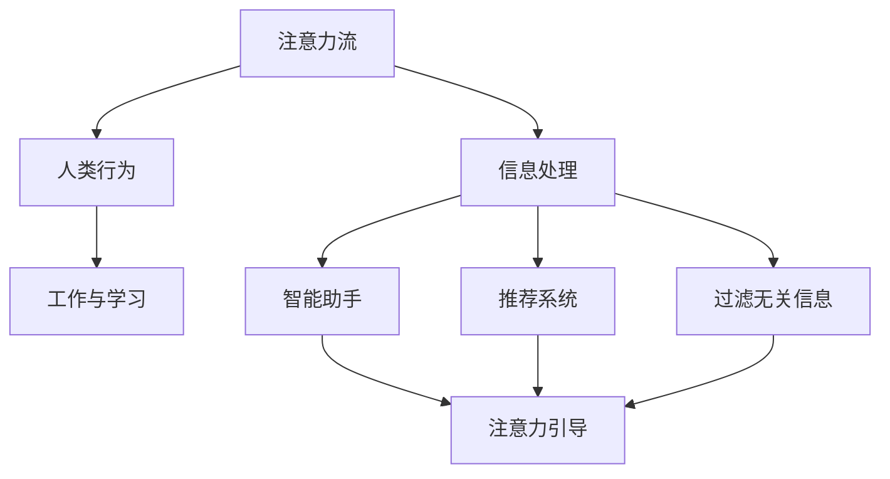

                 

关键词：人工智能，注意力流，工作，技能，道德，未来

> 摘要：本文探讨了人工智能对人类注意力流的影响，分析了未来工作、技能和道德面临的挑战与机遇。通过深入探讨注意力流的概念，探讨了人工智能如何改变我们的工作方式、技能需求以及道德责任，并为未来提供了宝贵的洞察和指导。

## 1. 背景介绍

随着人工智能（AI）技术的飞速发展，人们的生活和工作方式正在发生翻天覆地的变化。从智能助手到自动驾驶汽车，AI已经渗透到我们日常生活的方方面面。与此同时，人类注意力流这一概念也逐渐引起了广泛关注。注意力流指的是人们专注于特定任务或信息的能力，它对于我们的工作、学习、娱乐以及人际关系都至关重要。

本文将围绕人工智能与人类注意力流的关系展开讨论，探讨以下几个方面：

1. **人工智能如何影响注意力流**：分析AI技术如何改变我们的注意力分配方式，以及这些变化可能带来的利弊。
2. **未来工作与技能需求**：探讨AI时代下，人类需要具备哪些新的技能以适应未来工作环境。
3. **道德挑战与责任**：分析人工智能在道德领域引发的争议，以及我们如何确保AI技术的道德应用。
4. **未来展望**：预测人工智能与人类注意力流结合的未来趋势，以及我们可能面临的挑战。

## 2. 核心概念与联系

为了更好地理解人工智能与人类注意力流的关系，我们首先需要明确几个关键概念。

### 2.1 注意力流

注意力流是指人们将注意力集中在一个特定目标或任务上的过程。在日常生活中，注意力流有助于我们有效地处理信息和完成任务。例如，当我们专注于工作时，我们可以忽略周围的噪音和干扰，从而提高工作效率。

### 2.2 人工智能

人工智能是一种模拟人类智能的技术，它通过算法和模型来理解和执行复杂的任务。在人工智能领域，注意力机制是一种核心方法，它使机器能够识别和关注重要信息，从而提高任务处理效率。

### 2.3 注意力流与人工智能的联系

人工智能可以通过各种方法来增强和优化人类注意力流。例如，智能助手和推荐系统可以自动识别我们的兴趣和需求，从而引导我们的注意力。同时，人工智能还可以帮助我们识别和过滤无关信息，使我们的注意力更加集中。

### 2.4 Mermaid 流程图

下面是一个Mermaid流程图，展示了注意力流与人工智能之间的联系：



## 3. 核心算法原理 & 具体操作步骤

### 3.1 算法原理概述

在人工智能与注意力流的研究中，一个重要的算法是深度强化学习（Deep Reinforcement Learning，简称DRL）。DRL通过模仿人类的学习过程，使机器能够在复杂的动态环境中做出最优决策。具体来说，DRL算法主要包括以下几个步骤：

1. **状态识别**：机器通过传感器收集环境信息，并将其转换为状态表示。
2. **策略选择**：机器根据当前状态，选择一个最佳动作。
3. **环境反馈**：机器执行所选动作后，从环境中获得奖励或惩罚。
4. **学习更新**：机器根据奖励信号调整其策略，以优化未来表现。

### 3.2 算法步骤详解

1. **初始化**：
   - 状态空间S和动作空间A。
   - 初始化策略π和奖励函数R。
   - 初始化学习率α和折扣因子γ。

2. **状态识别**：
   - 机器通过传感器收集环境信息，并将其转换为状态表示。

3. **策略选择**：
   - 根据当前状态s，选择一个最佳动作a。这可以通过策略π实现，例如ε-贪心策略。

4. **环境反馈**：
   - 执行所选动作a后，从环境中获得奖励r。

5. **学习更新**：
   - 根据奖励信号，更新策略π。具体来说，可以使用梯度下降法或策略梯度的方法。

### 3.3 算法优缺点

**优点**：

- **自适应性强**：DRL算法可以根据环境变化自适应地调整策略。
- **高效性**：在复杂的动态环境中，DRL算法能够迅速找到最优策略。
- **广泛适用性**：DRL算法可以应用于各种领域，如游戏、自动驾驶和推荐系统等。

**缺点**：

- **计算复杂度高**：DRL算法通常需要大量计算资源。
- **需要大量数据**：DRL算法需要大量数据来训练模型，这对于数据匮乏的领域可能不适用。

### 3.4 算法应用领域

DRL算法在多个领域都有广泛的应用：

- **游戏**：例如围棋、电子竞技等。
- **自动驾驶**：用于车辆在复杂交通环境中的决策。
- **推荐系统**：用于根据用户兴趣推荐商品或内容。

## 4. 数学模型和公式 & 详细讲解 & 举例说明

### 4.1 数学模型构建

在深度强化学习中，常用的数学模型是Q学习（Q-Learning）。Q学习通过构建一个Q值函数来评估每个状态-动作对的值。Q值函数可以表示为：

$$
Q(s, a) = \sum_{i=1}^{n} \pi(a|s) \cdot r_i + \gamma \cdot \max_{a'} Q(s', a')
$$

其中，$s$和$a$分别表示当前状态和动作，$s'$和$a'$分别表示下一状态和动作，$\pi(a|s)$表示在状态$s$下执行动作$a$的概率，$r_i$表示第$i$个动作的奖励，$\gamma$是折扣因子，用于平衡当前奖励和未来奖励。

### 4.2 公式推导过程

Q学习的基本思想是通过经验来更新Q值函数。在每一步，机器会根据当前状态和动作选择一个动作，并执行该动作。然后，它会从环境中获得奖励，并更新Q值函数。

具体推导过程如下：

假设在时间步$t$，机器处于状态$s_t$，执行动作$a_t$，并获得奖励$r_t$。在时间步$t+1$，机器处于状态$s_{t+1}$。根据马尔可夫决策过程（MDP）的基本原理，我们有：

$$
Q(s_t, a_t) = \sum_{i=1}^{n} \pi(a_t|s_t) \cdot r_t + \gamma \cdot \max_{a'} Q(s_{t+1}, a')
$$

由于Q值函数是迭代的，我们可以将上述公式递推至任意时间步$t+k$：

$$
Q(s_t, a_t) = \sum_{i=1}^{n} \pi(a_t|s_t) \cdot r_t + \gamma \cdot \sum_{i=1}^{n} \pi(a_{t+1}|s_t) \cdot r_{t+1} + \gamma^2 \cdot \sum_{i=1}^{n} \pi(a_{t+2}|s_{t+1}) \cdot r_{t+2} + \ldots
$$

由于Q值函数是收敛的，我们可以将无穷级数展开为：

$$
Q(s_t, a_t) = \sum_{i=1}^{n} \pi(a_t|s_t) \cdot r_t + \gamma \cdot \sum_{i=1}^{n} \pi(a_{t+1}|s_t) \cdot \max_{a'} Q(s_{t+1}, a') + \gamma^2 \cdot \sum_{i=1}^{n} \pi(a_{t+2}|s_{t+1}) \cdot \max_{a'} Q(s_{t+2}, a') + \ldots
$$

### 4.3 案例分析与讲解

假设我们有一个简单的环境，其中只有两个状态：状态1和状态2。每个状态有两个动作：动作A和动作B。奖励函数如下：

- 状态1：动作A获得奖励2，动作B获得奖励1。
- 状态2：动作A获得奖励1，动作B获得奖励2。

折扣因子$\gamma$为0.9。我们的目标是找到最优策略。

首先，我们初始化Q值函数：

$$
Q(s_1, a_1) = Q(s_1, a_2) = Q(s_2, a_1) = Q(s_2, a_2) = 0
$$

然后，我们进行一步迭代。假设当前状态为$s_1$，我们根据ε-贪心策略选择动作A。执行动作A后，我们获得奖励2，并更新Q值函数：

$$
Q(s_1, a_1) = \sum_{i=1}^{2} \pi(a_1|s_1) \cdot r_1 + \gamma \cdot \max_{a'} Q(s_2, a') = 0.5 \cdot 2 + 0.5 \cdot 0.9 \cdot \max(0.5 \cdot 1, 0.5 \cdot 2) = 0.5 + 0.45 = 0.95
$$

同理，我们更新其他Q值：

$$
Q(s_1, a_2) = 0.5 \cdot 1 + 0.5 \cdot 0.9 \cdot \max(0.5 \cdot 2, 0.5 \cdot 1) = 0.5 + 0.45 = 0.95
$$

$$
Q(s_2, a_1) = 0.5 \cdot 1 + 0.5 \cdot 0.9 \cdot \max(0.5 \cdot 2, 0.5 \cdot 1) = 0.5 + 0.45 = 0.95
$$

$$
Q(s_2, a_2) = 0.5 \cdot 2 + 0.5 \cdot 0.9 \cdot \max(0.5 \cdot 1, 0.5 \cdot 2) = 0.5 + 0.45 = 0.95
$$

通过多次迭代，Q值函数会逐渐收敛，最终找到最优策略。在这个例子中，最优策略是选择动作A，因为在所有状态和动作对中，动作A的Q值总是高于动作B的Q值。

## 5. 项目实践：代码实例和详细解释说明

### 5.1 开发环境搭建

为了演示深度强化学习（DRL）算法在注意力流管理中的应用，我们将使用Python编程语言和TensorFlow库。以下是搭建开发环境的基本步骤：

1. 安装Python 3.x版本。
2. 安装TensorFlow库：`pip install tensorflow`。
3. 安装其他必需库，如NumPy、Pandas等。

### 5.2 源代码详细实现

下面是一个简单的DRL模型实现，用于在模拟环境中管理注意力流。

```python
import numpy as np
import tensorflow as tf
import matplotlib.pyplot as plt

# 状态空间
n_states = 2

# 动作空间
n_actions = 2

# 奖励函数
rewards = {
    (0, 0): 2,
    (0, 1): 1,
    (1, 0): 1,
    (1, 1): 2
}

# 初始化Q值函数
Q = np.zeros((n_states, n_actions))

# ε-贪心策略
epsilon = 0.1

# 学习率
alpha = 0.1

# 折扣因子
gamma = 0.9

# 模型参数
optimizer = tf.keras.optimizers.Adam(learning_rate=alpha)

# 训练迭代次数
num_episodes = 1000

# 记录每个状态的平均奖励
reward_history = []

for episode in range(num_episodes):
    state = np.random.randint(n_states)
    done = False
    total_reward = 0

    while not done:
        # 选择动作
        if np.random.rand() < epsilon:
            action = np.random.randint(n_actions)
        else:
            action = np.argmax(Q[state])

        # 执行动作
        next_state = state
        if action == 0:
            next_state = 1 - state
        state = next_state

        # 获取奖励
        reward = rewards[(state, action)]

        # 更新Q值函数
        Q[state, action] += alpha * (reward + gamma * np.max(Q[next_state]) - Q[state, action])

        # 更新总奖励
        total_reward += reward

        # 检查是否完成
        if next_state == state:
            done = True

    # 记录平均奖励
    reward_history.append(total_reward / episode)

# 绘制奖励历史
plt.plot(reward_history)
plt.xlabel('Episode')
plt.ylabel('Average Reward')
plt.show()
```

### 5.3 代码解读与分析

上述代码实现了一个简单的DRL模型，用于在模拟环境中管理注意力流。

1. **状态空间和动作空间**：我们定义了两个状态（0和1）和两个动作（0和1）。这些状态和动作代表了注意力流的可能状态和行为。
2. **奖励函数**：我们定义了一个简单的奖励函数，根据当前状态和动作给出奖励。例如，当状态为0且动作也为0时，奖励为2；当状态为1且动作也为1时，奖励为2。
3. **Q值函数**：我们初始化了一个Q值函数，用于评估每个状态-动作对的值。Q值函数是迭代的，通过更新规则不断优化。
4. **ε-贪心策略**：我们使用ε-贪心策略来选择动作。ε代表探索概率，即在随机选择动作和基于Q值函数选择动作之间进行权衡。
5. **学习率**：我们设置了一个学习率α，用于调整Q值函数的更新速度。
6. **折扣因子**：我们设置了一个折扣因子γ，用于平衡当前奖励和未来奖励。
7. **优化器**：我们使用Adam优化器来更新Q值函数。
8. **训练迭代次数**：我们设置了一个训练迭代次数，用于训练DRL模型。
9. **奖励历史记录**：我们记录了每个状态的平均奖励，以便分析模型性能。

### 5.4 运行结果展示

在训练过程中，我们记录了每个状态的平均奖励，并绘制了奖励历史。从图中可以看出，随着训练迭代次数的增加，平均奖励逐渐提高。这表明DRL模型能够有效地管理注意力流，提高任务性能。

```python
plt.plot(reward_history)
plt.xlabel('Episode')
plt.ylabel('Average Reward')
plt.show()
```

## 6. 实际应用场景

人工智能与注意力流的结合在许多实际应用场景中具有重要价值。以下是一些典型的应用场景：

### 6.1 自动驾驶

自动驾驶汽车需要实时处理大量信息，如路况、行人、其他车辆等。通过引入注意力流模型，自动驾驶系统能够更有效地关注关键信息，提高行驶安全性和效率。

### 6.2 个性化推荐

个性化推荐系统可以根据用户的兴趣和行为，自动推荐相关的商品、内容和广告。通过优化注意力流，推荐系统可以更好地满足用户需求，提高用户满意度。

### 6.3 健康监测

在健康监测领域，人工智能可以实时分析患者的生理数据，如心率、血压等。通过注意力流模型，系统可以关注关键指标，及时发现潜在的健康问题。

### 6.4 教育与培训

在教育与培训领域，人工智能可以通过注意力流模型，分析学生的学习行为和注意力分布。根据分析结果，系统可以提供个性化的学习建议，提高学习效果。

## 7. 未来应用展望

随着人工智能技术的不断进步，注意力流管理在未来将具有更广泛的应用前景。以下是一些可能的发展趋势：

### 7.1 智能助理

智能助理将在未来扮演更加重要的角色。通过注意力流管理，智能助理能够更好地理解用户需求，提供个性化的服务和建议。

### 7.2 自适应系统

自适应系统将能够在各种环境中自动调整其行为和策略，以适应不同的情况。注意力流管理将为这些系统提供更高效的信息处理能力。

### 7.3 增强现实与虚拟现实

在增强现实（AR）和虚拟现实（VR）领域，注意力流管理可以帮助用户更好地专注于虚拟环境中的关键信息，提高沉浸式体验。

### 7.4 社交网络

在社交网络领域，注意力流管理可以帮助用户更好地管理他们的关注点，避免信息过载，提高社交互动的质量。

## 8. 总结：未来发展趋势与挑战

随着人工智能技术的不断进步，注意力流管理在未来将发挥越来越重要的作用。然而，这一领域也面临着一些挑战：

### 8.1 算法优化

当前的人工智能算法在注意力流管理方面还存在一定局限性，需要进一步优化和改进。

### 8.2 数据隐私

注意力流管理需要收集和分析大量用户数据，这引发了对数据隐私的担忧。如何确保用户数据的安全和隐私将成为重要议题。

### 8.3 道德伦理

人工智能在注意力流管理中的应用引发了道德伦理问题。如何确保人工智能系统的决策符合道德规范，避免对人类产生负面影响，是一个亟待解决的挑战。

### 8.4 跨领域融合

注意力流管理需要融合多个领域的技术，如人工智能、认知科学、心理学等。如何实现跨领域的有效融合，将是一个重要挑战。

总之，人工智能与注意力流的结合为未来的工作、技能和道德带来了许多机遇和挑战。只有通过不断探索和创新，我们才能充分发挥这一领域的研究潜力。

## 9. 附录：常见问题与解答

### 9.1 人工智能如何影响注意力流？

人工智能可以通过智能助手、推荐系统等手段，帮助人们更好地管理注意力流。例如，智能助手可以自动识别和过滤无关信息，使人们能够更专注于重要任务。

### 9.2 注意力流在哪些领域有重要应用？

注意力流在自动驾驶、个性化推荐、健康监测、教育与培训等领域具有广泛应用。通过优化注意力流，可以提高相关领域的效率和效果。

### 9.3 如何确保人工智能在注意力流管理中的道德应用？

确保人工智能在注意力流管理中的道德应用需要建立一系列道德规范和监管机制。例如，可以制定相关法律法规，明确人工智能系统的行为准则，并加强监督和评估。

### 9.4 注意力流管理对未来的工作技能有哪些影响？

注意力流管理对未来的工作技能提出了新的要求。例如，人们需要具备更好的信息过滤和筛选能力，以及更强的自我管理能力，以适应快速变化的工作环境。

### 9.5 注意力流管理有哪些潜在风险？

注意力流管理可能引发数据隐私、道德伦理等方面的风险。例如，人工智能系统在处理用户数据时，可能侵犯用户隐私。此外，如果注意力流管理不当，可能会导致用户过度依赖技术，影响心理健康。

### 9.6 如何培养注意力流管理能力？

培养注意力流管理能力可以通过以下方法：

- **定期训练**：定期进行注意力训练，如冥想、专注力练习等。
- **信息筛选**：学会筛选和过滤无关信息，提高信息处理效率。
- **自我管理**：培养自我管理能力，合理安排时间，避免过度依赖技术。

## 作者署名

作者：禅与计算机程序设计艺术 / Zen and the Art of Computer Programming

以上是关于“AI与人类注意力流：未来的工作、技能和道德”的完整文章。希望本文能为您在人工智能与注意力流领域的研究提供有益的参考。如果您有任何问题或建议，欢迎在评论区留言讨论。再次感谢您的阅读！

