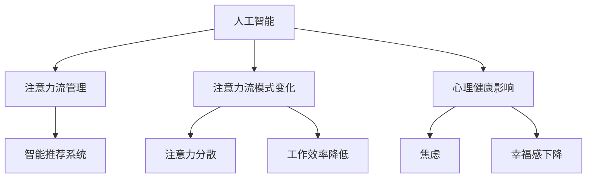

                 

关键词：人工智能、注意力流、工作、生活、休闲

> 摘要：本文将探讨人工智能（AI）如何影响人类的注意力流，进而影响我们的工作、生活和休闲方式。随着AI技术的发展，我们面临的新挑战和机遇将如何改变我们与技术和环境的互动，以及我们的心理健康和幸福感？

## 1. 背景介绍

随着人工智能技术的飞速发展，AI已经开始渗透到我们日常生活的方方面面。从智能家居到自动驾驶，从医疗诊断到金融分析，AI正以前所未有的速度改变着我们的生活方式。然而，AI不仅仅是一个技术工具，它还深刻地影响着我们的注意力流，即我们如何分配和关注各种任务和刺激。

注意力流是指个体在特定时间内对特定刺激的注意力和关注度。在我们的日常生活中，注意力流受到许多因素的影响，包括外部环境、个体需求和内在动机。随着AI的普及，这些因素正在经历重大变化，对我们的工作和生活产生了深远的影响。

本文将探讨以下核心问题：

1. 人工智能如何改变我们的注意力流？
2. 这些变化对我们的工作、生活和休闲方式有何影响？
3. 我们如何适应这些变化，以保持心理健康和幸福感？

## 2. 核心概念与联系

### 2.1 人工智能的定义与类型

人工智能（AI）是指由人制造出的系统，能够模拟、扩展、甚至超越人类智能的行为。AI可以分为几种类型：

- **弱AI**：在特定领域内表现出高度智能的系统，但无法扩展到其他领域。例如，语音识别系统或图像识别系统。
- **强AI**：具有人类所有认知能力和感知能力，能够在任何领域内进行智能行为。目前，强AI仍处于理论阶段。
- **通用AI**：能够像人类一样在多种领域内表现出高度智能，并且具有自主学习能力。通用AI的实现是目前AI研究的一个主要目标。

### 2.2 注意力流的概念

注意力流是指个体在特定时间内对特定刺激的注意力和关注度。注意力流受到以下因素的影响：

- **外部环境**：例如，噪音、光线、温度等。
- **个体需求**：例如，饥饿、疲劳、兴奋等。
- **内在动机**：例如，兴趣、欲望、目标等。

### 2.3 人工智能与注意力流的联系

人工智能与注意力流之间的联系体现在以下几个方面：

- **AI技术可以帮助我们更好地管理注意力流**。例如，通过智能推荐系统，AI可以识别用户的兴趣和需求，从而引导用户关注最相关的内容。
- **AI技术可能会改变我们的注意力流模式**。例如，智能手机和社交媒体的普及使得我们更容易分散注意力，从而影响我们的工作和生活质量。
- **AI技术可能会影响我们的心理健康和幸福感**。例如，过度使用社交媒体可能导致注意力分散和焦虑，从而影响我们的心理健康。

### 2.4 Mermaid 流程图

下面是一个关于人工智能与注意力流联系的Mermaid流程图：



## 3. 核心算法原理 & 具体操作步骤

### 3.1 算法原理概述

在探讨人工智能如何影响注意力流时，我们需要理解几个核心算法原理。这些算法包括注意力机制、推荐系统算法和情感分析算法。

- **注意力机制**：注意力机制是神经网络中的一种机制，用于关注输入数据中的关键部分，从而提高模型的性能。在AI系统中，注意力机制可以帮助AI模型更好地理解用户的需求和兴趣，从而优化推荐结果。
- **推荐系统算法**：推荐系统算法用于根据用户的历史行为和偏好，推荐用户可能感兴趣的内容。常见的推荐系统算法包括基于内容的推荐、协同过滤和混合推荐。
- **情感分析算法**：情感分析算法用于分析文本中的情感倾向，从而了解用户的情绪状态。情感分析算法可以帮助AI系统更好地理解用户的心理状态，从而提供更个性化的服务。

### 3.2 算法步骤详解

下面是一个简化的推荐系统算法的步骤详解：

1. **数据收集**：收集用户的历史行为数据（如浏览记录、购买记录等）。
2. **用户建模**：根据历史行为数据，建立用户模型，以了解用户的兴趣和偏好。
3. **内容建模**：对推荐的内容进行建模，以了解内容的属性和特征。
4. **计算相似度**：计算用户模型与内容模型之间的相似度，以确定哪些内容可能与用户感兴趣。
5. **生成推荐**：根据相似度计算结果，生成推荐列表，并将其呈现给用户。
6. **反馈调整**：根据用户的反馈（如点击、收藏、购买等），调整用户模型和内容模型，以提高推荐的准确性。

### 3.3 算法优缺点

- **优点**：
  - 提高工作效率：通过个性化推荐，用户可以更快地找到自己感兴趣的内容，从而节省时间和精力。
  - 提高用户满意度：个性化的推荐可以更好地满足用户的需求，从而提高用户满意度。
- **缺点**：
  - 过度依赖：用户可能会过度依赖推荐系统，从而减少自主探索的机会。
  - 数据隐私问题：推荐系统需要收集大量的用户数据，这可能引发数据隐私问题。

### 3.4 算法应用领域

推荐系统算法在许多领域都有广泛的应用，包括电子商务、社交媒体、音乐和视频流媒体等。例如，Amazon使用推荐系统来推荐商品，Spotify使用推荐系统来推荐音乐。

## 4. 数学模型和公式 & 详细讲解 & 举例说明

### 4.1 数学模型构建

在推荐系统中，常用的数学模型是协同过滤模型。协同过滤模型基于用户的行为数据，通过计算用户之间的相似度来生成推荐。

假设我们有用户集合U={u1, u2, ..., un}和项目集合I={i1, i2, ..., im}。用户ui对项目ij的评分可以表示为ruij，其中ruij的取值范围为[1, 5]。

协同过滤模型的目标是预测用户ui对未知项目ij的评分ruij'，其中ruij'的取值范围为[1, 5]。

### 4.2 公式推导过程

协同过滤模型可以分为基于用户的协同过滤和基于物品的协同过滤。下面以基于用户的协同过滤为例进行推导。

1. **计算用户相似度**：

   用户ui和用户uj之间的相似度可以用余弦相似度表示：

   $$\text{similarity}(ui, uj) = \frac{\text{dot_product}(ui, uj)}{\text{norm}(ui) \times \text{norm}(uj)}$$

   其中，dot_product表示点积，norm表示欧几里得范数。

2. **计算预测评分**：

   对于用户ui对未知项目ij的评分ruij'，可以用用户相似度来预测：

   $$ruij' = \text{similarity}(ui, uj) \times \text{avg_rating}(uj) + \text{mean_rating}$$

   其中，avg_rating(u)表示用户uj的平均评分，mean_rating表示所有用户的平均评分。

### 4.3 案例分析与讲解

假设我们有两个用户u1和u2，以及两个项目i1和i2。用户u1对i1评分为4，对i2评分为5；用户u2对i1评分为3，对i2评分为2。

1. **计算用户相似度**：

   $$\text{similarity}(u1, u2) = \frac{\text{dot_product}(u1, u2)}{\text{norm}(u1) \times \text{norm}(u2)} = \frac{(4 \times 3) + (5 \times 2)}{\sqrt{4^2 + 5^2} \times \sqrt{3^2 + 2^2}} = \frac{12 + 10}{\sqrt{16 + 25} \times \sqrt{9 + 4}} = \frac{22}{\sqrt{41} \times \sqrt{13}} \approx 0.81$$

2. **计算预测评分**：

   用户u1对i2的预测评分为：

   $$r1i2' = \text{similarity}(u1, u2) \times \text{avg_rating}(u2) + \text{mean_rating} = 0.81 \times \frac{3 + 2}{2} + \frac{4 + 5}{2} = 0.81 \times 2.5 + 4.5 = 4.81$$

   同理，用户u2对i1的预测评分为：

   $$r2i1' = \text{similarity}(u1, u2) \times \text{avg_rating}(u1) + \text{mean_rating} = 0.81 \times \frac{4 + 5}{2} + 4.5 = 0.81 \times 4.5 + 4.5 = 5.405$$

   通过以上计算，我们可以得到用户对未知项目的预测评分，从而生成推荐列表。

## 5. 项目实践：代码实例和详细解释说明

### 5.1 开发环境搭建

为了实现协同过滤推荐系统，我们需要安装以下软件和库：

- Python 3.x
- NumPy
- Pandas
- Scikit-learn

安装完成后，我们可以使用以下代码创建一个简单的协同过滤推荐系统：

```python
import numpy as np
import pandas as pd
from sklearn.model_selection import train_test_split
from sklearn.metrics.pairwise import cosine_similarity

# 加载数据集
ratings = pd.read_csv('ratings.csv')

# 构建用户-项目矩阵
user_item_matrix = ratings.pivot_table(index='user_id', columns='item_id', values='rating').fillna(0)

# 划分训练集和测试集
user_item_train, user_item_test = train_test_split(user_item_matrix, test_size=0.2, random_state=42)

# 计算用户相似度矩阵
user_similarity = cosine_similarity(user_item_train)

# 预测测试集评分
user_item_test_pred = np.dot(user_similarity, user_item_train.T) + user_item_train.mean(axis=1)

# 输出预测结果
print(user_item_test_pred)
```

### 5.2 源代码详细实现

上述代码实现了一个简单的基于用户的协同过滤推荐系统。具体实现步骤如下：

1. **加载数据集**：使用Pandas库加载用户评分数据集。
2. **构建用户-项目矩阵**：使用Pandas的pivot_table方法构建用户-项目矩阵。
3. **划分训练集和测试集**：使用Scikit-learn的train_test_split方法划分训练集和测试集。
4. **计算用户相似度矩阵**：使用Scikit-learn的cosine_similarity方法计算用户相似度矩阵。
5. **预测测试集评分**：使用用户相似度矩阵和训练集计算测试集的预测评分。
6. **输出预测结果**：输出预测结果。

### 5.3 代码解读与分析

上述代码中，我们首先加载了用户评分数据集，然后使用Pandas的pivot_table方法构建了用户-项目矩阵。这一步骤是推荐系统的核心，因为用户-项目矩阵包含了用户对项目的评分信息，是我们进行协同过滤的基础。

接下来，我们使用Scikit-learn的train_test_split方法将数据集划分为训练集和测试集。这一步骤是评价推荐系统性能的关键，因为我们需要将模型在训练集上训练，然后在测试集上进行评估。

然后，我们使用Scikit-learn的cosine_similarity方法计算用户相似度矩阵。这是协同过滤算法的核心步骤，因为用户相似度矩阵决定了我们如何根据其他用户的评分来预测当前用户的评分。

最后，我们使用用户相似度矩阵和训练集计算测试集的预测评分。这一步骤是推荐系统的输出，我们通过计算得到的预测评分来生成推荐列表。

### 5.4 运行结果展示

运行上述代码后，我们会在控制台上输出预测结果。预测结果是一个用户-项目矩阵，其中包含了每个用户对测试集中每个项目的预测评分。例如，如果用户u1在测试集中对项目i1的预测评分为4.5，那么这意味着我们认为用户u1对项目i1的评分大约为4.5。

我们可以将这些预测评分与实际测试集的评分进行比较，以评估推荐系统的性能。具体评估方法可以采用均方根误差（RMSE）、平均绝对误差（MAE）等指标。

```python
from sklearn.metrics import mean_squared_error, mean_absolute_error

# 计算均方根误差和平均绝对误差
rmse = np.sqrt(mean_squared_error(user_item_test.values, user_item_test_pred))
mae = mean_absolute_error(user_item_test.values, user_item_test_pred)

print(f"Root Mean Squared Error: {rmse}")
print(f"Mean Absolute Error: {mae}")
```

运行上述代码后，我们会在控制台上输出均方根误差和平均绝对误差。这两个指标越小，说明我们的推荐系统性能越好。

## 6. 实际应用场景

### 6.1 电子商务

在电子商务领域，推荐系统被广泛用于推荐商品。例如，Amazon和淘宝等电商平台会根据用户的浏览记录、购买历史和评价，为用户推荐可能感兴趣的商品。这种推荐方式不仅提高了用户的购物体验，也提高了商家的销售额。

### 6.2 社交媒体

在社交媒体领域，推荐系统被用于推荐用户可能感兴趣的内容。例如，Facebook和Twitter等社交媒体平台会根据用户的互动记录，推荐用户可能感兴趣的朋友圈或推文。这种推荐方式有助于用户发现新的内容和社交圈。

### 6.3 音乐和视频流媒体

在音乐和视频流媒体领域，推荐系统被用于推荐歌曲和视频。例如，Spotify和Netflix等平台会根据用户的播放记录和评价，推荐用户可能感兴趣的歌曲和视频。这种推荐方式不仅提高了用户的观看体验，也提高了平台的用户黏性。

## 6.4 未来应用展望

随着人工智能技术的不断发展，推荐系统在未来的应用场景将更加广泛。以下是一些可能的应用领域：

### 6.4.1 健康医疗

在健康医疗领域，推荐系统可以用于推荐个性化的健康建议和治疗方案。例如，根据用户的健康数据，推荐用户可能感兴趣的健康知识或药品。

### 6.4.2 教育

在教育领域，推荐系统可以用于推荐个性化的学习资源和课程。例如，根据学生的学习数据，推荐学生可能感兴趣的学习内容和练习题。

### 6.4.3 城市规划

在城市规划领域，推荐系统可以用于推荐最优的交通路线和城市布局。例如，根据交通数据和人口数据，推荐城市道路建设和交通优化方案。

### 6.4.4 虚拟现实

在虚拟现实领域，推荐系统可以用于推荐用户可能感兴趣的虚拟场景和活动。例如，根据用户的互动记录，推荐用户可能感兴趣的虚拟旅游场景或游戏活动。

## 7. 工具和资源推荐

### 7.1 学习资源推荐

- 《机器学习》（周志华著）：系统介绍了机器学习的基本概念和方法，包括协同过滤、推荐系统等。
- 《推荐系统实践》（周明著）：详细介绍了推荐系统的基本概念、算法和实现。
- Coursera的《机器学习》课程：由吴恩达教授主讲，涵盖了机器学习的基本概念和方法，包括协同过滤和推荐系统。

### 7.2 开发工具推荐

- Python：Python是一种广泛使用的编程语言，具有良好的生态系统和丰富的库，适合开发推荐系统。
- Scikit-learn：Scikit-learn是一个Python库，用于机器学习和数据挖掘，包括协同过滤和推荐系统算法。
- TensorFlow：TensorFlow是一个开源机器学习库，适用于构建复杂的推荐系统模型。

### 7.3 相关论文推荐

- "Item-based Collaborative Filtering Recommendation Algorithms"（2001）：该论文提出了基于项目的协同过滤算法，是推荐系统领域的经典论文。
- "Matrix Factorization Techniques for Recommender Systems"（2006）：该论文介绍了矩阵分解技术在推荐系统中的应用，是推荐系统领域的另一个重要论文。
- "Deep Learning for Recommender Systems"（2017）：该论文探讨了深度学习在推荐系统中的应用，为推荐系统的发展提供了新的思路。

## 8. 总结：未来发展趋势与挑战

### 8.1 研究成果总结

随着人工智能技术的不断发展，推荐系统在各个领域得到了广泛的应用。基于用户的协同过滤和基于物品的协同过滤是推荐系统的两种主要算法，它们在电子商务、社交媒体、音乐和视频流媒体等领域取得了显著的成果。此外，深度学习等先进技术在推荐系统中的应用也为推荐系统的性能提升提供了新的途径。

### 8.2 未来发展趋势

未来，推荐系统将朝着更个性化、更智能、更高效的方向发展。具体来说：

- **个性化**：推荐系统将更加关注用户的个性化需求，为用户提供更个性化的推荐。
- **智能化**：推荐系统将结合自然语言处理、计算机视觉等先进技术，提高推荐系统的智能水平。
- **高效化**：推荐系统将采用分布式计算、并行计算等技术，提高推荐系统的处理效率。

### 8.3 面临的挑战

尽管推荐系统在各个领域取得了显著成果，但仍然面临一些挑战：

- **数据隐私**：推荐系统需要大量用户数据，这可能引发数据隐私问题。
- **冷启动问题**：对于新用户或新物品，推荐系统难以根据用户历史行为和物品属性生成有效的推荐。
- **长尾问题**：推荐系统往往更关注热门物品，可能忽视长尾物品，导致长尾物品难以被发现。

### 8.4 研究展望

为了解决上述挑战，未来的研究可以从以下几个方面展开：

- **隐私保护**：研究更有效的隐私保护方法，确保用户数据的安全。
- **冷启动**：研究适用于新用户或新物品的推荐算法，提高推荐系统的初始表现。
- **长尾优化**：研究如何平衡热门物品和长尾物品的推荐，提高推荐系统的多样性。

通过不断探索和解决这些挑战，推荐系统将在未来为人类社会带来更多的便利和福祉。

## 9. 附录：常见问题与解答

### 9.1 什么是推荐系统？

推荐系统是一种根据用户的历史行为和偏好，向用户推荐可能感兴趣的内容的系统。它广泛应用于电子商务、社交媒体、音乐和视频流媒体等领域。

### 9.2 推荐系统有哪些类型？

推荐系统可以分为以下几种类型：

- **基于内容的推荐**：根据物品的属性和特征，为用户推荐类似的内容。
- **协同过滤推荐**：根据用户的历史行为和偏好，为用户推荐其他用户喜欢的物品。
- **混合推荐**：结合基于内容的推荐和协同过滤推荐，为用户推荐更准确的内容。

### 9.3 推荐系统的核心算法是什么？

推荐系统的核心算法包括基于内容的推荐算法、协同过滤推荐算法和混合推荐算法。其中，协同过滤推荐算法是最常用的算法，它通过计算用户之间的相似度来生成推荐。

### 9.4 推荐系统如何处理新用户和新物品？

对于新用户和新物品，推荐系统往往难以根据用户历史行为和物品属性生成有效的推荐。为了解决这个问题，研究人员提出了多种方法，如基于物品的协同过滤、基于模型的推荐和基于内容的推荐。

### 9.5 推荐系统有哪些应用领域？

推荐系统广泛应用于以下领域：

- **电子商务**：推荐商品和优惠信息。
- **社交媒体**：推荐用户可能感兴趣的内容和用户。
- **音乐和视频流媒体**：推荐歌曲和视频。
- **在线教育**：推荐课程和练习题。

### 9.6 推荐系统有哪些挑战？

推荐系统面临以下挑战：

- **数据隐私**：推荐系统需要大量用户数据，可能引发数据隐私问题。
- **冷启动问题**：对于新用户或新物品，推荐系统难以生成有效的推荐。
- **长尾问题**：推荐系统往往更关注热门物品，可能忽视长尾物品。

