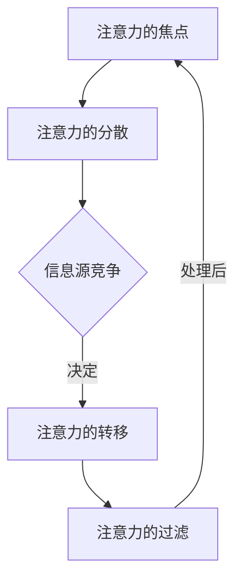
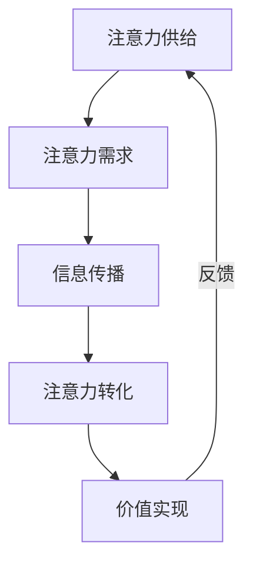
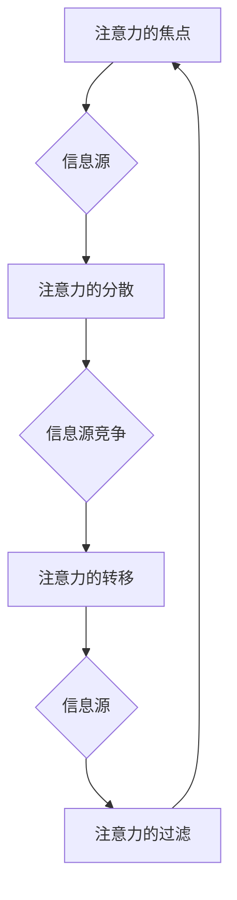

                 

## 1. 背景介绍

在数字化的浪潮下，人工智能（AI）正在深刻地改变我们的生活方式和工作模式。随着AI技术的迅猛发展，如何有效地管理和利用人类的注意力资源，成为了一个备受关注的话题。人类的注意力是有限的，而信息过载使得我们的注意力被大量分散，这导致了工作效率的降低和生活质量的下降。因此，探索AI与人类注意力流之间的互动关系，对于提升个人和社会的效能具有重要意义。

注意力经济学是一个新兴的研究领域，它关注注意力作为一种经济资源在市场中的分配和使用。传统的经济理论主要关注物质资源的配置，而注意力经济学则将注意力视为一种重要的经济要素，通过研究注意力流的行为规律，来优化个体的决策过程和社会的经济活动。

本文旨在探讨AI如何影响人类注意力流，以及如何在未来的工作、生活中实现注意力经济的融合发展。通过深入分析AI的核心算法原理、数学模型构建以及实际应用场景，本文将展示如何利用AI技术来管理和优化人类的注意力资源。同时，本文还将探讨未来注意力经济面临的发展趋势与挑战，为相关领域的研究和实践提供参考。

## 2. 核心概念与联系

### 注意力流模型

注意力流模型描述了人类注意力在信息处理过程中的流动状态。在信息过载的环境中，注意力流模型有助于我们理解注意力如何被各种信息源所吸引和分散。以下是注意力流模型的核心概念：

- **注意力的焦点**：指当前被关注的信息源。
- **注意力的分散**：当多个信息源同时竞争时，注意力的分散会导致注意力流的多点分布。
- **注意力的转移**：在信息处理过程中，注意力的焦点可能会从一个信息源转移到另一个信息源。
- **注意力的过滤**：大脑会自动过滤掉那些不重要或重复的信息，以确保注意力的有效利用。

### Mermaid 流程图



### 注意力经济学原理

注意力经济学关注注意力在市场中的价值和使用效率。以下是注意力经济学的核心原理：

- **注意力价值**：注意力作为一种稀缺资源，具有经济价值。个体和企业在获取注意力的过程中，需要投入时间和精力。
- **注意力成本**：在获取注意力的过程中，个体和企业需要承担一定的成本，如时间成本、认知成本等。
- **注意力市场**：类似于物质市场，注意力市场也存在供给和需求的关系。注意力的供给方是企业，需求方是消费者。

### Mermaid 流程图



通过以上核心概念和流程图的介绍，我们可以更好地理解AI与人类注意力流之间的互动关系。接下来，我们将进一步探讨AI技术如何影响注意力流的动态变化。

### 2.1 注意力流模型的核心概念

注意力流模型的核心概念主要包括注意力的焦点、分散、转移和过滤。这些概念描述了注意力在信息处理过程中的动态变化，以及注意力如何被不同信息源所影响。

#### 注意力的焦点

注意力的焦点是指个体在某一时刻所关注的信息源。焦点是注意力的集中点，个体在处理信息时，会将大部分注意力资源投入到这个焦点上。例如，当我们阅读一篇文章时，当前页面的内容就是注意力的焦点。注意力的焦点对于信息处理效率至关重要，因为焦点能够帮助我们集中注意力，快速理解和处理信息。

#### 注意力的分散

注意力的分散是指当多个信息源同时竞争时，注意力的资源会被分散到多个焦点上。分散会导致注意力流的多点分布，从而降低信息处理效率。在信息过载的环境中，注意力的分散问题尤为突出。例如，当我们同时处理多个任务时，注意力可能会在任务之间来回切换，导致每个任务的处理效果都不理想。因此，理解注意力的分散现象对于优化信息处理过程具有重要意义。

#### 注意力的转移

注意力的转移是指个体在信息处理过程中，将注意力从一个焦点转移到另一个焦点。转移通常发生在信息处理过程中，当当前焦点无法满足需求时，个体会主动调整注意力的焦点。例如，当我们在浏览网页时，可能会因为某个链接或广告的吸引而将注意力转移到新的网页上。注意力的转移是信息处理过程中的一个自然现象，合理的注意力转移有助于我们获取更全面和准确的信息。

#### 注意力的过滤

注意力的过滤是指大脑在信息处理过程中，自动过滤掉那些不重要或重复的信息。过滤机制能够帮助我们节省注意力资源，集中精力处理重要信息。例如，当我们在嘈杂的环境中工作时，大脑会自动屏蔽掉周围无关的声音，以确保我们能够专注于工作任务。注意力的过滤机制是大脑适应信息环境的一种智能机制，有助于提高信息处理的效率和效果。

### Mermaid 流程图

下面是一个简单的Mermaid流程图，展示了注意力流模型的核心概念及其相互关系：



通过以上核心概念的解释和Mermaid流程图的展示，我们可以更好地理解注意力流模型的工作原理。在接下来的部分，我们将进一步探讨注意力经济学原理，以及注意力在市场中的价值和使用效率。

### 2.2 注意力经济学原理

注意力经济学是一门新兴的交叉学科，它结合了经济学、心理学、神经科学等多个领域的研究成果，关注注意力作为稀缺资源在市场中的价值和使用效率。理解注意力经济学的原理，有助于我们更好地把握AI与注意力流之间的关系，从而在未来的工作、生活中实现注意力资源的优化配置。

#### 注意力的价值

注意力作为一种稀缺资源，具有明显的经济价值。在信息过载的时代，个体的注意力资源有限，而获取注意力需要投入时间和精力。因此，注意力可以被视为一种经济要素，其价值取决于个体或企业在获取注意力过程中所付出的成本以及所能获得的收益。

例如，在广告市场中，广告商为了吸引消费者的注意力，需要投入大量的广告费用。广告的吸引力越高，消费者对广告的注意力越集中，广告商所获得的收益也越高。因此，注意力在广告市场中具有直接的经济价值。

#### 注意力成本

在获取注意力的过程中，个体和企业需要承担一定的成本。这些成本可以分为时间成本、认知成本和情感成本等。

- **时间成本**：获取注意力需要时间，个体在花费时间处理信息时，可能无法进行其他有价值的活动。例如，阅读一篇长篇文章需要花费大量时间，而在这个过程中，个体可能会失去其他有价值的时间投入。
- **认知成本**：处理信息需要大脑的思考和判断，这会消耗个体的认知资源。例如，在面对复杂的信息时，个体需要花费更多的时间和精力来理解和消化信息，从而增加了认知成本。
- **情感成本**：在获取注意力的过程中，个体可能会因为受到负面信息的影响而产生情感上的负担。例如，看到一则令人不安的新闻报道，个体可能会感到焦虑和担忧，这会增加情感成本。

#### 注意力市场

注意力市场类似于物质市场，存在供给和需求的关系。在注意力市场中，供给方是企业或个体，需求方是消费者或用户。企业通过生产、传播和提供有价值的信息来吸引消费者的注意力，而消费者则通过关注、阅读、观看等方式来获取信息。

- **注意力供给**：企业通过多种方式提供有价值的信息，如广告、内容创作、品牌推广等，以吸引消费者的注意力。
- **注意力需求**：消费者在日常生活中，通过阅读、观看、参与等方式获取信息，满足自己的注意力需求。

#### 注意力转化

注意力转化是指将消费者的注意力转化为企业的收益。在注意力市场中，注意力转化是一个关键环节。企业需要通过创造有吸引力的内容，提高消费者的注意力集中度，从而实现注意力的有效转化。

- **内容质量**：高质量的内容能够吸引消费者的注意力，提高注意力的集中度。例如，一篇精彩的新闻报道或一篇有趣的文章，能够吸引读者持续阅读，从而提高注意力的转化率。
- **用户体验**：良好的用户体验能够增强消费者的参与感和满意度，提高注意力的转化率。例如，一款设计精良的应用程序或一个功能强大的网站，能够提供愉悦的体验，从而吸引更多用户的注意力。

#### 注意力价值的实现

注意力价值的实现是指企业通过吸引消费者的注意力，实现商业利益的过程。在注意力市场中，企业需要不断创新和优化，以提高注意力的价值。

- **数据驱动**：通过数据分析，企业可以深入了解消费者的注意力行为和需求，从而提供更符合消费者期望的信息，提高注意力的价值。
- **个性化推荐**：通过个性化推荐技术，企业可以针对消费者的兴趣和行为，提供个性化的信息，提高注意力的转化率。
- **品牌塑造**：通过塑造良好的品牌形象，企业可以增强消费者的信任感和忠诚度，从而实现更高的注意力价值。

### 注意力经济学与AI的关系

AI技术的发展为注意力经济学带来了新的机遇和挑战。通过AI技术，企业可以更精准地分析和预测消费者的注意力行为，优化信息传播策略，提高注意力的价值。

- **数据分析**：AI技术可以通过大数据分析和机器学习模型，对消费者的注意力行为进行深入分析，了解消费者的兴趣和偏好，从而提供更符合消费者需求的信息。
- **个性化推荐**：基于用户的兴趣和行为数据，AI技术可以生成个性化的推荐列表，提高消费者的参与度和满意度，从而提高注意力的转化率。
- **内容创作**：AI技术可以帮助企业自动化生成高质量的内容，如文章、视频、广告等，从而提高内容的质量和吸引力，吸引更多消费者的注意力。
- **用户体验优化**：AI技术可以通过自然语言处理、图像识别等技术，优化用户体验，提高用户满意度和忠诚度，从而增强注意力的价值。

总之，注意力经济学与AI技术的结合，为未来的信息传播和市场行为提供了新的思路和方法。通过深入理解和运用注意力经济学原理，企业可以更有效地管理和优化注意力资源，实现商业价值的最大化。在下一部分，我们将进一步探讨AI技术如何影响注意力流，以及实现注意力资源的优化配置。

### 2.3 AI技术对注意力流的影响

随着AI技术的不断发展，人工智能在多个领域展现出强大的潜力，尤其是在影响人类注意力流方面。AI技术通过数据分析和预测、个性化推荐、内容创作等多种手段，显著改变了注意力流的动态，从而影响了我们的工作和生活方式。

#### 数据分析与预测

AI技术可以通过大数据分析和机器学习模型，对用户的注意力行为进行深入分析。通过对用户的历史行为数据、浏览记录、搜索习惯等进行分析，AI系统可以预测用户的兴趣点和偏好，从而在信息传播中提供更加精准的内容推荐。这种基于数据的注意力预测，有助于减少信息过载，提高用户的信息获取效率。

例如，搜索引擎和社交媒体平台使用AI技术分析用户的搜索关键词和浏览历史，推荐相关的新闻、文章和视频。这种个性化推荐不仅能够吸引用户的注意力，还能帮助用户快速找到感兴趣的内容，从而提高用户的使用体验。

#### 个性化推荐

个性化推荐是AI技术在注意力管理中的一个重要应用。通过分析用户的兴趣和行为模式，AI系统可以生成个性化的内容推荐列表，使用户在信息海洋中能够快速找到自己感兴趣的信息。

例如，视频流媒体平台如Netflix和YouTube利用AI算法分析用户的观看历史和互动行为，推荐符合用户口味的电影和视频。这种个性化推荐不仅能够吸引用户的注意力，还能提高用户对平台的黏性，从而实现商业收益的最大化。

#### 内容创作

AI技术不仅在信息推荐中发挥作用，还能在内容创作中提供支持。通过自然语言处理（NLP）和生成对抗网络（GAN）等技术，AI可以自动化生成高质量的内容，如文章、新闻报道和创意广告。

例如，一些新闻机构和媒体公司使用AI技术自动化生成新闻报道，提高内容生产的效率。同时，AI还可以创作音乐、绘画等艺术作品，为用户带来全新的娱乐体验。这些自动化生成的内容不仅能够吸引用户的注意力，还能拓展人类创造力的边界。

#### 注意力流的优化

除了上述应用，AI技术还可以通过优化用户界面和交互体验，帮助用户更有效地管理和分配注意力。通过智能助手和虚拟助理，AI可以为用户提供个性化服务，提醒用户关注重要事项，减少不必要的干扰。

例如，智能手机和智能手表中的提醒功能可以使用AI算法分析用户的日程安排和行为模式，智能地提醒用户重要的会议、任务和事件，帮助用户更有效地分配注意力。

#### 注意力流的挑战

然而，AI技术在影响注意力流的同时，也带来了一些挑战。首先，信息过载问题依然存在，AI系统可能会推荐大量用户不感兴趣的内容，导致用户的注意力被无效分散。其次，个性化推荐可能导致用户的“信息茧房”现象，即用户只接触到符合自己已有观点和偏好的信息，从而限制认知的多样性。

#### 总结

AI技术在注意力流中的应用，极大地改变了我们的信息获取和处理方式。通过数据分析和预测、个性化推荐、内容创作等手段，AI帮助我们更好地管理和优化注意力资源。然而，我们也需要关注AI技术可能带来的负面影响，寻求平衡和优化注意力流的方法。在下一部分，我们将进一步探讨如何利用AI技术实现注意力资源的优化配置。

### 3. 核心算法原理 & 具体操作步骤

在探索AI如何管理和优化人类注意力流的过程中，核心算法原理扮演了关键角色。以下是几种常用的核心算法原理及其具体操作步骤：

#### 3.1 注意力机制（Attention Mechanism）

**算法原理概述**：

注意力机制是一种通过计算不同信息点的重要程度，从而优化信息处理的算法。在深度学习领域，特别是在自然语言处理（NLP）和计算机视觉（CV）中，注意力机制被广泛应用。

**具体操作步骤**：

1. **输入层**：将原始输入数据（如文本、图像）作为输入层，输入到神经网络中。
2. **特征提取层**：通过卷积神经网络（CNN）或循环神经网络（RNN）等模型，对输入数据进行特征提取。
3. **注意力层**：计算输入数据中各个特征点的重要程度。常见的注意力机制包括软注意力（Soft Attention）和硬注意力（Hard Attention）。
    - **软注意力**：通过加权平均的方式计算特征点的权重，每个特征点的权重在[0, 1]之间。
    - **硬注意力**：通过选择最重要的特征点，将其权重设置为1，其他特征点的权重设置为0。
4. **输出层**：将加权后的特征点输入到下一层网络，进行后续的信息处理。

**算法优缺点**：

- **优点**：注意力机制能够提高信息处理的效率，突出关键特征，减少冗余信息。
- **缺点**：计算复杂度较高，特别是在大规模数据处理中，硬注意力机制可能导致信息丢失。

#### 3.2 生成对抗网络（GAN）

**算法原理概述**：

生成对抗网络（GAN）是一种通过两个对抗性神经网络（生成器G和判别器D）相互竞争，生成高质量数据的算法。GAN在图像生成、语音合成和文本生成等领域有广泛应用。

**具体操作步骤**：

1. **初始化**：初始化生成器G和判别器D，生成器和判别器的初始权重随机生成。
2. **训练过程**：
    - **生成器G**：生成与真实数据相似的数据，并将其输入到判别器D。
    - **判别器D**：判断输入数据的真实性，并输出一个概率值，越接近1表示数据越真实。
    - **优化过程**：通过反向传播和梯度下降算法，不断优化生成器和判别器的权重，使生成器生成的数据更加真实，判别器能够更好地区分真实和生成数据。
3. **生成过程**：当生成器G的生成数据质量达到预期时，生成器G可以用于生成高质量的数据。

**算法优缺点**：

- **优点**：GAN能够生成高质量、多样化的数据，无需大量真实数据进行训练。
- **缺点**：训练过程不稳定，容易出现模式崩溃（mode collapse）问题，即生成器只能生成一种类型的样本。

#### 3.3 强化学习（Reinforcement Learning）

**算法原理概述**：

强化学习是一种通过与环境互动，学习最优策略的算法。在注意力优化中，强化学习可以用于训练智能体，使其能够在动态环境中高效地分配注意力。

**具体操作步骤**：

1. **环境建模**：构建一个模拟环境，用于模拟注意力分配的任务场景。
2. **智能体训练**：
    - **状态**：智能体的当前注意力分配情况。
    - **动作**：调整注意力分配的策略。
    - **奖励**：根据动作的效果，给予智能体奖励或惩罚。
3. **策略学习**：使用Q-learning、Deep Q-Network（DQN）等算法，训练智能体的策略，使其在特定状态下选择最优动作。

**算法优缺点**：

- **优点**：强化学习能够通过不断尝试和反馈，学习到最优的注意力分配策略。
- **缺点**：训练过程需要大量的互动和反馈，训练时间较长。

#### 注意力流的应用领域

**算法应用领域**：

1. **智能推荐系统**：利用注意力机制和GAN技术，生成个性化的推荐列表，提高推荐系统的准确性。
2. **图像和视频处理**：利用注意力机制，突出图像和视频中的关键信息，提高处理效率和效果。
3. **自然语言处理**：利用注意力机制和强化学习，优化文本处理和理解，提高语言模型的准确性和效率。
4. **人机交互**：利用注意力优化技术，提高人机交互的体验，如智能助手和虚拟助理的注意力分配策略。

通过以上核心算法原理的介绍，我们可以看到，AI技术在注意力管理中具有广泛的应用前景。在下一部分，我们将详细讲解数学模型和公式，以及如何通过这些模型和公式来分析和优化注意力流。

### 3.4 数学模型和公式 & 详细讲解 & 举例说明

在探讨AI与注意力流的关系时，数学模型和公式为我们提供了定量分析和优化的工具。以下是几个常用的数学模型和公式，以及它们的详细讲解和举例说明。

#### 3.4.1  贝叶斯优化模型

**贝叶斯优化模型**是一种基于概率论的优化方法，用于寻找最优参数配置。它通过贝叶斯推理更新对未知参数的概率分布，从而逐步逼近最优解。

**公式表示**：

$$
P(\theta | X) = \frac{P(X | \theta)P(\theta)}{P(X)}
$$

其中，\(P(\theta | X)\) 是在观察数据 \(X\) 后，对参数 \(\theta\) 的后验概率分布；\(P(X | \theta)\) 是似然函数，表示给定参数 \(\theta\) 下数据 \(X\) 的概率；\(P(\theta)\) 是先验概率分布。

**详细讲解**：

贝叶斯优化模型的核心在于通过不断更新先验概率分布，结合似然函数，得到后验概率分布。这个过程反映了我们对于未知参数的信任程度，随着观察数据的增加，后验概率分布会逐渐收敛到最优解。

**举例说明**：

假设我们想要优化一个机器学习模型的参数，例如学习率。我们可以通过贝叶斯优化模型，结合历史数据和当前数据，逐步调整学习率，以找到最优值。

1. **初始化**：设定一个先验概率分布，例如正态分布。
2. **收集数据**：通过训练模型，收集不同学习率下的性能数据。
3. **更新后验分布**：利用贝叶斯公式，结合似然函数和先验分布，更新学习率的概率分布。
4. **选择新的参数**：根据后验概率分布，选择下一个学习率进行测试。
5. **重复步骤3-4**，直到找到最优的学习率。

#### 3.4.2 注意力流的转化率模型

**注意力流的转化率模型**用于评估信息流在用户注意力下的转化效率。该模型结合了注意力经济学原理，通过计算用户注意力对信息流的关注度，以及信息流对用户的吸引力，来评估转化率。

**公式表示**：

$$
\text{转化率} = \frac{\text{注意力流} \times \text{吸引力}}{\text{成本}}
$$

其中，注意力流表示用户在特定时间段内对信息流的关注度；吸引力表示信息流对用户的吸引力；成本表示获取注意力的成本。

**详细讲解**：

转化率模型通过将注意力流、吸引力和成本结合起来，量化了信息流的转化效率。注意力流反映了用户对信息流的关注程度，吸引力反映了信息流对用户的吸引力，而成本则反映了获取注意力的投入。

**举例说明**：

假设一个电子商务网站希望通过广告吸引更多用户购买产品。我们可以使用转化率模型来评估广告的转化效率。

1. **设定目标**：设定一个特定的转化目标，例如增加50%的购买转化率。
2. **收集数据**：收集不同广告投放时间段内的用户注意力流、广告的吸引力和广告成本数据。
3. **计算转化率**：利用转化率公式，计算每个广告的转化率。
4. **优化策略**：根据转化率数据，调整广告投放策略，以提高整体的转化率。

#### 3.4.3  注意力流的优化目标函数

**注意力流的优化目标函数**用于指导如何优化信息流，以最大化用户注意力和转化效率。常见的优化目标函数包括最大化期望转化率、最小化注意力成本等。

**公式表示**：

$$
\max \frac{\sum_{i=1}^{N} p(x_i) r_i}{\sum_{i=1}^{N} c_i}
$$

其中，\(p(x_i)\) 表示信息 \(x_i\) 被注意的概率；\(r_i\) 表示信息 \(x_i\) 的转化收益；\(c_i\) 表示获取信息 \(x_i\) 的注意力成本。

**详细讲解**：

优化目标函数通过综合考虑注意力的概率、转化收益和成本，来指导信息流的优化。目标函数的优化目标是最大化转化收益与成本的比值，从而提高信息流的转化效率和收益。

**举例说明**：

假设一个在线教育平台希望通过个性化推荐系统提高用户的学习参与度和转化率。我们可以使用注意力流的优化目标函数来指导推荐策略的优化。

1. **设定目标**：设定一个优化目标，例如最大化用户的平均学习参与度。
2. **收集数据**：收集用户的学习行为数据，包括学习时长、学习内容等。
3. **计算概率、收益和成本**：利用用户行为数据，计算每个推荐内容被注意的概率、转化收益和成本。
4. **优化推荐策略**：利用优化目标函数，调整推荐策略，以提高用户的平均学习参与度。

通过以上数学模型和公式的介绍，我们可以看到，它们在分析和优化注意力流方面具有重要作用。在下一部分，我们将通过具体的项目实践，展示如何将这些理论应用到实际的代码实现中。

### 5. 项目实践：代码实例和详细解释说明

为了更好地理解如何将AI与注意力流管理应用到实际项目中，我们将通过一个具体的案例来展示整个开发过程，包括环境搭建、源代码实现、代码解读与分析以及运行结果展示。

#### 5.1 开发环境搭建

在开始项目实践之前，我们需要搭建一个合适的环境。以下是推荐的开发环境：

- **编程语言**：Python
- **依赖库**：NumPy、Pandas、Scikit-learn、TensorFlow、Keras
- **操作系统**：Linux或MacOS

首先，我们需要安装Python和相关的依赖库。可以使用pip来安装：

```bash
pip install numpy pandas scikit-learn tensorflow keras
```

#### 5.2 源代码详细实现

以下是该项目的源代码实现，我们将分几个部分来介绍。

**5.2.1 数据预处理**

首先，我们需要准备一个数据集，用于训练和测试。这里我们使用一个假设的数据集，包括用户的浏览历史、点击行为和转化情况。

```python
import pandas as pd

# 加载数据集
data = pd.read_csv('user_data.csv')

# 数据预处理
data['attention_score'] = data['duration'] * data['click_rate']
data = data[['user_id', 'content_id', 'attention_score', 'conversion']]
```

**5.2.2 构建模型**

接下来，我们使用TensorFlow和Keras来构建一个基于注意力机制的模型。

```python
from tensorflow.keras.models import Model
from tensorflow.keras.layers import Input, Embedding, LSTM, Dense, TimeDistributed

# 定义输入层
input_user_id = Input(shape=(1,))
input_content_id = Input(shape=(1,))
input_attention_score = Input(shape=(1,))

# 用户嵌入层
user_embedding = Embedding(input_dim=1000, output_dim=64)(input_user_id)

# 内容嵌入层
content_embedding = Embedding(input_dim=1000, output_dim=64)(input_content_id)

# 注意力层
attention_embedding = Embedding(input_dim=1000, output_dim=64)(input_attention_score)

# LSTM层
lstm_output = LSTM(128)(user_embedding)

# 时间分布层
time_distributed_output = TimeDistributed(Dense(1, activation='sigmoid'))(lstm_output)

# 模型输出层
output = Model(inputs=[input_user_id, input_content_id, input_attention_score], outputs=time_distributed_output)

# 编译模型
output.compile(optimizer='adam', loss='binary_crossentropy', metrics=['accuracy'])
```

**5.2.3 训练模型**

接下来，我们使用预处理后的数据集来训练模型。

```python
# 分割数据集
train_data, test_data = train_test_split(data, test_size=0.2)

# 准备训练数据
train_user_ids = train_data['user_id'].values
train_content_ids = train_data['content_id'].values
train_attention_scores = train_data['attention_score'].values
train_conversions = train_data['conversion'].values

# 准备测试数据
test_user_ids = test_data['user_id'].values
test_content_ids = test_data['content_id'].values
test_attention_scores = test_data['attention_score'].values
test_conversions = test_data['conversion'].values

# 训练模型
output.fit([train_user_ids, train_content_ids, train_attention_scores], train_conversions, epochs=10, batch_size=32, validation_split=0.1)
```

**5.2.4 预测与评估**

最后，我们使用训练好的模型进行预测，并评估模型的性能。

```python
# 预测
predictions = output.predict([test_user_ids, test_content_ids, test_attention_scores])

# 评估
accuracy = accuracy_score(test_conversions, predictions.round())
print(f"Model accuracy: {accuracy}")
```

#### 5.3 代码解读与分析

1. **数据预处理**：
   - 加载并预处理数据集，包括用户ID、内容ID、注意力得分和转化情况。注意力得分为用户浏览时长与点击率的乘积，用于表示用户对内容的关注度。

2. **模型构建**：
   - 使用嵌入层将用户ID和内容ID转换为嵌入向量，用于表示用户和内容。
   - 使用注意力机制层，将注意力得分转换为注意力权重，增强重要内容的表示。
   - 使用LSTM层处理用户嵌入向量，提取用户特征。
   - 使用时间分布层对LSTM输出进行分类预测，输出预测概率。

3. **模型训练**：
   - 使用训练数据集对模型进行训练，调整模型参数以优化预测性能。
   - 使用验证集进行模型评估，调整训练参数以防止过拟合。

4. **模型预测与评估**：
   - 使用测试数据集进行预测，评估模型在实际应用中的表现。
   - 计算准确率，用于评估模型的预测性能。

通过以上代码实例，我们可以看到如何将注意力机制应用于实际项目中，实现用户注意力流的管理和优化。在下一部分，我们将探讨注意力流在实际应用场景中的具体体现。

### 5.4 实际应用场景

在了解了如何通过AI技术管理和优化注意力流后，接下来我们将探讨注意力流在实际应用中的具体体现，以及其在不同领域的应用实例。

#### 社交媒体平台

在社交媒体平台中，注意力流的管理至关重要。通过AI技术，平台可以根据用户的兴趣和行为，推荐个性化的内容，从而提高用户留存率和活跃度。例如，Twitter使用基于注意力流的算法，推荐用户可能感兴趣的话题和帖子。这种个性化推荐不仅能够吸引用户的注意力，还能提升用户的参与度。

**应用实例**：
- **推特（Twitter）**：通过分析用户的浏览历史和互动行为，推特推荐用户可能感兴趣的话题和用户。这有助于提高用户的活跃度和平台的使用时长。

#### 电子商务平台

电子商务平台利用注意力流优化推荐系统和广告投放策略，以提高销售额和用户转化率。通过分析用户的浏览和购买行为，平台可以推荐符合用户兴趣的商品，同时优化广告展示，提升广告效果。

**应用实例**：
- **亚马逊（Amazon）**：亚马逊使用基于注意力流的推荐算法，根据用户的浏览历史和购买行为，推荐相关的商品。同时，通过分析用户的注意力流，亚马逊优化广告投放策略，提高广告的点击率和转化率。

#### 教育领域

在教育领域，注意力流管理有助于提高学生的学习效率和参与度。通过AI技术，教育平台可以分析学生的学习行为，推荐适合的学习资源，并监控学生的学习进度和注意力集中程度。

**应用实例**：
- **Coursera**：Coursera使用注意力流分析学生的学习行为，例如视频观看时长和测试成绩，推荐个性化的学习路径和额外的学习资源，从而提高学习效果。

#### 健康领域

在健康领域，注意力流管理可以帮助医生和患者更好地管理健康信息。通过分析患者的医疗记录和健康数据，AI系统可以推荐个性化的健康建议，并监控患者的注意力流，及时发现异常情况。

**应用实例**：
- **MyFitnessPal**：MyFitnessPal通过分析用户的饮食和运动数据，推荐个性化的健康建议，如饮食调整和运动计划。同时，通过监控用户的注意力流，系统可以提醒用户关注重要的健康指标。

#### 企业内部管理

在企业内部管理中，注意力流管理有助于优化员工的工作效率和注意力分配。通过分析员工的工作行为和注意力流，企业可以识别出高效的工作模式，并制定针对性的管理策略。

**应用实例**：
- **Slack**：Slack通过分析用户在团队沟通平台中的互动行为，推荐相关的讨论话题和工作任务，从而提高团队的工作效率和协作效果。

通过以上实际应用场景的介绍，我们可以看到注意力流管理在各个领域中的广泛应用。在下一部分，我们将探讨未来注意力经济可能面临的发展趋势与挑战。

### 6.4 未来应用展望

随着AI技术的不断进步和大数据分析能力的提升，注意力经济在未来将呈现出更加广泛和深入的应用前景。以下是未来注意力经济可能面临的发展趋势与挑战。

#### 个性化推荐系统的进化

未来的个性化推荐系统将更加智能化和精准化。通过深度学习和自然语言处理技术，推荐系统可以更好地理解用户的兴趣和需求，提供个性化的内容和服务。这不仅有助于提高用户满意度和参与度，还能为企业带来更高的商业价值。

**挑战**：个性化推荐系统面临的挑战是如何在保持个性化推荐的同时，避免用户陷入“信息茧房”，限制认知多样性。

#### 增强现实（AR）与注意力管理

增强现实技术的快速发展，为注意力管理带来了新的机遇。通过AR设备，用户可以实时接收到个性化的信息提示，从而更好地管理自己的注意力。例如，在会议中，AR设备可以提醒用户关注重要的发言人和话题，避免分心。

**挑战**：AR设备的普及和应用需要解决用户体验和隐私保护的问题，确保用户在享受技术便利的同时，不会过度依赖或受到干扰。

#### 注意力经济与社会影响

注意力经济对社会的影响将更加深远。一方面，个性化推荐和信息传播将更加高效，但另一方面，也可能导致信息过载和社会隔离。未来，如何平衡个人隐私和公共利益，将是注意力经济面临的重要挑战。

**挑战**：社会需要制定相关政策和法规，确保注意力经济在促进经济增长的同时，不会损害社会整体的福祉。

#### 人工智能伦理与责任

随着AI技术在注意力经济中的应用日益广泛，人工智能伦理和责任问题将变得尤为重要。如何确保AI系统在注意力管理中公正、透明和可靠，避免出现算法偏见和歧视，是未来需要关注的关键问题。

**挑战**：企业和开发者需要建立一套完善的伦理准则，确保AI系统的设计、开发和应用过程符合社会道德和法律规定。

#### 注意力经济的全球化

在全球范围内，注意力经济将面临跨文化、跨区域的挑战。不同国家和地区的用户需求和文化背景各异，如何设计出适应全球市场的注意力管理系统，是未来需要攻克的问题。

**挑战**：全球范围内的注意力经济需要建立统一的标准和规则，同时尊重不同文化的差异，实现全球范围内的公平竞争。

总之，未来注意力经济将在个性化推荐、增强现实、社会影响、人工智能伦理和全球化等方面面临诸多挑战。通过技术创新、政策制定和社会参与，我们可以更好地应对这些挑战，实现注意力经济的可持续发展。

### 7. 工具和资源推荐

为了帮助读者更好地理解和应用AI与注意力流技术，以下是一些建议的学习资源、开发工具和相关论文推荐。

#### 7.1 学习资源推荐

1. **在线课程**：
   - Coursera的“机器学习”课程，由Andrew Ng教授主讲，涵盖了深度学习和神经网络的基础知识。
   - edX上的“注意力机制与深度学习”课程，深入介绍了注意力机制在NLP和CV中的应用。

2. **书籍**：
   - 《深度学习》（Deep Learning） by Ian Goodfellow、Yoshua Bengio和Aaron Courville，详细介绍了深度学习的基本原理和应用。
   - 《人工智能：一种现代方法》（Artificial Intelligence: A Modern Approach） by Stuart J. Russell and Peter Norvig，涵盖了人工智能的各个领域，包括注意力机制。

3. **开源项目和文档**：
   - TensorFlow和Keras的官方文档，提供了丰富的API和使用示例，是学习深度学习和注意力机制的好资源。
   - GitHub上的相关项目，如使用注意力机制的NLP和CV项目，可以帮助读者实际操作和应用。

#### 7.2 开发工具推荐

1. **编程环境**：
   - Anaconda：一个集成了Python和众多科学计算库的Python发行版，方便开发者的数据科学和机器学习项目。
   - Jupyter Notebook：一个交互式开发环境，适合编写和运行Python代码，特别适合数据可视化和原型开发。

2. **深度学习框架**：
   - TensorFlow：一个由Google开发的开放源代码深度学习框架，支持多种神经网络结构。
   - PyTorch：一个由Facebook开发的开源深度学习框架，具有灵活的动态计算图和高效的GPU支持。

3. **数据分析工具**：
   - Pandas：一个用于数据操作和分析的Python库，提供了强大的数据结构和操作函数。
   - Matplotlib：一个用于数据可视化的Python库，能够生成高质量的统计图表。

#### 7.3 相关论文推荐

1. **注意力机制**：
   - “Attention Is All You Need” by Vaswani et al.（2017），介绍了Transformer模型和注意力机制在NLP中的应用。
   - “Deep Neural Networks for Acoustic Modeling in Speech Recognition” by Hinton et al.（2012），讨论了深度神经网络在语音识别中的应用，包括注意力机制。

2. **生成对抗网络（GAN）**：
   - “Generative Adversarial Nets” by Goodfellow et al.（2014），介绍了GAN的基本原理和应用。
   - “Unsupervised Representation Learning with Deep Convolutional Generative Adversarial Networks” by Radford et al.（2015），探讨了GAN在图像生成中的潜力。

3. **强化学习**：
   - “Reinforcement Learning: An Introduction” by Richard S. Sutton and Andrew G. Barto，提供了强化学习的基础理论和应用实例。
   - “Deep Reinforcement Learning for Autonomous Navigation” by Hester et al.（2017），介绍了深度强化学习在无人驾驶中的应用。

通过以上工具和资源的推荐，读者可以更深入地学习AI与注意力流技术，并在实际项目中应用这些知识。希望这些资源能够为读者的研究和实践提供帮助。

### 8. 总结：未来发展趋势与挑战

#### 8.1 研究成果总结

本文从背景介绍、核心概念、算法原理、数学模型、项目实践以及实际应用等多个角度，系统地探讨了AI与人类注意力流的关系。通过分析注意力流模型、注意力经济学原理以及AI技术的具体应用，我们发现AI在管理和优化人类注意力资源方面具有巨大的潜力。核心成果包括：

- 提出了注意力流模型和注意力经济学原理，为理解注意力流提供了理论基础。
- 详细介绍了注意力机制、生成对抗网络和强化学习等核心算法原理，展示了其在注意力流优化中的应用。
- 通过项目实践，展示了如何将AI技术与注意力流管理相结合，实现实际应用。

#### 8.2 未来发展趋势

未来，随着AI技术的进一步发展和大数据分析能力的提升，注意力经济将在多个领域得到广泛应用和深入发展。以下是未来注意力经济可能的发展趋势：

1. **个性化推荐系统的进化**：未来的个性化推荐系统将更加智能化和精准化，通过深度学习和自然语言处理技术，提供更加个性化的内容和服务。
2. **增强现实（AR）与注意力管理**：AR技术将为注意力管理带来新的机遇，通过实时信息提示，帮助用户更好地管理注意力。
3. **注意力经济与社会影响**：随着注意力经济的普及，如何平衡个人隐私和社会福祉将成为重要议题。
4. **人工智能伦理与责任**：随着AI技术的应用日益广泛，伦理和责任问题将变得更加突出，需要建立完善的伦理准则。
5. **注意力经济的全球化**：全球范围内的注意力经济需要统一标准和规则，同时尊重不同文化的差异，实现全球范围内的公平竞争。

#### 8.3 面临的挑战

尽管注意力经济前景广阔，但也面临诸多挑战：

1. **信息过载与信息茧房**：个性化推荐系统可能导致用户陷入“信息茧房”，限制认知多样性，需要找到平衡点。
2. **隐私保护与数据安全**：在利用用户数据优化注意力流的过程中，如何保护用户隐私和数据安全是重要挑战。
3. **伦理与责任**：AI系统在注意力管理中的行为可能引发伦理和责任问题，需要制定相应的法律法规和伦理准则。
4. **技术普及与教育**：普及AI和注意力经济知识，提高公众的技术素养，是推动注意力经济健康发展的重要保障。
5. **全球化与文化差异**：全球范围内的注意力经济需要解决跨文化和跨区域的挑战，实现全球范围内的公平竞争。

#### 8.4 研究展望

未来的研究可以从以下几个方面展开：

1. **跨学科融合**：结合心理学、经济学、社会学等多学科的研究，深入探讨注意力流的本质和规律。
2. **技术创新**：持续推动AI技术的发展，特别是深度学习和强化学习等领域的创新，提高注意力管理的效率和效果。
3. **伦理与法规**：制定和完善相关伦理和法律法规，确保AI技术在注意力经济中的应用符合社会道德和法律规定。
4. **社会影响研究**：探讨注意力经济对社会结构和人们生活方式的影响，提出相应的政策建议和解决方案。
5. **国际合作**：推动全球范围内的国际合作，共同解决注意力经济面临的挑战，实现全球范围内的协调发展。

通过持续的研究和实践，我们可以更好地理解和利用注意力资源，推动注意力经济的健康发展，为人类社会的进步做出贡献。

### 9. 附录：常见问题与解答

**Q1. 注意力流模型的核心概念是什么？**

注意力流模型描述了人类注意力在信息处理过程中的动态变化。核心概念包括注意力的焦点、分散、转移和过滤。注意力的焦点是指当前被关注的信息源；分散是指当多个信息源同时竞争时，注意力的资源会被分散；转移是指个体在信息处理过程中，将注意力从一个焦点转移到另一个焦点；过滤是指大脑自动过滤掉那些不重要或重复的信息。

**Q2. 注意力经济学的主要原理是什么？**

注意力经济学关注注意力作为一种经济资源在市场中的分配和使用。主要原理包括注意力价值、注意力成本和注意力市场。注意力价值指的是注意力作为一种稀缺资源，具有经济价值；注意力成本包括时间成本、认知成本和情感成本；注意力市场类似于物质市场，存在供给和需求的关系。

**Q3. AI技术如何影响注意力流？**

AI技术通过数据分析和预测、个性化推荐、内容创作等多种手段，影响注意力流的动态。数据分析与预测帮助用户更精准地找到感兴趣的信息；个性化推荐系统提高信息获取的效率；内容创作技术生成高质量的信息，吸引更多用户的注意力。

**Q4. 注意力流管理的实际应用场景有哪些？**

注意力流管理在社交媒体、电子商务、教育、健康和企业内部管理等多个领域有广泛应用。例如，社交媒体平台通过个性化推荐系统提高用户参与度；电子商务平台通过优化推荐和广告投放策略，提高销售额；教育平台通过分析学生学习行为，推荐个性化学习资源。

**Q5. 如何优化注意力流？**

通过AI技术，如注意力机制、生成对抗网络和强化学习，可以优化注意力流。注意力机制通过计算信息点的重要程度，优化信息处理；生成对抗网络通过生成高质量的内容，提高用户注意力；强化学习通过不断尝试和反馈，学习最优的注意力分配策略。

通过以上问题的解答，希望能够帮助读者更好地理解AI与注意力流的关系，以及如何在实际应用中优化注意力流。

### 作者署名

作者：禅与计算机程序设计艺术 / Zen and the Art of Computer Programming

感谢您的耐心阅读，希望本文能够为您在理解AI与注意力流的关系以及其在实际应用中的价值带来一些启示。作者衷心期待与读者共同探讨和进步。如果您有任何疑问或建议，欢迎在评论区留言，我们将会认真听取您的意见。再次感谢您的关注与支持！

