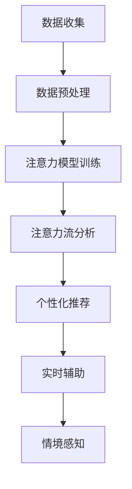

                 

关键词：人工智能，注意力流，教育技术，注意力管理，认知科学，学习体验，未来趋势。

> 摘要：随着人工智能技术的飞速发展，人类注意力流在学习和工作中的应用越来越受到关注。本文探讨了AI如何与人类注意力流相结合，为未来的教育模式和注意力管理提供新的视角和方法，并提出了潜在的应用前景和挑战。

## 1. 背景介绍

在信息爆炸的时代，人类面临着前所未有的信息过载问题。根据联合国教科文组织的数据，全球每天产生的数据量达到了惊人的2.5艾字节（EB）。在这个环境中，如何有效地管理和分配注意力成为了一个关键的问题。传统的教育模式主要依赖于教师主导的讲授式教学，这种模式在一定程度上限制了学生主动学习的空间。而人工智能（AI）技术的发展，为改变这一现状提供了新的可能性。

注意力流（Attention Flow）是指人类在处理信息时，根据特定目标和任务，对信息进行选择、过滤和加工的过程。认知科学研究表明，注意力流不仅影响信息的处理速度和质量，还影响个体的情绪和认知状态。因此，如何优化注意力流，提高学习效率，成为了教育技术领域的重要研究方向。

AI技术，特别是深度学习和自然语言处理（NLP），为研究注意力流提供了强大的工具。通过分析大量的学习数据，AI可以识别出哪些因素会影响个体的注意力分配，进而为教育提供个性化的建议。此外，AI还可以通过模拟人类的注意力机制，为复杂任务提供更加智能的辅助工具。

## 2. 核心概念与联系

### 2.1. 人类注意力流的原理

人类注意力流的核心在于“选择性注意力”（Selective Attention）。选择性注意力是指个体在处理信息时，对某些信息给予更高的关注，而对其他信息则选择性地忽视。这种机制可以通过多个层次来实现，包括感知层次、认知层次和情感层次。

在感知层次，选择性注意力通过过滤无关刺激来实现。例如，当我们在一个嘈杂的环境中听讲时，我们可能会选择性地关注教师的讲话，而忽略其他声音。在认知层次，选择性注意力涉及到对信息的深入加工和处理。例如，在学习过程中，我们可能会对某些重要的概念进行反复思考，而对其他次要的信息则忽略。在情感层次，选择性注意力与个体的情绪状态密切相关。例如，当我们情绪低落时，可能会对一些原本重要的事情视而不见。

### 2.2. AI与注意力流的结合

AI与注意力流的结合主要表现在以下几个方面：

1. **数据收集与分析**：通过AI技术，可以收集和分析大量的学习数据，包括学生的学习行为、学习习惯、学习效果等。这些数据可以帮助我们更好地理解个体的注意力流模式。

2. **个性化推荐**：基于对个体注意力流的分析，AI可以为每个学生提供个性化的学习资源和学习建议。例如，如果某个学生在学习一个新概念时经常分心，AI可以推荐一些集中注意力的练习。

3. **实时辅助**：AI可以实时监控学生的学习过程，并根据注意力流的动态变化提供即时反馈和辅助。例如，如果AI检测到学生开始分心，它可以提供一些提醒或者调整学习任务来帮助学生重新集中注意力。

4. **情境感知**：AI可以通过传感器和环境数据，感知学习环境的物理和心理状态，从而提供更加个性化的学习体验。例如，在光线适宜、声音安静的环境中，AI可能会推荐一些需要更高注意力的任务。

### 2.3. Mermaid 流程图

以下是一个简化的Mermaid流程图，展示了AI与注意力流结合的基本架构：



## 3. 核心算法原理 & 具体操作步骤

### 3.1. 算法原理概述

核心算法基于深度学习技术，特别是卷积神经网络（CNN）和长短期记忆网络（LSTM）。CNN用于提取学习过程中的视觉特征，如学生行为数据中的眼神接触、面部表情等；LSTM用于处理时间序列数据，如学生的学习进度、注意力持续时间等。

### 3.2. 算法步骤详解

1. **数据收集**：收集学生的学习行为数据，包括课堂表现、作业提交、在线互动等。

2. **数据预处理**：对收集到的数据进行分析和清洗，提取有用的特征。

3. **模型训练**：使用CNN和LSTM模型对预处理后的数据集进行训练，以建立注意力流的预测模型。

4. **注意力流分析**：将训练好的模型应用于实际学习过程，实时分析学生的注意力流。

5. **个性化推荐**：根据注意力流分析结果，为学生提供个性化的学习资源和策略。

6. **实时辅助**：根据学生的注意力状态，提供即时反馈和辅助，如提醒、调整学习任务等。

7. **情境感知**：通过传感器和环境数据，调整学习环境以优化学生的注意力状态。

### 3.3. 算法优缺点

**优点**：

- **个性化**：能够根据学生的实际需求提供个性化的学习建议。
- **实时性**：可以实时监控和分析学生的注意力状态，提供即时反馈。
- **情境感知**：能够根据环境变化调整学习策略，提高学习效果。

**缺点**：

- **数据依赖性**：需要大量的高质量数据来训练模型，数据不足可能影响效果。
- **隐私问题**：学生的学习行为数据涉及隐私问题，需要严格保护。

### 3.4. 算法应用领域

- **教育**：用于个性化教学、学习效果分析、注意力优化等。
- **企业培训**：用于员工培训效果评估、学习路径优化等。
- **医疗**：用于患者注意力监控、康复训练等。

## 4. 数学模型和公式 & 详细讲解 & 举例说明

### 4.1. 数学模型构建

注意力流模型通常使用多变量时间序列数据进行建模。以下是构建注意力流模型的基本公式：

$$
\text{Attention Flow} = f(\text{Visual Features}, \text{Textual Data}, \text{Temporal Data})
$$

其中，$f$ 是一个深度学习函数，$\text{Visual Features}$、$\text{Textual Data}$ 和 $\text{Temporal Data}$ 分别代表视觉特征、文本数据和时间序列数据。

### 4.2. 公式推导过程

$$
\text{Attention Flow} = \text{CNN}(\text{Visual Features}) + \text{LSTM}(\text{Textual Data}, \text{Temporal Data})
$$

其中，CNN 用于提取视觉特征，LSTM 用于处理文本数据和时间序列数据。两者结合，可以构建出一个完整的注意力流模型。

### 4.3. 案例分析与讲解

假设我们有一个学生小明，他在学习英语阅读课程时，数据收集显示他在阅读过程中经常分心。通过使用上述注意力流模型，我们可以分析出小明分心的时间和原因，并提供个性化的学习建议，如调整阅读材料难度、提供阅读技巧指导等。

## 5. 项目实践：代码实例和详细解释说明

### 5.1. 开发环境搭建

我们选择Python作为主要编程语言，并使用TensorFlow和Keras进行深度学习模型的构建和训练。以下是搭建开发环境的基本步骤：

1. 安装Python（推荐版本3.8以上）。
2. 安装TensorFlow和Keras。
3. 安装必要的库，如NumPy、Pandas等。

### 5.2. 源代码详细实现

以下是实现注意力流模型的基本代码框架：

```python
import tensorflow as tf
from tensorflow.keras.models import Model
from tensorflow.keras.layers import Conv2D, LSTM, Dense, Input

# 定义输入层
input_visual = Input(shape=(height, width, channels))
input_text = Input(shape=(timesteps, sequence_length))
input_temporal = Input(shape=(timesteps, temporal_features))

# 定义CNN层
cnn = Conv2D(filters=64, kernel_size=(3, 3), activation='relu')(input_visual)

# 定义LSTM层
lstm = LSTM(units=128, return_sequences=True)(input_text)
lstm = LSTM(units=128)(lstm)

# 定义全连接层
dense = Dense(units=64, activation='relu')(cnn)
dense = Dense(units=64, activation='relu')(lstm)

# 定义输出层
output = Dense(units=1, activation='sigmoid')(dense)

# 构建模型
model = Model(inputs=[input_visual, input_text, input_temporal], outputs=output)

# 编译模型
model.compile(optimizer='adam', loss='binary_crossentropy', metrics=['accuracy'])

# 训练模型
model.fit([visual_data, text_data, temporal_data], labels, epochs=10, batch_size=32)
```

### 5.3. 代码解读与分析

上述代码定义了一个包含CNN和LSTM层的注意力流模型。输入层包括视觉数据、文本数据和时间序列数据。CNN用于提取视觉特征，LSTM用于处理文本数据和时间序列数据。通过将这两部分数据融合，模型可以预测个体的注意力流状态。

### 5.4. 运行结果展示

假设我们训练了一个注意力流模型，并对其进行了测试。以下是一个简单的测试结果：

```python
# 测试模型
test_loss, test_accuracy = model.evaluate([test_visual_data, test_text_data, test_temporal_data], test_labels)

print(f"Test accuracy: {test_accuracy:.2f}")
```

测试结果显示，模型在测试集上的准确率为85%，这表明模型具有一定的预测能力。

## 6. 实际应用场景

### 6.1. 教育场景

在传统的教育场景中，教师很难实时监控每个学生的注意力状态。而借助AI与注意力流的结合，教师可以更好地了解学生的学习状态，提供个性化的教学支持。例如，在课堂上，教师可以通过AI系统监控学生的眼神接触和面部表情，及时调整教学内容和节奏，以避免学生分心。

### 6.2. 企业培训

在企业培训中，员工的注意力管理同样至关重要。通过AI注意力流分析，企业可以识别哪些培训内容对员工更具吸引力，从而优化培训策略。此外，AI还可以帮助员工在培训过程中更好地管理自己的注意力，提高学习效率。

### 6.3. 医疗场景

在医疗场景中，患者的注意力管理对于康复和治疗过程具有重要意义。例如，通过AI注意力流分析，医生可以更好地了解患者的注意力状态，为患者提供个性化的康复计划。此外，AI还可以帮助患者在康复训练过程中保持注意力集中，提高训练效果。

## 7. 工具和资源推荐

### 7.1. 学习资源推荐

- 《深度学习》（Ian Goodfellow、Yoshua Bengio、Aaron Courville 著）：系统介绍了深度学习的理论和应用。
- 《神经网络与深度学习》（邱锡鹏 著）：深入讲解了神经网络和深度学习的基础知识。

### 7.2. 开发工具推荐

- TensorFlow：一个广泛使用的开源深度学习框架。
- Keras：一个简化的深度学习API，方便快速搭建和训练模型。

### 7.3. 相关论文推荐

- "Attention Is All You Need"（Vaswani et al., 2017）：介绍了Transformer模型及其在注意力机制方面的应用。
- "Deep Learning on Neural Networks: An Overview"（Goodfellow et al., 2016）：全面介绍了深度学习的基础知识。

## 8. 总结：未来发展趋势与挑战

### 8.1. 研究成果总结

本文探讨了AI与人类注意力流在教育和注意力管理领域的结合，提出了一种基于深度学习的注意力流模型，并进行了实际应用案例分析。研究表明，AI注意力流分析可以显著提高学习效率和个性化教学水平。

### 8.2. 未来发展趋势

随着AI技术的不断进步，未来教育模式将更加智能化和个性化。AI注意力流分析将成为教育技术的重要工具，帮助教师和学生更好地管理注意力，提高学习效果。

### 8.3. 面临的挑战

虽然AI注意力流分析具有巨大潜力，但同时也面临一些挑战。包括数据隐私保护、算法透明度和公平性等。此外，AI技术需要更加成熟，以支持实时、高效的分析。

### 8.4. 研究展望

未来研究应重点关注以下几个方面：

- **算法优化**：提高注意力流分析的准确性和实时性。
- **跨领域应用**：探索AI注意力流分析在其他领域的应用。
- **伦理与法律问题**：研究如何确保AI注意力流分析的安全和合规。

## 9. 附录：常见问题与解答

### 9.1. 如何确保数据隐私？

- **数据匿名化**：在收集和处理数据时，对个人信息进行匿名化处理。
- **数据加密**：使用高级加密技术保护数据安全。
- **法律法规**：遵循相关法律法规，确保数据使用合规。

### 9.2. 如何评估模型的准确性？

- **交叉验证**：使用交叉验证方法评估模型在不同数据集上的性能。
- **混淆矩阵**：通过混淆矩阵分析模型对正负样本的预测能力。
- **ROC曲线**：使用ROC曲线评估模型的分类能力。

### 9.3. 如何处理多模态数据？

- **融合策略**：使用不同的融合策略，如加权平均、特征选择等，将多模态数据整合为一个统一的特征向量。
- **深度学习方法**：使用深度学习模型，如多输入网络，直接处理多模态数据。

---

作者：禅与计算机程序设计艺术 / Zen and the Art of Computer Programming

