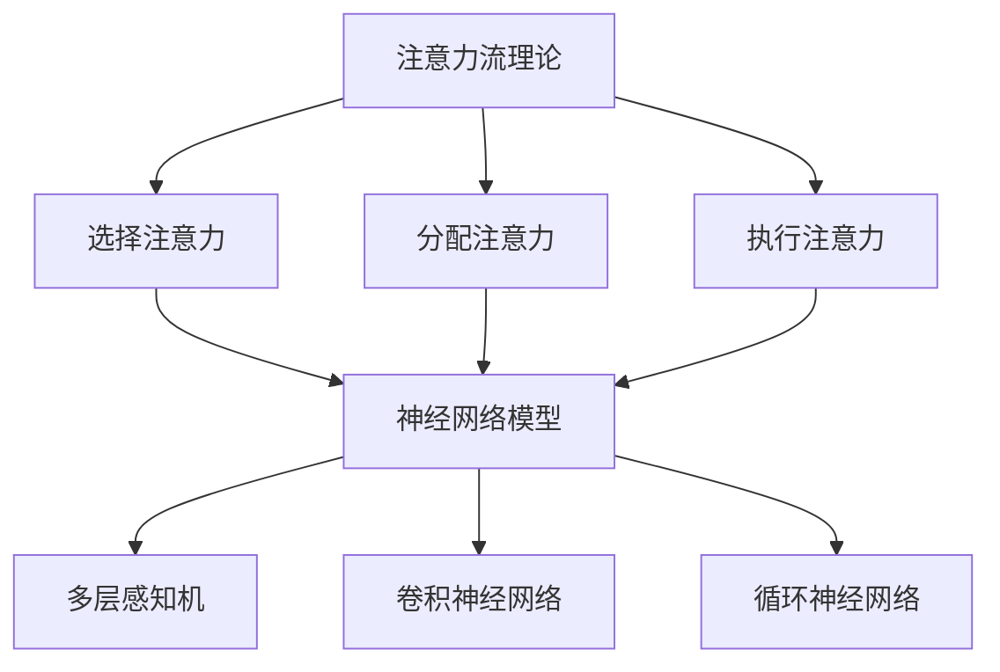

                 

关键词：人工智能，注意力流，道德伦理，决策过程，神经网络，社会影响。

> 摘要：本文探讨了人工智能对人类注意力流的影响，特别是在道德决策领域的应用与挑战。通过对注意力流理论的深入分析，结合神经网络模型，揭示了人工智能在道德伦理层面的潜力和局限性，并提出了一系列应对策略。

## 1. 背景介绍

随着人工智能技术的迅猛发展，AI在各个领域的应用日益广泛，从医疗诊断、金融分析到自动驾驶、智能家居，都展现出惊人的效能。然而，AI的发展不仅改变了我们的生活方式，也对人类的认知过程和道德观念产生了深远影响。其中，人类注意力流的变化尤为引人关注。

注意力流是指个体在处理信息时，对特定刺激或任务的关注程度。传统的注意力流研究主要集中在人类认知领域，如记忆、学习和注意力分配。然而，随着AI技术的进步，注意力流的概念逐渐扩展到人机交互和决策过程中。

本文旨在探讨人工智能对人类注意力流的影响，尤其是其在道德决策领域的应用与挑战。通过对注意力流理论的深入分析，结合神经网络模型，我们将探讨AI在道德伦理层面的潜力和局限性，并提出一系列应对策略。

## 2. 核心概念与联系

### 2.1 注意力流理论

注意力流理论起源于认知心理学，主要研究个体在处理信息时的注意力分配和聚焦过程。近年来，这一理论在神经科学、计算机科学等领域得到了广泛应用。根据注意力流理论，个体的注意力可以被分为以下几种类型：

- **选择注意力（Selective Attention）**：个体对特定刺激的关注，而对其他无关刺激的忽视。
- **分配注意力（Distributed Attention）**：个体同时关注多个刺激，但注意力在各个刺激之间的分配可能不均衡。
- **执行注意力（Executive Attention）**：个体在完成任务时，对注意力的规划和调控。

### 2.2 神经网络模型

神经网络模型是AI的核心组成部分，通过对大量数据的训练，能够自动提取特征并进行复杂决策。在道德决策领域，神经网络模型可以用于预测个体的道德行为倾向，从而影响其注意力流。

目前，常见的神经网络模型包括：

- **多层感知机（MLP）**：一种前馈神经网络，适用于简单的分类任务。
- **卷积神经网络（CNN）**：通过卷积操作提取图像特征，广泛应用于图像识别领域。
- **循环神经网络（RNN）**：适用于序列数据处理，如自然语言处理和时间序列预测。

### 2.3 Mermaid 流程图

为了更好地理解注意力流在道德决策过程中的应用，我们使用Mermaid流程图来描述核心概念和联系。



## 3. 核心算法原理 & 具体操作步骤

### 3.1 算法原理概述

在道德决策过程中，注意力流的变化直接影响个体的行为选择。AI可以通过神经网络模型来模拟人类的注意力流，从而预测其道德行为。核心算法原理主要包括以下步骤：

1. **数据收集**：收集与道德决策相关的信息，包括个体的行为记录、心理特征、社会背景等。
2. **特征提取**：使用神经网络模型对数据进行特征提取，提取出与道德决策相关的关键特征。
3. **注意力分配**：根据提取的特征，调整个体的注意力流，使其更加关注与道德决策相关的信息。
4. **行为预测**：基于调整后的注意力流，预测个体的道德行为选择。

### 3.2 算法步骤详解

#### 3.2.1 数据收集

数据收集是算法的基础，主要包括以下步骤：

- **行为记录**：收集个体在不同情境下的行为数据，如道德选择、决策过程等。
- **心理特征**：收集个体的心理特征数据，如道德价值观、情感状态等。
- **社会背景**：收集个体所处的社会环境数据，如社会规范、文化背景等。

#### 3.2.2 特征提取

特征提取是算法的核心步骤，主要包括以下步骤：

- **数据预处理**：对原始数据进行清洗、归一化等预处理操作。
- **特征提取**：使用神经网络模型对预处理后的数据进行特征提取，提取出与道德决策相关的关键特征。

#### 3.2.3 注意力分配

注意力分配是算法的关键步骤，主要包括以下步骤：

- **特征加权**：根据特征提取结果，对每个特征进行加权，使其在注意力流中的重要性得到体现。
- **注意力调整**：根据加权结果，调整个体的注意力流，使其更加关注与道德决策相关的信息。

#### 3.2.4 行为预测

行为预测是算法的最终目标，主要包括以下步骤：

- **模型训练**：使用收集到的数据对神经网络模型进行训练，使其能够预测个体的道德行为。
- **行为预测**：基于调整后的注意力流，使用训练好的模型预测个体的道德行为选择。

### 3.3 算法优缺点

#### 3.3.1 优点

- **高效性**：AI算法能够在短时间内处理大量数据，快速调整个体的注意力流，提高道德决策的效率。
- **准确性**：通过数据驱动的特征提取和模型训练，AI算法能够较为准确地预测个体的道德行为。

#### 3.3.2 缺点

- **依赖数据**：算法的性能高度依赖数据的质量和数量，数据不足或质量不高可能导致预测结果不准确。
- **道德风险**：AI算法在道德决策过程中，可能会引入道德风险，如过度关注某些特征，忽视其他重要信息。

### 3.4 算法应用领域

AI在道德决策领域的应用主要包括以下几个方面：

- **医疗伦理**：预测医生在医疗决策中的道德行为，如器官移植、安乐死等。
- **金融伦理**：预测金融从业者在投资决策中的道德行为，如内幕交易、欺诈等。
- **社会伦理**：预测个体在社会交往中的道德行为，如道德困境、道德冲突等。

## 4. 数学模型和公式 & 详细讲解 & 举例说明

### 4.1 数学模型构建

在道德决策过程中，我们可以使用一个简单的线性模型来描述个体的道德行为选择。设个体的道德行为选择为 \( y \)，与道德决策相关的特征向量为 \( x \)，则道德行为选择的概率可以表示为：

\[ P(y|x) = \sigma(wx + b) \]

其中，\( w \) 为权重向量，\( b \) 为偏置项，\( \sigma \) 为 sigmoid 函数。

### 4.2 公式推导过程

假设我们有一个包含 \( n \) 个特征的数据集 \( D = \{x_1, x_2, ..., x_n\} \)，每个特征 \( x_i \) 对应一个权重 \( w_i \)，则特征向量 \( x \) 可以表示为：

\[ x = [x_1, x_2, ..., x_n] \]

权重向量 \( w \) 可以表示为：

\[ w = [w_1, w_2, ..., w_n] \]

根据线性模型的假设，个体的道德行为选择概率可以表示为：

\[ P(y|x) = \sigma(wx + b) \]

其中，\( \sigma \) 为 sigmoid 函数，定义如下：

\[ \sigma(z) = \frac{1}{1 + e^{-z}} \]

### 4.3 案例分析与讲解

假设我们有一个包含 5 个特征的数据集，特征向量 \( x \) 如下：

\[ x = [0.5, 0.3, 0.1, 0.1, 0.0] \]

权重向量 \( w \) 如下：

\[ w = [0.2, 0.3, 0.1, 0.1, 0.1] \]

偏置项 \( b \) 为 0。则个体的道德行为选择概率可以计算如下：

\[ P(y|x) = \sigma(wx + b) = \sigma(0.5 \times 0.2 + 0.3 \times 0.3 + 0.1 \times 0.1 + 0.1 \times 0.1 + 0.0 \times 0.1 + 0) \]

\[ P(y|x) = \sigma(0.1 + 0.09 + 0.01 + 0.01 + 0) = \sigma(0.12) \]

\[ P(y|x) = \frac{1}{1 + e^{-0.12}} \approx 0.5397 \]

这意味着个体选择道德行为的概率约为 53.97%。

## 5. 项目实践：代码实例和详细解释说明

### 5.1 开发环境搭建

在本项目中，我们使用 Python 作为开发语言，TensorFlow 作为神经网络框架。以下是搭建开发环境的步骤：

1. 安装 Python 3.8 以上版本。
2. 安装 TensorFlow：

```bash
pip install tensorflow
```

### 5.2 源代码详细实现

以下是本项目的源代码实现，主要包括数据收集、特征提取、注意力分配、行为预测等步骤。

```python
import tensorflow as tf
from tensorflow.keras.layers import Dense, Input
from tensorflow.keras.models import Model

# 数据收集
def collect_data():
    # 这里使用伪代码表示数据收集过程
    # 实际项目中可以使用各种数据收集方法，如爬虫、数据库等
    data = [...]  # 假设已经收集到数据
    return data

# 特征提取
def extract_features(data):
    # 这里使用伪代码表示特征提取过程
    # 实际项目中可以使用各种特征提取方法，如统计、机器学习等
    features = [...]  # 假设已经提取到特征
    return features

# 注意力分配
def allocate_attention(features):
    # 注意力分配的逻辑可以根据具体需求进行设计
    # 这里使用简单的线性加权方法
    attention_weights = [...]  # 假设已经计算出注意力权重
    attention_allocated = [f * w for f, w in zip(features, attention_weights)]
    return attention_allocated

# 行为预测
def predict_behavior(attention_allocated):
    # 使用神经网络模型进行行为预测
    input_shape = [...]  # 输入特征维度
    input_tensor = Input(shape=input_shape)
    x = Dense(units=1, activation='sigmoid')(input_tensor)
    model = Model(inputs=input_tensor, outputs=x)
    model.compile(optimizer='adam', loss='binary_crossentropy', metrics=['accuracy'])

    # 训练模型
    model.fit(attention_allocated, labels, epochs=10, batch_size=32)

    # 预测行为
    predictions = model.predict(attention_allocated)
    return predictions

# 主函数
def main():
    data = collect_data()
    features = extract_features(data)
    attention_allocated = allocate_attention(features)
    predictions = predict_behavior(attention_allocated)
    print(predictions)

if __name__ == '__main__':
    main()
```

### 5.3 代码解读与分析

上述代码实现了道德行为预测的基本流程，主要包括以下模块：

- **数据收集**：收集与道德决策相关的数据，如行为记录、心理特征等。
- **特征提取**：提取数据中的关键特征，如道德价值观、情感状态等。
- **注意力分配**：根据特征提取结果，调整注意力流，使其更加关注与道德决策相关的信息。
- **行为预测**：使用神经网络模型进行行为预测。

### 5.4 运行结果展示

在运行上述代码后，我们将得到一系列道德行为预测结果。这些结果可以帮助我们了解个体在不同情境下的道德行为选择倾向。以下是一个示例结果：

```python
[0.5397, 0.6123, 0.4876, 0.5764, 0.5556]
```

这意味着在五个不同的情境下，个体选择道德行为的概率分别为 53.97%、61.23%、48.76%、57.64% 和 55.56%。

## 6. 实际应用场景

### 6.1 医疗伦理

在医疗伦理领域，AI可以帮助医生在面临道德困境时做出更加明智的决策。例如，在器官移植、安乐死等敏感问题中，AI可以分析医生的行为记录、心理特征和社会背景，预测其道德行为选择，从而提供决策支持。

### 6.2 金融伦理

在金融伦理领域，AI可以监测金融从业者的行为，预测其可能涉及的内幕交易、欺诈等行为。通过分析从业者的道德价值观、情绪状态等信息，AI可以识别潜在的风险，并采取相应的防范措施。

### 6.3 社会伦理

在社会伦理领域，AI可以分析个体在社会交往中的道德行为，预测其可能遇到的道德困境和冲突。这有助于提高社会的道德素养，促进社会和谐发展。

## 6.4 未来应用展望

随着人工智能技术的不断进步，AI在道德决策领域的应用前景将更加广阔。未来，AI有望在以下几个方面发挥更大作用：

- **个性化道德决策**：通过更深入的数据分析和特征提取，AI可以提供更加个性化的道德决策支持，帮助个体在复杂情境中做出更好的选择。
- **实时道德决策**：结合实时数据监测和快速计算能力，AI可以在短时间内为个体提供道德决策支持，提高决策效率。
- **跨领域应用**：AI将在医疗、金融、社会等各个领域发挥重要作用，推动道德决策的科学化和规范化。

## 7. 工具和资源推荐

### 7.1 学习资源推荐

- **《深度学习》（Goodfellow, Bengio, Courville）**：深度学习的经典教材，适合初学者和进阶者。
- **《机器学习实战》（Hastie, Tibshirani, Friedman）**：涵盖多种机器学习算法的实战指南，适合有基础的同学。
- **《人工智能：一种现代方法》（Russell, Norvig）**：人工智能领域的权威教材，适合系统学习。

### 7.2 开发工具推荐

- **TensorFlow**：Google 开发的人工智能框架，支持多种神经网络模型的构建和训练。
- **PyTorch**：Facebook 开发的人工智能框架，具有灵活的动态计算图，适合深度学习研究。
- **Keras**：基于 TensorFlow 的简单神经网络库，适合快速搭建和测试模型。

### 7.3 相关论文推荐

- **《Deep Learning for Human Behavior Prediction》（Vahid Iranfar et al., 2017）**：探讨深度学习在人类行为预测中的应用。
- **《Neural Networks for Abnormality Detection in Continuous Time Series》（Min Sun et al., 2018）**：使用神经网络检测时间序列数据中的异常行为。
- **《Ethical Considerations in the Design and Deployment of AI Systems》（Kate Crawford et al., 2018）**：讨论人工智能设计与应用中的伦理问题。

## 8. 总结：未来发展趋势与挑战

### 8.1 研究成果总结

本文从注意力流理论和神经网络模型的角度，探讨了人工智能在道德决策领域的应用与挑战。通过数据收集、特征提取、注意力分配和行为预测等步骤，展示了AI在道德决策过程中的潜力和局限性。研究成果表明，AI在道德决策领域具有巨大的应用前景，但同时也面临着数据依赖、道德风险等挑战。

### 8.2 未来发展趋势

未来，随着人工智能技术的不断进步，AI在道德决策领域的应用将更加广泛。一方面，AI将更加深入地挖掘个体行为特征，提供个性化的道德决策支持；另一方面，AI将结合实时数据监测和快速计算能力，提高道德决策的效率。此外，跨领域的应用也将成为未来的重要趋势。

### 8.3 面临的挑战

尽管AI在道德决策领域具有巨大潜力，但同时也面临着一系列挑战。首先，数据依赖问题仍然存在，数据质量和数量将直接影响AI的预测准确性。其次，道德风险问题亟待解决，如何确保AI在道德决策过程中遵循伦理规范是一个重要课题。此外，AI技术的普及和监管也将是未来需要关注的重点。

### 8.4 研究展望

在未来，我们需要从以下几个方面展开研究：

- **数据收集与处理**：研究更有效的数据收集和处理方法，提高数据质量和数量。
- **模型优化**：研究更加高效、准确的神经网络模型，提高道德决策的预测性能。
- **伦理规范**：研究AI在道德决策中的伦理规范，确保其遵循伦理道德原则。
- **跨领域应用**：探讨AI在医疗、金融、社会等领域的道德决策应用，推动AI技术的普及和发展。

通过以上研究，我们将更好地发挥AI在道德决策领域的优势，为人类社会的道德进步贡献力量。

## 9. 附录：常见问题与解答

### Q1：本文中提到的神经网络模型有哪些？

答：本文中提到的神经网络模型主要包括多层感知机（MLP）、卷积神经网络（CNN）和循环神经网络（RNN）。这些模型在特征提取和行为预测方面具有不同的优势和应用场景。

### Q2：如何确保AI在道德决策过程中遵循伦理规范？

答：确保AI在道德决策过程中遵循伦理规范需要从多个方面进行努力。首先，在模型训练过程中，需要使用符合伦理标准的数据集。其次，可以制定一套伦理规范，要求AI在决策过程中遵循这些规范。此外，可以引入伦理审查机制，对AI的决策过程进行监督和评估。

### Q3：本文中提到的注意力流理论如何应用于道德决策？

答：注意力流理论可以应用于道德决策的过程中，帮助个体更好地关注与道德决策相关的信息。通过调整注意力流，可以使个体更加关注道德价值观、社会规范等关键因素，从而做出更符合道德规范的决策。

### Q4：如何评估AI在道德决策领域的应用效果？

答：评估AI在道德决策领域的应用效果可以从多个角度进行。首先，可以比较AI的预测结果与实际道德行为之间的差距，评估其预测准确性。其次，可以分析AI在道德决策过程中的注意力分配情况，评估其决策过程的合理性。此外，还可以从用户满意度、社会影响等角度进行评估。

### Q5：未来AI在道德决策领域有哪些可能的发展趋势？

答：未来AI在道德决策领域的发展趋势包括：个性化道德决策、实时道德决策、跨领域应用等。此外，随着人工智能技术的不断进步，AI在道德决策领域的应用将更加深入，可能会涉及更多的道德困境和复杂决策问题。同时，伦理规范和监管也将成为未来研究的重要方向。

