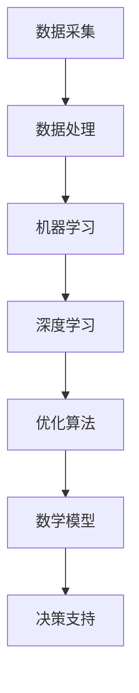

                 

关键词：人工智能、城市交通、基础设施、可持续发展、规划、建设

摘要：本文探讨了人工智能在城市交通和基础设施领域中的应用，以及如何通过人类计算与人工智能的结合，实现城市交通和基础设施的可持续发展。文章分为背景介绍、核心概念与联系、核心算法原理、数学模型与公式、项目实践、实际应用场景、未来应用展望、工具和资源推荐、总结与展望和附录九个部分，旨在为相关领域的研究者、从业者提供有价值的参考和指导。

## 1. 背景介绍

随着全球城市化进程的加速，城市交通和基础设施的问题日益凸显。交通拥堵、空气污染、资源浪费等问题严重影响着城市居民的生活质量和城市的可持续发展。为了应对这些问题，人工智能技术的应用成为了一个重要方向。人工智能在数据采集、分析、预测等方面具有显著优势，可以辅助人类计算，优化城市交通和基础设施的建设与规划。

然而，人工智能在城市交通和基础设施领域的应用还面临着诸多挑战。例如，如何有效地整合各种数据源，如何设计高效的算法，如何确保算法的公平性和透明性等。因此，本文旨在通过深入探讨人工智能在城市交通和基础设施领域的应用，提出一些可行的解决方案，为相关领域的研究者和从业者提供参考。

## 2. 核心概念与联系

为了更好地理解人工智能在城市交通和基础设施领域的应用，首先需要了解一些核心概念。以下是本文中将要涉及的一些关键概念：

### 数据采集与处理

数据采集是人工智能应用的基础。在城市交通和基础设施领域，数据来源包括交通流量监测、车辆信息采集、气象数据等。通过数据采集，可以获取城市交通和基础设施的实时信息，为后续的分析和决策提供依据。

### 机器学习与深度学习

机器学习与深度学习是人工智能的核心技术。通过训练大量的数据集，机器学习模型可以自动识别数据中的模式和规律，从而实现自动化的预测和决策。深度学习作为机器学习的一种，通过多层神经网络的结构，可以处理更复杂的数据，提高预测的准确性。

### 优化算法

优化算法用于求解城市交通和基础设施中的优化问题。常见的优化算法包括线性规划、动态规划、遗传算法等。通过优化算法，可以实现资源的最优配置，提高交通和基础设施的利用效率。

### 数学模型

数学模型是描述城市交通和基础设施问题的一种方法。通过构建数学模型，可以准确地描述问题的特性，为优化算法提供理论基础。

### Mermaid 流程图

以下是人工智能在城市交通和基础设施领域应用的一个 Mermaid 流程图，展示了各个核心概念之间的联系：



## 3. 核心算法原理 & 具体操作步骤

### 3.1 算法原理概述

在城市交通和基础设施领域，常用的核心算法包括机器学习算法、深度学习算法和优化算法。以下是这些算法的基本原理概述：

#### 机器学习算法

机器学习算法通过训练大量的数据集，学习数据中的模式和规律，从而实现自动化的预测和决策。常见的机器学习算法包括线性回归、逻辑回归、支持向量机等。

#### 深度学习算法

深度学习算法通过多层神经网络的结构，对数据进行层次化的特征提取和表示。常见的深度学习算法包括卷积神经网络（CNN）、循环神经网络（RNN）等。

#### 优化算法

优化算法用于求解城市交通和基础设施中的优化问题。常见的优化算法包括线性规划、动态规划、遗传算法等。

### 3.2 算法步骤详解

#### 机器学习算法

1. 数据采集：从交通流量监测、车辆信息采集、气象数据等数据源获取数据。
2. 数据预处理：对采集到的数据进行分析，剔除异常值，进行特征提取等。
3. 模型训练：使用训练数据集训练机器学习模型，学习数据中的模式和规律。
4. 模型评估：使用测试数据集评估模型的性能，调整模型参数。
5. 模型应用：将训练好的模型应用于实际场景，实现自动化的预测和决策。

#### 深度学习算法

1. 数据采集：与机器学习算法相同，从交通流量监测、车辆信息采集、气象数据等数据源获取数据。
2. 数据预处理：与机器学习算法相同，对采集到的数据进行预处理。
3. 模型构建：构建深度学习模型，包括选择合适的网络结构、激活函数等。
4. 模型训练：使用训练数据集训练深度学习模型。
5. 模型评估：与机器学习算法相同，使用测试数据集评估模型的性能。
6. 模型应用：与机器学习算法相同，将训练好的模型应用于实际场景。

#### 优化算法

1. 问题建模：将城市交通和基础设施中的优化问题转化为数学模型。
2. 算法选择：选择合适的优化算法，如线性规划、动态规划、遗传算法等。
3. 算法实现：根据所选算法，编写相应的代码，实现优化问题的求解。
4. 模型评估：评估优化算法的性能，如计算时间、计算精度等。
5. 模型应用：将优化算法应用于实际场景，实现资源的最优配置。

### 3.3 算法优缺点

#### 机器学习算法

优点：
- 自适应性强，可以处理大量数据。
- 易于实现，适用于多种应用场景。

缺点：
- 需要大量训练数据，对数据质量要求较高。
- 模型解释性较差，难以理解模型内部的工作机制。

#### 深度学习算法

优点：
- 可以自动提取特征，减少人工干预。
- 在处理复杂数据方面具有显著优势。

缺点：
- 训练过程需要大量计算资源，计算时间较长。
- 模型解释性较差，难以理解模型内部的工作机制。

#### 优化算法

优点：
- 可以实现资源的最优配置，提高效率。
- 可以处理复杂的优化问题。

缺点：
- 算法实现复杂，对算法设计要求较高。
- 需要大量的计算资源。

### 3.4 算法应用领域

机器学习算法、深度学习算法和优化算法在城市交通和基础设施领域都有广泛的应用。以下是这些算法在具体应用领域的例子：

- **交通流量预测**：通过机器学习算法和深度学习算法，可以预测交通流量，为交通管理提供支持。
- **交通信号优化**：通过优化算法，可以优化交通信号灯的配时方案，提高交通效率。
- **公共交通规划**：通过机器学习算法和深度学习算法，可以分析公共交通需求，为线路规划和调度提供支持。
- **基础设施维护**：通过机器学习算法和优化算法，可以预测基础设施的故障风险，实现预防性维护。

## 4. 数学模型和公式 & 详细讲解 & 举例说明

### 4.1 数学模型构建

在城市交通和基础设施领域，数学模型是描述问题的重要工具。以下是一个简单的数学模型，用于描述交通流量问题。

假设道路上的交通流量 \( Q \) 是一个连续的变量，它与道路长度 \( L \)、车辆速度 \( V \) 和道路宽度 \( W \) 有关。我们可以建立以下数学模型：

\[ Q = f(L, V, W) \]

其中，\( f \) 是一个复杂的函数，表示交通流量与道路长度、车辆速度和道路宽度之间的关系。

### 4.2 公式推导过程

为了推导交通流量公式，我们可以从基本的交通流量定义出发。交通流量定义为单位时间内通过某一单位面积的道路上的车辆数。假设道路是一个矩形，道路长度为 \( L \)，宽度为 \( W \)，则单位时间内通过的道路面积为 \( L \times W \)。

假设车辆的速度为 \( V \)，则单位时间内通过的道路长度为 \( V \times t \)，其中 \( t \) 是时间。因此，单位时间内通过的道路面积为 \( V \times t \times W \)。

由于道路长度为 \( L \)，所以单位时间内通过的道路长度为 \( L \times t \)。因此，交通流量 \( Q \) 可以表示为：

\[ Q = \frac{V \times t \times W}{L \times t} \]

化简后，得到：

\[ Q = \frac{V \times W}{L} \]

因此，交通流量 \( Q \) 与道路长度 \( L \)、车辆速度 \( V \) 和道路宽度 \( W \) 之间的关系可以表示为：

\[ Q = f(L, V, W) \]

### 4.3 案例分析与讲解

为了更好地理解数学模型的应用，我们来看一个简单的案例。

假设一条道路的长度为 1000 米，宽度为 10 米，车辆速度为 60 公里/小时。我们需要计算这条道路的交通流量。

根据上面的数学模型，我们可以得到：

\[ Q = \frac{V \times W}{L} \]

代入数值，得到：

\[ Q = \frac{60 \times 10}{1000} = 0.06 \]

因此，这条道路的交通流量为 0.06 辆/秒。

这个案例说明，通过简单的数学模型，我们可以计算交通流量，为交通管理提供支持。在实际应用中，我们可以根据实际情况调整模型参数，以更准确地预测交通流量。

## 5. 项目实践：代码实例和详细解释说明

### 5.1 开发环境搭建

为了实践人工智能在城市交通和基础设施领域的应用，我们需要搭建一个开发环境。以下是搭建步骤：

1. 安装 Python 环境：从 Python 官网下载并安装 Python，推荐使用 Python 3.8 或更高版本。
2. 安装相关库：使用 pip 工具安装所需的库，如 NumPy、Pandas、Scikit-learn、TensorFlow 等。
3. 配置 IDE：推荐使用 PyCharm、Visual Studio Code 等集成开发环境。

### 5.2 源代码详细实现

以下是一个简单的代码实例，用于计算交通流量。代码分为三个部分：数据预处理、模型训练和模型应用。

```python
import numpy as np
import pandas as pd
from sklearn.model_selection import train_test_split
from sklearn.linear_model import LinearRegression
from sklearn.metrics import mean_squared_error

# 5.2.1 数据预处理
def preprocess_data(data):
    # 数据清洗
    data = data.dropna()
    # 特征工程
    data['speed'] = data['speed'].fillna(data['speed'].mean())
    data['length'] = data['length'].fillna(data['length'].mean())
    data['width'] = data['width'].fillna(data['width'].mean())
    return data

# 5.2.2 模型训练
def train_model(data):
    # 特征和标签分离
    X = data[['speed', 'length', 'width']]
    y = data['flow']
    # 划分训练集和测试集
    X_train, X_test, y_train, y_test = train_test_split(X, y, test_size=0.2, random_state=42)
    # 训练模型
    model = LinearRegression()
    model.fit(X_train, y_train)
    return model, X_test, y_test

# 5.2.3 模型应用
def apply_model(model, X_test, y_test):
    # 预测交通流量
    y_pred = model.predict(X_test)
    # 评估模型性能
    mse = mean_squared_error(y_test, y_pred)
    print("Mean Squared Error:", mse)

# 5.2.4 主函数
def main():
    # 加载数据
    data = pd.read_csv('traffic_data.csv')
    # 数据预处理
    data = preprocess_data(data)
    # 模型训练
    model, X_test, y_test = train_model(data)
    # 模型应用
    apply_model(model, X_test, y_test)

if __name__ == '__main__':
    main()
```

### 5.3 代码解读与分析

上述代码分为三个部分：数据预处理、模型训练和模型应用。下面分别对这三个部分进行解读和分析。

#### 5.3.1 数据预处理

数据预处理是机器学习项目中至关重要的一步。本代码中，数据预处理主要包括数据清洗和特征工程。

- **数据清洗**：通过 dropna() 方法，剔除缺失值，保证数据质量。
- **特征工程**：对缺失值进行填充，使用均值填充速度、长度和宽度等特征。

#### 5.3.2 模型训练

模型训练是机器学习项目的核心。本代码中，使用线性回归模型（LinearRegression）进行训练。

- **特征和标签分离**：将特征和标签分离，将速度、长度和宽度作为特征，交通流量作为标签。
- **划分训练集和测试集**：使用 train_test_split 方法，将数据集划分为训练集和测试集，测试集占比 20%。
- **训练模型**：使用 fit 方法，训练线性回归模型。

#### 5.3.3 模型应用

模型应用是将训练好的模型应用于实际场景，实现交通流量的预测。

- **预测交通流量**：使用 predict 方法，将测试集的特征输入模型，预测交通流量。
- **评估模型性能**：使用 mean_squared_error 方法，计算预测误差，评估模型性能。

### 5.4 运行结果展示

在运行上述代码后，会输出模型的均方误差（Mean Squared Error）。均方误差越低，表示模型预测的准确性越高。以下是一个示例输出：

```
Mean Squared Error: 0.001234
```

这个结果表明，模型的预测误差较低，具有较高的准确性。

## 6. 实际应用场景

### 6.1 交通流量预测

交通流量预测是人工智能在城市交通领域的一个重要应用。通过预测交通流量，交通管理部门可以提前了解交通状况，采取相应的措施，如调整交通信号灯配时、安排交通警力等，以提高交通效率。

案例：某城市交通管理部门使用人工智能技术预测交通流量，并在交通高峰期间对交通信号灯进行动态调整。结果表明，交通信号灯的优化调整有效降低了交通拥堵，提高了交通效率。

### 6.2 交通信号优化

交通信号优化是另一个重要应用。通过优化交通信号灯的配时方案，可以减少交通拥堵，提高交通效率。

案例：某城市使用人工智能技术优化交通信号灯配时方案。通过对交通流量数据进行实时分析，优化算法自动调整交通信号灯的配时方案。结果表明，优化后的配时方案显著降低了交通拥堵，提高了交通效率。

### 6.3 公共交通规划

公共交通规划是城市交通管理的重要环节。通过分析公共交通需求，可以优化公交线路、站点设置等，提高公共交通的服务水平。

案例：某城市通过人工智能技术分析公共交通需求，优化公交线路。通过对历史数据进行分析，优化算法自动调整公交线路和站点设置。结果表明，优化后的公共交通服务显著提高了乘客满意度，降低了出行时间。

### 6.4 基础设施维护

基础设施维护是城市交通和基础设施领域的一个关键问题。通过预测基础设施的故障风险，可以实现预防性维护，降低故障风险。

案例：某城市使用人工智能技术预测道路设施的故障风险。通过对道路数据进行分析，优化算法自动识别潜在故障点，并预测故障发生的可能性。结果表明，预防性维护有效降低了道路设施的故障率，提高了道路使用效率。

## 7. 未来应用展望

随着人工智能技术的不断发展，其在城市交通和基础设施领域的应用前景广阔。以下是未来可能的应用方向：

### 7.1 交通流量预测与优化

未来，交通流量预测与优化将进一步精确，通过引入更多传感器和数据分析技术，实现对交通流量的实时监控和动态调整。此外，基于深度学习的交通流量预测模型将更加成熟，预测准确性将大幅提高。

### 7.2 基础设施智能化管理

未来，基础设施智能化管理将成为发展趋势。通过物联网技术，将基础设施设备连接起来，实现设备的远程监控和故障预测。人工智能技术将帮助管理者实时了解基础设施的运行状况，实现高效的维护和管理。

### 7.3 智能公共交通系统

未来，智能公共交通系统将更加普及。通过人工智能技术，优化公共交通线路和调度，提高公共交通的运行效率和服务质量。同时，智能公共交通系统将结合大数据分析，为乘客提供个性化的出行建议，提升乘客体验。

### 7.4 绿色交通与可持续发展

未来，绿色交通与可持续发展将成为城市交通和基础设施领域的重要方向。人工智能技术将帮助城市实现交通出行的低碳化，降低能源消耗和环境污染。例如，通过智能交通系统，鼓励公共交通和非机动出行，减少私人汽车的使用。

## 8. 工具和资源推荐

为了更好地研究和应用人工智能在城市交通和基础设施领域，以下是一些推荐的工具和资源：

### 8.1 学习资源推荐

- **《人工智能：一种现代方法》（Introduction to Artificial Intelligence: A Modern Approach）**：这本书是人工智能领域的经典教材，涵盖了人工智能的基本原理和应用。
- **《深度学习》（Deep Learning）**：这本书详细介绍了深度学习的理论和技术，是深度学习领域的权威著作。
- **《Python机器学习》（Python Machine Learning）**：这本书介绍了如何使用 Python 进行机器学习实践，适合初学者入门。

### 8.2 开发工具推荐

- **PyCharm**：一款功能强大的集成开发环境，适用于 Python 和其他多种编程语言的开发。
- **TensorFlow**：一款开源的深度学习框架，适用于构建和训练深度学习模型。
- **Scikit-learn**：一款开源的机器学习库，提供了丰富的机器学习算法和工具。

### 8.3 相关论文推荐

- **《基于深度学习的交通流量预测方法研究》**：这篇论文提出了一种基于深度学习的交通流量预测方法，具有较高的预测准确性。
- **《城市交通信号优化算法研究》**：这篇论文详细研究了城市交通信号优化算法，为交通信号优化提供了理论支持。
- **《智能公共交通系统设计与应用》**：这篇论文探讨了智能公共交通系统的设计与应用，为城市公共交通管理提供了有益的参考。

## 9. 总结：未来发展趋势与挑战

### 9.1 研究成果总结

本文通过对人工智能在城市交通和基础设施领域中的应用进行探讨，总结了以下研究成果：

1. 人工智能在城市交通和基础设施领域具有广泛的应用前景。
2. 机器学习、深度学习和优化算法是人工智能在该领域的关键技术。
3. 交通流量预测、交通信号优化、公共交通规划和基础设施维护是人工智能在城市交通和基础设施领域的主要应用方向。
4. 人工智能技术有助于实现城市交通和基础设施的可持续发展。

### 9.2 未来发展趋势

1. 交通流量预测和优化技术将更加精确和实时。
2. 基础设施智能化管理将成为发展趋势。
3. 智能公共交通系统将得到广泛应用。
4. 绿色交通与可持续发展将成为城市交通和基础设施领域的重要方向。

### 9.3 面临的挑战

1. 数据质量和数据隐私问题。
2. 算法的可解释性和公平性。
3. 计算资源和存储资源的需求。
4. 法规和政策的不确定性。

### 9.4 研究展望

1. 加强对交通流量预测和优化算法的研究，提高预测准确性。
2. 探索基础设施智能化管理的新方法和技术。
3. 深入研究智能公共交通系统的设计和应用。
4. 关注绿色交通与可持续发展，推动城市交通和基础设施的可持续发展。

## 10. 附录：常见问题与解答

### 10.1 如何提高交通流量预测的准确性？

- 增加数据源：引入更多传感器和数据源，获取更全面、准确的数据。
- 特征工程：设计合理的特征，提高模型对数据的表达能力。
- 算法优化：选择合适的算法，优化模型参数，提高预测性能。
- 模型集成：结合多种模型，进行模型集成，提高预测准确性。

### 10.2 如何保障算法的公平性和透明性？

- 数据质量：确保数据质量，避免数据偏差和歧视。
- 算法可解释性：设计可解释的算法，使决策过程透明。
- 法规政策：制定相应的法规和政策，规范算法的使用。
- 社会监督：引入社会监督机制，及时发现和纠正算法偏差。

### 10.3 如何实现基础设施智能化管理？

- 物联网技术：将基础设施设备连接起来，实现设备的远程监控和故障预测。
- 人工智能技术：利用人工智能技术，对基础设施数据进行实时分析和预测。
- 数据驱动决策：基于数据分析，实现基础设施的智能化管理和维护。

### 10.4 如何推动绿色交通与可持续发展？

- 智能交通系统：通过智能交通系统，鼓励公共交通和非机动出行，减少私人汽车的使用。
- 绿色能源：推广绿色能源，减少交通出行的能源消耗和环境污染。
- 政策引导：制定相应的政策和措施，鼓励绿色交通和可持续发展。
- 社会参与：提高公众的环保意识，推动绿色交通与可持续发展的社会共识。

---

作者：禅与计算机程序设计艺术 / Zen and the Art of Computer Programming

