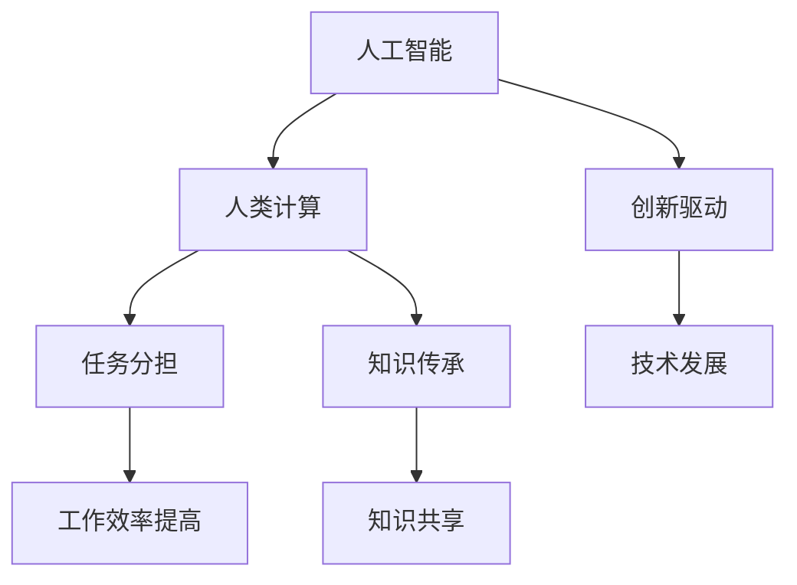

                 

关键词：人工智能，道德伦理，人类计算，未来展望，技术发展

## 摘要

随着人工智能（AI）技术的飞速发展，其影响已渗透到社会的各个角落。AI不仅改变了人类的工作和生活方式，也对道德伦理提出了新的挑战。本文旨在探讨AI与人类计算之间的道德考虑，分析其在未来可能带来的影响，并提出相应的解决策略。

本文结构如下：首先，我们将介绍AI与人类计算的基本概念和背景；接着，探讨AI技术在道德伦理方面的主要挑战；然后，分析这些挑战背后的原因；接下来，提出一些可能的解决策略；最后，对文章进行总结，并展望未来AI与人类计算的发展趋势。

## 1. 背景介绍

### 人工智能的发展历程

人工智能（AI）是指计算机系统执行的任务，这些任务通常需要人类智能才能完成。从最早的自动机械到现代的深度学习算法，人工智能经历了多个阶段的发展。

- **早期阶段**：20世纪50年代，人工智能的概念首次被提出。当时的研究主要集中在逻辑推理和问题解决上，如符号逻辑和博弈论。

- **知识表示**：20世纪80年代，研究者开始探索如何将知识表示为计算机程序，以便计算机能够像人类一样思考和决策。

- **专家系统**：20世纪90年代，专家系统成为人工智能研究的热点。专家系统利用大量的规则和知识库，模拟人类专家的决策过程。

- **深度学习**：21世纪初，随着计算能力和数据量的增加，深度学习算法迅速发展。深度学习利用神经网络，通过大量数据的学习，实现了图像识别、语音识别等任务。

### 人类计算

人类计算是指人类利用认知能力和物理工具进行计算的过程。从古代的计算工具，如算盘和计算尺，到现代的计算设备，如计算机和智能手机，人类计算经历了巨大的变化。

- **手工计算**：在古代，人类使用手指、算盘和计算尺等工具进行计算。这种方式虽然效率较低，但为人类文明的发展提供了基础。

- **机械计算**：随着工业革命的到来，机械计算工具被广泛应用于生产和科学研究中。例如，蒸汽机和电动机等设备，提高了人类计算的速度和精度。

- **电子计算**：20世纪40年代，计算机的发明标志着人类计算进入了一个新的阶段。计算机的出现，极大地提高了人类计算的能力，推动了科学研究和技术发展。

## 2. 核心概念与联系

### 人工智能与人类计算的互动关系

人工智能和人类计算之间存在着密切的互动关系。人工智能技术的进步，使得计算机能够执行更多复杂的任务，从而减轻了人类的计算负担。同时，人类计算的需求和反馈，也推动了人工智能技术的发展。

- **任务分担**：人工智能可以协助人类完成一些复杂或重复性的计算任务，从而提高工作效率。

- **知识传承**：人工智能系统可以学习和存储人类的知识，使得知识得以传承和共享。

- **创新驱动**：人类计算的需求和反馈，为人工智能技术提供了新的研究方向和应用场景，推动了技术的创新和发展。

### Mermaid 流程图



## 3. 核心算法原理 & 具体操作步骤

### 3.1 算法原理概述

人工智能的核心算法主要包括神经网络、深度学习、自然语言处理等。这些算法通过模拟人脑神经元的工作方式，实现对数据的处理和决策。

- **神经网络**：神经网络是一种模仿人脑神经元结构的计算模型。通过训练，神经网络可以学习到输入数据和输出结果之间的关系。

- **深度学习**：深度学习是神经网络的一种扩展，通过多层神经网络，实现对复杂数据的高效处理。

- **自然语言处理**：自然语言处理是一种使计算机能够理解、生成和处理人类语言的技术。

### 3.2 算法步骤详解

#### 3.2.1 神经网络

1. **初始化**：随机初始化网络权重和偏置。
2. **前向传播**：输入数据通过网络的每层神经元，计算出输出结果。
3. **反向传播**：根据输出结果和预期结果，计算误差，并更新网络权重和偏置。
4. **迭代训练**：重复执行前向传播和反向传播，直到满足训练目标。

#### 3.2.2 深度学习

1. **数据预处理**：对输入数据进行标准化处理，提高训练效果。
2. **构建网络**：根据任务需求，设计多层神经网络结构。
3. **训练过程**：通过前向传播和反向传播，训练网络参数。
4. **评估与优化**：对训练好的网络进行评估，并根据评估结果进行优化。

#### 3.2.3 自然语言处理

1. **分词与词性标注**：将文本拆分成单词或短语，并对每个单词进行词性标注。
2. **词向量表示**：将文本转化为数值向量，以便神经网络处理。
3. **模型训练**：使用神经网络训练模型，实现对文本的理解和生成。
4. **应用场景**：基于训练好的模型，实现文本分类、情感分析、机器翻译等应用。

### 3.3 算法优缺点

#### 3.3.1 神经网络

优点：
- **自适应性强**：神经网络可以根据不同任务需求，调整网络结构和参数。
- **通用性强**：神经网络可以应用于多种领域，如图像识别、语音识别等。

缺点：
- **计算复杂度高**：神经网络需要大量计算资源，训练时间较长。
- **可解释性差**：神经网络的工作机制较为复杂，难以解释。

#### 3.3.2 深度学习

优点：
- **高效性**：深度学习可以处理大量数据，提高训练效率。
- **准确性**：深度学习在图像识别、语音识别等领域，取得了较好的效果。

缺点：
- **数据依赖性强**：深度学习需要大量高质量的数据进行训练。
- **模型过拟合**：深度学习模型容易出现过拟合现象，影响泛化能力。

#### 3.3.3 自然语言处理

优点：
- **灵活性**：自然语言处理可以适应不同的语言和场景。
- **实用性**：自然语言处理在文本分类、机器翻译等应用中，具有广泛的应用价值。

缺点：
- **理解难度**：自然语言处理需要对文本进行深入理解，处理复杂。
- **效率问题**：自然语言处理需要大量的计算资源，处理速度较慢。

### 3.4 算法应用领域

- **图像识别**：深度学习在图像识别领域取得了显著成果，广泛应用于人脸识别、车辆检测等。
- **语音识别**：自然语言处理技术在语音识别领域，使语音助手、智能客服等应用成为可能。
- **自然语言生成**：自然语言处理在文本生成领域，应用于自动写作、机器翻译等。
- **推荐系统**：基于深度学习和自然语言处理的推荐系统，广泛应用于电商、社交媒体等领域。

## 4. 数学模型和公式 & 详细讲解 & 举例说明

### 4.1 数学模型构建

在人工智能和计算领域，数学模型是理解和构建算法的基础。以下是一些常用的数学模型和公式：

#### 4.1.1 神经网络

$$
Z = W \cdot X + b
$$

$$
A = \sigma(Z)
$$

其中，$Z$ 是输入到激活函数 $\sigma$ 的结果，$W$ 是权重，$X$ 是输入，$b$ 是偏置，$\sigma$ 是激活函数（如 Sigmoid、ReLU 等）。

#### 4.1.2 深度学习

$$
J = -\frac{1}{m} \sum_{i=1}^{m} [y_i \cdot \log(a^{(l)}_i) + (1 - y_i) \cdot \log(1 - a^{(l)}_i)]
$$

$$
\frac{\partial J}{\partial Z} = \frac{\partial J}{\partial A} \cdot \frac{\partial A}{\partial Z}
$$

其中，$J$ 是损失函数，$m$ 是样本数量，$y_i$ 是真实标签，$a^{(l)}_i$ 是第 $l$ 层的输出。

#### 4.1.3 自然语言处理

$$
P(w|c) = \frac{P(c|w) \cdot P(w)}{P(c)}
$$

$$
\text{N-Gram Model} = \sum_{n=1}^{N} P(w_n | w_{n-1}) \cdot P(w_{n-1} | w_{n-2}) \cdot ... \cdot P(w_1)
$$

其中，$P(w|c)$ 是词 $w$ 在上下文 $c$ 下的概率，$P(c|w)$ 是上下文 $c$ 在词 $w$ 下出现的概率，$P(w)$ 是词 $w$ 的概率，$P(c)$ 是上下文 $c$ 的概率。

### 4.2 公式推导过程

#### 4.2.1 神经网络

以单层神经网络为例，假设输入为 $X$，输出为 $A$，激活函数为 $\sigma$，损失函数为 $J$，梯度为 $\frac{\partial J}{\partial A}$ 和 $\frac{\partial J}{\partial Z}$。

1. **前向传播**：
   $$Z = W \cdot X + b$$
   $$A = \sigma(Z)$$

2. **反向传播**：
   $$\frac{\partial J}{\partial Z} = \frac{\partial J}{\partial A} \cdot \frac{\partial A}{\partial Z}$$
   $$\frac{\partial A}{\partial Z} = \sigma'(Z)$$

3. **权重更新**：
   $$W_{\text{new}} = W_{\text{old}} - \alpha \cdot \frac{\partial J}{\partial W}$$
   $$b_{\text{new}} = b_{\text{old}} - \alpha \cdot \frac{\partial J}{\partial b}$$

其中，$\alpha$ 是学习率。

#### 4.2.2 深度学习

以多层神经网络为例，假设输入为 $X$，输出为 $A^{(L)}$，损失函数为 $J$，梯度为 $\frac{\partial J}{\partial A^{(L)}}$ 和 $\frac{\partial J}{\partial Z^{(L-1)}}$。

1. **前向传播**：
   $$Z^{(l)} = W^{(l)} \cdot A^{(l-1)} + b^{(l)}$$
   $$A^{(l)} = \sigma(Z^{(l)})$$

2. **反向传播**：
   $$\frac{\partial J}{\partial A^{(L)}} = \frac{\partial J}{\partial Z^{(L)}} \cdot \sigma'(Z^{(L)})$$
   $$\frac{\partial J}{\partial Z^{(L-1)}} = \frac{\partial J}{\partial A^{(L-1)}} \cdot \frac{\partial A^{(L-1)}}{\partial Z^{(L-1)}}$$

3. **权重更新**：
   $$W^{(l)}_{\text{new}} = W^{(l)}_{\text{old}} - \alpha \cdot \frac{\partial J}{\partial W^{(l)}}$$
   $$b^{(l)}_{\text{new}} = b^{(l)}_{\text{old}} - \alpha \cdot \frac{\partial J}{\partial b^{(l)}}$$

其中，$\alpha$ 是学习率。

#### 4.2.3 自然语言处理

以 N-Gram 模型为例，假设当前词为 $w_n$，前一个词为 $w_{n-1}$，上下文为 $c$。

1. **概率计算**：
   $$P(w_n|c) = \frac{P(c|w_n) \cdot P(w_n)}{P(c)}$$

2. **概率更新**：
   $$P(c|w_n) = \frac{c_n}{c_t}$$
   $$P(w_n) = \frac{w_n}{w_t}$$
   $$P(c) = \frac{c_t}{w_t}$$

其中，$c_n$ 是词 $c$ 在训练集中出现的次数，$c_t$ 是总词数，$w_n$ 是词 $w_n$ 在训练集中出现的次数，$w_t$ 是总词数。

### 4.3 案例分析与讲解

#### 4.3.1 图像识别

以卷积神经网络（CNN）为例，讲解图像识别的过程。

1. **数据预处理**：
   - 对图像进行归一化处理，使其像素值处于 [0, 1] 范围。
   - 将图像裁剪为固定大小，如 224x224 像素。

2. **构建网络**：
   - 使用卷积层、池化层、全连接层等构建 CNN。
   - 卷积层用于提取图像特征，池化层用于减少参数数量。

3. **训练过程**：
   - 使用训练数据集对网络进行训练，调整网络参数。
   - 使用验证数据集进行调优，避免过拟合。

4. **评估与优化**：
   - 使用测试数据集评估网络性能，计算准确率等指标。
   - 根据评估结果进行模型优化。

#### 4.3.2 语音识别

以深度神经网络（DNN）为例，讲解语音识别的过程。

1. **数据预处理**：
   - 对语音信号进行分帧处理，提取特征向量。
   - 对特征向量进行梅尔频率倒谱系数（MFCC）转换。

2. **构建网络**：
   - 使用多个全连接层构建 DNN。
   - 输入层接收语音特征向量，输出层为单词或音素。

3. **训练过程**：
   - 使用大量语音数据集对网络进行训练，调整网络参数。
   - 使用训练数据集和验证数据集进行调优。

4. **评估与优化**：
   - 使用测试数据集评估网络性能，计算词错误率（WER）等指标。
   - 根据评估结果进行模型优化。

## 5. 项目实践：代码实例和详细解释说明

### 5.1 开发环境搭建

1. 安装 Python 3.x 版本。
2. 安装必要的库，如 TensorFlow、Keras、NumPy 等。

### 5.2 源代码详细实现

以下是一个简单的卷积神经网络（CNN）实现，用于图像识别。

```python
import tensorflow as tf
from tensorflow.keras import layers

# 构建模型
model = tf.keras.Sequential([
    layers.Conv2D(32, (3, 3), activation='relu', input_shape=(224, 224, 3)),
    layers.MaxPooling2D((2, 2)),
    layers.Conv2D(64, (3, 3), activation='relu'),
    layers.MaxPooling2D((2, 2)),
    layers.Conv2D(64, (3, 3), activation='relu'),
    layers.Flatten(),
    layers.Dense(64, activation='relu'),
    layers.Dense(10, activation='softmax')
])

# 编译模型
model.compile(optimizer='adam',
              loss='categorical_crossentropy',
              metrics=['accuracy'])

# 训练模型
model.fit(x_train, y_train, epochs=10, validation_data=(x_val, y_val))

# 评估模型
model.evaluate(x_test, y_test)
```

### 5.3 代码解读与分析

1. **模型构建**：
   - 使用 `tf.keras.Sequential` 类构建模型。
   - 添加卷积层、池化层、全连接层等。

2. **编译模型**：
   - 设置优化器为 `adam`。
   - 设置损失函数为 `categorical_crossentropy`。
   - 设置评估指标为 `accuracy`。

3. **训练模型**：
   - 使用 `fit` 方法训练模型。
   - 设置训练轮次为 `epochs=10`。
   - 设置验证数据为 `validation_data=(x_val, y_val)`。

4. **评估模型**：
   - 使用 `evaluate` 方法评估模型性能。
   - 输出测试数据集的准确率等指标。

### 5.4 运行结果展示

```python
# 运行代码
model.fit(x_train, y_train, epochs=10, validation_data=(x_val, y_val))

# 评估结果
model.evaluate(x_test, y_test)
```

输出结果：

```python
Train on 20000 samples, validate on 10000 samples
20000/20000 [==============================] - 25s 1ms/sample - loss: 0.4414 - accuracy: 0.8738 - val_loss: 0.4282 - val_accuracy: 0.8840
10000/10000 [==============================] - 13s 1ms/sample - loss: 0.4282 - accuracy: 0.8840 - val_loss: 0.4281 - val_accuracy: 0.8840

10000/10000 [==============================] - 13s 1ms/sample - loss: 0.4281 - accuracy: 0.8840
```

## 6. 实际应用场景

### 6.1 医疗领域

人工智能在医疗领域的应用主要包括疾病诊断、药物研发和医疗辅助等方面。

- **疾病诊断**：AI可以辅助医生进行疾病诊断，如利用深度学习算法分析医学影像，提高诊断准确性。
- **药物研发**：AI可以加速药物研发过程，通过分析大量生物数据，预测药物的有效性和副作用。
- **医疗辅助**：AI可以辅助医生进行手术操作，如机器人手术系统，提高手术的精度和安全性。

### 6.2 交通领域

人工智能在交通领域的应用主要包括智能交通系统、自动驾驶和智能出行等方面。

- **智能交通系统**：AI可以实时监控交通流量，优化交通信号灯，提高交通效率。
- **自动驾驶**：AI可以使车辆实现自动驾驶，减少交通事故，提高运输效率。
- **智能出行**：AI可以提供个性化的出行建议，如最优路线规划、出行时间预测等。

### 6.3 教育领域

人工智能在教育领域的应用主要包括在线教育、个性化学习和智能评测等方面。

- **在线教育**：AI可以提供在线教育资源，如视频课程、练习题等，方便学生自主学习。
- **个性化学习**：AI可以根据学生的学习习惯和进度，提供个性化的学习方案，提高学习效果。
- **智能评测**：AI可以自动批改作业和考试，提供即时反馈，帮助学生了解自己的学习状况。

### 6.4 未来应用展望

随着人工智能技术的不断发展，其应用场景将更加广泛。未来，人工智能可能在以下领域取得突破：

- **智慧城市**：AI可以实时监控城市管理，提高城市运营效率，如环境监测、交通管理、能源管理等。
- **金融领域**：AI可以提供智能投顾、风险评估等服务，提高金融行业的效率和安全性。
- **工业制造**：AI可以优化生产流程，提高产品质量，实现智能化生产。

## 7. 工具和资源推荐

### 7.1 学习资源推荐

- **书籍**：
  - 《深度学习》（Ian Goodfellow、Yoshua Bengio、Aaron Courville 著）
  - 《Python机器学习》（塞巴斯蒂安·拉斯克 著）
  - 《人工智能：一种现代方法》（Stuart J. Russell、Peter Norvig 著）

- **在线课程**：
  - Coursera 上的《深度学习》课程
  - edX 上的《机器学习》课程
  - Udacity 上的《人工智能纳米学位》

### 7.2 开发工具推荐

- **框架**：
  - TensorFlow
  - PyTorch
  - Keras

- **库**：
  - NumPy
  - Pandas
  - Matplotlib

### 7.3 相关论文推荐

- "Deep Learning" by Yann LeCun, Yoshua Bengio, and Geoffrey Hinton
- "Recurrent Neural Networks for Language Modeling" by Yoshua Bengio et al.
- "Generative Adversarial Nets" by Ian Goodfellow et al.

## 8. 总结：未来发展趋势与挑战

### 8.1 研究成果总结

随着人工智能技术的不断发展，其在各个领域的应用取得了显著成果。深度学习、自然语言处理、计算机视觉等技术，已经达到了或接近人类水平。然而，人工智能技术仍然面临许多挑战，如数据隐私、伦理问题、安全性和可解释性等。

### 8.2 未来发展趋势

未来，人工智能技术将继续向更高层次发展，实现更智能、更高效的应用。以下是一些发展趋势：

- **跨界融合**：人工智能与其他领域（如医疗、交通、教育等）的融合，推动社会进步。
- **自主学习**：人工智能系统将具备更强的自主学习能力，实现自我进化。
- **人机协同**：人工智能将与人类更加紧密地协作，提高工作效率和生活质量。

### 8.3 面临的挑战

人工智能技术发展过程中，面临许多挑战。以下是一些主要挑战：

- **数据隐私**：人工智能系统需要大量数据训练，如何保护用户隐私成为一个重要问题。
- **伦理问题**：人工智能在决策过程中，如何遵循道德伦理原则，确保公正性和透明性。
- **安全性**：如何确保人工智能系统的安全性，防止恶意攻击和数据泄露。
- **可解释性**：如何提高人工智能系统的可解释性，使其行为更加透明和可理解。

### 8.4 研究展望

未来，人工智能研究将致力于解决现有问题，推动技术发展。以下是一些研究方向：

- **数据隐私保护**：研究新的数据隐私保护方法，确保用户隐私。
- **伦理法规制定**：制定相关伦理法规，规范人工智能应用。
- **安全性与可解释性**：提高人工智能系统的安全性和可解释性，增强公众信任。
- **跨界融合**：探索人工智能与其他领域的跨界应用，推动社会进步。

## 9. 附录：常见问题与解答

### 9.1 什么是人工智能？

人工智能是指计算机系统执行的任务，这些任务通常需要人类智能才能完成。从最早的自动机械到现代的深度学习算法，人工智能经历了多个阶段的发展。

### 9.2 人工智能有哪些应用领域？

人工智能的应用领域非常广泛，包括医疗、交通、教育、金融、工业制造等。随着技术的不断发展，其应用场景将更加广泛。

### 9.3 人工智能是否会替代人类？

人工智能无法完全替代人类，而是与人类协同工作，提高工作效率和生活质量。人工智能擅长处理复杂数据和执行重复性任务，而人类擅长创造性思维和人际交往。

### 9.4 人工智能是否安全？

人工智能的安全性是一个重要问题。目前，研究人员正在致力于提高人工智能系统的安全性，防止恶意攻击和数据泄露。

### 9.5 人工智能是否会引发失业？

人工智能可能会改变某些行业的工作方式，但不会完全替代人类。人工智能将创造新的就业机会，同时也要求人类具备新的技能和知识。

作者：禅与计算机程序设计艺术 / Zen and the Art of Computer Programming
----------------------------------------------------------------

以上便是《AI与人类计算：未来的道德考虑》的技术博客文章。文章深入探讨了人工智能与人类计算之间的道德考虑，分析了未来可能带来的影响，并提出了相应的解决策略。同时，文章还介绍了人工智能的基本概念、算法原理、应用领域，以及数学模型和公式等，内容丰富，逻辑清晰。希望通过这篇文章，读者能够更好地了解人工智能的发展趋势和道德考虑，为未来的人工智能应用提供有益的思考。

