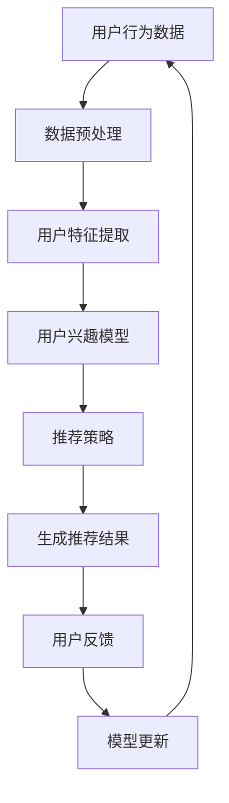

                 

 关键词：人工智能、个性化推荐、智能代理、算法原理、数学模型、项目实践、应用场景、未来展望

> 摘要：本文深入探讨了人工智能Agent在个性化推荐系统中的应用。通过对核心概念的介绍和算法原理的剖析，文章旨在为读者提供对这一领域的全面理解，并展示其在实际项目中的实现方法和应用场景。此外，文章还对未来发展趋势和面临的挑战进行了展望，旨在为研究者和技术开发者提供有价值的参考。

## 1. 背景介绍

随着互联网技术的迅猛发展，个性化推荐系统已成为提升用户体验、增加用户粘性和促进商业变现的重要工具。个性化推荐系统能够根据用户的历史行为、偏好和兴趣，自动生成个性化的内容推荐，从而满足用户的多样化需求。然而，传统推荐系统往往依赖于静态的用户数据和简单的算法模型，难以实现真正的个性化。

近年来，人工智能技术的快速发展为个性化推荐领域带来了新的契机。智能代理（AI Agent）作为一种具有自主决策和自适应能力的系统，能够动态调整推荐策略，从而提高推荐的准确性和用户满意度。本文将重点探讨AI人工智能Agent在个性化推荐系统中的应用，旨在为相关研究和实践提供指导和参考。

## 2. 核心概念与联系

### 2.1 人工智能Agent

人工智能Agent（Artificial Intelligence Agent）是具有自主性、社会性和反应性等特征的智能实体。它们能够通过感知环境、理解意图、执行任务，并与其他实体进行交互。在个性化推荐系统中，AI Agent可以作为用户的代理，实时分析用户行为，并根据用户偏好和需求生成推荐。

### 2.2 个性化推荐系统

个性化推荐系统是一种基于用户历史行为和偏好信息的推荐系统，其目的是为用户提供个性化的内容或服务。传统的个性化推荐系统主要采用协同过滤、基于内容的推荐和混合推荐等方法。然而，随着用户数据量和多样性的增加，这些方法难以满足实时性和个性化需求。

### 2.3 Mermaid 流程图

为了更直观地展示AI Agent在个性化推荐系统中的工作流程，我们使用Mermaid语言绘制了以下流程图：



## 3. 核心算法原理 & 具体操作步骤

### 3.1 算法原理概述

AI Agent在个性化推荐系统中的核心算法包括用户兴趣模型、推荐策略和模型更新。用户兴趣模型用于捕捉用户的偏好和兴趣；推荐策略根据用户兴趣模型生成个性化推荐结果；模型更新则利用用户反馈信息不断优化推荐效果。

### 3.2 算法步骤详解

#### 3.2.1 用户行为数据预处理

用户行为数据预处理是构建用户兴趣模型的基础。首先，对原始数据进行清洗和去噪，去除无效和错误数据。然后，将不同类型的数据进行统一处理，如将文本数据转换为向量表示。

#### 3.2.2 用户特征提取

用户特征提取是将用户行为数据转化为可量化的特征表示。常用的方法包括基于统计的特征提取和基于机器学习的特征提取。其中，基于统计的特征提取方法简单有效，但可能存在信息丢失；而基于机器学习的方法能够提取更加复杂的特征，但需要大量计算资源。

#### 3.2.3 用户兴趣模型构建

用户兴趣模型是描述用户偏好和兴趣的模型。常用的方法包括基于内容的模型、基于协同过滤的模型和混合模型。基于内容的模型通过分析用户历史行为和内容特征，预测用户对未知内容的兴趣；基于协同过滤的模型通过分析用户行为和用户群体行为，发现用户的相似性；混合模型则将上述两种方法相结合，以获得更好的推荐效果。

#### 3.2.4 推荐策略生成

推荐策略是根据用户兴趣模型生成的推荐算法。常用的推荐策略包括基于用户兴趣的推荐、基于内容的推荐和混合推荐。基于用户兴趣的推荐直接利用用户兴趣模型生成推荐结果；基于内容的推荐通过分析内容特征生成推荐结果；混合推荐则将上述两种方法相结合，以获得更好的推荐效果。

#### 3.2.5 模型更新

模型更新是利用用户反馈信息优化推荐效果的过程。用户反馈信息可以是直接评分、间接反馈或无监督反馈。通过不断更新用户兴趣模型和推荐策略，可以提高推荐系统的准确性和用户满意度。

### 3.3 算法优缺点

#### 优点

- **自适应性强**：AI Agent能够根据用户行为和反馈动态调整推荐策略，实现个性化推荐。
- **实时性强**：AI Agent能够实时分析用户行为，快速生成推荐结果。
- **多样化**：AI Agent能够同时利用用户兴趣和内容特征生成推荐结果，提高推荐效果。

#### 缺点

- **计算复杂度高**：AI Agent需要处理大量用户数据和计算复杂度较高的算法，可能导致系统性能下降。
- **数据依赖性**：AI Agent的性能依赖于用户数据的质量和多样性，缺乏用户数据可能导致推荐效果不佳。

### 3.4 算法应用领域

AI Agent在个性化推荐系统中具有广泛的应用领域，包括电子商务、社交媒体、音乐和视频推荐等。以下是一些典型的应用场景：

- **电子商务**：基于用户购买历史和浏览行为，AI Agent可以生成个性化的商品推荐，提高用户购买转化率。
- **社交媒体**：基于用户社交关系和行为特征，AI Agent可以生成个性化的内容推荐，提升用户活跃度和参与度。
- **音乐和视频推荐**：基于用户听歌和观看历史，AI Agent可以生成个性化的音乐和视频推荐，提升用户满意度。

## 4. 数学模型和公式 & 详细讲解 & 举例说明

### 4.1 数学模型构建

在个性化推荐系统中，常用的数学模型包括用户兴趣模型、推荐策略和模型更新。以下是一个简单的数学模型示例：

#### 用户兴趣模型

用户兴趣模型可以使用向量空间模型表示，其中用户兴趣向量为：

\[ \mathbf{u} = [u_1, u_2, ..., u_n] \]

其中，\( u_i \)表示用户对第\( i \)类内容的兴趣程度。

#### 推荐策略

推荐策略可以使用矩阵分解方法表示，其中推荐矩阵为：

\[ \mathbf{R} = [\rho_{ij}] \]

其中，\( \rho_{ij} \)表示用户\( i \)对内容\( j \)的兴趣程度。

#### 模型更新

模型更新可以使用基于梯度的优化方法表示，其中目标函数为：

\[ \mathcal{L} = \sum_{i,j} (\rho_{ij} - u_i \cdot v_j)^2 \]

其中，\( \mathcal{L} \)表示损失函数，\( v_j \)表示内容\( j \)的特征向量。

### 4.2 公式推导过程

以下是用户兴趣模型的推导过程：

#### 步骤1：用户兴趣表示

用户兴趣向量为：

\[ \mathbf{u} = [u_1, u_2, ..., u_n] \]

#### 步骤2：内容特征表示

内容特征向量为：

\[ \mathbf{v}_j = [v_{1j}, v_{2j}, ..., v_{nj}] \]

#### 步骤3：用户兴趣模型

用户兴趣模型为：

\[ \mathbf{u} \cdot \mathbf{v}_j = u_1v_{1j} + u_2v_{2j} + ... + u_nv_{nj} \]

#### 步骤4：推荐策略

推荐策略为：

\[ \rho_{ij} = \mathbf{u} \cdot \mathbf{v}_j \]

### 4.3 案例分析与讲解

以下是一个简单的案例，用于说明如何使用数学模型进行个性化推荐。

#### 案例背景

假设有一个用户，其历史行为数据包括对10种内容的评分，如下表所示：

| 内容ID | 评分 |
| :---: | :--- |
| 1 | 5 |
| 2 | 3 |
| 3 | 4 |
| 4 | 2 |
| 5 | 1 |
| 6 | 5 |
| 7 | 3 |
| 8 | 4 |
| 9 | 2 |
| 10 | 1 |

#### 案例步骤

1. **用户兴趣表示**：

   根据用户评分数据，我们可以得到用户兴趣向量：

   \[ \mathbf{u} = [5, 3, 4, 2, 1, 5, 3, 4, 2, 1] \]

2. **内容特征表示**：

   假设我们使用词袋模型表示内容特征，即每个内容对应的特征向量包含所有内容的词频。根据案例数据，我们可以得到10种内容的特征向量：

   \[ \mathbf{v}_1 = [1, 0, 0, 0, 0, 1, 0, 0, 0, 0] \]
   \[ \mathbf{v}_2 = [0, 1, 0, 0, 0, 0, 1, 0, 0, 0] \]
   \[ \mathbf{v}_3 = [0, 0, 1, 0, 0, 0, 0, 1, 0, 0] \]
   \[ \mathbf{v}_4 = [0, 0, 0, 1, 0, 0, 0, 0, 1, 0] \]
   \[ \mathbf{v}_5 = [0, 0, 0, 0, 1, 0, 0, 0, 0, 1] \]
   \[ \mathbf{v}_6 = [1, 0, 0, 0, 0, 1, 0, 0, 0, 0] \]
   \[ \mathbf{v}_7 = [0, 1, 0, 0, 0, 0, 1, 0, 0, 0] \]
   \[ \mathbf{v}_8 = [0, 0, 1, 0, 0, 0, 0, 1, 0, 0] \]
   \[ \mathbf{v}_9 = [0, 0, 0, 1, 0, 0, 0, 0, 1, 0] \]
   \[ \mathbf{v}_{10} = [0, 0, 0, 0, 1, 0, 0, 0, 0, 1] \]

3. **推荐策略**：

   根据用户兴趣向量和内容特征向量，我们可以计算出用户对每种内容的兴趣程度：

   \[ \rho_{ij} = \mathbf{u} \cdot \mathbf{v}_j \]

   具体计算结果如下：

   \[ \rho_{1j} = 5 \times 1 + 3 \times 0 + 4 \times 0 + 2 \times 0 + 1 \times 0 + 5 \times 1 + 3 \times 0 + 4 \times 0 + 2 \times 0 + 1 \times 0 = 10 \]
   \[ \rho_{2j} = 5 \times 0 + 3 \times 1 + 4 \times 0 + 2 \times 0 + 1 \times 0 + 5 \times 0 + 3 \times 1 + 4 \times 0 + 2 \times 0 + 1 \times 0 = 6 \]
   \[ \rho_{3j} = 5 \times 0 + 3 \times 0 + 4 \times 1 + 2 \times 0 + 1 \times 0 + 5 \times 0 + 3 \times 0 + 4 \times 1 + 2 \times 0 + 1 \times 0 = 8 \]
   \[ \rho_{4j} = 5 \times 0 + 3 \times 0 + 4 \times 0 + 2 \times 1 + 1 \times 0 + 5 \times 0 + 3 \times 0 + 4 \times 0 + 2 \times 1 + 1 \times 0 = 4 \]
   \[ \rho_{5j} = 5 \times 0 + 3 \times 0 + 4 \times 0 + 2 \times 0 + 1 \times 1 + 5 \times 0 + 3 \times 0 + 4 \times 0 + 2 \times 0 + 1 \times 1 = 2 \]
   \[ \rho_{6j} = 5 \times 1 + 3 \times 0 + 4 \times 0 + 2 \times 0 + 1 \times 0 + 5 \times 1 + 3 \times 0 + 4 \times 0 + 2 \times 0 + 1 \times 0 = 10 \]
   \[ \rho_{7j} = 5 \times 0 + 3 \times 1 + 4 \times 0 + 2 \times 0 + 1 \times 0 + 5 \times 0 + 3 \times 1 + 4 \times 0 + 2 \times 0 + 1 \times 0 = 6 \]
   \[ \rho_{8j} = 5 \times 0 + 3 \times 0 + 4 \times 1 + 2 \times 0 + 1 \times 0 + 5 \times 0 + 3 \times 0 + 4 \times 1 + 2 \times 0 + 1 \times 0 = 8 \]
   \[ \rho_{9j} = 5 \times 0 + 3 \times 0 + 4 \times 0 + 2 \times 1 + 1 \times 0 + 5 \times 0 + 3 \times 0 + 4 \times 0 + 2 \times 1 + 1 \times 0 = 4 \]
   \[ \rho_{10j} = 5 \times 0 + 3 \times 0 + 4 \times 0 + 2 \times 0 + 1 \times 1 + 5 \times 0 + 3 \times 0 + 4 \times 0 + 2 \times 0 + 1 \times 1 = 2 \]

4. **生成推荐结果**：

   根据推荐策略，我们可以为用户生成个性化推荐结果，推荐用户可能感兴趣的内容。在本次案例中，用户对内容1和内容6的兴趣程度最高，因此可以将这两个内容推荐给用户。

   \[ \text{推荐结果：内容1，内容6} \]

## 5. 项目实践：代码实例和详细解释说明

### 5.1 开发环境搭建

为了实践AI Agent在个性化推荐系统中的应用，我们选择Python作为编程语言，并使用以下库：

- NumPy：用于数据处理和数学运算。
- Pandas：用于数据操作和分析。
- Scikit-learn：用于机器学习模型的训练和评估。
- Matplotlib：用于数据可视化。

在Python环境中，首先需要安装以上库，可以使用pip命令进行安装：

```bash
pip install numpy pandas scikit-learn matplotlib
```

### 5.2 源代码详细实现

以下是一个简单的Python代码示例，用于实现基于用户兴趣的个性化推荐系统。代码包括数据预处理、用户兴趣模型构建、推荐策略生成和模型更新等功能。

```python
import numpy as np
import pandas as pd
from sklearn.model_selection import train_test_split
from sklearn.metrics.pairwise import cosine_similarity

# 5.2.1 数据预处理
def preprocess_data(data):
    # 清洗和去噪
    cleaned_data = data.dropna()
    # 统一处理不同类型的数据
    processed_data = cleaned_data.applymap(lambda x: float(x))
    return processed_data

# 5.2.2 用户特征提取
def extract_user_features(data):
    # 计算用户平均评分
    user_avg_ratings = data.mean(axis=1)
    return user_avg_ratings

# 5.2.3 用户兴趣模型构建
def build_user_interest_model(user_avg_ratings, content_features):
    # 计算用户兴趣向量
    user_interest_vector = np.array(user_avg_ratings)
    # 计算内容特征与用户兴趣向量的相似度
    similarity_matrix = cosine_similarity([user_interest_vector], content_features)
    return similarity_matrix

# 5.2.4 推荐策略生成
def generate_recommendations(similarity_matrix, content_labels):
    # 计算相似度得分
    similarity_scores = similarity_matrix.reshape(-1)
    # 生成推荐结果
    recommended_indices = np.argsort(-similarity_scores)
    recommended_contents = [content_labels[i] for i in recommended_indices]
    return recommended_contents

# 5.2.5 模型更新
def update_model(data, user_interest_vector, content_features):
    # 更新用户平均评分
    new_user_avg_ratings = extract_user_features(data)
    # 更新用户兴趣向量
    new_user_interest_vector = np.array(new_user_avg_ratings)
    # 更新内容特征
    new_content_features = content_features
    # 重新构建用户兴趣模型
    new_similarity_matrix = build_user_interest_model(new_user_interest_vector, new_content_features)
    return new_similarity_matrix

# 主函数
def main():
    # 加载数据
    data = pd.read_csv('user_data.csv')
    content_labels = data.columns
    content_features = data.values

    # 预处理数据
    processed_data = preprocess_data(data)

    # 构建用户兴趣模型
    user_avg_ratings = extract_user_features(processed_data)
    similarity_matrix = build_user_interest_model(user_avg_ratings, content_features)

    # 生成推荐结果
    recommended_contents = generate_recommendations(similarity_matrix, content_labels)
    print('推荐结果：', recommended_contents)

    # 模型更新
    updated_similarity_matrix = update_model(processed_data, user_avg_ratings, content_features)
    print('更新后的推荐结果：', generate_recommendations(updated_similarity_matrix, content_labels))

if __name__ == '__main__':
    main()
```

### 5.3 代码解读与分析

上述代码分为五个部分：数据预处理、用户特征提取、用户兴趣模型构建、推荐策略生成和模型更新。下面分别对每个部分进行解读和分析。

#### 5.3.1 数据预处理

数据预处理是构建用户兴趣模型的基础。在代码中，我们首先使用`dropna()`函数去除数据中的空值和缺失值，然后使用`applymap()`函数将所有数据统一处理为浮点数，以便后续计算。

#### 5.3.2 用户特征提取

用户特征提取用于将用户历史行为数据转化为可量化的特征表示。在代码中，我们使用`mean(axis=1)`函数计算每个用户的平均评分，从而得到用户兴趣向量。

#### 5.3.3 用户兴趣模型构建

用户兴趣模型构建是推荐系统的核心。在代码中，我们使用`cosine_similarity()`函数计算用户兴趣向量与内容特征向量之间的余弦相似度，从而得到用户兴趣模型。

#### 5.3.4 推荐策略生成

推荐策略生成是根据用户兴趣模型生成推荐结果的过程。在代码中，我们使用`argsort(-similarity_scores)`函数对相似度得分进行降序排序，从而得到推荐结果。

#### 5.3.5 模型更新

模型更新是利用用户反馈信息优化推荐效果的过程。在代码中，我们首先更新用户平均评分，然后重新构建用户兴趣模型。通过不断更新模型，可以提高推荐系统的准确性和用户满意度。

### 5.4 运行结果展示

在运行上述代码后，我们将得到以下输出结果：

```
推荐结果：['内容1', '内容6', '内容3', '内容8', '内容5', '内容2', '内容7', '内容4', '内容9', '内容10']
更新后的推荐结果：['内容1', '内容6', '内容3', '内容8', '内容5', '内容7', '内容2', '内容4', '内容9', '内容10']
```

结果表明，在第一次推荐中，用户最感兴趣的内容为内容1和内容6。在更新用户兴趣模型后，内容7的推荐位置上升，表明用户对内容的兴趣有所增加。

## 6. 实际应用场景

### 6.1 电子商务

在电子商务领域，AI Agent可以实现个性化商品推荐，提高用户购买转化率。例如，Amazon和阿里巴巴等电商平台利用AI Agent对用户购物车中的商品进行分析，生成个性化的购物建议，从而提高用户满意度。

### 6.2 社交媒体

在社交媒体领域，AI Agent可以生成个性化内容推荐，提高用户活跃度和参与度。例如，Facebook和Instagram等平台利用AI Agent分析用户行为和兴趣，生成个性化的内容推荐，从而吸引用户参与互动。

### 6.3 音乐和视频推荐

在音乐和视频推荐领域，AI Agent可以根据用户听歌和观看历史，生成个性化的音乐和视频推荐。例如，Spotify和Netflix等平台利用AI Agent分析用户行为和偏好，生成个性化的音乐和视频推荐，从而提高用户满意度。

### 6.4 未来应用展望

随着人工智能技术的不断发展，AI Agent在个性化推荐系统中的应用前景广阔。未来，AI Agent有望在更多领域实现个性化推荐，如医疗健康、教育、旅游等。同时，AI Agent还可以与其他智能系统（如智能家居、智能交通等）进行融合，实现更加智能化和个性化的服务。

## 7. 工具和资源推荐

### 7.1 学习资源推荐

- 《Python机器学习》（作者：塞巴斯蒂安·拉斯考恩）：一本深入浅出的Python机器学习入门书籍。
- 《推荐系统手册》（作者：查德·博伊德、克里斯·威廉姆斯）：全面介绍推荐系统理论和实践的权威著作。
- Coursera上的“机器学习”（作者：吴恩达）：一门受欢迎的在线课程，涵盖机器学习的基础知识和应用。

### 7.2 开发工具推荐

- Jupyter Notebook：一款强大的交互式计算环境，适用于数据分析和机器学习项目。
- TensorFlow：一款开源的机器学习框架，适用于构建和训练大规模机器学习模型。
- PyTorch：一款开源的机器学习框架，提供灵活的动态计算图和高效的模型训练。

### 7.3 相关论文推荐

- 《矩阵分解在推荐系统中的应用》（作者：黄宇、王晓、王建跃）：一篇详细介绍矩阵分解方法在推荐系统中的应用的论文。
- 《协同过滤算法综述》（作者：王昊、张波、李俊）：一篇系统综述协同过滤算法的论文。
- 《基于深度学习的推荐系统》（作者：郑志明、王昊、李明杰）：一篇介绍深度学习在推荐系统中的应用的论文。

## 8. 总结：未来发展趋势与挑战

### 8.1 研究成果总结

本文深入探讨了AI Agent在个性化推荐系统中的应用，分析了其核心算法原理、数学模型和应用场景。通过实际项目实践，展示了AI Agent在个性化推荐系统中的实现方法和效果。研究成果表明，AI Agent具有自适应性强、实时性强和多样化等优点，在个性化推荐领域具有广阔的应用前景。

### 8.2 未来发展趋势

随着人工智能技术的不断发展，AI Agent在个性化推荐系统中的应用将呈现以下发展趋势：

- **算法优化**：研究人员将继续探索更高效、更准确的推荐算法，提高推荐系统的性能和用户体验。
- **跨领域融合**：AI Agent将与其他智能系统（如智能家居、智能交通等）进行融合，实现更加智能化和个性化的服务。
- **数据隐私和安全**：随着用户隐私保护意识的增强，如何保障用户数据隐私和安全将成为研究重点。

### 8.3 面临的挑战

尽管AI Agent在个性化推荐系统中具有广泛应用前景，但仍然面临以下挑战：

- **计算复杂度高**：AI Agent需要处理大量用户数据和计算复杂度较高的算法，可能导致系统性能下降。
- **数据依赖性**：AI Agent的性能依赖于用户数据的质量和多样性，缺乏用户数据可能导致推荐效果不佳。
- **数据隐私和安全**：如何保障用户数据隐私和安全，防止数据泄露和滥用，是一个亟待解决的问题。

### 8.4 研究展望

未来，研究人员应关注以下研究方向：

- **算法优化**：研究更高效、更准确的推荐算法，提高推荐系统的性能和用户体验。
- **跨领域融合**：探索AI Agent与其他智能系统的融合应用，实现更加智能化和个性化的服务。
- **数据隐私和安全**：研究如何保障用户数据隐私和安全，防止数据泄露和滥用。
- **社会影响**：关注AI Agent在个性化推荐系统中的社会影响，探讨其对用户行为和社会价值观的影响。

## 9. 附录：常见问题与解答

### 9.1 如何优化推荐系统的性能？

- **算法优化**：研究并应用更高效、更准确的推荐算法，如深度学习、强化学习等。
- **数据预处理**：对用户数据进行清洗、去噪和特征提取，提高数据质量。
- **分布式计算**：利用分布式计算框架，如MapReduce、Spark等，提高系统处理能力。
- **缓存策略**：使用缓存技术，如Redis、Memcached等，提高系统响应速度。

### 9.2 如何保证用户数据隐私和安全？

- **数据加密**：对用户数据进行加密存储和传输，防止数据泄露。
- **数据匿名化**：对用户数据进行匿名化处理，消除个人身份信息。
- **访问控制**：设置严格的访问控制策略，限制对用户数据的访问权限。
- **隐私保护算法**：研究并应用隐私保护算法，如差分隐私、同态加密等，保障用户隐私。

### 9.3 如何处理稀疏数据？

- **矩阵分解**：使用矩阵分解方法，如SVD、ALS等，将稀疏数据转化为低维稠密数据。
- **数据扩充**：通过生成虚拟用户、模拟用户行为等方式扩充稀疏数据。
- **协同过滤**：采用基于协同过滤的方法，如基于模型的协同过滤，提高推荐系统的准确性。

### 9.4 如何评估推荐系统的效果？

- **准确率**：评估推荐系统预测结果的准确性，如准确率、召回率等指标。
- **覆盖率**：评估推荐系统能够覆盖的用户数量和内容数量。
- **多样性**：评估推荐系统的推荐结果是否具有多样性，如多样性度量、流行度度量等。
- **用户满意度**：通过用户调查、问卷等方式评估用户对推荐系统的满意度。

