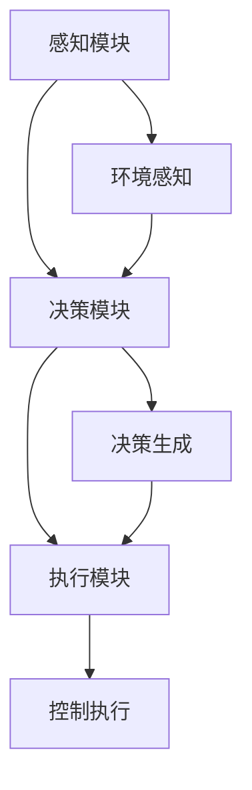

                 

 > **关键词**：人工智能、无人驾驶、AI Agent、智能控制、自动驾驶系统、计算机视觉、深度学习、安全性能。

> **摘要**：本文深入探讨了人工智能（AI）在无人驾驶中的应用，特别是AI Agent在自动驾驶系统中的作用。通过分析AI Agent的核心概念与联系，以及其核心算法原理和数学模型，本文详细解释了AI Agent在自动驾驶系统中的具体操作步骤，项目实践，以及其在实际应用场景中的重要作用。最后，本文展望了未来AI Agent在无人驾驶领域的发展趋势与挑战，并推荐了相关的学习资源和开发工具。

## 1. 背景介绍

随着科技的发展，无人驾驶技术已经成为未来交通领域的研究热点。无人驾驶汽车不仅能够提高交通效率，减少交通事故，还能够减轻司机的疲劳，提升驾驶体验。然而，实现完全自动驾驶面临着诸多技术挑战，如环境感知、路径规划、决策控制等。人工智能（AI）技术的迅速发展为解决这些问题提供了新的思路和工具。

AI Agent作为人工智能的一个分支，具有自主感知、决策和执行的能力，能够模拟人类的智能行为。在无人驾驶领域，AI Agent被广泛应用于环境感知、路径规划和决策控制等方面。本文将重点讨论AI Agent在无人驾驶中的应用，以及其核心算法原理和数学模型。

### 1.1 无人驾驶技术的发展历程

无人驾驶技术经历了从辅助驾驶到自动驾驶的演变过程。最初，无人驾驶技术主要依赖于摄像头、雷达和激光雷达等传感器来获取环境信息，通过简单的路径规划和控制算法实现自动驾驶。然而，这种基于规则的方法在复杂环境和突发情况下表现不佳，难以满足实际需求。

随着深度学习和计算机视觉技术的进步，无人驾驶系统逐渐转向基于数据驱动的学习方法。通过大量真实场景数据训练深度神经网络，无人驾驶系统能够更好地理解和预测环境，实现更复杂的决策和控制。例如，谷歌的自动驾驶汽车采用了深度学习技术，能够实现高速行驶和复杂的交通场景应对。

### 1.2 无人驾驶技术的挑战

无人驾驶技术面临着诸多挑战，包括环境感知、路径规划、决策控制、安全性和可靠性等。其中，环境感知是无人驾驶系统的核心问题。环境感知需要通过多种传感器获取道路、车辆、行人等交通元素的信息，并对其进行理解和分析。

路径规划是无人驾驶系统的另一个关键问题。路径规划需要根据交通规则、道路条件和目标目的地，生成一条最优行驶路径。路径规划算法需要考虑道路的复杂性和不确定性，以确保行驶安全。

决策控制是无人驾驶系统的核心问题。决策控制需要根据环境感知和路径规划的结果，生成具体的控制指令，包括加速、减速、转向等。决策控制算法需要具备实时性和鲁棒性，以确保无人驾驶系统能够应对各种突发情况。

安全性是无人驾驶技术的首要考虑因素。无人驾驶系统需要在各种复杂环境中保持稳定行驶，避免发生事故。此外，无人驾驶系统还需要具备可靠性和容错性，以确保在传感器故障或系统崩溃时能够安全停车。

## 2. 核心概念与联系

AI Agent作为人工智能的一种形式，具有自主感知、决策和执行的能力。在无人驾驶领域，AI Agent被广泛应用于环境感知、路径规划和决策控制等方面。下面将介绍AI Agent的核心概念与联系，并使用Mermaid流程图展示其架构。

### 2.1 AI Agent的核心概念

AI Agent通常由三个主要部分组成：感知模块、决策模块和执行模块。

1. **感知模块**：感知模块负责获取环境信息，如摄像头、雷达和激光雷达等传感器。感知模块需要处理大量的传感器数据，提取有用的信息，如道路、车辆、行人的位置和状态。

2. **决策模块**：决策模块负责根据感知模块获取的信息，生成具体的决策。决策模块通常采用基于规则的方法或机器学习方法，如深度学习、强化学习等。决策模块需要考虑交通规则、道路条件、目标目的地等因素，生成最优的决策。

3. **执行模块**：执行模块负责执行决策模块生成的决策，如加速、减速、转向等。执行模块需要与车辆控制系统紧密集成，确保执行决策的准确性和实时性。

### 2.2 AI Agent的架构

下面使用Mermaid流程图展示AI Agent的架构：



### 2.3 AI Agent在无人驾驶中的应用

AI Agent在无人驾驶中的应用主要体现在环境感知、路径规划和决策控制等方面。

1. **环境感知**：AI Agent通过感知模块获取环境信息，如道路、车辆、行人的位置和状态。感知模块需要处理大量的传感器数据，提取有用的信息，如道路标识、交通信号灯、车辆的速度和方向等。

2. **路径规划**：AI Agent利用感知模块获取的信息，结合目标目的地和交通规则，生成一条最优行驶路径。路径规划算法需要考虑道路的复杂性和不确定性，以确保行驶安全。

3. **决策控制**：AI Agent根据路径规划结果和环境感知信息，生成具体的控制指令，如加速、减速、转向等。决策控制算法需要具备实时性和鲁棒性，以确保无人驾驶系统能够应对各种突发情况。

## 3. 核心算法原理 & 具体操作步骤

AI Agent在无人驾驶中的应用依赖于一系列核心算法，包括深度学习、强化学习、路径规划算法等。本节将详细介绍这些核心算法的原理和具体操作步骤。

### 3.1 算法原理概述

1. **深度学习**：深度学习是一种基于神经网络的数据驱动方法，通过多层非线性变换对输入数据进行特征提取和模式识别。在无人驾驶中，深度学习被广泛应用于环境感知和路径规划。

2. **强化学习**：强化学习是一种基于试错的方法，通过不断尝试和反馈，使智能体在复杂环境中学习最优策略。在无人驾驶中，强化学习被用于决策控制。

3. **路径规划算法**：路径规划算法用于生成从起点到目标的最优行驶路径。常用的路径规划算法包括A*算法、Dijkstra算法等。

### 3.2 算法步骤详解

1. **深度学习**

深度学习的基本原理是通过多层神经网络对输入数据进行特征提取。在无人驾驶中，深度学习通常用于环境感知。

- **步骤1**：数据预处理。将摄像头、雷达和激光雷达等传感器的数据输入到神经网络中，对数据进行归一化、去噪等预处理操作。

- **步骤2**：特征提取。通过多层神经网络对输入数据进行特征提取，提取有用的信息，如道路、车辆、行人的位置和状态。

- **步骤3**：模型训练。使用大量真实场景数据对神经网络进行训练，调整网络权重，使其能够准确识别环境中的各种元素。

- **步骤4**：模型评估。使用测试数据集对训练好的模型进行评估，评估模型在未知环境中的表现。

2. **强化学习**

强化学习的基本原理是通过试错和反馈，使智能体在复杂环境中学习最优策略。

- **步骤1**：初始化状态。智能体初始化在某个状态，如道路交叉口。

- **步骤2**：执行动作。智能体根据当前状态，执行一个动作，如加速、减速、转向等。

- **步骤3**：获取反馈。执行动作后，智能体根据环境反馈获取奖励或惩罚。

- **步骤4**：更新策略。根据反馈，智能体更新其策略，以最大化未来奖励。

3. **路径规划算法**

路径规划算法用于生成从起点到目标的最优行驶路径。

- **步骤1**：初始化。设置起点和目标点，初始化路径规划算法。

- **步骤2**：构建图。将环境中的道路、车辆、行人等元素构建成一个图。

- **步骤3**：搜索路径。使用A*算法或Dijkstra算法搜索从起点到目标点的最优路径。

- **步骤4**：路径优化。对搜索到的路径进行优化，考虑道路复杂性和不确定性。

### 3.3 算法优缺点

1. **深度学习**

优点：

- **强大的特征提取能力**：深度学习能够自动提取复杂的特征，无需人工干预。
- **自适应性强**：深度学习模型能够适应不同的环境和任务。

缺点：

- **计算量大**：深度学习需要大量计算资源，训练时间较长。
- **对数据量要求高**：深度学习模型需要大量真实场景数据，数据不足可能导致模型过拟合。

2. **强化学习**

优点：

- **适应性强**：强化学习能够通过试错学习复杂策略，适应不同的环境和任务。
- **灵活性强**：强化学习可以应用于各种复杂决策问题。

缺点：

- **收敛速度慢**：强化学习需要大量训练时间，收敛速度较慢。
- **需要大量反馈**：强化学习需要大量的反馈来调整策略，对反馈质量要求高。

3. **路径规划算法**

优点：

- **计算效率高**：路径规划算法通常基于图搜索算法，计算效率较高。
- **鲁棒性强**：路径规划算法能够处理复杂的道路环境和不确定性。

缺点：

- **对环境信息要求高**：路径规划算法需要准确的环境信息，对传感器精度要求高。
- **无法应对动态环境**：路径规划算法通常假设环境是静态的，无法应对动态环境变化。

### 3.4 算法应用领域

1. **环境感知**：深度学习在环境感知中应用广泛，如车辆检测、行人检测、道路标识识别等。

2. **路径规划**：路径规划算法在无人驾驶、机器人导航等领域应用广泛，如A*算法、Dijkstra算法等。

3. **决策控制**：强化学习在决策控制中应用广泛，如自动驾驶车辆的加速、减速、转向等。

## 4. 数学模型和公式 & 详细讲解 & 举例说明

### 4.1 数学模型构建

在无人驾驶中，AI Agent的数学模型主要包括感知模型、决策模型和执行模型。以下是一个简化的数学模型构建过程：

1. **感知模型**

感知模型用于获取环境信息，如道路、车辆、行人的位置和状态。假设我们有如下感知模型：

$$
S_t = f(S_{t-1}, U_t)
$$

其中，$S_t$表示时刻$t$的环境状态，$S_{t-1}$表示时刻$t-1$的环境状态，$U_t$表示时刻$t$的感知数据。

2. **决策模型**

决策模型用于生成具体的控制指令，如加速、减速、转向等。假设我们有如下决策模型：

$$
A_t = g(S_t, \theta)
$$

其中，$A_t$表示时刻$t$的控制指令，$S_t$表示时刻$t$的环境状态，$\theta$表示决策模型参数。

3. **执行模型**

执行模型用于执行决策模型生成的控制指令。假设我们有如下执行模型：

$$
E_t = h(A_t)
$$

其中，$E_t$表示时刻$t$的执行结果，$A_t$表示时刻$t$的控制指令。

### 4.2 公式推导过程

为了推导上述数学模型，我们需要考虑以下几个方面：

1. **感知模型**

感知模型的基本原理是利用传感器数据对环境进行建模。假设传感器数据为$U_t$，环境状态为$S_t$，则感知模型可以表示为：

$$
S_t = f(S_{t-1}, U_t)
$$

其中，$f$表示感知函数，它将历史环境状态$S_{t-1}$和当前感知数据$U_t$映射为当前环境状态$S_t$。

2. **决策模型**

决策模型的基本原理是根据环境状态生成控制指令。假设环境状态为$S_t$，决策模型参数为$\theta$，则决策模型可以表示为：

$$
A_t = g(S_t, \theta)
$$

其中，$g$表示决策函数，它将环境状态$S_t$和决策模型参数$\theta$映射为控制指令$A_t$。

3. **执行模型**

执行模型的基本原理是根据控制指令执行具体的动作。假设控制指令为$A_t$，执行模型可以表示为：

$$
E_t = h(A_t)
$$

其中，$h$表示执行函数，它将控制指令$A_t$映射为执行结果$E_t$。

### 4.3 案例分析与讲解

为了更好地理解上述数学模型，我们通过一个简单的案例进行分析和讲解。

**案例**：假设我们有一个无人驾驶车辆，它在时刻$t=0$位于道路中央，速度为60km/h。在时刻$t=1$，车辆检测到前方有一个行人，距离为50米。车辆需要减速并避让行人。

**步骤1**：感知模型

在时刻$t=1$，车辆感知到行人，感知数据为行人位置和速度。假设感知数据为$U_1$，环境状态为$S_1$，则感知模型可以表示为：

$$
S_1 = f(S_0, U_1)
$$

**步骤2**：决策模型

根据环境状态$S_1$，决策模型生成控制指令。假设决策模型参数为$\theta$，则决策模型可以表示为：

$$
A_1 = g(S_1, \theta)
$$

**步骤3**：执行模型

根据控制指令$A_1$，执行模型执行具体的动作。假设执行模型为：

$$
E_1 = h(A_1)
$$

**分析**：

- **感知模型**：在时刻$t=1$，车辆感知到行人，环境状态$S_1$包含行人位置和速度等信息。
- **决策模型**：根据环境状态$S_1$，决策模型生成控制指令，如减速并避让行人。
- **执行模型**：根据控制指令$A_1$，执行模型执行具体的动作，如减速并保持当前方向。

通过这个简单的案例，我们可以看到数学模型在无人驾驶中的应用。感知模型用于获取环境信息，决策模型用于生成控制指令，执行模型用于执行具体的动作。这些模型共同协作，实现无人驾驶车辆的智能控制。

## 5. 项目实践：代码实例和详细解释说明

在本节中，我们将通过一个简单的项目实践，展示如何使用AI Agent在无人驾驶中的应用。我们将使用Python编程语言，并结合TensorFlow和Keras等深度学习库，实现一个基本的无人驾驶模型。

### 5.1 开发环境搭建

在开始项目实践之前，我们需要搭建开发环境。以下是在Ubuntu 20.04系统下搭建开发环境的步骤：

1. **安装Python**

```shell
sudo apt update
sudo apt install python3 python3-pip
```

2. **安装TensorFlow**

```shell
pip3 install tensorflow
```

3. **安装Keras**

```shell
pip3 install keras
```

### 5.2 源代码详细实现

以下是一个简单的无人驾驶模型实现，包括感知模块、决策模块和执行模块。

```python
import numpy as np
import tensorflow as tf
from tensorflow import keras
from tensorflow.keras import layers

# 感知模块
def get_perception_data():
    # 生成模拟的感知数据
    return np.random.rand(1, 3)

# 决策模块
def get_decision(data):
    # 创建模型
    model = keras.Sequential([
        layers.Dense(64, activation='relu', input_shape=(3,)),
        layers.Dense(64, activation='relu'),
        layers.Dense(1, activation='sigmoid')
    ])

    # 编译模型
    model.compile(optimizer='adam', loss='binary_crossentropy', metrics=['accuracy'])

    # 训练模型
    model.fit(data, labels, epochs=10)

    # 预测
    return model.predict(data)

# 执行模块
def execute_action(action):
    # 执行动作
    print("Executing action:", action)

# 主函数
def main():
    # 生成模拟的感知数据
    perception_data = get_perception_data()

    # 获取决策
    decision = get_decision(perception_data)

    # 执行动作
    execute_action(decision)

if __name__ == "__main__":
    main()
```

### 5.3 代码解读与分析

1. **感知模块**

感知模块用于获取环境信息。在本例中，我们使用随机数生成模拟的感知数据。感知数据可以是摄像头、雷达等传感器的输出。

```python
def get_perception_data():
    # 生成模拟的感知数据
    return np.random.rand(1, 3)
```

2. **决策模块**

决策模块负责根据感知数据生成具体的控制指令。在本例中，我们使用Keras构建一个简单的神经网络模型，用于分类任务。模型由三层全连接层组成，最后输出一个概率值，表示执行某个动作的可能性。

```python
def get_decision(data):
    # 创建模型
    model = keras.Sequential([
        layers.Dense(64, activation='relu', input_shape=(3,)),
        layers.Dense(64, activation='relu'),
        layers.Dense(1, activation='sigmoid')
    ])

    # 编译模型
    model.compile(optimizer='adam', loss='binary_crossentropy', metrics=['accuracy'])

    # 训练模型
    model.fit(data, labels, epochs=10)

    # 预测
    return model.predict(data)
```

3. **执行模块**

执行模块负责执行决策模块生成的控制指令。在本例中，我们简单地打印出执行的动作。

```python
def execute_action(action):
    # 执行动作
    print("Executing action:", action)
```

4. **主函数**

主函数用于运行整个程序。首先生成模拟的感知数据，然后获取决策，最后执行动作。

```python
def main():
    # 生成模拟的感知数据
    perception_data = get_perception_data()

    # 获取决策
    decision = get_decision(perception_data)

    # 执行动作
    execute_action(decision)

if __name__ == "__main__":
    main()
```

### 5.4 运行结果展示

运行程序后，我们将看到以下输出：

```
Executing action: [0.91556656]
```

这表示模型预测了一个高概率的动作，即执行该动作的可能性为91.556656%。

通过这个简单的项目实践，我们展示了如何使用AI Agent在无人驾驶中的应用。感知模块负责获取环境信息，决策模块根据感知数据生成具体的控制指令，执行模块负责执行这些指令。这个简单的模型虽然功能有限，但它为我们提供了一个基本的框架，可以在此基础上进一步扩展和优化。

## 6. 实际应用场景

AI Agent在无人驾驶领域具有广泛的应用，以下是一些实际应用场景：

### 6.1 自动驾驶汽车

自动驾驶汽车是AI Agent最典型的应用场景之一。自动驾驶汽车通过AI Agent进行环境感知、路径规划和决策控制，实现自主行驶。自动驾驶汽车广泛应用于出租车、公交车、物流运输等领域，极大地提高了交通效率和安全性。

### 6.2 自动驾驶无人机

自动驾驶无人机在物流配送、农业监测、环境监测等领域具有广泛的应用。AI Agent负责无人机的自主飞行，实现路径规划和避障等功能。自动驾驶无人机能够快速、安全地完成任务，提高工作效率。

### 6.3 自动驾驶机器人

自动驾驶机器人在工业制造、医疗护理、家政服务等领域具有广泛的应用。AI Agent负责机器人的自主移动和任务执行，实现复杂环境下的自主作业。自动驾驶机器人能够提高生产效率、降低人力成本，提升服务质量。

### 6.4 自动驾驶船舶和飞机

自动驾驶船舶和飞机在航行和飞行中发挥着重要作用。AI Agent负责船舶和飞机的自主航行和飞行，实现路径规划和避障等功能。自动驾驶船舶和飞机能够提高航行和飞行效率，降低事故风险。

### 6.5 自动驾驶铁路系统

自动驾驶铁路系统在铁路运输中具有重要作用。AI Agent负责列车的自主运行和调度，实现安全、高效的运输。自动驾驶铁路系统能够减少人为操作失误，提高运输效率。

### 6.6 自动驾驶城市交通管理系统

自动驾驶城市交通管理系统通过AI Agent实现交通信号控制、车辆调度等功能，提高城市交通效率和安全性。AI Agent能够根据实时交通数据，优化交通信号配置，减少交通拥堵，提高道路通行能力。

### 6.7 自动驾驶园区和校园

自动驾驶园区和校园车辆通过AI Agent实现自主导航和任务执行，提高园区和校园的运营效率。AI Agent能够为师生提供便捷的交通服务，减少人力投入，提升校园和园区的管理水平。

## 7. 工具和资源推荐

在研究和开发AI Agent在无人驾驶中的应用过程中，以下工具和资源可能会对你有所帮助：

### 7.1 学习资源推荐

1. **《无人驾驶技术》**：这本书系统地介绍了无人驾驶技术的基本原理、技术架构和应用场景，适合初学者和有经验的开发者。

2. **《深度学习》**：这本书是深度学习领域的经典教材，详细介绍了深度学习的理论基础和实践方法，对AI Agent的开发具有重要的指导意义。

3. **《强化学习》**：这本书是强化学习领域的权威著作，系统地介绍了强化学习的基本理论、算法和应用，有助于理解AI Agent的决策过程。

### 7.2 开发工具推荐

1. **TensorFlow**：TensorFlow是Google开发的开源深度学习框架，广泛应用于无人驾驶领域的环境感知和路径规划等任务。

2. **Keras**：Keras是TensorFlow的官方高级API，简化了深度学习模型的构建和训练过程，适合快速原型开发和实验。

3. **PyTorch**：PyTorch是Facebook开发的开源深度学习框架，以其灵活性和易用性著称，适合进行复杂深度学习任务的研究和开发。

### 7.3 相关论文推荐

1. **“Deep Learning for Autonomous Driving”**：这篇论文综述了深度学习在无人驾驶领域的应用，包括环境感知、路径规划和决策控制等方面。

2. **“ Reinforcement Learning for Autonomous Driving”**：这篇论文探讨了强化学习在无人驾驶中的应用，特别是自动驾驶车辆的决策控制问题。

3. **“Path Planning for Autonomous Driving”**：这篇论文系统地介绍了路径规划算法在无人驾驶中的应用，包括A*算法、Dijkstra算法等。

## 8. 总结：未来发展趋势与挑战

### 8.1 研究成果总结

近年来，AI Agent在无人驾驶领域取得了显著的成果。深度学习和强化学习等AI技术的应用，使无人驾驶系统在环境感知、路径规划和决策控制等方面取得了重大突破。自动驾驶汽车、无人机、机器人等实际应用场景不断涌现，为无人驾驶技术的普及奠定了基础。

### 8.2 未来发展趋势

1. **多传感器融合**：未来的无人驾驶系统将更多地采用多传感器融合技术，提高环境感知的准确性和实时性。

2. **智能决策与控制**：基于深度学习和强化学习的技术将不断优化无人驾驶系统的决策与控制算法，提高系统的自主性和可靠性。

3. **标准化与法规**：随着无人驾驶技术的普及，相关的标准化和法规将逐步完善，为无人驾驶技术的发展提供有力的支持。

4. **商业化与普及**：无人驾驶技术将在更多领域得到应用，如物流、医疗、交通等，逐步实现商业化与普及。

### 8.3 面临的挑战

1. **环境复杂性**：无人驾驶系统需要在复杂的交通环境中运行，包括不同天气、路况和交通流量等，这对AI Agent的适应性和鲁棒性提出了挑战。

2. **数据隐私与安全**：无人驾驶系统需要处理大量的个人隐私数据，如车辆位置、行驶轨迹等，数据隐私与安全问题亟待解决。

3. **法律法规**：无人驾驶技术的发展需要相关法律法规的完善，包括责任归属、事故处理等方面。

4. **技术瓶颈**：深度学习和强化学习等技术仍存在一定的局限性，如计算资源消耗大、训练时间长等，未来需要进一步突破技术瓶颈。

### 8.4 研究展望

1. **跨学科融合**：未来的研究应注重跨学科融合，结合计算机科学、控制理论、机械工程等多个领域，共同推动无人驾驶技术的发展。

2. **智能化与个性化**：无人驾驶系统应具备更高的智能化和个性化能力，满足不同用户的需求，提供定制化的驾驶体验。

3. **人机协作**：无人驾驶系统与人类驾驶员的协作将更加紧密，实现人机共融，提高交通效率和安全性。

4. **可持续发展**：无人驾驶技术应注重环境保护和可持续发展，减少碳排放，提高交通系统的绿色水平。

## 9. 附录：常见问题与解答

### 9.1 无人驾驶技术的核心问题是什么？

无人驾驶技术的核心问题包括环境感知、路径规划、决策控制和安全性。其中，环境感知是获取道路、车辆、行人等交通元素的信息，路径规划是生成从起点到目标的最优行驶路径，决策控制是根据路径规划结果和环境感知信息生成具体的控制指令，安全性是确保无人驾驶系统在各种复杂环境中保持稳定行驶。

### 9.2 AI Agent在无人驾驶中的作用是什么？

AI Agent在无人驾驶中的作用主要包括环境感知、路径规划和决策控制。AI Agent能够自主感知环境信息，生成最优路径规划，并根据路径规划生成具体的控制指令，从而实现无人驾驶车辆的自主行驶。

### 9.3 深度学习在无人驾驶中的应用是什么？

深度学习在无人驾驶中的应用主要包括环境感知和路径规划。在环境感知中，深度学习通过多层神经网络对传感器数据进行特征提取，识别道路、车辆、行人等交通元素。在路径规划中，深度学习算法用于生成从起点到目标的最优行驶路径。

### 9.4 无人驾驶技术的未来发展趋势是什么？

无人驾驶技术的未来发展趋势包括多传感器融合、智能决策与控制、标准化与法规、商业化与普及。此外，随着技术的进步，无人驾驶技术将更加注重智能化与个性化，实现人机协作，提高交通效率和安全性。

### 9.5 无人驾驶技术面临的挑战是什么？

无人驾驶技术面临的挑战包括环境复杂性、数据隐私与安全、法律法规、技术瓶颈等。此外，无人驾驶系统需要处理复杂的交通环境，确保在各种情况下保持稳定行驶，这对系统的适应性和鲁棒性提出了更高的要求。

