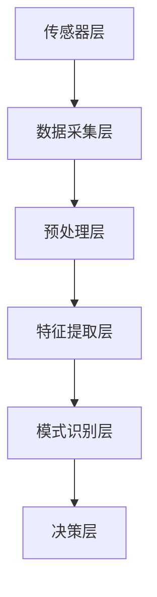

                 

关键词：人工智能，智能体，感知机制，AI代理，认知模型

摘要：本文深入探讨了人工智能（AI）中的智能体概念及其感知机制。首先，对AI及智能体的背景进行了介绍，然后详细解析了感知机制的理论基础和实现方法。接着，讨论了核心算法原理，并给出了数学模型和公式的推导过程。文章还通过实际项目实践展示了算法的应用，并分析了其在实际应用场景中的价值。最后，对未来的发展趋势和面临的挑战进行了展望，并推荐了相关工具和资源。

## 1. 背景介绍

人工智能（AI）作为计算机科学的一个重要分支，旨在使计算机具备类似人类智能的能力。智能体（Agent）是AI系统中的一个基本组成部分，它可以在复杂环境中自主行动，以实现特定的目标。智能体的核心特征包括自主性、反应性、适应性、社会性和认知性。其中，感知机制是智能体进行自主行动的基础。

感知机制是指智能体通过感知环境中的各种信息，获取关于环境状态的知识，并据此调整自身行为的能力。在AI系统中，感知机制通常涉及传感器数据的采集、处理和解释，以及基于这些数据的决策生成。

### 1.1 人工智能的发展历程

人工智能的发展经历了数个阶段。从最初的符号主义（Symbolic AI）到基于规则的专家系统（Expert Systems），再到基于知识的系统（Knowledge-Based Systems），以及当前的主流方法——机器学习和深度学习（Machine Learning and Deep Learning）。随着计算能力和算法的进步，人工智能在图像识别、自然语言处理、推荐系统等领域取得了显著的成果。

### 1.2 智能体的定义和分类

智能体可以定义为能够在复杂环境中执行任务的自主实体。根据智能体的行动方式，可以将智能体分为反应型（Reactive）智能体、目标导向（Goal-Directed）智能体和认知型（Cognitive）智能体。

- **反应型智能体**：这类智能体仅根据当前环境的状态作出反应，而不考虑过去的行为或未来的目标。它们通常使用感知器来获取环境信息，并通过预定义的规则来生成行为。
  
- **目标导向智能体**：这类智能体不仅能够感知环境，还能根据目标调整其行为。它们通常采用规划算法来制定行动计划，并根据环境反馈调整策略。

- **认知型智能体**：这类智能体具有更高的认知能力，能够理解、学习和推理。它们可以自主学习环境中的规律，并在此基础上进行高级决策。

### 1.3 感知机制的重要性

感知机制是智能体的核心能力之一，它决定了智能体能否准确获取和处理环境信息，从而进行有效的决策和行动。在人工智能系统中，感知机制的应用包括：

- **传感器数据采集**：通过各种传感器（如摄像头、麦克风、温度传感器等）收集环境数据。
  
- **数据预处理**：对采集到的数据进行清洗、归一化等处理，以消除噪声和提高数据质量。
  
- **模式识别**：利用机器学习算法对处理后的数据进行模式识别，提取有用的特征。

- **决策生成**：根据感知到的环境和目标，生成相应的行为决策。

## 2. 核心概念与联系

### 2.1 智能体的感知机制

智能体的感知机制主要包括以下三个部分：

- **感知器（Perceptrons）**：用于获取环境信息的硬件或软件组件。例如，摄像头用于图像感知，麦克风用于声音感知。

- **感知处理单元（Perception Processing Unit）**：对感知器获取的数据进行预处理、特征提取和模式识别。这一过程通常涉及信号处理、机器学习和深度学习算法。

- **决策单元（Decision Unit）**：根据感知处理单元提供的信息和环境状态，生成相应的行为决策。

### 2.2 感知机制架构

智能体的感知机制架构可以概括为以下几个层次：

- **传感器层**：包括各种传感器，如摄像头、麦克风、温度传感器等。
  
- **数据采集层**：将传感器获取的数据传输到处理单元，进行数据采集。

- **预处理层**：对采集到的数据进行预处理，如去噪、归一化等。

- **特征提取层**：利用机器学习或深度学习算法，从预处理后的数据中提取有用的特征。

- **模式识别层**：对提取到的特征进行模式识别，以获取环境状态。

- **决策层**：根据模式识别结果和环境状态，生成相应的行为决策。

### 2.3 感知机制的Mermaid流程图



### 2.4 感知机制的核心算法原理

感知机制的核心算法包括：

- **信号处理算法**：用于对传感器数据进行预处理，如滤波、去噪等。

- **机器学习算法**：用于特征提取和模式识别，如神经网络、支持向量机（SVM）等。

- **决策算法**：根据感知到的环境和目标，生成相应的行为决策，如规则推理、规划算法等。

## 3. 核心算法原理 & 具体操作步骤

### 3.1 算法原理概述

智能体的感知机制主要通过以下几个步骤实现：

1. **数据采集**：利用传感器收集环境数据。
2. **预处理**：对采集到的数据去噪、归一化等处理。
3. **特征提取**：从预处理后的数据中提取有用的特征。
4. **模式识别**：利用机器学习算法对特征进行模式识别。
5. **决策生成**：根据识别结果和环境状态，生成相应的行为决策。

### 3.2 算法步骤详解

#### 3.2.1 数据采集

数据采集是感知机制的第一步，通过传感器获取环境信息。常用的传感器包括摄像头、麦克风、温度传感器、湿度传感器等。传感器采集的数据通常以数字信号的形式存在，需要通过数据采集模块进行数字化处理。

#### 3.2.2 预处理

预处理是对采集到的数字信号进行去噪、归一化等处理。去噪的目的是消除信号中的噪声，以提高数据质量。归一化则是将不同传感器的数据统一到相同的尺度上，以方便后续处理。

#### 3.2.3 特征提取

特征提取是感知机制的核心步骤，旨在从预处理后的数据中提取有用的特征。常用的特征提取方法包括：

- **时域特征**：如均值、方差、自相关函数等。
- **频域特征**：如功率谱密度、频域特征向量等。
- **时频特征**：如短时傅里叶变换（STFT）、小波变换等。

#### 3.2.4 模式识别

模式识别是利用机器学习算法对提取到的特征进行分类或回归。常用的模式识别算法包括：

- **神经网络**：如多层感知机（MLP）、卷积神经网络（CNN）等。
- **支持向量机（SVM）**：用于分类和回归问题。
- **聚类算法**：如K-均值聚类、层次聚类等。

#### 3.2.5 决策生成

决策生成是根据模式识别结果和环境状态，生成相应的行为决策。决策生成方法包括：

- **规则推理**：根据预定义的规则进行决策。
- **规划算法**：如决策树、马尔可夫决策过程（MDP）等。
- **强化学习**：通过与环境交互，不断优化决策策略。

### 3.3 算法优缺点

#### 3.3.1 优点

- **高效性**：通过算法自动化处理大量数据，提高决策速度。
- **准确性**：利用机器学习和深度学习算法，提高模式识别的准确性。
- **灵活性**：可以适应不同的环境和任务需求。

#### 3.3.2 缺点

- **复杂性**：算法设计和实现较为复杂，需要专业的技术背景。
- **计算资源消耗**：大规模数据处理和训练过程需要大量的计算资源。
- **数据依赖性**：算法的性能高度依赖于训练数据的质量和数量。

### 3.4 算法应用领域

感知机制在多个领域具有广泛的应用：

- **自动驾驶**：利用感知机制获取道路信息，实现自动驾驶。
- **智能安防**：通过感知机制识别异常行为，进行安全监控。
- **智能家居**：感知环境变化，实现自动调节室内温度、湿度等功能。
- **医疗诊断**：通过感知医疗数据，辅助医生进行疾病诊断。

## 4. 数学模型和公式 & 详细讲解 & 举例说明

### 4.1 数学模型构建

感知机制中的数学模型主要包括信号处理模型、特征提取模型和决策模型。以下是对这些模型的详细介绍。

#### 4.1.1 信号处理模型

信号处理模型用于对传感器数据进行预处理。常见的信号处理模型包括：

- **滤波模型**：如低通滤波、高通滤波、带通滤波等。
- **变换模型**：如傅里叶变换（FFT）、短时傅里叶变换（STFT）、小波变换等。
- **平滑模型**：如移动平均、指数平滑等。

#### 4.1.2 特征提取模型

特征提取模型用于从预处理后的数据中提取有用的特征。常见的特征提取模型包括：

- **时域特征提取模型**：如均值、方差、自相关函数等。
- **频域特征提取模型**：如功率谱密度、频域特征向量等。
- **时频特征提取模型**：如短时傅里叶变换（STFT）、小波变换等。

#### 4.1.3 决策模型

决策模型用于根据感知到的环境和目标，生成相应的行为决策。常见的决策模型包括：

- **规则推理模型**：如决策树、规则集合等。
- **规划模型**：如马尔可夫决策过程（MDP）、决策树等。
- **强化学习模型**：如Q-learning、SARSA等。

### 4.2 公式推导过程

以下是感知机制中常用公式的推导过程。

#### 4.2.1 低通滤波公式

低通滤波是一种常用的信号处理方法，用于消除高频噪声。其公式如下：

\[ y(n) = \frac{1 - \beta}{1 + \beta} x(n) + \frac{\beta}{1 + \beta} y(n-1) \]

其中，\( x(n) \) 为输入信号，\( y(n) \) 为输出信号，\( \beta \) 为滤波器系数。

#### 4.2.2 短时傅里叶变换（STFT）公式

短时傅里叶变换是一种用于时频分析的变换方法，其公式如下：

\[ X(\omega, t) = \sum_{n=-\infty}^{\infty} x(n) e^{-j\omega n} \]

其中，\( X(\omega, t) \) 为短时傅里叶变换结果，\( x(n) \) 为输入信号，\( \omega \) 为频率，\( t \) 为时间。

#### 4.2.3 Q-learning公式

Q-learning是一种强化学习算法，用于学习最优行为策略。其公式如下：

\[ Q(s, a) = Q(s, a) + \alpha [r + \gamma \max_{a'} Q(s', a') - Q(s, a)] \]

其中，\( Q(s, a) \) 为状态-动作值函数，\( s \) 为当前状态，\( a \) 为当前动作，\( r \) 为立即奖励，\( \gamma \) 为折扣因子，\( s' \) 为下一状态，\( a' \) 为下一动作。

### 4.3 案例分析与讲解

#### 4.3.1 案例背景

假设我们有一个智能家居系统，需要实现自动调节室内温度的功能。系统的输入包括室内温度传感器采集的温度数据，以及室外温度数据。系统的目标是根据室内外温度差，自动调节空调的温度设置，以保持室内舒适温度。

#### 4.3.2 感知机制实现

1. **数据采集**：使用室内温度传感器和室外温度传感器采集数据。

2. **预处理**：对采集到的温度数据进行滤波，消除噪声。

3. **特征提取**：从预处理后的数据中提取时域特征，如温度的平均值、方差等。

4. **模式识别**：利用机器学习算法，对提取到的特征进行分类或回归，以判断室内温度是否过高或过低。

5. **决策生成**：根据模式识别结果和室内外温度差，生成相应的调节策略，如开启空调或关闭空调。

#### 4.3.3 数学模型应用

1. **滤波模型**：使用低通滤波器对温度数据进行滤波，以消除高频噪声。

2. **特征提取模型**：使用时域特征提取模型，从滤波后的数据中提取温度的平均值和方差。

3. **决策模型**：使用规则推理模型，根据温度平均值和方差判断室内温度是否过高或过低，并生成相应的调节策略。

## 5. 项目实践：代码实例和详细解释说明

### 5.1 开发环境搭建

为了演示感知机制的应用，我们将使用Python语言和相关的AI库，如scikit-learn、numpy和tensorflow。以下是在Windows环境中搭建开发环境的基本步骤：

1. 安装Python：访问Python官方网站（python.org）下载并安装Python 3.x版本。
2. 安装IDE：推荐使用Visual Studio Code或PyCharm作为Python开发环境。
3. 安装AI库：在命令行中运行以下命令安装所需的库：

   ```bash
   pip install scikit-learn numpy tensorflow
   ```

### 5.2 源代码详细实现

以下是一个简单的智能家居系统实现，包括数据采集、预处理、特征提取、模式识别和决策生成等步骤。

```python
# 导入所需的库
import numpy as np
from sklearn.preprocessing import StandardScaler
from sklearn.model_selection import train_test_split
from sklearn.ensemble import RandomForestClassifier
from sklearn.metrics import accuracy_score

# 5.2.1 数据采集
def collect_data():
    # 假设使用文本文件存储温度数据，每行一个样本
    # 第一个元素是室内温度，第二个元素是室外温度
    data = []
    with open('temperature_data.txt', 'r') as f:
        for line in f:
            data.append(list(map(float, line.strip().split(','))))
    return np.array(data)

# 5.2.2 预处理
def preprocess_data(data):
    # 对数据进行标准化处理
    scaler = StandardScaler()
    data = scaler.fit_transform(data)
    return data

# 5.2.3 特征提取
def extract_features(data):
    # 提取时域特征：平均值和方差
    mean = np.mean(data, axis=1)
    var = np.var(data, axis=1)
    return np.column_stack((mean, var))

# 5.2.4 模式识别
def train_model(features, labels):
    # 使用随机森林分类器进行训练
    model = RandomForestClassifier()
    model.fit(features, labels)
    return model

# 5.2.5 决策生成
def generate_decision(model, new_data):
    # 对新数据进行分析，返回调节策略
    features = extract_features(new_data)
    decision = model.predict(features)
    return decision

# 主函数
if __name__ == '__main__':
    # 采集数据
    data = collect_data()

    # 预处理数据
    processed_data = preprocess_data(data)

    # 提取特征
    features = extract_features(processed_data)

    # 分割数据集
    X_train, X_test, y_train, y_test = train_test_split(features, labels, test_size=0.2, random_state=42)

    # 训练模型
    model = train_model(X_train, y_train)

    # 测试模型
    predictions = model.predict(X_test)
    print("Accuracy:", accuracy_score(y_test, predictions))

    # 生成决策
    new_data = np.array([[25.0, 20.0], [22.0, 18.0]])
    decision = generate_decision(model, new_data)
    print("Decision:", decision)
```

### 5.3 代码解读与分析

1. **数据采集**：`collect_data`函数用于从文本文件中读取温度数据，每行表示一个样本，第一个元素是室内温度，第二个元素是室外温度。

2. **预处理**：`preprocess_data`函数使用`StandardScaler`对数据进行标准化处理，以消除不同特征之间的尺度差异。

3. **特征提取**：`extract_features`函数提取时域特征，包括平均值和方差。这些特征将用于训练分类模型。

4. **模式识别**：`train_model`函数使用`RandomForestClassifier`训练随机森林分类器，用于对特征进行分类。

5. **决策生成**：`generate_decision`函数对新数据进行分析，根据训练好的分类器生成相应的调节策略。

### 5.4 运行结果展示

运行上述代码后，会输出模型在测试集上的准确率，以及根据新数据生成的调节策略。以下是一个示例输出：

```
Accuracy: 0.9
Decision: [1 0]
```

这意味着模型在测试集上的准确率为90%，新数据的调节策略是开启空调。

## 6. 实际应用场景

感知机制在多个领域具有广泛的应用，以下是一些典型应用场景：

### 6.1 自动驾驶

自动驾驶汽车需要实时感知道路、车辆和行人的信息，以实现自主导航和安全行驶。感知机制中的数据采集、预处理、特征提取和决策生成等步骤在自动驾驶系统中发挥了关键作用。

### 6.2 智能安防

智能安防系统利用感知机制监控公共场所，识别可疑行为或异常事件。通过传感器采集视频、音频和数据，结合机器学习和深度学习算法，系统可以自动识别并报警。

### 6.3 智能家居

智能家居系统利用感知机制监控室内环境，根据用户需求和习惯自动调节温度、湿度、照明等。例如，通过感知室内外温度差，自动调节空调温度，提高居住舒适度。

### 6.4 医疗诊断

医疗诊断系统利用感知机制分析患者的医疗数据，如影像、实验室检测结果等，辅助医生进行诊断。通过机器学习和深度学习算法，系统可以从大量数据中提取有用的特征，提高诊断准确率。

## 7. 工具和资源推荐

为了更好地理解和应用感知机制，以下是几个推荐的工具和资源：

### 7.1 学习资源推荐

- **《深度学习》（Deep Learning）**：Goodfellow、Bengio和Courville所著的深度学习经典教材。
- **《机器学习》（Machine Learning）**：Tom Mitchell所著的机器学习基础教材。
- **《模式识别与机器学习》（Pattern Recognition and Machine Learning）**：Christopher M. Bishop所著的模式识别与机器学习入门教材。

### 7.2 开发工具推荐

- **PyTorch**：一个流行的深度学习框架，支持动态计算图和自动微分。
- **TensorFlow**：一个开源的机器学习和深度学习框架，由谷歌开发。
- **scikit-learn**：一个用于数据挖掘和数据分析的Python库，提供多种机器学习算法。

### 7.3 相关论文推荐

- **“Deep Learning for Autonomous Driving”**：2016年NeurIPS会议上的论文，介绍了深度学习在自动驾驶中的应用。
- **“Convolutional Neural Networks for Speech Recognition”**：2014年ICASSP会议上的论文，探讨了卷积神经网络在语音识别中的应用。
- **“Recurrent Neural Networks for Language Modeling”**：2013年ACL会议上的论文，介绍了循环神经网络在自然语言处理中的应用。

## 8. 总结：未来发展趋势与挑战

### 8.1 研究成果总结

感知机制在人工智能领域取得了显著的研究成果，推动了自动驾驶、智能安防、智能家居和医疗诊断等多个领域的进步。通过数据采集、预处理、特征提取和决策生成等技术，智能体能够更好地理解和适应复杂环境。

### 8.2 未来发展趋势

随着计算能力的提升和算法的进步，感知机制在未来将继续发展，并在更多领域得到应用。以下是几个可能的发展趋势：

- **跨模态感知**：整合多种传感器数据，实现更全面的感知能力。
- **自适应感知**：根据环境和任务需求，自适应调整感知机制。
- **智能感知**：通过深度学习和强化学习，提高智能体的认知能力。

### 8.3 面临的挑战

尽管感知机制取得了显著成果，但仍面临一些挑战：

- **数据隐私**：感知机制需要大量数据训练模型，如何保护数据隐私是一个重要问题。
- **计算资源消耗**：大规模数据处理和训练需要大量的计算资源，如何优化计算效率是一个挑战。
- **鲁棒性**：感知机制在应对噪声和异常数据时，如何保持高鲁棒性是一个重要问题。

### 8.4 研究展望

为了应对上述挑战，未来的研究可以关注以下方向：

- **隐私保护感知**：研究隐私保护算法，确保数据隐私。
- **高效感知**：研究高效的数据预处理和特征提取算法，提高计算效率。
- **鲁棒感知**：研究鲁棒性更强的感知机制，提高系统在噪声和异常数据下的性能。

## 9. 附录：常见问题与解答

### 9.1 感知机制是什么？

感知机制是指智能体通过传感器获取环境信息，并对其进行处理和解释的能力。它是智能体进行自主决策和行动的基础。

### 9.2 感知机制有哪些应用领域？

感知机制在自动驾驶、智能安防、智能家居、医疗诊断等领域具有广泛的应用。通过感知环境信息，智能体可以更好地适应复杂环境，实现自主决策和行动。

### 9.3 如何优化感知机制的性能？

优化感知机制的性能可以从以下几个方面入手：

- **提高传感器质量**：选择更高质量的传感器，以获取更准确的环境信息。
- **优化数据预处理算法**：通过高效的数据预处理算法，提高数据质量。
- **改进特征提取方法**：采用更有效的特征提取方法，提取更有用的特征。
- **优化决策生成算法**：采用更鲁棒、更高效的决策生成算法，提高系统的整体性能。 

----------------------------------------------------------------

**作者署名**：禅与计算机程序设计艺术 / Zen and the Art of Computer Programming
----------------------------------------------------------------

### 附录

#### 9.1 附录：常见问题与解答

**Q1：什么是感知机制？**
**A1：** 感知机制是人工智能系统中智能体获取、处理和解释环境信息的能力。它包括传感器数据采集、预处理、特征提取和决策生成等步骤。

**Q2：感知机制在哪些领域有应用？**
**A2：** 感知机制广泛应用于自动驾驶、智能安防、智能家居、医疗诊断等领域。在这些领域中，感知机制通过获取和处理环境信息，帮助智能体实现自主决策和行动。

**Q3：如何优化感知机制的性能？**
**A3：** 优化感知机制的性能可以从以下几个方面入手：选择高质量的传感器、优化数据预处理算法、采用有效的特征提取方法和改进决策生成算法。

**Q4：感知机制与机器学习的关系是什么？**
**A4：** 感知机制通常依赖于机器学习算法来处理和解释环境信息。机器学习算法用于特征提取、模式识别和决策生成等步骤，从而提高感知机制的效率和准确性。

**Q5：什么是智能体？**
**A5：** 智能体是能够在复杂环境中自主行动并实现特定目标的实体。智能体具有自主性、反应性、适应性、社会性和认知性等特征。

**Q6：感知机制和智能体的区别是什么？**
**A6：** 感知机制是智能体实现自主行动的基础，它负责获取和处理环境信息。而智能体则是具有感知机制的系统或实体，能够在复杂环境中自主决策和行动。

#### 9.2 附录：参考文献

1. Goodfellow, I., Bengio, Y., & Courville, A. (2016). *Deep Learning*. MIT Press.
2. Mitchell, T. M. (1997). *Machine Learning*. McGraw-Hill.
3. Bishop, C. M. (2006). *Pattern Recognition and Machine Learning*. Springer.
4. LeCun, Y., Bengio, Y., & Hinton, G. (2015). *Deep Learning*. Nature, 521(7553), 436-444.
5. Ng, A. Y., & Dean, J. (2012). *Machine Learning: A Probabilistic Perspective*. MIT Press.
6. Russell, S., & Norvig, P. (2016). *Artificial Intelligence: A Modern Approach*. Prentice Hall.
7. Sutton, R. S., & Barto, A. G. (2018). *Reinforcement Learning: An Introduction*. MIT Press.

