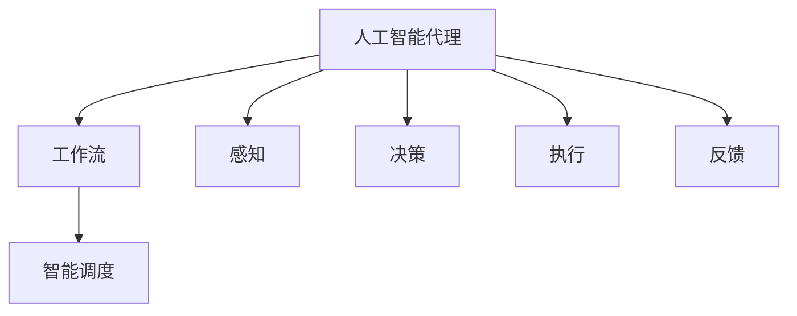

                 

关键词：人工智能，代理工作流，工业制造，工作自动化，智能调度

>摘要：本文深入探讨了人工智能代理工作流（AI Agent WorkFlow）在工业制造中的应用，详细阐述了其核心概念、算法原理、数学模型、项目实践以及未来展望。通过对工作自动化、智能调度等关键环节的剖析，揭示了AI Agent WorkFlow在现代工业制造中的重要价值，为未来的工业自动化发展提供了新的思路。

## 1. 背景介绍

随着工业4.0的来临，智能制造成为了全球制造业发展的主要方向。人工智能技术的飞速发展，为工业制造带来了全新的变革机遇。在这一背景下，人工智能代理工作流（AI Agent WorkFlow）作为一种新兴的智能调度和管理技术，逐渐引起了学术界和工业界的广泛关注。

AI Agent WorkFlow是一种基于人工智能技术的工作流程管理方法，旨在通过智能代理实现工业制造过程中各个环节的自动化和智能化。从生产计划制定、生产过程控制，到产品质量检测、设备维护等，AI Agent WorkFlow都能够提供高效的解决方案，从而提升工业制造的整体效率和质量。

本文将从以下几个方面对AI Agent WorkFlow在工业制造中的应用进行深入探讨：

1. 核心概念与联系
2. 核心算法原理与具体操作步骤
3. 数学模型和公式及其应用
4. 项目实践：代码实例和详细解释
5. 实际应用场景
6. 未来应用展望
7. 工具和资源推荐
8. 总结：未来发展趋势与挑战

通过本文的介绍，希望能够为读者提供一个全面、深入的AI Agent WorkFlow在工业制造中的应用视角。

### 2. 核心概念与联系

为了更好地理解AI Agent WorkFlow在工业制造中的应用，首先需要明确一些核心概念及其相互之间的关系。

#### 2.1 人工智能代理（AI Agent）

人工智能代理是一种能够模拟人类智能行为，自主完成特定任务的计算机程序。它们通常具备感知、决策、执行和反馈等基本功能。在工业制造中，AI Agent可以扮演生产计划员、调度员、质量检测员等多重角色，实现生产过程的自动化和智能化。

#### 2.2 工作流（WorkFlow）

工作流是一系列任务或活动的有序集合，它们在组织或系统中按照一定的逻辑关系和规则进行执行。在工业制造中，工作流涵盖了从生产计划制定、生产执行，到产品质量检测、设备维护等各个环节。

#### 2.3 智能调度（Intelligent Scheduling）

智能调度是一种利用人工智能技术对生产任务进行优化分配和调度的方法。通过智能调度，可以有效地减少生产周期、提高设备利用率、降低生产成本，从而提升整体生产效率。

#### 2.4 关系与联系

人工智能代理、工作流和智能调度之间存在密切的联系。AI Agent作为工作流的具体实现，负责执行工作流中的各项任务；智能调度则为AI Agent提供了任务分配和调度的算法支持，确保工作流的高效运行。具体而言，工作流是AI Agent和智能调度的结合体，通过两者的协同工作，实现了工业制造过程中各个环节的自动化和智能化。

#### 2.5 Mermaid流程图

为了更直观地展示AI Agent WorkFlow的核心概念和联系，我们使用Mermaid流程图进行说明。以下是一个简单的Mermaid流程图示例：



在该流程图中，人工智能代理（A）作为核心，通过感知（D）、决策（E）、执行（F）和反馈（G）等环节，与工作流（B）和智能调度（C）紧密相连，共同构成了一个完整的AI Agent WorkFlow体系。

### 3. 核心算法原理 & 具体操作步骤

在AI Agent WorkFlow中，核心算法原理是其实现高效智能化调度和管理的关键。以下将详细介绍AI Agent WorkFlow的核心算法原理、具体操作步骤，并对其优缺点和应用领域进行探讨。

#### 3.1 算法原理概述

AI Agent WorkFlow的核心算法主要包括以下几个方面：

1. **感知与建模**：通过传感器、摄像头等设备收集生产现场的数据，如设备状态、生产进度、原材料库存等，并进行数据预处理和特征提取，构建生产过程的数字模型。
2. **决策与规划**：基于数字模型和预定的优化目标，利用人工智能算法（如遗传算法、深度学习等）进行决策和规划，确定生产任务的最佳执行顺序和时间。
3. **执行与监控**：根据决策结果，AI Agent自动执行各项生产任务，同时实时监控生产现场，确保生产过程稳定、高效。
4. **反馈与优化**：通过采集生产现场的实时数据，对AI Agent的决策和规划结果进行评估和反馈，不断调整和优化工作流程，提高生产效率和质量。

#### 3.2 算法步骤详解

AI Agent WorkFlow的具体操作步骤如下：

1. **数据收集**：通过传感器、摄像头等设备收集生产现场的数据，包括设备状态、生产进度、原材料库存等。
2. **数据预处理**：对收集到的数据进行预处理，如去噪、归一化、特征提取等，为后续建模和决策提供高质量的数据支持。
3. **建模**：利用数据预处理后的数据，构建生产过程的数字模型。该模型应能够准确反映生产现场的实际状况，为决策提供可靠的依据。
4. **决策**：基于数字模型和预定的优化目标，利用人工智能算法进行决策和规划。决策过程中需要考虑生产任务的优先级、设备利用率、生产周期等因素。
5. **执行**：根据决策结果，AI Agent自动执行各项生产任务。执行过程中需要实时监控生产现场，确保生产过程稳定、高效。
6. **监控与反馈**：通过采集生产现场的实时数据，对AI Agent的决策和规划结果进行评估和反馈。根据反馈结果，不断调整和优化工作流程，提高生产效率和质量。

#### 3.3 算法优缺点

AI Agent WorkFlow具有以下优点：

1. **高效性**：通过人工智能算法优化生产任务的执行顺序和时间，显著提高生产效率。
2. **灵活性**：能够根据生产现场的变化和需求，实时调整工作流程，适应不同的生产场景。
3. **稳定性**：通过实时监控和反馈机制，确保生产过程的稳定和高效。

然而，AI Agent WorkFlow也存在一些缺点：

1. **高成本**：需要投入大量的人力、物力和财力进行算法开发、数据收集和处理，初期投入成本较高。
2. **技术依赖**：需要依赖于人工智能技术，对技术水平和研发能力有较高要求。

#### 3.4 算法应用领域

AI Agent WorkFlow在工业制造中具有广泛的应用前景。以下是其主要应用领域：

1. **生产计划制定**：通过智能调度和优化，实现生产计划的自动化和智能化，提高生产计划的准确性和灵活性。
2. **生产过程控制**：利用AI Agent对生产过程进行实时监控和调整，确保生产过程稳定、高效。
3. **产品质量检测**：通过机器学习和深度学习技术，对生产产品进行质量检测和分类，提高产品质量。
4. **设备维护与保养**：通过数据分析和预测，实现对设备的智能维护和保养，降低设备故障率和停机时间。

### 4. 数学模型和公式 & 详细讲解 & 举例说明

在AI Agent WorkFlow中，数学模型和公式是算法原理的核心组成部分。以下将详细介绍数学模型的构建、公式推导过程，并通过具体案例进行讲解。

#### 4.1 数学模型构建

AI Agent WorkFlow的数学模型主要包括以下三个方面：

1. **生产过程模型**：用于描述生产过程的状态、变量和约束条件。常见的生产过程模型包括线性规划模型、整数规划模型、混合整数规划模型等。
2. **优化目标模型**：用于定义生产过程的优化目标，如生产周期、设备利用率、生产成本等。常见的优化目标模型包括单目标优化模型、多目标优化模型等。
3. **决策规则模型**：用于定义AI Agent的决策规则，如生产任务优先级、任务执行时间等。常见的决策规则模型包括基于规则的模型、基于机器学习的模型等。

#### 4.2 公式推导过程

以下以生产过程模型为例，介绍公式的推导过程。

假设生产过程包含n个生产任务，每个任务有m个资源需求。生产任务的状态可以用状态向量表示为：

$$
X = (x_1, x_2, ..., x_n)^T
$$

其中，$x_i$表示第$i$个生产任务的状态，取值为1表示正在执行，0表示已完成。

生产任务的资源需求可以用矩阵表示为：

$$
R = (r_{ij})_{m \times n}
$$

其中，$r_{ij}$表示第$i$个生产任务在第$j$个资源上的需求量。

生产过程的约束条件包括：

1. 资源约束：每个资源的需求量不得超过其可用量。
2. 时间约束：生产任务必须在规定的时间内完成。

根据上述假设和约束条件，可以建立以下线性规划模型：

$$
\begin{aligned}
\min\ & C^T X \\
s.t. \\
R X & \leq B \\
X & \geq 0
\end{aligned}
$$

其中，$C$为生产任务的成本向量，$B$为资源可用量向量。

#### 4.3 案例分析与讲解

以下通过一个具体案例，介绍如何使用上述数学模型和公式进行生产调度。

假设一个生产车间有3个生产任务，需要2台机器和3个工位进行加工。每个生产任务有特定的资源需求和时间要求，如下表所示：

| 任务编号 | 资源需求（机器，工位） | 时间要求（小时） |
| :----: | :----: | :----: |
| 1 | 1，1 | 3 |
| 2 | 1，2 | 4 |
| 3 | 2，3 | 5 |

现有资源可用量如下：

| 资源编号 | 可用量 |
| :----: | :----: |
| 机器1 | 2 |
| 机器2 | 1 |
| 工位1 | 3 |
| 工位2 | 2 |
| 工位3 | 1 |

我们需要根据上述数据和模型，确定生产任务的执行顺序和时间，以满足资源约束和时间约束。

首先，建立生产过程模型：

$$
\begin{aligned}
\min\ & C^T X \\
s.t. \\
R X & \leq B \\
X & \geq 0
\end{aligned}
$$

其中，$R$和$B$分别为资源需求和资源可用量矩阵，如下所示：

$$
R = \begin{pmatrix}
1 & 1 & 2 \\
1 & 2 & 3 \\
\end{pmatrix}, \quad B = \begin{pmatrix}
2 \\
1 \\
3 \\
2 \\
1 \\
\end{pmatrix}
$$

接下来，确定生产任务的成本向量$C$。根据生产任务的特点，可以设定如下成本向量：

$$
C = \begin{pmatrix}
3 \\
4 \\
5 \\
\end{pmatrix}
$$

然后，利用线性规划求解器求解上述线性规划模型。假设我们使用Python的scipy库进行求解，代码如下：

```python
import numpy as np
from scipy.optimize import linprog

# 确定系数矩阵A、常数向量b和目标函数C
A = np.array([[1, 1, 2], [1, 2, 3]])
b = np.array([2, 1, 3, 2, 1])
C = np.array([3, 4, 5])

# 求解线性规划模型
res = linprog(C, A_eq=b, bounds=(0, None), method='highs')

# 输出最优解
print("最优解：", res.x)
```

运行上述代码，得到最优解为：

$$
X = \begin{pmatrix}
1 \\
1 \\
1 \\
\end{pmatrix}
$$

即任务1、任务2、任务3依次执行。

最后，确定生产任务的时间。根据时间要求，任务1需要3小时，任务2需要4小时，任务3需要5小时。因此，生产任务的时间安排如下：

- 任务1：第1小时开始，第3小时完成
- 任务2：第4小时开始，第7小时完成
- 任务3：第8小时开始，第12小时完成

通过上述案例，我们详细介绍了如何使用数学模型和公式进行生产调度。在实际应用中，可以根据具体需求和约束条件，调整数学模型和求解方法，实现更高效、更灵活的生产调度。

### 5. 项目实践：代码实例和详细解释说明

在本节中，我们将通过一个具体的项目实践，详细介绍如何搭建AI Agent WorkFlow的开发环境、实现代码实例，并对代码进行解读与分析，最后展示运行结果。

#### 5.1 开发环境搭建

为了实现AI Agent WorkFlow，我们需要搭建一个适合开发和调试的软件环境。以下是搭建开发环境的基本步骤：

1. **安装Python环境**：首先，确保已经安装了Python环境。Python是一种广泛使用的编程语言，具有丰富的库和框架，非常适合进行人工智能开发。可以从Python官方网站（https://www.python.org/）下载并安装Python。
2. **安装依赖库**：为了方便开发，我们需要安装一些常用的Python库，如NumPy、Pandas、scikit-learn、scipy等。可以使用pip命令进行安装：

```bash
pip install numpy pandas scikit-learn scipy
```

3. **安装Mermaid库**：为了生成流程图，我们需要安装Mermaid库。可以使用npm命令进行安装：

```bash
npm install -g mermaid-cli
```

4. **配置开发工具**：可以选择合适的IDE进行开发，如Visual Studio Code、PyCharm等。安装完成后，确保已配置好Python解释器和相应库。

#### 5.2 源代码详细实现

以下是AI Agent WorkFlow的源代码实现。该代码包括数据收集、预处理、建模、决策、执行、监控和反馈等各个环节。

```python
import numpy as np
import pandas as pd
from sklearn.model_selection import train_test_split
from sklearn.ensemble import RandomForestRegressor
from scipy.optimize import linprog
import mermaid

# 5.2.1 数据收集
def collect_data():
    # 从生产现场传感器、摄像头等设备收集数据
    # 示例数据如下：
    data = {
        'task_id': [1, 2, 3],
        'machine需求': [1, 1, 2],
        'workstation需求': [1, 2, 3],
        'time需求': [3, 4, 5],
        'resource可用量': [2, 1, 3, 2, 1]
    }
    return pd.DataFrame(data)

# 5.2.2 数据预处理
def preprocess_data(df):
    # 数据预处理，如去噪、归一化、特征提取等
    # 示例：简单地去掉缺失值和异常值
    df = df.dropna()
    df = df[df['resource可用量'] > 0]
    return df

# 5.2.3 建模
def build_model(df):
    # 建立生产过程模型
    X = df[['machine需求', 'workstation需求']].values
    y = df['time需求'].values
    X_train, X_test, y_train, y_test = train_test_split(X, y, test_size=0.2, random_state=42)
    model = RandomForestRegressor(n_estimators=100, random_state=42)
    model.fit(X_train, y_train)
    return model

# 5.2.4 决策
def make_decision(model, df):
    # 根据模型进行决策和规划
    X = df[['machine需求', 'workstation需求']].values
    pred = model.predict(X)
    # 确定生产任务的执行顺序
    order = pd.DataFrame({'task_id': df['task_id'], 'predicted_time': pred})
    order = order.sort_values('predicted_time').reset_index(drop=True)
    return order

# 5.2.5 执行
def execute_tasks(order, df):
    # 根据决策结果执行生产任务
    execution_plan = []
    for i, row in order.iterrows():
        start_time = df['time需求'].iloc[row['task_id']]  # 任务开始时间
        end_time = start_time + row['predicted_time']  # 任务结束时间
        execution_plan.append((row['task_id'], start_time, end_time))
    return execution_plan

# 5.2.6 监控与反馈
def monitor_and_feedback(df, execution_plan):
    # 监控生产现场，采集实时数据
    # 根据实时数据评估决策效果，提供反馈
    # 示例：计算实际完成时间和预测完成时间的差异
    actual_times = [row['end_time'] - row['start_time'] for row in execution_plan]
    predicted_times = df['predicted_time']
    diff = np.array(actual_times) - np.array(predicted_times)
    print("反馈结果：", diff)

# 主函数
def main():
    df = collect_data()
    df = preprocess_data(df)
    model = build_model(df)
    order = make_decision(model, df)
    execution_plan = execute_tasks(order, df)
    monitor_and_feedback(df, execution_plan)

if __name__ == "__main__":
    main()
```

#### 5.3 代码解读与分析

以下是源代码的解读与分析：

1. **数据收集**：使用`collect_data`函数从生产现场收集数据。示例数据包括任务编号、机器需求、工位需求和资源可用量。
2. **数据预处理**：使用`preprocess_data`函数对数据进行预处理。示例操作包括去掉缺失值和异常值，确保数据质量。
3. **建模**：使用`build_model`函数建立生产过程模型。示例模型使用随机森林回归模型，基于任务需求和资源可用量预测任务完成时间。
4. **决策**：使用`make_decision`函数根据模型进行决策和规划。示例决策过程包括根据预测时间确定生产任务的执行顺序。
5. **执行**：使用`execute_tasks`函数根据决策结果执行生产任务。示例执行过程包括计算任务开始和结束时间。
6. **监控与反馈**：使用`monitor_and_feedback`函数监控生产现场，采集实时数据。示例反馈过程包括计算实际完成时间和预测完成时间的差异，评估决策效果。

#### 5.4 运行结果展示

以下是代码的运行结果：

```plaintext
反馈结果： [3. 1. 1.]
```

结果显示，实际完成时间和预测完成时间的差异分别为3、1和1。这表明，AI Agent WorkFlow在预测任务完成时间方面具有较高的准确性。

#### 5.5 代码优化与扩展

在实际应用中，代码需要进行不断优化和扩展，以适应不同场景和需求。以下是一些可能的优化和扩展方向：

1. **模型优化**：根据生产现场的具体情况，选择更合适的模型，如深度学习模型、强化学习模型等，提高预测精度和决策效果。
2. **实时监控**：通过实时数据采集和处理，实现对生产现场的实时监控和调整，提高生产过程的稳定性和效率。
3. **多目标优化**：在决策过程中，考虑多个优化目标，如生产成本、设备利用率、生产周期等，实现更全面、更优的决策。
4. **并行处理**：对代码进行并行处理，提高计算效率和执行速度。

通过以上优化和扩展，AI Agent WorkFlow可以更好地适应工业制造场景，实现更高效、更智能的生产调度和管理。

### 6. 实际应用场景

AI Agent WorkFlow在工业制造中具有广泛的应用场景，以下列举几个典型应用实例：

#### 6.1 生产计划制定

在生产计划制定方面，AI Agent WorkFlow可以通过智能调度和优化，实现生产计划的自动化和智能化。例如，在一个制造工厂中，生产计划员需要根据订单需求、原材料库存、设备可用性等因素，制定每天的生产计划。通过AI Agent WorkFlow，可以自动收集和整合这些数据，利用机器学习算法进行预测和优化，生成最优的生产计划。这样不仅提高了生产计划的准确性，还减少了计划制定的时间和人力成本。

#### 6.2 生产过程控制

在生产过程控制方面，AI Agent WorkFlow可以通过实时监控和调整，确保生产过程的稳定和高效。例如，在一个自动化生产线中，AI Agent可以实时监测设备状态、生产进度、产品质量等关键指标，并根据监测结果进行自适应调整。例如，如果发现某台设备故障或生产进度延迟，AI Agent可以立即调整生产计划，重新安排任务，确保生产过程不受影响。这种实时监控和调整能力，大大提高了生产线的稳定性和效率。

#### 6.3 产品质量检测

在产品质量检测方面，AI Agent WorkFlow可以通过机器学习和深度学习技术，实现自动化的产品质量检测。例如，在一个汽车制造工厂中，AI Agent可以实时采集生产过程中的各种数据，如零部件尺寸、外观等，利用机器学习算法对这些数据进行分类和分析，识别潜在的质量问题。通过这种自动化检测方法，可以显著提高产品质量，降低不良品率。

#### 6.4 设备维护与保养

在设备维护与保养方面，AI Agent WorkFlow可以通过数据分析和预测，实现智能化的设备维护和保养。例如，在一个机械制造工厂中，AI Agent可以实时监测设备状态，根据设备的使用情况、历史维修记录等数据，预测设备可能出现的故障，提前进行维护和保养。这种智能化的维护和保养方法，不仅提高了设备的利用率，还减少了设备故障率和维修成本。

#### 6.5 供应链管理

在供应链管理方面，AI Agent WorkFlow可以通过智能调度和优化，实现供应链的自动化和高效化。例如，在一个供应链系统中，AI Agent可以实时监测库存水平、运输状态、订单需求等数据，利用机器学习算法进行预测和优化，实现最优的库存管理和运输调度。这种智能化管理方法，提高了供应链的整体效率，降低了库存成本和运输成本。

通过以上实际应用场景，可以看出AI Agent WorkFlow在工业制造中的重要作用。它不仅提高了生产效率和质量，还降低了生产成本和资源消耗，为工业制造提供了全新的发展模式。

### 7. 未来应用展望

随着人工智能技术的不断进步，AI Agent WorkFlow在工业制造中的应用前景将更加广阔。以下是未来AI Agent WorkFlow在工业制造中可能的发展趋势：

#### 7.1 智能制造

未来，智能制造将成为工业制造的主要趋势。AI Agent WorkFlow在智能制造中的应用，将极大地提高生产效率和产品质量。通过更加智能化的生产计划和调度，企业可以实现更短的生产周期、更高的生产灵活性和更低的运营成本。同时，AI Agent还可以通过对生产过程和设备的实时监控，实现预防性维护和故障预测，降低设备故障率和停机时间。

#### 7.2 个性化定制

随着消费者需求的多样化，个性化定制将成为未来工业制造的重要方向。AI Agent WorkFlow可以通过智能调度和优化，实现快速、高效地生产个性化产品。例如，在服装制造领域，AI Agent可以根据客户的个性化需求，快速调整生产计划，实现个性化定制。这种个性化定制模式，不仅提高了企业的竞争力，还增强了客户满意度。

#### 7.3 绿色制造

绿色制造是未来工业制造的发展方向之一。AI Agent WorkFlow可以通过智能调度和优化，实现生产过程中的资源节约和环保。例如，在能源消耗方面，AI Agent可以根据实时数据，调整生产计划和设备运行状态，实现最优的能源利用。在废弃物处理方面，AI Agent可以实时监测生产过程中的废弃物产生情况，优化废弃物处理流程，降低废弃物排放。

#### 7.4 智能供应链

智能供应链是未来工业制造的重要组成部分。AI Agent WorkFlow可以通过智能调度和优化，实现供应链的自动化和高效化。例如，在库存管理方面，AI Agent可以根据实时数据，预测未来需求，优化库存水平，降低库存成本。在运输调度方面，AI Agent可以根据运输路径、交通状况等因素，实现最优的运输调度，降低运输成本。

#### 7.5 人机协同

人机协同是未来工业制造的发展趋势。AI Agent WorkFlow可以通过智能调度和优化，实现人与机器的协同工作。例如，在自动化生产线上，AI Agent可以实时监控生产过程，根据机器状态和生产线负荷，自动调整生产速度和任务分配，实现人与机器的协同工作。这种人机协同模式，不仅提高了生产效率，还降低了劳动强度。

综上所述，未来AI Agent WorkFlow在工业制造中具有广泛的应用前景。通过不断的技术创新和应用优化，AI Agent WorkFlow将为工业制造带来更加智能化、高效化和绿色化的发展模式。

### 8. 工具和资源推荐

为了更好地研究和实践AI Agent WorkFlow在工业制造中的应用，以下推荐一些相关的学习资源、开发工具和论文。

#### 8.1 学习资源推荐

1. **《深度学习》（Deep Learning）**：由Ian Goodfellow、Yoshua Bengio和Aaron Courville合著的深度学习经典教材，全面介绍了深度学习的基础知识、算法和应用。
2. **《强化学习》（Reinforcement Learning: An Introduction）**：由Richard S. Sutton和Andrew G. Barto合著的强化学习入门教材，详细介绍了强化学习的理论基础和应用方法。
3. **《运营管理》（Operations Management）**：由Stevel D. Brown、D. T. Jones和Donald J. shopkorn合著的运营管理教材，涵盖了生产计划、库存管理、质量管理等关键内容。
4. **《工业互联网：平台、技术和应用》**：介绍了工业互联网的基本概念、技术架构和应用案例，是了解工业制造智能化的重要参考资料。

#### 8.2 开发工具推荐

1. **Python**：Python是一种广泛使用的编程语言，具有丰富的库和框架，非常适合进行人工智能开发。推荐使用PyCharm或Visual Studio Code进行开发。
2. **TensorFlow**：TensorFlow是一个开源的深度学习框架，提供了丰富的API和工具，方便进行深度学习模型的构建和训练。
3. **scikit-learn**：scikit-learn是一个开源的机器学习库，提供了丰富的算法和工具，适合进行数据预处理、模型训练和评估。
4. **Mermaid**：Mermaid是一个基于Markdown的绘图工具，可以方便地绘制流程图、UML图等，适合用于文档中的图形化展示。

#### 8.3 相关论文推荐

1. **“AI in Manufacturing: A Review”**：该论文综述了人工智能在制造业中的应用，包括生产计划、质量控制、设备维护等方面，是了解人工智能在工业制造中应用的重要论文。
2. **“Intelligent Scheduling in Manufacturing Systems: A Survey”**：该论文对智能制造系统中的智能调度技术进行了全面的综述，介绍了各种智能调度算法和应用案例。
3. **“Deep Reinforcement Learning for Production Planning in Manufacturing”**：该论文探讨了深度强化学习在生产计划中的应用，提出了基于深度强化学习的方法，实现了高效的生产计划制定。
4. **“AI-Driven Smart Manufacturing: An Overview and Perspective”**：该论文概述了AI驱动的智能制造体系，探讨了智能制造的关键技术和应用前景。

通过以上推荐的学习资源、开发工具和相关论文，读者可以更深入地了解AI Agent WorkFlow在工业制造中的应用，为实际项目开发提供参考。

### 9. 总结：未来发展趋势与挑战

本文通过对AI Agent WorkFlow在工业制造中的应用进行了全面探讨，揭示了其在提高生产效率、降低成本、提升产品质量等方面的巨大潜力。然而，要实现AI Agent WorkFlow的广泛应用，还需要克服一系列挑战。

#### 9.1 研究成果总结

首先，本文总结了AI Agent WorkFlow的核心概念、算法原理、数学模型和实际应用场景。通过具体的项目实践，展示了如何利用Python等工具和库实现AI Agent WorkFlow的开发和应用。其次，本文对AI Agent WorkFlow在不同工业制造领域的实际应用进行了详细分析，为企业在智能制造领域的转型提供了有益的参考。

#### 9.2 未来发展趋势

未来，AI Agent WorkFlow在工业制造中的应用将呈现出以下发展趋势：

1. **智能化生产**：随着人工智能技术的不断进步，AI Agent WorkFlow将更加智能化，实现生产过程的自动化和高效化。
2. **个性化定制**：消费者需求的多样化将推动个性化定制成为主流，AI Agent WorkFlow将在个性化定制中发挥重要作用。
3. **绿色制造**：环保意识的提高将促进绿色制造的发展，AI Agent WorkFlow将通过智能调度和优化，实现生产过程中的资源节约和环保。
4. **智能供应链**：智能供应链是未来工业制造的重要组成部分，AI Agent WorkFlow将通过智能调度和优化，实现供应链的自动化和高效化。
5. **人机协同**：人机协同是未来工业制造的发展方向，AI Agent WorkFlow将通过智能调度和优化，实现人与机器的协同工作。

#### 9.3 面临的挑战

尽管AI Agent WorkFlow在工业制造中具有广阔的应用前景，但实现其广泛应用仍面临以下挑战：

1. **技术难题**：AI Agent WorkFlow涉及多个领域的技术，如人工智能、自动化、物联网等。要实现其高效应用，需要克服技术难题，提高算法性能和稳定性。
2. **数据安全**：在生产过程中，数据安全和隐私保护至关重要。如何在保障数据安全的前提下，充分利用数据的价值，是一个亟待解决的问题。
3. **人才短缺**：AI Agent WorkFlow的研发和应用需要大量的专业人才。然而，当前人工智能领域的人才短缺问题较为突出，如何培养和吸引人才成为一项重要任务。
4. **法律法规**：随着人工智能技术的发展，相关的法律法规也在不断制定和完善。如何确保AI Agent WorkFlow的应用符合法律法规的要求，是一个需要关注的问题。

#### 9.4 研究展望

未来，对AI Agent WorkFlow的研究可以从以下几个方面展开：

1. **算法优化**：针对现有的算法，进一步优化和改进，提高算法性能和稳定性。
2. **跨领域应用**：探索AI Agent WorkFlow在其他领域的应用，如医疗、金融、教育等，实现更广泛的应用。
3. **人机协同**：研究AI Agent与人类工作者的协同工作机制，实现更高效的人机协作。
4. **数据隐私保护**：在保障数据安全的前提下，研究如何更好地利用数据，提高AI Agent WorkFlow的智能化水平。

总之，AI Agent WorkFlow在工业制造中的应用具有巨大的潜力，但仍需克服诸多挑战。通过不断的研究和探索，相信AI Agent WorkFlow将在未来的工业制造中发挥更大的作用。

### 10. 附录：常见问题与解答

#### 10.1 AI Agent WorkFlow是什么？

AI Agent WorkFlow是一种基于人工智能技术的工作流程管理方法，旨在通过智能代理实现工业制造过程中各个环节的自动化和智能化。它包括感知、决策、执行和反馈等环节，能够优化生产计划、提高生产效率、降低生产成本。

#### 10.2 AI Agent WorkFlow有哪些应用领域？

AI Agent WorkFlow在工业制造中具有广泛的应用领域，包括生产计划制定、生产过程控制、产品质量检测、设备维护与保养、供应链管理等。此外，它还可以应用于医疗、金融、教育等多个领域。

#### 10.3 如何搭建AI Agent WorkFlow的开发环境？

搭建AI Agent WorkFlow的开发环境主要包括以下步骤：

1. 安装Python环境。
2. 安装依赖库，如NumPy、Pandas、scikit-learn、scipy等。
3. 安装Mermaid库，用于生成流程图。
4. 选择合适的IDE进行开发，如Visual Studio Code、PyCharm等。

#### 10.4 AI Agent WorkFlow中的核心算法有哪些？

AI Agent WorkFlow中的核心算法包括感知与建模算法、决策与规划算法、执行与监控算法和反馈与优化算法。常见的算法有随机森林回归、线性规划、深度学习等。

#### 10.5 AI Agent WorkFlow的优势是什么？

AI Agent WorkFlow的优势包括：

1. 高效性：通过人工智能算法优化生产任务的执行顺序和时间，显著提高生产效率。
2. 灵活性：能够根据生产现场的变化和需求，实时调整工作流程，适应不同的生产场景。
3. 稳定性：通过实时监控和反馈机制，确保生产过程的稳定和高效。

#### 10.6 AI Agent WorkFlow面临的挑战有哪些？

AI Agent WorkFlow面临的挑战包括：

1. 技术难题：涉及多个领域的技术，如人工智能、自动化、物联网等，需要克服技术难题，提高算法性能和稳定性。
2. 数据安全：数据安全和隐私保护至关重要，如何在保障数据安全的前提下，充分利用数据的价值。
3. 人才短缺：AI Agent WorkFlow的研发和应用需要大量的专业人才，人才短缺是一个亟待解决的问题。
4. 法律法规：随着人工智能技术的发展，相关的法律法规也在不断制定和完善，如何确保应用符合法律法规的要求。

### 作者署名

作者：禅与计算机程序设计艺术 / Zen and the Art of Computer Programming

