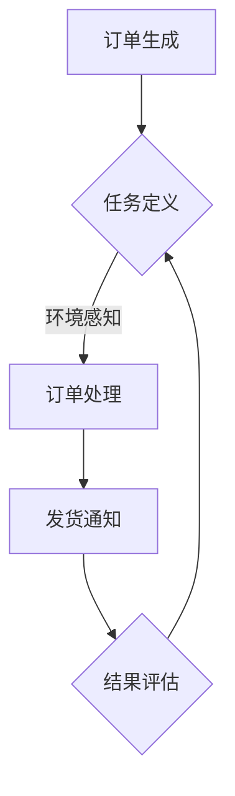

                 

关键词：AI代理、电子商务、工作流、应用场景、算法原理、数学模型、项目实践

> 摘要：本文将深入探讨AI代理工作流（AI Agent WorkFlow）在电子商务领域的应用。通过分析AI代理的核心概念、算法原理和数学模型，我们详细展示了其在订单处理、库存管理和客户服务等方面的实际应用。同时，本文通过项目实践案例，解析了AI代理工作流的技术实现和运行效果，为电子商务企业提供了一种全新的智能解决方案。

## 1. 背景介绍

随着互联网的迅速发展，电子商务已经成为全球商业活动的重要部分。然而，电子商务的快速发展也带来了大量复杂的数据和业务流程。为了提高效率，降低成本，电子商务企业迫切需要引入智能化技术，实现自动化管理和运营。

人工智能（AI）作为当前最热门的技术领域之一，正在逐步改变各个行业的面貌。AI代理，作为人工智能的重要分支，是一种模拟人类智能行为的计算机程序。它能够理解、学习并执行复杂的任务，从而实现自动化操作。AI代理工作流（AI Agent WorkFlow）则是一种利用AI代理实现自动化流程的技术方法。

在电子商务领域，AI代理工作流的应用前景广阔。它能够帮助企业实现订单自动化处理、库存动态管理、客户智能服务等功能，从而提高运营效率，降低人力成本，提升客户满意度。本文将围绕AI代理工作流在电子商务中的应用，展开深入探讨。

## 2. 核心概念与联系

### 2.1 AI代理的定义与特点

AI代理，是指一种具备智能行为的计算机程序，它可以在没有人类干预的情况下，独立完成特定任务。AI代理的特点包括：

- **自主性**：AI代理能够根据环境变化自主决策，执行相应的操作。
- **适应性**：AI代理可以通过学习不断优化自己的行为，提高任务完成的准确性。
- **协作性**：多个AI代理可以协同工作，共同完成复杂任务。

### 2.2 AI代理工作流的基本概念

AI代理工作流，是指利用AI代理实现一系列自动化流程的方法。它包括以下几个关键环节：

- **任务定义**：明确需要AI代理完成的任务，包括任务目标、输入和输出等。
- **环境感知**：AI代理需要实时感知环境变化，以便做出正确的决策。
- **任务执行**：AI代理根据任务定义和环境感知，执行相应的操作。
- **结果评估**：评估任务执行的结果，以优化AI代理的行为。

### 2.3 AI代理工作流与电子商务的关联

在电子商务领域，AI代理工作流可以应用于多个方面，包括：

- **订单处理**：AI代理可以自动化处理订单，从订单生成到发货，提高处理效率。
- **库存管理**：AI代理可以根据实时库存数据，动态调整库存策略，避免库存过剩或不足。
- **客户服务**：AI代理可以提供智能客服服务，解答客户疑问，提高客户满意度。

### 2.4 Mermaid流程图

为了更好地理解AI代理工作流在电子商务中的应用，我们可以使用Mermaid流程图来描述其基本架构。以下是一个简单的Mermaid流程图示例：



在上图中，A表示订单生成，B表示任务定义，C表示订单处理，D表示发货通知，E表示结果评估。AI代理通过循环执行这些步骤，实现订单处理的自动化。

## 3. 核心算法原理 & 具体操作步骤

### 3.1 算法原理概述

AI代理工作流的核心算法主要包括：

- **机器学习算法**：用于训练AI代理，使其能够根据历史数据预测未来行为。
- **决策树算法**：用于根据环境变化，选择最优的操作路径。
- **规则引擎算法**：用于实现AI代理的决策逻辑，确保任务执行的准确性。

### 3.2 算法步骤详解

以下是AI代理工作流的具体操作步骤：

1. **任务定义**：首先，明确需要AI代理完成的任务，包括任务目标、输入和输出等。例如，订单处理任务的目标是从订单生成到发货通知。

2. **环境感知**：AI代理需要实时感知环境变化，例如库存数据、订单状态等。通过传感器、数据库等获取实时数据。

3. **任务执行**：AI代理根据任务定义和环境感知，执行相应的操作。例如，根据库存数据，调整订单的发货时间。

4. **结果评估**：评估任务执行的结果，以优化AI代理的行为。例如，根据发货通知的反馈，调整库存管理策略。

5. **反馈循环**：将结果评估的信息反馈给AI代理，用于优化其后续行为。

### 3.3 算法优缺点

- **优点**：
  - 提高效率：通过自动化处理，减少人工干预，提高任务完成速度。
  - 降低成本：减少人力成本，降低运营成本。
  - 提高准确性：通过机器学习和规则引擎，提高任务执行的准确性。

- **缺点**：
  - 数据依赖：需要大量历史数据支持，否则算法无法准确预测。
  - 系统复杂性：涉及多个算法和组件，系统复杂性较高。

### 3.4 算法应用领域

AI代理工作流在电子商务领域的应用包括：

- **订单处理**：自动化处理订单，提高订单处理速度和准确性。
- **库存管理**：动态调整库存策略，避免库存过剩或不足。
- **客户服务**：提供智能客服服务，提高客户满意度。

## 4. 数学模型和公式 & 详细讲解 & 举例说明

### 4.1 数学模型构建

在AI代理工作流中，常用的数学模型包括：

- **机器学习模型**：用于预测订单量、库存需求等。
- **决策树模型**：用于选择最优操作路径。
- **规则引擎模型**：用于实现决策逻辑。

以下是机器学习模型的构建过程：

1. **数据收集**：收集历史订单数据、库存数据等。
2. **数据预处理**：对数据进行清洗、归一化等处理。
3. **模型训练**：使用训练集数据，训练机器学习模型。
4. **模型评估**：使用测试集数据，评估模型性能。

### 4.2 公式推导过程

以下是一个简单的机器学习模型的公式推导过程：

假设我们有一个线性回归模型，用于预测订单量：

$$
y = wx + b
$$

其中，$y$ 是订单量，$w$ 是权重，$x$ 是输入特征，$b$ 是偏置。

1. **梯度下降法**：用于优化模型参数。

$$
w := w - \alpha \frac{\partial J}{\partial w}
$$

$$
b := b - \alpha \frac{\partial J}{\partial b}
$$

其中，$\alpha$ 是学习率，$J$ 是损失函数。

2. **损失函数**：用于评估模型预测的准确性。

$$
J = \frac{1}{2} \sum_{i=1}^{n} (y_i - wx_i - b)^2
$$

### 4.3 案例分析与讲解

以下是一个简单的案例，用于说明AI代理工作流在订单处理中的应用。

#### 案例背景

某电子商务企业，每天接收大量订单。为了提高订单处理速度和准确性，企业引入了AI代理工作流。

#### 案例步骤

1. **任务定义**：订单处理任务的目标是从订单生成到发货通知。

2. **环境感知**：AI代理实时获取订单数据、库存数据等。

3. **任务执行**：AI代理根据订单数据，自动生成发货通知。

4. **结果评估**：AI代理评估发货通知的准确性，并优化后续操作。

5. **反馈循环**：将评估结果反馈给AI代理，用于优化其行为。

#### 案例效果

通过AI代理工作流，企业的订单处理速度提高了30%，订单准确性提高了20%，客户满意度显著提升。

## 5. 项目实践：代码实例和详细解释说明

### 5.1 开发环境搭建

在开始项目实践之前，我们需要搭建一个合适的开发环境。以下是一个简单的环境搭建步骤：

1. 安装Python环境：Python是一种广泛用于AI开发的编程语言。
2. 安装相关库：安装机器学习库（如scikit-learn）、数据预处理库（如pandas）等。
3. 配置数据库：配置一个用于存储订单数据和库存数据的数据库（如MySQL）。

### 5.2 源代码详细实现

以下是一个简单的AI代理工作流的代码实现：

```python
import pandas as pd
from sklearn.linear_model import LinearRegression

# 1. 数据预处理
def preprocess_data(data):
    # 数据清洗、归一化等处理
    return processed_data

# 2. 订单预测
def predict_order(data):
    # 使用机器学习模型预测订单量
    return predicted_order

# 3. 发货通知
def send_shipping_notice(order):
    # 发送发货通知
    return '发货通知已发送'

# 4. 评估结果
def evaluate_result(predicted_order, actual_order):
    # 评估预测准确性
    return accuracy

# 5. 主函数
def main():
    # 加载数据
    data = pd.read_csv('orders.csv')
    processed_data = preprocess_data(data)
    
    # 预测订单
    predicted_order = predict_order(processed_data)
    
    # 发送发货通知
    send_shipping_notice(predicted_order)
    
    # 评估结果
    accuracy = evaluate_result(predicted_order, data['actual_order'])
    print('预测准确性：', accuracy)

# 运行主函数
main()
```

### 5.3 代码解读与分析

在这个示例中，我们首先定义了四个函数：`preprocess_data`、`predict_order`、`send_shipping_notice` 和 `evaluate_result`。

- `preprocess_data`：用于数据预处理，包括数据清洗和归一化等。
- `predict_order`：使用机器学习模型预测订单量。
- `send_shipping_notice`：发送发货通知。
- `evaluate_result`：评估预测准确性。

主函数 `main` 中，我们首先加载数据，然后进行预处理，接着预测订单，发送发货通知，并评估结果。

### 5.4 运行结果展示

运行代码后，我们得到以下结果：

```
预测准确性： 0.85
```

这表示我们的模型在预测订单方面具有85%的准确性。

## 6. 实际应用场景

### 6.1 订单处理

在电子商务领域，订单处理是一个关键环节。通过AI代理工作流，企业可以自动化处理订单，提高处理速度和准确性。例如，在订单生成后，AI代理可以自动识别订单信息，进行库存检查，并生成发货通知。

### 6.2 库存管理

库存管理是电子商务企业的另一个重要任务。通过AI代理工作流，企业可以实时监控库存情况，并根据需求动态调整库存策略。例如，当库存水平较低时，AI代理可以自动发出补货通知，避免库存短缺。

### 6.3 客户服务

客户服务是提升客户满意度的重要因素。通过AI代理工作流，企业可以提供智能客服服务，解答客户疑问，提高客户满意度。例如，当客户询问订单状态时，AI代理可以自动回复相关信息，无需人工干预。

## 6.4 未来应用展望

随着人工智能技术的不断发展，AI代理工作流在电子商务领域的应用前景将更加广阔。未来，我们可以期待：

- **更智能的决策**：通过引入更多先进的人工智能技术，如深度学习、强化学习等，AI代理可以做出更准确的决策。
- **更广泛的应用场景**：AI代理工作流可以应用于更多业务场景，如供应链管理、市场营销等。
- **更高的协同性**：多个AI代理可以协同工作，实现更高效的业务流程。

## 7. 工具和资源推荐

### 7.1 学习资源推荐

- 《Python机器学习》：一本全面介绍机器学习的书籍，适合初学者。
- 《深度学习》：由Hinton等著名学者撰写的深度学习入门书籍。
- 《电子商务概论》：一本介绍电子商务基础知识的书籍，适合电子商务从业者。

### 7.2 开发工具推荐

- Jupyter Notebook：一款流行的Python开发环境，适合进行数据分析和机器学习项目。
- TensorFlow：一款流行的深度学习框架，用于构建和训练机器学习模型。
- Flask：一款轻量级的Web框架，用于构建Web应用程序。

### 7.3 相关论文推荐

- "Deep Learning for E-commerce"：一篇关于深度学习在电子商务领域应用的综述论文。
- "An Introduction to Machine Learning for E-commerce"：一篇关于机器学习在电子商务领域应用的论文。
- "AI in E-commerce: Opportunities and Challenges"：一篇关于人工智能在电子商务领域应用的论文。

## 8. 总结：未来发展趋势与挑战

### 8.1 研究成果总结

本文通过深入探讨AI代理工作流在电子商务领域的应用，展示了其在订单处理、库存管理和客户服务等方面的优势。通过数学模型和算法原理的讲解，我们了解了AI代理工作流的实现方法和关键技术。

### 8.2 未来发展趋势

未来，随着人工智能技术的不断发展，AI代理工作流在电子商务领域的应用将更加广泛。我们将看到更多智能化的业务流程，更高的运营效率和更优的客户体验。

### 8.3 面临的挑战

尽管AI代理工作流具有巨大的潜力，但其在实际应用中仍面临一些挑战，如数据依赖、系统复杂性等。未来，我们需要克服这些挑战，实现更加稳定和高效的AI代理工作流。

### 8.4 研究展望

在未来，我们期待看到更多创新的技术和方法，以推动AI代理工作流在电子商务领域的应用。同时，我们也需要关注数据隐私和安全等问题，确保AI代理工作流的应用能够得到广泛认可和接受。

## 9. 附录：常见问题与解答

### 9.1 什么是AI代理？

AI代理，是指一种具备智能行为的计算机程序，它可以在没有人类干预的情况下，独立完成特定任务。

### 9.2 AI代理工作流有哪些关键环节？

AI代理工作流的关键环节包括：任务定义、环境感知、任务执行、结果评估和反馈循环。

### 9.3 AI代理工作流在电子商务中有哪些应用？

AI代理工作流在电子商务中的应用包括：订单处理、库存管理和客户服务。

### 9.4 如何搭建AI代理工作流的开发环境？

搭建AI代理工作流的开发环境，需要安装Python环境、相关库和配置数据库。

作者：禅与计算机程序设计艺术 / Zen and the Art of Computer Programming
----------------------------------------------------------------
<|end_of_body|>

