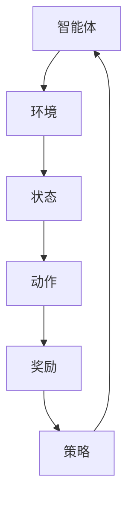

                 

关键词：(强化学习，代理工作流，工作流优化，人工智能，机器学习，优化算法)

> 摘要：本文将探讨如何利用强化学习技术优化人工智能代理工作流。通过介绍强化学习的基本原理、核心算法及其应用场景，文章详细阐述了如何构建一个高效的代理工作流系统，以实现工作流的自动化和智能化优化。同时，文章还提供了实际案例和代码示例，帮助读者更好地理解并应用这一技术。

## 1. 背景介绍

### 1.1 强化学习的发展背景

随着人工智能技术的迅猛发展，强化学习作为机器学习的一个重要分支，已经成为研究者和工程师们关注的焦点。强化学习起源于对人类学习和决策过程的研究，旨在通过奖励机制和试错方法，使智能体（agent）在不确定环境中找到最优策略，实现目标最大化。

### 1.2 代理工作流的定义与重要性

代理工作流（AI Agent WorkFlow）是指利用人工智能代理完成一系列任务的工作流程。在复杂的环境中，代理工作流能够自动化执行任务，提高工作效率和准确性。随着业务需求的不断变化，优化代理工作流成为提高系统性能的关键。

### 1.3 强化学习在代理工作流中的应用

强化学习技术可以用于优化代理工作流，通过学习环境中的奖励信号，自动调整工作流的执行策略，实现工作流的智能化和自动化优化。这使得代理工作流能够在动态变化的环境中持续改进，提高整体性能。

## 2. 核心概念与联系

### 2.1 强化学习的基本概念

强化学习（Reinforcement Learning，RL）是一种通过与环境交互，学习最优策略的机器学习方法。其核心概念包括：

- **智能体（Agent）**：执行动作、感知环境的实体。
- **环境（Environment）**：智能体执行动作的场所，提供状态和奖励。
- **状态（State）**：描述智能体所处环境的条件。
- **动作（Action）**：智能体可执行的操作。
- **奖励（Reward）**：对智能体行为的即时评价，影响策略的优化。
- **策略（Policy）**：智能体选择动作的概率分布。

### 2.2 代理工作流的架构

代理工作流的架构包括以下几个关键组件：

- **任务队列（Task Queue）**：存储待执行的任务列表。
- **智能体（Agent）**：执行任务、学习策略的实体。
- **环境（Environment）**：模拟任务执行过程的环境，提供状态和奖励。
- **控制器（Controller）**：负责调度任务、监控工作流执行。

### 2.3 核心概念的联系

强化学习与代理工作流之间的联系在于，强化学习可以用于优化代理工作流中的策略，从而提高工作流的性能。智能体通过与环境的交互，不断调整策略，以实现工作流的优化。

## 3. 核心算法原理 & 具体操作步骤

### 3.1 算法原理概述

强化学习算法的核心目标是找到一种最优策略，使智能体在给定的环境中获得最大的累积奖励。强化学习算法主要包括值函数方法和策略搜索方法。

- **值函数方法**：通过学习值函数来评估状态和策略，从而指导智能体的动作选择。常用的值函数方法包括Q学习和SARSA。
- **策略搜索方法**：直接搜索最优策略，不需要值函数的辅助。常用的策略搜索方法包括策略迭代和逆策略迭代。

### 3.2 算法步骤详解

#### 3.2.1 Q学习算法

Q学习算法是一种值函数方法，其核心思想是通过学习状态-动作值函数来指导动作选择。

1. 初始化Q值表。
2. 在状态s执行动作a，观察状态s'和奖励r。
3. 更新Q值：$$ Q(s,a) = Q(s,a) + \alpha [r + \gamma \max_{a'} Q(s',a') - Q(s,a)] $$
4. 更新状态：s' = s，s = s'。
5. 重复步骤2-4，直到达到终止条件。

#### 3.2.2 SARSA算法

SARSA算法是一种基于经验重放的方法，通过经验样本来更新策略。

1. 初始化策略π。
2. 从初始状态s开始，执行动作a。
3. 观察状态s'和奖励r。
4. 执行动作a'：$$ a' = \pi(s',\theta) $$
5. 更新策略：$$ \theta = \theta + \alpha (\r

