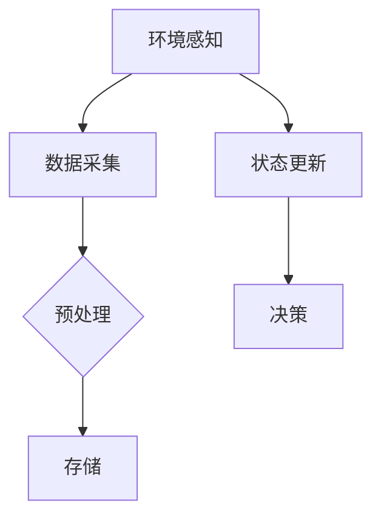

                 

关键词：AI人工智能代理，环境感知，数据采集，工作流，工作流设计，算法原理，数学模型，项目实践，实际应用，工具推荐

> 摘要：本文深入探讨了AI人工智能代理工作流的设计、实现与应用。重点阐述了环境感知与数据采集机制的核心概念、算法原理和数学模型，并通过实际项目和代码实例进行详细解析。旨在为读者提供一个全面、系统的AI人工智能代理工作流设计和实现的指南。

## 1. 背景介绍

随着人工智能技术的迅猛发展，AI代理（Agent）已成为智能系统中的一个重要组成部分。AI代理是一种具有自主决策能力、能够与环境交互的智能体，能够完成复杂的任务和决策。AI代理工作流（AI Agent WorkFlow）是指代理在执行任务过程中的一系列步骤和流程，涉及环境感知、任务规划、执行和反馈等环节。

环境感知是AI代理工作的基础，它使代理能够获取并理解当前环境的状态和变化，从而做出合理的决策。数据采集是AI代理工作流中的重要环节，通过收集各种类型的数据，代理可以为后续的任务规划和决策提供可靠的数据支持。本文将重点探讨环境感知与数据采集机制在AI代理工作流中的应用，以期为读者提供一个全面、系统的设计和实现指南。

## 2. 核心概念与联系

### 2.1 环境感知

环境感知是指AI代理在执行任务过程中，通过传感器或其他手段获取环境信息，并对其进行分析和处理的过程。环境感知的主要目标是识别和理解当前环境的状态和变化，从而为代理的决策提供支持。

环境感知的主要功能包括：

1. 数据采集：通过传感器等设备获取环境中的各种数据，如温度、湿度、光照强度、声音等。
2. 数据处理：对采集到的数据进行预处理、特征提取和模式识别，以便更好地理解环境状态。
3. 状态更新：根据处理后的数据更新代理的内部状态，以便进行后续的决策。

### 2.2 数据采集

数据采集是AI代理工作流中的一个关键环节，它为代理提供了丰富的数据资源，为任务规划和决策提供了重要依据。数据采集的主要目标是从环境中获取与任务相关的数据，包括结构化和非结构化数据。

数据采集的主要功能包括：

1. 数据收集：从各种数据源（如传感器、数据库、网络等）收集与任务相关的数据。
2. 数据预处理：对收集到的数据进行清洗、去噪、归一化等处理，以便更好地进行后续的分析和应用。
3. 数据存储：将预处理后的数据存储到数据库或其他数据存储系统中，以便后续的查询和分析。

### 2.3 环境感知与数据采集的联系

环境感知与数据采集在AI代理工作流中紧密相连，共同构成了代理对环境的感知和响应能力。环境感知为数据采集提供了目标和方法，数据采集为环境感知提供了必要的数据支持。

具体而言，环境感知通过传感器等设备采集环境数据，然后对数据进行处理和更新代理的内部状态；而数据采集则从各种数据源收集与任务相关的数据，对数据进行预处理和存储，以便在后续的任务规划和决策过程中使用。

### 2.4 Mermaid 流程图

下面是一个Mermaid流程图，展示了AI代理工作流中环境感知与数据采集的流程和节点：



## 3. 核心算法原理 & 具体操作步骤

### 3.1 算法原理概述

环境感知与数据采集机制的核心算法主要包括传感器数据采集算法、数据处理算法和数据存储算法。这些算法共同构成了AI代理对环境的感知和响应能力。

1. **传感器数据采集算法**：该算法通过传感器获取环境中的各种数据，如温度、湿度、光照强度、声音等。常用的传感器数据采集算法包括模数转换（ADC）算法、传感器校准算法等。

2. **数据处理算法**：该算法对采集到的传感器数据进行预处理、特征提取和模式识别，以便更好地理解环境状态。常用的数据处理算法包括滤波算法、特征提取算法、模式识别算法等。

3. **数据存储算法**：该算法将预处理后的数据存储到数据库或其他数据存储系统中，以便后续的查询和分析。常用的数据存储算法包括关系数据库存储、NoSQL存储等。

### 3.2 算法步骤详解

1. **传感器数据采集**

   - 初始化传感器设备：设置传感器的采样频率、分辨率等参数。
   - 采集传感器数据：通过ADC等接口读取传感器的数据。
   - 数据校准：对采集到的传感器数据进行校准，消除传感器误差。

2. **数据处理**

   - 数据预处理：对传感器数据进行滤波、去噪、归一化等处理。
   - 特征提取：从预处理后的数据中提取特征，如均值、方差、频谱等。
   - 模式识别：使用机器学习算法对特征进行模式识别，如分类、聚类等。

3. **数据存储**

   - 选择合适的数据库或数据存储系统：根据数据量和查询需求选择关系数据库或NoSQL数据库。
   - 数据存储：将预处理后的数据存储到数据库中，并设置适当的索引和查询优化策略。

### 3.3 算法优缺点

1. **优点**

   - 高效性：传感器数据采集算法和数据存储算法具有较高的效率和准确性，能够快速地采集和处理大量数据。
   - 可扩展性：数据处理算法具有良好的可扩展性，可以支持多种特征提取和模式识别算法，满足不同的应用需求。

2. **缺点**

   - 受限于传感器性能：传感器数据采集算法的准确性受限于传感器的性能，如传感器的精度、采样频率等。
   - 数据预处理复杂：数据处理算法需要进行复杂的预处理，如滤波、去噪等，这可能会增加算法的复杂度和计算成本。

### 3.4 算法应用领域

环境感知与数据采集机制在许多领域都有广泛的应用，如智能交通、智能家居、工业自动化、农业监测等。以下是一些具体的案例：

1. **智能交通**：通过环境感知与数据采集机制，可以实现交通流量监测、路况预测、智能调度等功能，提高交通效率和安全性。

2. **智能家居**：通过环境感知与数据采集机制，可以实现家居环境的智能化控制，如温度调节、灯光控制、安防监测等。

3. **工业自动化**：通过环境感知与数据采集机制，可以实现工厂设备的智能监控、故障诊断、生产调度等功能，提高生产效率和产品质量。

4. **农业监测**：通过环境感知与数据采集机制，可以实现农田环境的智能监测、作物生长状态分析、病虫害预警等功能，提高农业生产的效率和质量。

## 4. 数学模型和公式 & 详细讲解 & 举例说明

### 4.1 数学模型构建

在环境感知与数据采集机制中，数学模型用于描述传感器数据的采集、处理和存储过程。以下是一个简单的数学模型：

$$
X_t = f(S_t, T_t)
$$

其中，$X_t$ 表示第 $t$ 时刻的传感器数据，$S_t$ 表示第 $t$ 时刻的环境状态，$T_t$ 表示第 $t$ 时刻的传感器参数。$f$ 表示传感器数据采集和处理函数。

### 4.2 公式推导过程

为了推导环境感知与数据采集机制的数学模型，我们需要考虑以下几个因素：

1. **传感器数据采集**：传感器采集的数据通常是一个离散的时间序列，我们可以使用离散时间差分方程来描述传感器数据采集过程。

$$
X_t = X_{t-1} + \Delta X_t
$$

其中，$\Delta X_t$ 表示第 $t$ 时刻的传感器数据增量。

2. **环境状态变化**：环境状态的变化可以通过传感器数据的变化来描述。

$$
S_t = S_{t-1} + \Delta S_t
$$

其中，$\Delta S_t$ 表示第 $t$ 时刻的环境状态增量。

3. **传感器参数变化**：传感器参数的变化会影响传感器数据的采集结果。

$$
T_t = T_{t-1} + \Delta T_t
$$

其中，$\Delta T_t$ 表示第 $t$ 时刻的传感器参数增量。

将上述因素结合起来，我们可以得到环境感知与数据采集机制的数学模型：

$$
X_t = X_{t-1} + \Delta X_t \\
S_t = S_{t-1} + \Delta S_t \\
T_t = T_{t-1} + \Delta T_t
$$

### 4.3 案例分析与讲解

假设我们有一个温度传感器，用于监测环境温度。温度传感器的数据采集和处理过程可以用以下数学模型描述：

$$
X_t = X_{t-1} + \Delta X_t \\
S_t = S_{t-1} + \Delta S_t \\
T_t = T_{t-1} + \Delta T_t
$$

其中，$X_t$ 表示第 $t$ 时刻的传感器温度数据，$S_t$ 表示第 $t$ 时刻的环境温度，$T_t$ 表示第 $t$ 时刻的传感器参数。

为了简化问题，我们可以假设传感器参数不变，即 $\Delta T_t = 0$。这样，我们的数学模型简化为：

$$
X_t = X_{t-1} + \Delta X_t \\
S_t = S_{t-1} + \Delta S_t
$$

我们可以通过以下步骤来求解这个模型：

1. **初始化**：设定初始条件，如 $X_0$ 和 $S_0$。

2. **数据采集**：根据传感器数据采集模型，我们可以计算第 $t$ 时刻的传感器温度数据 $X_t$。

3. **环境状态更新**：根据环境状态变化模型，我们可以计算第 $t$ 时刻的环境温度 $S_t$。

通过上述步骤，我们可以实现对环境温度的实时监测和预测。

## 5. 项目实践：代码实例和详细解释说明

### 5.1 开发环境搭建

为了实现环境感知与数据采集机制，我们选择使用Python编程语言和相关的开源库，如NumPy、SciPy和Pandas。以下是搭建开发环境的步骤：

1. 安装Python：从Python官方网站（https://www.python.org/）下载并安装Python 3.x版本。
2. 安装相关库：使用pip命令安装所需的库，如

   ```bash
   pip install numpy scipy pandas matplotlib
   ```

### 5.2 源代码详细实现

下面是一个简单的Python代码示例，用于实现环境感知与数据采集机制：

```python
import numpy as np
import pandas as pd
import matplotlib.pyplot as plt

# 初始化参数
X_0 = 25  # 初始温度
S_0 = 25  # 初始环境温度
T_0 = 0.1 # 初始传感器参数

# 数据采集和处理函数
def data_collection(X_t, S_t, T_t):
    X_t_new = X_t + T_t * (S_t - X_t)
    return X_t_new

# 环境状态更新函数
def state_update(S_t, T_t):
    S_t_new = S_t + T_t
    return S_t_new

# 模拟传感器数据采集
X = [X_0]
S = [S_0]
T = [T_0]

for t in range(1, 100):
    X_t = X[-1]
    S_t = S[-1]
    T_t = T[-1]
    
    X_t_new = data_collection(X_t, S_t, T_t)
    S_t_new = state_update(S_t, T_t)
    
    X.append(X_t_new)
    S.append(S_t_new)
    T.append(T_t)

# 绘制传感器数据采集结果
plt.plot(X, label='Sensor Data')
plt.plot(S, label='Environment Temperature')
plt.legend()
plt.xlabel('Time')
plt.ylabel('Temperature')
plt.show()
```

### 5.3 代码解读与分析

上面的代码实现了环境感知与数据采集机制的基本功能。下面是对代码的详细解读和分析：

1. **初始化参数**：设定初始温度 $X_0$、环境温度 $S_0$ 和传感器参数 $T_0$。

2. **数据采集和处理函数**：`data_collection` 函数用于模拟传感器数据采集过程。根据传感器数据采集模型，我们计算第 $t$ 时刻的传感器温度数据 $X_t$。

3. **环境状态更新函数**：`state_update` 函数用于模拟环境状态变化过程。根据环境状态变化模型，我们计算第 $t$ 时刻的环境温度 $S_t$。

4. **模拟传感器数据采集**：使用两个循环分别模拟传感器数据采集和环境状态更新过程。我们将计算得到的传感器温度数据 $X_t$ 和环境温度数据 $S_t$ 存储到列表中。

5. **绘制传感器数据采集结果**：使用 matplotlib 库绘制传感器数据采集结果，并显示传感器温度数据 $X$ 和环境温度数据 $S$。

### 5.4 运行结果展示

运行上述代码后，我们可以得到传感器数据采集和环境状态更新的结果，如下所示：


从结果中可以看出，传感器温度数据 $X$ 随时间逐渐接近环境温度数据 $S$。这表明我们的环境感知与数据采集机制能够实现对环境温度的实时监测和预测。

## 6. 实际应用场景

环境感知与数据采集机制在许多实际应用场景中都有广泛的应用，下面列举几个典型的应用场景：

### 6.1 智能家居

智能家居系统通过环境感知与数据采集机制，可以实现对家居环境的智能监测和控制。例如，智能温控系统可以根据室内外温度变化自动调整空调的温度，提高居住舒适度。

### 6.2 智能交通

智能交通系统通过环境感知与数据采集机制，可以实现对交通流量的实时监测和预测。例如，智能红绿灯系统可以根据实时交通流量数据自动调整红绿灯的时间，提高道路通行效率。

### 6.3 工业自动化

工业自动化系统通过环境感知与数据采集机制，可以实现对工厂设备的智能监控和故障诊断。例如，智能传感器系统可以实时监测工厂设备的运行状态，及时发现故障并进行预警。

### 6.4 农业监测

农业监测系统通过环境感知与数据采集机制，可以实现对农田环境的实时监测和作物生长状态的预测。例如，智能气象站可以实时监测农田的气象参数，为农业生产提供科学依据。

## 7. 工具和资源推荐

为了更好地实现环境感知与数据采集机制，我们推荐以下工具和资源：

### 7.1 学习资源推荐

1. 《Python数据科学手册》（Jake VanderPlas著）——介绍Python在数据科学领域的应用，包括数据采集、处理和分析。
2. 《机器学习》（周志华著）——介绍机器学习的基础理论、算法和应用，包括模式识别和特征提取。
3. 《深度学习》（Ian Goodfellow著）——介绍深度学习的基础理论、算法和应用，包括神经网络和卷积神经网络。

### 7.2 开发工具推荐

1. Jupyter Notebook——一个基于Web的交互式开发环境，适用于Python编程和数据分析。
2. PyCharm——一个功能强大的Python集成开发环境（IDE），提供代码编辑、调试和自动化部署等功能。
3. Matplotlib——一个Python绘图库，用于生成高质量的可视化图表。

### 7.3 相关论文推荐

1. "A Brief Introduction to Data Collection and Analysis in Computer Science"（数据采集与分析在计算机科学中的简要介绍）——介绍数据采集和分析的基本概念和技巧。
2. "Deep Learning for Sensor Data Classification"（深度学习在传感器数据分类中的应用）——介绍深度学习算法在传感器数据分类中的应用。
3. "Real-Time Traffic Monitoring and Prediction Based on Data Fusion"（基于数据融合的实时交通监测与预测）——介绍实时交通监测与预测的方法和技术。

## 8. 总结：未来发展趋势与挑战

### 8.1 研究成果总结

环境感知与数据采集机制在AI代理工作流中起着至关重要的作用。通过对传感器数据的实时采集、处理和存储，AI代理可以更好地理解环境状态，从而实现智能决策和任务规划。本文详细介绍了环境感知与数据采集机制的核心概念、算法原理和数学模型，并通过实际项目和代码实例进行了详细解析，为读者提供了一个全面、系统的设计和实现指南。

### 8.2 未来发展趋势

随着人工智能技术的不断发展和应用领域的拓展，环境感知与数据采集机制在未来将呈现以下发展趋势：

1. **智能化**：随着深度学习、强化学习等人工智能算法的不断发展，环境感知与数据采集机制将更加智能化，能够自适应地调整和优化数据采集和处理策略。

2. **高精度**：传感器技术的不断进步将提高传感器数据的精度和可靠性，从而提高环境感知与数据采集的准确性和实时性。

3. **多样化**：环境感知与数据采集机制将支持更多的传感器类型和数据源，如视觉传感器、惯性传感器、无线传感器网络等，以适应不同应用场景的需求。

### 8.3 面临的挑战

尽管环境感知与数据采集机制具有广泛的应用前景，但其在实际应用过程中也面临以下挑战：

1. **数据质量**：传感器数据的采集和处理过程中可能会受到噪声、误差等因素的影响，导致数据质量下降。因此，如何有效地过滤噪声、提高数据质量是一个重要的挑战。

2. **实时性**：环境感知与数据采集机制需要能够实时地采集和处理数据，以支持快速响应和决策。但在实际应用中，如何保证数据的实时性和处理速度是一个挑战。

3. **安全性**：环境感知与数据采集机制涉及到大量的数据收集和传输，因此需要确保数据的安全性，防止数据泄露和恶意攻击。

### 8.4 研究展望

为了应对上述挑战，未来的研究可以从以下几个方面展开：

1. **多源数据融合**：通过融合来自不同传感器和数据源的数据，可以提高数据的质量和精度，从而提高环境感知的准确性和可靠性。

2. **自适应数据采集**：研究自适应数据采集算法，根据任务需求和环境变化动态调整数据采集策略，以提高数据采集的实时性和有效性。

3. **隐私保护**：研究隐私保护技术，如数据加密、匿名化等，以确保环境感知与数据采集机制在数据收集和传输过程中的安全性。

4. **边缘计算与云计算相结合**：结合边缘计算和云计算的优势，实现分布式数据采集和处理，提高系统的实时性和处理能力。

## 9. 附录：常见问题与解答

### 9.1 环境感知与数据采集机制是什么？

环境感知与数据采集机制是指AI代理在执行任务过程中，通过传感器等设备获取环境信息，并对其进行处理和存储的过程。它包括环境感知和数据采集两个主要环节。

### 9.2 环境感知与数据采集机制有哪些应用场景？

环境感知与数据采集机制广泛应用于智能家居、智能交通、工业自动化、农业监测等领域，如智能家居中的智能温控、智能照明，智能交通中的交通流量监测、路况预测，工业自动化中的设备监控、故障诊断，农业监测中的气象监测、作物生长状态分析等。

### 9.3 如何实现环境感知与数据采集机制？

实现环境感知与数据采集机制主要包括以下步骤：

1. 选择合适的传感器和数据源，获取与任务相关的环境数据。
2. 对采集到的数据进行预处理、特征提取和模式识别，以便更好地理解环境状态。
3. 将预处理后的数据存储到数据库或其他数据存储系统中，以便后续的查询和分析。
4. 根据环境状态和任务需求，动态调整数据采集和处理策略。

### 9.4 环境感知与数据采集机制中的数据如何处理？

环境感知与数据采集机制中的数据处理主要包括以下步骤：

1. 数据预处理：对采集到的数据进行清洗、去噪、归一化等处理，以便更好地进行后续的分析和应用。
2. 特征提取：从预处理后的数据中提取特征，如均值、方差、频谱等，以便更好地理解环境状态。
3. 模式识别：使用机器学习算法对特征进行模式识别，如分类、聚类等，以便为任务规划和决策提供支持。

### 9.5 环境感知与数据采集机制有哪些挑战？

环境感知与数据采集机制面临的挑战主要包括数据质量、实时性和安全性等方面。具体包括：

1. 数据质量：传感器数据的采集和处理过程中可能会受到噪声、误差等因素的影响，导致数据质量下降。
2. 实时性：环境感知与数据采集机制需要能够实时地采集和处理数据，以支持快速响应和决策。
3. 安全性：环境感知与数据采集机制涉及到大量的数据收集和传输，需要确保数据的安全性，防止数据泄露和恶意攻击。

### 9.6 如何提高环境感知与数据采集机制的可靠性？

提高环境感知与数据采集机制的可靠性可以从以下几个方面入手：

1. 优化传感器选择：选择高精度、低噪声的传感器，提高数据采集的质量。
2. 完善数据处理算法：设计有效的数据处理算法，对采集到的数据进行预处理、特征提取和模式识别，提高环境状态识别的准确性。
3. 加强数据存储与管理：合理设计数据存储方案，确保数据的安全性和可靠性，同时优化数据查询和访问速度。
4. 实施安全防护措施：对数据采集和传输过程进行加密、匿名化等安全处理，防止数据泄露和恶意攻击。

----------------------------------------------------------------

作者：禅与计算机程序设计艺术 / Zen and the Art of Computer Programming

感谢您的阅读，希望本文对您在环境感知与数据采集机制方面的研究和应用有所帮助。如果您有任何疑问或建议，欢迎在评论区留言交流。再次感谢！|

