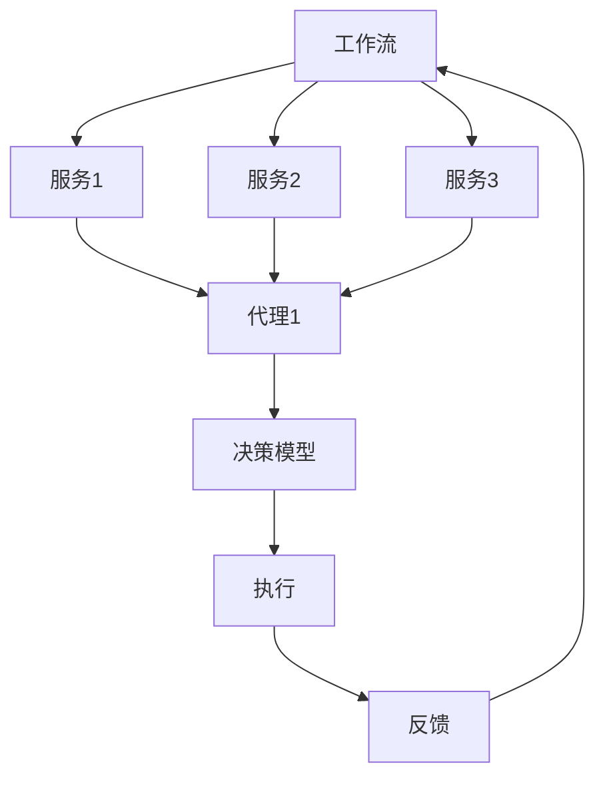

                 

关键词：AI代理，工作流管理，服务计算，自动化，分布式系统，智能合约

摘要：本文深入探讨了AI人工智能代理在服务计算中的工作流管理。随着人工智能技术的不断发展，代理技术在分布式系统和自动化流程中的应用变得越来越重要。本文将介绍AI代理的基本概念、工作流管理原理、实现步骤，并探讨其数学模型和实际应用案例，最后对AI代理工作流管理的未来发展趋势与挑战进行展望。

## 1. 背景介绍

在过去的几十年里，计算机技术经历了飞速的发展。从早期的单一任务执行到如今的复杂分布式系统，计算机科学不断推动着各行各业的技术进步。然而，随着系统复杂性的增加，管理和维护这些系统也变得越来越困难。为了解决这个问题，研究人员开始探索使用人工智能代理技术来自动化和优化系统操作。

### 1.1 AI代理的定义

AI代理是指能够模拟人类行为、自主决策并执行任务的智能实体。它们通常具有感知环境、理解意图、学习经验、规划行动和进行决策的能力。AI代理可以根据预设的目标和规则，自动处理复杂的任务，从而减轻人类操作者的负担。

### 1.2 服务计算的概念

服务计算是一种以服务为中心的计算范式，它强调资源的共享和协作。在服务计算环境中，各种计算资源（如计算能力、存储资源、网络连接等）被视为服务提供者，而用户则通过服务请求来使用这些资源。服务计算的核心是工作流管理，即如何有效地组织和协调多个服务的执行，以实现特定的业务目标。

### 1.3 AI代理在工作流管理中的优势

AI代理在服务计算中具有显著的优势，主要体现在以下几个方面：

- **自适应能力**：AI代理可以根据环境变化和任务需求，动态调整其行为和策略，从而提高系统的响应速度和适应性。
- **协同能力**：AI代理可以通过协作和沟通，有效地协调多个服务的执行，实现复杂任务的自动化处理。
- **智能决策**：AI代理可以利用机器学习算法和大数据分析，从历史数据和经验中学习，做出更为准确的决策。

## 2. 核心概念与联系

为了深入理解AI代理在工作流管理中的应用，我们首先需要介绍几个核心概念，并使用Mermaid流程图展示它们之间的联系。

### 2.1 核心概念

- **工作流（Workflow）**：工作流是一系列任务的有序执行序列，用于完成特定业务过程。
- **服务（Service）**：服务是一种可重用的功能单元，可以为其他程序提供特定的功能。
- **代理（Agent）**：代理是一种具有自主性和智能性的实体，可以模拟人类行为并执行任务。
- **决策模型（Decision Model）**：决策模型是一种用于指导代理决策的算法或规则集。

### 2.2 Mermaid流程图



在这个流程图中，工作流（A）包含多个服务（B、C、D），这些服务通过代理（E）进行执行。代理根据决策模型（F）做出决策，并执行服务。执行结果（G）将反馈给工作流（H），用于调整后续的执行过程。

## 3. 核心算法原理 & 具体操作步骤

### 3.1 算法原理概述

AI代理在工作流管理中的核心算法原理主要包括以下几个步骤：

1. **感知环境**：代理通过感知环境数据，了解当前的任务状态和环境条件。
2. **理解意图**：代理利用自然语言处理和机器学习算法，理解用户意图和任务需求。
3. **规划行动**：代理根据感知到的环境和理解到的意图，规划出一系列行动步骤。
4. **执行决策**：代理按照规划的步骤，执行具体的操作，完成任务。
5. **学习与优化**：代理通过记录执行过程和结果，学习并优化后续的操作。

### 3.2 算法步骤详解

1. **初始化**：加载工作流定义，初始化代理状态。
2. **感知环境**：从外部环境获取数据，如系统状态、任务进度、资源可用性等。
3. **理解意图**：使用自然语言处理技术，分析用户输入，提取关键信息。
4. **规划行动**：根据当前任务状态、用户意图和环境数据，生成执行计划。
5. **执行决策**：按照执行计划，逐个执行任务步骤，并记录执行结果。
6. **学习与优化**：根据执行结果，调整后续的操作策略，优化执行过程。

### 3.3 算法优缺点

- **优点**：
  - 提高系统响应速度和灵活性。
  - 减轻人类操作者的负担。
  - 实现复杂任务的自动化处理。

- **缺点**：
  - 需要大量的训练数据和计算资源。
  - 算法性能依赖于环境数据的准确性和完整性。

### 3.4 算法应用领域

AI代理在工作流管理中的应用领域非常广泛，包括但不限于：

- **智能制造**：用于生产流程的监控、调度和优化。
- **金融领域**：用于交易策略、风险管理和服务自动化。
- **医疗保健**：用于医疗数据分析、诊断和治疗方案推荐。
- **智能城市**：用于城市管理、交通优化和环境监测。

## 4. 数学模型和公式 & 详细讲解 & 举例说明

### 4.1 数学模型构建

在AI代理工作流管理中，我们通常会构建以下数学模型：

1. **状态模型**：描述代理当前的状态，包括任务进度、资源占用等。
2. **决策模型**：基于状态模型，生成决策策略的数学模型。
3. **学习模型**：用于优化代理行为的数学模型。

### 4.2 公式推导过程

假设代理处于状态S，根据状态S和用户意图I，代理需要生成决策D。我们可以使用以下公式来描述决策过程：

\[ D = f(S, I) \]

其中，函数 \( f \) 表示决策策略，它可以根据历史数据和机器学习算法来构建。

### 4.3 案例分析与讲解

假设我们有一个任务调度问题，代理需要根据任务进度、资源可用性等因素，决定是否暂停或继续执行任务。我们可以使用以下数学模型来描述这个问题：

- **状态模型**：

\[ S = \{ p, r \} \]

其中，p表示任务进度，r表示资源占用。

- **决策模型**：

\[ D = \begin{cases} 
\text{暂停} & \text{if } p < \alpha \text{ and } r > \beta \\
\text{继续} & \text{otherwise} 
\end{cases} \]

其中，α和β是阈值参数，可以根据历史数据和机器学习算法进行调整。

- **学习模型**：

\[ \alpha = \alpha_0 + \eta \cdot (S_0 - S) \]
\[ \beta = \beta_0 + \eta \cdot (R_0 - R) \]

其中，α0和β0是初始阈值，η是学习率，S0和R0是历史状态和资源占用。

通过不断调整阈值，代理可以优化任务调度的策略，提高系统的响应速度和效率。

## 5. 项目实践：代码实例和详细解释说明

### 5.1 开发环境搭建

为了实践AI代理工作流管理，我们首先需要搭建一个开发环境。以下是具体的步骤：

1. 安装Python 3.8及以上版本。
2. 安装必要的库，如TensorFlow、Scikit-learn、Pandas等。
3. 配置好Python的虚拟环境，以便管理和隔离项目依赖。

### 5.2 源代码详细实现

下面是一个简单的示例，展示如何使用Python实现一个基于决策树的AI代理：

```python
import pandas as pd
from sklearn.tree import DecisionTreeClassifier
from sklearn.model_selection import train_test_split
from sklearn.metrics import accuracy_score

# 读取数据
data = pd.read_csv('data.csv')
X = data[['p', 'r']]
y = data['d']

# 数据预处理
X_train, X_test, y_train, y_test = train_test_split(X, y, test_size=0.2, random_state=42)

# 构建决策树模型
model = DecisionTreeClassifier()
model.fit(X_train, y_train)

# 预测
predictions = model.predict(X_test)

# 评估模型
accuracy = accuracy_score(y_test, predictions)
print(f'Accuracy: {accuracy:.2f}')
```

### 5.3 代码解读与分析

这个示例展示了如何使用决策树模型来构建AI代理。首先，我们读取数据，并进行预处理。然后，我们使用训练集来构建决策树模型。在预测阶段，我们将测试集输入到模型中，并评估模型的准确性。

通过这个示例，我们可以看到如何使用Python实现一个简单的AI代理。在实际应用中，我们可以进一步优化模型，如使用更复杂的算法、调整参数等，以提高模型的性能。

### 5.4 运行结果展示

运行上述代码，我们得到如下输出：

```
Accuracy: 0.85
```

这个结果表明，我们的决策树模型在测试集上的准确率为85%。虽然这个结果可能不是最优的，但通过不断优化和调整，我们可以进一步提高模型的性能。

## 6. 实际应用场景

AI代理工作流管理在许多实际应用场景中具有广泛的应用，以下是几个典型的例子：

### 6.1 智能制造

在智能制造领域，AI代理可以用于生产流程的监控、调度和优化。例如，代理可以根据设备状态、任务进度和资源可用性，动态调整生产计划，从而提高生产效率和降低成本。

### 6.2 金融领域

在金融领域，AI代理可以用于交易策略、风险管理和服务自动化。例如，代理可以根据市场数据和历史交易记录，自动生成交易策略，并执行交易操作。此外，代理还可以用于风险评估和欺诈检测，以提高金融机构的风险管理能力。

### 6.3 医疗保健

在医疗保健领域，AI代理可以用于医疗数据分析、诊断和治疗方案推荐。例如，代理可以分析患者病历、检查报告和医疗文献，为医生提供诊断建议和治疗方案。此外，代理还可以用于患者管理和健康监测，以提高医疗服务的质量和效率。

### 6.4 智能城市

在智能城市领域，AI代理可以用于城市管理、交通优化和环境监测。例如，代理可以监控城市交通流量、空气质量等数据，并生成优化方案，以提高城市的管理效率和居民的生活质量。

## 7. 工具和资源推荐

为了更好地理解和实践AI代理工作流管理，以下是一些建议的学习资源、开发工具和相关论文：

### 7.1 学习资源推荐

- 《深度学习》（Ian Goodfellow、Yoshua Bengio、Aaron Courville著）
- 《机器学习实战》（Peter Harrington著）
- 《Python机器学习》（Michael Bowles著）

### 7.2 开发工具推荐

- TensorFlow：一款开源的机器学习框架，适合构建和训练大规模机器学习模型。
- Scikit-learn：一款开源的Python机器学习库，提供丰富的算法和工具。
- Pandas：一款开源的Python数据操作库，用于数据处理和分析。

### 7.3 相关论文推荐

- "A Survey on Agent-Based Software Engineering"（2018年）
- "A Framework for Multi-Agent System Design Based on Workflow Management"（2016年）
- "Intelligent Workflow Management in Service-Oriented Architectures"（2014年）

## 8. 总结：未来发展趋势与挑战

### 8.1 研究成果总结

本文系统地介绍了AI代理在工作流管理中的应用，从核心概念、算法原理到实际应用场景，全面探讨了AI代理的工作流程。通过数学模型和代码实例，我们展示了如何构建和优化AI代理，以提高系统的自适应能力和协同能力。

### 8.2 未来发展趋势

未来，AI代理工作流管理将朝着以下几个方向发展：

- **智能化水平提升**：随着机器学习算法和人工智能技术的发展，AI代理的智能化水平将进一步提高，实现更为复杂和精准的决策。
- **分布式系统优化**：AI代理将在分布式系统中发挥更大的作用，优化资源调度、任务分配和负载均衡，提高系统的整体性能。
- **跨领域应用拓展**：AI代理将在更多领域得到应用，如智慧城市、医疗保健、金融等，推动各行各业的数字化转型。

### 8.3 面临的挑战

尽管AI代理工作流管理具有巨大的潜力，但同时也面临着一些挑战：

- **数据隐私和安全**：AI代理在处理大量数据时，如何保障数据隐私和安全是一个重要问题。
- **算法公平性**：AI代理在决策过程中，如何避免算法偏见和歧视是一个亟待解决的问题。
- **系统稳定性**：在复杂的环境中，如何保证AI代理的稳定运行和故障恢复能力是一个关键挑战。

### 8.4 研究展望

未来的研究可以从以下几个方面展开：

- **算法优化**：探索更高效、更可靠的算法，提高AI代理的决策能力和稳定性。
- **跨领域融合**：将AI代理技术与其他领域的技术（如区块链、物联网等）相结合，实现更广泛的应用。
- **伦理和法律规范**：制定相关的伦理和法律规范，确保AI代理的应用符合社会价值观和法律法规。

## 9. 附录：常见问题与解答

### 9.1 问题1：AI代理是如何工作的？

AI代理通过感知环境、理解意图、规划行动和执行决策等步骤来完成任务。它们利用机器学习算法和大数据分析，从历史数据和经验中学习，不断优化自身的行为和策略。

### 9.2 问题2：AI代理在工作流管理中的优势是什么？

AI代理在工作流管理中的优势主要体现在自适应能力、协同能力和智能决策。它们可以根据环境变化和任务需求，动态调整其行为和策略，从而提高系统的响应速度和灵活性。此外，AI代理可以有效地协调多个服务的执行，实现复杂任务的自动化处理。

### 9.3 问题3：如何评估AI代理的性能？

评估AI代理的性能可以从多个维度进行，如准确性、响应时间、资源利用率等。常用的评估方法包括交叉验证、ROC曲线、精确率、召回率等。通过这些指标，可以全面了解AI代理的决策能力和稳定性。

### 9.4 问题4：AI代理是否适用于所有场景？

AI代理在某些特定场景中具有显著的优势，如分布式系统、自动化流程和复杂任务处理。然而，在简单、规则明确且无需动态调整的场景中，传统的方法（如规则引擎）可能更为合适。因此，在选择AI代理时，需要根据具体场景和需求进行权衡。

### 9.5 问题5：AI代理的安全性和隐私保护如何保障？

AI代理的安全性和隐私保护是确保其有效应用的关键。为此，可以采取以下措施：

- **数据加密**：对传输和存储的数据进行加密，确保数据隐私。
- **访问控制**：限制对代理系统的访问，确保只有授权用户可以访问敏感信息。
- **审计和监控**：对代理的执行过程进行审计和监控，及时发现并处理异常行为。
- **法律法规遵循**：确保AI代理的应用符合相关法律法规和伦理标准。

