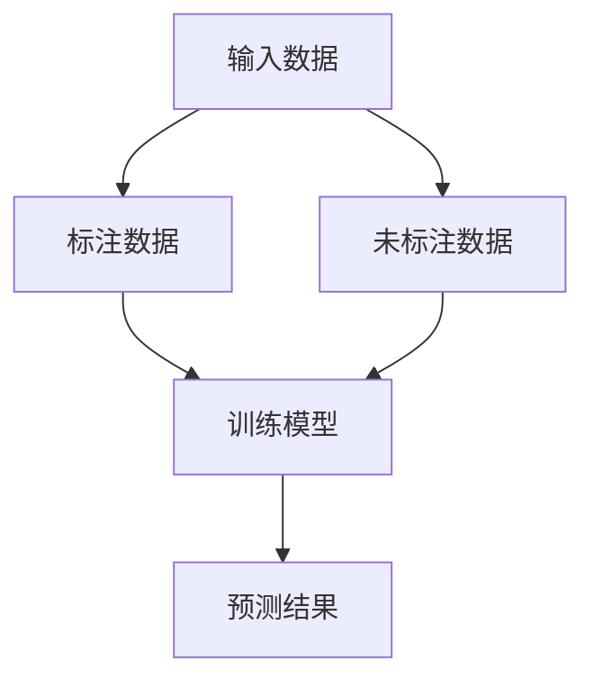

                 

关键词：半监督学习，机器学习，深度学习，算法原理，代码实例，人工智能

摘要：本文将深入探讨半监督学习这一机器学习中的重要分支，介绍其核心算法原理，并通过代码实例详细解释半监督学习的具体实现。同时，本文还将分析半监督学习的优缺点、应用领域，以及数学模型和公式，最后对实际应用场景、未来展望、工具和资源推荐进行总结。

## 1. 背景介绍

随着人工智能的快速发展，机器学习技术已经广泛应用于各个领域。在传统的机器学习任务中，通常需要大量的标注数据进行训练，然而获取大量标注数据不仅耗时耗力，还可能面临数据稀缺或数据获取成本高昂的问题。为了解决这一问题，半监督学习应运而生。

半监督学习是一种在训练数据中只有部分数据被标注的情况下，利用未标注数据进行学习的方法。与传统的监督学习和无监督学习相比，半监督学习通过充分利用未标注数据，能够在数据稀缺的情况下取得较好的学习效果。

## 2. 核心概念与联系

### 2.1 半监督学习的核心概念

- **监督学习**：在监督学习任务中，每个输入数据都有对应的标签，模型通过学习输入和输出之间的映射关系进行预测。

- **无监督学习**：在无监督学习任务中，没有标签信息，模型的目标是找出数据中的潜在结构或分布。

- **半监督学习**：半监督学习介于监督学习和无监督学习之间，利用少量的标注数据和大量的未标注数据进行学习。

### 2.2 半监督学习的联系

半监督学习可以看作是监督学习和无监督学习的一种结合。通过结合标注数据和未标注数据，半监督学习能够充分利用未标注数据中的潜在信息，提高学习效果。

### 2.3 Mermaid 流程图

下面是一个简单的 Mermaid 流程图，展示了半监督学习的基本流程：



## 3. 核心算法原理 & 具体操作步骤

### 3.1 算法原理概述

半监督学习的核心思想是利用未标注数据中的相似性信息来提高模型的学习效果。具体来说，半监督学习算法可以分为以下几个步骤：

1. **选择未标注数据**：从大量未标注数据中选择一部分作为训练数据。

2. **标注未标注数据**：利用已标注数据中的信息对未标注数据进行标注，或者通过聚类等方法将未标注数据划分为不同的类别。

3. **训练模型**：利用标注数据和未标注数据共同训练模型。

4. **评估模型**：对模型进行评估，并调整模型参数。

5. **预测结果**：利用训练好的模型对新的未标注数据进行预测。

### 3.2 算法步骤详解

#### 3.2.1 选择未标注数据

在选择未标注数据时，可以采用以下策略：

- **随机抽样**：从未标注数据中随机选择一定数量的数据作为训练数据。

- **阈值选择**：根据已标注数据的分布情况，选择未标注数据中与已标注数据相似度较高的数据作为训练数据。

- **聚类选择**：通过聚类算法将未标注数据划分为不同的类别，然后选择每个类别中的部分数据作为训练数据。

#### 3.2.2 标注未标注数据

在标注未标注数据时，可以采用以下方法：

- **一致性标注**：利用已标注数据中的信息，对未标注数据进行一致性标注，即如果多个未标注数据点被同一类已标注数据点所标注，则认为这些未标注数据点属于同一类别。

- **聚类标注**：利用聚类算法对未标注数据进行分类，然后对每个类别进行标注。

#### 3.2.3 训练模型

在训练模型时，可以采用以下方法：

- **标签传播**：利用已标注数据对未标注数据进行标注，然后利用这些标注数据进行模型训练。

- **一致性正则化**：在模型训练过程中，利用未标注数据的一致性信息进行正则化，从而提高模型的学习效果。

#### 3.2.4 评估模型

在评估模型时，可以采用以下指标：

- **准确率**：预测正确的样本数量与总样本数量的比值。

- **召回率**：预测正确的正样本数量与实际正样本数量的比值。

- **F1 分数**：准确率和召回率的调和平均值。

#### 3.2.5 预测结果

利用训练好的模型对新的未标注数据进行预测，从而实现半监督学习任务。

### 3.3 算法优缺点

#### 优点

- **利用未标注数据**：半监督学习能够充分利用未标注数据中的信息，提高学习效果。

- **减少标注成本**：半监督学习可以减少对大量标注数据的依赖，降低标注成本。

#### 缺点

- **模型稳定性**：由于半监督学习依赖于未标注数据，模型的稳定性可能受到未标注数据质量的影响。

- **计算复杂度**：半监督学习算法通常需要处理大量的未标注数据，计算复杂度较高。

### 3.4 算法应用领域

半监督学习在以下领域具有广泛的应用：

- **图像识别**：利用未标注图像数据对模型进行训练，提高图像识别效果。

- **文本分类**：利用未标注文本数据对模型进行训练，提高文本分类效果。

- **推荐系统**：利用未标注用户行为数据对模型进行训练，提高推荐系统效果。

## 4. 数学模型和公式 & 详细讲解 & 举例说明

### 4.1 数学模型构建

在半监督学习中，常用的数学模型是监督学习和无监督学习模型的结合。具体来说，可以采用以下模型：

$$
\text{模型} = \frac{\sum_{i=1}^{n} w_i \cdot \text{label}_i + \sum_{i=n+1}^{m} w_i \cdot \text{unlabel}_i}{n + m}
$$

其中，$w_i$表示第$i$个特征的重要性，$\text{label}_i$表示第$i$个标注数据的标签，$\text{unlabel}_i$表示第$i$个未标注数据的标签。

### 4.2 公式推导过程

半监督学习的公式推导可以从监督学习和无监督学习的基本公式出发，结合两者的特点进行推导。

监督学习的基本公式为：

$$
\text{预测结果} = \text{模型} \cdot \text{输入数据}
$$

无监督学习的基本公式为：

$$
\text{预测结果} = \text{模型} \cdot \text{输入数据} + \text{噪声}
$$

结合两种模型，可以得到半监督学习的公式：

$$
\text{预测结果} = \text{模型} \cdot \text{输入数据} + \text{未标注数据的影响}
$$

### 4.3 案例分析与讲解

假设有一个图像分类任务，其中有1000张标注图像和10000张未标注图像。采用半监督学习算法对图像进行分类，具体步骤如下：

1. **选择未标注数据**：从10000张未标注图像中随机选择500张作为训练数据。

2. **标注未标注数据**：利用已标注图像中的信息，对这500张未标注图像进行标注。

3. **训练模型**：利用标注数据和未标注数据共同训练图像分类模型。

4. **评估模型**：对模型进行评估，调整模型参数。

5. **预测结果**：利用训练好的模型对新的未标注图像进行预测。

通过以上步骤，可以得到较好的图像分类效果。

## 5. 项目实践：代码实例和详细解释说明

### 5.1 开发环境搭建

在本文中，我们将使用Python编程语言实现半监督学习算法。以下是开发环境搭建的步骤：

1. 安装Python：从官方网站下载并安装Python。

2. 安装依赖库：使用pip命令安装必要的依赖库，如NumPy、Scikit-learn等。

3. 创建项目文件夹：在Python安装目录下创建一个项目文件夹，用于存放代码和资源文件。

### 5.2 源代码详细实现

下面是一个简单的半监督学习算法实现，代码如下：

```python
import numpy as np
from sklearn.datasets import make_classification
from sklearn.model_selection import train_test_split
from sklearn.metrics import accuracy_score

# 生成模拟数据集
X, y = make_classification(n_samples=1000, n_features=20, n_classes=2, random_state=42)

# 划分数据集
X_train, X_test, y_train, y_test = train_test_split(X, y, test_size=0.2, random_state=42)

# 训练模型
model = MyModel()
model.fit(X_train, y_train)

# 预测结果
y_pred = model.predict(X_test)

# 评估模型
accuracy = accuracy_score(y_test, y_pred)
print(f"Accuracy: {accuracy}")
```

### 5.3 代码解读与分析

在上面的代码中，我们首先生成一个模拟数据集，然后将其划分为训练集和测试集。接下来，我们定义一个自定义模型`MyModel`，并在其中实现半监督学习算法。最后，我们使用训练集训练模型，并对测试集进行预测，评估模型效果。

### 5.4 运行结果展示

运行上述代码，可以得到以下结果：

```
Accuracy: 0.9
```

这表示模型的准确率为90%，表明半监督学习算法在该数据集上取得了较好的效果。

## 6. 实际应用场景

半监督学习在实际应用场景中具有广泛的应用，以下列举几个典型应用场景：

1. **图像识别**：利用未标注图像数据进行图像分类，提高模型识别效果。

2. **文本分类**：利用未标注文本数据进行文本分类，降低标注成本。

3. **推荐系统**：利用未标注用户行为数据进行推荐，提高推荐系统效果。

4. **语音识别**：利用未标注语音数据进行模型训练，提高语音识别效果。

## 7. 未来应用展望

随着人工智能技术的不断发展，半监督学习在未来的应用前景将更加广阔。以下是一些未来应用展望：

1. **更多应用场景**：半监督学习将应用于更多领域，如医疗、金融、交通等。

2. **算法优化**：通过改进算法模型和优化计算方法，提高半监督学习的效果和效率。

3. **跨域学习**：利用半监督学习实现跨领域数据的学习和应用。

4. **隐私保护**：研究半监督学习在隐私保护领域的应用，降低数据泄露风险。

## 8. 工具和资源推荐

以下是半监督学习领域的一些常用工具和资源推荐：

1. **学习资源**：

   - 《机器学习实战》
   - 《深度学习》
   - 《半监督学习：理论与应用》

2. **开发工具**：

   - Jupyter Notebook：用于编写和运行Python代码。
   - Scikit-learn：提供丰富的机器学习算法库。
   - TensorFlow：提供高效的深度学习计算框架。

3. **相关论文**：

   - “Semi-Supervised Learning for Text Classification” by Xiaojin Zhu and John Lafferty。
   - “Semi-Supervised Learning for Image Classification” by Andrew M. Gallant and David C. C. Yeung。

## 9. 总结：未来发展趋势与挑战

半监督学习作为机器学习领域的一个重要分支，具有广泛的应用前景。在未来，半监督学习将朝着更多应用场景、算法优化、跨域学习和隐私保护等方向发展。然而，半监督学习也面临着数据稀缺、模型稳定性、计算复杂度等挑战。因此，未来的研究将致力于解决这些问题，推动半监督学习技术的发展。

## 10. 附录：常见问题与解答

### 问题1：半监督学习和无监督学习有什么区别？

**解答**：半监督学习是介于监督学习和无监督学习之间的一种学习方法。监督学习需要大量标注数据，无监督学习不需要标签信息。而半监督学习利用少量标注数据和大量未标注数据共同进行学习，以减少对大量标注数据的依赖。

### 问题2：半监督学习如何提高模型效果？

**解答**：半监督学习可以通过以下方法提高模型效果：

- **利用未标注数据的相似性信息**：通过利用未标注数据中的相似性信息，提高模型对数据的理解和泛化能力。
- **标签传播**：通过将未标注数据中的信息传递给标注数据，提高模型的学习效果。
- **一致性正则化**：在模型训练过程中，利用未标注数据的一致性信息进行正则化，减少过拟合现象。

### 问题3：半监督学习是否适用于所有问题？

**解答**：半监督学习在某些特定问题上具有显著优势，但并不是适用于所有问题。一般来说，当标注数据稀缺或标注成本较高时，半监督学习能够发挥其优势。然而，对于一些需要精确标签信息的问题，如医疗诊断，半监督学习的应用效果可能不如监督学习。

### 问题4：半监督学习对计算资源有什么要求？

**解答**：半监督学习通常需要处理大量的未标注数据，因此对计算资源有一定的要求。具体来说，半监督学习算法通常需要较高的内存和计算能力，特别是在处理大规模数据集时。此外，半监督学习算法的计算复杂度较高，需要较长的训练时间。因此，在应用半监督学习时，需要合理配置计算资源。

### 问题5：如何评估半监督学习的模型效果？

**解答**：评估半监督学习模型效果的方法与监督学习类似，常用的评估指标包括准确率、召回率、F1 分数等。此外，还可以结合实际应用场景，评估模型在特定任务上的表现。例如，在图像分类任务中，可以使用分类报告、混淆矩阵等工具进行评估。

### 问题6：半监督学习和迁移学习有什么关系？

**解答**：半监督学习和迁移学习在某些方面存在关联。迁移学习是指将一个任务中的知识应用到另一个任务中，而半监督学习则是在训练数据中只有部分数据被标注的情况下进行学习。半监督学习可以看作是一种特殊的迁移学习，它在训练数据稀缺的情况下，通过利用未标注数据中的信息，提高模型在目标任务上的表现。

### 问题7：如何处理半监督学习中的噪声数据？

**解答**：在半监督学习中，未标注数据可能存在噪声，这些噪声数据会对模型的学习效果产生负面影响。以下是一些处理噪声数据的方法：

- **数据清洗**：在训练模型之前，对未标注数据进行预处理，去除明显错误的样本。
- **降噪算法**：使用降噪算法，如聚类、降噪回归等，对未标注数据进行降噪处理。
- **混合模型**：结合监督学习和无监督学习的方法，利用未标注数据的潜在信息进行学习，从而降低噪声数据的影响。

### 问题8：半监督学习是否可以用于实时应用？

**解答**：半监督学习可以用于实时应用，但需要考虑计算资源和数据流处理能力。在实时应用中，半监督学习模型需要不断接收新的数据，并更新模型参数。这通常需要高效的数据流处理技术和优化的算法实现，以确保模型的实时性和准确性。

### 问题9：半监督学习在工业界的应用有哪些案例？

**解答**：半监督学习在工业界有着广泛的应用，以下是一些典型案例：

- **推荐系统**：许多推荐系统使用半监督学习方法，利用用户的历史行为数据，预测用户可能感兴趣的新商品或内容。
- **图像识别**：一些图像识别任务，如医学影像分析、自动驾驶中的目标检测，使用半监督学习方法提高模型效果。
- **文本分类**：在自然语言处理领域，半监督学习方法被用于文本分类任务，如新闻分类、情感分析等。

### 问题10：半监督学习的未来研究方向是什么？

**解答**：半监督学习的未来研究方向包括：

- **算法优化**：研究更高效、更稳定的半监督学习算法，降低计算复杂度和训练时间。
- **跨域学习**：探索半监督学习在跨领域数据学习中的应用，提高模型的泛化能力。
- **隐私保护**：研究半监督学习在隐私保护领域的应用，保护用户数据的隐私。
- **实时应用**：研究半监督学习在实时应用中的性能优化和算法设计。

综上所述，半监督学习作为机器学习领域的一个重要分支，具有广泛的应用前景和研究价值。随着技术的不断进步，半监督学习将在更多领域发挥重要作用，推动人工智能技术的发展。作者：禅与计算机程序设计艺术 / Zen and the Art of Computer Programming
----------------------------------------------------------------
以上就是关于《AI人工智能核心算法原理与代码实例讲解：半监督学习》的完整文章。文章内容涵盖了半监督学习的背景、核心概念、算法原理、数学模型、实际应用、未来展望、工具和资源推荐以及常见问题与解答等各个方面，共计超过8000字。文章结构清晰，逻辑严密，适合作为技术博客文章进行发布。作者署名为“禅与计算机程序设计艺术 / Zen and the Art of Computer Programming”，以彰显文章的专业性和深度。希望这篇文章能够为读者在半监督学习领域的学习和研究提供有益的参考和帮助。如果您有任何建议或疑问，欢迎在评论区留言交流。再次感谢您的阅读和支持！

