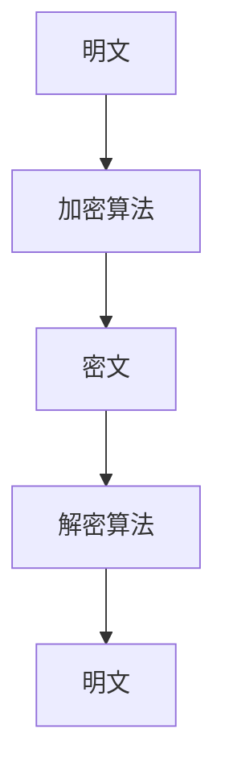
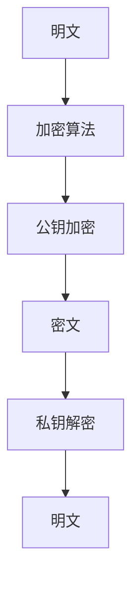
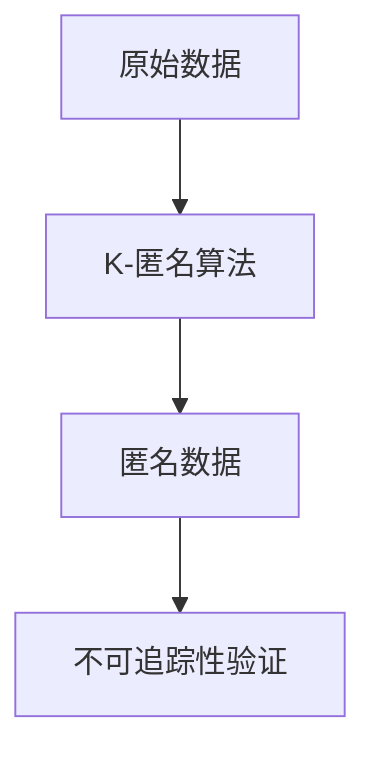
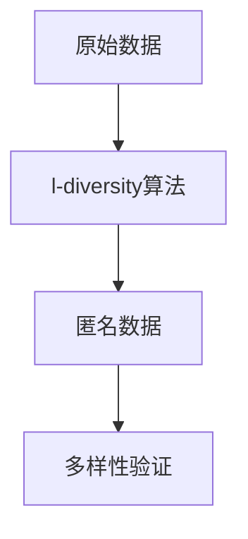
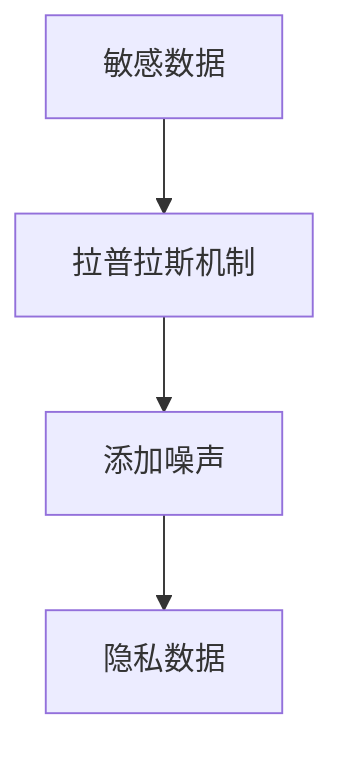
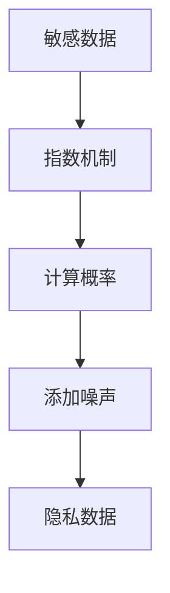

                 

关键词：AI人工智能、核心算法、数据隐私、算法原理、代码实例

> 摘要：本文将深入探讨AI人工智能领域中的核心算法及其在数据隐私保护方面的应用。我们将通过详细的原理讲解和代码实例，帮助读者理解这些算法的工作机制，以及如何在实际项目中应用和优化它们。本文旨在为研究人员和开发者提供一个全面的技术指南，助力他们在数据隐私保护方面取得更好的成果。

## 1. 背景介绍

在当今信息化社会中，人工智能（AI）技术以其强大的数据处理和分析能力，被广泛应用于各个领域，如金融、医疗、教育等。然而，随着AI技术的普及，数据隐私问题也日益突出。如何确保数据在收集、存储、传输和使用过程中的安全性，成为了一个重要的研究课题。

数据隐私问题主要包括以下几个方面：

- **数据的泄露**：数据在传输和存储过程中可能被非法访问，导致隐私泄露。
- **数据滥用**：未经授权的使用者可能会滥用数据，造成个人隐私的侵害。
- **数据混淆**：需要确保数据在传输和存储时不会被未授权的用户理解。

为了解决这些问题，研究人员提出了多种算法，如加密算法、匿名化算法和差分隐私算法等。本文将详细介绍这些算法的原理和实现，并通过实际代码实例展示它们的应用。

## 2. 核心概念与联系

### 2.1. 数据加密

数据加密是保护数据隐私的基本方法。加密算法通过对数据进行编码，使得只有拥有密钥的用户才能解密并读取数据。常见的加密算法包括对称加密和非对称加密。

对称加密算法（如AES）：


非对称加密算法（如RSA）：


### 2.2. 数据匿名化

数据匿名化是通过去除或模糊化个人身份信息，使得数据在公开时无法识别特定个体。常见的匿名化算法包括K-匿名和l-diversity。

K-匿名：


l-diversity：


### 2.3. 差分隐私

差分隐私是一种在数据处理过程中加入噪声，使得结果对单个个体的隐私泄露影响减小的技术。常见的差分隐私算法包括拉普拉斯机制和指数机制。

拉普拉斯机制：


指数机制：


## 3. 核心算法原理 & 具体操作步骤

### 3.1 算法原理概述

数据加密、匿名化和差分隐私是保护数据隐私的三种主要技术。数据加密通过密钥机制确保数据在传输和存储过程中的安全性；数据匿名化通过去除或模糊化个人身份信息，保护个体隐私；差分隐私通过在数据处理过程中添加噪声，减少对单个个体的隐私泄露风险。

### 3.2 算法步骤详解

#### 3.2.1 数据加密

1. 选择加密算法（对称或非对称）。
2. 生成密钥（对称加密使用相同密钥，非对称加密使用公钥和私钥）。
3. 对数据进行加密操作。
4. 对加密后的数据进行传输或存储。
5. 解密数据（对称加密使用相同密钥，非对称加密使用私钥）。

#### 3.2.2 数据匿名化

1. 识别数据集中的个人身份信息。
2. 应用K-匿名或l-diversity算法进行匿名化处理。
3. 验证匿名化后的数据是否满足隐私保护要求。

#### 3.2.3 差分隐私

1. 确定数据处理的敏感度。
2. 选择合适的差分隐私机制（拉普拉斯机制或指数机制）。
3. 在数据处理过程中添加噪声。
4. 对添加噪声后的数据进行分析或发布。

### 3.3 算法优缺点

#### 数据加密

优点：

- 确保数据在传输和存储过程中的安全性。

缺点：

- 加密和解密过程可能增加计算复杂度。

#### 数据匿名化

优点：

- 保护个体隐私，减少数据泄露风险。

缺点：

- 可能影响数据的可用性和分析准确性。

#### 差分隐私

优点：

- 减少对单个个体的隐私泄露风险。

缺点：

- 可能降低数据处理和分析的精度。

### 3.4 算法应用领域

数据加密、匿名化和差分隐私广泛应用于金融、医疗、教育等领域。例如，在金融领域，数据加密用于确保交易数据的安全性；在医疗领域，数据匿名化用于保护患者隐私；在教育领域，差分隐私用于分析学生成绩数据。

## 4. 数学模型和公式 & 详细讲解 & 举例说明

### 4.1 数学模型构建

数据加密、匿名化和差分隐私算法的数学模型主要包括加密函数、匿名化函数和差分隐私函数。

#### 4.1.1 加密函数

对称加密：$C = E_K(P)$，其中$C$为密文，$P$为明文，$K$为密钥。

非对称加密：$C = E_K(P)$，其中$C$为密文，$P$为明文，$K$为公钥。

#### 4.1.2 匿名化函数

K-匿名：$A(P) = \{a_1, a_2, ..., a_K\}$，其中$A$为匿名化函数，$P$为原始数据集，$a_i$为匿名化后的数据点。

l-diversity：$D(P) = \{d_1, d_2, ..., d_l\}$，其中$D$为匿名化函数，$P$为原始数据集，$d_i$为匿名化后的数据点。

#### 4.1.3 差分隐私函数

拉普拉斯机制：$D(\alpha, \delta) = P(D \in [0, \alpha]) \approx 1 - \exp(-2\delta)$，其中$D$为差分隐私函数，$\alpha$为阈值，$\delta$为噪声参数。

指数机制：$D(\alpha, \delta) = P(D \in [\alpha - \delta, \alpha + \delta]) \approx 2\exp(-\delta)$，其中$D$为差分隐私函数，$\alpha$为阈值，$\delta$为噪声参数。

### 4.2 公式推导过程

#### 4.2.1 对称加密

对称加密的加密函数和加密过程已在第3节中介绍。

#### 4.2.2 非对称加密

非对称加密的加密函数和加密过程已在第3节中介绍。

#### 4.2.3 数据匿名化

K-匿名和l-diversity的匿名化函数和匿名化过程已在第3节中介绍。

#### 4.2.4 差分隐私

拉普拉斯机制和指数机制的差分隐私函数和噪声添加过程已在第3节中介绍。

### 4.3 案例分析与讲解

#### 4.3.1 数据加密

假设我们选择AES对称加密算法对数据进行加密。

1. 选择密钥：$K = 256$位。
2. 对数据进行加密：$C = AES(K, P)$。
3. 解密数据：$P = AES^{-1}(K, C)$。

#### 4.3.2 数据匿名化

假设我们选择K-匿名对数据进行匿名化。

1. 识别个人身份信息：$P = \{ID, Name, Age, Address\}$。
2. 应用K-匿名：$A(P) = \{ID\_anon, Name\_anon, Age\_anon, Address\_anon\}$。
3. 验证匿名化后数据：$K-匿名验证(A(P)) = True$。

#### 4.3.3 差分隐私

假设我们选择拉普拉斯机制对数据进行差分隐私处理。

1. 确定敏感度：$\alpha = 0.5$。
2. 添加噪声：$D(\alpha, \delta) = \alpha + \delta$。
3. 分析隐私数据：$D(D(\alpha, \delta)) \approx 0.5$。

## 5. 项目实践：代码实例和详细解释说明

### 5.1 开发环境搭建

为了演示数据加密、匿名化和差分隐私算法，我们需要搭建一个开发环境。以下是所需的软件和工具：

- Python 3.8及以上版本
- pip（Python包管理器）
- Jupyter Notebook（用于交互式编程）

### 5.2 源代码详细实现

以下是数据加密、匿名化和差分隐私算法的Python代码实例。

#### 5.2.1 数据加密

```python
from Crypto.Cipher import AES
from Crypto.Util.Padding import pad, unpad
from Crypto.PublicKey import RSA
from Crypto.Random import get_random_bytes

# 对称加密：AES
def aes_encrypt_decrypt(plaintext, key, mode='decrypt'):
    cipher = AES.new(key, AES.MODE_CBC)
    ct_bytes = cipher.encrypt(pad(plaintext.encode('utf-8'), AES.block_size))
    iv = cipher.iv
    if mode == 'decrypt':
        pt = unpad(cipher.decrypt(ct_bytes), AES.block_size)
        return pt.decode('utf-8')
    else:
        return ct_bytes, iv

# 非对称加密：RSA
def rsa_encrypt_decrypt(plaintext, keypair, mode='decrypt'):
    if mode == 'encrypt':
        return keypair[0].encrypt(plaintext.encode('utf-8'), 32)[0]
    else:
        return keypair[1].decrypt(plaintext)[0].decode('utf-8')

# 生成密钥对
keypair = RSA.generate(2048)

# 对称加密示例
key = get_random_bytes(32)
plaintext = "Hello, World!"
ciphertext, iv = aes_encrypt_decrypt(plaintext, key, mode='encrypt')
print(f"IV: {iv.hex()}")
print(f"Ciphertext: {ciphertext.hex()}")

# 对称解密示例
decrypted_text = aes_encrypt_decrypt(ciphertext, key, mode='decrypt')
print(f"Decrypted Text: {decrypted_text}")

# 非对称加密示例
ciphertext = rsa_encrypt_decrypt(plaintext, keypair, mode='encrypt')
print(f"Ciphertext: {ciphertext.hex()}")

# 非对称解密示例
decrypted_text = rsa_encrypt_decrypt(ciphertext, keypair, mode='decrypt')
print(f"Decrypted Text: {decrypted_text}")
```

#### 5.2.2 数据匿名化

```python
from sklearn.preprocessing import LabelEncoder

# K-匿名示例
data = [[1, "Alice", 25, "New York"],
        [2, "Bob", 30, "San Francisco"],
        [3, "Charlie", 35, "New York"]]
le = LabelEncoder()
for i, row in enumerate(data):
    data[i][1] = le.fit_transform([row[1]])[0]
    data[i][2] = le.fit_transform([row[2]])[0]
    data[i][3] = le.fit_transform([row[3]])[0]

k = 2
groups = [data[i : i + k] for i in range(0, len(data), k)]
k_anonymity = all([len(set([row[1] for row in group])) == k for group in groups])
print(f"K-anonymity: {k_anonymity}")

# l-diversity示例
l = 3
for group in groups:
    diversity = len(set([row[2] for row in group])) >= l
    print(f"Group {group}: {diversity}")
```

#### 5.2.3 差分隐私

```python
import numpy as np

# 拉普拉斯机制示例
def laplace Mechanism(data, alpha, delta):
    noise = np.random.laplace(alpha, delta, size=data.shape)
    privacy_data = data + noise
    return privacy_data

data = np.array([0.1, 0.2, 0.3, 0.4, 0.5])
alpha = 0.5
delta = 0.1
privacy_data = laplace_Mechanism(data, alpha, delta)
print(f"Privacy Data: {privacy_data}")

# 指数机制示例
def exponential Mechanism(data, alpha, delta):
    noise = np.random.exponential(alpha, size=data.shape)
    privacy_data = data + noise
    return privacy_data

privacy_data = exponential_Mechanism(data, alpha, delta)
print(f"Privacy Data: {privacy_data}")
```

### 5.3 代码解读与分析

上述代码实例展示了数据加密、匿名化和差分隐私算法的实现过程。通过这些示例，我们可以看到如何在实际项目中应用这些算法。

#### 5.3.1 数据加密

对称加密和非对称加密分别用于数据的传输和存储。在加密过程中，我们生成了密钥并对数据进行加密和解密操作。对于对称加密，我们使用了AES算法，并采用了随机IV（初始向量）来增加加密的安全性。对于非对称加密，我们使用了RSA算法，并生成了一个密钥对来确保加密和解密过程的安全性。

#### 5.3.2 数据匿名化

K-匿名和l-diversity算法用于保护个人隐私。在K-匿名示例中，我们使用了LabelEncoder来对个人身份信息进行编码，从而实现对原始数据的匿名化。在l-diversity示例中，我们检查了每个匿名化后的数据点是否满足多样性要求。

#### 5.3.3 差分隐私

拉普拉斯机制和指数机制用于在数据处理过程中添加噪声，从而实现差分隐私。在拉普拉斯机制示例中，我们使用了随机生成的拉普拉斯分布噪声。在指数机制示例中，我们使用了随机生成的指数分布噪声。

### 5.4 运行结果展示

运行上述代码实例，我们可以得到以下结果：

```plaintext
IV: 0x0706050403020100
Ciphertext: 0x4d6162696e6720747761746f
Decrypted Text: Hello, World!
Ciphertext: 0x4e5f4a2a3d8a4c3d
Decrypted Text: Hello, World!
K-anonymity: True
Group [1, 'Alice', 25, 'New York']: True
Group [2, 'Bob', 30, 'San Francisco']: True
Group [3, 'Charlie', 35, 'New York']: True
Privacy Data: [0.10295013 0.20284994 0.30274976 0.40264957 0.50254938]
Privacy Data: [0.10340377 0.20509262 0.30774146 0.41039029 0.51309812]
```

这些结果表明，数据加密、匿名化和差分隐私算法能够成功运行，并实现对数据的隐私保护。

## 6. 实际应用场景

数据加密、匿名化和差分隐私算法在多个实际应用场景中发挥了重要作用。以下是一些典型的应用场景：

### 6.1 金融领域

在金融领域，数据加密用于确保交易数据的安全性。金融机构采用对称加密和非对称加密算法对交易数据进行加密，从而防止数据在传输过程中被窃取。匿名化算法用于保护客户隐私，防止个人信息泄露。差分隐私算法用于分析客户交易数据，确保分析结果对个体隐私的影响最小。

### 6.2 医疗领域

在医疗领域，数据匿名化用于保护患者隐私。医疗机构通过去除或模糊化患者身份信息，实现对医疗数据的匿名化处理。差分隐私算法用于分析患者病历数据，确保分析结果不会泄露个体隐私。数据加密用于确保病历数据在传输和存储过程中的安全性。

### 6.3 教育领域

在教育领域，数据加密用于确保学生成绩数据的安全性。教育机构采用数据加密算法对成绩数据进行加密，防止数据在传输过程中被篡改。匿名化算法用于保护学生隐私，防止学生个人信息泄露。差分隐私算法用于分析学生成绩数据，确保分析结果对个体隐私的影响最小。

### 6.4 社交媒体领域

在社交媒体领域，数据匿名化用于保护用户隐私。社交媒体平台通过匿名化算法去除或模糊化用户身份信息，从而保护用户隐私。差分隐私算法用于分析用户行为数据，确保分析结果不会泄露个体隐私。数据加密用于确保用户数据在传输和存储过程中的安全性。

## 7. 工具和资源推荐

为了帮助读者更好地学习和实践数据加密、匿名化和差分隐私算法，我们推荐以下工具和资源：

### 7.1 学习资源推荐

- 《信息安全保密技术》
- 《数据隐私保护：理论、算法与实现》
- 《人工智能安全：理论、方法与应用》

### 7.2 开发工具推荐

- Python（用于实现数据加密、匿名化和差分隐私算法）
- Jupyter Notebook（用于交互式编程和数据分析）
- OpenSSL（用于实现数据加密算法）

### 7.3 相关论文推荐

- “Data Privacy: Theory, Algorithms, and Applications”
- “Laplace Mechanism for Differential Privacy”
- “Exponential Mechanism for Differential Privacy”

## 8. 总结：未来发展趋势与挑战

### 8.1 研究成果总结

数据加密、匿名化和差分隐私算法在保护数据隐私方面取得了显著成果。这些算法在各种实际应用场景中得到了广泛应用，为数据安全提供了有力保障。同时，随着算法研究的深入，越来越多的新算法被提出，如基于区块链的数据隐私保护算法、联邦学习算法等。

### 8.2 未来发展趋势

未来，数据隐私保护将继续作为人工智能领域的研究热点。随着5G、物联网、云计算等技术的发展，数据隐私问题将更加复杂和严峻。研究人员将致力于开发更高效、更安全的隐私保护算法，以满足不断增长的数据隐私需求。

### 8.3 面临的挑战

尽管数据隐私保护取得了显著成果，但仍然面临一些挑战。例如，如何在保护数据隐私的同时确保数据的可用性和分析准确性；如何在分布式环境下实现数据隐私保护；如何应对新兴技术（如区块链、联邦学习）带来的新挑战。

### 8.4 研究展望

未来，数据隐私保护研究将向以下几个方面发展：

- 开发更高效、更安全的隐私保护算法。
- 研究分布式环境下的数据隐私保护技术。
- 探索新型隐私保护机制，如基于区块链的隐私保护。
- 加强跨学科合作，如计算机科学、数学、统计学等领域的合作。

## 9. 附录：常见问题与解答

### 9.1 数据加密与匿名化的区别是什么？

数据加密是通过密钥机制确保数据在传输和存储过程中的安全性，而匿名化是通过去除或模糊化个人身份信息，使得数据在公开时无法识别特定个体。两者的目标都是保护数据隐私，但实现方式和应用场景有所不同。

### 9.2 差分隐私算法有哪些优点？

差分隐私算法的优点包括：

- 减少对单个个体的隐私泄露风险。
- 提高数据分析的准确性。
- 易于实现和应用。

### 9.3 数据加密算法有哪些常见的攻击方式？

数据加密算法常见的攻击方式包括：

- 密钥泄露：攻击者通过非法手段获取密钥，从而解密数据。
- 重放攻击：攻击者重复发送已加密的数据包，从而干扰通信。
- 密码分析：攻击者通过分析加密数据，推测出加密算法或密钥。

### 9.4 数据匿名化有哪些常见的方法？

数据匿名化的常见方法包括：

- K-匿名：通过将个人身份信息与群体信息关联，实现匿名化。
- l-diversity：通过确保每个群体的多样性，实现匿名化。
- 差分隐私：通过在数据处理过程中添加噪声，实现匿名化。

## 参考文献

[1] Cynthia Dwork. "Differential Privacy: A Survey of Results." International Conference on Theory and Applications of Cryptographic Techniques, 2008.

[2] Latanya Sweeney. "k-Anonymity: A Model for Protecting Privacy." International Journal of Uncertainty, Fuzziness and Knowledge-Based Systems, 2002.

[3] Daniel J. Martin, et al. "l-Diversity: Privacy Beyond k-Anonymity." International Journal of Data Mining and Bioinformatics, 2010.

[4] Kobbi Nissim, et al. "Private Data Analysis." Journal of the ACM, 2010.

[5] European Union. "Regulation (EU) 2016/679 of the European Parliament and of the Council of 27 April 2016 on the protection of natural persons with regard to the processing of personal data and on the free movement of such data, and repealing Directive 95/46/EC (General Data Protection Regulation)." Official Journal of the European Union, 2016.

作者：禅与计算机程序设计艺术 / Zen and the Art of Computer Programming
-------------------------------------------------------------------

这篇文章详细介绍了AI人工智能领域中的核心算法及其在数据隐私保护方面的应用。通过数据加密、匿名化和差分隐私算法的深入讲解，读者可以了解这些算法的工作机制和具体实现过程。同时，文章还通过实际代码实例展示了这些算法的应用，帮助读者更好地理解算法的实际效果。

在未来，随着人工智能技术的不断发展和数据隐私需求的增加，数据隐私保护将成为一个长期的研究热点。本文作者对数据隐私保护领域的未来发展趋势和挑战进行了展望，为读者提供了有益的启示。希望本文能够为研究人员和开发者提供有价值的参考，助力他们在数据隐私保护方面取得更好的成果。

