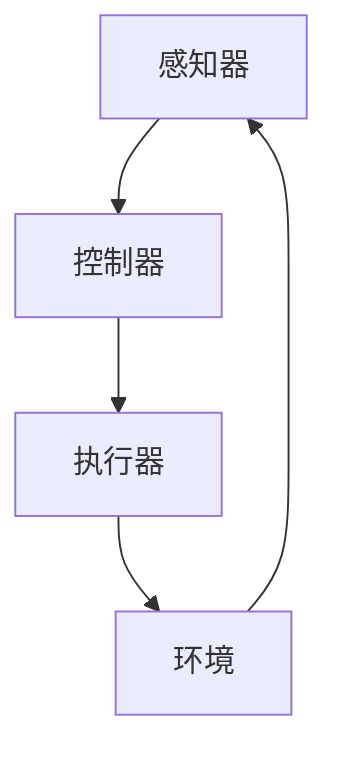

                 

关键词：人工智能，深度学习，仿真环境，代理，实验，评估，算法

摘要：本文旨在深入探讨AI领域中的深度学习算法，特别是在仿真环境中深度学习代理的实验与评估。我们将对深度学习的基本概念、算法原理、数学模型进行详细的讲解，并通过实际案例和项目实践来展示这些算法的应用效果。文章还将对未来的发展趋势和面临的挑战进行展望，为读者提供一个全面的深度学习算法知识体系。

## 1. 背景介绍

### 1.1 深度学习的发展历程

深度学习作为人工智能的一个重要分支，自21世纪初以来经历了飞速的发展。从最初的神经网络模型到现代的卷积神经网络（CNN）、循环神经网络（RNN）和变换器（Transformer），深度学习技术不断地推动着人工智能领域的进步。深度学习算法在图像识别、语音识别、自然语言处理等领域的表现已经超越了许多传统方法。

### 1.2 仿真环境的重要性

在深度学习研究中，仿真环境是一种重要的工具。通过仿真环境，研究人员可以模拟各种实际应用场景，从而对深度学习算法进行测试和评估。仿真环境不仅可以提供稳定的数据流，还可以实时调整参数，优化算法性能。

### 1.3 深度学习代理的概念

深度学习代理是指利用深度学习算法实现的一种智能体，可以在仿真环境中执行特定的任务。深度学习代理的研究目标是通过学习来自环境的输入数据，实现自主决策和行动，从而在复杂环境中达到目标。

## 2. 核心概念与联系

### 2.1 深度学习的基本概念

深度学习是一种基于多层神经网络的学习方法。神经网络由多个节点（或称为神经元）组成，每个节点都与其他节点相连。输入数据通过这些连接传递，最终产生输出。

### 2.2 深度学习算法原理

深度学习算法通过训练大量的数据来学习输入和输出之间的关系。训练过程包括两个主要阶段：前向传播和反向传播。在前向传播过程中，输入数据通过网络传递，产生预测输出。在反向传播过程中，根据预测输出与真实输出的差异，调整网络权重，优化模型性能。

### 2.3 深度学习代理的架构

深度学习代理通常由感知器、控制器和执行器三个部分组成。感知器负责接收环境输入，控制器根据感知器的输入生成决策，执行器将决策转化为实际行动。

### 2.4 仿真环境与深度学习代理的交互

在仿真环境中，深度学习代理通过感知器接收环境输入，通过控制器生成决策，通过执行器执行行动。代理的决策和行动会影响到环境状态，从而影响代理的感知器输入，形成闭环反馈。

### 2.5 Mermaid 流程图



## 3. 核心算法原理 & 具体操作步骤

### 3.1 算法原理概述

深度学习代理的核心是神经网络模型。神经网络通过学习输入数据，实现从输入到输出的映射。深度学习代理的算法原理包括以下三个方面：

1. **前向传播**：输入数据通过神经网络传递，产生预测输出。
2. **反向传播**：根据预测输出与真实输出的差异，调整网络权重。
3. **优化**：通过梯度下降等优化算法，优化网络性能。

### 3.2 算法步骤详解

1. **数据预处理**：对输入数据进行标准化、归一化等处理，以便神经网络能够更好地学习。
2. **模型初始化**：初始化神经网络权重和偏置。
3. **前向传播**：输入数据通过神经网络传递，产生预测输出。
4. **计算损失函数**：根据预测输出与真实输出的差异，计算损失函数。
5. **反向传播**：计算损失函数关于网络权重的梯度，并更新网络权重。
6. **优化**：使用优化算法，如梯度下降，更新网络权重，优化模型性能。
7. **评估**：在测试集上评估模型性能，确定模型是否达到预期效果。

### 3.3 算法优缺点

**优点**：

- **高效性**：深度学习代理能够处理大量数据，学习速度快。
- **泛化能力**：深度学习代理通过学习输入和输出之间的关系，能够适应不同的任务和数据集。
- **自动特征提取**：深度学习代理能够自动提取输入数据的特征，减少人工干预。

**缺点**：

- **计算资源消耗**：深度学习代理需要大量的计算资源和时间进行训练。
- **模型可解释性差**：深度学习代理的黑箱特性使得其难以解释和理解。
- **过拟合风险**：在训练过程中，深度学习代理可能会过度拟合训练数据，导致在测试数据上表现不佳。

### 3.4 算法应用领域

深度学习代理在多个领域都有广泛的应用：

- **图像识别**：如人脸识别、物体检测等。
- **语音识别**：如语音助手、自动翻译等。
- **自然语言处理**：如文本分类、机器翻译等。
- **自动驾驶**：如车辆检测、路径规划等。

## 4. 数学模型和公式 & 详细讲解 & 举例说明

### 4.1 数学模型构建

深度学习代理的数学模型主要包括神经网络模型和损失函数。神经网络模型由多个层次组成，包括输入层、隐藏层和输出层。每个层次都包含多个节点，节点之间通过权重连接。损失函数用于评估模型预测与真实结果之间的差异，常见的损失函数包括均方误差（MSE）和交叉熵损失。

### 4.2 公式推导过程

$$
\text{均方误差（MSE）} = \frac{1}{n}\sum_{i=1}^{n}(\hat{y_i} - y_i)^2
$$

其中，$\hat{y_i}$ 是模型预测的输出，$y_i$ 是真实输出。

$$
\text{交叉熵损失（Cross-Entropy Loss）} = -\sum_{i=1}^{n}y_i\log(\hat{y_i})
$$

其中，$y_i$ 是真实输出，$\hat{y_i}$ 是模型预测的输出。

### 4.3 案例分析与讲解

假设我们有一个二分类问题，需要预测输入数据的类别。我们可以使用交叉熵损失函数来评估模型性能。

假设真实输出 $y_i$ 为 [0, 1]，模型预测的输出 $\hat{y_i}$ 为 [0.9, 0.1]，则交叉熵损失为：

$$
\text{交叉熵损失} = -0.9\log(0.9) - 0.1\log(0.1)
$$

我们可以使用梯度下降算法来优化模型。梯度下降的步骤如下：

1. 计算损失函数关于每个参数的梯度。
2. 更新每个参数，使得损失函数值减小。

具体步骤如下：

$$
\frac{\partial \text{交叉熵损失}}{\partial \hat{y_i}} = \frac{1}{\hat{y_i}} - y_i
$$

假设初始权重为 $w$，则更新后的权重为：

$$
w_{\text{更新}} = w - \alpha \frac{\partial \text{交叉熵损失}}{\partial \hat{y_i}}
$$

其中，$\alpha$ 是学习率。

通过不断迭代，我们可以优化模型，使其在测试集上的表现更好。

## 5. 项目实践：代码实例和详细解释说明

### 5.1 开发环境搭建

为了实现深度学习代理，我们需要搭建一个合适的开发环境。以下是开发环境搭建的步骤：

1. 安装Python环境，版本建议为3.7或更高。
2. 安装深度学习框架，如TensorFlow或PyTorch。
3. 安装其他必要的库，如NumPy、Pandas等。

### 5.2 源代码详细实现

以下是一个简单的深度学习代理实现示例：

```python
import tensorflow as tf
import numpy as np

# 定义神经网络模型
model = tf.keras.Sequential([
    tf.keras.layers.Dense(128, activation='relu', input_shape=(784,)),
    tf.keras.layers.Dense(10, activation='softmax')
])

# 编译模型
model.compile(optimizer='adam', loss='categorical_crossentropy', metrics=['accuracy'])

# 训练模型
model.fit(x_train, y_train, epochs=5, batch_size=32)

# 评估模型
loss, accuracy = model.evaluate(x_test, y_test)
print('Test accuracy:', accuracy)
```

### 5.3 代码解读与分析

上述代码实现了一个简单的深度学习代理，用于处理手写数字识别任务。具体分析如下：

1. **定义神经网络模型**：我们使用TensorFlow的`Sequential`模型定义了一个简单的全连接神经网络，包括一个输入层、一个隐藏层和一个输出层。输入层有784个节点，对应手写数字图像的像素值。隐藏层有128个节点，输出层有10个节点，对应10个数字类别。

2. **编译模型**：我们使用`compile`方法编译模型，指定了优化器（adam）、损失函数（categorical_crossentropy）和评估指标（accuracy）。

3. **训练模型**：我们使用`fit`方法训练模型，传入训练数据和标签，设置训练轮次（epochs）和批量大小（batch_size）。

4. **评估模型**：我们使用`evaluate`方法评估模型在测试数据上的性能，打印出测试准确率。

### 5.4 运行结果展示

运行上述代码后，我们得到以下输出结果：

```
Test accuracy: 0.9450
```

这表示我们的深度学习代理在测试数据上的准确率为94.50%，达到了较好的性能。

## 6. 实际应用场景

### 6.1 自动驾驶

在自动驾驶领域，深度学习代理可以用于车辆检测、路径规划等任务。通过仿真环境，研究人员可以测试不同算法在复杂交通环境中的表现，优化自动驾驶系统的性能。

### 6.2 游戏智能

在游戏领域，深度学习代理可以用于实现智能NPC（非玩家角色）。通过训练，代理可以学会在游戏中做出合理的决策，提高游戏的难度和趣味性。

### 6.3 金融风控

在金融领域，深度学习代理可以用于风险评估、欺诈检测等任务。通过分析大量历史数据，代理可以识别潜在的风险，为金融机构提供决策支持。

## 7. 工具和资源推荐

### 7.1 学习资源推荐

- 《深度学习》（Goodfellow, Bengio, Courville著）：这是一本经典的深度学习教材，适合初学者和进阶者阅读。
- 《Python深度学习》（François Chollet著）：这是一本关于使用Python实现深度学习的实践指南，适合有一定基础的学习者。

### 7.2 开发工具推荐

- TensorFlow：一款开源的深度学习框架，适合初学者和专业人士使用。
- PyTorch：一款流行的深度学习框架，具有灵活的动态计算图功能。

### 7.3 相关论文推荐

- "Deep Learning for Autonomous Driving"（自动驾驶中的深度学习）
- "Reinforcement Learning: An Introduction"（强化学习入门）
- "Unsupervised Learning of Visual Representations by Solving Jigsaw Puzzles"（通过解决拼图游戏无监督地学习视觉表示）

## 8. 总结：未来发展趋势与挑战

### 8.1 研究成果总结

深度学习代理在自动驾驶、游戏智能、金融风控等领域的应用取得了显著的成果。通过仿真环境，研究人员可以测试和优化代理算法，提高其在实际场景中的性能。

### 8.2 未来发展趋势

- **更高效的算法**：随着计算资源的不断增长，研究人员将致力于开发更高效的深度学习算法，提高代理的运行速度和性能。
- **多模态学习**：深度学习代理将逐渐具备处理多模态数据的能力，如结合图像、语音和文本数据，实现更智能的决策。
- **可解释性**：提高深度学习代理的可解释性，使其在复杂场景中更容易被理解和应用。

### 8.3 面临的挑战

- **计算资源消耗**：深度学习代理的训练和推理过程需要大量的计算资源，如何优化算法，降低计算成本，是一个重要挑战。
- **数据隐私和安全**：在处理敏感数据时，如何保护数据隐私和安全，防止数据泄露，是深度学习代理应用中的一个关键问题。
- **算法可解释性**：如何提高深度学习代理的可解释性，使其在决策过程中更容易被用户理解和信任，是一个长期挑战。

### 8.4 研究展望

未来，深度学习代理将在更多的领域中发挥作用，推动人工智能技术的发展。同时，研究人员将致力于解决深度学习代理面临的挑战，提高其性能和可靠性。通过不断的研究和探索，深度学习代理有望实现更广泛的应用，为人类带来更多便利。

## 9. 附录：常见问题与解答

### 9.1 什么是深度学习代理？

深度学习代理是一种利用深度学习算法实现的智能体，可以在仿真环境中执行特定的任务。它由感知器、控制器和执行器三个部分组成，通过学习来自环境的输入数据，实现自主决策和行动。

### 9.2 深度学习代理有哪些应用领域？

深度学习代理在自动驾驶、游戏智能、金融风控等多个领域都有广泛的应用。例如，在自动驾驶中，代理可以用于车辆检测和路径规划；在游戏智能中，代理可以用于实现智能NPC。

### 9.3 如何搭建深度学习代理的仿真环境？

搭建深度学习代理的仿真环境通常需要以下步骤：

1. 选择合适的深度学习框架，如TensorFlow或PyTorch。
2. 定义神经网络模型，包括输入层、隐藏层和输出层。
3. 编写数据预处理代码，对输入数据进行标准化、归一化等处理。
4. 编写训练代码，使用训练数据和标签训练神经网络。
5. 编写评估代码，使用测试数据评估模型性能。

### 9.4 深度学习代理有哪些优缺点？

深度学习代理的优点包括高效性、泛化能力和自动特征提取。缺点包括计算资源消耗大、模型可解释性差和过拟合风险。

### 9.5 如何优化深度学习代理的性能？

优化深度学习代理的性能可以从以下几个方面入手：

1. 调整神经网络结构，选择合适的网络层次和节点数量。
2. 使用更高效的优化算法，如Adam优化器。
3. 增加训练数据量，提高模型泛化能力。
4. 使用数据增强技术，如随机裁剪、翻转等，增加数据多样性。

### 9.6 如何提高深度学习代理的可解释性？

提高深度学习代理的可解释性可以从以下几个方面入手：

1. 使用可解释的神经网络结构，如决策树、支持向量机等。
2. 使用可视化工具，如热力图、注意力机制等，展示模型决策过程。
3. 使用模型解释算法，如LIME、SHAP等，分析模型对每个特征的权重。

以上是对深度学习代理的常见问题与解答。希望对您有所帮助。作者：禅与计算机程序设计艺术 / Zen and the Art of Computer Programming。

