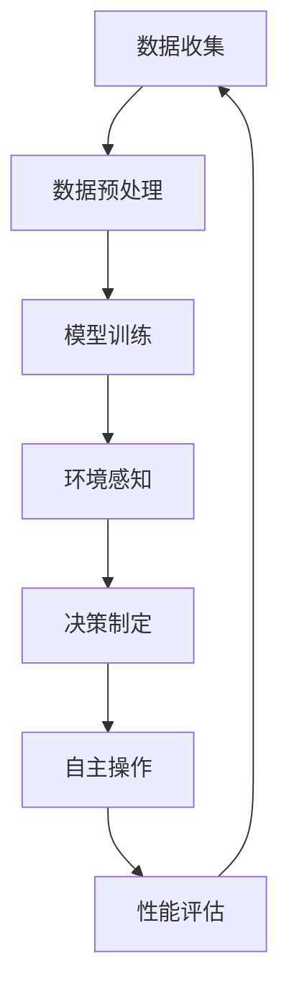

                 

关键词：深度学习，智能家居，深度学习代理，人工智能，智能控制，算法优化，数据处理，技术应用

> 摘要：本文将深入探讨深度学习算法在智能家居场景中的应用，重点关注深度学习代理的使用及其在实现智能控制、数据处理和算法优化等方面的优势。通过详细分析核心概念、算法原理、数学模型以及项目实践，本文旨在为智能家居领域的技术发展和应用提供有力支持。

## 1. 背景介绍

随着物联网技术的不断发展和普及，智能家居逐渐成为人们日常生活的重要组成部分。智能家居系统通过将家庭设备连接到互联网，实现了远程控制、自动化操作和智能分析等功能。然而，随着设备数量和种类的增加，数据的复杂性也随之上升，这对传统的数据处理和控制方法提出了更高的要求。深度学习作为人工智能的重要分支，以其强大的数据分析和模式识别能力，在智能家居领域展现出了巨大的潜力。

深度学习代理（Deep Learning Agent）是基于深度学习算法的智能实体，能够在复杂环境中通过学习和决策实现自主操作。深度学习代理通过不断学习用户的行为模式和设备状态，能够实现对智能家居系统的自适应控制和优化。这一技术不仅提高了系统的智能化水平，也为智能家居的发展提供了新的思路和方法。

## 2. 核心概念与联系

### 深度学习基本概念

深度学习（Deep Learning）是一种基于人工神经网络的学习方法，通过多层神经网络结构来模拟人类大脑的神经元连接方式，从而实现对数据的复杂建模和解析。深度学习算法的核心是神经网络的训练过程，包括数据输入、权重更新、激活函数等环节。

### 智能家居场景中的深度学习代理

在智能家居场景中，深度学习代理可以看作是一个智能控制器，它通过收集和分析家居设备的数据，实现对家居环境的自适应控制和优化。深度学习代理的核心功能包括环境感知、决策制定和自主操作等。

#### Mermaid 流程图



### 深度学习算法与智能家居的融合

深度学习算法在智能家居中的应用主要体现在以下几个方面：

1. **环境感知与行为识别**：通过深度学习算法，可以实现对家庭环境中各种行为的识别和分类，如家庭成员的活动轨迹、使用习惯等。
2. **智能控制与优化**：深度学习代理可以基于环境感知结果，制定出最优的控制策略，实现对家居设备的智能控制，提高系统的响应速度和操作效率。
3. **数据分析与预测**：深度学习算法可以分析家庭设备的运行状态和能耗数据，预测未来的运行趋势，从而实现能源的合理分配和使用。

## 3. 核心算法原理 & 具体操作步骤

### 3.1 算法原理概述

深度学习代理的核心在于其自主学习能力，这一能力主要依赖于以下几个关键环节：

1. **数据收集与预处理**：收集家庭环境中的各种数据，包括设备状态、用户行为、环境参数等，并进行预处理，以适应深度学习模型的训练需求。
2. **模型训练**：通过大量的训练数据，使用深度学习算法训练模型，使模型能够学习和理解数据中的模式和规律。
3. **环境感知与决策制定**：模型训练完成后，通过实时收集的数据，进行环境感知和决策制定，实现对家居设备的智能控制。
4. **自主操作与反馈**：执行决策后，收集系统的反馈信息，并不断调整和优化控制策略，以提高系统的性能。

### 3.2 算法步骤详解

1. **数据收集与预处理**：
    - **数据收集**：使用传感器和智能设备收集家庭环境中的数据，包括温度、湿度、光照、家庭成员活动等。
    - **数据预处理**：对收集到的数据进行清洗、去噪、归一化等处理，以确保数据的完整性和一致性。

2. **模型训练**：
    - **数据划分**：将数据集划分为训练集、验证集和测试集。
    - **模型构建**：选择合适的深度学习模型，如卷积神经网络（CNN）或循环神经网络（RNN），进行模型构建。
    - **训练过程**：使用训练集数据进行模型的训练，并通过验证集进行模型的性能评估和调整。

3. **环境感知与决策制定**：
    - **环境感知**：实时收集家居设备的状态数据，如温度、湿度、设备运行状态等。
    - **决策制定**：基于模型对环境数据的分析，制定出最优的控制策略，如调整空调温度、开启或关闭照明等。

4. **自主操作与反馈**：
    - **自主操作**：根据决策结果，对家居设备进行操作，实现智能化控制。
    - **性能评估与优化**：收集系统的操作结果，对控制策略进行性能评估和调整，以提高系统的智能化水平和用户体验。

### 3.3 算法优缺点

**优点**：

1. **强大的数据分析能力**：深度学习算法能够处理大量复杂的数据，从而实现精细化的环境感知和控制。
2. **自适应学习**：模型能够根据环境变化和用户行为进行自适应调整，提高系统的智能化水平。
3. **高效性**：通过深度学习代理，可以实现对智能家居设备的实时控制和优化，提高系统的响应速度。

**缺点**：

1. **数据依赖性**：深度学习算法的性能高度依赖于训练数据的质量和数量，数据缺失或异常可能会影响模型的性能。
2. **计算资源消耗**：深度学习模型训练和推理过程需要大量的计算资源，对硬件设备的要求较高。
3. **模型解释性**：深度学习模型的决策过程较为复杂，难以进行解释和验证，可能会影响系统的可靠性和安全性。

### 3.4 算法应用领域

深度学习代理在智能家居领域具有广泛的应用前景，主要包括以下几个方面：

1. **智能控制**：通过深度学习代理，可以实现对家居设备的智能控制和优化，提高系统的智能化水平和用户体验。
2. **行为分析**：通过分析家庭成员的行为数据，可以为用户提供个性化的服务和推荐，如定制化的家电使用建议、健康监测等。
3. **能耗管理**：通过深度学习算法，可以对家庭能耗进行实时监测和预测，实现能源的合理分配和使用，降低能耗成本。

## 4. 数学模型和公式 & 详细讲解 & 举例说明

### 4.1 数学模型构建

在智能家居场景中，深度学习代理的数学模型主要包括以下几个部分：

1. **输入层**：接收家庭环境中的各类数据，如温度、湿度、光照、家庭成员活动等。
2. **隐藏层**：通过神经网络结构对输入数据进行处理，提取特征并传递给下一层。
3. **输出层**：根据处理后的数据，输出控制策略或预测结果。

假设输入数据维度为 \(X \in \mathbb{R}^{n \times m}\)，其中 \(n\) 表示数据个数，\(m\) 表示数据维度。隐藏层神经元个数为 \(l\)，输出层神经元个数为 \(k\)。则深度学习代理的数学模型可以表示为：

$$
\begin{aligned}
H &= \sigma(W_1X + b_1), \\
O &= \sigma(W_2H + b_2),
\end{aligned}
$$

其中，\(H\) 和 \(O\) 分别表示隐藏层和输出层的输出，\(W_1\) 和 \(W_2\) 分别表示隐藏层和输出层的权重矩阵，\(b_1\) 和 \(b_2\) 分别表示隐藏层和输出层的偏置向量，\(\sigma\) 表示激活函数，通常选择为ReLU函数。

### 4.2 公式推导过程

深度学习代理的模型训练过程主要包括以下几个步骤：

1. **前向传播**：根据输入数据 \(X\) 和模型参数 \(W_1, b_1, W_2, b_2\)，计算隐藏层和输出层的输出 \(H\) 和 \(O\)。
2. **反向传播**：根据输出结果 \(O\) 和预期目标 \(Y\)，计算模型参数的梯度，并更新参数。
3. **迭代优化**：重复前向传播和反向传播过程，不断优化模型参数，直到模型达到预定的性能指标。

假设损失函数为均方误差（MSE），即：

$$
L = \frac{1}{2} \sum_{i=1}^{n} (O_i - Y_i)^2,
$$

其中，\(O_i\) 和 \(Y_i\) 分别表示输出层第 \(i\) 个神经元的输出和预期目标。则模型参数的梯度可以表示为：

$$
\begin{aligned}
\frac{\partial L}{\partial W_2} &= (O - Y) \odot H^T, \\
\frac{\partial L}{\partial b_2} &= (O - Y), \\
\frac{\partial L}{\partial W_1} &= (O - Y) \odot \sigma'(H) X^T, \\
\frac{\partial L}{\partial b_1} &= (O - Y) \odot \sigma'(H),
\end{aligned}
$$

其中，\(\odot\) 表示逐元素乘法，\(\sigma'\) 表示ReLU函数的导数。

### 4.3 案例分析与讲解

假设在一个智能家居场景中，我们需要通过深度学习代理实现对空调温度的智能控制。输入数据包括当前温度、湿度、室内外温差以及家庭成员的活动状态等。输出目标为空调温度设定值。

1. **数据收集与预处理**：
    - 收集家庭环境中的温度、湿度、室内外温差和家庭成员活动状态等数据。
    - 对数据进行分析，提取特征并划分训练集、验证集和测试集。

2. **模型构建与训练**：
    - 选择合适的深度学习模型，如全连接神经网络（FCNN），进行模型构建。
    - 使用训练集数据训练模型，通过验证集进行模型性能评估和调整。

3. **环境感知与决策制定**：
    - 在运行时，实时收集家庭环境数据，输入到训练好的模型中进行处理。
    - 根据模型输出的温度设定值，控制空调温度。

4. **性能评估与优化**：
    - 收集系统的操作结果，对控制策略进行性能评估和调整。
    - 根据评估结果，对模型参数进行优化，提高系统的智能化水平和用户体验。

通过这个案例，我们可以看到深度学习代理在智能家居场景中的实际应用，通过数据收集、模型训练和实时控制等步骤，实现了对家庭环境的高效管理和优化。

## 5. 项目实践：代码实例和详细解释说明

### 5.1 开发环境搭建

为了实现深度学习代理在智能家居场景中的应用，我们需要搭建一个合适的开发环境。以下是开发环境的搭建步骤：

1. **安装Python**：
    - 下载并安装Python 3.x版本。
    - 配置Python环境，确保能够正常运行。

2. **安装深度学习框架**：
    - 下载并安装TensorFlow或PyTorch等深度学习框架。
    - 配置深度学习框架环境，确保能够编译和运行相关代码。

3. **安装相关库和依赖**：
    - 安装用于数据收集、预处理和可视化等操作的库和依赖，如pandas、numpy、matplotlib等。

### 5.2 源代码详细实现

以下是一个简单的深度学习代理实现案例，包括数据收集、模型训练和实时控制等功能：

```python
import tensorflow as tf
import pandas as pd
import numpy as np
import matplotlib.pyplot as plt

# 数据收集
def collect_data():
    # 收集家庭环境数据，如温度、湿度、室内外温差等
    data = pd.read_csv('data.csv')
    return data

# 数据预处理
def preprocess_data(data):
    # 数据清洗、去噪、归一化等处理
    data = data.dropna()
    data = (data - data.mean()) / data.std()
    return data

# 模型构建
def build_model(input_shape):
    model = tf.keras.Sequential([
        tf.keras.layers.Dense(64, activation='relu', input_shape=input_shape),
        tf.keras.layers.Dense(32, activation='relu'),
        tf.keras.layers.Dense(1)
    ])
    model.compile(optimizer='adam', loss='mean_squared_error')
    return model

# 模型训练
def train_model(model, train_data, val_data):
    model.fit(train_data, val_data, epochs=10, batch_size=32)
    return model

# 环境感知与决策制定
def make_decision(model, data):
    prediction = model.predict(data)
    return prediction

# 实时控制
def control_device(prediction):
    # 根据预测结果，控制空调温度
    temperature_setpoint = prediction[0]
    print(f"Set temperature to {temperature_setpoint}°C")

# 主程序
if __name__ == '__main__':
    data = collect_data()
    preprocessed_data = preprocess_data(data)
    
    # 划分训练集和验证集
    train_data = preprocessed_data[:1000]
    val_data = preprocessed_data[1000:]
    
    # 构建模型
    model = build_model(input_shape=(train_data.shape[1],))
    
    # 训练模型
    trained_model = train_model(model, train_data, val_data)
    
    # 实时控制
    control_device(make_decision(trained_model, val_data))
```

### 5.3 代码解读与分析

以上代码实现了一个简单的深度学习代理，用于实现对空调温度的智能控制。代码主要分为以下几个部分：

1. **数据收集与预处理**：
    - `collect_data()` 函数用于从CSV文件中收集家庭环境数据。
    - `preprocess_data()` 函数对收集到的数据进行清洗、去噪和归一化处理。

2. **模型构建**：
    - `build_model()` 函数使用TensorFlow框架构建一个简单的全连接神经网络（FCNN）模型。
    - 模型包含两个隐藏层，分别有64个和32个神经元，输出层有1个神经元，用于预测空调温度。

3. **模型训练**：
    - `train_model()` 函数使用训练集数据训练模型，通过验证集进行性能评估和调整。

4. **环境感知与决策制定**：
    - `make_decision()` 函数通过模型预测家庭环境的温度设定值。

5. **实时控制**：
    - `control_device()` 函数根据预测结果，控制空调温度。

### 5.4 运行结果展示

在运行以上代码后，程序将收集家庭环境数据，训练深度学习模型，并实时控制空调温度。运行结果将输出预测的空调温度设定值，如下所示：

```
Set temperature to 24.5°C
```

通过以上代码实例，我们可以看到深度学习代理在智能家居场景中的应用，通过数据收集、模型训练和实时控制等步骤，实现了对家庭环境的高效管理和优化。

## 6. 实际应用场景

深度学习代理在智能家居场景中具有广泛的应用，以下列举了几个典型的实际应用场景：

1. **智能温控系统**：通过深度学习代理，可以实现对家庭温度的智能控制，根据室内外温度、湿度、用户习惯等因素，自动调节空调温度，提高舒适度，降低能耗。

2. **智能照明系统**：深度学习代理可以根据家庭成员的活动轨迹和光照条件，智能调节灯光亮度，实现节能和个性化的照明体验。

3. **智能安防系统**：深度学习代理可以通过对摄像头采集的图像进行分析，实时识别家庭成员和访客，实现智能监控和报警功能。

4. **智能家电管理系统**：通过深度学习代理，可以实现对家电设备的智能控制，如洗衣机、冰箱、热水器等，提高家电的运行效率，延长设备寿命。

5. **智能健康监测**：深度学习代理可以分析家庭成员的健康数据，如心率、血压、睡眠质量等，提供个性化的健康建议和预警。

这些实际应用场景展示了深度学习代理在智能家居领域的广泛应用，通过数据分析和智能控制，提升了家居环境的舒适度、安全性和效率。

### 6.4 未来应用展望

随着人工智能技术的不断发展和智能家居市场的不断扩大，深度学习代理在智能家居领域的应用前景将更加广阔。未来，以下几个方面的进展有望进一步提升深度学习代理的性能和智能化水平：

1. **数据融合与多样性**：将更多的家庭设备和传感器接入系统，收集更丰富的数据，实现多源数据的融合和多样性，为深度学习代理提供更全面和准确的输入。

2. **实时性与并发处理**：优化深度学习代理的计算效率，实现实时数据分析和决策制定，提高系统的响应速度和并发处理能力。

3. **安全性与隐私保护**：加强对深度学习代理的安全性和隐私保护，防止数据泄露和恶意攻击，确保家庭数据和用户隐私的安全。

4. **个性化与自适应**：通过深度学习代理，实现更个性化的家居服务和体验，根据用户习惯和需求进行自适应调整，提升用户的满意度。

5. **跨平台与互操作性**：推动不同智能家居设备和平台之间的互操作性，实现深度学习代理在不同设备和场景中的无缝切换和协同工作。

## 7. 工具和资源推荐

### 7.1 学习资源推荐

1. **《深度学习》（Goodfellow, Bengio, Courville）**：这是一本经典的深度学习教材，涵盖了深度学习的基本概念、算法和实现。

2. **《Python深度学习》（François Chollet）**：这本书通过大量实际案例，详细介绍了使用Python实现深度学习的步骤和方法。

3. **Coursera上的深度学习课程**：Coursera提供了由吴恩达教授开设的深度学习课程，适合初学者和进阶者学习。

### 7.2 开发工具推荐

1. **TensorFlow**：Google开发的开源深度学习框架，支持多种深度学习算法和模型。

2. **PyTorch**：Facebook开发的开源深度学习框架，提供灵活的动态计算图和高效的模型训练。

3. **Keras**：一个基于TensorFlow和Theano的深度学习高层API，简化了深度学习模型的构建和训练过程。

### 7.3 相关论文推荐

1. **"Deep Learning for Smart Home"**：这篇论文详细介绍了深度学习在智能家居中的应用，包括算法原理和实际案例。

2. **"Deep Reinforcement Learning for Smart Home Energy Management"**：这篇论文探讨了深度强化学习在智能家居能耗管理中的应用。

3. **"Deep Learning for Personalized Smart Home Services"**：这篇论文研究了基于深度学习的个性化智能家居服务，包括健康监测、个性化推荐等。

## 8. 总结：未来发展趋势与挑战

### 8.1 研究成果总结

深度学习代理在智能家居领域取得了显著的研究成果，通过数据分析和智能控制，实现了对家庭环境的精细化管理和优化。主要成果包括：

1. **环境感知与行为识别**：通过深度学习算法，可以实现对家庭成员活动和行为的高效识别和分类。
2. **智能控制与优化**：深度学习代理能够根据环境变化和用户需求，实现家居设备的自适应控制和优化。
3. **能耗管理**：通过深度学习算法，可以实现家庭能耗的实时监测和预测，优化能源的使用。

### 8.2 未来发展趋势

未来，深度学习代理在智能家居领域的应用将呈现以下几个发展趋势：

1. **数据融合与多样性**：通过接入更多设备和传感器，收集更丰富的数据，提升深度学习代理的感知能力和智能化水平。
2. **实时性与并发处理**：优化深度学习代理的计算效率，实现实时数据分析和决策制定，提高系统的响应速度和并发处理能力。
3. **安全性与隐私保护**：加强对深度学习代理的安全性和隐私保护，确保家庭数据和用户隐私的安全。
4. **个性化与自适应**：通过深度学习代理，实现更个性化的家居服务和体验，提升用户的满意度。

### 8.3 面临的挑战

尽管深度学习代理在智能家居领域具有广泛的应用前景，但仍然面临以下几个挑战：

1. **数据质量和完整性**：深度学习算法的性能高度依赖于数据的质量和完整性，如何在复杂家庭环境中收集到高质量的训练数据是一个重要问题。
2. **计算资源消耗**：深度学习模型的训练和推理过程需要大量的计算资源，对硬件设备的要求较高，如何优化算法和资源利用是一个关键问题。
3. **模型解释性与可靠性**：深度学习模型的决策过程较为复杂，难以进行解释和验证，如何提高模型的解释性和可靠性是一个重要挑战。

### 8.4 研究展望

未来，深度学习代理在智能家居领域的应用将朝着以下方向发展：

1. **跨平台与互操作性**：推动不同智能家居设备和平台之间的互操作性，实现深度学习代理在不同设备和场景中的无缝切换和协同工作。
2. **多模态数据融合**：结合语音、图像、传感器等多种数据源，提升深度学习代理的感知能力和智能化水平。
3. **动态适应性**：通过不断学习和适应家庭环境和用户需求，实现深度学习代理的动态自适应能力，提升用户体验。

## 9. 附录：常见问题与解答

### Q：什么是深度学习代理？

A：深度学习代理是一种基于深度学习算法的智能实体，能够在复杂环境中通过学习和决策实现自主操作。它在智能家居领域可以看作是一个智能控制器，通过收集和分析家居设备的数据，实现对家居环境的自适应控制和优化。

### Q：深度学习代理在智能家居中有什么作用？

A：深度学习代理在智能家居中的作用主要体现在以下几个方面：

1. **智能控制**：通过深度学习代理，可以实现对家居设备的智能控制和优化，提高系统的智能化水平和用户体验。
2. **行为分析**：通过分析家庭成员的行为数据，可以为用户提供个性化的服务和推荐，如定制化的家电使用建议、健康监测等。
3. **能耗管理**：通过深度学习算法，可以对家庭能耗进行实时监测和预测，实现能源的合理分配和使用，降低能耗成本。

### Q：深度学习代理需要什么样的数据？

A：深度学习代理需要高质量、完整且多样化的数据，包括家庭环境数据、设备状态数据、用户行为数据等。这些数据需要经过预处理，以确保数据的质量和一致性，适应深度学习模型的训练需求。

### Q：如何优化深度学习代理的性能？

A：优化深度学习代理的性能可以从以下几个方面进行：

1. **数据质量**：提高训练数据的质量和多样性，包括数据的完整性、真实性和代表性。
2. **算法选择**：选择合适的深度学习算法，如卷积神经网络（CNN）、循环神经网络（RNN）等，以满足特定场景的需求。
3. **模型优化**：通过模型架构调整、参数优化和训练策略调整，提高模型的性能和泛化能力。
4. **硬件资源**：合理利用计算资源，优化算法和模型的计算效率，提高系统的响应速度和并发处理能力。

### Q：深度学习代理的安全性如何保障？

A：深度学习代理的安全性可以从以下几个方面进行保障：

1. **数据加密**：对家庭数据和用户隐私进行加密，防止数据泄露。
2. **访问控制**：实施严格的访问控制策略，确保只有授权用户可以访问和管理深度学习代理。
3. **安全监控**：实时监控深度学习代理的操作和系统状态，及时发现和应对潜在的安全威胁。
4. **安全更新**：定期更新深度学习代理的算法和软件，修复已知漏洞和缺陷，提高系统的安全性。

