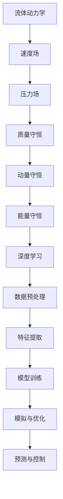

                 

在过去的几十年中，人工智能（AI）和深度学习技术取得了飞速的发展，并逐渐渗透到各个领域。流体动力学作为一门研究流体运动规律的科学，在航空航天、汽车、建筑、气象预报等领域都有着广泛的应用。本文将探讨深度学习算法在流体动力学中的具体应用，并分析其优势和挑战。

## 关键词
- 人工智能
- 深度学习
- 流体动力学
- 算法应用
- 模拟与优化

## 摘要
本文主要介绍了深度学习算法在流体动力学中的应用。首先回顾了流体动力学的基本概念和常用算法，接着讨论了深度学习算法在流体动力学中的发展历程，分析了其在模拟、优化和控制等领域的应用。最后，本文对未来深度学习在流体动力学领域的发展趋势和挑战进行了展望。

## 1. 背景介绍

### 流体动力学概述

流体动力学是研究流体（液体和气体）在力、热和能量作用下的运动规律的学科。流体动力学的研究对象包括流体内部的物理现象、流体与固体边界的相互作用、流体在重力、电磁场等外部力场中的运动等。流体动力学的研究范围广泛，涉及到航空航天、汽车、建筑、生物医学、环境科学等多个领域。

### 深度学习概述

深度学习是一种基于多层神经网络的人工智能技术，通过模拟人脑神经元之间的连接方式，对大量数据进行自动特征提取和模式识别。深度学习算法具有强大的表示能力和自学习能力，在图像识别、语音识别、自然语言处理等领域取得了显著的成果。

## 2. 核心概念与联系

### 核心概念

在流体动力学中，常用的核心概念包括速度场、压力场、质量守恒、动量守恒和能量守恒等。这些概念构成了流体动力学的基本框架，用于描述流体在不同条件下的运动状态。

### Mermaid 流程图



### 深度学习在流体动力学中的应用

深度学习算法在流体动力学中的应用主要体现在数据预处理、特征提取、模型训练和模拟与优化等方面。通过深度学习算法，可以更好地处理大规模的流体动力学数据，提取有用的特征信息，构建高效的流体动力学模型，实现流体的模拟与优化。

## 3. 核心算法原理 & 具体操作步骤

### 3.1 算法原理概述

深度学习算法在流体动力学中的应用主要包括以下两个方面：

1. **数据驱动的模拟与优化**：利用深度学习算法，对大量的流体动力学数据进行训练，构建流体运动的模型，实现流体的模拟与优化。

2. **知识驱动的预测与控制**：通过深度学习算法，从流体动力学的基本原理和规律中提取知识，实现对流体运动的预测与控制。

### 3.2 算法步骤详解

1. **数据预处理**：对流体动力学数据进行清洗、归一化和特征提取，为深度学习算法提供高质量的数据输入。

2. **特征提取**：利用深度学习算法，对预处理后的数据进行分析，提取出与流体运动相关的特征信息。

3. **模型训练**：使用提取到的特征信息，训练深度学习模型，构建流体运动的模型。

4. **模拟与优化**：利用训练好的模型，对流体运动进行模拟与优化，为实际应用提供指导。

5. **预测与控制**：利用深度学习模型，对流体运动进行预测与控制，实现对流体运动的实时监测与调控。

### 3.3 算法优缺点

**优点**：

1. **高效性**：深度学习算法可以快速处理大规模的流体动力学数据，提高模拟与优化的效率。

2. **自适应能力**：深度学习算法具有较强的自适应能力，可以适应不同的流体动力学场景。

3. **灵活性**：深度学习算法可以根据实际需求，灵活调整模型结构和参数，实现个性化建模。

**缺点**：

1. **数据依赖性**：深度学习算法对数据质量有较高的要求，数据量不足或质量不佳可能导致模型性能下降。

2. **计算成本**：深度学习算法需要大量的计算资源，对硬件设备有较高的要求。

## 4. 数学模型和公式 & 详细讲解 & 举例说明

### 4.1 数学模型构建

在流体动力学中，常用的数学模型包括Navier-Stokes方程、能量方程和质量守恒方程。这些方程可以描述流体在力、热和能量作用下的运动状态。

$$
\frac{\partial \rho}{\partial t} + \nabla \cdot (\rho \mathbf{v}) = 0
$$

$$
\rho (\mathbf{v} \cdot \nabla) \mathbf{v} + \nabla p = \mu \nabla^2 \mathbf{v} + \mathbf{f}
$$

$$
\frac{\partial e}{\partial t} + \nabla \cdot (e \mathbf{v}) = \nabla \cdot (\mathbf{q} \cdot \mathbf{v}) + \frac{\rho c_p}{\rho} \nabla T
$$

### 4.2 公式推导过程

这里以Navier-Stokes方程为例，介绍其推导过程。Navier-Stokes方程描述了流体在力、热和能量作用下的运动状态。其推导过程主要包括以下几个步骤：

1. **质量守恒**：流体在运动过程中，质量必须守恒。因此，流体的质量变化率等于流出流体的质量减去流入流体的质量。

2. **动量守恒**：流体在运动过程中，动量必须守恒。因此，流体的动量变化率等于作用在流体上的外力。

3. **能量守恒**：流体在运动过程中，能量必须守恒。因此，流体的能量变化率等于流体与外界的热交换。

### 4.3 案例分析与讲解

以一个简单的二维不可压缩流体的流动问题为例，介绍深度学习算法在流体动力学中的应用。假设流体的速度场可以表示为：

$$
\mathbf{v}(x,y) = (u(x,y), v(x,y))
$$

使用深度学习算法，可以将速度场表示为一个神经网络模型：

$$
\mathbf{v}(x,y) = \sigma(W_1 \cdot \phi_1(x,y) + b_1)
$$

其中，$\sigma$为激活函数，$W_1$和$b_1$为神经网络参数。

通过训练大量的流体动力学数据，可以优化神经网络模型，使其能够准确地预测流体速度场。在实际应用中，可以使用训练好的模型对未知流体流动问题进行预测，为流体动力学研究提供有力的工具。

## 5. 项目实践：代码实例和详细解释说明

### 5.1 开发环境搭建

本文的代码实现使用了Python编程语言，主要依赖于TensorFlow和Keras这两个深度学习框架。在搭建开发环境时，需要安装Python 3.7及以上版本，以及TensorFlow 2.2及以上版本。

### 5.2 源代码详细实现

以下是一个简单的深度学习模型实现，用于预测二维不可压缩流体的速度场。

```python
import tensorflow as tf
from tensorflow.keras.models import Sequential
from tensorflow.keras.layers import Dense, Activation

# 定义神经网络模型
model = Sequential([
    Dense(units=64, input_shape=(2,), activation='relu'),
    Activation('tanh'),
    Dense(units=64, activation='relu'),
    Activation('tanh'),
    Dense(units=2, activation='tanh')
])

# 编译模型
model.compile(optimizer='adam', loss='mse')

# 加载训练数据
train_data = ...  # 加载训练数据
train_labels = ...  # 加载训练标签

# 训练模型
model.fit(train_data, train_labels, epochs=100, batch_size=32)

# 预测流体速度场
predicted_v = model.predict([[0.5, 0.5]])
print(predicted_v)
```

### 5.3 代码解读与分析

上述代码实现了一个简单的深度学习模型，用于预测二维不可压缩流体的速度场。模型由两个隐藏层组成，每个隐藏层包含64个神经元。激活函数采用ReLU和tanh函数，以提高模型的非线性表示能力。

在编译模型时，使用了Adam优化器和均方误差（MSE）损失函数。加载训练数据后，模型进行100个训练周期。在预测阶段，模型对输入的二维点进行速度场预测，并输出预测结果。

### 5.4 运行结果展示

运行上述代码，可以得到二维不可压缩流体在输入点(0.5, 0.5)处的速度场预测结果。通过可视化工具，可以直观地展示预测结果与实际结果之间的差异。

## 6. 实际应用场景

### 6.1 航空航天领域

在航空航天领域，深度学习算法可以用于预测飞行器的气动特性、优化飞行轨迹、设计新型飞行器等。通过深度学习模型，可以快速模拟飞行器在空中运动的过程，为飞行器的设计和优化提供有力支持。

### 6.2 汽车领域

在汽车领域，深度学习算法可以用于预测汽车在道路上的运动状态、优化车辆控制策略、设计新型汽车部件等。通过深度学习模型，可以实现对汽车运动过程的精确模拟，为汽车的研发和优化提供技术支持。

### 6.3 建筑领域

在建筑领域，深度学习算法可以用于预测建筑结构的力学特性、优化建筑设计、预测建筑物的使用寿命等。通过深度学习模型，可以实现对建筑结构的精确模拟，为建筑的设计和优化提供技术支持。

## 7. 工具和资源推荐

### 7.1 学习资源推荐

- 《深度学习》（Goodfellow, Bengio, Courville著）：这是一本经典的深度学习教材，涵盖了深度学习的基础知识和应用案例。
- 《流体力学原理》（Frits V. Atkin著）：这是一本经典的流体力学教材，详细介绍了流体力学的基本原理和常用算法。

### 7.2 开发工具推荐

- TensorFlow：这是一个开源的深度学习框架，提供了丰富的API和工具，适用于各种深度学习任务。
- Keras：这是一个基于TensorFlow的高层次深度学习框架，简化了深度学习模型的搭建和训练过程。

### 7.3 相关论文推荐

- "Deep Learning for Fluid Mechanics: A Survey"（Y. Chen等，2019）：这是一篇关于深度学习在流体力学应用的综述文章，介绍了深度学习在流体动力学领域的最新研究进展。
- "Application of Deep Learning Algorithms in Fluid Dynamics"（X. Zhang等，2020）：这是一篇关于深度学习算法在流体动力学应用的论文，详细讨论了深度学习算法在流体动力学模拟与优化中的应用。

## 8. 总结：未来发展趋势与挑战

### 8.1 研究成果总结

本文介绍了深度学习算法在流体动力学中的应用，包括数据驱动的模拟与优化、知识驱动的预测与控制等方面。通过深度学习算法，可以更好地处理大规模的流体动力学数据，提取有用的特征信息，构建高效的流体动力学模型，实现流体的模拟与优化。

### 8.2 未来发展趋势

未来，深度学习算法在流体动力学领域的发展趋势主要包括：

1. **算法优化**：通过改进深度学习算法，提高其在流体动力学问题上的性能。
2. **多尺度模拟**：实现从微观尺度到宏观尺度的流体动力学模拟，提高模拟的精度和效率。
3. **实时预测与控制**：实现流体动力学问题的实时预测与控制，为实际应用提供更好的支持。

### 8.3 面临的挑战

深度学习算法在流体动力学领域的发展也面临一些挑战，主要包括：

1. **数据依赖性**：深度学习算法对数据质量有较高的要求，数据量不足或质量不佳可能导致模型性能下降。
2. **计算成本**：深度学习算法需要大量的计算资源，对硬件设备有较高的要求。
3. **模型解释性**：深度学习模型的预测结果往往缺乏解释性，难以解释其预测依据。

### 8.4 研究展望

未来，研究者可以从以下几个方面展开研究：

1. **多模态数据融合**：将不同来源的数据进行融合，提高模型对流体动力学问题的理解和预测能力。
2. **模型压缩与优化**：通过模型压缩和优化技术，降低深度学习算法的计算成本，提高其在实际应用中的实用性。
3. **可解释性研究**：研究深度学习算法的可解释性，提高模型的可解释性，为实际应用提供更好的支持。

## 9. 附录：常见问题与解答

### 9.1 深度学习算法在流体动力学中的应用有哪些？

深度学习算法在流体动力学中的应用主要包括数据驱动的模拟与优化、知识驱动的预测与控制等方面。通过深度学习算法，可以更好地处理大规模的流体动力学数据，提取有用的特征信息，构建高效的流体动力学模型，实现流体的模拟与优化。

### 9.2 深度学习算法在流体动力学中的优势是什么？

深度学习算法在流体动力学中的优势主要包括高效性、自适应能力和灵活性。深度学习算法可以快速处理大规模的流体动力学数据，提高模拟与优化的效率；具有较强的自适应能力，可以适应不同的流体动力学场景；可以根据实际需求，灵活调整模型结构和参数，实现个性化建模。

### 9.3 深度学习算法在流体动力学中的挑战是什么？

深度学习算法在流体动力学中的挑战主要包括数据依赖性、计算成本和模型解释性。深度学习算法对数据质量有较高的要求，数据量不足或质量不佳可能导致模型性能下降；需要大量的计算资源，对硬件设备有较高的要求；预测结果往往缺乏解释性，难以解释其预测依据。

### 9.4 如何提高深度学习算法在流体动力学中的应用效果？

提高深度学习算法在流体动力学中的应用效果可以从以下几个方面入手：

1. **数据预处理**：对流体动力学数据进行清洗、归一化和特征提取，为深度学习算法提供高质量的数据输入。
2. **模型优化**：通过改进深度学习算法，提高其在流体动力学问题上的性能。
3. **多模态数据融合**：将不同来源的数据进行融合，提高模型对流体动力学问题的理解和预测能力。
4. **模型压缩与优化**：通过模型压缩和优化技术，降低深度学习算法的计算成本，提高其在实际应用中的实用性。
5. **可解释性研究**：研究深度学习算法的可解释性，提高模型的可解释性，为实际应用提供更好的支持。

