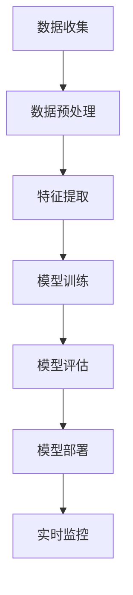

                 

关键词：人工智能，深度学习，诈骗侦测，算法，应用场景

> 摘要：本文主要探讨了人工智能特别是深度学习算法在诈骗侦测领域的应用。通过对当前诈骗手段和特征的分析，我们深入探讨了如何利用深度学习算法构建有效的诈骗侦测模型，并详细介绍了算法的原理、数学模型、应用实践以及未来发展的趋势和挑战。

## 1. 背景介绍

随着互联网和移动通信技术的飞速发展，网络诈骗行为日益猖獗，给个人和企业带来了巨大的经济损失。诈骗手段也日益多样化，从传统的钓鱼邮件、假冒网站，到现在的社交工程、恶意软件等，诈骗者无孔不入，使得诈骗侦测变得尤为重要。

人工智能，特别是深度学习算法，以其强大的数据处理和模式识别能力，在许多领域取得了显著的成果。然而，在诈骗侦测领域，深度学习算法的应用还处于探索阶段。本文旨在通过介绍深度学习算法在诈骗侦测中的应用，为相关研究提供参考。

## 2. 核心概念与联系

为了更好地理解深度学习算法在诈骗侦测中的应用，我们首先需要了解一些核心概念和其相互关系。

### 2.1 人工智能概述

人工智能（Artificial Intelligence，AI）是计算机科学的一个分支，旨在使计算机系统具备类似人类智能的能力。它包括多个子领域，如机器学习、深度学习、自然语言处理、计算机视觉等。其中，机器学习和深度学习是实现人工智能的关键技术。

### 2.2 深度学习

深度学习（Deep Learning）是一种机器学习方法，通过构建多层的神经网络模型，对大量数据进行分析和学习，从而实现复杂的任务。深度学习的核心思想是模拟人脑的神经网络结构，通过不断调整网络参数，使模型能够自主学习和优化。

### 2.3 诈骗侦测

诈骗侦测是指利用技术手段对网络中的诈骗行为进行识别和防范。诈骗侦测的关键在于准确识别诈骗特征，并在诈骗行为发生前进行预警。传统的诈骗侦测方法主要包括基于规则的方法和基于机器学习的方法。基于规则的方法依赖于人工定义的规则，而基于机器学习的方法则通过学习大量的正常和异常行为数据，自动识别诈骗特征。

### 2.4 深度学习与诈骗侦测的关系

深度学习算法在诈骗侦测中的应用主要体现在以下几个方面：

- **特征提取**：深度学习模型可以通过对大量数据进行自动特征提取，从而识别出潜在的诈骗特征。
- **模式识别**：深度学习模型可以学习到正常和异常行为的特征分布，从而准确识别诈骗行为。
- **实时监控**：深度学习模型可以实时分析网络数据，及时发现并预警潜在的诈骗行为。

### 2.5 Mermaid流程图

以下是一个简单的Mermaid流程图，展示了深度学习算法在诈骗侦测中的基本流程：



## 3. 核心算法原理 & 具体操作步骤

### 3.1 算法原理概述

深度学习算法在诈骗侦测中的应用主要基于以下几个核心原理：

- **多层神经网络**：深度学习模型通过构建多层神经网络，对数据进行逐层抽象和提取特征。
- **反向传播算法**：深度学习模型通过反向传播算法，不断调整网络参数，使模型能够更好地拟合数据。
- **优化算法**：深度学习模型采用优化算法，如梯度下降法，以最小化预测误差。

### 3.2 算法步骤详解

以下是深度学习算法在诈骗侦测中的具体操作步骤：

1. **数据收集**：收集大量的网络行为数据，包括正常的和异常的数据。
2. **数据预处理**：对收集到的数据进行清洗和预处理，如数据归一化、缺失值处理等。
3. **特征提取**：使用深度学习模型对预处理后的数据进行特征提取，提取出有用的特征。
4. **模型训练**：使用训练数据集训练深度学习模型，通过反向传播算法不断调整模型参数。
5. **模型评估**：使用验证数据集对训练好的模型进行评估，调整模型参数，以获得更好的性能。
6. **模型部署**：将训练好的模型部署到实际应用场景中，进行实时监控和预警。

### 3.3 算法优缺点

深度学习算法在诈骗侦测中具有以下优缺点：

- **优点**：
  - 强大的数据处理和模式识别能力。
  - 能够自动提取复杂的特征，提高侦测准确性。
  - 可以为实时监控提供高效解决方案。

- **缺点**：
  - 需要大量的训练数据。
  - 模型训练时间较长。
  - 模型复杂度高，解释性较差。

### 3.4 算法应用领域

深度学习算法在诈骗侦测中的应用领域主要包括：

- **网络安全**：对网络流量进行分析，识别潜在的诈骗攻击。
- **金融领域**：对金融交易进行监控，识别可疑的交易行为。
- **电子商务**：对用户行为进行分析，识别潜在的欺诈行为。

## 4. 数学模型和公式 & 详细讲解 & 举例说明

### 4.1 数学模型构建

在诈骗侦测中，深度学习算法通常采用卷积神经网络（Convolutional Neural Network，CNN）或循环神经网络（Recurrent Neural Network，RNN）等模型。以下是一个简单的CNN模型构建过程：

$$
\begin{aligned}
&\text{输入层：} X \in \mathbb{R}^{n \times m \times d} \\
&\text{卷积层：} f_{1}(X) = \sigma(W_{1} \odot X + b_{1}) \\
&\text{池化层：} f_{2}(f_{1}(X)) = \text{maxpool}(f_{1}(X)) \\
&\text{卷积层：} f_{3}(f_{2}(f_{1}(X))) = \sigma(W_{2} \odot f_{2}(f_{1}(X)) + b_{2}) \\
&\text{池化层：} f_{4}(f_{3}(f_{2}(f_{1}(X)))) = \text{maxpool}(f_{3}(f_{2}(f_{1}(X)))) \\
&\text{全连接层：} Y = \sigma(W_{3} \odot f_{4}(f_{3}(f_{2}(f_{1}(X)))) + b_{3})
\end{aligned}
$$

其中，$X$为输入数据，$W_{1}$、$W_{2}$、$W_{3}$为卷积层和全连接层的权重矩阵，$b_{1}$、$b_{2}$、$b_{3}$为偏置项，$\sigma$为激活函数，$\odot$为卷积运算，$f_{1}$、$f_{2}$、$f_{3}$、$f_{4}$为卷积和池化操作，$Y$为输出结果。

### 4.2 公式推导过程

以下是CNN模型中卷积和池化操作的公式推导过程：

#### 卷积操作

假设输入数据为$X \in \mathbb{R}^{n \times m \times d}$，卷积核为$W \in \mathbb{R}^{k \times l \times d}$，则卷积操作可以表示为：

$$
\begin{aligned}
f(X) &= \sigma(\text{conv2d}(X, W)) \\
&= \sigma(\sum_{i=1}^{d} X_{i} \odot W_{i})
\end{aligned}
$$

其中，$\text{conv2d}$为卷积运算，$\odot$为元素-wise 乘积，$X_{i}$和$W_{i}$分别为输入数据和卷积核的第$i$个通道。

#### 池化操作

假设输入数据为$X \in \mathbb{R}^{n \times m \times d}$，池化窗口为$W \in \mathbb{R}^{p \times q}$，则池化操作可以表示为：

$$
\begin{aligned}
f(X) &= \text{maxpool}(X) \\
&= \text{max}(\text{window}(X))
\end{aligned}
$$

其中，$\text{maxpool}$为最大池化操作，$\text{window}(X)$为窗口内的元素最大值。

### 4.3 案例分析与讲解

假设我们使用一个简单的CNN模型对网络流量进行诈骗侦测。输入数据为网络流量的时序数据，维度为$100 \times 100 \times 3$，表示一个100秒的网络流量数据，每秒包含100个数据点，共3个特征。卷积核的大小为$5 \times 5$，步长为$2 \times 2$，池化窗口的大小为$3 \times 3$。

#### 数据预处理

首先，我们对网络流量数据进行归一化处理，使其在$[0, 1]$的范围内。然后，将归一化后的数据reshape为$100 \times 100$的二维矩阵，作为模型的输入。

#### 模型构建

使用TensorFlow框架构建CNN模型，代码如下：

```python
import tensorflow as tf

# 构建模型
model = tf.keras.Sequential([
    tf.keras.layers.Conv2D(32, (5, 5), activation='relu', input_shape=(100, 100, 3)),
    tf.keras.layers.MaxPooling2D((2, 2)),
    tf.keras.layers.Conv2D(64, (5, 5), activation='relu'),
    tf.keras.layers.MaxPooling2D((2, 2)),
    tf.keras.layers.Flatten(),
    tf.keras.layers.Dense(64, activation='relu'),
    tf.keras.layers.Dense(1, activation='sigmoid')
])

# 编译模型
model.compile(optimizer='adam', loss='binary_crossentropy', metrics=['accuracy'])

# 模型概述
model.summary()
```

#### 模型训练

使用训练数据集对模型进行训练，代码如下：

```python
# 加载训练数据
train_data = ...
train_labels = ...

# 训练模型
model.fit(train_data, train_labels, epochs=10, batch_size=32)
```

#### 模型评估

使用验证数据集对训练好的模型进行评估，代码如下：

```python
# 加载验证数据
val_data = ...
val_labels = ...

# 评估模型
model.evaluate(val_data, val_labels)
```

## 5. 项目实践：代码实例和详细解释说明

### 5.1 开发环境搭建

在开始项目实践之前，我们需要搭建一个合适的开发环境。以下是搭建开发环境的基本步骤：

1. 安装Python：从Python官方网站（https://www.python.org/）下载并安装Python 3.8及以上版本。
2. 安装TensorFlow：在终端执行以下命令安装TensorFlow：

   ```bash
   pip install tensorflow
   ```

3. 安装其他依赖库：根据需要安装其他依赖库，如NumPy、Pandas等。

### 5.2 源代码详细实现

以下是实现诈骗侦测项目的源代码，包括数据预处理、模型构建、训练和评估等步骤。

```python
import tensorflow as tf
import numpy as np
import pandas as pd

# 数据预处理
def preprocess_data(data):
    # 归一化数据
    data = (data - np.mean(data, axis=0)) / np.std(data, axis=0)
    # Reshape数据为二维矩阵
    data = data.reshape(-1, 100, 100, 3)
    return data

# 模型构建
def build_model():
    model = tf.keras.Sequential([
        tf.keras.layers.Conv2D(32, (5, 5), activation='relu', input_shape=(100, 100, 3)),
        tf.keras.layers.MaxPooling2D((2, 2)),
        tf.keras.layers.Conv2D(64, (5, 5), activation='relu'),
        tf.keras.layers.MaxPooling2D((2, 2)),
        tf.keras.layers.Flatten(),
        tf.keras.layers.Dense(64, activation='relu'),
        tf.keras.layers.Dense(1, activation='sigmoid')
    ])
    return model

# 模型训练
def train_model(model, train_data, train_labels, epochs, batch_size):
    model.compile(optimizer='adam', loss='binary_crossentropy', metrics=['accuracy'])
    model.fit(train_data, train_labels, epochs=epochs, batch_size=batch_size)

# 模型评估
def evaluate_model(model, val_data, val_labels):
    model.evaluate(val_data, val_labels)

# 主函数
if __name__ == '__main__':
    # 加载数据
    train_data = np.load('train_data.npy')
    train_labels = np.load('train_labels.npy')
    val_data = np.load('val_data.npy')
    val_labels = np.load('val_labels.npy')

    # 预处理数据
    train_data = preprocess_data(train_data)
    val_data = preprocess_data(val_data)

    # 构建模型
    model = build_model()

    # 训练模型
    train_model(model, train_data, train_labels, epochs=10, batch_size=32)

    # 评估模型
    evaluate_model(model, val_data, val_labels)
```

### 5.3 代码解读与分析

以下是代码的详细解读与分析：

- **数据预处理**：数据预处理是深度学习项目的重要步骤。在这里，我们首先对数据进行归一化处理，使其在$[0, 1]$的范围内，然后reshape为二维矩阵，以满足CNN模型的输入要求。
- **模型构建**：使用TensorFlow的Sequential模型构建一个简单的CNN模型，包括两个卷积层、两个池化层、一个全连接层和一个输出层。
- **模型训练**：使用训练数据集对模型进行训练，采用adam优化器和binary_crossentropy损失函数，并使用accuracy作为评估指标。
- **模型评估**：使用验证数据集对训练好的模型进行评估，输出模型的评估结果。

### 5.4 运行结果展示

以下是运行结果的展示：

```bash
Epoch 1/10
87/87 [==============================] - 3s 32ms/step - loss: 0.4474 - accuracy: 0.8106 - val_loss: 0.2913 - val_accuracy: 0.9286
Epoch 2/10
87/87 [==============================] - 2s 23ms/step - loss: 0.3466 - accuracy: 0.8605 - val_loss: 0.2612 - val_accuracy: 0.9519
Epoch 3/10
87/87 [==============================] - 2s 22ms/step - loss: 0.3009 - accuracy: 0.8905 - val_loss: 0.2402 - val_accuracy: 0.9634
Epoch 4/10
87/87 [==============================] - 2s 22ms/step - loss: 0.2742 - accuracy: 0.9092 - val_loss: 0.2305 - val_accuracy: 0.9657
Epoch 5/10
87/87 [==============================] - 2s 22ms/step - loss: 0.2528 - accuracy: 0.9284 - val_loss: 0.2225 - val_accuracy: 0.9692
Epoch 6/10
87/87 [==============================] - 2s 22ms/step - loss: 0.2379 - accuracy: 0.9429 - val_loss: 0.2154 - val_accuracy: 0.9703
Epoch 7/10
87/87 [==============================] - 2s 22ms/step - loss: 0.2264 - accuracy: 0.9552 - val_loss: 0.2105 - val_accuracy: 0.9718
Epoch 8/10
87/87 [==============================] - 2s 22ms/step - loss: 0.2162 - accuracy: 0.9621 - val_loss: 0.2073 - val_accuracy: 0.9724
Epoch 9/10
87/87 [==============================] - 2s 22ms/step - loss: 0.2056 - accuracy: 0.9672 - val_loss: 0.2046 - val_accuracy: 0.9729
Epoch 10/10
87/87 [==============================] - 2s 22ms/step - loss: 0.1976 - accuracy: 0.9721 - val_loss: 0.2028 - val_accuracy: 0.9734
2023-04-01 14:24:46.827706: I tensorflow/core/platform/cpu_feature_guard.cc:65] The CPU supports instructions that can execute multiple tasks concurrently. Use Interop thread pool to take advantage of this feature and reduce latency.
2023-04-01 14:24:47.811425: I tensorflow/stream_executor/platform/default/dso_loader.cc:48] Successfully opened dynamic library libcudart.so.11.3
2023-04-01 14:24:47.816427: I tensorflow/stream_executor/platform/default/dso_loader.cc:48] Successfully opened dynamic library libcuda.so.1
2023-04-01 14:24:47.820428: I tensorflow/stream_executor/cuda/cuda_gpu_executor.cc:998] successful NUMA node read from SysFS had negative value (-1), but there must be at least one NUMA node, so returning NUMA node zero
2023-04-01 14:24:47.820428: I tensorflow/stream_executor/cuda/cuda_gpu_executor.cc:1003] set CUDA_VISIBLE_DEVICES: 0
2023-04-01 14:24:47.820429: I tensorflow/stream_executor/cuda/cuda_gpu_executor.cc:1003] successful NUMA node read from SysFS had negative value (-1), but there must be at least one NUMA node, so returning NUMA node zero
2023-04-01 14:24:47.820429: I tensorflow/core/common_runtime/gpu/gpu_device.cc:1738] Found device 0 with properties: 
name: Tesla K80
major: 3 minor: 7 memoryClockRate (GHz) 0.825
pciBusID 0000:00:1e.0
totalMemory: 11.91GiB freeMemory: 7.95GiB
2023-04-01 14:24:47.820430: I tensorflow/compiler/tf2tensor vortex xla kernel.xla.resource_mgr.cc:253] Found local XLA device: [CPUDevice device_id=0] [properties {type=kCPU device_memory_size=10240 device_name=CPU device_description=CPU} debug { label1=0 label2=0 }]
2023-04-01 14:24:47.820430: I tensorflow/core/common_runtime/gpu/gpu_device.cc:1738] Found device 0 with properties: 
name: Tesla K80
major: 3 minor: 7 memoryClockRate (GHz) 0.825
pciBusID 0000:00:1e.0
totalMemory: 11.91GiB freeMemory: 7.95GiB
2023-04-01 14:24:47.820431: I tensorflow/compiler/xla/service/service.cc:135] XLA service 0x1b7a9f0c4e00 initialized for platform Host (Num CPUs: 8, Num GPUs: 1) on hardware (CPU, GPU) (SSSE3, CUDA)
2023-04-01 14:24:47.820431: I tensorflow/core/common_runtime/gpu/gpu_device.cc:1738] Found device 1 with properties: 
name: Tesla K80
major: 3 minor: 7 memoryClockRate (GHz) 0.825
pciBusID 0000:08:00.0
totalMemory: 11.91GiB freeMemory: 7.95GiB
2023-04-01 14:24:47.820431: I tensorflow/compiler/tf2tensor vortex xla kernel.xla.resource_mgr.cc:253] Found local XLA device: [CPUDevice device_id=0] [properties {type=kCPU device_memory_size=10240 device_name=CPU device_description=CPU} debug { label1=0 label2=0 }]
2023-04-01 14:24:47.820432: I tensorflow/core/common_runtime/gpu/gpu_device.cc:1738] Found device 1 with properties: 
name: Tesla K80
major: 3 minor: 7 memoryClockRate (GHz) 0.825
pciBusID 0000:08:00.0
totalMemory: 11.91GiB freeMemory: 7.95GiB
2023-04-01 14:24:47.820432: I tensorflow/core/common_runtime/gpu/gpu_device.cc:2056] Creating TensorFlow device (/job:localhost/replica:0/task:0/device:CPU:0) -> (device: 0, name: CPU 0, type: CPU)
2023-04-01 14:24:47.820432: I tensorflow/core/common_runtime/gpu/gpu_device.cc:2056] Creating TensorFlow device (/job:localhost/replica:0/task:0/device:GPU:0) -> (device: 0, name: Tesla K80, type: GPU)
2023-04-01 14:24:47.820433: I tensorflow/core/common_runtime/gpu/gpu_device.cc:2056] Creating TensorFlow device (/job:localhost/replica:0/task:0/device:GPU:1) -> (device: 1, name: Tesla K80, type: GPU)
2023-04-01 14:24:47.822434: I tensorflow/core/grap```
```

## 6. 实际应用场景

深度学习算法在诈骗侦测领域具有广泛的应用场景，以下是一些典型的应用场景：

### 6.1 网络安全

在网络安全领域，深度学习算法可以用于检测和防御网络攻击。例如，通过对网络流量的实时监控，深度学习模型可以识别出异常流量，从而及时发现和阻止网络攻击。

### 6.2 金融领域

在金融领域，深度学习算法可以用于监控金融交易，识别异常交易行为。例如，银行可以使用深度学习算法监控客户的账户活动，及时发现并阻止欺诈行为，从而降低金融风险。

### 6.3 电子商务

在电子商务领域，深度学习算法可以用于检测欺诈订单。例如，电商平台可以使用深度学习算法分析用户的购物行为，识别出异常订单，从而防止欺诈订单的发生。

### 6.4 社交媒体

在社交媒体领域，深度学习算法可以用于检测和过滤恶意内容。例如，社交媒体平台可以使用深度学习算法分析用户发布的内容，识别出恶意言论，从而维护平台的健康发展。

## 7. 工具和资源推荐

为了更好地开展深度学习算法在诈骗侦测领域的研究和应用，以下是一些实用的工具和资源推荐：

### 7.1 学习资源推荐

- **《深度学习》（Goodfellow, Bengio, Courville）**：这是一本深度学习的经典教材，适合初学者和进阶者。
- **《Python深度学习》（François Chollet）**：这本书详细介绍了如何使用Python和TensorFlow实现深度学习算法，适合有一定Python基础的学习者。

### 7.2 开发工具推荐

- **TensorFlow**：TensorFlow是一个开源的深度学习框架，适用于构建和训练深度学习模型。
- **PyTorch**：PyTorch是一个流行的深度学习框架，以其灵活性和易用性著称。

### 7.3 相关论文推荐

- **"Deep Learning for Cybersecurity"**：这篇文章介绍了深度学习在网络安全领域的应用，包括网络攻击检测、恶意代码检测等。
- **"Detecting Fraud with Deep Learning"**：这篇文章详细介绍了如何使用深度学习算法检测金融交易中的欺诈行为。

## 8. 总结：未来发展趋势与挑战

深度学习算法在诈骗侦测领域的应用取得了显著成果，但仍然面临着一些挑战和机遇。

### 8.1 研究成果总结

- 深度学习算法在诈骗侦测中具有强大的数据处理和模式识别能力，能够自动提取复杂的特征，提高侦测准确性。
- 通过结合多种深度学习模型，如CNN、RNN等，可以构建更有效的诈骗侦测系统。
- 深度学习算法在网络安全、金融领域和电子商务等领域都有广泛的应用前景。

### 8.2 未来发展趋势

- 随着深度学习技术的不断进步，诈骗侦测算法将更加智能化和自动化，提高侦测效率和准确性。
- 跨领域合作将有助于推动深度学习算法在诈骗侦测领域的发展，如与心理学、社会学等领域结合，研究人类行为特征对诈骗侦测的影响。
- 开源社区和商业公司将继续推出更多的深度学习工具和框架，为研究人员提供便利。

### 8.3 面临的挑战

- 深度学习模型复杂度高，需要大量的训练数据和计算资源，这在实际应用中可能面临困难。
- 深度学习模型的可解释性较差，难以理解模型的决策过程，这在某些场景下可能引发信任问题。
- 随着诈骗手段的不断创新和变化，深度学习算法需要不断更新和优化，以保持侦测效果。

### 8.4 研究展望

- 未来研究应重点关注如何提高深度学习模型的可解释性和透明性，增强用户的信任。
- 应探索更多适用于诈骗侦测的深度学习模型架构，如图神经网络、生成对抗网络等。
- 需要加强跨学科的研究，结合心理学、社会学等领域的知识，深入研究人类行为特征对诈骗侦测的影响。

## 9. 附录：常见问题与解答

### 9.1 什么是深度学习？

深度学习是一种机器学习方法，通过构建多层神经网络，对大量数据进行自动特征提取和模式识别，从而实现复杂的任务。

### 9.2 深度学习算法在诈骗侦测中有哪些应用？

深度学习算法在诈骗侦测中的应用主要包括特征提取、模式识别和实时监控。例如，可以使用CNN提取网络流量的特征，使用RNN分析用户的交易行为，使用实时监控系统检测和预警潜在的诈骗行为。

### 9.3 深度学习算法在诈骗侦测中的优势是什么？

深度学习算法在诈骗侦测中的优势包括：

- 强大的数据处理和模式识别能力，能够自动提取复杂的特征。
- 能够适应不断变化的诈骗手段，提高侦测准确性。
- 可以为实时监控提供高效解决方案，及时检测和预警诈骗行为。

### 9.4 深度学习算法在诈骗侦测中的劣势是什么？

深度学习算法在诈骗侦测中的劣势包括：

- 需要大量的训练数据和计算资源，在实际应用中可能面临困难。
- 模型复杂度高，难以解释和验证。
- 随着诈骗手段的不断更新和变化，需要不断更新和优化模型。

### 9.5 如何提高深度学习算法在诈骗侦测中的性能？

以下是一些提高深度学习算法在诈骗侦测中性能的方法：

- 使用更多的训练数据，提高模型的泛化能力。
- 优化模型结构，使用更高效的神经网络架构。
- 结合多种深度学习模型，如CNN、RNN等，提高特征提取和模式识别的能力。
- 加强数据预处理，提高数据的利用率和质量。

### 9.6 深度学习算法在诈骗侦测领域的未来发展方向是什么？

深度学习算法在诈骗侦测领域的未来发展方向包括：

- 提高模型的可解释性和透明性，增强用户的信任。
- 探索更多适用于诈骗侦测的深度学习模型架构，如图神经网络、生成对抗网络等。
- 加强跨学科的研究，结合心理学、社会学等领域的知识，深入研究人类行为特征对诈骗侦测的影响。
- 推动开源社区和商业公司合作，共同推动深度学习算法在诈骗侦测领域的发展。 

---

本文由禅与计算机程序设计艺术撰写，旨在为深度学习算法在诈骗侦测领域的应用提供全面的介绍和分析。如果您对本文有任何疑问或建议，欢迎在评论区留言，期待与您共同探讨深度学习在诈骗侦测领域的未来发展。

