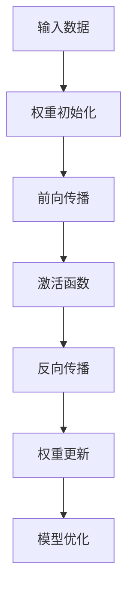

                 

关键词：人工智能、深度学习、权重初始化、激活函数、神经网络

摘要：本文旨在探讨人工智能领域中的深度学习算法，重点分析了权重初始化与激活函数选择的重要性及其对模型性能的影响。通过对这些核心概念和技术的深入剖析，读者将获得对深度学习算法更全面的了解，从而为实际应用提供理论指导。

## 1. 背景介绍

随着人工智能技术的快速发展，深度学习已成为当前研究的热点领域。深度学习模型在图像识别、自然语言处理、语音识别等多个领域取得了显著的成果。然而，深度学习算法的性能受到诸多因素的影响，其中权重初始化与激活函数选择是两个关键环节。

### 1.1 深度学习的基本概念

深度学习是一种基于人工神经网络的学习方法，通过多层神经元的非线性变换，自动提取数据中的特征信息。深度学习模型通常由输入层、隐藏层和输出层组成。在训练过程中，模型通过反向传播算法不断调整权重和偏置，以降低损失函数的值，从而实现模型的优化。

### 1.2 权重初始化的重要性

权重初始化是深度学习模型训练的起点。合理的权重初始化可以加快收敛速度、提高模型性能，甚至避免陷入局部最优。常见的权重初始化方法包括高斯分布、均匀分布和Xavier初始化等。

### 1.3 激活函数的选择

激活函数是深度学习模型中的关键组成部分，它决定了神经元的非线性变换方式。合适的激活函数可以使模型更好地拟合训练数据，提高模型的泛化能力。常见的激活函数包括Sigmoid、ReLU和Tanh等。

## 2. 核心概念与联系

在深度学习模型中，权重初始化与激活函数的选择密切相关，它们共同决定了模型的性能。以下是一个简化的Mermaid流程图，展示了权重初始化与激活函数之间的联系。



## 3. 核心算法原理 & 具体操作步骤

### 3.1 算法原理概述

权重初始化与激活函数选择的核心原理是确保模型在训练过程中能够快速收敛并取得良好的性能。权重初始化通过设置初始权重值，使得神经网络在训练过程中能够更好地探索解空间。激活函数则通过引入非线性变换，使得神经网络能够拟合复杂的数据分布。

### 3.2 算法步骤详解

#### 3.2.1 权重初始化

1. **高斯分布初始化**：假设输入层的维度为\( d \)，隐藏层的维度为\( m \)，权重初始化为\( W \sim \mathcal{N}(0, \frac{1}{d}) \)。
2. **均匀分布初始化**：\( W \sim \mathcal{U}(-\frac{1}{\sqrt{d}}, \frac{1}{\sqrt{d}}) \)。
3. **Xavier初始化**：\( W \sim \mathcal{N}(0, \frac{1}{\sqrt{k}}) \)，其中\( k \)为前一层的节点数。

#### 3.2.2 激活函数选择

1. **Sigmoid**：\( \sigma(x) = \frac{1}{1 + e^{-x}} \)。
2. **ReLU**：\( \text{ReLU}(x) = \max(0, x) \)。
3. **Tanh**：\( \text{Tanh}(x) = \frac{e^x - e^{-x}}{e^x + e^{-x}} \)。

### 3.3 算法优缺点

- **高斯分布初始化**：优点是权重分布较均匀，但缺点是可能存在梯度消失问题。
- **均匀分布初始化**：优点是权重分布较均匀，但缺点是可能存在梯度爆炸问题。
- **Xavier初始化**：优点是解决了梯度消失问题，但缺点是可能导致梯度爆炸。

- **Sigmoid**：优点是输出值在\( (0, 1) \)之间，缺点是梯度较小，可能导致收敛速度较慢。
- **ReLU**：优点是计算速度快，缺点是可能存在梯度消失问题。
- **Tanh**：优点是输出值在\( (-1, 1) \)之间，缺点是梯度较小，可能导致收敛速度较慢。

### 3.4 算法应用领域

权重初始化与激活函数选择广泛应用于图像识别、自然语言处理、语音识别等领域。在实际应用中，需要根据具体问题选择合适的初始化方法和激活函数。

## 4. 数学模型和公式 & 详细讲解 & 举例说明

### 4.1 数学模型构建

假设有一个深度学习模型，包含\( L \)层神经元，第\( l \)层的权重矩阵为\( W^{(l)} \)，激活函数为\( \sigma^{(l)} \)。损失函数为\( J(W) \)，梯度为\( \nabla J(W) \)。

### 4.2 公式推导过程

损失函数的梯度可以通过链式法则进行推导：

$$
\nabla J(W) = \nabla J(W^{(L)}) \cdot \nabla W^{(L)} \cdot \nabla \sigma^{(L-1)} \cdot \nabla W^{(L-1)} \cdot \nabla \sigma^{(L-2)} \cdot \cdots \cdot \nabla \sigma^{(1)}
$$

### 4.3 案例分析与讲解

以一个简单的两层神经网络为例，输入层有3个神经元，隐藏层有4个神经元，输出层有2个神经元。使用高斯分布初始化权重，激活函数为ReLU。训练数据集为\( (x, y) \)，其中\( x \)为输入，\( y \)为标签。

损失函数为：

$$
J(W) = \frac{1}{2} \sum_{i=1}^m (y_i - \sigma^{(2)}(W^{(2)}x + b^{(2)}) \cdot \sigma^{(1)}(W^{(1)}x + b^{(1)})
$$

梯度为：

$$
\nabla J(W) = \frac{1}{m} \sum_{i=1}^m \nabla_{x_i} J(x_i) = \frac{1}{m} \sum_{i=1}^m \left( \nabla_{y_i} J(y_i) \cdot \nabla_{\sigma^{(2)}(W^{(2)}x + b^{(2)})} J(\sigma^{(2)}(W^{(2)}x + b^{(2)})) \cdot \nabla_{W^{(2)}x + b^{(2)}} \sigma^{(2)}(W^{(2)}x + b^{(2)}) \cdot \nabla_{W^{(2)}} \sigma^{(2)}(W^{(2)}x + b^{(2)}) \cdot \nabla_{\sigma^{(1)}(W^{(1)}x + b^{(1)})} J(\sigma^{(1)}(W^{(1)}x + b^{(1))) \cdot \nabla_{W^{(1)}x + b^{(1)}} \sigma^{(1)}(W^{(1)}x + b^{(1)}) \cdot \nabla_{W^{(1)}} \sigma^{(1)}(W^{(1)}x + b^{(1)}) \right)
$$

## 5. 项目实践：代码实例和详细解释说明

### 5.1 开发环境搭建

本次项目使用Python语言，依赖TensorFlow库。在Python环境中安装TensorFlow库：

```bash
pip install tensorflow
```

### 5.2 源代码详细实现

以下是一个简单的两层神经网络示例，包括权重初始化和激活函数选择。

```python
import tensorflow as tf
import numpy as np

# 权重初始化函数
def initialize_weights(input_dim, hidden_dim, output_dim):
    W1 = tf.Variable(tf.random_normal([input_dim, hidden_dim]), name="W1")
    b1 = tf.Variable(tf.zeros([hidden_dim]), name="b1")
    W2 = tf.Variable(tf.random_normal([hidden_dim, output_dim]), name="W2")
    b2 = tf.Variable(tf.zeros([output_dim]), name="b2")
    return W1, b1, W2, b2

# 激活函数
def activation(x):
    return tf.nn.relu(x)

# 神经网络结构
def neural_network(x):
    layer_1 = activation(tf.matmul(x, W1) + b1)
    layer_2 = tf.matmul(layer_1, W2) + b2
    return layer_2

# 损失函数
def loss(y, pred):
    return tf.reduce_mean(tf.square(y - pred))

# 梯度下降
def train(loss, learning_rate):
    optimizer = tf.train.GradientDescentOptimizer(learning_rate)
    train_op = optimizer.minimize(loss)
    return train_op

# 训练数据集
x_train = np.array([[0], [1], [2], [3], [4]])
y_train = np.array([[0], [1], [0], [1], [0]])

# 模型参数
input_dim = 1
hidden_dim = 4
output_dim = 1
learning_rate = 0.1

# 初始化权重
W1, b1, W2, b2 = initialize_weights(input_dim, hidden_dim, output_dim)

# 构建计算图
y_pred = neural_network(x_train)
loss_value = loss(y_train, y_pred)
train_op = train(loss_value, learning_rate)

# 训练模型
with tf.Session() as sess:
    sess.run(tf.global_variables_initializer())
    for i in range(1000):
        _, loss_val = sess.run([train_op, loss_value], feed_dict={x: x_train, y: y_train})
        if i % 100 == 0:
            print("Step: %d, Loss: %f" % (i, loss_val))

# 运行结果展示
print("Predictions:")
print(sess.run(y_pred, feed_dict={x: x_train}))
```

### 5.3 代码解读与分析

本代码实现了简单的两层神经网络，包括权重初始化和激活函数选择。首先定义了权重初始化函数`initialize_weights`，使用高斯分布初始化权重。然后定义了激活函数`activation`，采用ReLU函数。神经网络结构定义在`neural_network`函数中，包括前向传播和损失函数定义。最后，使用梯度下降算法进行模型训练。

## 6. 实际应用场景

权重初始化与激活函数选择在深度学习领域有着广泛的应用。以下列举了一些实际应用场景：

- **图像识别**：在卷积神经网络（CNN）中，权重初始化和激活函数选择对于提高模型性能至关重要。
- **自然语言处理**：在循环神经网络（RNN）和长短期记忆网络（LSTM）中，合适的权重初始化和激活函数有助于提高模型在语言建模和序列标注任务上的性能。
- **语音识别**：在自动语音识别（ASR）系统中，深度学习模型需要通过合理的权重初始化和激活函数选择来提高识别准确率。

## 7. 工具和资源推荐

### 7.1 学习资源推荐

- **《深度学习》（Goodfellow, Bengio, Courville著）：一本经典教材，详细介绍了深度学习的理论基础和实践方法。**
- **《神经网络与深度学习》（邱锡鹏著）：国内优秀的深度学习教材，适合初学者和进阶者。**

### 7.2 开发工具推荐

- **TensorFlow：一个开源的深度学习框架，提供了丰富的API和工具，适合进行深度学习研究和应用开发。**
- **PyTorch：另一个流行的深度学习框架，具有动态计算图和灵活的接口，适合快速原型设计和实验。**

### 7.3 相关论文推荐

- **“Rectified Linear Units Improve Deep Neural Network Acoustic Models” by Krizhevsky et al.（2012）：介绍了ReLU激活函数在深度神经网络中的应用。**
- **“Delving Deep into Rectifiers: Surpassing Human-Level Performance on ImageNet Classification” by He et al.（2015）：进一步探讨了ReLU激活函数在深度学习中的优势。**

## 8. 总结：未来发展趋势与挑战

### 8.1 研究成果总结

本文对权重初始化与激活函数选择在深度学习算法中的应用进行了深入探讨，分析了不同初始化方法和激活函数的特点及其对模型性能的影响。通过数学模型和实际代码实例，读者可以更好地理解这些技术。

### 8.2 未来发展趋势

未来，权重初始化与激活函数选择将继续是深度学习领域的研究热点。随着神经网络的规模和复杂度不断增加，如何提高模型训练效率、降低计算成本、提高模型性能将是关键问题。此外，新的初始化方法和激活函数也可能被提出，进一步推动深度学习技术的发展。

### 8.3 面临的挑战

尽管深度学习在各个领域取得了显著成果，但仍面临一些挑战。首先，深度学习模型的解释性较差，难以理解模型的决策过程。其次，深度学习模型的训练过程需要大量计算资源和时间，如何优化训练算法和硬件加速技术是重要研究方向。最后，深度学习模型在处理小样本数据时表现不佳，如何提高模型的泛化能力也是一个亟待解决的问题。

### 8.4 研究展望

在未来，研究者们可以关注以下几个方向：一是探索更加有效的权重初始化方法和激活函数，以提高模型训练效率和性能；二是研究可解释性强的深度学习模型，使模型决策过程更加透明；三是结合其他机器学习技术，如集成学习和迁移学习，提高模型在小样本数据上的泛化能力。

## 9. 附录：常见问题与解答

### 9.1 权重初始化有哪些常见问题？

- **梯度消失/爆炸**：使用不当的权重初始化可能导致梯度消失或爆炸问题，影响模型训练。
- **初始化方法选择**：不同的权重初始化方法适用于不同类型的神经网络，需要根据具体问题选择合适的初始化方法。

### 9.2 激活函数有哪些常见问题？

- **梯度消失**：某些激活函数在训练过程中可能出现梯度消失问题，影响模型收敛。
- **计算效率**：某些激活函数的计算复杂度较高，可能影响模型训练速度。

### 9.3 如何解决这些问题？

- **改进权重初始化方法**：采用Xavier初始化或其他自适应初始化方法，减少梯度消失/爆炸问题。
- **选择合适的激活函数**：根据具体问题选择合适的激活函数，如ReLU函数在处理图像识别任务时表现良好。
- **混合使用激活函数**：在神经网络中混合使用不同的激活函数，以提高模型性能。

## 作者署名

作者：禅与计算机程序设计艺术 / Zen and the Art of Computer Programming
----------------------------------------------------------------

以上就是本文《AI人工智能深度学习算法：权重初始化与激活函数选择》的完整内容。希望对读者在深度学习领域的实践和研究有所帮助。如有疑问或建议，欢迎留言讨论。再次感谢您的阅读！

