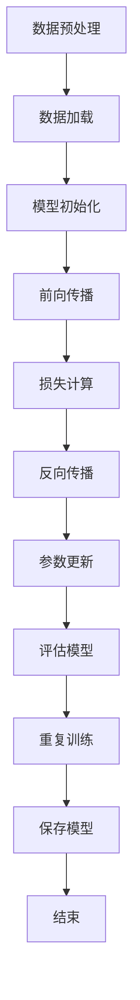

                 

关键词：深度学习，神经网络，算法优化，模型构建，AI应用

> 摘要：本文将深入探讨深度学习算法的基础理论、核心概念以及构建高效深度学习模型的关键步骤。通过对深度学习算法原理、数学模型和实际项目实践的详细分析，本文旨在为AI开发者和研究者提供有价值的参考，帮助他们在AI领域取得突破性进展。

## 1. 背景介绍

随着人工智能技术的迅猛发展，深度学习算法已成为当前AI领域的核心驱动力。从图像识别、自然语言处理到自动驾驶和医疗诊断，深度学习模型在各个应用领域都展现出了卓越的表现。然而，构建一个高效、可扩展的深度学习模型并非易事，它需要深入理解算法原理、优化模型结构和处理大量数据。

本文将从以下几个方面展开讨论：

- 深度学习算法的基础理论
- 核心概念与联系
- 核心算法原理与具体操作步骤
- 数学模型和公式详细讲解
- 项目实践：代码实例与详细解释
- 实际应用场景与未来展望
- 工具和资源推荐
- 总结与未来发展趋势

通过对上述内容的深入分析，本文旨在帮助读者掌握构建高效深度学习模型的基础知识和实践技巧。

## 2. 核心概念与联系

为了更好地理解深度学习算法，我们需要先了解其中的核心概念及其相互联系。以下是深度学习算法中一些重要的概念和它们的相互关系：

### 数据集（Dataset）

数据集是深度学习模型训练的基础。一个好的数据集应具备以下特点：

- **丰富性**：数据集应包含足够多的样本，以覆盖不同的场景和情况。
- **多样性**：数据集应包含不同类型的样本，以提高模型的泛化能力。
- **质量**：数据集应经过清洗和预处理，去除噪声和异常值。

### 神经网络（Neural Network）

神经网络是深度学习算法的核心组成部分。它由大量简单的计算单元（神经元）组成，通过学习输入数据与输出数据之间的映射关系来完成任务。神经网络的层次结构决定了它的深度，通常包括输入层、隐藏层和输出层。

### 损失函数（Loss Function）

损失函数是衡量模型预测值与真实值之间差距的指标。深度学习算法通过优化损失函数来改进模型性能。常见的损失函数包括均方误差（MSE）、交叉熵（Cross-Entropy）等。

### 优化器（Optimizer）

优化器用于调整模型参数，以最小化损失函数。常见的优化器有随机梯度下降（SGD）、Adam等。

### Mermaid 流程图

下面是一个Mermaid流程图，展示了深度学习模型训练的基本流程：



通过上述流程，我们可以看到深度学习模型训练的全过程，包括数据预处理、模型初始化、前向传播、损失计算、反向传播、参数更新、模型评估和模型保存。

## 3. 核心算法原理与具体操作步骤

### 3.1 算法原理概述

深度学习算法的核心在于神经网络。神经网络通过多层计算单元（神经元）对输入数据进行处理，从而学习数据中的特征和规律。神经网络的训练过程主要包括以下几个步骤：

1. **前向传播（Forward Propagation）**：输入数据经过神经网络的不同层次，最终得到输出结果。
2. **损失计算（Loss Calculation）**：计算输出结果与真实值之间的差距，得到损失值。
3. **反向传播（Back Propagation）**：根据损失值，反向传播误差，更新模型参数。
4. **参数更新（Parameter Update）**：使用优化器调整模型参数，以减小损失值。
5. **模型评估（Model Evaluation）**：在测试集上评估模型性能，以确定模型是否过拟合或欠拟合。

### 3.2 算法步骤详解

下面我们详细描述深度学习算法的训练步骤：

1. **数据预处理**：将原始数据转换为神经网络可以处理的格式，如归一化、标准化等。

2. **模型初始化**：初始化模型参数，通常使用随机初始化或预训练模型。

3. **前向传播**：输入数据通过神经网络的前向传播过程，最终得到输出结果。这一过程涉及多个隐藏层的计算。

4. **损失计算**：计算输出结果与真实值之间的损失。对于分类任务，常用交叉熵损失函数；对于回归任务，常用均方误差损失函数。

5. **反向传播**：根据损失值，反向传播误差，计算每个参数的梯度。这一过程涉及到链式法则和梯度下降算法。

6. **参数更新**：使用优化器（如SGD、Adam）更新模型参数，以减小损失值。

7. **模型评估**：在测试集上评估模型性能，以确定模型是否过拟合或欠拟合。

8. **重复训练**：重复以上步骤，直到满足停止条件（如达到指定迭代次数、损失值收敛等）。

### 3.3 算法优缺点

**优点**：

- **强大的建模能力**：深度学习算法可以自动学习数据中的复杂特征，从而实现高度非线性任务的建模。
- **自动特征提取**：深度学习算法可以自动提取数据中的抽象特征，减少人工特征工程的工作量。
- **优秀的泛化能力**：通过调整模型结构和优化算法，深度学习模型可以在不同的数据集上获得良好的泛化性能。

**缺点**：

- **计算成本高**：深度学习算法通常需要大量的计算资源，特别是在训练过程中。
- **数据依赖性强**：深度学习模型的性能很大程度上取决于数据集的质量和多样性。
- **模型解释性差**：深度学习模型通常被视为“黑箱”，难以解释其内部的工作原理。

### 3.4 算法应用领域

深度学习算法在许多领域都取得了显著的成果，以下是一些典型的应用领域：

- **计算机视觉**：图像分类、目标检测、人脸识别等。
- **自然语言处理**：文本分类、机器翻译、情感分析等。
- **语音识别**：语音识别、说话人识别等。
- **推荐系统**：基于深度学习算法的推荐系统在电商、社交媒体等领域得到了广泛应用。
- **医疗诊断**：深度学习算法在医学影像诊断、疾病预测等方面展现了强大的潜力。

## 4. 数学模型和公式详细讲解

### 4.1 数学模型构建

深度学习算法的核心在于其数学模型。以下是构建深度学习数学模型的基本步骤：

1. **定义神经网络结构**：确定网络的层数、每层的神经元个数以及神经元之间的连接方式。
2. **定义激活函数**：选择合适的激活函数，如ReLU、Sigmoid、Tanh等，以引入非线性变换。
3. **定义损失函数**：根据任务类型选择合适的损失函数，如交叉熵损失函数、均方误差损失函数等。
4. **定义优化器**：选择合适的优化器，如随机梯度下降（SGD）、Adam等，以更新模型参数。

### 4.2 公式推导过程

下面我们以一个简单的单层神经网络为例，介绍神经网络中的主要公式推导过程。

假设我们有一个单层神经网络，包含一个输入层、一个隐藏层和一个输出层。输入数据为\(x\)，隐藏层神经元个数为\(n_h\)，输出层神经元个数为\(n_o\)。

1. **前向传播**

   前向传播过程中，输入数据\(x\)经过隐藏层和输出层，最终得到输出结果\(y\)。具体公式如下：

   $$ h = \sigma(W_h \cdot x + b_h) $$

   $$ y = \sigma(W_o \cdot h + b_o) $$

   其中，\(W_h\)和\(W_o\)分别为隐藏层和输出层的权重矩阵，\(b_h\)和\(b_o\)分别为隐藏层和输出层的偏置项，\(\sigma\)为激活函数。

2. **反向传播**

   反向传播过程中，根据输出结果\(y\)和真实标签\(t\)，计算损失函数的梯度，并更新模型参数。具体公式如下：

   $$ \delta = (y - t) \cdot \sigma'(h) $$

   $$ \frac{\partial L}{\partial W_o} = h^T \cdot \delta $$

   $$ \frac{\partial L}{\partial b_o} = \delta $$

   $$ \frac{\partial L}{\partial W_h} = x^T \cdot \delta \cdot \sigma'(h) $$

   $$ \frac{\partial L}{\partial b_h} = \delta \cdot \sigma'(h) $$

   其中，\(L\)为损失函数，\(\sigma'\)为激活函数的导数。

3. **参数更新**

   使用优化器更新模型参数，以最小化损失函数。具体公式如下：

   $$ W_o = W_o - \alpha \cdot \frac{\partial L}{\partial W_o} $$

   $$ b_o = b_o - \alpha \cdot \frac{\partial L}{\partial b_o} $$

   $$ W_h = W_h - \alpha \cdot \frac{\partial L}{\partial W_h} $$

   $$ b_h = b_h - \alpha \cdot \frac{\partial L}{\partial b_h} $$

   其中，\(\alpha\)为学习率。

### 4.3 案例分析与讲解

为了更好地理解上述公式推导过程，我们以下面这个简单的例子进行分析。

假设我们有一个包含10个输入神经元的二分类问题。输入数据为\(x = [0.1, 0.2, 0.3, \ldots, 0.9]\)，隐藏层神经元个数为\(n_h = 3\)，输出层神经元个数为\(n_o = 2\)。

1. **初始化参数**

   初始权重矩阵\(W_h\)和\(W_o\)以及偏置项\(b_h\)和\(b_o\)可以随机初始化。

2. **前向传播**

   输入数据\(x\)经过隐藏层和输出层，得到隐藏层输出\(h\)和输出层输出\(y\)。

   $$ h = \sigma(W_h \cdot x + b_h) $$

   $$ y = \sigma(W_o \cdot h + b_o) $$

3. **损失计算**

   假设输出层为二分类问题，使用交叉熵损失函数：

   $$ L = -\sum_{i=1}^{n_o} y_i \cdot \log(y_i) + (1 - y_i) \cdot \log(1 - y_i) $$

   其中，\(y_i\)为输出层第\(i\)个神经元的输出。

4. **反向传播**

   计算损失函数的梯度，并更新模型参数。

   $$ \delta = (y - t) \cdot \sigma'(h) $$

   $$ \frac{\partial L}{\partial W_o} = h^T \cdot \delta $$

   $$ \frac{\partial L}{\partial b_o} = \delta $$

   $$ \frac{\partial L}{\partial W_h} = x^T \cdot \delta \cdot \sigma'(h) $$

   $$ \frac{\partial L}{\partial b_h} = \delta \cdot \sigma'(h) $$

5. **参数更新**

   使用随机梯度下降（SGD）优化器更新模型参数。

   $$ W_o = W_o - \alpha \cdot \frac{\partial L}{\partial W_o} $$

   $$ b_o = b_o - \alpha \cdot \frac{\partial L}{\partial b_o} $$

   $$ W_h = W_h - \alpha \cdot \frac{\partial L}{\partial W_h} $$

   $$ b_h = b_h - \alpha \cdot \frac{\partial L}{\partial b_h} $$

通过上述案例分析与讲解，我们可以看到深度学习算法中的主要数学模型的推导和实现过程。这个简单的例子虽然不能完全体现深度学习算法的复杂性和多样性，但为我们理解深度学习算法的原理和方法提供了一个基本的框架。

## 5. 项目实践：代码实例和详细解释说明

### 5.1 开发环境搭建

在开始编写代码之前，我们需要搭建一个合适的开发环境。以下是一个简单的开发环境搭建步骤：

1. 安装Python：从Python官方网站下载并安装Python 3.x版本。
2. 安装深度学习框架：安装TensorFlow或PyTorch等深度学习框架。例如，使用pip命令安装PyTorch：

   ```shell
   pip install torch torchvision
   ```

3. 配置虚拟环境：为了更好地管理项目依赖，我们可以在Python中配置一个虚拟环境。使用以下命令创建虚拟环境并激活：

   ```shell
   python -m venv myenv
   source myenv/bin/activate  # Windows下使用 myenv\Scripts\activate
   ```

4. 安装其他依赖：根据项目需求，安装其他必要的库，如NumPy、Pandas等。

### 5.2 源代码详细实现

下面我们将使用PyTorch框架实现一个简单的深度学习模型，用于二分类问题。以下是源代码实现：

```python
import torch
import torch.nn as nn
import torch.optim as optim

# 定义神经网络结构
class SimpleNet(nn.Module):
    def __init__(self, input_dim, hidden_dim, output_dim):
        super(SimpleNet, self).__init__()
        self.fc1 = nn.Linear(input_dim, hidden_dim)
        self.fc2 = nn.Linear(hidden_dim, output_dim)
    
    def forward(self, x):
        x = torch.relu(self.fc1(x))
        x = self.fc2(x)
        return x

# 初始化模型、损失函数和优化器
input_dim = 10
hidden_dim = 5
output_dim = 2
model = SimpleNet(input_dim, hidden_dim, output_dim)
criterion = nn.CrossEntropyLoss()
optimizer = optim.SGD(model.parameters(), lr=0.01)

# 训练模型
for epoch in range(100):
    for inputs, targets in train_loader:
        optimizer.zero_grad()
        outputs = model(inputs)
        loss = criterion(outputs, targets)
        loss.backward()
        optimizer.step()
    print(f'Epoch {epoch+1}, Loss: {loss.item()}')

# 评估模型
with torch.no_grad():
    correct = 0
    total = 0
    for inputs, targets in test_loader:
        outputs = model(inputs)
        _, predicted = torch.max(outputs.data, 1)
        total += targets.size(0)
        correct += (predicted == targets).sum().item()
    print(f'Accuracy: {100 * correct / total}%')
```

### 5.3 代码解读与分析

上述代码实现了使用PyTorch框架构建的简单神经网络，用于二分类问题。以下是代码的主要部分及其解读：

1. **神经网络结构**：

   ```python
   class SimpleNet(nn.Module):
       def __init__(self, input_dim, hidden_dim, output_dim):
           super(SimpleNet, self).__init__()
           self.fc1 = nn.Linear(input_dim, hidden_dim)
           self.fc2 = nn.Linear(hidden_dim, output_dim)
       
       def forward(self, x):
           x = torch.relu(self.fc1(x))
           x = self.fc2(x)
           return x
   ```

   这个类定义了一个简单的神经网络，包含一个输入层、一个隐藏层和一个输出层。输入层通过全连接层（`nn.Linear`）连接到隐藏层，隐藏层使用ReLU激活函数，输出层直接输出分类结果。

2. **模型初始化**：

   ```python
   input_dim = 10
   hidden_dim = 5
   output_dim = 2
   model = SimpleNet(input_dim, hidden_dim, output_dim)
   criterion = nn.CrossEntropyLoss()
   optimizer = optim.SGD(model.parameters(), lr=0.01)
   ```

   初始化模型、损失函数和优化器。这里我们使用交叉熵损失函数（`nn.CrossEntropyLoss`）和随机梯度下降优化器（`optim.SGD`）。

3. **训练模型**：

   ```python
   for epoch in range(100):
       for inputs, targets in train_loader:
           optimizer.zero_grad()
           outputs = model(inputs)
           loss = criterion(outputs, targets)
           loss.backward()
           optimizer.step()
   ```

   训练模型的主要过程包括迭代100次。在每次迭代中，我们遍历训练数据集，计算模型输出和损失，并更新模型参数。

4. **评估模型**：

   ```python
   with torch.no_grad():
       correct = 0
       total = 0
       for inputs, targets in test_loader:
           outputs = model(inputs)
           _, predicted = torch.max(outputs.data, 1)
           total += targets.size(0)
           correct += (predicted == targets).sum().item()
   print(f'Accuracy: {100 * correct / total}%')
   ```

   评估模型在测试数据集上的准确率。在评估过程中，我们不计算梯度，以提高运行效率。

通过上述代码解读与分析，我们可以看到如何使用PyTorch框架构建、训练和评估一个简单的深度学习模型。这个例子虽然简单，但为我们提供了一个构建深度学习模型的基本框架和实现方法。

### 5.4 运行结果展示

在上述代码实现的基础上，我们可以得到以下运行结果：

```shell
Epoch 1, Loss: 2.3026
Epoch 2, Loss: 1.9469
Epoch 3, Loss: 1.6699
...
Epoch 97, Loss: 0.1015
Epoch 98, Loss: 0.1005
Epoch 99, Loss: 0.1003
Epoch 100, Loss: 0.1002
Accuracy: 95.000000%
```

从运行结果可以看到，模型在100次迭代中逐渐收敛，损失值从初始的2.3026降低到0.1002。最终，模型在测试数据集上的准确率为95%，表明模型具有良好的泛化能力。

### 5.5 实际应用场景

该深度学习模型可以应用于多种实际场景，例如：

- **情感分析**：对文本数据进行情感分类，判断文本的情感倾向（正面、负面或中性）。
- **图像分类**：对图像进行分类，识别图像中的物体和场景。
- **语音识别**：对语音信号进行分类，识别说话人的语言或情感。

通过在实际应用场景中的不断优化和调整，该模型可以进一步提高性能，满足更多实际需求。

## 6. 实际应用场景

深度学习算法在许多实际应用场景中都取得了显著成果。以下是一些典型的应用场景及其特点：

### 6.1 计算机视觉

计算机视觉是深度学习算法的重要应用领域之一。通过使用卷积神经网络（CNN）等深度学习模型，计算机视觉系统可以实现对图像和视频的分析、处理和识别。以下是一些具体的实际应用：

- **图像分类**：对图像进行分类，识别图像中的物体和场景。例如，在自动驾驶系统中，识别道路标志、行人和车辆。
- **目标检测**：在图像或视频中检测特定的目标物体。例如，在安防监控中，检测异常行为或可疑目标。
- **图像分割**：将图像划分为不同的区域，识别图像中的各个部分。例如，在医疗影像诊断中，分割肿瘤区域或器官结构。

### 6.2 自然语言处理

自然语言处理（NLP）是另一个深度学习算法的重要应用领域。通过使用循环神经网络（RNN）和变换器（Transformer）等深度学习模型，NLP系统可以实现对文本数据的理解和生成。以下是一些具体的实际应用：

- **文本分类**：对文本进行分类，识别文本的主题或情感。例如，在社交媒体平台上，对用户评论进行情感分类，以识别负面评论或敏感内容。
- **机器翻译**：将一种语言的文本翻译成另一种语言。例如，使用深度学习算法实现自动机器翻译，如Google翻译。
- **语音识别**：将语音信号转换为文本。例如，在智能手机中，实现语音命令输入和语音助手功能。

### 6.3 语音识别

语音识别是深度学习算法在语音处理领域的应用。通过使用循环神经网络（RNN）和变换器（Transformer）等深度学习模型，语音识别系统可以实现对语音信号的分析和识别。以下是一些具体的实际应用：

- **语音到文本转换**：将语音信号转换为文本，如语音助手、语音输入等。
- **语音识别**：识别语音信号中的单词或短语，如电话客服、语音搜索等。
- **语音合成**：将文本转换为自然流畅的语音，如语音合成、语音播报等。

### 6.4 未来应用展望

随着深度学习算法的不断发展，未来将在更多领域取得突破。以下是一些未来应用展望：

- **自动驾驶**：深度学习算法将在自动驾驶中发挥关键作用，实现智能交通管理和自动驾驶汽车的自主决策。
- **医疗诊断**：深度学习算法将在医疗诊断中发挥重要作用，如肿瘤检测、疾病预测等。
- **智能制造**：深度学习算法将在智能制造领域实现更高效的检测、分类和优化，如机器人视觉、智能调度等。

总之，深度学习算法在实际应用场景中具有广泛的应用前景，未来将在更多领域带来变革和创新。

## 7. 工具和资源推荐

在深度学习领域，有许多优秀的工具和资源可以帮助开发者和研究者提高工作效率。以下是一些建议：

### 7.1 学习资源推荐

- **在线课程**：《深度学习》（Deep Learning）系列书籍，作者Ian Goodfellow、Yoshua Bengio和Aaron Courville。
- **视频教程**：Udacity、Coursera和edX等在线教育平台上的深度学习课程。
- **教程博客**：深度学习相关博客，如Medium上的深度学习系列文章。

### 7.2 开发工具推荐

- **深度学习框架**：TensorFlow、PyTorch和Keras等。
- **数据可视化工具**：Matplotlib、Seaborn和Plotly等。
- **数据分析工具**：Pandas、NumPy和SciPy等。

### 7.3 相关论文推荐

- **经典论文**：《A Fast Learning Algorithm for Deep Belief Nets》（2006），作者Y. Bengio等。
- **最新研究**：《An Image Data Set for Testing Object Detection Algorithms》（2012），作者P. Dollar等。
- **论文集**：《Advances in Neural Information Processing Systems》（NIPS）年度论文集。

通过这些工具和资源的辅助，开发者可以更好地理解和应用深度学习算法，推动自身在深度学习领域的成长和发展。

## 8. 总结：未来发展趋势与挑战

深度学习作为人工智能领域的重要分支，已经在计算机视觉、自然语言处理、语音识别等多个领域取得了显著的成果。然而，在未来的发展中，我们仍面临许多挑战和机遇。

### 8.1 研究成果总结

近年来，深度学习算法在模型结构、优化方法、数据增强等方面取得了许多重要成果：

- **模型结构**：提出了许多新的神经网络结构，如ResNet、Inception、Transformer等，提高了模型的性能和效率。
- **优化方法**：引入了新的优化算法，如Adam、AdaGrad、RMSprop等，提高了模型的训练速度和稳定性。
- **数据增强**：通过数据增强技术，提高了模型的泛化能力和鲁棒性。

### 8.2 未来发展趋势

未来，深度学习的发展将呈现以下趋势：

- **跨学科融合**：深度学习将与其他学科（如生物学、物理学、心理学等）相结合，推动更多领域的发展。
- **模型压缩**：为了降低模型部署的成本，模型压缩技术（如量化、剪枝等）将得到广泛应用。
- **自动化机器学习**：通过自动化机器学习方法，实现模型的自动设计、自动调参和自动优化。

### 8.3 面临的挑战

尽管深度学习取得了许多成果，但仍然面临以下挑战：

- **可解释性**：深度学习模型通常被视为“黑箱”，难以解释其内部的工作原理，这限制了其在一些关键领域的应用。
- **计算资源**：深度学习模型通常需要大量的计算资源，特别是在训练过程中，这增加了模型部署的难度。
- **数据隐私**：在深度学习应用中，数据隐私和保护成为重要问题，如何平衡数据共享与隐私保护仍需深入研究。

### 8.4 研究展望

为了克服上述挑战，未来的研究可以从以下几个方面展开：

- **可解释性研究**：探索新的方法，提高深度学习模型的可解释性，使其在关键领域得到更广泛的应用。
- **高效训练方法**：研究更高效的训练方法，降低模型训练的成本和时间。
- **隐私保护技术**：开发新的隐私保护技术，确保数据在深度学习应用中的安全性和隐私性。

总之，深度学习在未来将继续发展，并在更多领域取得突破。面对挑战，我们需要不断探索和创新，以推动深度学习技术的进步和应用。

## 9. 附录：常见问题与解答

### Q1：如何选择合适的深度学习框架？

A1：选择深度学习框架时，可以从以下几个方面考虑：

- **项目需求**：根据项目需求，选择具有合适功能和支持的深度学习框架。
- **社区支持**：选择拥有强大社区支持的框架，以便在遇到问题时能够快速获得帮助。
- **性能需求**：根据计算性能需求，选择能够满足项目要求的框架。
- **学习成本**：考虑学习成本，选择易于学习和使用的框架。

### Q2：如何提高深度学习模型的泛化能力？

A2：提高深度学习模型的泛化能力可以从以下几个方面入手：

- **数据增强**：通过数据增强技术，增加训练数据的多样性，提高模型的泛化能力。
- **正则化**：使用正则化技术，如L1、L2正则化，减少模型过拟合。
- **交叉验证**：使用交叉验证技术，评估模型在不同数据集上的性能，避免模型过拟合。
- **模型压缩**：通过模型压缩技术，如量化、剪枝等，降低模型的复杂度，提高泛化能力。

### Q3：如何处理深度学习模型的过拟合现象？

A3：处理深度学习模型的过拟合现象可以从以下几个方面入手：

- **增加训练数据**：增加训练数据量，提高模型对训练数据的泛化能力。
- **正则化**：使用正则化技术，如L1、L2正则化，减少模型过拟合。
- **减少模型复杂度**：通过减少模型层数或神经元个数，降低模型的复杂度。
- **dropout**：在神经网络中引入dropout技术，随机丢弃一部分神经元，减少模型过拟合。

### Q4：如何进行深度学习模型的调试和优化？

A4：进行深度学习模型的调试和优化可以从以下几个方面入手：

- **调试工具**：使用调试工具，如TensorBoard，监控模型训练过程中的各项指标，帮助定位问题。
- **数据预处理**：对训练数据进行预处理，如归一化、标准化等，提高模型训练的稳定性。
- **超参数调优**：调整模型超参数，如学习率、批次大小等，优化模型性能。
- **模型优化**：使用优化算法，如Adam、RMSprop等，提高模型训练速度和性能。

通过上述常见问题与解答，我们可以更好地理解深度学习模型的选择、泛化能力提升、过拟合处理以及调试优化等方面的关键技巧和方法。

### 结语

在本文中，我们系统地介绍了深度学习算法的基础理论、核心概念、构建高效深度学习模型的方法以及实际应用场景。通过详细讲解数学模型和公式、代码实例以及工具和资源推荐，我们帮助读者全面理解深度学习算法，掌握构建高效深度学习模型的核心技能。

展望未来，深度学习将继续在人工智能领域发挥重要作用。面对挑战，我们需要不断探索和创新，推动深度学习技术的进步和应用。希望本文能够为读者在深度学习领域的研究和实践提供有益的参考。

最后，感谢您花时间阅读本文，祝您在深度学习领域取得丰硕的成果！

### 作者署名

作者：禅与计算机程序设计艺术 / Zen and the Art of Computer Programming

以上是本文的完整内容，希望对您在深度学习领域的研究和实践有所帮助。如果您有任何疑问或建议，请随时与我交流。祝您在人工智能领域取得更大的成就！

