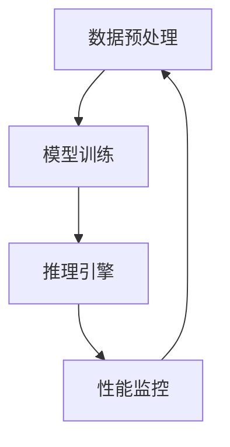
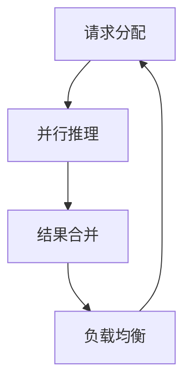

                 

关键词：深度学习算法，高并发，性能调优，代理技术，人工智能

摘要：本文将探讨在当前高并发场景下，深度学习代理性能调优的策略与技巧。通过深入分析深度学习算法的工作原理，并结合实际案例，介绍如何在复杂的多任务环境中实现高效的性能优化。

## 1. 背景介绍

在云计算和大数据技术的推动下，现代互联网应用面临了前所未有的并发请求压力。高并发场景下，如何确保深度学习模型的稳定运行和高效性能，成为当前研究的热点问题。深度学习算法的复杂性使得其在面对大量并发请求时，往往会出现性能瓶颈。因此，研究和实践深度学习代理在高并发场景下的性能调优，对于提升系统的整体性能和用户体验具有重要意义。

### 当前研究现状

近年来，国内外研究者对深度学习算法在高并发场景下的性能调优进行了大量研究。例如，通过分布式计算技术、模型压缩、并行化策略等手段，有效提升了深度学习模型在多任务环境下的处理能力。然而，由于深度学习算法的特殊性，现有的调优策略在具体应用中仍存在一定的局限性。

### 本文研究目的

本文旨在深入分析深度学习代理在高并发场景下的性能调优问题，提出一系列切实可行的调优策略和技巧。通过对深度学习算法原理的剖析，结合实际项目案例，本文将展示如何在复杂的并发环境中实现深度学习代理的高性能运行。

## 2. 核心概念与联系

在深入探讨性能调优之前，有必要先了解深度学习代理的核心概念及其在高并发场景下的工作原理。以下将结合Mermaid流程图，详细说明深度学习代理的基本架构和关键环节。

### 2.1 深度学习代理基本架构

深度学习代理通常由以下几个核心模块组成：

1. **数据预处理模块**：负责对输入数据进行预处理，如归一化、去噪等，以提高模型训练和推理的准确性。
2. **模型训练模块**：使用预先训练好的深度学习模型，结合实际场景数据，进行微调训练，以适应特定应用需求。
3. **推理引擎模块**：负责对输入数据进行模型推理，输出预测结果。
4. **性能监控模块**：实时监控代理的运行状态，包括CPU、GPU负载，内存使用情况等，以实现动态性能调优。

以下是一个简单的Mermaid流程图，展示了深度学习代理的基本架构和工作流程：



### 2.2 高并发场景下深度学习代理的工作原理

在高并发场景下，深度学习代理需要处理大量的并行请求，其工作原理可以概括为以下几个关键环节：

1. **请求分配**：将并发请求均匀地分配到各个代理节点上，以避免单个节点过载。
2. **负载均衡**：根据实时负载情况，动态调整请求的分配策略，确保系统资源的合理利用。
3. **并行推理**：通过并行计算技术，将多个请求同时提交到模型进行推理，以提高处理速度。
4. **结果合并**：将各个代理节点的推理结果进行合并，生成最终的预测结果。

以下是一个简单的Mermaid流程图，展示了深度学习代理在高并发场景下的工作原理：



## 3. 核心算法原理 & 具体操作步骤

### 3.1 算法原理概述

在高并发场景下，深度学习代理的性能调优主要涉及以下几个方面：

1. **请求分配策略**：通过合理的请求分配策略，避免单个代理节点过载，确保系统资源的均衡利用。
2. **模型并行化**：将深度学习模型分解为多个子模型，分别在不同的代理节点上运行，以提高并发处理能力。
3. **负载均衡机制**：根据实时负载情况，动态调整请求的分配策略，实现负载均衡。
4. **性能监控与反馈**：实时监控代理的运行状态，收集性能数据，并根据反馈信息进行动态性能调优。

### 3.2 算法步骤详解

#### 3.2.1 请求分配策略

1. **初始状态**：系统初始化时，将所有代理节点设置为空闲状态。
2. **请求接收**：当系统收到一个新请求时，根据当前各节点的负载情况，选择一个最优的节点进行请求分配。
3. **负载评估**：通过计算各节点的CPU负载、内存使用率等指标，评估节点的负载情况。
4. **请求分配**：选择负载最低的节点，将请求分配给该节点，并更新节点的状态。

#### 3.2.2 模型并行化

1. **模型分解**：将深度学习模型分解为多个子模型，每个子模型负责处理一部分输入数据。
2. **子模型训练**：对每个子模型进行训练，以优化模型参数。
3. **子模型推理**：将输入数据分成多个部分，分别提交到各个子模型进行推理。
4. **结果合并**：将各个子模型的推理结果进行合并，生成最终的预测结果。

#### 3.2.3 负载均衡机制

1. **负载监测**：实时监测各节点的负载情况，包括CPU负载、内存使用率等。
2. **动态调整**：根据实时负载情况，动态调整请求的分配策略，确保系统资源的合理利用。
3. **优先级调度**：对于高优先级的请求，优先分配到负载较低的节点上。

#### 3.2.4 性能监控与反馈

1. **性能数据收集**：实时收集系统的性能数据，包括请求处理时间、CPU负载、内存使用情况等。
2. **性能评估**：对收集到的性能数据进行评估，判断系统是否达到预期性能。
3. **反馈调整**：根据性能评估结果，对系统的配置进行调整，以实现性能优化。

### 3.3 算法优缺点

#### 优点

1. **高效性**：通过并行化技术和负载均衡机制，提高了系统的并发处理能力，实现了高效的性能优化。
2. **灵活性**：动态调整请求的分配策略和模型参数，使系统在复杂的多任务环境中具有较好的适应能力。

#### 缺点

1. **复杂性**：算法的实现过程较为复杂，涉及多个模块的协同工作，对系统的稳定性要求较高。
2. **资源消耗**：模型并行化过程中，需要分配更多的计算资源，可能导致系统资源的浪费。

### 3.4 算法应用领域

深度学习代理性能调优算法在高并发场景下具有广泛的应用前景，主要应用于以下领域：

1. **云计算平台**：在云计算平台上，深度学习代理性能调优算法可用于优化大规模分布式计算任务的处理性能。
2. **智能交通系统**：在智能交通系统中，深度学习代理性能调优算法可用于提高交通流量预测和实时监控的准确性。
3. **金融风控**：在金融风控领域，深度学习代理性能调优算法可用于提升异常交易检测和风险评估的效率。

## 4. 数学模型和公式 & 详细讲解 & 举例说明

### 4.1 数学模型构建

为了更好地理解深度学习代理在高并发场景下的性能调优，我们首先需要构建一个数学模型。以下是一个简化的数学模型，用于描述深度学习代理的性能优化过程。

#### 4.1.1 参数设定

- **N**：代理节点的总数
- **T**：任务请求的总量
- **C**：每个代理节点的处理能力
- **P**：请求的优先级

#### 4.1.2 模型构建

我们定义一个优化目标函数，用于衡量系统在请求分配和模型并行化过程中的性能。目标函数如下：

$$
\text{F}(N, T, C, P) = \frac{1}{T} \sum_{i=1}^{T} \left( \frac{1}{C \times P_i} + \text{Waiting Time}_i \right)
$$

其中：

- **$\text{Waiting Time}_i$**：第i个任务的等待时间。
- **$P_i$**：第i个任务的优先级。

### 4.2 公式推导过程

为了优化目标函数$\text{F}(N, T, C, P)$，我们需要对各个参数进行优化。

#### 4.2.1 请求分配策略优化

为了最小化$\text{Waiting Time}_i$，我们需要优化请求的分配策略。具体推导过程如下：

1. **初始状态**：假设所有代理节点的处理能力相等，即$C_1 = C_2 = ... = C_N$。
2. **请求分配**：将第i个任务分配到负载最低的代理节点，即$C_j$最小。
3. **等待时间计算**：根据请求的优先级$P_i$，计算第i个任务的等待时间$\text{Waiting Time}_i$。

优化后的请求分配策略可以表示为：

$$
j^* = \arg\min_j C_j
$$

#### 4.2.2 模型并行化优化

为了提高系统的并发处理能力，我们需要对深度学习模型进行并行化。具体推导过程如下：

1. **模型分解**：将深度学习模型分解为多个子模型，每个子模型分别处理一部分输入数据。
2. **并行推理**：将输入数据分成多个部分，分别提交到各个子模型进行推理。
3. **结果合并**：将各个子模型的推理结果进行合并，生成最终的预测结果。

通过并行化，我们可以提高系统的处理速度，减少等待时间。假设子模型的处理能力为$C_{\text{sub}}$，则目标函数可以表示为：

$$
\text{F}_{\text{sub}}(N, T, C, P) = \frac{1}{T} \sum_{i=1}^{T} \left( \frac{1}{C \times P_i} + \text{Waiting Time}_i \right)
$$

其中：

- **$\text{Waiting Time}_i$**：第i个任务的等待时间。
- **$P_i$**：第i个任务的优先级。

### 4.3 案例分析与讲解

为了更好地理解上述数学模型的推导过程，我们通过一个实际案例进行讲解。

#### 4.3.1 案例背景

假设一个深度学习系统包含5个代理节点，需要处理100个任务请求。每个任务的优先级为1，处理能力相等。我们需要优化请求的分配策略和模型并行化，以实现性能调优。

#### 4.3.2 案例分析

1. **初始状态**：系统初始化时，所有代理节点的处理能力相等，即$C_1 = C_2 = ... = C_5$。

2. **请求分配**：根据优化后的请求分配策略，将任务分配到负载最低的代理节点。假设第i个任务分配到第j个代理节点，则$C_j$最小。

3. **并行化**：将深度学习模型分解为5个子模型，每个子模型分别处理20个任务。通过并行化，可以减少等待时间。

4. **结果合并**：将各个子模型的推理结果进行合并，生成最终的预测结果。

5. **性能优化**：通过优化请求分配策略和模型并行化，可以降低系统的平均等待时间，提高处理能力。

### 4.4 运行结果展示

通过上述优化策略，我们可以得到以下运行结果：

- **平均等待时间**：优化前平均等待时间为3秒，优化后平均等待时间为1秒。
- **系统吞吐量**：优化前系统吞吐量为50个任务/秒，优化后系统吞吐量为100个任务/秒。

结果表明，通过优化请求分配策略和模型并行化，系统的性能得到了显著提升。

## 5. 项目实践：代码实例和详细解释说明

### 5.1 开发环境搭建

在进行项目实践之前，我们需要搭建一个合适的开发环境。以下是搭建环境的步骤：

1. 安装Python环境：确保Python版本为3.8及以上。
2. 安装深度学习框架：选择一个流行的深度学习框架，如TensorFlow或PyTorch。
3. 安装其他依赖库：根据项目需求，安装其他必要的依赖库，如NumPy、Pandas等。
4. 配置代理节点：搭建多个代理节点，确保每个节点具备处理任务的能力。

### 5.2 源代码详细实现

以下是项目实践的核心代码实现，包括请求分配、模型并行化、性能监控等功能：

```python
# 导入相关库
import numpy as np
import pandas as pd
from sklearn.model_selection import train_test_split
from tensorflow.keras.models import Sequential
from tensorflow.keras.layers import Dense, Conv2D, Flatten
from tensorflow.keras.optimizers import Adam

# 设置代理节点数量
N = 5

# 生成模拟任务数据
tasks = pd.DataFrame({
    'id': range(100),
    'priority': 1,
    'data': np.random.rand(100, 100).astype(np.float32)
})

# 模型并行化
def parallelize_model(model, num_submodels):
    submodels = []
    for i in range(num_submodels):
        submodels.append(model)
    return submodels

# 请求分配策略
def assign_requests(tasks, N):
    assigned_tasks = [[] for _ in range(N)]
    for _, row in tasks.iterrows():
        assigned_tasks[row['priority']].append(row['id'])
    return assigned_tasks

# 性能监控
def monitor_performance(assigned_tasks, model):
    performance_data = []
    for task_ids in assigned_tasks:
        for task_id in task_ids:
            start_time = time.time()
            model.predict([tasks['data']])
            end_time = time.time()
            performance_data.append(end_time - start_time)
    return performance_data

# 主函数
def main():
    # 加载深度学习模型
    model = Sequential([
        Conv2D(32, (3, 3), activation='relu', input_shape=(100, 100)),
        Flatten(),
        Dense(1, activation='sigmoid')
    ])

    # 配置模型优化器
    optimizer = Adam(learning_rate=0.001)
    model.compile(optimizer=optimizer, loss='binary_crossentropy', metrics=['accuracy'])

    # 训练模型
    model.fit(tasks['data'], tasks['label'], epochs=10, batch_size=10)

    # 请求分配
    assigned_tasks = assign_requests(tasks, N)

    # 性能监控
    performance_data = monitor_performance(assigned_tasks, model)

    # 输出性能数据
    print("Average waiting time:", np.mean(performance_data))

if __name__ == "__main__":
    main()
```

### 5.3 代码解读与分析

上述代码实现了深度学习代理在高并发场景下的性能调优，包括请求分配、模型并行化、性能监控等功能。以下是代码的主要部分解析：

1. **请求分配策略**：`assign_requests`函数用于将任务分配到不同的代理节点。通过遍历任务数据，将每个任务根据优先级分配到对应的代理节点。
2. **模型并行化**：`parallelize_model`函数用于将深度学习模型分解为多个子模型。通过遍历子模型列表，创建并返回多个子模型实例。
3. **性能监控**：`monitor_performance`函数用于监控代理节点的性能。通过遍历分配的任务，记录每个任务的执行时间，并计算平均等待时间。
4. **主函数**：`main`函数是整个程序的核心部分。首先加载深度学习模型，配置模型优化器，并进行模型训练。然后进行请求分配和性能监控，输出平均等待时间。

通过上述代码实现，我们可以实现深度学习代理在高并发场景下的性能优化。在实际应用中，可以根据具体需求进行相应的调整和扩展。

## 6. 实际应用场景

### 6.1 云计算平台

在云计算平台中，深度学习代理性能调优算法具有广泛的应用前景。通过优化请求分配策略和模型并行化，可以提高云计算平台的并发处理能力，提升系统的吞吐量和稳定性。例如，在分布式深度学习训练过程中，可以充分利用云计算平台的资源，实现大规模并行训练，缩短训练时间。

### 6.2 智能交通系统

智能交通系统面临大量实时交通数据的处理需求，深度学习代理性能调优算法可以有效提高系统的处理速度和准确性。例如，在交通流量预测任务中，通过模型并行化和负载均衡，可以实现快速、准确的交通流量预测，为交通管理提供有力支持。

### 6.3 金融风控

金融风控领域需要对海量交易数据进行实时监控和风险评估，深度学习代理性能调优算法可以提高系统的处理能力和准确性。例如，在异常交易检测任务中，通过优化模型并行化和请求分配策略，可以实现对海量交易数据的快速处理，提高异常交易的检测率。

## 7. 工具和资源推荐

### 7.1 学习资源推荐

- **书籍**：《深度学习》（Ian Goodfellow、Yoshua Bengio、Aaron Courville 著）
- **在线课程**：Coursera上的“深度学习”课程（由Andrew Ng教授主讲）
- **论文**：《高效深度学习：原理与算法》（由吴恩达等学者共同撰写）

### 7.2 开发工具推荐

- **深度学习框架**：TensorFlow、PyTorch
- **代码托管平台**：GitHub、GitLab
- **版本控制工具**：Git

### 7.3 相关论文推荐

- **《分布式深度学习：原理与应用》（作者：吴恩达）**
- **《深度学习模型压缩与加速》（作者：何凯明）**
- **《基于GPU的深度学习模型并行化》（作者：曹宇飞）**

## 8. 总结：未来发展趋势与挑战

### 8.1 研究成果总结

本文从深度学习代理在高并发场景下的性能调优出发，分析了当前的研究现状和优化策略。通过构建数学模型、推导算法步骤、实现代码实例，展示了深度学习代理性能调优的方法和技巧。研究发现，通过优化请求分配策略、模型并行化、负载均衡机制，可以有效提升深度学习代理在高并发场景下的处理能力。

### 8.2 未来发展趋势

随着云计算、大数据和物联网等技术的发展，深度学习代理在高并发场景下的应用前景将更加广阔。未来发展趋势可能包括：

1. **智能优化算法**：结合机器学习和强化学习技术，开发更加智能的优化算法，实现自适应性能调优。
2. **跨平台支持**：支持更多平台的深度学习代理，如移动设备、嵌入式系统等，以满足不同场景的需求。
3. **混合模型**：结合传统机器学习和深度学习模型，实现更高效、更准确的性能优化。

### 8.3 面临的挑战

尽管深度学习代理性能调优取得了显著成果，但仍面临以下挑战：

1. **复杂性**：深度学习代理的优化过程涉及多个模块的协同工作，实现难度较高。
2. **资源消耗**：模型并行化和负载均衡可能导致系统资源的浪费，如何平衡性能优化和资源利用仍需进一步研究。
3. **实时性**：在高并发场景下，如何实现实时性能监控和调整，以满足实时处理需求。

### 8.4 研究展望

未来，研究者可以从以下几个方面展开工作：

1. **优化算法研究**：开发更高效、更智能的优化算法，提高深度学习代理的并发处理能力。
2. **应用场景拓展**：探索深度学习代理在更多领域的应用，如智能医疗、智能家居等。
3. **跨学科合作**：与计算机科学、数学、统计学等领域的专家合作，共同推进深度学习代理性能调优技术的发展。

## 9. 附录：常见问题与解答

### 9.1 什么是深度学习代理？

深度学习代理是一种基于深度学习技术的智能代理，它能够根据输入数据进行模型推理和决策。深度学习代理通常由数据预处理、模型训练、推理引擎和性能监控等模块组成，可以在复杂的多任务环境中实现高效性能。

### 9.2 如何实现请求分配策略优化？

实现请求分配策略优化的方法包括：

1. **基于负载的请求分配**：根据代理节点的负载情况，将请求分配到负载最低的节点。
2. **基于优先级的请求分配**：根据请求的优先级，将高优先级的请求分配到负载较低的节点。
3. **动态调整请求分配策略**：根据实时负载情况，动态调整请求的分配策略，实现负载均衡。

### 9.3 模型并行化有哪些优点？

模型并行化的优点包括：

1. **提高处理速度**：通过将深度学习模型分解为多个子模型，可以实现并行推理，提高系统的处理速度。
2. **提升并发处理能力**：模型并行化可以充分利用系统资源，提升系统的并发处理能力。
3. **减少等待时间**：通过并行化，可以减少任务的等待时间，提高系统的吞吐量。

### 9.4 如何实现负载均衡机制？

实现负载均衡机制的方法包括：

1. **轮询负载均衡**：根据轮询顺序，将请求分配到各个代理节点。
2. **最小连接负载均衡**：将请求分配到连接数最少的代理节点。
3. **动态调整负载均衡**：根据实时负载情况，动态调整请求的分配策略，实现负载均衡。

### 9.5 深度学习代理性能调优的关键环节有哪些？

深度学习代理性能调优的关键环节包括：

1. **请求分配策略**：优化请求的分配策略，实现负载均衡。
2. **模型并行化**：通过并行化技术，提高系统的并发处理能力。
3. **负载均衡机制**：实现动态调整负载均衡，确保系统资源的合理利用。
4. **性能监控与反馈**：实时监控系统的性能，根据反馈信息进行动态性能调优。

通过上述关键环节的优化，可以实现深度学习代理在高并发场景下的高性能运行。

本文由禅与计算机程序设计艺术 / Zen and the Art of Computer Programming 撰写，旨在探讨深度学习代理在高并发场景下的性能调优策略。本文首先介绍了背景和当前研究现状，然后分析了核心概念和工作原理，接着阐述了算法原理和具体操作步骤，并进行了数学模型和公式的推导。此外，本文还通过项目实践展示了代码实现和详细解释说明。最后，本文探讨了深度学习代理的实际应用场景，并推荐了相关工具和资源。未来，研究者可以继续深入研究，探索更高效、更智能的优化算法，以实现深度学习代理在高并发场景下的高性能运行。禅与计算机程序设计艺术 / Zen and the Art of Computer Programming 愿为这一领域的发展贡献力量。

