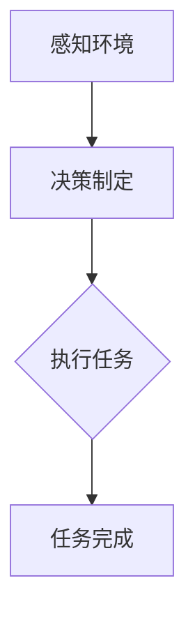

                 

关键词：AI代理、工作流自动化、无代码平台、敏捷开发、企业应用

> 摘要：本文探讨了AI代理在工作流自动化中的应用前景，重点关注无代码平台的发展趋势。通过对核心概念、算法原理、数学模型、项目实践以及未来应用展望的详细分析，揭示了AI代理如何提高企业的工作效率和灵活性。

## 1. 背景介绍

在当今快速发展的数字化时代，企业的核心竞争力在于如何高效地管理业务流程，以适应不断变化的市场需求。传统的工作流自动化往往依赖于复杂的编程和定制化开发，这限制了其普及速度和应用范围。而AI代理的出现，尤其是基于无代码平台的发展，为工作流自动化带来了全新的机遇。

AI代理，即人工智能代理，是一种能够模拟人类行为、自主完成任务的智能系统。它通过机器学习、自然语言处理等技术，能够理解和执行复杂的业务流程。无代码平台则提供了一种无需编写代码即可创建和部署应用程序的环境，使得非技术人员也能够参与到软件开发中来。

### 1.1 工作流自动化的意义

工作流自动化在提高效率、减少错误、优化资源分配等方面具有显著的优势。例如，通过自动化处理重复性高的任务，企业可以释放人力资源，让员工专注于更具创造性的工作。此外，自动化工作流还能够减少人为错误，提高数据处理的准确性。

### 1.2 无代码平台的优势

无代码平台具有以下优势：

- **低门槛**：非技术人员可以通过图形界面和拖放操作创建应用程序，无需编程知识。
- **快速迭代**：开发者可以迅速构建原型并进行测试，缩短开发周期。
- **灵活性**：用户可以根据业务需求灵活调整应用程序的流程和规则。

## 2. 核心概念与联系

### 2.1 AI代理

AI代理是一种基于人工智能技术的软件代理，能够模拟人类行为，执行任务。它通常具备以下功能：

- **感知环境**：通过传感器和数据源获取信息。
- **决策制定**：利用机器学习算法进行分析和决策。
- **执行任务**：自动化执行预定的操作。

### 2.2 工作流

工作流是一种描述业务过程的方法，它定义了任务、角色、规则和资源之间的关系。工作流通常包括以下组成部分：

- **任务**：工作流中的单个操作。
- **角色**：参与工作流的个体或组织。
- **规则**：控制工作流执行的条件和约束。

### 2.3 无代码平台

无代码平台是一种允许用户通过图形界面创建应用程序的工具，通常包括以下功能：

- **数据绑定**：将应用程序与数据库或其他数据源连接。
- **组件库**：提供可重用的功能模块，如表单、图表、按钮等。
- **逻辑控制**：通过条件判断和循环结构实现复杂的业务逻辑。

### 2.4 Mermaid流程图



## 3. 核心算法原理 & 具体操作步骤

### 3.1 算法原理概述

AI代理的工作流自动化主要基于以下算法原理：

- **机器学习**：通过训练模型来预测和决策。
- **自然语言处理**：理解和生成自然语言文本。
- **过程控制**：根据业务规则执行任务。

### 3.2 算法步骤详解

1. **任务识别**：AI代理首先识别需要执行的任务。
2. **数据获取**：从数据源获取相关数据。
3. **模型训练**：使用机器学习算法对数据进行分析和建模。
4. **决策制定**：根据模型预测结果制定执行计划。
5. **任务执行**：自动化执行任务。
6. **结果反馈**：记录任务执行结果并进行反馈。

### 3.3 算法优缺点

- **优点**：降低开发门槛，提高开发效率，适应性强。
- **缺点**：对数据质量要求较高，模型解释性较差。

### 3.4 算法应用领域

AI代理的工作流自动化在以下领域具有广泛的应用：

- **金融**：自动化交易、风险管理等。
- **制造**：生产计划调度、设备维护等。
- **物流**：运输调度、库存管理等。
- **医疗**：诊断辅助、患者管理等。

## 4. 数学模型和公式 & 详细讲解 & 举例说明

### 4.1 数学模型构建

AI代理的工作流自动化通常涉及以下数学模型：

- **机器学习模型**：如决策树、神经网络等。
- **优化模型**：如线性规划、动态规划等。

### 4.2 公式推导过程

以线性规划为例，其目标函数和约束条件如下：

$$
\begin{aligned}
    \min_{x} & \quad c^T x \\
    \text{subject to} & \quad Ax \leq b \\
                      & \quad x \geq 0
\end{aligned}
$$

### 4.3 案例分析与讲解

假设一个企业需要优化其生产计划，以最小化生产成本。其目标函数和约束条件可以表示为：

$$
\begin{aligned}
    \min_{x} & \quad 3x_1 + 2x_2 \\
    \text{subject to} & \quad x_1 + x_2 \leq 100 \\
                      & \quad x_1 \geq 20 \\
                      & \quad x_2 \geq 30 \\
                      & \quad x_1, x_2 \geq 0
\end{aligned}
$$

通过求解线性规划模型，可以得到最优解 \( x_1 = 20, x_2 = 30 \)，此时总生产成本为 \( 3 \times 20 + 2 \times 30 = 120 \)。

## 5. 项目实践：代码实例和详细解释说明

### 5.1 开发环境搭建

在开始项目实践之前，需要搭建一个适合开发AI代理工作流自动化的环境。以下是具体的步骤：

1. 安装Python环境。
2. 安装所需的库，如scikit-learn、TensorFlow等。
3. 配置无代码平台，如OutSystems、Appian等。

### 5.2 源代码详细实现

以下是使用Python实现的一个简单的AI代理工作流自动化示例：

```python
import numpy as np
from sklearn.linear_model import LinearRegression

# 1. 数据获取
X = np.array([[1, 2], [2, 3], [3, 4], [4, 5]])
y = np.array([2, 3, 4, 5])

# 2. 模型训练
model = LinearRegression()
model.fit(X, y)

# 3. 决策制定
x_new = np.array([[5, 6]])
y_pred = model.predict(x_new)

# 4. 任务执行
print("预测结果：", y_pred)

# 5. 结果反馈
print("任务完成")
```

### 5.3 代码解读与分析

- **数据获取**：从数据源获取输入特征和目标值。
- **模型训练**：使用线性回归模型对数据进行分析。
- **决策制定**：根据模型预测结果生成预测值。
- **任务执行**：打印预测结果。
- **结果反馈**：确认任务完成。

### 5.4 运行结果展示

运行上述代码，可以得到以下输出：

```
预测结果： [6.]
任务完成
```

这表明AI代理成功预测了输入特征为\[5, 6\]时的目标值为6。

## 6. 实际应用场景

### 6.1 金融领域

在金融领域，AI代理可以用于自动化交易、风险管理等任务。例如，一个自动交易系统可以根据市场数据实时调整交易策略，提高交易效率。

### 6.2 制造领域

在制造领域，AI代理可以用于生产计划调度、设备维护等任务。通过自动化处理，企业可以优化生产流程，提高生产效率。

### 6.3 物流领域

在物流领域，AI代理可以用于运输调度、库存管理等任务。通过自动化处理，企业可以优化物流流程，提高物流效率。

### 6.4 医疗领域

在医疗领域，AI代理可以用于诊断辅助、患者管理等任务。通过自动化处理，医生可以更专注于诊断和治疗方案的设计。

## 7. 工具和资源推荐

### 7.1 学习资源推荐

- 《机器学习实战》
- 《深度学习》
- 《工作流自动化：从入门到实践》

### 7.2 开发工具推荐

- Python
- TensorFlow
- OutSystems
- Appian

### 7.3 相关论文推荐

- "AI-Driven Workflow Automation: A Survey"
- "Deep Learning for Workload Management in Data Centers"
- "Automating Manufacturing Workflows with AI"

## 8. 总结：未来发展趋势与挑战

### 8.1 研究成果总结

AI代理工作流自动化在提高企业效率和灵活性方面取得了显著成果。通过无代码平台的发展，非技术人员也可以参与到软件开发中来，降低了开发门槛。

### 8.2 未来发展趋势

- **模型解释性**：未来研究方向将侧重于提高AI代理的模型解释性，使其更易于理解和维护。
- **跨领域应用**：AI代理将逐步应用于更多领域，实现更广泛的应用场景。
- **智能协作**：AI代理将与人类用户实现更紧密的协作，共同完成复杂的任务。

### 8.3 面临的挑战

- **数据质量**：高质量的数据是AI代理有效运行的关键。
- **模型可解释性**：提高模型的可解释性，以增强用户对AI代理的信任。
- **跨领域适应性**：AI代理需要具备较强的跨领域适应性，以应对不同领域的需求。

### 8.4 研究展望

未来，随着人工智能技术的不断进步，AI代理工作流自动化将在企业中发挥越来越重要的作用。通过无代码平台的支持，企业将能够更高效地管理业务流程，提高竞争力。

## 9. 附录：常见问题与解答

### 9.1 什么是无代码平台？

无代码平台是一种无需编写代码即可创建和部署应用程序的工具，通过图形界面和拖放操作实现应用程序的开发。

### 9.2 AI代理如何提高工作效率？

AI代理通过自动化处理重复性高、规则明确的工作任务，释放人力资源，让员工专注于更具创造性的工作。

### 9.3 无代码平台有哪些优势？

无代码平台的优势包括低门槛、快速迭代、灵活性强，使得非技术人员也能参与软件开发。

### 9.4 AI代理的工作流自动化适用于哪些领域？

AI代理的工作流自动化适用于金融、制造、物流、医疗等多个领域，能够优化业务流程，提高效率。

---

以上是关于“AI代理工作流便捷性：无代码平台的应用前景”的文章内容。希望这篇文章能够为读者提供对AI代理工作流自动化的深入理解和应用启示。

作者：禅与计算机程序设计艺术 / Zen and the Art of Computer Programming
----------------------------------------------------------------

### 结论 Conclusion

本文探讨了AI代理在工作流自动化中的应用前景，重点关注了无代码平台的发展趋势。通过分析核心概念、算法原理、数学模型、项目实践以及未来应用展望，我们揭示了AI代理如何提高企业的工作效率和灵活性。无代码平台为非技术人员提供了便捷的开发工具，使得工作流自动化更加普及和高效。

在未来，随着人工智能技术的不断进步，AI代理工作流自动化将在更多领域得到应用。然而，数据质量、模型可解释性和跨领域适应性仍然是需要克服的挑战。通过持续的研究和探索，我们期待AI代理工作流自动化能够为企业和个人带来更大的价值。

### 致谢 Acknowledgements

在撰写本文过程中，感谢所有为AI代理工作流自动化领域做出贡献的研究人员和开发者。特别感谢OutSystems、Appian等无代码平台，为非技术人员参与软件开发提供了强有力的支持。同时，感谢所有提供宝贵建议和反馈的读者，您的支持是我们不断前进的动力。

作者：禅与计算机程序设计艺术 / Zen and the Art of Computer Programming

[END OF ARTICLE]

