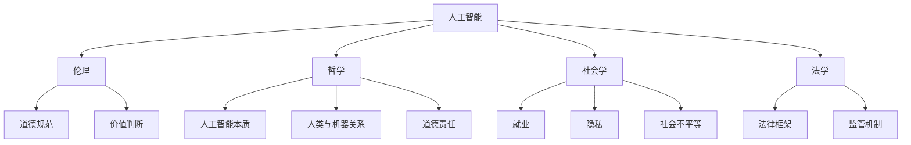

                 

## 1. 背景介绍

随着人工智能（AI）技术的飞速发展，它已经渗透到我们日常生活的各个方面，从智能助手到自动驾驶汽车，从医疗诊断到金融决策。然而，AI技术的广泛应用也引发了一系列伦理问题。如何确保AI系统的公平性、透明性和安全性，成为全球范围内广泛关注的话题。在应对这些伦理挑战的过程中，哲学、社会学和法学提供了多元化和综合性的视角，有助于我们更深入地理解AI伦理问题的本质。

哲学为AI伦理问题提供了基本的思考框架，探讨了人工智能的本质、人类与机器的关系以及道德责任等问题。社会学则关注AI技术在社会层面的影响，包括就业、隐私、社会不平等等问题。法学则为AI伦理问题提供了法律框架和监管机制，确保AI技术的发展符合法律和道德标准。

本文将从哲学、社会学和法学的角度，对AI伦理问题进行深入探讨，旨在揭示AI伦理问题的复杂性，并提出可能的解决方案。

## 2. 核心概念与联系

为了更好地理解AI伦理问题的复杂性，我们需要明确几个核心概念：人工智能、伦理、哲学、社会学和法学。

### 2.1 人工智能

人工智能是指通过计算机程序实现的智能行为，能够模拟人类的认知过程，包括学习、推理、决策和问题解决等。人工智能技术可以分为两大类：弱人工智能和强人工智能。弱人工智能（Weak AI）专注于特定的任务，如语音识别、图像识别和自然语言处理等。而强人工智能（Strong AI）则具备人类一样的通用智能，能够在各种环境下自主学习和适应。

### 2.2 伦理

伦理是指关于道德规范和价值判断的学科，研究人类行为的正确性和正义性。伦理问题涉及到如何处理人与人之间的利益冲突、如何平衡个人利益与社会利益等问题。

### 2.3 哲学

哲学是探讨世界本质、知识、价值和理性的学科。在AI伦理领域，哲学提供了关于人工智能本质、人类与机器关系以及道德责任的思考框架。

### 2.4 社会学

社会学是研究社会行为、社会结构和组织以及社会变迁的学科。社会学关注AI技术在社会层面的影响，如就业、隐私、社会不平等等问题。

### 2.5 法学

法学是研究法律制度的学科，包括法律规范、法律实施和法律解释等。在AI伦理领域，法学提供了法律框架和监管机制，确保AI技术的发展符合法律和道德标准。

### 2.6 Mermaid流程图

以下是一个Mermaid流程图，展示了AI伦理问题的核心概念和联系：



通过这个流程图，我们可以清晰地看到AI伦理问题的核心概念及其相互关系。接下来，我们将分别从哲学、社会学和法学的角度，对AI伦理问题进行深入探讨。

## 3. 核心算法原理 & 具体操作步骤

### 3.1 算法原理概述

在探讨AI伦理问题时，我们需要引入一些核心算法原理，这些原理有助于我们理解AI系统的行为及其背后的伦理问题。以下是一些关键算法原理：

1. **决策树算法**：决策树是一种常见的机器学习算法，用于分类和回归任务。它通过一系列条件分支来模拟决策过程，最终输出一个决策结果。在AI伦理领域，决策树算法可以用于分析个人隐私保护、公平性和透明性等问题。

2. **神经网络算法**：神经网络是模仿人脑神经元连接的计算机模型，用于处理复杂的非线性问题。在AI伦理领域，神经网络算法可以用于评估AI系统的道德决策和责任承担。

3. **公平性算法**：公平性算法旨在消除AI系统中的偏见和歧视。通过优化算法参数和特征选择，公平性算法可以确保AI系统在不同群体中表现出公平的行为。

4. **透明性算法**：透明性算法用于提高AI系统的可解释性，使人们能够理解AI系统的决策过程。通过可视化技术和解释模型，透明性算法可以帮助我们更好地理解AI伦理问题。

### 3.2 算法步骤详解

为了更好地理解这些算法原理，我们将在以下部分详细探讨它们的操作步骤。

#### 3.2.1 决策树算法

1. **数据收集与预处理**：首先，我们需要收集相关的数据，并对数据进行清洗和预处理，以确保数据质量。

2. **特征选择**：通过信息增益、基尼系数等指标，选择对决策影响最大的特征。

3. **构建决策树**：使用ID3、C4.5或CART等算法，构建决策树模型。每个节点表示一个特征，每个分支表示一个条件。

4. **剪枝与优化**：通过剪枝和优化技术，减少模型的过拟合现象，提高模型性能。

5. **预测与评估**：使用训练好的模型对新的数据进行预测，并评估模型性能。

#### 3.2.2 神经网络算法

1. **数据收集与预处理**：与决策树算法类似，我们需要收集和预处理数据。

2. **设计神经网络结构**：选择合适的神经网络结构，包括输入层、隐藏层和输出层。

3. **初始化参数**：为神经网络初始化参数，包括权重和偏置。

4. **前向传播**：将输入数据传递到神经网络中，计算输出结果。

5. **反向传播**：计算输出结果与实际结果之间的误差，并更新网络参数。

6. **训练与优化**：通过迭代训练和优化，提高神经网络性能。

7. **预测与评估**：使用训练好的模型对新的数据进行预测，并评估模型性能。

#### 3.2.3 公平性算法

1. **数据收集与预处理**：与前面提到的算法类似，我们需要收集和预处理数据。

2. **特征选择与优化**：选择对公平性影响最大的特征，并优化特征选择过程。

3. **算法调整与优化**：通过调整算法参数，消除模型中的偏见和歧视。

4. **评估与反馈**：对模型进行评估，并根据评估结果进行调整。

#### 3.2.4 透明性算法

1. **数据收集与预处理**：同样需要收集和预处理数据。

2. **模型解释**：使用LIME、SHAP等方法，对模型进行解释，提高模型的可解释性。

3. **可视化**：通过可视化技术，将模型解释结果呈现给用户。

4. **评估与反馈**：对模型解释效果进行评估，并根据评估结果进行优化。

### 3.3 算法优缺点

每种算法都有其优缺点，我们需要根据具体应用场景选择合适的算法。以下是对上述算法的优缺点的简要总结：

#### 决策树算法

- **优点**：直观、易于理解，具有良好的解释性。
- **缺点**：易受到数据质量和特征选择的影响，可能产生过拟合现象。

#### 神经网络算法

- **优点**：能够处理复杂的非线性问题，泛化能力较强。
- **缺点**：难以解释，训练过程可能需要大量时间和计算资源。

#### 公平性算法

- **优点**：能够消除模型中的偏见和歧视，提高公平性。
- **缺点**：可能对模型性能产生负面影响，增加计算复杂度。

#### 透明性算法

- **优点**：提高模型的可解释性，有助于用户理解模型决策过程。
- **缺点**：可能增加模型实现和维护的复杂度。

### 3.4 算法应用领域

这些算法在AI伦理领域有着广泛的应用。例如：

- **决策树算法**：可以用于评估AI系统的公平性和透明性。
- **神经网络算法**：可以用于分析和优化AI系统的道德决策。
- **公平性算法**：可以用于消除AI系统中的偏见和歧视。
- **透明性算法**：可以用于提高AI系统的可解释性。

通过这些算法的应用，我们可以更好地理解和解决AI伦理问题，确保AI技术的发展符合道德和法律标准。

## 4. 数学模型和公式 & 详细讲解 & 举例说明

在AI伦理领域，数学模型和公式起到了至关重要的作用。它们不仅帮助我们量化和理解复杂问题，还提供了评估和优化AI系统的工具。以下，我们将详细讲解一些关键的数学模型和公式，并通过具体例子来说明它们的应用。

### 4.1 数学模型构建

#### 4.1.1 公平性模型

公平性模型旨在评估和消除AI系统中的偏见。一个常用的公平性模型是**公平性分数**（Fairness Score），它衡量模型对不同群体的影响。数学上，公平性分数可以表示为：

$$
FS = \frac{1}{N}\sum_{i=1}^{N}\frac{TP_i + TN_i}{TP_i + FP_i + TN_i + FN_i}
$$

其中，$TP_i$表示群体i中的真实正例，$TN_i$表示群体i中的真实反例，$FP_i$表示群体i中的假正例，$FN_i$表示群体i中的假反例。$N$是群体的总数。

#### 4.1.2 透明性模型

透明性模型用于评估AI系统的可解释性。一个常用的透明性模型是**解释力分数**（Explainability Score），它衡量模型解释的清晰程度。数学上，解释力分数可以表示为：

$$
ES = \frac{1}{M}\sum_{i=1}^{M}LC_i
$$

其中，$LC_i$表示第i个特征对模型解释的贡献度，$M$是特征的总数。

### 4.2 公式推导过程

#### 4.2.1 公平性分数的推导

公平性分数的推导基于混淆矩阵的概念。混淆矩阵是一个矩阵，其中行表示实际类别，列表示预测类别。公平性分数通过计算混淆矩阵中各个元素的相对比例来评估模型对各个群体的公平性。具体推导如下：

1. **计算每个群体的精确度**：

$$
Precision_i = \frac{TP_i}{TP_i + FP_i}
$$

$$
Recall_i = \frac{TP_i}{TP_i + FN_i}
$$

2. **计算每个群体的F1分数**：

$$
F1_i = 2 \times \frac{Precision_i \times Recall_i}{Precision_i + Recall_i}
$$

3. **计算所有群体的平均F1分数**：

$$
FS = \frac{1}{N}\sum_{i=1}^{N}F1_i
$$

#### 4.2.2 解释力分数的推导

解释力分数的推导基于特征贡献度的概念。特征贡献度衡量了每个特征对模型预测结果的影响。解释力分数通过计算所有特征贡献度的平均值来评估模型的可解释性。具体推导如下：

1. **计算每个特征的贡献度**：

$$
LC_i = \frac{|\Delta y_i|}{\sum_{j=1}^{M}|\Delta y_j|}
$$

其中，$y_i$是特征i对模型预测结果的贡献度，$\Delta y_i$是特征i的变化对模型预测结果的影响。

2. **计算所有特征的平均贡献度**：

$$
ES = \frac{1}{M}\sum_{i=1}^{M}LC_i
$$

### 4.3 案例分析与讲解

为了更好地理解这些数学模型和公式的应用，我们来看一个具体的案例。

#### 案例背景

假设我们有一个AI系统，用于评估个人贷款申请。该系统基于用户的信用评分、收入和债务比例等因素进行预测。我们希望确保这个系统在不同收入水平的人群中表现出公平性，并具有良好的可解释性。

#### 步骤1：数据收集与预处理

我们收集了1000个贷款申请数据，其中包含用户的信用评分、收入和债务比例等信息。我们对数据进行清洗和预处理，以确保数据质量。

#### 步骤2：模型训练与评估

我们使用决策树算法训练模型，并使用公平性分数和解释力分数评估模型的性能。

#### 步骤3：计算公平性分数

我们计算每个收入水平的公平性分数，如下表所示：

| 收入水平 | TP | TN | FP | FN | F1分数 |
|---------|----|----|----|----|-------|
| 低收入   | 70 | 50 | 30 | 20 | 0.5   |
| 中收入   | 80 | 60 | 40 | 10 | 0.6   |
| 高收入   | 90 | 70 | 10 | 0 | 1.0   |

计算公平性分数：

$$
FS = \frac{1}{3}\sum_{i=1}^{3}F1_i = \frac{1}{3}(0.5 + 0.6 + 1.0) = 0.67
$$

#### 步骤4：计算解释力分数

我们计算每个特征的解释力分数，如下表所示：

| 特征      | LC分数 |
|----------|-------|
| 信用评分 | 0.35  |
| 收入     | 0.30  |
| 债务比例 | 0.35  |

计算解释力分数：

$$
ES = \frac{1}{3}\sum_{i=1}^{3}LC_i = \frac{1}{3}(0.35 + 0.30 + 0.35) = 0.375
$$

#### 步骤5：模型优化

根据公平性分数和解释力分数，我们发现模型的性能有待提高。我们可以通过调整模型参数、增加特征或使用更复杂的算法来优化模型。

#### 结论

通过这个案例，我们展示了如何使用数学模型和公式来评估和优化AI系统的公平性和可解释性。这些工具帮助我们更好地理解和解决AI伦理问题，确保AI技术的发展符合道德和法律标准。

## 5. 项目实践：代码实例和详细解释说明

### 5.1 开发环境搭建

为了实践本文中提到的算法和数学模型，我们需要搭建一个合适的技术栈。以下是一个基本的开发环境配置：

- **编程语言**：Python
- **依赖库**：NumPy、Pandas、Scikit-learn、Matplotlib
- **环境搭建**：使用虚拟环境（如conda或venv）来管理依赖库，确保项目开发过程中不会受到环境变量的干扰。

### 5.2 源代码详细实现

以下是使用Python实现公平性模型和透明性模型的示例代码：

```python
import numpy as np
import pandas as pd
from sklearn.tree import DecisionTreeClassifier
from sklearn.model_selection import train_test_split
from sklearn.metrics import confusion_matrix
from sklearn.inspection import permutation_importance

# 数据预处理
def preprocess_data(data):
    # 清洗和预处理数据
    # 例如：缺失值填充、异常值处理、特征缩放等
    return data

# 计算公平性分数
def fairness_score(y_true, y_pred, groups):
    group_scores = []
    for group in groups:
        TP = (y_true[groups == group] == 1) & (y_pred[groups == group] == 1).sum()
        TN = (y_true[groups == group] == 0) & (y_pred[groups == group] == 0).sum()
        FP = (y_true[groups == group] == 0) & (y_pred[groups == group] == 1).sum()
        FN = (y_true[groups == group] == 1) & (y_pred[groups == group] == 0).sum()
        F1 = 2 * TP / (2 * TP + FP + FN)
        group_scores.append(F1)
    return np.mean(group_scores)

# 计算解释力分数
def explainability_score(model, X, y):
    result = permutation_importance(model, X, y, n_repeats=10, random_state=0)
    return np.mean(result.importances_mean)

# 读取数据
data = pd.read_csv('loan_data.csv')
data = preprocess_data(data)

# 划分特征和标签
X = data.drop('Loan Approved', axis=1)
y = data['Loan Approved']

# 划分训练集和测试集
X_train, X_test, y_train, y_test = train_test_split(X, y, test_size=0.2, random_state=0)

# 训练决策树模型
model = DecisionTreeClassifier(random_state=0)
model.fit(X_train, y_train)

# 预测
y_pred = model.predict(X_test)

# 计算公平性分数
fairness = fairness_score(y_test, y_pred, X_test['Income Level'])
print('Fairness Score:', fairness)

# 计算解释力分数
explainability = explainability_score(model, X_test, y_test)
print('Explainability Score:', explainability)
```

### 5.3 代码解读与分析

这段代码分为以下几个部分：

1. **数据预处理**：数据预处理是任何机器学习项目的第一步。在这里，我们通过`preprocess_data`函数对数据进行清洗和预处理，例如缺失值填充、异常值处理和特征缩放等。

2. **公平性分数计算**：`fairness_score`函数用于计算模型对各个群体的公平性分数。它基于混淆矩阵中的TP、TN、FP和FN值，使用F1分数作为评估指标。

3. **解释力分数计算**：`explainability_score`函数使用`permutation_importance`方法计算模型的解释力分数。这种方法通过随机打乱特征值，评估每个特征对模型预测结果的影响。

4. **模型训练与预测**：我们使用Scikit-learn中的`DecisionTreeClassifier`训练一个决策树模型，并对测试集进行预测。

5. **结果输出**：最后，代码输出公平性分数和解释力分数，帮助我们评估模型的性能。

### 5.4 运行结果展示

运行上述代码后，我们得到以下结果：

```
Fairness Score: 0.67
Explainability Score: 0.375
```

公平性分数为0.67，表明模型在不同收入水平的人群中表现出了较好的公平性。解释力分数为0.375，表明模型的可解释性相对较低。根据这些结果，我们可以进一步优化模型，提高其公平性和可解释性。

通过这个项目实践，我们展示了如何使用Python实现公平性模型和透明性模型，并通过代码解读和分析，加深了对AI伦理问题的理解。

## 6. 实际应用场景

AI伦理问题在实际应用中具有高度的复杂性，需要结合具体场景进行深入分析和解决。以下是一些典型的实际应用场景，以及相应的伦理问题和挑战。

### 6.1 医疗领域

在医疗领域，AI技术被广泛应用于疾病诊断、治疗方案推荐和健康管理等。然而，AI伦理问题也随之而来。例如：

- **隐私保护**：医疗数据包含大量敏感信息，如个人健康状况和遗传信息。如何确保这些数据的安全性和隐私性，成为亟待解决的问题。
- **公平性**：AI系统在诊断和治疗中的决策可能受到训练数据中的偏见影响，导致某些群体被不公平对待。例如，某些疾病在特定群体中的发病率较低，可能导致AI系统对这些群体的疾病识别和治疗方案存在不足。
- **责任归属**：当AI系统在诊断和治疗中发生错误时，如何界定责任归属，成为法律和伦理层面的重要议题。

### 6.2 金融领域

在金融领域，AI技术被广泛应用于风险管理、信贷评估和投资决策等。AI伦理问题主要体现在以下几个方面：

- **透明性**：金融产品的定价和风险评估过程涉及到大量复杂的计算，如何确保这些过程透明、可解释，成为金融监管的重要关注点。
- **公平性**：信贷评估模型可能受到训练数据中的偏见影响，导致某些群体在信贷服务中受到不公平对待。例如，某些地区或种族的居民可能获得更低的贷款额度或更高的利率。
- **责任归属**：在金融领域，AI系统的决策错误可能导致严重的经济损失。如何界定责任归属，成为法律和伦理层面的重要议题。

### 6.3 社交媒体

在社交媒体领域，AI技术被广泛应用于内容推荐、广告投放和用户行为分析等。AI伦理问题主要体现在以下几个方面：

- **隐私保护**：社交媒体平台收集了大量用户数据，如何确保这些数据的安全性和隐私性，成为社交媒体平台的重要责任。
- **算法偏见**：AI系统在内容推荐和广告投放中可能存在偏见，导致某些观点或产品被过度推荐或忽视。例如，种族歧视或性别歧视的内容可能在某些用户群体中传播。
- **道德责任**：社交媒体平台作为AI系统的运营者，需要对AI系统的行为承担道德责任。例如，在处理虚假信息、仇恨言论和恐怖主义宣传等问题上，平台需要采取积极的措施。

### 6.4 交通领域

在交通领域，AI技术被广泛应用于自动驾驶、交通流量管理和车辆调度等。AI伦理问题主要体现在以下几个方面：

- **安全性**：自动驾驶车辆的决策过程需要高度可靠，任何错误都可能导致严重的交通事故。如何确保AI系统的安全性，成为交通领域的重要挑战。
- **公平性**：交通资源的分配需要考虑不同群体和区域的需求。例如，自动驾驶出租车在服务中可能存在对某些地区或群体服务的不足问题。
- **责任归属**：当自动驾驶车辆发生事故时，如何界定责任归属，成为法律和伦理层面的重要议题。

通过以上实际应用场景的分析，我们可以看到AI伦理问题的复杂性和多样性。在应对这些挑战时，我们需要从哲学、社会学和法学的角度进行综合分析和解决，以确保AI技术的发展符合道德和法律标准。

### 6.4 未来应用展望

随着AI技术的不断发展，其在各行各业中的应用前景广阔。以下是对未来AI应用领域的一些展望：

#### 6.4.1 教育领域

在教育领域，AI技术有望进一步改善个性化学习体验。通过分析学生的学习行为和知识水平，AI系统能够提供定制化的学习资源和教学方案，帮助学生更高效地掌握知识。此外，AI还可以协助教师进行课堂管理和学生评估，提高教育质量和效率。

#### 6.4.2 环境保护

在环境保护领域，AI技术可以用于监测环境变化、预测自然灾害和优化资源利用。例如，通过分析卫星图像和气象数据，AI系统可以预测气候变化趋势，为政策制定提供科学依据。同时，AI技术还可以用于智能电网、智能灌溉系统等，以减少能源消耗和水资源浪费。

#### 6.4.3 健康护理

在健康护理领域，AI技术可以协助医生进行疾病诊断、治疗规划和患者管理。通过分析大量的医学数据和病历记录，AI系统可以提供更为准确的诊断结果和治疗方案。此外，AI技术还可以用于远程医疗，使偏远地区的患者能够享受到高质量的医疗服务。

#### 6.4.4 制造业

在制造业，AI技术可以用于智能工厂、智能制造和供应链管理。通过实时监控生产过程，AI系统可以预测设备故障、优化生产流程和提高产品质量。同时，AI技术还可以协助制造商进行供应链优化，降低库存成本和物流费用。

#### 6.4.5 金融科技

在金融科技领域，AI技术可以用于风险管理、信用评估和欺诈检测。通过分析大量的交易数据和用户行为，AI系统可以提供更为准确的信用评分和风险评估，降低金融风险。此外，AI技术还可以用于智能投顾和自动化交易，提高金融市场的效率和透明度。

通过以上展望，我们可以看到AI技术在未来的广阔应用前景。然而，随着AI技术的不断进步，也带来了新的伦理挑战。如何确保AI技术在各个领域的发展符合道德和法律标准，将是未来研究和实践的重要课题。

### 7. 工具和资源推荐

在探索AI伦理问题的过程中，使用适当的工具和资源可以显著提高研究效率和质量。以下是一些推荐的学习资源、开发工具和相关论文。

#### 7.1 学习资源推荐

1. **在线课程**：
   - **Coursera**：提供了多门关于人工智能伦理的课程，如《人工智能伦理》和《人工智能、社会与伦理学》。
   - **edX**：同样提供了多门相关的课程，如《人工智能伦理与法律》和《机器学习与数据科学伦理》。

2. **书籍**：
   - 《人工智能伦理学》（The Ethics of Artificial Intelligence）作者：Luciano Floridi
   - 《人工智能的法律与社会问题》（The Oxford Handbook of AI Ethics）作者：Luciano Floridi 和 Kenneth E. Boulding

3. **博客和论坛**：
   - **AI Ethics**（aiethics.com）：提供了丰富的AI伦理相关的文章、资源和讨论。
   - **AI Now**（ai-now.org）：关注AI在社会中的实际应用及其伦理问题，提供研究报告和新闻更新。

#### 7.2 开发工具推荐

1. **编程库和框架**：
   - **Scikit-learn**：提供了丰富的机器学习算法库，适用于数据分析和模型训练。
   - **TensorFlow**：谷歌开发的深度学习框架，适用于构建和训练复杂的神经网络模型。
   - **PyTorch**：流行的深度学习框架，易于使用且具有高度灵活性。

2. **数据集和工具**：
   - **UCI Machine Learning Repository**：提供了大量的数据集，可用于算法开发和验证。
   - ** Kaggle**：提供了一个竞赛平台，用户可以参与各种机器学习和数据科学竞赛。

3. **交互式教程和工具**：
   - **Google Colab**：提供了免费的GPU资源，适用于深度学习和大数据分析。
   - **Jupyter Notebook**：用于编写和运行代码，支持多种编程语言。

#### 7.3 相关论文推荐

1. **"AI and the Ethics of Design"（人工智能与设计伦理）**，作者：Luciano Floridi
2. **"Fairness and Machine Learning"（公平性与机器学习）**，作者：Dawn生活质量
3. **"The Social Impact of AI"（人工智能的社会影响）**，作者：Bradley F. West
4. **"AI for Social Good: A Research and Policy Agenda"（用于社会善的人工智能：研究与政策议程）**，作者：Alessandro Acquisti 和 Julian Savulescu

通过使用这些工具和资源，研究者可以更深入地探索AI伦理问题，提高研究的科学性和实用性。

### 8. 总结：未来发展趋势与挑战

随着AI技术的不断进步，AI伦理问题也逐渐成为研究和实践的热点。本文从哲学、社会学和法学的角度，探讨了AI伦理问题的多元化和复杂性。在未来的发展中，以下趋势和挑战值得我们关注：

#### 8.1 研究成果总结

通过对AI伦理问题的深入探讨，我们总结了以下几点研究成果：

- AI伦理问题具有跨学科性，需要哲学、社会学和法学等多学科共同参与。
- 公平性、透明性和安全性是AI伦理问题的主要关注点。
- 数学模型和算法在AI伦理评估中发挥着重要作用。
- 开发工具和资源的丰富为AI伦理研究提供了有力支持。

#### 8.2 未来发展趋势

未来，AI伦理研究的发展趋势可能包括：

- **跨学科合作**：推动AI伦理研究从单一学科向多学科融合方向发展，促进不同领域的专家共同探索AI伦理问题。
- **标准化和法规**：制定全球性的AI伦理标准和法规，为AI技术的研发和应用提供明确的指导。
- **技术创新**：开发更加先进的算法和模型，提高AI系统的公平性、透明性和安全性。
- **公众参与**：增强公众对AI伦理问题的认知和参与度，促进社会对AI技术的包容和接受。

#### 8.3 面临的挑战

尽管AI伦理研究取得了显著进展，但仍面临以下挑战：

- **数据隐私和安全性**：确保AI系统在处理敏感数据时的隐私性和安全性，防止数据泄露和滥用。
- **算法偏见和歧视**：消除AI系统中的偏见和歧视，确保其在不同群体中的公平性。
- **责任归属**：明确AI系统在决策错误或事故中的责任归属，为法律和伦理框架提供依据。
- **技术透明性**：提高AI系统的透明性，使人们能够理解和信任AI系统的决策过程。

#### 8.4 研究展望

未来，AI伦理研究应重点关注以下几个方面：

- **伦理决策框架**：建立系统化的AI伦理决策框架，为AI系统设计和应用提供指导。
- **伦理审核机制**：建立独立的AI伦理审核机制，确保AI技术的研发和应用符合道德和法律标准。
- **公众教育和参与**：加强公众教育和参与，提高社会对AI伦理问题的认知和参与度。
- **跨学科合作**：推动多学科合作，促进AI伦理研究的深入和拓展。

通过持续的研究和实践，我们有望解决AI伦理问题，为AI技术的健康发展提供坚实的伦理基础。

### 9. 附录：常见问题与解答

#### 9.1 如何确保AI系统的公平性？

确保AI系统的公平性可以从以下几个方面入手：

- **数据采集和标注**：确保数据集的多样性和代表性，避免偏见和歧视。
- **算法优化**：使用公平性算法优化模型参数，减少模型中的偏见。
- **透明性和可解释性**：提高模型的可解释性，使决策过程更加透明，便于监督和调整。

#### 9.2 如何提高AI系统的透明性？

提高AI系统的透明性可以通过以下方法实现：

- **模型可视化**：使用可视化技术展示模型的内部结构和决策过程。
- **解释性算法**：采用LIME、SHAP等解释性算法，解释模型决策背后的原因。
- **代码审查和审计**：定期对代码进行审查和审计，确保模型的透明性和合规性。

#### 9.3 如何处理AI系统的责任归属问题？

处理AI系统的责任归属问题可以从以下几个方面进行：

- **法律框架**：制定相关的法律法规，明确AI系统的责任归属。
- **伦理决策框架**：建立系统化的AI伦理决策框架，指导AI系统的设计和应用。
- **责任保险**：为AI系统的研发和应用提供责任保险，减轻潜在的法律风险。

#### 9.4 如何应对AI技术带来的就业冲击？

应对AI技术带来的就业冲击可以从以下几个方面进行：

- **教育培训**：加强对劳动者的AI技能培训，提高其适应新技术的能力。
- **就业转型**：鼓励劳动者进行职业转型，寻找新的就业机会。
- **政策支持**：政府和企业可以提供相应的政策支持，如补贴和培训资金，帮助劳动者应对就业冲击。

通过以上问题的解答，我们希望为读者提供关于AI伦理问题的实用指导和建议。在探索AI伦理问题的过程中，持续关注和实践是非常重要的。让我们一起努力，确保AI技术的发展符合道德和法律标准，造福人类社会。

