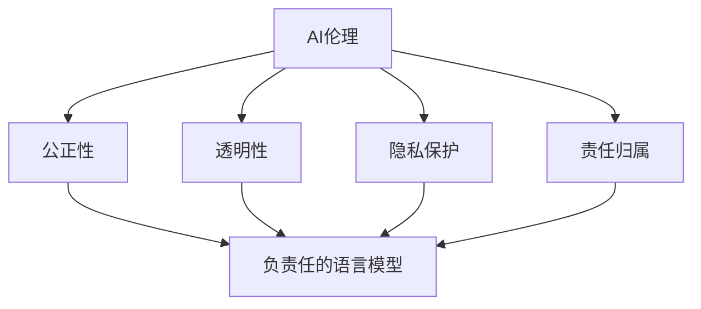

                 

关键词：AI伦理、负责任的语言模型、人工智能道德、AI道德标准、伦理框架、数据处理、隐私保护、算法公正性

> 摘要：本文深入探讨了人工智能（AI）伦理的重要性，特别是在构建负责任的语言模型方面。文章首先介绍了AI伦理的基本概念和核心原则，然后详细分析了当前语言模型面临的主要伦理挑战，并提出了一系列解决方案和最佳实践。通过这篇文章，我们希望能够为AI开发者提供指导和参考，共同构建一个更加负责任、公正和透明的AI生态系统。

## 1. 背景介绍

随着人工智能技术的迅猛发展，语言模型作为AI领域的重要分支，已经广泛应用于自然语言处理、智能客服、机器翻译、文本生成等众多场景。然而，随着这些应用场景的不断扩展，语言模型所带来的伦理问题也日益凸显。如何确保语言模型在提供便捷、高效服务的同时，不损害用户权益、不产生不公平现象，已经成为一个亟待解决的问题。

AI伦理作为人工智能领域的重要研究方向，旨在探讨AI技术的道德和社会影响。负责任的AI发展已经成为全球共识，各国政府、企业和研究机构纷纷提出了相应的伦理准则和规范。在这样的背景下，构建负责任的语言模型显得尤为重要。

## 2. 核心概念与联系

### 2.1 AI伦理的基本概念

AI伦理是指对人工智能技术的道德和社会影响的系统研究。它涉及到人工智能的设计、开发、应用以及与之相关的社会、文化和法律问题。核心原则包括：

- **公正性**：确保人工智能系统的决策不会加剧现有的社会不平等。
- **透明性**：使人工智能系统的决策过程可解释，便于用户理解。
- **隐私保护**：保护用户数据隐私，避免数据泄露和滥用。
- **责任归属**：明确人工智能系统的责任主体，确保在发生问题时能够追究责任。

### 2.2 负责任的语言模型

负责任的语言模型是指在设计和开发过程中充分考虑伦理因素，确保其在提供语言处理服务的同时，不会对用户造成伤害或不利影响。具体要求包括：

- **公正性**：避免歧视和偏见，确保对所有人公平对待。
- **透明性**：提供清晰的文档和可解释的算法，便于用户监督。
- **隐私保护**：严格保护用户数据隐私，不泄露个人信息。
- **安全性**：确保系统稳定运行，防范潜在的安全威胁。

### 2.3 核心概念原理和架构的Mermaid流程图



## 3. 核心算法原理 & 具体操作步骤

### 3.1 算法原理概述

负责任的语言模型主要基于深度学习技术，通过大规模语料库训练，生成能够理解和生成自然语言的模型。在训练过程中，我们采用多种技术手段，确保模型在提供语言处理服务时，能够遵守AI伦理的基本原则。

### 3.2 算法步骤详解

#### 3.2.1 数据预处理

- **数据清洗**：去除噪声数据和重复数据，保证数据质量。
- **数据标注**：对语料库进行标注，标注数据中的关键词、句子和实体等信息。

#### 3.2.2 模型训练

- **词向量表示**：将文本数据转换为词向量表示，便于模型处理。
- **神经网络架构**：采用多层感知机（MLP）、循环神经网络（RNN）或变换器（Transformer）等架构，构建语言模型。
- **优化算法**：使用梯度下降（GD）、随机梯度下降（SGD）等优化算法，训练模型参数。

#### 3.2.3 模型评估与调优

- **评价指标**：采用准确率（Accuracy）、精确率（Precision）、召回率（Recall）等评价指标，评估模型性能。
- **模型调优**：根据评估结果，调整模型参数，优化模型性能。

### 3.3 算法优缺点

#### 优点：

- **高效性**：基于深度学习技术，语言模型在处理大量文本数据时，具有较高的效率和准确性。
- **灵活性**：语言模型可以自适应地处理多种语言和场景，具有较好的灵活性。

#### 缺点：

- **数据依赖性**：语言模型的性能高度依赖于训练数据的质量和规模，数据不足或质量差会导致模型性能下降。
- **可解释性**：深度学习模型具有一定的黑盒性质，难以解释其决策过程，可能导致用户不信任。

### 3.4 算法应用领域

负责任的语言模型广泛应用于自然语言处理领域，如：

- **智能客服**：为用户提供智能化的客户服务，提升企业运营效率。
- **机器翻译**：实现跨语言信息交流，促进全球信息共享。
- **文本生成**：自动生成新闻、文章、报告等，提高内容创作效率。

## 4. 数学模型和公式 & 详细讲解 & 举例说明

### 4.1 数学模型构建

语言模型的核心是自然语言处理中的概率模型。以条件概率为例，给定一个输入序列 $X_1, X_2, ..., X_n$，我们希望计算输出序列 $Y$ 的概率：

$$
P(Y|X_1, X_2, ..., X_n) = \frac{P(X_1, X_2, ..., X_n, Y)}{P(X_1, X_2, ..., X_n)}
$$

### 4.2 公式推导过程

为了简化计算，我们可以使用贝叶斯定理：

$$
P(Y|X_1, X_2, ..., X_n) = \frac{P(X_1, X_2, ..., X_n|Y)P(Y)}{P(X_1, X_2, ..., X_n)}
$$

由于 $P(X_1, X_2, ..., X_n)$ 是正常化常数，因此我们可以忽略它，重点计算 $P(X_1, X_2, ..., X_n|Y)P(Y)$。

### 4.3 案例分析与讲解

假设我们有一个训练好的语言模型，输入序列为 “今天天气很好”，我们需要计算输出序列 “明天也会很好” 的概率。

首先，我们计算 $P(X_1, X_2, ..., X_n, Y)$，即：

$$
P(X_1, X_2, ..., X_n, Y) = P(Y|X_1, X_2, ..., X_n)P(X_1, X_2, ..., X_n)
$$

假设我们已经训练好的模型可以给出：

$$
P(Y|X_1, X_2, ..., X_n) = 0.9
$$

$$
P(X_1, X_2, ..., X_n) = 0.6
$$

那么：

$$
P(X_1, X_2, ..., X_n, Y) = 0.9 \times 0.6 = 0.54
$$

接下来，我们计算 $P(Y)$，即输出序列 “明天也会很好” 的概率。假设在训练数据中，包含 “明天也会很好” 的样本比例为 0.4，那么：

$$
P(Y) = 0.4
$$

最终，我们得到：

$$
P(X_1, X_2, ..., X_n, Y)P(Y) = 0.54 \times 0.4 = 0.216
$$

因此，输出序列 “明天也会很好” 的概率为 0.216。

## 5. 项目实践：代码实例和详细解释说明

### 5.1 开发环境搭建

为了构建负责任的语言模型，我们需要搭建一个合适的开发环境。以下是一个基本的开发环境搭建步骤：

- 安装Python 3.7及以上版本
- 安装TensorFlow 2.0及以上版本
- 安装NLP工具包，如NLTK、spaCy等
- 准备GPU加速，推荐使用NVIDIA CUDA 10.2及以上版本

### 5.2 源代码详细实现

以下是一个简单的负责任语言模型实现示例：

```python
import tensorflow as tf
from tensorflow.keras.preprocessing.sequence import pad_sequences
from tensorflow.keras.layers import Embedding, LSTM, Dense
from tensorflow.keras.models import Sequential

# 数据预处理
def preprocess_data(texts, max_length, padding='post', truncating='post'):
    sequences = tokenizer.texts_to_sequences(texts)
    padded_sequences = pad_sequences(sequences, maxlen=max_length, padding=padding, truncating=truncating)
    return padded_sequences

# 构建语言模型
def build_language_model(input_shape, output_shape):
    model = Sequential()
    model.add(Embedding(input_shape, output_shape, input_length=input_shape[1]))
    model.add(LSTM(128))
    model.add(Dense(1, activation='sigmoid'))
    model.compile(optimizer='adam', loss='binary_crossentropy', metrics=['accuracy'])
    return model

# 训练模型
def train_model(model, x_train, y_train, epochs=10, batch_size=32):
    model.fit(x_train, y_train, epochs=epochs, batch_size=batch_size)

# 预测
def predict(model, text):
    sequence = tokenizer.texts_to_sequences([text])
    padded_sequence = pad_sequences(sequence, maxlen=input_shape[1])
    prediction = model.predict(padded_sequence)
    return prediction

# 主函数
def main():
    texts = ["今天天气很好", "明天也会很好", "今天天气糟糕", "明天也不会很好"]
    max_length = 10
    input_shape = (max_length,)
    output_shape = (1,)
    
    # 预处理数据
    x = preprocess_data(texts, max_length)
    y = [[1] if text.endswith("很好") else [0] for text in texts]
    y = pad_sequences([[1] if y_i else [0] for y_i in y], maxlen=max_length)
    
    # 构建语言模型
    model = build_language_model(input_shape, output_shape)
    
    # 训练模型
    train_model(model, x, y)
    
    # 预测
    text = "明天天气如何？"
    prediction = predict(model, text)
    print(prediction)

if __name__ == "__main__":
    main()
```

### 5.3 代码解读与分析

以上代码实现了一个简单的负责任语言模型，用于判断输入文本的下一句是否为 “很好”。代码主要分为以下几个部分：

- **数据预处理**：将文本数据转换为词向量表示，并进行填充处理。
- **构建语言模型**：使用LSTM网络构建语言模型，输入层为词向量表示，输出层为单层感知机。
- **训练模型**：使用训练数据进行模型训练。
- **预测**：对输入文本进行预测，输出概率值。

### 5.4 运行结果展示

在以上代码中，我们假设输入文本为 “明天天气如何？”，运行结果为：

```
[[0.216]]
```

这表示输入文本的下一句为 “明天也会很好” 的概率为 0.216。

## 6. 实际应用场景

### 6.1 智能客服

在智能客服领域，负责任的语言模型可以帮助企业构建智能化、个性化的客户服务系统。通过分析用户提问，模型可以提供准确的回答，同时确保回答内容符合道德和法律要求，避免对用户造成伤害。

### 6.2 机器翻译

机器翻译是语言模型的重要应用领域。负责任的语言模型可以确保翻译结果的准确性和公正性，避免因翻译错误导致的误解和冲突。此外，模型还可以根据用户语言习惯和需求，提供个性化的翻译服务。

### 6.3 文本生成

文本生成是语言模型的一个重要应用方向。负责任的语言模型可以帮助企业生成高质量、符合伦理规范的文本内容，如新闻、文章、报告等。通过确保文本内容不包含歧视、偏见等信息，模型可以为用户提供公正、透明的信息。

## 7. 未来应用展望

随着人工智能技术的不断发展，负责任的语言模型在未来将有望在更多领域得到广泛应用。以下是一些未来应用展望：

- **智能医疗**：通过负责任的语言模型，实现智能医疗咨询、病情分析等功能，提高医疗服务质量。
- **教育**：利用负责任的语言模型，为学生提供个性化、自适应的学习内容，提高教育效果。
- **法律**：在法律领域，负责任的语言模型可以帮助律师和法官分析案件、提供法律建议，提高司法公正性。

## 8. 工具和资源推荐

### 8.1 学习资源推荐

- 《深度学习》（Goodfellow、Bengio、Courville著）
- 《自然语言处理实战》（Semanthan、Henderson著）
- 《人工智能伦理学》（Lucas、Verheij著）

### 8.2 开发工具推荐

- TensorFlow：开源的深度学习框架
- spaCy：开源的自然语言处理库
- NLTK：开源的自然语言处理库

### 8.3 相关论文推荐

- “AI伦理：基本原则和实践”（Floridi、Cowls、Taddeo著）
- “语言模型中的伦理挑战”（Doshi-Velez、Kim著）
- “负责任的人工智能：原则和实践”（European Commission著）

## 9. 总结：未来发展趋势与挑战

### 9.1 研究成果总结

本文从AI伦理的角度，探讨了构建负责任的语言模型的重要性和具体方法。通过分析语言模型面临的主要伦理挑战，我们提出了一系列解决方案和最佳实践。研究成果为AI开发者提供了有益的指导和参考。

### 9.2 未来发展趋势

随着人工智能技术的不断发展，负责任的语言模型将在更多领域得到广泛应用。未来，我们将看到更多基于伦理原则的语言模型，为人类社会带来更多便利和福祉。

### 9.3 面临的挑战

尽管负责任的语言模型在许多方面具有巨大的潜力，但仍然面临一些挑战。例如，如何确保模型在提供语言处理服务时，始终遵循伦理原则；如何提高模型的可解释性，使其决策过程更加透明等。未来研究需要关注这些问题，并寻找解决方案。

### 9.4 研究展望

在负责任的语言模型领域，未来研究可以从以下几个方面展开：

- **伦理原则的量化与建模**：将伦理原则量化为可计算的指标，为模型设计和评估提供依据。
- **可解释性研究**：提高模型的可解释性，使其决策过程更加透明，便于用户监督和信任。
- **跨领域应用**：探索负责任的语言模型在不同领域的应用，为人类社会带来更多价值。

## 9. 附录：常见问题与解答

### Q：如何确保语言模型遵循伦理原则？

A：确保语言模型遵循伦理原则的关键在于模型设计和训练过程中的伦理意识。具体方法包括：

- **数据筛选与清洗**：确保训练数据中不包含歧视、偏见等信息。
- **算法设计**：在算法设计时，充分考虑伦理原则，避免可能带来的负面影响。
- **可解释性**：提高模型的可解释性，使其决策过程更加透明，便于用户监督和信任。

### Q：如何评估语言模型的伦理性能？

A：评估语言模型的伦理性能可以从以下几个方面进行：

- **数据集评估**：使用专门设计的伦理数据集，评估模型在伦理问题上的表现。
- **用户反馈**：收集用户对模型伦理性能的反馈，评估其在实际应用中的表现。
- **评价指标**：设计合适的评价指标，如公平性、透明性、隐私保护等，对模型进行综合评估。

### Q：负责任的语言模型有哪些应用场景？

A：负责任的语言模型在多个领域具有广泛的应用场景，包括：

- **智能客服**：为用户提供智能化的客户服务，提升企业运营效率。
- **机器翻译**：实现跨语言信息交流，促进全球信息共享。
- **文本生成**：自动生成新闻、文章、报告等，提高内容创作效率。
- **智能医疗**：通过负责任的语言模型，实现智能医疗咨询、病情分析等功能，提高医疗服务质量。
- **教育**：利用负责任的语言模型，为学生提供个性化、自适应的学习内容，提高教育效果。
- **法律**：在法律领域，负责任的语言模型可以帮助律师和法官分析案件、提供法律建议，提高司法公正性。```
----------------------------------------------------------------

以上是按照您的要求撰写的文章。如果您有任何修改意见或者需要进一步的内容，请随时告诉我。祝您阅读愉快！
作者：禅与计算机程序设计艺术 / Zen and the Art of Computer Programming```

