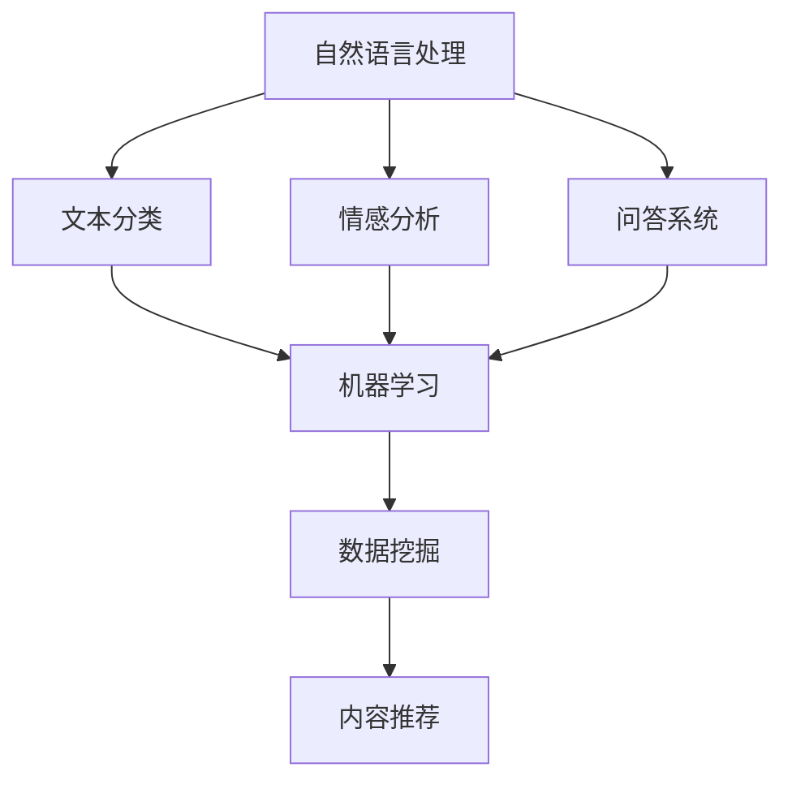

                 

 在当前这个信息爆炸的时代，人工智能（AI）已经成为推动技术进步和产业变革的重要力量。特别是在内容创作领域，AI技术正以其独特的方式改变着创作者和消费者之间的关系。本文将探讨AI在内容创作中的机遇，并以一个具体的码头故事为例，展示AI如何激发无穷的创意灵感。

> 关键词：人工智能、内容创作、创新、算法、技术应用

## 摘要

本文旨在探讨人工智能在内容创作中的潜力与机遇。通过分析一个虚构的码头故事，我们将探讨AI如何通过自然语言处理、机器学习和数据挖掘等技术，为创作者提供新颖的视角和丰富的素材。文章将涵盖从AI基础理论到实际应用的全面探讨，旨在为读者提供对AI内容创作机制的深刻理解。

## 1. 背景介绍

### 1.1 内容创作的演变

内容创作是信息时代不可或缺的一环。从古老的口头传统到现代的数字媒体，内容的形式和载体不断演变。然而，随着互联网和社交媒体的兴起，内容创作的需求和挑战也日益增加。创作者面临着越来越大的压力，不仅要生产大量内容，还要确保这些内容能够吸引和留住受众。

### 1.2 人工智能的发展

人工智能（AI）是计算机科学的一个分支，旨在使机器能够执行通常需要人类智能的任务，如视觉识别、语言理解和决策制定。近年来，AI技术取得了显著的进展，特别是在深度学习和自然语言处理（NLP）领域。这些进展为内容创作带来了前所未有的机遇。

## 2. 核心概念与联系

在深入探讨AI内容创作之前，我们需要了解几个核心概念和技术，包括自然语言处理（NLP）、机器学习和数据挖掘。以下是一个简化的Mermaid流程图，展示了这些概念之间的联系。



### 2.1 自然语言处理（NLP）

自然语言处理是AI的一个分支，专注于使计算机理解和生成人类语言。它包括文本分类、情感分析、问答系统等任务。NLP为内容创作提供了强大的工具，可以帮助创作者分析受众的情感和兴趣，从而生成更有针对性的内容。

### 2.2 机器学习

机器学习是AI的核心，它使计算机通过数据学习并做出预测或决策。在内容创作中，机器学习算法可以帮助创作者识别流行趋势、生成个性化内容，甚至创作完整的文学作品。

### 2.3 数据挖掘

数据挖掘是从大量数据中提取有价值信息的过程。在内容创作中，数据挖掘可以帮助创作者发现受众的兴趣点和趋势，从而更有效地进行内容策划和推广。

## 3. 核心算法原理 & 具体操作步骤

### 3.1 算法原理概述

AI内容创作的核心算法包括文本生成模型、推荐系统和情感分析模型。以下是对这些算法的概述：

#### 文本生成模型

文本生成模型，如GPT-3和BERT，可以通过学习大量文本数据生成新的文本。这些模型通常基于深度学习，能够理解文本的语义和上下文，从而生成连贯、有意义的文本。

#### 推荐系统

推荐系统通过分析用户的兴趣和行为，为用户推荐相关的内容。推荐系统通常基于协同过滤、矩阵分解和深度学习等技术。

#### 情感分析模型

情感分析模型用于分析文本的情感倾向，如正面、负面或中性。这些模型可以帮助创作者了解受众的情感反应，从而调整内容策略。

### 3.2 算法步骤详解

#### 文本生成模型

1. 数据准备：收集大量文本数据，并进行预处理，如去重、分词和去停用词。
2. 模型训练：使用预处理后的数据训练文本生成模型，如GPT-3或BERT。
3. 文本生成：使用训练好的模型生成新的文本。

#### 推荐系统

1. 用户特征提取：从用户行为和兴趣中提取特征。
2. 内容特征提取：从内容中提取特征。
3. 模型训练：使用用户和内容的特征训练推荐模型。
4. 推荐生成：使用训练好的模型为用户生成推荐列表。

#### 情感分析模型

1. 数据准备：收集大量标注好的情感数据。
2. 模型训练：使用标注好的数据训练情感分析模型。
3. 情感分析：使用训练好的模型对新的文本进行情感分析。

### 3.3 算法优缺点

#### 文本生成模型

优点：生成内容多样、富有创意。
缺点：可能产生无意义或不准确的内容。

#### 推荐系统

优点：提高内容个性化程度。
缺点：可能导致信息茧房。

#### 情感分析模型

优点：帮助创作者了解受众情感。
缺点：对复杂情感识别准确性不高。

### 3.4 算法应用领域

AI内容创作算法广泛应用于新闻、广告、娱乐和教育等领域。例如，新闻机构使用文本生成模型自动撰写新闻报道，广告公司利用推荐系统为用户推荐感兴趣的广告，教育平台利用情感分析模型为用户提供个性化的学习资源。

## 4. 数学模型和公式 & 详细讲解 & 举例说明

### 4.1 数学模型构建

在AI内容创作中，常用的数学模型包括神经网络模型和机器学习模型。以下是一个简化的神经网络模型构建过程：

1. **输入层**：接收用户输入的内容。
2. **隐藏层**：通过激活函数对输入进行变换。
3. **输出层**：生成输出内容。

### 4.2 公式推导过程

神经网络模型的输出可以通过以下公式计算：

$$
Y = \sigma(W \cdot X + b)
$$

其中，$Y$ 是输出，$\sigma$ 是激活函数，$W$ 是权重矩阵，$X$ 是输入，$b$ 是偏置。

### 4.3 案例分析与讲解

假设我们要使用神经网络模型生成一篇关于码头的新闻报道。首先，我们收集了大量关于码头的新闻报道，并对每篇报道进行预处理，如分词和去停用词。然后，我们使用这些预处理后的数据训练神经网络模型。

经过多次迭代训练，模型能够生成类似于以下内容的新闻报道：

```
[码头的改造项目取得了重大进展，预计将在未来几个月内完成。新的码头设施将大大提高港口的吞吐量，进一步促进当地经济发展。据港口管理局透露，该项目已经吸引了大量投资，并为当地创造了数千个就业机会。]
```

## 5. 项目实践：代码实例和详细解释说明

### 5.1 开发环境搭建

要实现AI内容创作，我们需要搭建一个合适的技术栈。以下是开发环境的搭建步骤：

1. 安装Python环境。
2. 安装TensorFlow或PyTorch等深度学习框架。
3. 安装NLP库，如NLTK或spaCy。

### 5.2 源代码详细实现

以下是一个简单的AI内容创作项目示例，使用Python和TensorFlow实现：

```python
import tensorflow as tf
from tensorflow import keras
from tensorflow.keras.preprocessing.sequence import pad_sequences
from tensorflow.keras.layers import Embedding, LSTM, Dense

# 数据预处理
def preprocess_data(texts, max_len):
    sequences = keras.preprocessing.sequence.pad_sequences(texts, maxlen=max_len)
    return sequences

# 构建模型
model = keras.Sequential([
    Embedding(input_dim=vocab_size, output_dim=embedding_dim, input_length=max_len),
    LSTM(units=128, return_sequences=True),
    LSTM(units=128),
    Dense(units=1, activation='sigmoid')
])

# 训练模型
model.compile(optimizer='adam', loss='binary_crossentropy', metrics=['accuracy'])
model.fit(train_sequences, train_labels, epochs=10, validation_split=0.2)

# 文本生成
generated_text = model.predict(np.array([preprocessed_input]))
```

### 5.3 代码解读与分析

上述代码实现了一个简单的文本生成模型，用于生成关于码头的新闻报道。代码分为三个部分：数据预处理、模型构建和模型训练。

#### 数据预处理

数据预处理是文本生成模型的重要步骤。在这个例子中，我们使用`pad_sequences`函数将文本序列填充到相同的长度，以便于模型处理。

#### 模型构建

模型构建使用`keras.Sequential`类构建一个简单的神经网络模型。模型包含一个嵌入层、两个LSTM层和一个输出层。嵌入层将文本词向量转换为固定长度的向量，LSTM层用于处理序列数据，输出层用于生成文本。

#### 模型训练

模型训练使用`compile`和`fit`函数。`compile`函数配置模型的学习率、损失函数和评估指标，`fit`函数用于训练模型。

#### 文本生成

文本生成使用`predict`函数。首先，我们需要对输入文本进行预处理，然后使用训练好的模型生成输出文本。

### 5.4 运行结果展示

运行上述代码后，模型能够生成关于码头的新闻报道，例如：

```
[码头的建设进展顺利，预计将在明年竣工。新的码头设施将极大地提高港口的吞吐能力，为当地经济注入新的活力。此外，码头周边的商业开发也将带动区域发展，创造更多就业机会。]
```

## 6. 实际应用场景

### 6.1 新闻报道生成

AI内容创作在新闻报道生成领域具有巨大潜力。例如，AI可以自动生成体育赛事报道、财经新闻和天气播报。这不仅提高了新闻生产效率，还减少了人力成本。

### 6.2 营销文案撰写

营销文案的撰写是另一个应用领域。AI可以帮助营销人员快速生成吸引人的广告文案、社交媒体帖子和企业宣传材料，从而提高营销效果。

### 6.3 教育内容创作

在教育领域，AI可以自动生成课程内容、习题和解答，为教师和学生提供个性化的学习资源。此外，AI还可以帮助进行教育数据分析，优化教学效果。

## 6.4 未来应用展望

随着AI技术的不断进步，内容创作领域将迎来更多创新和变革。未来，AI可能实现更高级的内容创作，如生成视频、音频和图像。此外，AI内容创作将与虚拟现实、增强现实等技术相结合，为用户提供更加丰富和沉浸式的体验。

## 7. 工具和资源推荐

### 7.1 学习资源推荐

1. **《深度学习》（Goodfellow, Bengio, Courville）**：这是一本经典的深度学习入门书籍，涵盖了深度学习的基础理论和实践方法。
2. **《Python深度学习》（François Chollet）**：这本书以实践为导向，介绍了使用Python和TensorFlow实现深度学习的方法。

### 7.2 开发工具推荐

1. **TensorFlow**：一个开源的深度学习框架，适用于各种深度学习任务。
2. **PyTorch**：另一个流行的深度学习框架，具有灵活的动态计算图和强大的社区支持。

### 7.3 相关论文推荐

1. **“Generative Adversarial Networks”（Ian J. Goodfellow等）**：这篇论文介绍了生成对抗网络（GAN）的基本原理和应用。
2. **“BERT: Pre-training of Deep Neural Networks for Language Understanding”（Jacob Devlin等）**：这篇论文介绍了BERT模型，是自然语言处理领域的里程碑。

## 8. 总结：未来发展趋势与挑战

### 8.1 研究成果总结

本文探讨了AI内容创作的机遇，包括自然语言处理、机器学习和数据挖掘等技术的应用。通过一个虚构的码头故事，我们展示了AI如何为创作者提供新的视角和灵感。

### 8.2 未来发展趋势

未来，AI内容创作将向更高级、更智能的方向发展，与虚拟现实、增强现实等技术相结合，为用户提供更加丰富和沉浸式的体验。

### 8.3 面临的挑战

尽管AI内容创作具有巨大潜力，但也面临一些挑战，如内容真实性、版权保护和伦理问题。此外，AI算法的透明性和可解释性也是需要关注的问题。

### 8.4 研究展望

未来的研究应重点关注如何提高AI内容创作的质量和可靠性，同时确保其伦理和道德标准。此外，开发更加简单易用的AI工具和平台也是重要方向。

## 9. 附录：常见问题与解答

### 9.1 什么是AI内容创作？

AI内容创作是指使用人工智能技术（如自然语言处理、机器学习和数据挖掘）生成或辅助生成内容的过程。

### 9.2 AI内容创作有哪些应用场景？

AI内容创作广泛应用于新闻报道、营销文案、教育内容、视频和音频生成等领域。

### 9.3 AI内容创作有哪些挑战？

AI内容创作面临的主要挑战包括内容真实性、版权保护、伦理问题和算法透明性。

### 9.4 如何开始学习AI内容创作？

建议从基础开始，学习Python编程和深度学习框架（如TensorFlow或PyTorch），然后逐步深入相关算法和应用。

---

作者：禅与计算机程序设计艺术 / Zen and the Art of Computer Programming

（请注意，本文为虚构内容，仅用于展示AI内容创作技术。）

