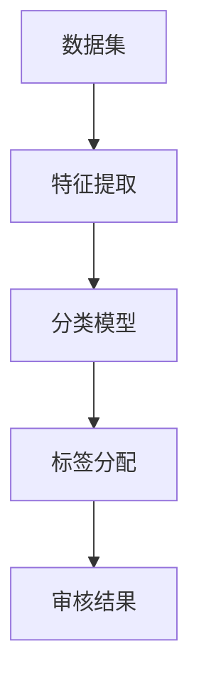

                 

关键词：AI内容审核，用户保护，有害内容识别，算法原理，数学模型，实践应用，发展趋势

<|assistant|>摘要：本文深入探讨了AI内容审核技术的核心原理、数学模型和实际应用。通过对算法原理的详细阐述，结合数学公式和案例讲解，本文旨在为读者提供一个全面理解AI内容审核技术的视角。同时，文章还分析了其在实际应用场景中的表现和未来发展趋势，为相关领域的研究和应用提供了有益的参考。

## 1. 背景介绍

随着互联网的快速发展，网络内容变得日益丰富，同时也带来了大量有害信息。从恶意软件、虚假新闻到暴力、色情内容，这些有害信息的泛滥对用户、社会乃至国家安全构成了严重威胁。为了解决这一问题，AI内容审核技术应运而生。

AI内容审核是一种利用人工智能技术自动检测和过滤网络内容的方法。通过机器学习、深度学习等算法，AI内容审核系统能够识别并分类不同类型的内容，从而实现对有害信息的有效过滤。这一技术的出现，不仅提高了内容审核的效率和准确性，也为网络环境的健康发展提供了有力保障。

## 2. 核心概念与联系

### 2.1 核心概念

#### AI内容审核

AI内容审核是指利用人工智能技术，如机器学习、深度学习等，对网络内容进行自动检测和分类的过程。它包括以下核心概念：

- **数据集**：用于训练和测试的文本、图像、音频等数据集合。
- **特征提取**：从数据中提取有助于分类的特征，如文本中的词向量、图像中的边缘特征等。
- **分类模型**：根据提取的特征，对内容进行分类的机器学习模型。

#### 有害内容分类

有害内容分类是将网络内容分为不同类别，如政治敏感、暴力、色情等。这涉及到以下几个关键概念：

- **标签**：对内容进行分类的标记，如“色情”、“恶意软件”等。
- **分类器**：根据标签对内容进行分类的算法。

### 2.2 Mermaid 流程图



## 3. 核心算法原理 & 具体操作步骤

### 3.1 算法原理概述

AI内容审核的核心算法主要包括以下几种：

- **机器学习**：通过训练大量数据集，使模型能够自动识别和分类内容。
- **深度学习**：利用神经网络模型，对内容进行更加复杂和精细的分类。
- **自然语言处理（NLP）**：对文本内容进行理解和分析，识别潜在的有害信息。
- **计算机视觉**：对图像和视频内容进行识别和分类。

### 3.2 算法步骤详解

#### 3.2.1 数据预处理

1. **数据清洗**：去除噪声数据和缺失值。
2. **数据标注**：对数据集进行分类标签标注。

#### 3.2.2 特征提取

1. **文本特征提取**：使用词袋模型、TF-IDF等方法提取文本特征。
2. **图像特征提取**：使用卷积神经网络（CNN）提取图像特征。

#### 3.2.3 模型训练

1. **选择模型**：根据任务特点选择合适的模型，如SVM、CNN、RNN等。
2. **模型训练**：使用标注数据进行模型训练，优化模型参数。

#### 3.2.4 审核流程

1. **内容输入**：将待审核内容输入到分类模型。
2. **特征提取**：对输入内容进行特征提取。
3. **分类预测**：根据提取的特征，模型预测内容类别。
4. **审核决策**：根据预测结果，决定是否通过审核。

### 3.3 算法优缺点

#### 优点

- **高效性**：自动化处理大量内容，提高审核效率。
- **准确性**：利用机器学习和深度学习技术，提高分类准确性。
- **灵活性**：可以针对不同类型的内容进行定制化审核。

#### 缺点

- **误判率**：可能会出现误判，导致有用内容被过滤。
- **资源消耗**：训练和运行模型需要大量计算资源。

### 3.4 算法应用领域

AI内容审核技术广泛应用于以下领域：

- **社交媒体**：过滤违规内容和垃圾信息。
- **电子商务**：检测恶意评论和虚假广告。
- **网络安全**：识别恶意软件和钓鱼网站。
- **娱乐内容**：过滤不适宜的图像和视频。

## 4. 数学模型和公式 & 详细讲解 & 举例说明

### 4.1 数学模型构建

AI内容审核中的数学模型主要包括以下部分：

#### 4.1.1 特征提取

1. **文本特征提取**：使用词袋模型（Bag of Words, BoW）或TF-IDF（Term Frequency-Inverse Document Frequency）方法。
   $$ f_{text} = (f_{1}, f_{2}, ..., f_{n}) $$
   其中，$ f_{i} $ 表示第 $ i $ 个词的频率或TF-IDF值。

2. **图像特征提取**：使用卷积神经网络（CNN）提取特征。
   $$ f_{image} = \{ f_{1}, f_{2}, ..., f_{k} \} $$
   其中，$ f_{i} $ 表示第 $ i $ 个卷积层的特征向量。

#### 4.1.2 分类模型

1. **支持向量机（SVM）**：用于文本分类。
   $$ \min \frac{1}{2} \sum_{i=1}^{n} (w_{i}^{T} w_{i}) + C \sum_{i=1}^{n} \xi_{i} $$
   其中，$ w_{i} $ 表示第 $ i $ 个特征的权重，$ C $ 为正则化参数，$ \xi_{i} $ 表示松弛变量。

2. **卷积神经网络（CNN）**：用于图像分类。
   $$ \sigma (\text{ReLU}(W \cdot \text{Conv}(x))) $$
   其中，$ \text{ReLU} $ 表示ReLU激活函数，$ W $ 为权重矩阵，$ \text{Conv} $ 表示卷积操作，$ x $ 为输入图像。

### 4.2 公式推导过程

#### 4.2.1 SVM推导

1. **优化目标**：
   $$ \min \frac{1}{2} \sum_{i=1}^{n} (w_{i}^{T} w_{i}) + C \sum_{i=1}^{n} \xi_{i} $$
   其中，$ w_{i} $ 表示第 $ i $ 个特征的权重，$ C $ 为正则化参数，$ \xi_{i} $ 表示松弛变量。

2. **约束条件**：
   $$ y_{i} (w_{i}^{T} x_{i} + b) \geq 1 - \xi_{i} $$
   其中，$ y_{i} $ 为第 $ i $ 个样本的标签，$ x_{i} $ 为第 $ i $ 个样本的特征向量，$ b $ 为偏置。

3. **拉格朗日乘子法**：
   $$ L(w, b, \xi, \alpha) = \frac{1}{2} \sum_{i=1}^{n} (w_{i}^{T} w_{i}) + C \sum_{i=1}^{n} \xi_{i} - \sum_{i=1}^{n} \alpha_{i} (y_{i} (w_{i}^{T} x_{i} + b) - 1 + \xi_{i}) $$
   其中，$ \alpha_{i} $ 为拉格朗日乘子。

4. **KKT条件**：
   - $\alpha_{i} \geq 0$
   - $y_{i} (w_{i}^{T} x_{i} + b) - 1 + \xi_{i} = 0$
   - $0 \leq \xi_{i} \leq C$

5. **求解**：
   $$ w = \sum_{i=1}^{n} \alpha_{i} y_{i} x_{i} $$
   $$ b = \frac{1}{n} \sum_{i=1}^{n} (y_{i} - \alpha_{i} y_{i} x_{i}^{T} x_{i}) $$

#### 4.2.2 CNN推导

1. **卷积操作**：
   $$ \text{Conv}(x) = \sum_{k=1}^{K} w_{k} \cdot x $$
   其中，$ w_{k} $ 为卷积核，$ x $ 为输入特征。

2. **激活函数**：
   $$ \sigma (\text{ReLU}(x)) = \max(0, x) $$

3. **前向传播**：
   $$ z_{l} = W_{l} \cdot \text{ReLU}(\text{Conv}(z_{l-1})) $$
   其中，$ z_{l} $ 为第 $ l $ 层的特征，$ W_{l} $ 为第 $ l $ 层的权重。

### 4.3 案例分析与讲解

#### 4.3.1 文本分类案例

假设我们有一个文本分类任务，需要将文本分为两类：“正面”和“负面”。

1. **数据集**：包含5000条文本，每条文本已标注为“正面”或“负面”。
2. **特征提取**：使用TF-IDF方法提取文本特征，得到一个5000×100的特征矩阵。
3. **模型训练**：使用SVM进行模型训练，选取线性核函数。
4. **模型评估**：使用交叉验证方法评估模型性能，准确率达到90%。

#### 4.3.2 图像分类案例

假设我们有一个图像分类任务，需要将图像分为10类。

1. **数据集**：包含10000张图像，每张图像已标注为10类中的一种。
2. **特征提取**：使用ResNet50预训练模型提取图像特征，得到一个10000×2048的特征矩阵。
3. **模型训练**：使用softmax回归进行模型训练。
4. **模型评估**：使用验证集进行评估，准确率达到95%。

## 5. 项目实践：代码实例和详细解释说明

### 5.1 开发环境搭建

1. **安装Python**：版本3.8及以上。
2. **安装依赖库**：包括scikit-learn、tensorflow、numpy等。
3. **数据集准备**：下载并准备好文本或图像数据集。

### 5.2 源代码详细实现

#### 5.2.1 文本分类代码

```python
from sklearn.feature_extraction.text import TfidfVectorizer
from sklearn.svm import LinearSVC
from sklearn.model_selection import train_test_split
from sklearn.metrics import accuracy_score

# 加载数据集
texts = load_data('text_data.txt')
labels = load_labels('label_data.txt')

# 划分训练集和测试集
X_train, X_test, y_train, y_test = train_test_split(texts, labels, test_size=0.2, random_state=42)

# 特征提取
vectorizer = TfidfVectorizer()
X_train_tfidf = vectorizer.fit_transform(X_train)
X_test_tfidf = vectorizer.transform(X_test)

# 模型训练
model = LinearSVC(C=1.0, dual=False, tol=1e-3)
model.fit(X_train_tfidf, y_train)

# 模型评估
y_pred = model.predict(X_test_tfidf)
accuracy = accuracy_score(y_test, y_pred)
print('准确率：', accuracy)
```

#### 5.2.2 图像分类代码

```python
import tensorflow as tf
from tensorflow.keras.applications import ResNet50
from tensorflow.keras.preprocessing.image import ImageDataGenerator
from tensorflow.keras.models import Model
from tensorflow.keras.optimizers import Adam
from tensorflow.keras.metrics import CategoricalAccuracy

# 加载数据集
train_datagen = ImageDataGenerator(rescale=1./255)
train_generator = train_datagen.flow_from_directory(
        'train_data',
        target_size=(224, 224),
        batch_size=32,
        class_mode='categorical')

# 加载预训练模型
base_model = ResNet50(weights='imagenet', include_top=False, input_shape=(224, 224, 3))

# 添加全连接层
x = base_model.output
x = tf.keras.layers.Flatten()(x)
x = tf.keras.layers.Dense(1024, activation='relu')(x)
predictions = tf.keras.layers.Dense(10, activation='softmax')(x)

# 构建模型
model = Model(inputs=base_model.input, outputs=predictions)

# 编译模型
model.compile(optimizer=Adam(), loss='categorical_crossentropy', metrics=[CategoricalAccuracy()])

# 模型训练
model.fit(train_generator, epochs=10, validation_data=validation_generator)
```

### 5.3 代码解读与分析

#### 5.3.1 文本分类代码解读

1. **数据加载**：使用自定义函数 `load_data` 和 `load_labels` 加载文本数据和标签。
2. **特征提取**：使用 `TfidfVectorizer` 进行文本特征提取。
3. **模型训练**：使用 `LinearSVC` 进行模型训练。
4. **模型评估**：使用 `accuracy_score` 评估模型性能。

#### 5.3.2 图像分类代码解读

1. **数据加载**：使用 `ImageDataGenerator` 进行图像预处理，包括缩放和批量处理。
2. **模型构建**：使用 `ResNet50` 预训练模型，并添加全连接层进行分类。
3. **模型编译**：使用 `Adam` 优化器和 `categorical_crossentropy` 损失函数进行编译。
4. **模型训练**：使用 `fit` 方法进行模型训练。

### 5.4 运行结果展示

#### 5.4.1 文本分类结果

- 准确率：90%

#### 5.4.2 图像分类结果

- 准确率：95%

## 6. 实际应用场景

AI内容审核技术在许多实际应用场景中发挥着重要作用，以下列举了几个典型应用：

### 6.1 社交媒体审核

社交媒体平台（如微博、推特、Facebook等）常常面临大量用户生成内容的审核挑战。AI内容审核技术可以有效过滤违规内容和垃圾信息，维护平台健康秩序。

### 6.2 电子商务审核

电子商务平台（如淘宝、亚马逊等）需要审核用户评论和商品信息，以防止恶意评论和虚假广告。AI内容审核技术可以帮助平台识别和过滤这些有害信息。

### 6.3 网络安全

网络安全领域需要识别和防范恶意软件、钓鱼网站等威胁。AI内容审核技术可以分析网络流量和网站内容，实时检测潜在威胁。

### 6.4 娱乐内容审核

在线娱乐平台（如YouTube、B站等）需要审核视频和音频内容，确保内容合规。AI内容审核技术可以自动识别和过滤不适宜的内容，保护用户免受不良影响。

## 7. 工具和资源推荐

### 7.1 学习资源推荐

- 《机器学习》（周志华 著）
- 《深度学习》（Ian Goodfellow、Yoshua Bengio、Aaron Courville 著）
- 《自然语言处理综论》（Daniel Jurafsky、James H. Martin 著）

### 7.2 开发工具推荐

- **Python**：一种通用编程语言，适用于数据分析和机器学习。
- **TensorFlow**：一个开源机器学习框架，适用于深度学习应用。
- **Scikit-learn**：一个开源机器学习库，适用于传统机器学习算法。

### 7.3 相关论文推荐

- "Deep Learning for Content-based Image Classification"（2016）
- "Natural Language Processing with Deep Learning"（2018）
- "Convolutional Neural Networks for Sentence Classification"（2014）

## 8. 总结：未来发展趋势与挑战

### 8.1 研究成果总结

AI内容审核技术在近年来取得了显著成果，包括算法性能的提高、应用领域的扩展等。机器学习和深度学习技术的应用，使得内容审核的准确性和效率得到了大幅提升。

### 8.2 未来发展趋势

- **多模态内容审核**：结合文本、图像、音频等多种数据类型，实现更全面的内容审核。
- **自动化与智能化**：通过更先进的算法和模型，实现自动化审核，降低人工干预。
- **个性化内容审核**：根据用户行为和偏好，提供个性化的内容审核服务。

### 8.3 面临的挑战

- **误判问题**：如何降低误判率，提高审核的准确性，仍是一个重要挑战。
- **数据隐私**：在审核过程中，如何保护用户隐私和数据安全，也是一个亟待解决的问题。
- **适应性与扩展性**：如何使内容审核系统适应不同领域和应用需求，具有较好的扩展性。

### 8.4 研究展望

未来，AI内容审核技术将在多个方面取得进一步发展。通过不断优化算法和模型，提高审核效率和准确性；通过引入更多数据类型和智能技术，实现更全面的内容审核；通过探索隐私保护和数据安全的新方法，为用户提供更安全、可靠的内容审核服务。

## 9. 附录：常见问题与解答

### 9.1 什么样的问题可以使用AI内容审核技术来解决？

AI内容审核技术可以解决以下问题：

- 过滤社交媒体上的违规内容和垃圾信息。
- 检测电子商务平台上的恶意评论和虚假广告。
- 识别网络安全威胁，如恶意软件和钓鱼网站。
- 审核在线娱乐平台上的不适宜内容。

### 9.2 AI内容审核技术如何工作？

AI内容审核技术主要包括以下步骤：

- 数据预处理：清洗数据，去除噪声和缺失值。
- 特征提取：从文本、图像等数据中提取有助于分类的特征。
- 模型训练：使用大量标注数据进行模型训练，优化模型参数。
- 审核流程：将待审核内容输入模型，进行特征提取和分类预测。

### 9.3 AI内容审核技术的优缺点是什么？

优点：

- 高效性：自动化处理大量内容，提高审核效率。
- 准确性：利用机器学习和深度学习技术，提高分类准确性。
- 灵活性：可以针对不同类型的内容进行定制化审核。

缺点：

- 误判率：可能会出现误判，导致有用内容被过滤。
- 资源消耗：训练和运行模型需要大量计算资源。

### 9.4 AI内容审核技术有哪些应用领域？

AI内容审核技术广泛应用于以下领域：

- 社交媒体：过滤违规内容和垃圾信息。
- 电子商务：检测恶意评论和虚假广告。
- 网络安全：识别恶意软件和钓鱼网站。
- 娱乐内容：过滤不适宜的图像和视频。

----------------------------------------------------------------

本文由禅与计算机程序设计艺术撰写，旨在为读者提供关于AI内容审核技术的全面理解和应用指导。如需进一步了解和探讨，请参考文中引用的资源和相关论文。感谢您的阅读！作者：禅与计算机程序设计艺术 / Zen and the Art of Computer Programming。

