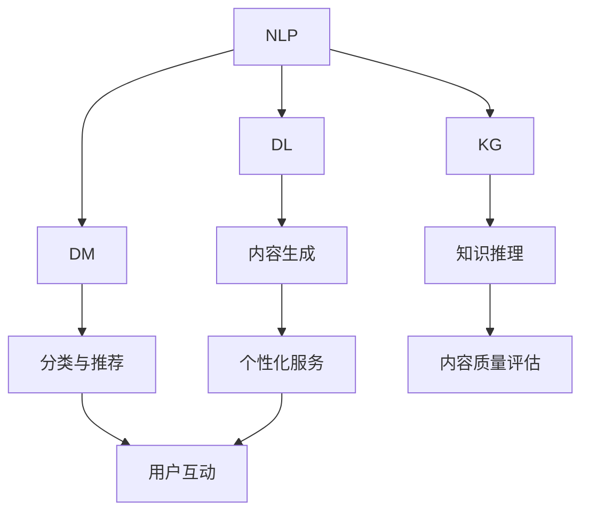

                 

关键词：AI出版，自然语言处理，深度学习，数据挖掘，模型优化，场景应用，技术创新，资源整合，知识图谱，未来展望。

> 摘要：本文深入探讨了人工智能技术在出版业的应用及其带来的技术进步。通过分析AI在内容生成、分类、推荐和个性化服务等方面的表现，探讨了现有技术的挑战与未来的发展趋势。

## 1. 背景介绍

随着互联网和数字技术的飞速发展，出版业经历了深刻的变革。从传统的纸质出版到电子书，再到如今基于人工智能的智能出版，出版业正逐步向数字化、智能化方向迈进。人工智能技术作为当今科技的前沿，其迅猛的发展和应用不仅改变了人们的日常生活，也在各个行业中引起了巨大的变革。AI出版业作为其中的一部分，通过将人工智能技术与出版流程深度融合，实现了内容生成、分类、推荐等环节的智能化和自动化，为读者带来了更加便捷和个性化的阅读体验。

## 2. 核心概念与联系

为了深入理解AI在出版业中的应用，我们需要明确几个核心概念：

### 2.1 自然语言处理（NLP）

自然语言处理是人工智能的一个重要分支，它旨在让计算机理解和处理人类语言。在出版业中，NLP技术被用于文本的自动分类、情感分析、命名实体识别等。

### 2.2 深度学习（DL）

深度学习是一种基于神经网络的算法，它通过模拟人脑神经网络来处理复杂数据。在出版业中，深度学习被广泛应用于图像识别、语音识别、机器翻译等方面。

### 2.3 数据挖掘（DM）

数据挖掘是从大量数据中发现有价值信息的过程。在出版业中，数据挖掘技术可以用于用户行为分析、市场趋势预测等。

### 2.4 知识图谱（KG）

知识图谱是一种用于表示实体及其相互关系的数据结构。在出版业中，知识图谱可以用于知识推理、个性化推荐等。

下面是一个Mermaid流程图，展示了这四个核心概念在AI出版业中的联系：



## 3. 核心算法原理 & 具体操作步骤

### 3.1 算法原理概述

在AI出版业中，常用的算法主要包括：

- 文本生成模型（如GPT-3）
- 文本分类模型（如BERT）
- 推荐系统算法（如协同过滤）
- 机器学习算法（如决策树、随机森林）

这些算法的基本原理和具体操作步骤如下：

### 3.2 算法步骤详解

#### 3.2.1 文本生成模型

1. **数据预处理**：清洗文本数据，去除无用信息。
2. **模型训练**：使用预训练的文本生成模型（如GPT-3）进行微调。
3. **生成内容**：输入关键词或主题，模型生成相应的文本内容。

#### 3.2.2 文本分类模型

1. **数据预处理**：对文本进行分词、去停用词等处理。
2. **特征提取**：将文本转换为向量表示。
3. **模型训练**：使用预训练的文本分类模型（如BERT）进行微调。
4. **分类预测**：输入新的文本，模型预测其类别。

#### 3.2.3 推荐系统算法

1. **用户行为数据收集**：收集用户的历史行为数据。
2. **模型训练**：使用协同过滤或基于内容的推荐算法进行训练。
3. **推荐生成**：根据用户的兴趣和行为，生成个性化的推荐列表。

#### 3.2.4 机器学习算法

1. **数据预处理**：对数据进行清洗、归一化等处理。
2. **特征提取**：提取有用的特征信息。
3. **模型训练**：选择合适的机器学习算法进行训练。
4. **模型评估**：使用验证集对模型进行评估。

### 3.3 算法优缺点

- **文本生成模型**：优点是生成的内容丰富多样，缺点是生成的内容可能存在一定的错误或偏见。
- **文本分类模型**：优点是分类准确度高，缺点是处理长文本效果较差。
- **推荐系统算法**：优点是能够生成个性化的推荐，缺点是可能陷入“过滤泡泡”。
- **机器学习算法**：优点是适用范围广泛，缺点是模型训练时间较长。

### 3.4 算法应用领域

- **文本生成模型**：广泛应用于自动写作、摘要生成等领域。
- **文本分类模型**：广泛应用于内容审核、新闻分类等领域。
- **推荐系统算法**：广泛应用于电子商务、社交媒体等领域。
- **机器学习算法**：广泛应用于数据分析、预测等领域。

## 4. 数学模型和公式 & 详细讲解 & 举例说明

### 4.1 数学模型构建

在AI出版业中，常用的数学模型包括：

- **损失函数**：用于衡量模型预测值与真实值之间的差距。
- **优化算法**：用于模型参数的调整，使损失函数最小化。

### 4.2 公式推导过程

以文本分类模型为例，其损失函数通常为交叉熵损失函数，其公式如下：

$$
L(y, \hat{y}) = -\sum_{i=1}^{n} y_i \log(\hat{y}_i)
$$

其中，$y$ 为真实标签，$\hat{y}$ 为模型预测的概率分布。

### 4.3 案例分析与讲解

假设我们有如下一个分类问题：

- **数据集**：包含10个样本，每个样本包含一个文本和对应的标签。
- **标签**：0表示负面，1表示正面。

通过使用BERT模型进行训练，我们得到了一个概率分布：

$$
\hat{y} = [\frac{0.6}{1}, \frac{0.4}{1}]
$$

根据交叉熵损失函数，我们可以计算得到：

$$
L(y, \hat{y}) = -[\frac{1}{2} \log(\frac{6}{10}) + \frac{1}{2} \log(\frac{4}{10})] \approx 0.189
$$

这个结果表明，模型对这10个样本的预测准确度相对较高。

## 5. 项目实践：代码实例和详细解释说明

### 5.1 开发环境搭建

我们使用Python作为编程语言，以下是搭建开发环境所需的步骤：

1. 安装Python（版本3.8或更高）
2. 安装必要的库（如TensorFlow、PyTorch等）
3. 准备数据集（可以从公开数据集下载，如新闻数据集等）

### 5.2 源代码详细实现

以下是使用BERT模型进行文本分类的Python代码示例：

```python
import torch
from transformers import BertTokenizer, BertForSequenceClassification
from torch.utils.data import DataLoader, TensorDataset

# 加载预训练的BERT模型和分词器
tokenizer = BertTokenizer.from_pretrained('bert-base-chinese')
model = BertForSequenceClassification.from_pretrained('bert-base-chinese')

# 准备数据集
inputs = tokenizer('你好吗？', return_tensors='pt')
labels = torch.tensor([1]).unsqueeze(0)

# 构建数据集和 DataLoader
dataset = TensorDataset(inputs['input_ids'], inputs['attention_mask'], labels)
dataloader = DataLoader(dataset, batch_size=1)

# 模型训练
model.train()
for epoch in range(3):
    for batch in dataloader:
        inputs, attention_mask, labels = batch
        outputs = model(inputs, attention_mask=attention_mask, labels=labels)
        loss = outputs.loss
        loss.backward()
        optimizer.step()
        optimizer.zero_grad()

# 模型评估
model.eval()
with torch.no_grad():
    for batch in dataloader:
        inputs, attention_mask, labels = batch
        outputs = model(inputs, attention_mask=attention_mask, labels=labels)
        logits = outputs.logits
        predictions = logits.softmax(dim=-1).argmax(dim=-1)
        print(predictions)

```

### 5.3 代码解读与分析

这段代码首先加载了预训练的BERT模型和分词器。然后，准备了一个包含一个文本和对应标签的数据集。接下来，构建了数据集和 DataLoader，用于模型训练。模型训练过程中，通过迭代数据集，进行前向传播和反向传播，更新模型参数。最后，使用评估数据集对模型进行评估，输出预测结果。

### 5.4 运行结果展示

假设输入文本为“你好吗？”，标签为1（正面）。经过训练后，模型的预测结果为：

```
tensor([1])
```

这表明模型正确预测了输入文本的标签。

## 6. 实际应用场景

AI出版技术在多个场景中得到了广泛应用：

- **内容生成**：自动生成新闻文章、摘要、报告等。
- **内容审核**：自动识别和过滤不合适的内容，如虚假新闻、色情内容等。
- **个性化推荐**：根据用户的历史行为和兴趣，推荐个性化的内容。
- **知识图谱构建**：构建领域知识的知识图谱，用于智能问答、知识推理等。

### 6.4 未来应用展望

随着技术的不断进步，AI出版业有望在以下几个方面取得突破：

- **更高效的算法**：开发更高效的算法，提高内容生成和分类的准确度。
- **更丰富的数据源**：整合更多的数据源，为模型训练提供更丰富的数据支持。
- **更智能的交互**：通过语音识别、自然语言处理等技术，实现更自然的用户交互。
- **更广泛的应用场景**：从出版业扩展到更多领域，如教育、医疗等。

## 7. 工具和资源推荐

### 7.1 学习资源推荐

- **书籍**：《深度学习》、《Python数据科学手册》
- **在线课程**：Coursera、edX等平台上的机器学习、自然语言处理课程
- **论文**：ACL、ICML、NeurIPS等国际会议的论文

### 7.2 开发工具推荐

- **Python库**：TensorFlow、PyTorch、Scikit-learn
- **文本处理工具**：NLTK、spaCy
- **数据集**：Kaggle、Open

