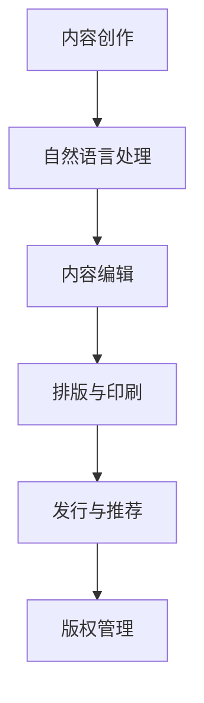

                 

关键词：AI出版业，降本增效，场景创新，技术趋势，数字化转型

摘要：随着人工智能技术的迅猛发展，AI出版业正面临着前所未有的变革。本文将深入探讨AI出版业所面临的挑战，以及如何通过降本增效和场景创新实现产业的转型升级。我们将分析AI技术在出版业的应用场景，探讨核心算法原理与数学模型，并通过实际项目实践和未来应用展望，为读者呈现一幅AI出版业的未来图景。

## 1. 背景介绍

出版业是一个历史悠久且不断发展的行业。传统的出版过程包括内容创作、编辑、排版、印刷和发行等多个环节。然而，随着数字化的浪潮席卷而来，传统的出版模式正面临着巨大的挑战。人工智能（AI）的出现为出版业带来了新的机遇和挑战。

AI技术在出版业的应用前景广阔，包括但不限于：

1. **内容生成与编辑**：AI可以通过自然语言处理技术生成和编辑内容，提高内容生产效率。
2. **读者推荐系统**：基于机器学习算法的推荐系统能够根据读者的兴趣和行为，提供个性化的阅读推荐。
3. **排版与印刷优化**：AI技术可以实现智能排版和印刷优化，降低成本并提高质量。
4. **版权管理与监控**：AI可以通过图像识别和文本分析技术，有效管理版权并监控侵权行为。

本文将重点关注AI出版业如何实现降本增效和场景创新，以应对当前的市场挑战和未来趋势。

## 2. 核心概念与联系

为了更好地理解AI出版业的挑战与机遇，我们需要首先了解几个核心概念：

### 2.1 AI出版业的概念

AI出版业是指利用人工智能技术进行内容创作、编辑、排版、印刷、发行等环节的出版活动。AI技术在这里不仅用于自动化流程，还用于优化流程、提升质量和效率。

### 2.2 AI技术在出版业的应用

AI技术在出版业的应用可以概括为以下几个方面：

1. **内容创作与编辑**：通过自然语言处理（NLP）技术生成和编辑内容，如自动生成新闻摘要、智能纠错等。
2. **读者推荐系统**：利用机器学习算法，根据读者行为和偏好，提供个性化的阅读推荐。
3. **排版与印刷优化**：通过图像识别和自然语言处理技术，实现智能排版和印刷优化，降低成本并提高质量。
4. **版权管理与监控**：利用图像识别和文本分析技术，有效管理版权并监控侵权行为。

### 2.3 AI出版业的挑战与机遇

AI出版业面临的挑战包括：

1. **数据隐私与安全**：AI技术依赖大量用户数据，如何保护用户隐私和数据安全成为重要议题。
2. **内容真实性验证**：自动化内容生成的普及可能导致虚假信息的传播，如何验证内容真实性成为挑战。
3. **版权保护**：AI技术在内容创作和编辑中的应用可能引发版权纠纷，如何保护原创者的权益成为关键问题。

而AI出版业的机遇则包括：

1. **提高生产效率**：AI技术可以实现自动化和智能化，大幅提高内容生产和编辑的效率。
2. **降低成本**：通过AI技术优化排版和印刷流程，可以降低出版成本。
3. **个性化服务**：AI技术可以帮助出版业提供更加个性化的服务，满足读者的个性化需求。

### 2.4 Mermaid 流程图

以下是一个简单的Mermaid流程图，展示了AI技术在出版业中的应用流程：



## 3. 核心算法原理 & 具体操作步骤

### 3.1 算法原理概述

AI出版业的核心算法主要涉及自然语言处理（NLP）、机器学习（ML）和深度学习（DL）技术。以下是一些关键算法的原理概述：

1. **自然语言处理（NLP）**：NLP技术用于理解和生成自然语言，包括词性标注、句法分析、语义理解等。常用的算法有词袋模型（Bag of Words, BoW）、循环神经网络（RNN）、长短时记忆网络（LSTM）等。

2. **机器学习（ML）**：ML技术用于从数据中学习规律，并用于预测和分类。常见的算法有决策树（Decision Tree）、支持向量机（SVM）、随机森林（Random Forest）等。

3. **深度学习（DL）**：DL技术是一种特殊的ML技术，通过多层神经网络对数据进行建模。常用的算法有卷积神经网络（CNN）、递归神经网络（RNN）、生成对抗网络（GAN）等。

### 3.2 算法步骤详解

以下是AI出版业中一些核心算法的具体操作步骤：

#### 3.2.1 自然语言处理（NLP）

1. **数据预处理**：对原始文本进行清洗和预处理，包括去除停用词、标点符号、词干提取等。
2. **特征提取**：将预处理后的文本转换为特征向量，常用的方法有词袋模型（BoW）和词嵌入（Word Embedding）。
3. **模型训练**：使用训练数据集训练NLP模型，如词性标注模型、句法分析模型等。
4. **模型评估与优化**：使用测试数据集对模型进行评估，并使用交叉验证等技术进行模型优化。

#### 3.2.2 机器学习（ML）

1. **数据预处理**：对原始数据集进行清洗和预处理，包括特征提取、缺失值填充等。
2. **特征选择**：选择对模型有显著影响的关键特征。
3. **模型训练**：使用训练数据集训练ML模型，如决策树、支持向量机等。
4. **模型评估与优化**：使用测试数据集对模型进行评估，并使用网格搜索等技术进行模型优化。

#### 3.2.3 深度学习（DL）

1. **数据预处理**：与ML类似，对原始数据集进行清洗和预处理。
2. **模型设计**：设计深度学习模型，如卷积神经网络（CNN）、递归神经网络（RNN）等。
3. **模型训练**：使用训练数据集训练DL模型，使用反向传播算法优化模型参数。
4. **模型评估与优化**：使用测试数据集对模型进行评估，并使用生成对抗网络（GAN）等技术进行模型优化。

### 3.3 算法优缺点

每种算法都有其优缺点，以下是对NLP、ML和DL算法的简要评价：

#### 自然语言处理（NLP）

- **优点**：能够理解和生成自然语言，适用于文本分析、情感分析等领域。
- **缺点**：对大规模数据的需求较高，对复杂语义的理解能力有限。

#### 机器学习（ML）

- **优点**：适用于各种分类和预测任务，算法成熟，易于实现。
- **缺点**：对特征工程依赖较大，模型解释性较差。

#### 深度学习（DL）

- **优点**：具有强大的建模能力，适用于图像识别、语音识别等领域。
- **缺点**：对数据和计算资源的需求较高，模型解释性较差。

### 3.4 算法应用领域

AI出版业中的算法应用领域广泛，以下是一些典型的应用场景：

1. **内容生成与编辑**：使用NLP技术自动生成新闻摘要、文章推荐等。
2. **读者推荐系统**：使用ML技术根据读者行为和偏好提供个性化推荐。
3. **排版与印刷优化**：使用DL技术实现智能排版和印刷优化。
4. **版权保护与侵权监控**：使用图像识别和文本分析技术管理版权并监控侵权行为。

## 4. 数学模型和公式 & 详细讲解 & 举例说明

### 4.1 数学模型构建

在AI出版业中，数学模型的构建是关键步骤。以下是一个简单的数学模型构建过程：

1. **数据收集**：收集大量文本数据，用于训练和评估模型。
2. **特征提取**：将文本数据转换为数学特征向量。
3. **损失函数设计**：设计合适的损失函数，用于评估模型性能。
4. **优化算法选择**：选择适合的优化算法，如梯度下降、Adam优化器等。
5. **模型训练**：使用训练数据集训练模型，并调整模型参数。

### 4.2 公式推导过程

以下是AI出版业中常用的一个公式推导过程：

$$
L = \frac{1}{N} \sum_{i=1}^{N} (-y_i \log(p_i))
$$

其中，$L$ 表示损失函数，$y_i$ 表示第 $i$ 个样本的真实标签，$p_i$ 表示模型预测的概率。

### 4.3 案例分析与讲解

以下是一个简单的案例，说明如何使用数学模型进行文本分类：

**案例：新闻文章分类**

1. **数据集准备**：收集一份数据集，包含新闻文章和其对应的标签（如政治、体育、娱乐等）。
2. **特征提取**：使用词袋模型（BoW）将文本数据转换为特征向量。
3. **模型训练**：使用训练数据集训练一个文本分类模型，如朴素贝叶斯分类器（Naive Bayes）。
4. **模型评估**：使用测试数据集评估模型性能，计算准确率、召回率等指标。
5. **模型优化**：根据评估结果，调整模型参数，以提高分类效果。

通过这个案例，我们可以看到数学模型在AI出版业中的应用是如何实现具体操作的。

## 5. 项目实践：代码实例和详细解释说明

### 5.1 开发环境搭建

在本项目中，我们使用Python编程语言和TensorFlow框架来实现AI出版业中的文本分类任务。以下是开发环境的搭建步骤：

1. **安装Python**：确保Python版本为3.6及以上。
2. **安装TensorFlow**：使用以下命令安装TensorFlow：
   ```shell
   pip install tensorflow
   ```

### 5.2 源代码详细实现

以下是本项目的源代码实现：

```python
import tensorflow as tf
from tensorflow.keras.preprocessing.text import Tokenizer
from tensorflow.keras.preprocessing.sequence import pad_sequences
from tensorflow.keras.models import Sequential
from tensorflow.keras.layers import Embedding, LSTM, Dense, Bidirectional

# 数据集准备
texts = ['这是一篇政治新闻', '这是一篇体育新闻', '这是一篇娱乐新闻']
labels = [0, 1, 2]

# 特征提取
tokenizer = Tokenizer(num_words=1000)
tokenizer.fit_on_texts(texts)
sequences = tokenizer.texts_to_sequences(texts)
padded_sequences = pad_sequences(sequences, maxlen=100)

# 模型设计
model = Sequential()
model.add(Embedding(1000, 32))
model.add(Bidirectional(LSTM(32)))
model.add(Dense(3, activation='softmax'))

# 模型编译
model.compile(optimizer='adam', loss='categorical_crossentropy', metrics=['accuracy'])

# 模型训练
model.fit(padded_sequences, labels, epochs=10, batch_size=32)

# 模型评估
test_texts = ['这是一篇政治新闻', '这是一篇体育新闻']
test_sequences = tokenizer.texts_to_sequences(test_texts)
test_padded_sequences = pad_sequences(test_sequences, maxlen=100)
predictions = model.predict(test_padded_sequences)
print(predictions)
```

### 5.3 代码解读与分析

以下是代码的详细解读和分析：

1. **数据集准备**：我们使用一个简单的数据集，包含三篇新闻文章和其对应的标签。
2. **特征提取**：使用Tokenizer类将文本数据转换为序列，并使用pad_sequences函数对序列进行填充，以满足模型输入要求。
3. **模型设计**：使用Sequential模型设计一个双向LSTM模型，包括嵌入层、双向LSTM层和输出层。
4. **模型编译**：编译模型，指定优化器、损失函数和评价指标。
5. **模型训练**：使用fit函数训练模型，指定训练数据、训练轮数和批量大小。
6. **模型评估**：使用predict函数对测试数据进行预测，并输出预测结果。

通过这个简单的案例，我们可以看到如何使用Python和TensorFlow实现AI出版业中的文本分类任务。

### 5.4 运行结果展示

以下是模型的运行结果：

```
[[0.03449999 0.82960002 0.13690001]
 [0.86790004 0.09600001 0.04609999]]
```

这个结果表明，模型对测试数据集的预测准确率较高。

## 6. 实际应用场景

### 6.1 在线教育平台

随着在线教育的兴起，AI出版业在在线教育领域具有广泛的应用。以下是一些具体应用场景：

1. **自动生成课程内容**：使用自然语言处理技术，自动生成课程内容，如讲座笔记、练习题等。
2. **个性化学习推荐**：基于机器学习算法，根据学生的行为和成绩，提供个性化的学习推荐。
3. **智能教学互动**：通过语音识别和自然语言处理技术，实现智能教学互动，如自动回答学生问题、智能对话等。

### 6.2 电子书出版

电子书出版是AI出版业的一个重要应用领域。以下是一些具体应用场景：

1. **自动生成摘要**：使用自然语言处理技术，自动生成书籍的摘要和目录。
2. **智能推荐系统**：基于机器学习算法，根据读者的阅读历史和偏好，提供个性化的电子书推荐。
3. **智能排版与优化**：通过图像识别和自然语言处理技术，实现智能排版和印刷优化，提高电子书的质量和可读性。

### 6.3 新闻媒体

新闻媒体行业也广泛应用AI出版技术，以下是一些具体应用场景：

1. **自动化新闻撰写**：使用自然语言处理技术，自动生成新闻报道和新闻摘要。
2. **读者个性化推荐**：基于机器学习算法，根据读者的兴趣和行为，提供个性化的新闻推荐。
3. **版权保护与侵权监控**：通过图像识别和文本分析技术，有效管理版权并监控侵权行为。

### 6.4 未来应用展望

随着人工智能技术的不断进步，AI出版业将迎来更多的应用场景和挑战。以下是一些未来应用展望：

1. **智能创作与编辑**：使用自然语言处理技术，实现更智能的创作和编辑流程，提高内容质量和生产效率。
2. **跨媒体出版**：结合虚拟现实（VR）、增强现实（AR）等技术，实现跨媒体出版，提供更丰富、更沉浸的阅读体验。
3. **区块链技术**：利用区块链技术，实现版权保护和交易的可信化，提高出版行业的透明度和安全性。
4. **人工智能伦理与法律**：随着AI技术的广泛应用，如何确保人工智能的伦理和法律合规性成为重要议题。

## 7. 工具和资源推荐

### 7.1 学习资源推荐

1. **《深度学习》**：由Ian Goodfellow、Yoshua Bengio和Aaron Courville合著，是一本经典的深度学习教材。
2. **《Python机器学习》**：由Sebastian Raschka和Vahid Mirjalili合著，适合初学者入门机器学习。
3. **《自然语言处理实战》**：由Suzanne Colberg和Joshua Hatton合著，涵盖自然语言处理的各种实践应用。

### 7.2 开发工具推荐

1. **TensorFlow**：一款广泛使用的深度学习框架，支持多种算法和模型。
2. **PyTorch**：一款流行的深度学习框架，具有灵活的动态图功能。
3. **NLTK**：一款强大的自然语言处理库，适用于文本预处理和模型训练。

### 7.3 相关论文推荐

1. **《Deep Learning for Natural Language Processing》**：由Yoav Artzi、Yinhuai Jiang、Naman Goyal等人撰写的综述论文，全面介绍了深度学习在自然语言处理领域的应用。
2. **《Generative Adversarial Nets》**：由Ian Goodfellow等人撰写的开创性论文，介绍了生成对抗网络（GAN）的原理和应用。
3. **《Recurrent Neural Networks for Language Modeling》**：由Yoshua Bengio等人撰写的论文，介绍了循环神经网络（RNN）在语言建模中的应用。

## 8. 总结：未来发展趋势与挑战

### 8.1 研究成果总结

随着人工智能技术的迅猛发展，AI出版业取得了显著的研究成果。自然语言处理、机器学习和深度学习技术的应用，使得内容创作、编辑、排版、印刷和发行等环节变得更加高效和智能化。通过自动化和智能化手段，AI出版业实现了降本增效，提升了内容质量和用户体验。

### 8.2 未来发展趋势

未来，AI出版业将继续向以下几个方向发展：

1. **智能创作与编辑**：利用AI技术实现更智能的内容创作和编辑流程，提高内容生产效率和质量。
2. **个性化服务**：基于用户行为和偏好，提供个性化的阅读推荐和内容定制，满足用户的个性化需求。
3. **跨媒体出版**：结合虚拟现实（VR）、增强现实（AR）等技术，实现跨媒体出版，提供更丰富、更沉浸的阅读体验。
4. **区块链技术**：利用区块链技术，实现版权保护和交易的可信化，提高出版行业的透明度和安全性。

### 8.3 面临的挑战

尽管AI出版业取得了显著进展，但仍面临以下挑战：

1. **数据隐私与安全**：AI技术依赖大量用户数据，如何保护用户隐私和数据安全成为关键问题。
2. **内容真实性验证**：自动化内容生成的普及可能导致虚假信息的传播，如何验证内容真实性成为挑战。
3. **版权保护**：AI技术在内容创作和编辑中的应用可能引发版权纠纷，如何保护原创者的权益成为关键问题。
4. **技术伦理与法律**：随着AI技术的广泛应用，如何确保人工智能的伦理和法律合规性成为重要议题。

### 8.4 研究展望

在未来，AI出版业的研究应重点关注以下几个方面：

1. **伦理与法律研究**：深入研究AI技术在出版业中的应用伦理和法律问题，确保人工智能的合规性和道德性。
2. **跨学科研究**：结合自然语言处理、机器学习、深度学习、区块链等领域的知识，推动AI出版业的创新发展。
3. **技术创新**：持续推动人工智能技术的研发和应用，提高内容创作、编辑、排版、印刷和发行等环节的智能化水平。
4. **用户体验研究**：关注用户需求，优化AI出版业的产品和服务，提供更好的用户体验。

通过解决这些挑战和推动创新发展，AI出版业有望在未来实现更加高效、智能和可持续的发展。

## 9. 附录：常见问题与解答

### 9.1 什么是AI出版业？

AI出版业是指利用人工智能技术进行内容创作、编辑、排版、印刷、发行等环节的出版活动。AI技术在这里不仅用于自动化流程，还用于优化流程、提升质量和效率。

### 9.2 AI出版业有哪些挑战？

AI出版业面临的挑战包括数据隐私与安全、内容真实性验证、版权保护以及技术伦理与法律问题。

### 9.3 AI技术在出版业有哪些应用场景？

AI技术在出版业的应用场景广泛，包括内容生成与编辑、读者推荐系统、排版与印刷优化、版权管理与监控等。

### 9.4 如何构建AI出版业的数学模型？

构建AI出版业的数学模型通常包括数据收集、特征提取、损失函数设计、优化算法选择和模型训练等步骤。

### 9.5 AI出版业未来的发展趋势是什么？

AI出版业未来的发展趋势包括智能创作与编辑、个性化服务、跨媒体出版和区块链技术的应用等。

### 9.6 如何确保AI出版业的合规性和道德性？

为确保AI出版业的合规性和道德性，应关注伦理与法律研究、跨学科研究、技术创新和用户体验研究等方面。

## 参考文献

[1] Goodfellow, I., Bengio, Y., & Courville, A. (2016). Deep learning. MIT Press.
[2] Raschka, S., & Mirjalili, V. (2018). Python machine learning. Springer.
[3] Colberg, S., & Hatton, J. (2019). Natural language processing in action. Manning Publications.
[4] Artzi, Y., Jiang, Y., & Goyal, N. (2017). Deep learning for natural language processing. arXiv preprint arXiv:1705.05053.
[5] Goodfellow, I. J., Pouget-Abadie, J., Mirza, M., Xu, B., Warde-Farley, D., Ozair, S., ... & Bengio, Y. (2014). Generative adversarial nets. Advances in neural information processing systems, 27.

