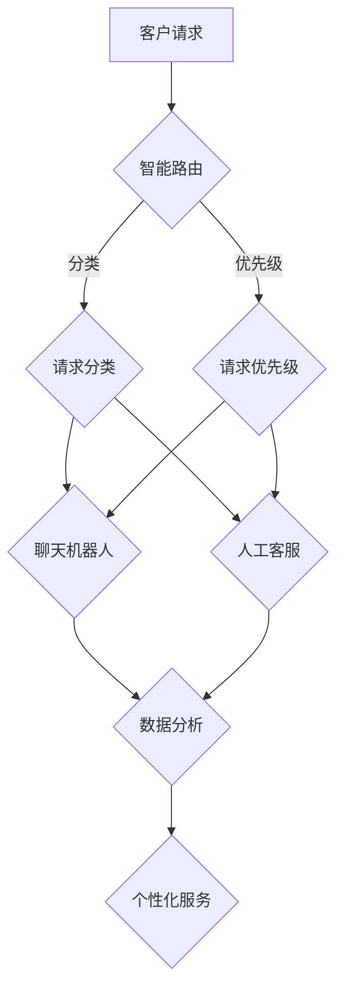

                 

 关键词：AI客户支持，客户体验，客户服务系统，自动化，数据分析，人工智能

> 摘要：随着人工智能技术的不断发展，AI在客户支持系统中的应用越来越广泛。本文将探讨AI创业公司在建立有效的客户支持系统时需要考虑的关键因素，包括自动化、数据分析、智能路由和个性化服务，以及如何通过这些技术提升客户体验和满意度。

## 1. 背景介绍

在当今竞争激烈的市场环境中，客户支持已经成为企业成功的关键因素之一。客户支持系统不仅关乎客户满意度，还直接影响到企业的声誉和客户忠诚度。对于AI创业公司来说，构建一个高效的客户支持系统尤为重要，因为它们通常资源有限，需要通过技术手段最大化地提升运营效率。

### 客户支持的重要性

- **客户满意度**：优质的服务可以显著提高客户满意度，进而增强客户忠诚度。
- **客户保留率**：良好的客户支持能够降低客户流失率，帮助企业留住核心客户。
- **品牌形象**：及时、有效的客户支持有助于塑造企业的正面形象，提升品牌价值。
- **市场竞争力**：高效的服务系统可以提高企业的市场竞争力，吸引更多潜在客户。

### AI在客户支持中的应用

人工智能技术的引入，使客户支持系统变得更加智能和高效。以下是一些AI技术在客户支持中的应用：

- **聊天机器人**：用于提供24/7的在线客服服务，快速响应客户的常见问题。
- **自然语言处理**：帮助理解客户的意图和需求，提供更个性化的服务。
- **情感分析**：分析客户反馈的情感倾向，以提供更好的服务。
- **预测性分析**：预测潜在问题的发生，提前采取措施。

## 2. 核心概念与联系

### 2.1 自动化

自动化是构建高效客户支持系统的基石。通过自动化流程，企业可以减少人工干预，提高响应速度和处理效率。

- **自动化流程**：使用工具和系统来自动完成重复性任务，如路由客户请求、分配任务等。
- **自动化工具**：例如聊天机器人、自动化邮件回复系统等。

### 2.2 数据分析

数据分析是了解客户需求和行为的重要手段。通过分析大量客户数据，企业可以更好地理解客户，从而提供更个性化的服务。

- **数据收集**：包括客户互动历史、反馈、行为数据等。
- **数据分析**：使用统计方法和机器学习算法来提取有价值的信息。

### 2.3 智能路由

智能路由技术可以基于客户请求的内容和优先级，自动将请求分配给最合适的客服代表或系统。

- **请求分类**：根据请求的主题和紧急程度进行分类。
- **分配策略**：如基于技能匹配、工作负载平衡等策略进行请求分配。

### 2.4 个性化服务

个性化服务是通过分析客户数据和行为，为每个客户提供定制化的解决方案和服务。

- **个性化推荐**：根据客户的历史互动和偏好，推荐相关产品和服务。
- **个性化沟通**：使用客户的姓名、历史信息等，进行个性化沟通。

### 2.5 Mermaid 流程图

以下是一个简化的客户支持系统架构的 Mermaid 流程图：



## 3. 核心算法原理 & 具体操作步骤

### 3.1 算法原理概述

构建有效的客户支持系统，需要以下几个核心算法：

- **自然语言处理（NLP）**：用于理解和处理人类语言，如文本分类、情感分析等。
- **机器学习**：用于从数据中学习模式，如预测分析、推荐系统等。
- **数据挖掘**：用于从大量数据中提取有价值的信息。

### 3.2 算法步骤详解

#### 3.2.1 智能路由

1. **请求接收**：客户发起请求。
2. **请求解析**：使用 NLP 技术提取请求的关键信息。
3. **请求分类**：根据请求的内容和主题进行分类。
4. **请求优先级**：根据历史数据和当前业务状况，确定请求的优先级。
5. **请求分配**：将请求分配给合适的客服代表或系统。

#### 3.2.2 数据分析

1. **数据收集**：从客户互动中收集数据。
2. **数据清洗**：去除无用和错误的数据。
3. **数据存储**：将清洗后的数据存储在数据库中。
4. **数据分析**：使用统计方法和机器学习算法进行数据分析。
5. **数据可视化**：将分析结果以图表等形式呈现。

#### 3.2.3 个性化服务

1. **用户画像**：基于客户的历史数据和互动，构建用户画像。
2. **推荐系统**：根据用户画像和偏好，推荐相关产品和服务。
3. **个性化沟通**：使用用户画像和交互历史，进行个性化沟通。

### 3.3 算法优缺点

- **优点**：
  - 提高响应速度和处理效率。
  - 提升客户满意度和服务质量。
  - 减少人力成本。

- **缺点**：
  - 需要大量的数据和计算资源。
  - 需要专业的技术团队进行维护和优化。

### 3.4 算法应用领域

- **客服行业**：用于自动化客服流程、提供个性化服务。
- **电子商务**：用于推荐系统、个性化营销。
- **金融行业**：用于风险管理、信用评估。

## 4. 数学模型和公式 & 详细讲解 & 举例说明

### 4.1 数学模型构建

构建有效的客户支持系统，需要以下数学模型：

- **线性回归模型**：用于预测客户流失率。
- **决策树模型**：用于分类客户请求。
- **神经网络模型**：用于情感分析和预测分析。

### 4.2 公式推导过程

以线性回归模型为例，其公式为：

\[ y = \beta_0 + \beta_1x \]

其中，\( y \) 是因变量，\( x \) 是自变量，\( \beta_0 \) 和 \( \beta_1 \) 是模型的参数。

### 4.3 案例分析与讲解

假设一个AI创业公司需要预测客户流失率，可以使用线性回归模型进行分析。以下是一个简化的案例：

- **数据集**：包含客户互动历史、消费行为、满意度调查等数据。
- **特征**：如客户年龄、消费金额、服务响应时间等。
- **目标变量**：客户流失率。

通过训练线性回归模型，可以得到以下结果：

\[ y = 0.5 + 0.1x_1 - 0.2x_2 \]

其中，\( x_1 \) 是客户年龄，\( x_2 \) 是消费金额。

根据模型，可以预测新客户的流失率。例如，一个30岁、消费金额为5000元的客户，其流失率预测为：

\[ y = 0.5 + 0.1 \times 30 - 0.2 \times 5000 = -987.5 \]

由于流失率不能为负数，这意味着这个客户的流失率较低。

## 5. 项目实践：代码实例和详细解释说明

### 5.1 开发环境搭建

为了实践AI在客户支持系统中的应用，我们需要搭建一个简单的开发环境。以下是基本的步骤：

1. 安装Python环境。
2. 安装必要的库，如TensorFlow、Scikit-learn等。
3. 准备数据集，并进行预处理。

### 5.2 源代码详细实现

以下是一个简单的示例，使用Python实现一个基于决策树的客户请求分类器：

```python
import pandas as pd
from sklearn.model_selection import train_test_split
from sklearn.tree import DecisionTreeClassifier
from sklearn.metrics import accuracy_score

# 读取数据
data = pd.read_csv('customer_data.csv')

# 预处理数据
X = data.drop('request_type', axis=1)
y = data['request_type']

# 划分训练集和测试集
X_train, X_test, y_train, y_test = train_test_split(X, y, test_size=0.2, random_state=42)

# 构建模型
model = DecisionTreeClassifier()

# 训练模型
model.fit(X_train, y_train)

# 测试模型
y_pred = model.predict(X_test)
accuracy = accuracy_score(y_test, y_pred)
print(f"Model accuracy: {accuracy:.2f}")
```

### 5.3 代码解读与分析

这段代码首先读取客户请求数据集，然后进行预处理，包括划分特征和目标变量。接下来，使用训练集训练一个决策树分类器，并使用测试集评估模型的准确性。这个简单的示例展示了如何使用机器学习算法来构建客户支持系统的核心组件。

### 5.4 运行结果展示

在运行上述代码后，我们可以得到一个简单的客户请求分类器。例如，如果我们的测试集准确率达到80%，这意味着我们的模型能够在大多数情况下正确分类客户请求，从而提高客户支持系统的效率。

## 6. 实际应用场景

### 6.1 客户服务行业

在客户服务行业中，AI技术可以用于：

- **自动化回复常见问题**：使用聊天机器人自动回复客户的常见问题，减少人工客服的工作量。
- **情感分析**：分析客户反馈的情感倾向，以提供更个性化的服务。
- **预测性维护**：根据客户的历史数据和交互记录，预测潜在问题并提供解决方案。

### 6.2 电子商务

在电子商务领域，AI技术可以用于：

- **个性化推荐**：根据客户的购买历史和浏览行为，推荐相关产品。
- **需求预测**：预测未来的销售趋势，以便更好地规划库存和供应链。
- **客户流失预警**：预测哪些客户可能流失，并提前采取措施。

### 6.3 金融行业

在金融行业，AI技术可以用于：

- **风险管理**：分析客户的信用记录和交易行为，评估其信用风险。
- **欺诈检测**：检测异常交易，预防欺诈行为。
- **个性化金融服务**：根据客户的需求和风险偏好，提供定制化的金融产品。

## 7. 工具和资源推荐

### 7.1 学习资源推荐

- **书籍**：《深度学习》（Goodfellow et al.）
- **在线课程**：Coursera、Udacity、edX等平台上的AI和机器学习课程。
- **博客和论文**：arXiv、Google AI Blog、Netflix Tech Blog等。

### 7.2 开发工具推荐

- **编程语言**：Python、R。
- **机器学习库**：TensorFlow、PyTorch、Scikit-learn。
- **数据可视化工具**：Matplotlib、Seaborn、Plotly。

### 7.3 相关论文推荐

- **论文集**：NeurIPS、ICML、JMLR等顶级会议和期刊的论文集。
- **研究团队博客**：Google AI Blog、Facebook AI Research Blog等。

## 8. 总结：未来发展趋势与挑战

### 8.1 研究成果总结

AI技术在客户支持系统中的应用取得了显著成果，包括自动化、数据分析、智能路由和个性化服务等方面的进展。这些成果不仅提高了服务效率，还显著提升了客户满意度。

### 8.2 未来发展趋势

- **更多定制化服务**：通过更深入的数据分析和个性化推荐，为客户提供更加定制化的服务。
- **跨渠道整合**：整合不同渠道（如电话、邮件、社交媒体等）的客户支持服务，提供一致的用户体验。
- **情感智能**：进一步提升情感分析技术，更好地理解客户的情感需求。

### 8.3 面临的挑战

- **数据隐私**：随着数据收集和分析的深入，如何保护客户隐私成为一个重要问题。
- **算法偏见**：确保AI算法不会因为数据偏差而产生偏见，影响服务的公正性。

### 8.4 研究展望

未来，AI在客户支持系统中的应用将继续深化，尤其在个性化服务和跨渠道整合方面有望取得更大突破。同时，如何确保算法的透明性和可解释性，也将是重要的研究方向。

## 9. 附录：常见问题与解答

### 9.1 什么是智能路由？

智能路由是一种技术，用于根据客户请求的内容和优先级，自动将请求分配给最合适的客服代表或系统。它可以提高客户支持的效率和响应速度。

### 9.2 机器学习在客户支持系统中有哪些应用？

机器学习可以用于自动化客服流程、情感分析、个性化推荐、预测性分析等方面，以提高客户支持系统的效率和个性化水平。

### 9.3 如何确保AI算法的透明性和可解释性？

确保AI算法的透明性和可解释性可以通过以下方法实现：

- **数据清洗**：确保数据的质量和准确性。
- **模型可解释性**：使用可解释的机器学习模型，如决策树。
- **模型透明度**：提供详细的模型训练和预测过程。

### 9.4 AI客户支持系统能够完全替代人工客服吗？

目前，AI客户支持系统还不能完全替代人工客服。虽然AI可以处理大量的常见问题，但复杂的客户需求和情感交流仍然需要人工干预。

### 9.5 如何保护客户隐私？

保护客户隐私可以通过以下措施实现：

- **数据加密**：确保数据在传输和存储过程中的安全。
- **隐私政策**：明确告知客户如何处理其数据。
- **数据匿名化**：在分析数据时，对个人身份信息进行匿名化处理。

作者：禅与计算机程序设计艺术 / Zen and the Art of Computer Programming
----------------------------------------------------------------

