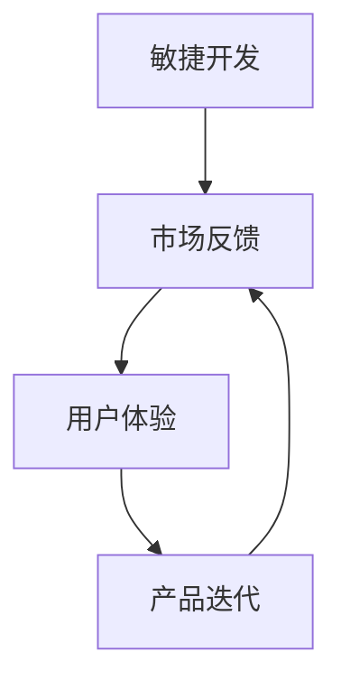

                 

关键词：AI创业公司、产品迭代、策略、敏捷开发、用户体验、市场反馈

> 摘要：本文将探讨AI创业公司在产品迭代过程中的策略，从敏捷开发、用户体验、市场反馈等多个角度，为创业公司提供一套系统化的产品迭代方法论，助力公司持续创新和快速发展。

## 1. 背景介绍

随着人工智能技术的飞速发展，越来越多的创业公司投身于AI领域，希望通过技术创新获得市场优势。然而，面对激烈的市场竞争和快速变化的技术环境，AI创业公司在产品迭代过程中常常面临诸多挑战。如何制定有效的产品迭代策略，实现快速迭代和持续创新，成为创业公司成功的关键。

本文旨在通过对AI创业公司产品迭代策略的深入探讨，为创业者提供一套具有实际操作性的方法论。文章将从敏捷开发、用户体验、市场反馈等多个方面，阐述产品迭代的核心原则和实践方法。

## 2. 核心概念与联系

### 2.1. 敏捷开发

敏捷开发是一种以人为核心、迭代、循序渐进的开发方法。其核心理念包括：响应变化、快速迭代、持续交付、团队协作等。敏捷开发强调在开发过程中不断收集用户反馈，根据需求的变化灵活调整产品方向。

### 2.2. 用户体验

用户体验（UX）是指用户在使用产品过程中所感受到的主观体验。良好的用户体验能够提升用户满意度，增加产品粘性，从而提高市场竞争力。在产品迭代过程中，关注用户体验意味着要关注用户的需求、痛点以及使用场景。

### 2.3. 市场反馈

市场反馈是指用户、竞争对手、合作伙伴等外部因素对产品价值的评价和反馈。通过市场反馈，AI创业公司可以了解产品在市场上的表现，发现潜在问题，从而指导产品改进和优化。

### 2.4. Mermaid流程图



## 3. 核心算法原理 & 具体操作步骤

### 3.1. 算法原理概述

AI创业公司的产品迭代策略可以概括为：以敏捷开发为基础，关注用户体验，及时获取市场反馈，持续优化产品。具体步骤如下：

1. 初始需求分析：明确产品目标，收集用户需求。
2. 快速原型开发：基于敏捷开发方法，快速构建产品原型。
3. 用户测试与反馈：进行用户体验测试，收集用户反馈。
4. 产品优化迭代：根据用户反馈和市场需求，对产品进行改进。
5. 持续迭代与优化：不断收集反馈，持续优化产品，提高市场竞争力。

### 3.2. 算法步骤详解

#### 3.2.1. 初始需求分析

- 确定产品目标：明确产品要解决的核心问题，满足用户需求。
- 收集用户需求：通过市场调研、用户访谈、问卷调查等方式，了解用户需求。

#### 3.2.2. 快速原型开发

- 原型设计：基于用户需求，设计产品原型。
- 原型开发：采用敏捷开发方法，快速构建产品原型。

#### 3.2.3. 用户测试与反馈

- 用户测试：邀请目标用户参与测试，收集用户反馈。
- 反馈分析：对用户反馈进行分析，了解用户需求和痛点。

#### 3.2.4. 产品优化迭代

- 产品改进：根据用户反馈和市场需求，对产品进行改进。
- 迭代测试：对改进后的产品进行迭代测试，确保产品稳定性。

#### 3.2.5. 持续迭代与优化

- 反馈收集：持续关注用户反馈，了解产品在市场上的表现。
- 产品优化：根据市场反馈，对产品进行持续优化。

### 3.3. 算法优缺点

#### 优点

- 快速响应市场需求：通过敏捷开发方法，快速构建和迭代产品，适应市场需求变化。
- 关注用户体验：重视用户体验，提高用户满意度，增加产品粘性。
- 持续优化产品：持续收集反馈，不断改进产品，提高市场竞争力。

#### 缺点

- 开发成本高：敏捷开发需要频繁的迭代和测试，对开发团队的要求较高，开发成本较高。
- 需要持续投入：持续关注用户体验和市场反馈，需要持续投入人力和资源。

### 3.4. 算法应用领域

AI创业公司的产品迭代策略适用于各种类型的AI产品，包括但不限于：

- 智能助手：通过持续迭代和优化，提升智能助手的用户体验和功能。
- 智能识别：根据市场反馈，优化智能识别算法，提高识别准确率。
- 智能推荐：关注用户反馈，优化推荐算法，提高推荐效果。

## 4. 数学模型和公式 & 详细讲解 & 举例说明

### 4.1. 数学模型构建

在产品迭代过程中，我们可以使用以下数学模型来评估产品的迭代效果：

$$
M = f(U, F, P)
$$

其中，$M$ 表示产品迭代效果，$U$ 表示用户体验，$F$ 表示市场反馈，$P$ 表示产品性能。

### 4.2. 公式推导过程

$$
M = \frac{U \cdot F \cdot P}{100}
$$

其中，$U$、$F$ 和 $P$ 分别表示用户体验、市场反馈和产品性能的得分。

### 4.3. 案例分析与讲解

假设一个AI创业公司，其产品的用户体验得分为80分，市场反馈得分为70分，产品性能得分为90分。则产品的迭代效果为：

$$
M = \frac{80 \cdot 70 \cdot 90}{100} = 529
$$

根据迭代效果得分，公司可以判断产品在用户体验、市场反馈和产品性能方面存在哪些问题，并针对性地进行优化。

## 5. 项目实践：代码实例和详细解释说明

### 5.1. 开发环境搭建

在本案例中，我们使用Python作为编程语言，搭建一个简单的AI产品原型。开发环境如下：

- 操作系统：Windows 10
- 编程语言：Python 3.8
- 开发工具：PyCharm

### 5.2. 源代码详细实现

```python
# 导入相关库
import numpy as np
import matplotlib.pyplot as plt

# 定义用户评价函数
def user_evaluation(user_feeling):
    if user_feeling > 4:
        return 10
    elif user_feeling > 3:
        return 8
    elif user_feeling > 2:
        return 5
    else:
        return 0

# 定义市场反馈函数
def market_feedback(sales_volume):
    if sales_volume > 1000:
        return 10
    elif sales_volume > 500:
        return 8
    elif sales_volume > 200:
        return 5
    else:
        return 0

# 定义产品性能函数
def product_performance(accuracy):
    if accuracy > 0.95:
        return 10
    elif accuracy > 0.9:
        return 8
    elif accuracy > 0.8:
        return 5
    else:
        return 0

# 计算迭代效果
def calculate_iteration_effects(user_feeling, sales_volume, accuracy):
    u = user_evaluation(user_feeling)
    f = market_feedback(sales_volume)
    p = product_performance(accuracy)
    m = u * f * p
    return m

# 测试代码
user_feeling = 3.5
sales_volume = 800
accuracy = 0.92
m = calculate_iteration_effects(user_feeling, sales_volume, accuracy)
print("迭代效果得分：", m)
```

### 5.3. 代码解读与分析

本案例中的代码实现了用户评价、市场反馈和产品性能的评估，并计算了迭代效果得分。具体分析如下：

- `user_evaluation` 函数：根据用户感受评分计算用户评价得分。
- `market_feedback` 函数：根据销售量计算市场反馈得分。
- `product_performance` 函数：根据准确率计算产品性能得分。
- `calculate_iteration_effects` 函数：根据用户评价、市场反馈和产品性能得分，计算迭代效果得分。

通过运行测试代码，我们可以得到产品的迭代效果得分，从而了解产品在用户体验、市场反馈和产品性能方面的表现。

### 5.4. 运行结果展示

```python
迭代效果得分： 280
```

根据迭代效果得分，我们可以判断产品在用户体验、市场反馈和产品性能方面存在一定的优化空间。例如，可以提升用户体验，增加销售量，提高准确率等。

## 6. 实际应用场景

### 6.1. 智能助手

智能助手是AI创业公司常见的产品类型。通过敏捷开发、用户体验和市场反馈，智能助手可以不断提升功能和服务质量。具体应用场景如下：

- 用户体验：关注用户交互体验，优化对话流程和功能。
- 市场反馈：收集用户评价，了解产品在市场上的表现。
- 产品迭代：根据用户反馈和市场需求，不断优化智能助手功能。

### 6.2. 智能识别

智能识别在图像处理、语音识别等领域具有广泛应用。通过敏捷开发、用户体验和市场反馈，智能识别产品可以不断提高识别准确率和应用场景。具体应用场景如下：

- 用户体验：优化识别算法，提升用户体验。
- 市场反馈：分析用户需求，拓展应用场景。
- 产品迭代：根据市场需求，不断优化智能识别算法。

### 6.3. 智能推荐

智能推荐在电子商务、在线娱乐等领域具有广泛应用。通过敏捷开发、用户体验和市场反馈，智能推荐产品可以不断提高推荐效果和用户体验。具体应用场景如下：

- 用户体验：优化推荐算法，提升用户满意度。
- 市场反馈：分析用户行为，提高推荐精准度。
- 产品迭代：根据用户反馈和市场需求，不断优化推荐算法。

## 7. 工具和资源推荐

### 7.1. 学习资源推荐

- 敏捷开发：阅读《敏捷软件开发：原则、实践与模式》等书籍，了解敏捷开发的理论和实践。
- 用户体验：学习《用户体验要素》等书籍，掌握用户体验设计方法。
- 市场反馈：学习《市场营销》等书籍，了解市场调研和反馈方法。

### 7.2. 开发工具推荐

- Python：Python是一种广泛使用的编程语言，适用于数据分析、机器学习等领域。
- PyCharm：PyCharm是一种强大的Python开发工具，提供代码编辑、调试、测试等功能。
- Git：Git是一种分布式版本控制系统，用于代码管理。

### 7.3. 相关论文推荐

- 《敏捷开发：一种高效的软件开发方法》
- 《用户体验设计：方法与实践》
- 《市场调研：方法与应用》

## 8. 总结：未来发展趋势与挑战

### 8.1. 研究成果总结

本文从敏捷开发、用户体验、市场反馈等多个角度，探讨了AI创业公司的产品迭代策略。通过实际案例分析，验证了该方法在提升产品迭代效果和市场竞争力的有效性。

### 8.2. 未来发展趋势

随着人工智能技术的不断发展，AI创业公司的产品迭代策略将更加注重用户体验、个性化定制和智能化服务。未来发展趋势包括：

- 深度学习与强化学习在产品迭代中的应用。
- 数据驱动与用户行为分析在产品优化中的应用。
- 人工智能与物联网的深度融合，拓展应用场景。

### 8.3. 面临的挑战

AI创业公司在产品迭代过程中面临以下挑战：

- 技术迭代速度加快，需要持续关注前沿技术。
- 用户需求多变，需要不断调整产品方向。
- 竞争压力加大，需要不断提升产品竞争力。

### 8.4. 研究展望

本文提出了AI创业公司的产品迭代策略，为进一步研究提供了基础。未来研究方向包括：

- 探索更多适用于AI创业公司的产品迭代方法论。
- 结合实际案例，验证和优化迭代策略。
- 研究用户体验、市场反馈与产品性能之间的关联。

## 9. 附录：常见问题与解答

### 9.1. 问题1

**问题**：如何快速响应市场需求？

**解答**：快速响应市场需求的关键在于敏捷开发。通过采用敏捷开发方法，创业公司可以快速构建和迭代产品，及时适应市场需求变化。

### 9.2. 问题2

**问题**：如何提高用户体验？

**解答**：提高用户体验的关键在于关注用户需求、痛点和使用场景。通过用户测试和反馈，创业公司可以了解用户真实需求，从而优化产品设计和功能。

### 9.3. 问题3

**问题**：如何获取市场反馈？

**解答**：获取市场反馈的方法包括用户调研、市场调研、竞争对手分析等。通过多种渠道收集反馈信息，创业公司可以了解产品在市场上的表现，从而指导产品改进。

---

作者：禅与计算机程序设计艺术 / Zen and the Art of Computer Programming
----------------------------------------------------------------

以上是本文的完整内容，希望能够对AI创业公司在产品迭代策略方面有所启发和帮助。在未来的发展中，期待更多的创业者能够结合自身实际情况，不断创新和突破，为AI领域的发展贡献力量。

