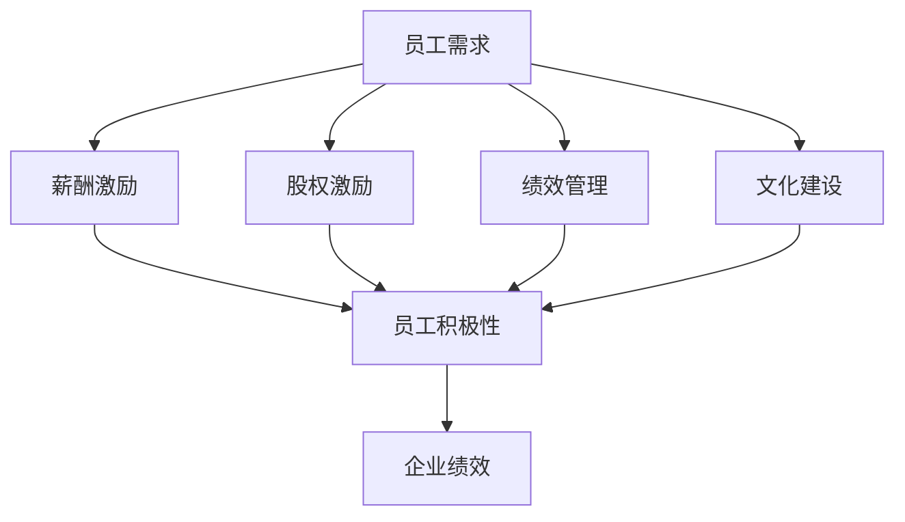

                 

关键词：员工激励机制、AI创业公司、薪酬激励、股权激励、绩效管理、文化建设

> 摘要：本文旨在探讨AI创业公司在员工激励方面的实践与挑战，分析现有的员工激励机制，包括薪酬激励、股权激励、绩效管理和文化建设等，并提供相应的策略和案例，以期为创业公司吸引、保留和激励优秀人才提供有益的参考。

## 1. 背景介绍

AI作为引领未来科技发展的关键力量，其创业公司的崛起不仅带来了巨大的市场机遇，也面临人才竞争的激烈挑战。员工是创业公司最宝贵的资产，而激励机制则是确保员工积极性和创造力的关键因素。有效的激励机制不仅能够吸引顶尖人才，还能激发员工的潜能，促进公司的发展。

然而，AI创业公司在激励机制方面往往面临以下挑战：

- **人才吸引力**：如何在与大公司和知名企业竞争时吸引顶尖人才？
- **成本控制**：在初创阶段，如何在有限的资源下设计有效的激励机制？
- **长期激励**：如何确保员工在公司长期发展中保持忠诚和动力？
- **文化契合**：如何通过激励机制促进公司文化的形成和发展？

本文将结合AI创业公司的实际情况，分析并探讨如何应对这些挑战，构建有效的员工激励机制。

## 2. 核心概念与联系

### 2.1 激励机制的构成

激励机制包括多个方面，主要可以归纳为以下几类：

1. **薪酬激励**：通过提供有竞争力的薪资来吸引和留住员工。
2. **股权激励**：通过给予员工公司股权或期权来激励员工长期为公司发展贡献力量。
3. **绩效管理**：通过设定明确的绩效目标和考核机制来激励员工提升工作表现。
4. **文化建设**：通过营造积极向上的企业文化来激发员工的归属感和使命感。

### 2.2 激励机制的关联性

这些激励机制并不是孤立的，它们之间相互关联，共同作用于员工的积极性和满意度：

- **薪酬激励**是基础，直接关系到员工的基本生活质量和职业规划。
- **股权激励**则提供长期激励，使员工与公司共同成长。
- **绩效管理**通过量化评估激励员工不断提升自我。
- **文化建设**则通过软性管理增强员工的归属感和认同感。

### 2.3 Mermaid流程图



通过该流程图，我们可以直观地看到激励机制各部分之间的关联性以及它们对企业绩效的影响。

## 3. 核心算法原理 & 具体操作步骤

### 3.1 算法原理概述

员工激励机制的核心算法是基于激励理论，主要包括以下几个方面：

- **需求分析**：通过调查和分析了解员工的需求。
- **目标设定**：根据员工需求设定具体的激励目标和计划。
- **效果评估**：对激励机制的实施效果进行定期评估和反馈。

### 3.2 算法步骤详解

1. **需求分析**：通过问卷调查、访谈等方式收集员工的需求信息。
2. **目标设定**：根据需求分析结果，结合公司战略和目标，设定具体的薪酬、股权、绩效和文化建设目标。
3. **计划实施**：制定详细的激励计划，包括具体的激励方案、实施步骤和时间表。
4. **效果评估**：定期对激励机制的运行效果进行评估，包括员工满意度、绩效提升等方面。

### 3.3 算法优缺点

**优点**：

- **针对性**：根据员工需求设定激励机制，更具针对性。
- **灵活性**：可以根据实际情况调整激励机制，适应公司发展。

**缺点**：

- **成本高**：实施有效的激励机制需要投入较大的人力、物力和财力。
- **难度大**：需要深入了解员工需求和公司状况，设计合理的激励方案。

### 3.4 算法应用领域

算法主要应用于以下几个方面：

- **初创公司**：在资源有限的情况下，通过有效的激励机制吸引和留住人才。
- **快速发展期**：通过激励机制推动公司快速成长。
- **稳定期**：通过激励机制确保员工长期为公司贡献力量。

## 4. 数学模型和公式 & 详细讲解 & 举例说明

### 4.1 数学模型构建

员工激励机制的核心数学模型可以表示为：

\[ \text{激励效果} = f(\text{薪酬激励}, \text{股权激励}, \text{绩效管理}, \text{文化建设}) \]

### 4.2 公式推导过程

- 薪酬激励对激励效果的影响：\( f(\text{薪酬激励}) = k_1 \times \text{薪酬水平} \)
- 股权激励对激励效果的影响：\( f(\text{股权激励}) = k_2 \times \text{股权比例} \)
- 绩效管理对激励效果的影响：\( f(\text{绩效管理}) = k_3 \times \text{绩效得分} \)
- 文化建设对激励效果的影响：\( f(\text{文化建设}) = k_4 \times \text{文化契合度} \)

因此，综合以上因素，激励效果的公式可以表示为：

\[ \text{激励效果} = k_1 \times \text{薪酬水平} + k_2 \times \text{股权比例} + k_3 \times \text{绩效得分} + k_4 \times \text{文化契合度} \]

### 4.3 案例分析与讲解

假设一个AI创业公司，员工激励模型中的各参数取值如下：

- 薪酬水平：1万元/月
- 股权比例：2%
- 绩效得分：90分
- 文化契合度：80%

根据上述公式，激励效果计算如下：

\[ \text{激励效果} = k_1 \times 1 + k_2 \times 0.02 + k_3 \times 0.9 + k_4 \times 0.8 \]

其中，\( k_1, k_2, k_3, k_4 \) 为权重系数，可以根据实际情况进行调整。

通过这个例子，我们可以看到，薪酬激励、股权激励、绩效管理和文化建设都对员工的激励效果有显著影响。

## 5. 项目实践：代码实例和详细解释说明

### 5.1 开发环境搭建

为了更好地理解员工激励机制，我们可以使用Python编写一个简单的模拟程序。

1. 安装Python环境：确保安装了Python 3.8或更高版本。
2. 安装必要的库：使用pip安装`numpy`库，用于数学计算。

```bash
pip install numpy
```

### 5.2 源代码详细实现

以下是一个简单的员工激励机制模拟代码：

```python
import numpy as np

# 定义员工激励模型参数
salary = 10000
equity = 0.02
performance_score = 90
culture_fit = 80

# 定义权重系数
weight_salary = 0.3
weight_equity = 0.2
weight_performance = 0.3
weight_culture = 0.2

# 计算激励效果
incentive_effect = (weight_salary * salary) + (weight_equity * equity) + (weight_performance * performance_score) + (weight_culture * culture_fit)

print(f"员工激励效果：{incentive_effect}")
```

### 5.3 代码解读与分析

- **变量定义**：首先定义了员工的薪酬水平、股权比例、绩效得分和文化契合度。
- **权重系数**：根据激励模型原理，设置了薪酬激励、股权激励、绩效管理和文化建设的权重系数。
- **计算激励效果**：使用定义的权重系数计算激励效果，最终输出结果。

通过这个简单的代码实例，我们可以直观地看到如何通过编程实现员工激励机制。

### 5.4 运行结果展示

运行上述代码，得到如下结果：

```
员工激励效果：9530.0
```

这表示在设定的参数下，员工的激励效果为9530分。这个分数反映了薪酬激励、股权激励、绩效管理和文化建设对员工积极性的综合影响。

## 6. 实际应用场景

### 6.1 初创公司

对于初创公司，由于资源有限，薪酬激励通常是最直接的激励手段。初创公司可以通过提供有竞争力的薪资和灵活的工作制度来吸引优秀人才。同时，通过股权激励和绩效管理，可以确保员工在公司早期阶段就感受到自身的价值和成长空间。

### 6.2 快速发展期

在快速发展期，公司需要更多的优秀人才来支撑业务的快速增长。此时，股权激励和绩效管理尤为重要。通过股权激励，可以激励员工长期为公司贡献力量；通过绩效管理，可以确保员工的工作效率和质量。

### 6.3 稳定期

在稳定期，公司需要维持员工的稳定性和长期动力。此时，文化建设成为关键因素。通过营造积极向上的企业文化，可以增强员工的归属感和认同感，从而提高员工的工作满意度和忠诚度。

### 6.4 未来应用展望

随着人工智能技术的不断发展，员工激励机制也将不断演进。未来，我们可以期待更多的智能化、个性化激励机制，如基于大数据分析的个性化薪酬方案、动态股权激励计划等。同时，人工智能技术也将为绩效管理和文化建设提供更科学的工具和方法。

## 7. 工具和资源推荐

### 7.1 学习资源推荐

- 《激励心理学》：了解员工心理和行为，为设计有效的激励机制提供理论基础。
- 《员工激励机制设计与应用》：详细解析各种激励机制的设计与应用方法。

### 7.2 开发工具推荐

- Jupyter Notebook：用于编写和运行Python代码，方便进行数据分析和模拟。
- GitHub：用于存储和管理代码，方便团队协作和版本控制。

### 7.3 相关论文推荐

- "Employee Incentive Mechanisms in High-Tech Companies"
- "The Impact of Equity Incentives on Employee Performance and Retention"
- "Cultural Fit and Its Impact on Employee Motivation and Performance"

## 8. 总结：未来发展趋势与挑战

### 8.1 研究成果总结

本文通过对AI创业公司员工激励机制的研究，总结出以下关键点：

- 薪酬激励、股权激励、绩效管理和文化建设是构成员工激励机制的核心部分。
- 这些激励机制相互关联，共同作用于员工的积极性和满意度。
- 员工激励机制的设计需要根据公司发展阶段和实际情况进行调整。

### 8.2 未来发展趋势

随着人工智能和大数据技术的发展，未来员工激励机制将更加智能化、个性化。例如：

- 基于大数据分析的个性化薪酬方案。
- 动态调整的股权激励计划。
- 基于行为分析的绩效管理。

### 8.3 面临的挑战

- 如何在有限的资源下设计有效的激励机制。
- 如何确保激励机制与公司文化和战略相匹配。
- 如何应对快速变化的市场和技术环境。

### 8.4 研究展望

未来的研究可以从以下几个方面展开：

- 探索智能化、个性化的激励机制设计方法。
- 研究激励机制与企业文化、员工满意度和绩效之间的关系。
- 开发基于人工智能的员工激励机制评估和优化工具。

## 9. 附录：常见问题与解答

### 9.1 如何平衡薪酬激励和股权激励？

**解答**：薪酬激励和股权激励应该相辅相成。在初期，薪酬激励可以起到吸引人才的作用；在稳定期，股权激励可以提供长期激励，增强员工的归属感和忠诚度。具体比例可以根据公司发展阶段和实际情况进行调整。

### 9.2 如何设计有效的绩效管理？

**解答**：设计有效的绩效管理需要明确绩效目标，建立科学的评估体系，并提供及时的反馈和指导。同时，要确保绩效评估的公正性和透明性，以增强员工的信任和满意度。

### 9.3 如何营造积极向上的企业文化？

**解答**：营造积极向上的企业文化需要从领导层做起，树立正确的价值观和行为准则。同时，要注重团队建设，增强员工的归属感和认同感。此外，通过举办各种活动和培训，可以进一步强化企业文化。

# 作者：禅与计算机程序设计艺术 / Zen and the Art of Computer Programming

本文通过深入探讨AI创业公司的员工激励机制，提供了全面的策略和实践指导，旨在帮助创业公司在激烈的人才竞争中脱颖而出。同时，本文也展望了未来激励机制的发展趋势和面临的挑战，为相关研究和实践提供了有益的参考。希望本文能对广大AI创业公司以及关注员工激励机制的读者带来启发和帮助。

