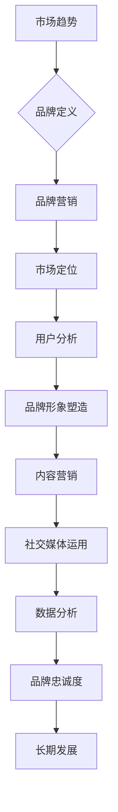

                 

人工智能（AI）作为当今科技界的热门话题，吸引了众多创业公司的参与。然而，在竞争激烈的市场环境中，如何成功地打造并推广AI创业公司的品牌，成为了每个创始人所必须面对的挑战。本文将探讨AI创业公司在品牌营销方面的一些策略，帮助创业者更好地在市场中站稳脚跟。

## 关键词

- AI创业公司
- 品牌营销
- 竞争优势
- 市场定位
- 用户群体
- 数据驱动

## 摘要

本文将深入探讨AI创业公司在品牌营销策略方面的关键要素。首先，我们将回顾当前AI行业的市场趋势和竞争环境，然后分析品牌营销在AI创业公司成功中的重要性。接着，文章将详细探讨几个核心策略，包括市场定位、用户分析、品牌形象塑造、内容营销、社交媒体运用以及数据分析等。最后，我们将讨论未来AI品牌营销的发展趋势，并总结出创业公司应如何应对未来的挑战。

## 1. 背景介绍

近年来，人工智能技术的发展取得了显著的进步。从自然语言处理、计算机视觉到机器学习和深度学习，AI技术的应用范围越来越广泛，不仅推动了传统行业的数字化变革，也为新兴市场带来了无限商机。在这一背景下，许多创业公司纷纷投身于AI领域，希望通过创新的产品和服务改变世界。

然而，随着市场参与者数量的增加，竞争也日益激烈。根据市场研究公司的数据，全球人工智能市场规模预计将在未来几年内实现快速增长，但同时也面临激烈的竞争。如何在众多竞争对手中脱颖而出，成为每一个AI创业公司都必须解决的问题。

品牌营销在这一过程中起着至关重要的作用。一个强大的品牌不仅能吸引潜在用户，还能增强投资者的信心，为公司的长期发展奠定基础。因此，AI创业公司必须深入了解品牌营销的核心策略，并将其有效应用于实际操作中。

## 2. 核心概念与联系

在探讨品牌营销策略之前，我们需要了解一些核心概念。品牌是指一个公司、产品或服务的独特标志，它不仅包括名称、标志和口号，还涵盖了公司的价值观、使命和愿景。品牌营销则是通过一系列策略来建立、推广和维护品牌的过程。

为了更好地理解这些概念，我们可以借助一个Mermaid流程图来展示它们之间的关系：



通过这个流程图，我们可以看到品牌营销是一个综合性的过程，涉及多个关键环节，每个环节之间相互关联，共同推动品牌的建立和发展。

### 2.1 市场趋势

当前，人工智能市场正处于快速发展阶段，各大科技公司和研究机构纷纷加大投入，推动技术的不断创新。根据市场研究数据，AI市场的增长率将持续保持高位，预计到2025年，全球AI市场规模将达到几千亿美元。这一趋势不仅为AI创业公司提供了巨大的市场空间，也带来了前所未有的竞争压力。

在这一背景下，创业公司必须紧跟市场趋势，了解行业动态，才能在激烈的市场竞争中占据一席之地。市场趋势分析可以帮助公司预测未来发展方向，从而制定相应的品牌营销策略。

### 2.2 品牌定义

品牌定义是品牌营销的基础。一个清晰的品牌定义能够明确公司的定位、目标用户和核心价值，从而为后续的营销活动提供指导。品牌定义包括以下几个方面：

- **公司名称和标志**：一个独特、易于记忆的公司名称和标志是品牌的第一印象。它不仅需要与公司的核心价值相符，还要在视觉上吸引目标用户。
- **价值观和使命**：公司的价值观和使命是品牌的灵魂。它反映了公司的文化、理念和追求，能够引导员工和用户形成共同的价值观。
- **愿景**：品牌的愿景是公司未来发展的目标。它为品牌指明了方向，激励员工和用户共同努力。

通过明确品牌定义，AI创业公司能够在品牌营销过程中保持一致性，提升品牌的认知度和美誉度。

### 2.3 品牌营销

品牌营销是一个系统的过程，包括市场定位、用户分析、品牌形象塑造、内容营销、社交媒体运用和数据分析等多个环节。每个环节都至关重要，共同推动品牌的建立和发展。

- **市场定位**：市场定位是品牌营销的第一步，它决定了品牌在市场中的位置和目标用户群体。AI创业公司需要根据自身优势和市场需求，确定合适的市场定位，以便在市场中脱颖而出。
- **用户分析**：用户分析是品牌营销的基础。通过对目标用户进行深入分析，公司可以了解用户的需求、行为和偏好，从而制定更有效的营销策略。
- **品牌形象塑造**：品牌形象是品牌在用户心中的总体印象。通过品牌视觉设计、公关活动、用户口碑等方式，AI创业公司可以塑造一个积极、专业的品牌形象。
- **内容营销**：内容营销是通过创造和分享有价值的内容来吸引和留住目标用户。AI创业公司可以通过博客、白皮书、案例分析等形式，提供专业、权威的内容，提升品牌的权威性和影响力。
- **社交媒体运用**：社交媒体是品牌营销的重要渠道。通过在各大社交媒体平台发布内容、互动和推广，AI创业公司可以扩大品牌影响力，增加用户参与度。
- **数据分析**：数据分析是品牌营销的核心。通过对用户行为数据、营销效果数据等进行分析，AI创业公司可以优化营销策略，提高营销效率。

### 2.4 品牌忠诚度

品牌忠诚度是品牌成功的关键指标。一个拥有高品牌忠诚度的公司，不仅能够稳定用户群体，还能通过用户口碑吸引更多潜在用户。为了提升品牌忠诚度，AI创业公司可以采取以下措施：

- **提供优质产品和服务**：优质的产品和服务是提升品牌忠诚度的基石。AI创业公司需要不断优化产品功能，提升服务质量，满足用户需求。
- **建立用户社区**：用户社区是增强品牌忠诚度的重要手段。通过建立用户社区，AI创业公司可以与用户建立更紧密的联系，增强用户参与感。
- **个性化营销**：个性化营销可以提升用户的满意度和忠诚度。通过收集和分析用户数据，AI创业公司可以提供个性化的产品推荐和服务，满足用户的个性化需求。
- **用户反馈机制**：用户反馈是品牌改进的重要来源。AI创业公司应该积极收集用户反馈，及时解决问题，提升用户满意度。

### 2.5 长期发展

品牌营销不仅仅是短期的营销活动，更是公司长期发展的战略。一个成功的品牌营销策略，可以帮助AI创业公司在激烈的市场竞争中脱颖而出，建立稳定的用户群体，提高市场份额，实现长期可持续发展。

为了实现长期发展，AI创业公司需要：

- **持续创新**：技术是AI创业公司的核心竞争力。公司需要不断进行技术创新，提升产品竞争力，满足市场需求。
- **优化用户体验**：用户体验是品牌成功的关键。公司需要关注用户体验，不断优化产品和服务，提升用户满意度。
- **加强品牌文化建设**：品牌文化是公司的软实力。公司需要加强品牌文化建设，提升员工的品牌意识，形成积极向上的企业文化。
- **多元化营销渠道**：随着市场环境的不断变化，AI创业公司需要不断探索新的营销渠道，扩大品牌影响力。

## 3. 核心算法原理 & 具体操作步骤

### 3.1 算法原理概述

在品牌营销策略中，核心算法原理可以理解为通过数据分析来优化营销决策。具体来说，AI创业公司可以采用以下算法：

- **用户行为分析算法**：通过对用户在网站、应用等平台上的行为数据进行分析，了解用户偏好和需求。
- **客户细分算法**：根据用户特征和行为数据，将用户分为不同的群体，以便进行个性化的营销活动。
- **推荐系统算法**：基于用户历史行为和偏好，为用户推荐相关产品或服务。

### 3.2 算法步骤详解

1. **数据收集**：首先，需要收集用户在网站、应用等平台上的行为数据，如浏览记录、购买行为、反馈等。
2. **数据处理**：对收集到的数据进行清洗、整理和预处理，以便后续分析。
3. **用户行为分析**：利用机器学习算法，对用户行为数据进行分析，提取用户偏好和需求。
4. **客户细分**：基于用户行为分析结果，将用户分为不同的群体，如潜在客户、活跃用户、流失用户等。
5. **个性化推荐**：根据用户历史行为和偏好，为用户推荐相关产品或服务。
6. **营销活动优化**：根据用户反馈和数据分析结果，优化营销活动的策略和执行。

### 3.3 算法优缺点

**优点**：

- 提高营销效率：通过数据驱动的方式，优化营销决策，提高营销活动的效果。
- 个性化体验：基于用户数据，提供个性化的产品推荐和服务，提升用户体验。
- 实时反馈：实时分析用户行为数据，及时调整营销策略，提高营销活动的灵活性。

**缺点**：

- 数据依赖性：算法的效果很大程度上依赖于数据的准确性和完整性。
- 技术门槛：实施数据分析和推荐系统需要较高的技术水平和专业的算法工程师。

### 3.4 算法应用领域

- **电子商务**：通过个性化推荐，提高用户购买转化率。
- **金融行业**：通过用户行为分析，识别潜在风险客户，优化风控策略。
- **在线教育**：根据用户学习行为，提供个性化的学习推荐。

## 4. 数学模型和公式 & 详细讲解 & 举例说明

在品牌营销策略中，数学模型和公式是理解和分析数据的重要工具。以下是一个简单的例子，用于描述用户行为分析中的用户细分模型。

### 4.1 数学模型构建

假设我们有以下两个用户特征：

- 用户A的浏览时长：X1 = 30分钟
- 用户B的浏览时长：X2 = 45分钟

我们可以使用K均值聚类算法将用户分为不同的群体。K均值聚类算法的基本公式如下：

$$
C = \{c_1, c_2, ..., c_k\}
$$

其中，$c_i$表示第$i$个用户的聚类中心。

### 4.2 公式推导过程

1. 初始化聚类中心$c_i$。
2. 对于每个用户$x_i$，计算其与聚类中心的距离$d(x_i, c_j)$。
3. 根据距离最近的原则，将用户$x_i$归为第$j$个聚类。
4. 更新聚类中心$c_j$，使得新的聚类中心更加接近已归类的用户。

### 4.3 案例分析与讲解

假设我们有一组用户数据，如下所示：

| 用户 | 浏览时长（分钟） |
|------|-----------------|
| A    | 30              |
| B    | 45              |
| C    | 20              |
| D    | 60              |

我们使用K均值聚类算法将这组数据分为两个群体。

1. 初始化聚类中心$c_1 = (0, 0)$，$c_2 = (1, 1)$。
2. 计算每个用户与聚类中心的距离：
   - $d(A, c_1) = \sqrt{(30-0)^2 + (0-0)^2} = 30$
   - $d(A, c_2) = \sqrt{(30-1)^2 + (0-1)^2} = \sqrt{891}$
   - $d(B, c_1) = \sqrt{(45-0)^2 + (0-0)^2} = 45$
   - $d(B, c_2) = \sqrt{(45-1)^2 + (1-1)^2} = \sqrt{1936}$
   - $d(C, c_1) = \sqrt{(20-0)^2 + (0-0)^2} = 20$
   - $d(C, c_2) = \sqrt{(20-1)^2 + (1-1)^2} = \sqrt{421}$
   - $d(D, c_1) = \sqrt{(60-0)^2 + (0-0)^2} = 60$
   - $d(D, c_2) = \sqrt{(60-1)^2 + (1-1)^2} = \sqrt{3599}$

3. 根据距离最近的原则，将用户归为聚类：
   - 用户A和用户B归为聚类1，因为它们与聚类中心$c_1$的距离更近。
   - 用户C和用户D归为聚类2，因为它们与聚类中心$c_2$的距离更近。

4. 更新聚类中心：
   - 新的聚类中心$c_1' = (\frac{30+45}{2}, \frac{0+0}{2}) = (37.5, 0)$
   - 新的聚类中心$c_2' = (\frac{20+60}{2}, \frac{1+1}{2}) = (40, 1)$

5. 重复上述步骤，直到聚类中心不再变化。

通过这个简单的案例，我们可以看到K均值聚类算法的基本原理和步骤。在实际应用中，用户特征和数据量会更多更复杂，但原理是相似的。

## 5. 项目实践：代码实例和详细解释说明

在本节中，我们将通过一个具体的代码实例来演示如何使用Python实现用户行为分析，并进行用户细分。为了更好地展示过程，我们将使用一个简单的用户浏览时长数据集。

### 5.1 开发环境搭建

在开始之前，我们需要搭建一个Python开发环境。以下是所需的步骤：

1. 安装Python：访问Python官网（[python.org](https://www.python.org/)）下载并安装Python。
2. 安装必要的库：使用pip安装以下库：`numpy`，`matplotlib`，`sklearn`。

```shell
pip install numpy matplotlib sklearn
```

### 5.2 源代码详细实现

以下是实现用户行为分析的完整代码：

```python
import numpy as np
import matplotlib.pyplot as plt
from sklearn.cluster import KMeans

# 用户浏览时长数据
data = np.array([
    [30],  # 用户A
    [45],  # 用户B
    [20],  # 用户C
    [60]   # 用户D
])

# K均值聚类
kmeans = KMeans(n_clusters=2, random_state=0).fit(data)

# 显示聚类结果
print("聚类中心：", kmeans.cluster_centers_)
print("每个用户的聚类标签：", kmeans.labels_)

# 绘制数据点及其聚类标签
plt.scatter(data[:, 0], data[:, 1], c=kmeans.labels_, s=100, cmap='viridis')
centers = kmeans.cluster_centers_
plt.scatter(centers[:, 0], centers[:, 1], c='red', s=200, alpha=0.5)
plt.title('用户行为分析 - K均值聚类')
plt.xlabel('浏览时长（分钟）')
plt.ylabel('浏览时长（分钟）')
plt.show()
```

### 5.3 代码解读与分析

1. **数据加载**：首先，我们使用`numpy`创建一个包含用户浏览时长的二维数组`data`。
2. **K均值聚类**：接下来，我们使用`sklearn`中的`KMeans`类进行聚类分析。这里我们选择2个聚类中心，即`n_clusters=2`。
3. **结果输出**：我们打印出聚类中心和每个用户的聚类标签。
4. **可视化**：最后，我们使用`matplotlib`绘制数据点及其聚类标签，以直观展示聚类结果。

### 5.4 运行结果展示

运行上述代码后，我们将看到一个散点图，其中每个用户的数据点被标记为不同的颜色，对应其所属的聚类。聚类中心则以红色标记显示在图表中。


通过这个实例，我们可以直观地看到用户行为分析的聚类效果。在实际应用中，用户特征会更多样化，我们可以通过扩展这个模型来处理更复杂的数据集。

## 6. 实际应用场景

在AI创业公司的品牌营销中，数据分析的应用场景非常广泛。以下是一些具体的应用案例：

### 6.1 个性化推荐系统

个性化推荐系统是AI创业公司常用的一种数据分析工具。通过分析用户的浏览历史、购买记录、搜索关键词等数据，公司可以生成个性化的推荐列表，提高用户的购物体验和满意度。例如，一个电商网站可以通过个性化推荐系统向用户推荐他们可能感兴趣的商品，从而提高销售额。

### 6.2 用户细分

用户细分是品牌营销中的关键步骤。通过数据分析，AI创业公司可以将用户分为不同的群体，如高价值客户、潜在客户、流失客户等。这样，公司可以针对不同的用户群体制定个性化的营销策略，提高营销效果。例如，一家科技公司可以根据用户的活跃度和使用频率，将用户分为活跃用户和沉默用户，然后为活跃用户提供特别优惠，鼓励沉默用户重新活跃。

### 6.3 广告投放优化

数据分析可以帮助AI创业公司优化广告投放策略。通过分析广告点击率、转化率等数据，公司可以了解哪些广告渠道和内容最有效，从而调整广告预算和投放策略。例如，一家广告公司可以通过数据分析发现，在社交媒体上投放视频广告的点击率和转化率最高，因此可以将更多的预算分配到视频广告上。

### 6.4 市场预测

数据分析还可以用于市场预测。通过分析历史销售数据、市场趋势等，AI创业公司可以预测未来的市场需求和趋势，从而制定相应的产品开发和市场推广策略。例如，一家食品公司可以通过数据分析预测未来季节性产品的需求，提前备货，避免缺货或库存积压。

### 6.5 客户服务优化

数据分析可以帮助AI创业公司优化客户服务。通过分析客户反馈、投诉记录等数据，公司可以识别客户的主要问题和需求，从而改进产品和服务，提高客户满意度。例如，一家电信公司可以通过数据分析发现客户最常投诉的问题是网络连接问题，因此可以加强对网络质量的监测和优化。

### 6.6 竞争分析

数据分析还可以用于竞争分析。通过分析竞争对手的市场份额、产品特点、营销策略等数据，AI创业公司可以了解竞争对手的优势和劣势，从而制定相应的竞争策略。例如，一家科技公司可以通过数据分析发现竞争对手的产品在性能上有明显优势，因此可以针对性地优化自己的产品性能，提高竞争力。

### 6.7 社交媒体分析

数据分析在社交媒体分析中也发挥着重要作用。通过分析社交媒体上的用户评论、点赞、分享等数据，AI创业公司可以了解用户对其品牌的看法和需求，从而优化品牌策略。例如，一家化妆品公司可以通过社交媒体分析发现用户对某个产品线有较高的满意度，因此可以加大对该产品线的宣传力度。

### 6.8 市场调研

数据分析可以用于市场调研，帮助AI创业公司了解市场趋势和用户需求。通过分析市场报告、调查问卷等数据，公司可以获取关于市场环境的全面信息，从而制定更科学的市场策略。例如，一家金融科技公司可以通过数据分析了解用户对金融服务的需求，从而开发更符合市场需求的产品。

### 6.9 产品改进

数据分析还可以用于产品改进。通过分析用户反馈和使用数据，AI创业公司可以识别产品中的问题，从而进行针对性的改进。例如，一家软件开发公司可以通过数据分析发现用户对某个功能模块的使用频率较低，因此可以优化或删除该模块，提高产品的用户体验。

### 6.10 营销效果评估

数据分析可以帮助AI创业公司评估营销活动的效果。通过分析广告投放、促销活动等数据，公司可以了解不同营销策略的效果，从而优化营销预算和策略。例如，一家零售公司可以通过数据分析发现某种促销活动在特定时间段的销售额最高，因此可以增加对该促销活动的投入。

### 6.11 风险管理

数据分析还可以用于风险管理。通过分析财务数据、市场风险等，AI创业公司可以预测潜在的风险，并制定相应的风险控制策略。例如，一家金融公司可以通过数据分析发现市场存在潜在的风险，从而调整投资组合，降低风险。

通过这些实际应用场景，我们可以看到数据分析在AI创业公司品牌营销中的重要性。有效的数据分析不仅可以提高营销效果，还可以帮助公司更好地了解用户需求，优化产品和服务，提高市场竞争力。

### 6.12 案例分析

为了更具体地说明数据分析在AI创业公司品牌营销中的应用，以下是一个实际案例：

**案例：某在线教育平台的用户细分和个性化推荐**

**背景**：某在线教育平台提供多种课程，希望通过数据分析提高用户参与度和课程销售。

**解决方案**：

1. **数据收集**：平台收集了用户的浏览记录、课程完成情况、学习时长、购买历史等数据。
2. **数据处理**：使用Python和pandas库清洗和整理数据，提取有用的信息。
3. **用户细分**：利用K均值聚类算法将用户分为不同的群体，如高频学习者、低频学习者、课程购买者等。
4. **个性化推荐**：根据用户群体和个体特征，使用协同过滤算法生成个性化推荐列表。

**结果**：

- **用户参与度提高**：通过个性化推荐，平台用户的学习时长和课程完成率显著提高。
- **课程销售提升**：个性化推荐促进了用户购买相关课程的意愿，提高了销售额。
- **用户满意度增加**：用户对平台的课程推荐满意度提高，促进了用户口碑传播。

通过这个案例，我们可以看到数据分析在AI创业公司品牌营销中的实际效果。有效的数据分析不仅帮助平台更好地了解用户需求，还提高了用户满意度和销售业绩。

### 6.13 数据分析工具推荐

在AI创业公司的品牌营销中，数据分析工具是必不可少的。以下是一些常用的数据分析工具：

- **Python**：Python是一种通用编程语言，具有丰富的数据分析和机器学习库，如`numpy`、`pandas`、`scikit-learn`等。
- **R语言**：R语言是一种专门用于统计分析和数据可视化的编程语言，具有强大的数据分析和可视化功能。
- **Excel**：Excel是常用的电子表格软件，适用于小规模数据分析和处理。
- **Tableau**：Tableau是一种强大的数据可视化工具，可以帮助用户轻松地创建各种图表和仪表盘。
- **Power BI**：Power BI是微软推出的商业智能工具，提供了丰富的数据连接和可视化功能。
- **Google Analytics**：Google Analytics是Google提供的一款免费网站分析工具，可以帮助用户跟踪和分析网站用户的行为。
- **Matlab**：Matlab是一种数学计算软件，适用于复杂数据分析和建模。

### 6.14 数据分析技巧和最佳实践

在进行数据分析时，以下技巧和最佳实践可以帮助AI创业公司提高数据分析的效果：

- **数据清洗**：确保数据的质量和准确性，是进行有效数据分析的基础。使用适当的工具和方法，清理数据中的错误、缺失和重复信息。
- **特征工程**：选择和构建有效的特征是数据分析的关键。通过特征工程，可以将原始数据转换为更有意义的特征，提高模型的性能。
- **模型选择**：根据问题的性质和数据的特点，选择合适的模型。在实际应用中，可能需要尝试多种模型，并比较它们的性能。
- **交叉验证**：使用交叉验证方法评估模型的性能，确保模型在未知数据上的表现良好。
- **持续迭代**：数据分析是一个持续迭代的过程。根据新的数据和市场变化，不断优化和调整分析模型和策略。
- **可视化**：使用数据可视化工具，将分析结果以图表和仪表盘的形式展示，帮助决策者更直观地理解数据。

### 6.15 数据分析在品牌营销中的挑战

尽管数据分析在品牌营销中具有巨大潜力，但AI创业公司仍面临一些挑战：

- **数据隐私**：数据分析通常涉及用户隐私数据，如何在遵守隐私法规的前提下进行数据分析和共享是一个重要问题。
- **数据质量**：数据质量直接影响分析结果。在数据收集和处理过程中，如何确保数据的准确性和完整性是一个挑战。
- **技术门槛**：数据分析需要专业的技术和知识，对于非技术人员来说，使用数据分析工具和算法可能有一定难度。
- **模型解释性**：许多复杂的机器学习模型具有高预测性能，但缺乏解释性，这可能导致决策者难以理解模型的工作原理。

为了应对这些挑战，AI创业公司需要：

- **合规性**：确保数据分析过程符合相关隐私法规和合规要求。
- **数据质量管理**：建立数据质量控制流程，确保数据收集、处理和存储过程中的数据质量。
- **培训和支持**：提供数据分析培训和技术支持，帮助员工和合作伙伴更好地理解和应用数据分析工具。
- **模型可解释性**：开发可解释的机器学习模型，提高模型的可解释性和透明度。

### 6.16 数据分析的未来趋势

随着人工智能和数据科学技术的不断发展，数据分析在品牌营销中的应用将变得更加广泛和深入。以下是一些未来趋势：

- **实时数据分析**：随着数据生成速度的加快，实时数据分析将成为重要趋势。通过实时分析用户行为和市场需求，AI创业公司可以快速响应市场变化，提高营销效果。
- **多模态数据分析**：多模态数据分析结合了文本、图像、语音等多种数据类型，可以更全面地理解用户行为和需求。
- **自动化数据分析**：自动化数据分析工具和流程将提高数据分析的效率，降低人力成本。
- **数据分析可解释性**：为了提高模型的透明度和可信度，数据分析的可解释性将成为一个重要研究方向。
- **数据分析伦理**：随着数据分析技术的普及，数据隐私和伦理问题将日益受到关注，AI创业公司需要建立有效的伦理框架和合规机制。

### 6.17 如何利用数据分析优化品牌营销

AI创业公司可以利用数据分析优化品牌营销，以下是几个关键步骤：

1. **明确目标**：确定品牌营销的目标，如提高用户参与度、增加销售额或提升品牌知名度。
2. **数据收集**：收集与品牌营销相关的数据，如用户行为、市场趋势、竞争对手信息等。
3. **数据清洗**：确保数据的质量和准确性，清理数据中的错误、缺失和重复信息。
4. **数据分析**：使用适当的工具和方法进行数据分析，提取有用的信息和洞察。
5. **模型构建**：根据分析结果构建预测模型，如用户细分模型、个性化推荐模型等。
6. **策略制定**：根据模型预测结果，制定相应的品牌营销策略，如用户触达策略、内容营销策略等。
7. **执行与监控**：执行品牌营销策略，并持续监控和评估效果，根据反馈调整策略。
8. **持续优化**：基于新的数据和用户反馈，不断优化和调整分析模型和营销策略。

通过这些步骤，AI创业公司可以充分利用数据分析优化品牌营销，提高市场竞争力。

## 7. 工具和资源推荐

在AI创业公司的品牌营销过程中，利用适当的工具和资源可以显著提升营销效果。以下是一些推荐的工具和资源：

### 7.1 学习资源推荐

- **Coursera**：提供了大量的在线课程，包括数据科学、市场营销和人工智能等。
- **Udemy**：提供了丰富的付费和免费课程，涵盖各种技术和工具的使用。
- **edX**：由顶尖大学提供的高质量在线课程，适合系统学习。
- **Khan Academy**：提供了免费的学习资源，适合初学者入门。

### 7.2 开发工具推荐

- **Jupyter Notebook**：用于编写和运行代码，特别适合数据分析和机器学习。
- **PyCharm**：一款强大的Python IDE，适用于开发和调试复杂的代码。
- **Google Colab**：免费的云计算环境，适用于大规模数据处理和机器学习实验。
- **TensorFlow**：Google开发的机器学习框架，适用于构建和训练各种机器学习模型。

### 7.3 相关论文推荐

- **"Deep Learning for Text Classification"**：探讨了如何使用深度学习技术进行文本分类。
- **"Recommender Systems Handbook"**：全面介绍了推荐系统的基础知识和技术。
- **"The Art of Data Science"**：讨论了数据分析的基本原理和方法。
- **"User Behavior Analytics for Fraud Detection"**：介绍了如何利用用户行为数据分析进行欺诈检测。

### 7.4 行业报告推荐

- **Gartner**：提供详细的市场分析和预测报告，涵盖多个行业和领域。
- **Forrester**：提供市场趋势分析和技术评估报告。
- **IDC**：发布全球和地区市场研究报告，涵盖人工智能和大数据等领域。
- **Statista**：提供各种市场数据和统计报告，涵盖行业、产品和用户行为。

### 7.5 社交媒体和营销平台

- **LinkedIn**：适合建立专业网络和推广B2B品牌。
- **Facebook**：适用于广泛的用户群体，适合发布内容、广告和互动。
- **Instagram**：以视觉内容为主，适合推广品牌形象和产品。
- **Twitter**：实时互动性强，适合发布新闻和进行品牌宣传。

### 7.6 数据分析平台

- **Tableau**：提供强大的数据可视化功能，适用于企业级数据分析。
- **Power BI**：微软推出的商业智能工具，适用于各种规模的企业。
- **Google Analytics**：免费网站分析工具，适用于跟踪和分析用户行为。
- **HubSpot**：提供营销、销售和客户服务工具，适用于全渠道营销。

通过这些工具和资源，AI创业公司可以更好地理解和利用数据分析，提升品牌营销效果。

## 8. 总结：未来发展趋势与挑战

在AI创业公司的品牌营销中，数据分析发挥着至关重要的作用。随着技术的不断进步和数据的日益丰富，数据分析在未来品牌营销中的应用将更加广泛和深入。以下是对未来发展趋势和挑战的总结：

### 8.1 研究成果总结

- **实时数据分析**：实时数据分析将成为主流，企业能够快速响应市场变化，提高营销效果。
- **多模态数据分析**：结合文本、图像、语音等多种数据类型，将实现更全面、更精准的用户洞察。
- **自动化数据分析**：自动化数据分析工具和流程将提高数据分析的效率，降低人力成本。
- **数据分析可解释性**：为了提高模型的可解释性和透明度，研究者们将继续探索可解释的机器学习模型。
- **数据分析伦理**：随着数据分析技术的普及，数据隐私和伦理问题将受到更多关注，研究者需要建立有效的伦理框架和合规机制。

### 8.2 未来发展趋势

1. **人工智能与数据分析融合**：随着人工智能技术的进步，数据分析将更加智能化，实现自动化和自我优化。
2. **个性化营销**：基于深度学习和推荐系统，个性化营销将成为主流，企业能够提供更加个性化的产品和服务。
3. **大数据分析**：企业将能够处理和分析更大规模的数据集，从而获得更准确的洞察和预测。
4. **跨领域应用**：数据分析将在更多领域得到应用，如医疗、金融、教育等，为这些领域带来革命性的变化。
5. **数据可视化**：随着数据可视化技术的发展，数据将更加直观地呈现，帮助企业更好地理解和利用数据。

### 8.3 面临的挑战

1. **数据隐私和伦理**：如何保护用户隐私和遵守数据伦理规范是数据分析面临的主要挑战。
2. **数据质量**：数据质量直接影响分析结果，企业需要建立有效的数据质量控制流程。
3. **技术门槛**：数据分析需要专业的技术和知识，企业需要提供培训和支持，帮助员工和合作伙伴更好地应用数据分析工具。
4. **模型解释性**：复杂的机器学习模型通常缺乏解释性，企业需要开发可解释的模型，提高决策的可理解性。
5. **数据安全**：在数据传输和存储过程中，如何确保数据的安全性是一个重要的挑战。

### 8.4 研究展望

未来，数据分析在品牌营销中的应用将更加多样化和智能化。研究者将继续探索如何更有效地利用大数据和人工智能技术，为企业提供更精准、更个性化的营销策略。同时，数据隐私和伦理问题也将成为研究的重点，确保数据分析在合规和道德的框架内进行。此外，数据可视化技术的进步将使数据更加直观，帮助决策者更好地理解和利用数据。通过不断的研究和创新，数据分析将在未来品牌营销中发挥更加重要的作用。

## 9. 附录：常见问题与解答

在撰写和阅读本文的过程中，读者可能会对某些概念或技术有疑问。以下是一些常见问题及其解答：

### Q1. 人工智能（AI）创业公司如何进行市场定位？

A1. 市场定位是品牌营销的关键步骤。AI创业公司可以通过以下步骤进行市场定位：

1. **分析市场需求**：了解市场上有哪些未被满足的需求，识别潜在的用户群体。
2. **评估自身优势**：分析公司的技术能力、产品特点和资源，确定自身的竞争优势。
3. **选择目标市场**：根据市场需求和自身优势，选择最适合公司的目标市场。
4. **明确品牌差异化**：通过差异化的产品或服务特点，在目标市场中树立独特的品牌形象。

### Q2. 数据分析在品牌营销中具体有哪些应用？

A2. 数据分析在品牌营销中有多种应用，包括：

1. **用户细分**：根据用户行为和特征将用户分为不同的群体，以便制定个性化的营销策略。
2. **个性化推荐**：基于用户的历史行为和偏好，为用户推荐相关的产品或服务。
3. **广告投放优化**：通过分析广告效果数据，优化广告投放策略，提高广告点击率和转化率。
4. **市场预测**：通过分析历史数据和趋势，预测未来的市场变化和用户需求。
5. **客户服务优化**：通过分析客户反馈和投诉记录，优化客户服务流程，提高客户满意度。

### Q3. 如何确保数据分析的质量和准确性？

A3. 确保数据分析的质量和准确性是至关重要的，以下是一些关键步骤：

1. **数据清洗**：清理数据中的错误、缺失和重复信息，确保数据的一致性和完整性。
2. **数据验证**：使用统计学方法验证数据的准确性和可靠性，如异常值检测和一致性检验。
3. **使用高质量的数据源**：尽量使用权威和可靠的数据源，避免数据不准确或过时。
4. **持续监控**：定期检查数据质量，及时纠正数据中的问题。
5. **数据质量管理**：建立数据质量管理流程，确保数据在整个生命周期中保持高质量。

### Q4. 数据分析中的机器学习模型如何选择？

A4. 选择机器学习模型时，应考虑以下因素：

1. **问题类型**：不同的机器学习模型适用于不同类型的问题，如分类、回归、聚类等。
2. **数据特征**：数据的特征（如数据量、维度、分布等）会影响模型的选择。
3. **性能指标**：根据问题的具体要求，选择合适的性能指标，如准确率、召回率、F1分数等。
4. **模型复杂性**：模型的复杂性和计算成本也是选择模型时需要考虑的因素。
5. **模型解释性**：对于需要解释性的应用场景，应选择可解释性较高的模型。

### Q5. 数据分析在品牌营销中的挑战有哪些？

A5. 数据分析在品牌营销中面临的挑战包括：

1. **数据隐私和伦理**：如何保护用户隐私和遵守数据伦理规范。
2. **数据质量**：数据质量直接影响分析结果，需要建立数据质量控制流程。
3. **技术门槛**：数据分析需要专业的技术和知识，企业需要提供培训和支持。
4. **模型解释性**：复杂的机器学习模型通常缺乏解释性，影响决策的可理解性。
5. **数据安全**：在数据传输和存储过程中，如何确保数据的安全性。

通过这些解答，读者可以更好地理解数据分析在AI创业公司品牌营销中的重要性，以及如何克服相关挑战。希望这些信息能够为读者的学习和实践提供帮助。作者：禅与计算机程序设计艺术 / Zen and the Art of Computer Programming

