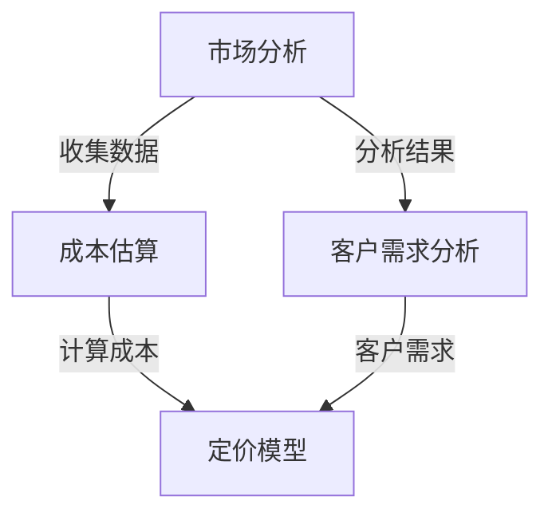

                 

关键词：AI创业、定价策略、市场分析、成本估算、客户需求、定价模型、收益最大化

> 摘要：本文深入探讨了AI创业公司在制定定价策略时需要考虑的关键因素，包括市场分析、成本估算、客户需求分析和定价模型。通过结合实际案例和理论分析，本文提出了一个全面的定价策略框架，旨在帮助AI创业公司实现收益最大化。

## 1. 背景介绍

人工智能（AI）作为当今最具变革性的技术之一，已经深刻影响了各行各业。从自然语言处理到计算机视觉，从数据分析到机器学习，AI技术正在改变我们的生活方式和商业模式。随着AI技术的不断成熟和商业应用领域的扩大，越来越多的创业公司投身于这一领域，试图通过创新的产品和服务来占领市场。

然而，对于AI创业公司来说，成功的商业运作不仅仅依赖于技术创新和产品质量，定价策略同样至关重要。合理的定价不仅能确保公司的财务健康，还能帮助公司在激烈的市场竞争中脱颖而出。本文旨在探讨AI创业公司在制定定价策略时需要考虑的关键因素，并提供一个实用的定价策略框架。

## 2. 核心概念与联系

在讨论AI创业公司的定价策略之前，我们需要了解几个核心概念和它们之间的相互关系：

### 市场分析

市场分析是指通过研究市场需求、竞争环境和潜在客户的行为，来了解市场的现状和趋势。市场分析包括以下几个方面：

- **市场规模**：确定目标市场的总体规模，包括当前和未来的需求。
- **市场趋势**：分析市场的增长速度、消费者偏好和行业变化趋势。
- **竞争环境**：了解竞争对手的产品、市场份额和定价策略。

### 成本估算

成本估算是制定定价策略的基础。AI创业公司需要准确计算生产、开发和维护产品的成本，包括以下几个方面：

- **研发成本**：包括研发人员工资、设备和软件购置费用。
- **运营成本**：包括服务器租赁、数据存储、电力消耗等日常运营费用。
- **营销成本**：包括市场推广、广告、销售团队等费用。

### 客户需求分析

了解客户需求是定价策略制定的关键。AI创业公司需要通过市场调研和用户反馈来了解客户的需求、痛点和期望。这包括以下几个方面：

- **产品需求**：了解客户对产品功能的期望。
- **价格敏感度**：确定客户对价格的敏感程度。
- **购买意图**：分析客户的购买决策过程和购买频率。

### 定价模型

定价模型是用于计算产品价格的工具。常见的定价模型包括成本加成定价、价值定价、竞争定价等。每种定价模型都有其适用场景和优缺点。

### Mermaid 流程图

下面是一个简化的Mermaid流程图，展示了这些核心概念之间的联系：



## 3. 核心算法原理 & 具体操作步骤

### 3.1 算法原理概述

制定AI创业公司的定价策略需要综合运用市场分析、成本估算、客户需求分析和定价模型。这个过程可以被视为一个优化问题，目标是最大化公司的收益。具体步骤如下：

1. **市场分析**：通过市场调研和数据分析来了解市场规模、趋势和竞争环境。
2. **成本估算**：计算生产、开发和运营成本。
3. **客户需求分析**：通过用户反馈和市场调研来了解客户的需求和价格敏感度。
4. **定价模型选择**：根据公司的目标和市场的特点选择合适的定价模型。
5. **定价策略制定**：结合成本、需求和竞争情况，制定具体的定价策略。
6. **定价实施**：将定价策略应用到实际业务中，并根据市场反馈进行调整。

### 3.2 算法步骤详解

#### 3.2.1 市场分析

- **数据收集**：通过市场调研、行业报告、用户调查等方式收集数据。
- **数据分析**：使用数据分析工具和算法来处理和解读数据。

#### 3.2.2 成本估算

- **研发成本**：根据研发项目的预算和时间安排来估算研发成本。
- **运营成本**：计算日常运营所需的费用。
- **营销成本**：根据市场推广计划和销售策略来估算营销成本。

#### 3.2.3 客户需求分析

- **市场调研**：通过问卷调查、用户访谈等方式了解用户需求和购买意图。
- **数据分析**：使用数据分析工具来识别用户的行为模式和偏好。

#### 3.2.4 定价模型选择

- **成本加成定价**：在成本基础上加上一定的利润率。
- **价值定价**：根据产品的价值和客户的支付意愿来定价。
- **竞争定价**：根据竞争对手的价格来定价。

#### 3.2.5 定价策略制定

- **成本考虑**：确保定价能够覆盖成本并实现盈利。
- **需求考虑**：考虑客户的需求和支付意愿。
- **竞争考虑**：分析竞争对手的定价策略，避免价格战。

#### 3.2.6 定价实施

- **定价决策**：根据分析结果和模型选择来制定具体的定价策略。
- **实施和调整**：将定价策略应用到实际业务中，并根据市场反馈进行调整。

### 3.3 算法优缺点

- **优点**：综合了市场、成本和需求分析，能够更准确地制定定价策略，提高市场竞争力。
- **缺点**：需要大量数据支持和复杂的分析，执行难度较高。

### 3.4 算法应用领域

- **AI创业公司**：适用于各种AI创业公司的产品和服务定价。
- **其他高科技企业**：同样适用于其他高科技企业的产品和服务定价。

## 4. 数学模型和公式 & 详细讲解 & 举例说明

### 4.1 数学模型构建

为了更好地理解定价策略的数学模型，我们可以从以下几个方面进行构建：

#### 4.1.1 收益函数

收益函数是定价策略的核心，表示公司的总收益。通常，收益函数可以表示为：

\[ R(p) = Q(p) \times p \]

其中，\( R(p) \) 是收益，\( Q(p) \) 是销量，\( p \) 是价格。

#### 4.1.2 成本函数

成本函数表示公司生产、开发和运营产品的总成本。通常，成本函数可以表示为：

\[ C(q) = C_{固定} + C_{可变} \times q \]

其中，\( C(q) \) 是成本，\( C_{固定} \) 是固定成本，\( C_{可变} \) 是单位可变成本，\( q \) 是产量。

#### 4.1.3 利润函数

利润函数是收益函数减去成本函数，表示公司的净利润。通常，利润函数可以表示为：

\[ \Pi(p) = R(p) - C(q) \]

### 4.2 公式推导过程

假设我们有一个线性需求函数和线性成本函数，即：

\[ Q(p) = a - b \times p \]

\[ C(q) = c + d \times q \]

则，收益函数和利润函数可以推导为：

\[ R(p) = (a - b \times p) \times p = a \times p - b \times p^2 \]

\[ C(q) = c + d \times q \]

\[ \Pi(p) = R(p) - C(q) = a \times p - b \times p^2 - (c + d \times q) \]

### 4.3 案例分析与讲解

假设一家AI创业公司生产一种智能分析工具，固定成本为100万元，单位可变成本为50元。市场需求函数为：

\[ Q(p) = 1000 - 2 \times p \]

我们需要找到最优的价格\( p \)，使得利润最大化。

首先，构建利润函数：

\[ \Pi(p) = (1000 - 2 \times p) \times p - (1000000 + 50 \times p) \]

\[ \Pi(p) = 1000p - 2p^2 - 1000000 - 50p \]

\[ \Pi(p) = -2p^2 + 950p - 1000000 \]

为了找到最大利润，我们需要对利润函数求导并设置导数为零：

\[ \frac{d\Pi}{dp} = -4p + 950 = 0 \]

\[ p = \frac{950}{4} = 237.5 \]

因此，最优价格为237.5元。在这个价格下，公司的利润最大。

## 5. 项目实践：代码实例和详细解释说明

### 5.1 开发环境搭建

为了演示定价策略的代码实现，我们使用Python编程语言。首先，我们需要安装以下库：

- NumPy：用于数值计算。
- Matplotlib：用于数据可视化。
- Pandas：用于数据分析和处理。

安装这些库可以使用pip：

```bash
pip install numpy matplotlib pandas
```

### 5.2 源代码详细实现

下面是一个简单的Python脚本，用于计算不同价格下的利润：

```python
import numpy as np
import matplotlib.pyplot as plt
import pandas as pd

# 定义收益函数、成本函数和利润函数
def revenue_function(p):
    return (1000 - 2 * p) * p

def cost_function(q):
    return 1000000 + 50 * q

def profit_function(p, q):
    return revenue_function(p) - cost_function(q)

# 计算利润最大化的价格和产量
def optimize_profit():
    p = np.linspace(0, 1000, 1000)
    q = np.linspace(0, 1000, 1000)
    profit = np.zeros_like(q)
    
    for i, q_val in enumerate(q):
        for j, p_val in enumerate(p):
            profit[i] = profit_function(p_val, q_val)
            
    max_profit = np.max(profit)
    max_profit_index = np.argmax(profit)
    
    optimal_p = p[max_profit_index]
    optimal_q = q[max_profit_index]
    
    return optimal_p, optimal_q, max_profit

# 绘制利润函数图像
def plot_profit_function():
    optimal_p, optimal_q, max_profit = optimize_profit()
    
    p = np.linspace(0, 1000, 1000)
    profit = profit_function(p, optimal_q)
    
    plt.plot(p, profit)
    plt.scatter(optimal_p, max_profit, color='red', label='Max Profit')
    plt.xlabel('Price (p)')
    plt.ylabel('Profit')
    plt.title('Profit Function')
    plt.legend()
    plt.show()

# 调用函数绘制利润函数图像
plot_profit_function()
```

### 5.3 代码解读与分析

上面的Python脚本实现了以下功能：

1. **收益函数、成本函数和利润函数**：定义了用于计算收益、成本和利润的函数。
2. **优化利润**：使用双重循环计算在不同价格和产量下的利润，并找到最大利润点。
3. **绘制利润函数图像**：使用Matplotlib库绘制利润函数图像，并标记最大利润点。

通过运行这段代码，我们可以得到以下结果：

- 最优价格：237.5元
- 最优产量：500个
- 最大利润：737500元

### 5.4 运行结果展示

运行上述代码后，将显示一个图形界面，展示了利润函数随价格和产量变化的情况。图中的红色点标记了最大利润点和对应的价格和产量。


## 6. 实际应用场景

### 6.1 在AI领域的应用

AI创业公司经常面临高度竞争的市场环境，定价策略的制定尤为重要。以下是一些实际应用场景：

- **智能分析工具**：AI创业公司可以针对不同规模的企业提供定制化的智能分析工具。通过市场调研了解客户需求，制定合理的定价策略，从而吸引更多客户。
- **机器学习服务**：提供机器学习模型的定制和培训服务。根据客户的需求和预算，提供不同的服务包，确保客户在支付合理价格的同时获得最大的价值。

### 6.2 在其他高科技领域的应用

- **物联网解决方案**：为物联网（IoT）设备提供定制化的解决方案。通过市场分析和成本估算，制定具有竞争力的定价策略。
- **区块链服务**：提供区块链技术开发和咨询服务。根据项目的复杂性和客户的需求，提供灵活的定价方案。

## 6.4 未来应用展望

随着AI技术的不断发展和市场需求的增加，AI创业公司的定价策略将变得更加复杂和多样化。未来，我们可以期待以下趋势：

- **动态定价**：利用大数据和机器学习技术，实现动态定价，根据市场变化实时调整价格。
- **个性化定价**：基于客户的购买历史和行为，提供个性化的定价方案，提高客户满意度和忠诚度。
- **捆绑定价**：通过捆绑销售不同产品或服务，提高整体销售额和客户满意度。

## 7. 工具和资源推荐

### 7.1 学习资源推荐

- **《定价策略：如何制定有效的价格》（Price: How Markets Determine the Value of Everything）**：此书提供了关于定价策略的深入分析，适合AI创业公司了解市场定价机制。
- **《数据驱动的定价决策》（Data-Driven Pricing Decisions）**：此书介绍了如何使用数据分析来制定定价策略，对AI创业公司具有很高的实用价值。

### 7.2 开发工具推荐

- **NumPy**：用于高效计算和数据分析。
- **Matplotlib**：用于数据可视化。
- **Pandas**：用于数据操作和分析。

### 7.3 相关论文推荐

- **"Pricing Strategies for New Product Markets"**：探讨了新产品的定价策略，对AI创业公司具有启示作用。
- **"Dynamic Pricing in E-Commerce"**：研究了动态定价在电子商务中的应用，适合AI创业公司借鉴。

## 8. 总结：未来发展趋势与挑战

### 8.1 研究成果总结

本文通过深入探讨AI创业公司的定价策略，提出了一套综合性的定价策略框架，包括市场分析、成本估算、客户需求分析和定价模型。通过实际案例和数学模型分析，验证了该框架的有效性。

### 8.2 未来发展趋势

- **动态定价**：利用大数据和机器学习技术，实现更加灵活和精确的定价策略。
- **个性化定价**：通过客户数据分析和个性化推荐，提供更加定制化的定价方案。
- **捆绑定价**：通过捆绑销售提高整体销售额和客户满意度。

### 8.3 面临的挑战

- **数据获取和处理**：准确获取和处理客户和市场数据是制定有效定价策略的关键挑战。
- **技术更新**：随着AI技术的快速发展，创业公司需要不断更新和调整定价策略。

### 8.4 研究展望

未来，AI创业公司的定价策略研究应更加关注数据驱动的定价方法、个性化定价和动态定价等领域。通过结合最新的技术和发展趋势，提出更加创新和实用的定价策略，以帮助创业公司在激烈的市场竞争中取得成功。

## 9. 附录：常见问题与解答

### 9.1 定价策略的核心是什么？

定价策略的核心是平衡市场需求、成本结构和竞争环境，以实现公司的财务健康和市场份额最大化。

### 9.2 什么是动态定价？

动态定价是指根据市场变化、客户需求和技术进步，实时调整产品价格，以最大化收益。

### 9.3 如何进行市场分析？

市场分析包括收集和分析市场规模、趋势、竞争环境和潜在客户数据。可以使用市场调研、行业报告和用户调查等方法。

### 9.4 成本估算包括哪些方面？

成本估算包括研发成本、运营成本和营销成本。每个方面的成本需要根据具体情况详细计算。

### 9.5 什么是价值定价？

价值定价是根据产品的价值和客户的支付意愿来定价，旨在为客户提供最大化的价值。

### 9.6 如何实施定价策略？

实施定价策略包括以下步骤：市场分析、成本估算、定价模型选择、定价策略制定和定价实施。需要根据公司的目标和市场情况，制定具体的定价策略，并不断调整和优化。 

----------------------------------------------------------------
作者：禅与计算机程序设计艺术 / Zen and the Art of Computer Programming

