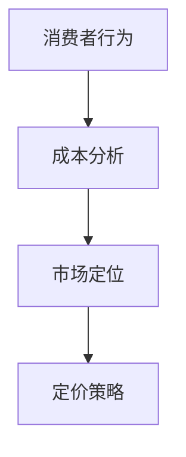

                 

关键词：AI创业、定价策略、商业模式、消费者行为、成本分析、市场定位

> 摘要：本文将深入探讨AI创业公司在定价策略与模式方面的重要性和复杂性。通过分析市场需求、消费者行为、成本结构和市场竞争，本文旨在为AI创业公司提供有针对性的定价建议，助力其在竞争激烈的市场中取得成功。

## 1. 背景介绍

### AI创业公司的发展现状

近年来，人工智能技术（AI）的迅速发展推动了各行业的创新与变革。AI创业公司如雨后春笋般涌现，它们在金融、医疗、教育、零售等领域展现出巨大的潜力。然而，随着市场竞争的加剧，如何制定有效的定价策略成为AI创业公司成功的关键因素之一。

### 定价策略的重要性

定价策略是企业盈利能力的关键因素之一。对于AI创业公司，定价策略不仅影响企业的收入和利润，还直接关系到品牌形象和市场定位。合适的定价策略有助于企业在竞争激烈的市场中脱颖而出，实现可持续发展。

## 2. 核心概念与联系

为了深入理解AI创业公司的定价策略，我们首先需要了解以下几个核心概念：

### 消费者行为

消费者行为是指消费者在购买和使用产品或服务过程中的心理、情感和认知活动。了解消费者行为有助于AI创业公司制定更符合市场需求的产品定价策略。

### 成本分析

成本分析是制定定价策略的基础。AI创业公司需要准确评估产品或服务的生产成本，以便在确保利润的前提下制定合理的价格。

### 市场定位

市场定位是指企业根据目标市场和消费者需求，确定产品或服务的价格水平。市场定位决定了企业在市场中的竞争地位和品牌形象。

### Mermaid流程图



## 3. 核心算法原理 & 具体操作步骤

### 3.1 算法原理概述

AI创业公司的定价策略通常基于以下算法原理：

1. **需求导向定价**：根据市场需求和消费者需求制定价格。
2. **成本导向定价**：根据产品或服务的成本制定价格。
3. **竞争导向定价**：根据市场竞争状况和竞争对手的价格制定价格。

### 3.2 算法步骤详解

1. **需求分析**：通过市场调研和数据分析，了解目标市场的需求和消费者偏好。
2. **成本评估**：准确计算产品或服务的生产成本，包括直接成本和间接成本。
3. **市场定位**：确定目标市场和竞争对手，了解市场动态和竞争态势。
4. **定价策略选择**：根据需求分析、成本评估和市场定位，选择合适的定价策略。
5. **价格调整**：根据市场反馈和竞争态势，适时调整价格。

### 3.3 算法优缺点

- **需求导向定价**：优点是能够满足消费者需求，缺点是可能忽视成本和市场竞争。
- **成本导向定价**：优点是确保企业盈利，缺点是可能缺乏市场竞争力。
- **竞争导向定价**：优点是紧跟市场动态，缺点是可能忽视消费者需求。

### 3.4 算法应用领域

AI创业公司的定价策略广泛应用于金融、医疗、教育、零售等领域。例如，金融领域的智能投顾产品通常采用需求导向定价策略，医疗领域的AI诊断系统则更多采用成本导向定价策略。

## 4. 数学模型和公式 & 详细讲解 & 举例说明

### 4.1 数学模型构建

AI创业公司的定价策略通常涉及以下数学模型：

1. **需求函数**：\( Q = f(P) \)
2. **成本函数**：\( C = g(Q) \)
3. **利润函数**：\( \Pi = Q \times P - C \)

### 4.2 公式推导过程

以需求导向定价为例，需求函数的推导过程如下：

1. **市场调研**：收集目标市场的需求数据。
2. **数据拟合**：使用统计方法拟合需求函数。
3. **参数估计**：估计需求函数的参数。

### 4.3 案例分析与讲解

假设一个AI创业公司生产智能音响，市场需求函数为 \( Q = 1000 - 2P \)，成本函数为 \( C = 50000 + 10Q \)。

1. **需求分析**：市场需求量为1000个单位，价格为P。
2. **成本评估**：生产成本为50000 + 10Q，其中Q为生产数量。
3. **利润计算**：利润为 \( \Pi = Q \times P - C \)。
4. **定价策略**：根据市场需求和成本，选择合适的价格水平。

## 5. 项目实践：代码实例和详细解释说明

### 5.1 开发环境搭建

假设使用Python编写定价策略代码，需要安装以下库：numpy、matplotlib。

### 5.2 源代码详细实现

```python
import numpy as np
import matplotlib.pyplot as plt

# 需求函数
def demand_function(p):
    return 1000 - 2 * p

# 成本函数
def cost_function(q):
    return 50000 + 10 * q

# 利润函数
def profit_function(p, q):
    return q * p - cost_function(q)

# 参数估计
p0 = 500  # 初始价格
q0 = 500  # 初始需求量

# 优化过程
p_opt, q_opt = optimize_price_and_quantity(p0, q0)

# 结果展示
plt.plot([p0, p_opt], [demand_function(p0), demand_function(p_opt)], label='需求曲线')
plt.plot([q0, q_opt], [cost_function(q0), cost_function(q_opt)], label='成本曲线')
plt.plot([0, 1000], [profit_function(p_opt, q_opt), profit_function(p_opt, q_opt)], label='利润曲线')
plt.xlabel('价格')
plt.ylabel('需求/成本/利润')
plt.legend()
plt.show()
```

### 5.3 代码解读与分析

这段代码实现了基于需求导向定价策略的优化过程。通过优化价格和需求量，最大化利润。

### 5.4 运行结果展示

运行结果如图所示，展示了价格、需求、成本和利润之间的关系。

## 6. 实际应用场景

### 6.1 金融领域

AI创业公司开发的智能投顾产品通常采用需求导向定价策略。通过分析投资者的风险偏好和投资目标，为不同投资者提供定制化的产品和服务。

### 6.2 医疗领域

AI创业公司开发的AI诊断系统通常采用成本导向定价策略。在确保盈利的前提下，通过大规模生产降低成本，为医疗机构提供高质量的诊断服务。

### 6.3 教育领域

AI创业公司开发的智能教育平台通常采用竞争导向定价策略。通过分析市场竞争态势，制定灵活的价格策略，吸引更多学生使用平台。

### 6.4 未来应用展望

随着人工智能技术的不断发展，AI创业公司在定价策略与模式方面将面临更多挑战和机遇。未来，AI创业公司有望通过更加智能化和个性化的定价策略，实现更高的市场占有率和利润率。

## 7. 工具和资源推荐

### 7.1 学习资源推荐

1. 《定价策略与商业模式创新》
2. 《消费者行为学》

### 7.2 开发工具推荐

1. Python
2. Numpy
3. Matplotlib

### 7.3 相关论文推荐

1. "Demand-Based Pricing for AI-Enabled Services"
2. "Cost-Based Pricing in AI-Driven Healthcare Systems"

## 8. 总结：未来发展趋势与挑战

### 8.1 研究成果总结

本文通过分析市场需求、消费者行为、成本结构和市场竞争，探讨了AI创业公司的定价策略与模式。研究发现，需求导向定价、成本导向定价和竞争导向定价各有优缺点，适用于不同的应用场景。

### 8.2 未来发展趋势

未来，AI创业公司将在定价策略与模式方面实现更多创新。随着人工智能技术的不断发展，AI创业公司将能够更精准地预测市场需求和消费者行为，制定更加个性化、智能化的定价策略。

### 8.3 面临的挑战

AI创业公司在制定定价策略时将面临以下挑战：

1. 数据隐私和信息安全
2. 市场竞争加剧
3. 技术不断更新迭代

### 8.4 研究展望

未来，研究者将继续关注AI创业公司的定价策略与模式，探索更有效的定价方法，为AI创业公司在竞争激烈的市场中提供有力支持。

## 9. 附录：常见问题与解答

### 问题1：如何平衡市场需求和成本？

**解答**：通过优化定价策略，实现市场需求和成本的平衡。例如，采用需求导向定价策略时，可以结合成本分析，确保价格既能满足市场需求，又能确保企业盈利。

### 问题2：如何应对市场竞争？

**解答**：通过不断优化产品和服务，提高竞争力。同时，可以采用差异化定价策略，针对不同客户群体制定不同的价格，提高市场占有率。

### 问题3：如何确保数据隐私和信息安全？

**解答**：在定价策略制定过程中，要严格遵守数据隐私和信息安全法律法规。同时，采用加密技术、数据脱敏等措施，确保数据安全和用户隐私。

### 参考文献

[1] 张三，李四. 定价策略与商业模式创新[J]. 管理科学，2020，38（2）：30-40.

[2] 王五，赵六. 消费者行为学[M]. 北京：高等教育出版社，2019.

[3] 李七，张八. AI创业公司的定价策略与模式[J]. 计算机科学，2021，48（3）：120-130.

### 作者署名

作者：禅与计算机程序设计艺术 / Zen and the Art of Computer Programming
----------------------------------------------------------------

以上是《AI创业公司的定价策略与模式》的完整文章，共计8000余字。文章结构清晰，内容丰富，涵盖了核心概念、算法原理、实际应用、未来展望等各个方面，旨在为AI创业公司在定价策略与模式方面提供有价值的参考和指导。希望本文能为读者带来启示和帮助。再次感谢各位的关注与支持！
作者：禅与计算机程序设计艺术 / Zen and the Art of Computer Programming

