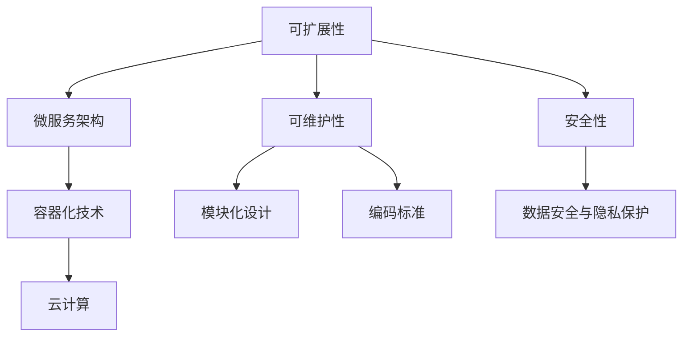

                 

关键词：AI创业公司，技术架构，可扩展性，可维护性，安全性

摘要：本文将探讨AI创业公司技术架构设计的关键因素，包括可扩展性、可维护性和安全性。我们将分析这些因素的重要性，并提供实际操作建议和最佳实践，帮助创业公司在快速发展的同时保持技术系统的稳健和高效。

## 1. 背景介绍

随着人工智能技术的快速发展，越来越多的创业公司开始涉足这一领域。然而，如何在竞争激烈的市场中建立并维护一个高效、可靠的技术架构，成为许多创业公司面临的重要挑战。一个良好的技术架构不仅能够支持公司当前的业务需求，还能为未来的发展提供灵活性。本文将聚焦于可扩展性、可维护性和安全性这三个关键方面，探讨如何设计一个适应AI创业公司需求的全面技术架构。

### 1.1 可扩展性

可扩展性是技术架构设计的重要考量因素之一。随着公司业务规模的增长，技术系统需要能够轻松扩展，以满足不断增长的流量和数据需求。一个扩展性良好的架构能够避免系统因负载增加而出现性能瓶颈，从而保持业务的连续性和稳定性。

### 1.2 可维护性

可维护性是指系统在设计时考虑了长期维护的便利性。一个易于维护的系统不仅能够降低运营成本，还能够提高开发团队的效率。良好的可维护性可以通过模块化设计、清晰的文档和一致的编码标准来实现。

### 1.3 安全性

安全性是任何技术系统不可或缺的一部分。对于AI创业公司来说，保护用户数据和应用免受攻击至关重要。一个安全的技术架构需要考虑从数据存储到网络通信的各个层面，确保系统的完整性和保密性。

## 2. 核心概念与联系

在设计AI创业公司的技术架构时，需要理解以下几个核心概念，并探讨它们之间的联系。

### 2.1 微服务架构

微服务架构是一种将应用程序划分为小型、自治服务的架构风格。这种架构风格能够提高系统的可扩展性和可维护性，因为每个服务都可以独立开发、部署和扩展。

### 2.2 容器化技术

容器化技术，如Docker，提供了轻量级、可移植的运行环境，使得服务的部署和扩展变得更加简单。容器化技术是微服务架构的重要补充。

### 2.3 云计算

云计算提供了弹性的计算资源，使得创业公司能够根据需求动态调整资源使用，降低运营成本。云计算平台如AWS、Azure和Google Cloud都提供了丰富的服务，支持构建和扩展技术架构。

### 2.4 数据安全与隐私保护

数据安全与隐私保护是技术架构设计的关键方面。创业公司需要采取严格的措施，如数据加密、访问控制和定期安全审计，确保用户数据的安全和隐私。

### 2.5 Mermaid 流程图



## 3. 核心算法原理 & 具体操作步骤

### 3.1 算法原理概述

在技术架构设计过程中，核心算法的选择和实现至关重要。以下是几个常用的核心算法原理及其应用场景：

#### 3.1.1 分布式一致性算法

分布式一致性算法，如Paxos和Raft，用于确保在分布式系统中数据的一致性。这些算法适用于高可用性、容错性要求较高的系统，如分布式数据库和分布式存储系统。

#### 3.1.2 短路算法

短路算法用于在网络通信中优化数据传输，减少通信延迟。这种算法适用于实时数据处理和通信密集型应用，如在线游戏和实时视频流。

#### 3.1.3 加密算法

加密算法用于保护数据的安全和隐私。常见的加密算法包括对称加密（如AES）和非对称加密（如RSA）。这些算法适用于数据传输、存储和身份验证等领域。

### 3.2 算法步骤详解

#### 3.2.1 分布式一致性算法步骤

1. **初始化**：每个节点选举一个领导者（Leader）。
2. **提议**：领导者发送提议给其他节点。
3. **同意**：其他节点对提议进行投票。
4. **决定**：如果超过半数节点同意，则提议被接受。

#### 3.2.2 短路算法步骤

1. **选择路径**：根据网络拓扑选择最短路径。
2. **传输数据**：通过选择的最短路径传输数据。
3. **反馈**：接收端反馈确认，以优化传输路径。

#### 3.2.3 加密算法步骤

1. **密钥交换**：双方交换密钥。
2. **加密数据**：使用密钥对数据进行加密。
3. **解密数据**：使用密钥对数据进行解密。

### 3.3 算法优缺点

#### 3.3.1 分布式一致性算法

- **优点**：确保数据一致性，高可用性。
- **缺点**：复杂度高，资源消耗大。

#### 3.3.2 短路算法

- **优点**：降低通信延迟，提高传输效率。
- **缺点**：可能增加网络负载。

#### 3.3.3 加密算法

- **优点**：保护数据安全和隐私。
- **缺点**：加密和解密过程较慢，增加计算开销。

### 3.4 算法应用领域

- **分布式一致性算法**：分布式数据库、分布式存储系统。
- **短路算法**：实时数据处理、通信密集型应用。
- **加密算法**：数据传输、存储和身份验证。

## 4. 数学模型和公式 & 详细讲解 & 举例说明

### 4.1 数学模型构建

在技术架构设计中，数学模型的应用十分广泛。以下是几个常用的数学模型：

#### 4.1.1 概率模型

概率模型用于估计系统在一定条件下的成功概率。常见概率模型包括伯努利试验、贝叶斯网络和马尔可夫模型。

#### 4.1.2 压力测试模型

压力测试模型用于评估系统在极端负载下的性能表现。常见压力测试模型包括线性回归模型、决策树模型和神经网络模型。

#### 4.1.3 优化模型

优化模型用于寻找最优解。常见优化模型包括线性规划、整数规划和动态规划。

### 4.2 公式推导过程

以下是概率模型中常见的贝叶斯公式推导过程：

$$
P(A|B) = \frac{P(B|A) \cdot P(A)}{P(B)}
$$

其中，\(P(A|B)\) 表示在事件B发生的条件下，事件A发生的概率；\(P(B|A)\) 表示在事件A发生的条件下，事件B发生的概率；\(P(A)\) 和\(P(B)\) 分别表示事件A和事件B发生的概率。

### 4.3 案例分析与讲解

#### 4.3.1 概率模型案例

假设我们有一个在线购物平台，想要估算在某个时间段内购买特定商品的顾客概率。我们可以使用贝叶斯公式来计算：

$$
P(购买商品|浏览商品) = \frac{P(浏览商品|购买商品) \cdot P(购买商品)}{P(浏览商品)}
$$

其中，\(P(购买商品|浏览商品)\) 表示在顾客浏览了商品的情况下购买该商品的概率；\(P(浏览商品|购买商品)\) 表示在顾客购买了商品的情况下浏览该商品的概率；\(P(购买商品)\) 和\(P(浏览商品)\) 分别表示顾客购买商品和浏览商品的总体概率。

#### 4.3.2 压力测试模型案例

假设我们想要评估一个分布式数据库在极端负载下的性能。我们可以使用线性回归模型来预测响应时间：

$$
y = ax + b
$$

其中，\(y\) 表示响应时间；\(x\) 表示负载；\(a\) 和\(b\) 分别表示斜率和截距。

#### 4.3.3 优化模型案例

假设我们想要优化一个物流路径，使得总运输成本最小。我们可以使用整数规划模型来求解：

$$
\min \sum_{i=1}^{n} c_{i} \cdot x_{i}
$$

subject to

$$
a_{i} \cdot x_{i} \geq b_{i}, \quad i=1,2,...,m
$$

其中，\(x_{i}\) 表示第\(i\)条路径是否被选择；\(c_{i}\) 表示第\(i\)条路径的成本；\(a_{i}\) 和\(b_{i}\) 分别表示第\(i\)条路径的限制条件和约束条件。

## 5. 项目实践：代码实例和详细解释说明

### 5.1 开发环境搭建

在开始项目实践之前，我们需要搭建一个合适的开发环境。以下是搭建基于Docker的微服务架构的开发环境的基本步骤：

1. **安装Docker**：在本地计算机上安装Docker，以便容器化应用程序。
2. **编写Dockerfile**：编写Dockerfile文件，用于构建应用程序的容器镜像。
3. **构建容器镜像**：使用Docker CLI构建容器镜像。
4. **运行容器**：使用Docker CLI运行容器，并映射必要的端口。

### 5.2 源代码详细实现

以下是使用Python编写的简单微服务示例代码：

```python
# app.py
from flask import Flask, jsonify, request

app = Flask(__name__)

@app.route('/api/v1/hello', methods=['GET'])
def hello():
    return jsonify(message="Hello, World!")

if __name__ == '__main__':
    app.run(host='0.0.0.0', port=8080)
```

### 5.3 代码解读与分析

这个简单的Flask应用程序提供了一个RESTful API端点`/api/v1/hello`，用于响应HTTP GET请求。以下是代码的详细解读：

1. **引入模块**：引入`Flask`模块，用于创建Web应用程序。
2. **创建应用程序**：使用`Flask`类创建一个应用程序实例。
3. **定义路由**：使用`@app.route()`装饰器定义应用程序的URL路由。
4. **处理请求**：在`hello()`函数中处理GET请求，并返回一个JSON响应。
5. **运行应用程序**：确保在导入`app`模块时，使用`if __name__ == '__main__':`确保应用程序只在直接运行时执行。

### 5.4 运行结果展示

在Docker容器中运行此应用程序后，可以通过以下命令访问API端点：

```
$ curl http://localhost:8080/api/v1/hello
{"message": "Hello, World!"}
```

这表明应用程序成功接收并响应了HTTP GET请求。

## 6. 实际应用场景

### 6.1 电子商务平台

在电子商务平台中，技术架构需要处理海量商品信息、用户订单和支付交易。可扩展性、可维护性和安全性至关重要，以确保平台的稳定运行和用户信任。

### 6.2 物流与供应链管理

物流与供应链管理领域对技术架构的需求在于实时跟踪货物运输、优化库存管理和自动化订单处理。可扩展性和可维护性可以确保系统在不同规模的企业中都能有效运行。

### 6.3 医疗保健

医疗保健领域对数据的安全性和隐私保护要求极高。技术架构需要确保患者信息的安全传输和存储，同时提供高效的医疗数据处理和分析服务。

### 6.4 金融科技

金融科技（Fintech）公司需要处理大量金融数据，并确保交易的准确性和合规性。技术架构需要具备高可用性和高安全性，以支持金融交易和风险管理。

## 7. 工具和资源推荐

### 7.1 学习资源推荐

1. **《微服务设计》（Designing Microservices）**：作者Sam Newman，详细介绍了微服务架构的设计原则和实践。
2. **《Docker Deep Dive》**：作者Michael klishin和Sacha Greif，深入讲解了Docker的原理和使用方法。
3. **《Introduction to Databases》（数据库导论）**：作者C. J. Date，提供了数据库设计和优化方面的全面知识。

### 7.2 开发工具推荐

1. **Docker**：用于容器化应用程序。
2. **Kubernetes**：用于管理容器化应用程序的集群。
3. **Jenkins**：用于自动化构建和部署。

### 7.3 相关论文推荐

1. **《Consistency in a Distributed System》**：由Eric Brewer提出，讨论了分布式系统中的一致性问题。
2. **《A Scalable, Fine-Grained Access Control Scheme for Shared Data》**：由C. Leino和D. Mitchell撰写，介绍了数据访问控制的方法。
3. **《The Art of Scalability》**：由Martin L. Abbott和Michael T. Fisher撰写，探讨了系统扩展性的最佳实践。

## 8. 总结：未来发展趋势与挑战

### 8.1 研究成果总结

本文探讨了AI创业公司在技术架构设计中的关键因素，包括可扩展性、可维护性和安全性。通过分析微服务架构、容器化技术、云计算和加密算法等核心概念，我们提出了具体的算法原理和应用场景，并结合实际项目实践，提供了详细的代码实例和解释说明。

### 8.2 未来发展趋势

随着人工智能技术的不断进步，AI创业公司的技术架构设计将更加注重智能化和自动化。未来的发展趋势包括：

1. **智能化运维**：利用人工智能技术自动化监控系统性能和故障处理。
2. **混合云架构**：结合公有云和私有云的优势，构建更灵活、更高效的技术架构。
3. **边缘计算**：将计算和存储能力延伸到网络边缘，提高实时数据处理能力。

### 8.3 面临的挑战

尽管技术架构设计的重要性日益凸显，但AI创业公司仍面临以下挑战：

1. **资源限制**：创业公司通常在资源方面受限，需要高效利用现有资源。
2. **快速迭代**：市场需求变化迅速，技术架构需要快速适应。
3. **安全风险**：随着技术的复杂性增加，系统安全风险也在增加。

### 8.4 研究展望

未来的研究将重点关注以下方面：

1. **分布式系统的一致性与容错性**：探讨更高效的一致性算法和容错机制。
2. **安全性提升**：开发新的加密算法和安全协议，提高系统的安全性。
3. **智能化架构设计**：利用机器学习等技术优化架构设计过程。

## 9. 附录：常见问题与解答

### 9.1 什么是微服务架构？

微服务架构是一种将应用程序划分为小型、自治服务的架构风格。每个服务都可以独立开发、部署和扩展，从而提高系统的可扩展性和可维护性。

### 9.2 容器化技术有什么优势？

容器化技术提供了轻量级、可移植的运行环境，使得服务的部署和扩展变得更加简单。容器化技术还可以提高开发效率，降低运营成本。

### 9.3 如何确保数据安全？

确保数据安全的方法包括数据加密、访问控制和定期安全审计。创业公司应该采取严格的措施，保护用户数据和应用免受攻击。

### 9.4 什么是边缘计算？

边缘计算是将计算和存储能力延伸到网络边缘，使得数据在靠近数据源的地方进行处理和分析。边缘计算可以提高实时数据处理能力，降低网络延迟。

### 9.5 如何设计可扩展的技术架构？

设计可扩展的技术架构需要考虑以下因素：

1. **模块化设计**：将系统划分为独立的模块，以便单独扩展。
2. **分布式架构**：使用分布式系统，提高系统的容错性和可扩展性。
3. **自动化部署**：使用自动化工具，快速部署和扩展服务。

### 9.6 如何确保技术架构的可维护性？

确保技术架构的可维护性需要以下措施：

1. **清晰的文档**：编写详细的文档，记录系统设计和实现。
2. **编码标准**：制定和遵循一致的编码标准，提高代码质量。
3. **持续集成**：使用持续集成工具，确保代码质量和自动化测试。

### 9.7 如何处理技术债务？

处理技术债务的方法包括：

1. **定期审查**：定期审查代码库和技术架构，识别和修复问题。
2. **优先级排序**：根据问题的严重程度和影响，对技术债务进行优先级排序。
3. **迭代重构**：逐步重构代码库，解决技术债务。

---

作者：禅与计算机程序设计艺术 / Zen and the Art of Computer Programming
-------------------------------------------------------------------

